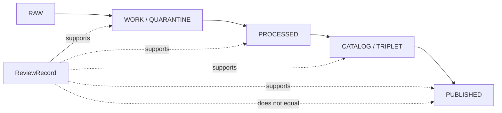

<!-- [KFM_META_BLOCK_V2]
doc_id: kfm://doc/contracts-governance-review-record
title: ReviewRecord Governance Contract
type: semantic-contract
version: v0.1
status: draft
owners: OWNER_TBD — Governance steward · Contract steward · Policy steward · Release steward · Docs steward
created: 2026-06-24
updated: 2026-06-24
policy_label: public; contracts; governance; review; separation-of-duties; semantic-contract
related:
  - ./README.md
  - ../README.md
  - ../release/README.md
  - ../../docs/governance/SEPARATION_OF_DUTIES.md
  - ../../docs/governance/ESCALATION.md
  - ../../docs/architecture/contract-schema-policy-split.md
  - ../../docs/architecture/publication/RELEASE_GATES.md
  - ../../docs/registers/DRIFT_REGISTER.md
  - ../../docs/registers/VERIFICATION_BACKLOG.md
  - ../../schemas/contracts/v1/governance/review_record.schema.json
  - ../../policy/governance/
  - ../../policy/release/
  - ../../tests/contracts/
  - ../../fixtures/governance/
tags: [kfm, contracts, governance, review-record, semantic-contract, review, approval, separation-of-duties, evidence, policy, release-gates, rollback]
notes:
  - "Defines semantic meaning for a ReviewRecord object family."
  - "This contract does not prove that CODEOWNERS, branch protection, CI, policy bundles, schemas, fixtures, or runtime enforcement exist. Those remain NEEDS VERIFICATION until verified from repo/platform evidence."
  - "A ReviewRecord may support governance and release decisions, but it is not itself a ReleaseManifest, PromotionDecision, PolicyDecision, ADR, or EvidenceBundle."
  - "Previous file was a scaffold; rollback target is blob SHA `5f7093f16b92ed0b53170ffe7a44608322a25a81`."
[/KFM_META_BLOCK_V2] -->

<a id="top"></a>

# ReviewRecord

> Semantic contract for an inspectable KFM review event: who reviewed what, in which role, against which evidence and policy context, what they found, and what disposition they recorded.

<p>
  
  
  
  
  
  
</p>

**Status:** draft semantic contract  
**Path:** `contracts/governance/ReviewRecord.md`  
**Object family:** `ReviewRecord`  
**Owning lane:** [`contracts/governance/`](./README.md)  
**Schema home:** `schemas/contracts/v1/governance/review_record.schema.json` — PROPOSED / NEEDS VERIFICATION  
**Truth posture:** CONFIRMED scaffold replaced · CONFIRMED governance lane defines `ReviewRecord` as an inspectable review event · PROPOSED field roster until schema, fixtures, policy, and tests are verified

## Quick jumps

[Purpose](#purpose) · [Scope](#scope) · [Anti-collapse rules](#anti-collapse-rules) · [Semantic shape](#semantic-shape) · [Disposition vocabulary](#disposition-vocabulary) · [Lifecycle fit](#lifecycle-fit) · [Separation of duties](#separation-of-duties) · [Validation](#validation) · [Examples](#examples) · [Rollback](#rollback)

---

## Purpose

A `ReviewRecord` records a review event that can be inspected later.

It exists to answer:

- who reviewed the item;
- what role they were acting in;
- what artifact, claim, source, schema, policy, release candidate, map layer, AI output, or document they reviewed;
- what evidence, policy, release, or sensitivity context they considered;
- what finding or disposition they recorded;
- what follow-up, blocker, abstain reason, denial reason, or approval boundary applies.

A `ReviewRecord` is part of KFM's trust spine because governance must be inspectable, correctable, and auditable. It is not a substitute for the reviewed artifact, policy decision, release manifest, evidence bundle, or platform enforcement.

---

## Scope

`ReviewRecord` belongs in the governance contract family.

It may be used for reviews of:

- source descriptors and source-role assignments;
- EvidenceBundle support and citation posture;
- schemas, semantic contracts, fixtures, validators, and policy bundles;
- sensitivity, rights, sovereignty, living-person, ecology, archaeology, infrastructure, and location-exposure decisions;
- release candidates, rollback targets, correction notices, withdrawal notices, and public artifacts;
- AI-surface outputs, Focus Mode answers, Evidence Drawer payloads, and governed UI/API surfaces;
- documentation changes that alter doctrine, directory placement, lifecycle gates, or governance posture.

A `ReviewRecord` may be created before, during, or after a promotion decision, but it does not itself promote anything.

---

## Anti-collapse rules

| Do not collapse `ReviewRecord` into | Why |
|---|---|
| `PolicyDecision` | Policy decides allow/deny/restrict/abstain. Review records who assessed what and why. |
| `PromotionDecision` | Promotion decides whether an artifact advances. Review may support promotion but does not equal promotion. |
| `ReleaseManifest` | A release manifest records what was released. Review records review posture before/around that release. |
| `EvidenceBundle` | Evidence supports claims. Review records human or governed-process assessment of evidence and artifacts. |
| `CitationValidationReport` | Citation validation tests citation support. Review may cite that report but does not replace it. |
| `ADR` | ADRs record accepted architectural decisions. Review records assessment or approval posture around a change. |
| GitHub comment or chat message | Comments may be evidence for a review, but a ReviewRecord should be structured, scoped, and auditable. |
| CODEOWNERS / branch protection / CI check | Platform enforcement may require or validate review, but it is not the semantic review record itself. |

---

## Semantic shape

The field roster below is a semantic proposal. Machine-checkable structure belongs in `schemas/contracts/v1/governance/review_record.schema.json` or the accepted schema home.

| Field | Meaning | Required posture |
|---|---|---|
| `review_record_id` | Deterministic or stable identifier for this review event. | Required; deterministic where practical. |
| `schema_version` | Version of the ReviewRecord schema/contract family. | Required once schema exists. |
| `reviewed_object_ref` | Reference to the artifact, object, PR, file, release candidate, claim, source, or output reviewed. | Required. |
| `review_scope` | Bounded scope of the review: docs, source, schema, policy, domain, sensitivity, release, AI, UI, data, or cross-cutting. | Required; closed enum recommended. |
| `reviewer` | Reviewer identity or service identity. | Required; must not expose private data beyond governance need. |
| `reviewer_role` | Role used for this review, such as docs steward, contract steward, domain steward, source steward, policy steward, sensitivity reviewer, release authority, or AI-surface steward. | Required; vocabulary NEEDS VERIFICATION. |
| `author_ref` | Author or producer of the reviewed object when known. | Required for separation-of-duties checks when applicable. |
| `reviewed_at` | Time the review was recorded. | Required; timezone/format enforced by schema. |
| `basis_refs[]` | EvidenceBundle, SourceDescriptor, PolicyDecision, CitationValidationReport, schema, fixture, ADR, release artifact, or document references used as review basis. | Required when the review affects trust-bearing output. |
| `policy_context_refs[]` | Policy bundles or PolicyDecision objects considered during review. | Required for policy-significant review. |
| `sensitivity_context` | Sensitivity, rights, sovereignty, privacy, location-exposure, or review-stage context. | Required when applicable; fail closed if unknown. |
| `finding_summary` | Short human-readable finding. | Required, but never sufficient as proof by itself. |
| `findings[]` | Structured review findings, blockers, warnings, requested changes, or confirmations. | Recommended; required for non-approval outcomes. |
| `disposition` | Review outcome from the approved vocabulary. | Required. |
| `disposition_reason` | Why the disposition was chosen. | Required for anything except purely informational review. |
| `conditions[]` | Conditions that must be met before use, promotion, release, merge, or public display. | Required when approval is conditional. |
| `expires_at` | Optional time when review must be refreshed. | Required for time-sensitive or source-cadence-dependent reviews. |
| `supersedes_review_record_id` | Previous review replaced by this one. | Optional; required for revision chains. |
| `related_release_refs[]` | Release candidate, PromotionDecision, ReleaseManifest, RollbackCard, CorrectionNotice, or WithdrawalNotice references. | Required when review supports release or rollback. |
| `receipt_refs[]` | RunReceipt, AIReceipt, ValidationReport, audit log, or platform check references. | Required when review depends on tool/process output. |
| `rollback_target_ref` | Where to revert if the reviewed change is later rejected or found unsafe. | Required for release-significant review. |

---

## Disposition vocabulary

The following dispositions are PROPOSED until schema and policy vocabularies are verified.

| Disposition | Meaning | Trust effect |
|---|---|---|
| `approve` | Reviewer finds the scoped object acceptable for the stated next step. | Does not publish by itself. May support merge, promotion, or release only with companion gates. |
| `approve_with_conditions` | Reviewer approves only if listed conditions are met. | Blocks final use until conditions are resolved and referenced. |
| `request_changes` | Reviewer found issues that must be fixed before the next step. | Blocks trust-bearing action. |
| `abstain` | Reviewer cannot decide because evidence, scope, authority, or context is insufficient. | Fails closed for trust-bearing action. |
| `deny` | Reviewer finds the action unsafe, impermissible, unsupported, or out of policy. | Blocks the action unless an authorized escalation overrides it. |
| `escalate` | Reviewer cannot or should not decide at this level. | Requires EscalationRecord or accepted escalation path. |
| `informational` | Review records context without approving or blocking. | No approval or release authority. |

Unknown dispositions fail closed.

---

## Lifecycle fit

`ReviewRecord` can attach to multiple lifecycle gates, but it never replaces the lifecycle state itself.



Promotion remains a governed state transition. A review may be required before promotion, but the review record is not the promotion event.

---

## Separation of duties

A `ReviewRecord` should make separation-of-duties inspectable.

Minimum semantics:

- identify the reviewed object and its author/producer when known;
- identify the reviewer and reviewer role;
- identify whether the reviewer is independent from the author/producer where independence is required;
- identify which governance rule required review;
- identify whether additional roles are still required before merge, promotion, release, or public display;
- record `abstain`, `deny`, or `escalate` when the reviewer lacks authority, evidence, independence, or context.

For policy-significant release, sensitive-lane changes, rights/sovereignty decisions, AI-surface changes, trust-membrane changes, or doctrine-changing edits, a single unqualified self-review is not enough unless an accepted governance rule explicitly permits it.

---

## Validation

A ReviewRecord is valid only when the accepted schema, policy, and tests say it is valid. Until those are verified, this contract defines intended meaning only.

Validation should eventually prove:

- `review_record_id` is present and stable;
- `reviewed_object_ref`, `reviewer`, `reviewer_role`, `reviewed_at`, and `disposition` are present;
- disposition uses a closed vocabulary;
- required `basis_refs[]` resolve when the review affects trust-bearing output;
- policy-significant reviews reference policy context;
- release-significant reviews reference release and rollback context;
- self-review is blocked or flagged when separation of duties requires independence;
- `approve_with_conditions` cannot be treated as unconditional approval;
- `abstain`, `deny`, `request_changes`, and `escalate` block trust-bearing action unless a governed override exists;
- unknown fields and unknown dispositions fail closed.

---

## Examples

### Minimal non-release review example

```yaml
review_record_id: reviewrec:example:docs-contract-001
schema_version: v0.1
reviewed_object_ref: contracts/governance/ReviewRecord.md
review_scope: contract
reviewer: OWNER_TBD
reviewer_role: contract_steward
reviewed_at: 2026-06-24T00:00:00Z
basis_refs:
  - contracts/governance/README.md
  - docs/architecture/contract-schema-policy-split.md
disposition: approve_with_conditions
disposition_reason: Semantic contract is acceptable as a draft once matching schema and fixtures are added.
conditions:
  - Add or verify schemas/contracts/v1/governance/review_record.schema.json.
  - Add valid and invalid fixtures.
  - Add policy rule or documented governance gate for release-significant reviews.
```

### Release-significant review example

```yaml
review_record_id: reviewrec:example:release-001
schema_version: v0.1
reviewed_object_ref: release/candidates/example/release_candidate.json
review_scope: release
reviewer: OWNER_TBD
reviewer_role: release_authority
reviewed_at: 2026-06-24T00:00:00Z
basis_refs:
  - evidencebundle:example:001
  - validationreport:example:001
  - policydecision:example:001
related_release_refs:
  - promotiondecision:example:001
  - rollbackcard:example:001
disposition: abstain
disposition_reason: Rollback target exists but citation validation report is missing.
rollback_target_ref: rollbackcard:example:001
```

---

## Evidence basis

| Source | Status | Supports | Limits |
|---|---|---|---|
| `contracts/governance/ReviewRecord.md` before this edit | CONFIRMED repo evidence | Target file existed as a scaffold. | Scaffold was not authoritative. |
| `contracts/governance/README.md` | CONFIRMED repo evidence | Governance lane includes `ReviewRecord` as an inspectable review event and separates governance from release. | Object roster remains PROPOSED until schemas/policy/tests are verified. |
| `contracts/README.md` | CONFIRMED repo evidence | Contracts define semantic meaning and exclude schemas, executable validation, policy code, and source data. | Root README does not define ReviewRecord fields. |
| `docs/governance/SEPARATION_OF_DUTIES.md` | CONFIRMED repo evidence | Authorship and approval are different acts; review/separation supports lifecycle gates. | Role matrix and tooling enforcement remain PROPOSED / NEEDS VERIFICATION. |
| `docs/architecture/contract-schema-policy-split.md` | CONFIRMED repo evidence | Meaning, shape, admissibility, and proof are separate layers. | Architecture doc does not prove implementation. |

---

## Rollback

Rollback is required if this contract is used as proof of actual approval, schema validation, policy enforcement, CI behavior, branch protection, CODEOWNERS coverage, publication readiness, or release state.

Rollback target: previous scaffold blob SHA `5f7093f16b92ed0b53170ffe7a44608322a25a81`.

<p align="right"><a href="#top">Back to top</a></p>
