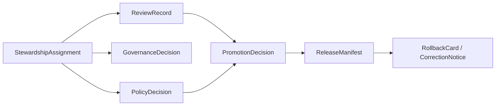

<!-- [KFM_META_BLOCK_V2]
doc_id: kfm://doc/contracts-governance-steward-assignment
title: StewardshipAssignment Governance Contract
type: semantic-contract
version: v0.1
status: draft
owners: OWNER_TBD — Governance steward · Contract steward · Docs steward · Directory Rules reviewer
created: 2026-06-24
updated: 2026-06-24
policy_label: public; contracts; governance; stewardship; semantic-contract
related:
  - ./README.md
  - ./ReviewRecord.md
  - ../README.md
  - ../release/README.md
  - ../../docs/governance/SEPARATION_OF_DUTIES.md
  - ../../docs/governance/ESCALATION.md
  - ../../docs/architecture/contract-schema-policy-split.md
  - ../../docs/registers/DRIFT_REGISTER.md
  - ../../docs/registers/VERIFICATION_BACKLOG.md
  - ../../schemas/contracts/v1/governance/steward_assignment.schema.json
  - ../../policy/governance/
  - ../../tests/contracts/
  - ../../fixtures/governance/
tags: [kfm, contracts, governance, steward-assignment, stewardship, semantic-contract, responsibility, review, ownership, no-parallel-authority]
notes:
  - "Defines semantic meaning for a StewardshipAssignment object family."
  - "A StewardshipAssignment records responsibility posture; it is not CODEOWNERS, branch protection, policy enforcement, actual approval, release state, or proof that a steward acted."
  - "Machine shape belongs in `schemas/contracts/v1/governance/steward_assignment.schema.json` or the accepted schema home."
  - "Previous file was a greenfield scaffold; rollback target is blob SHA `2fdae9624849838d44e6d7c9fd9cd28320749900`."
[/KFM_META_BLOCK_V2] -->

<a id="top"></a>

# StewardshipAssignment

> Semantic contract for assigning stewardship responsibility over a KFM object family, path family, source family, domain lane, policy surface, release surface, or trust-bearing workflow.

<p>
  
  
  
  
  
  
</p>

**Status:** draft semantic contract  
**Path:** `contracts/governance/steward_assignment.md`  
**Object family:** `StewardshipAssignment`  
**Owning lane:** [`contracts/governance/`](./README.md)  
**Schema home:** `schemas/contracts/v1/governance/steward_assignment.schema.json` — PROPOSED / NEEDS VERIFICATION  
**Truth posture:** CONFIRMED scaffold replaced · CONFIRMED governance lane includes stewardship assignment semantics · PROPOSED field roster until schema, policy, fixtures, and tests are verified

## Quick jumps

[Purpose](#purpose) · [Scope](#scope) · [Anti-collapse rules](#anti-collapse-rules) · [Semantic shape](#semantic-shape) · [Steward roles](#steward-roles) · [Lifecycle fit](#lifecycle-fit) · [Validation](#validation) · [Examples](#examples) · [Rollback](#rollback)

---

## Purpose

A `StewardshipAssignment` records who or what role is responsible for a bounded part of KFM governance.

It exists to make responsibility inspectable for:

- a domain lane such as flora, fauna, geology, hydrology, archaeology, hazards, roads, or settlement;
- a source family or SourceDescriptor class;
- a contract, schema, policy, fixture, validator, package, pipeline, release lane, or documentation family;
- a sensitivity lane, rights-review lane, sovereignty/care lane, or public-safety lane;
- an AI, UI, API, evidence, catalog, graph, tile, or release workflow surface.

A stewardship assignment is a governance object. It records responsibility posture; it does not prove that review occurred, policy passed, release was approved, or enforcement is wired.

---

## Scope

`StewardshipAssignment` belongs in the governance contract family because it defines responsibility, not object evidence, object shape, policy behavior, or release state.

A valid assignment should identify:

- the governed target;
- the steward role and scope;
- the accountable person, team, service, or placeholder role;
- the start date and optional expiry/review date;
- the authority basis for the assignment;
- required companion reviewers or escalation path;
- whether the assignment is active, provisional, expired, superseded, or revoked.

The assignment should be narrow enough to be auditable. Broad statements like “the project owns this” are not sufficient for trust-bearing paths.

---

## Anti-collapse rules

| Do not collapse `StewardshipAssignment` into | Why |
|---|---|
| `ReviewRecord` | Stewardship identifies responsibility; ReviewRecord records a review event. |
| `PolicyDecision` | Policy decides allow/deny/restrict/abstain; stewardship says who owns the decision surface or review burden. |
| `PromotionDecision` | Promotion decides lifecycle advancement; stewardship may identify who can review or approve. |
| `ReleaseManifest` | Release manifests describe published artifacts; stewardship describes responsibility over a lane or object family. |
| `CODEOWNERS` | CODEOWNERS can route reviewers but does not carry full semantic scope, authority basis, expiry, or governance rationale. |
| GitHub team membership | Team membership may implement assignment but is not the contract meaning. |
| Personal memory or chat note | Stewardship must be inspectable and versioned. |
| ADR | An ADR may authorize a stewardship model; the assignment records a concrete bounded responsibility. |

---

## Semantic shape

The field roster below is a semantic proposal. Machine-checkable structure belongs in `schemas/contracts/v1/governance/steward_assignment.schema.json` or the accepted schema home.

| Field | Meaning | Required posture |
|---|---|---|
| `stewardship_assignment_id` | Stable identifier for the assignment. | Required; deterministic where practical. |
| `schema_version` | Version of the StewardshipAssignment schema/contract family. | Required once schema exists. |
| `target_ref` | Path, object family, domain lane, source family, release lane, policy bundle, workflow, or artifact class under stewardship. | Required. |
| `target_type` | Kind of target: domain, source, contract, schema, policy, fixture, test, validator, package, pipeline, release, docs, AI, UI, API, data, registry, or cross-cutting. | Required; closed enum recommended. |
| `steward_role` | Role responsible for the target. | Required. |
| `assigned_to` | Person, team, service identity, placeholder role, or governance body assigned. | Required; privacy-minimized. |
| `assignment_status` | Active/provisional/expired/superseded/revoked/unknown. | Required; unknown fails closed for trust-bearing decisions. |
| `authority_basis_refs[]` | ADR, governance standard, ReviewRecord, GovernanceDecision, issue/PR, or maintainer decision that authorizes the assignment. | Required for active non-placeholder assignment. |
| `starts_at` | When the assignment becomes effective. | Required. |
| `expires_at` | Optional expiry or review date. | Required for provisional, sensitive, or temporary assignments. |
| `scope_statement` | Human-readable boundary for what the steward owns and does not own. | Required. |
| `required_partner_roles[]` | Other roles required for review, release, sensitivity, policy, or SoD. | Required when separation of duties applies. |
| `escalation_path_ref` | Where conflicts, absence, missing authority, or blocked review should escalate. | Required for trust-bearing targets. |
| `supersedes_assignment_id` | Previous assignment replaced by this one. | Optional; required when rotating or revoking stewardship. |
| `review_record_refs[]` | Reviews supporting the assignment or later changes. | Required for mature/high-materiality lanes. |
| `notes` | Bounded explanatory notes. | Optional; must not replace structured fields. |

---

## Steward roles

The role vocabulary below is PROPOSED until governance schemas and policy bundles are verified.

| Role | Responsibility boundary |
|---|---|
| `docs_steward` | Human-facing documentation clarity, doctrine references, and documentation hygiene. |
| `contract_steward` | Semantic meaning, anti-collapse boundaries, contract versioning, and paired schema expectations. |
| `schema_steward` | Machine shape, JSON Schema lifecycle, schema fixtures, and compatibility rules. |
| `policy_steward` | Policy semantics, allow/deny/restrict/abstain gates, and policy bundle ownership. |
| `domain_steward` | Domain meaning, source-role posture, object family scope, and domain-specific review burden. |
| `source_steward` | SourceDescriptor identity, rights, cadence, authority limits, and source-role assignments. |
| `sensitivity_reviewer` | Sensitive-lane review, generalization/redaction posture, and fail-closed public exposure guidance. |
| `release_authority` | Promotion/release readiness, release manifest posture, correction, withdrawal, and rollback path. |
| `ai_surface_steward` | Governed AI answer surfaces, cite-or-abstain behavior, model-adapter boundary, and AI receipts. |
| `ui_api_steward` | Governed public delivery surfaces and trust-membrane enforcement posture. |
| `validation_steward` | Tests, fixtures, validators, CI assertions, and negative-state proof coverage. |

A role name does not grant authority by itself. Authority must be connected to assignment status, scope, basis, review burden, and applicable governance rules.

---

## Lifecycle fit

A `StewardshipAssignment` can support lifecycle gates by making responsibility visible.



The assignment does not move data through the lifecycle. It helps determine who must review, approve, abstain, deny, or escalate before trust-bearing state changes occur.

---

## Validation

A StewardshipAssignment is valid only when the accepted schema, policy, and tests say it is valid. Until those are verified, this contract defines intended meaning only.

Validation should eventually prove:

- `stewardship_assignment_id`, `target_ref`, `target_type`, `steward_role`, `assigned_to`, `assignment_status`, `starts_at`, and `scope_statement` are present;
- role and target vocabularies are closed or governed by an accepted registry;
- active assignments have authority basis references;
- provisional and sensitive assignments have expiry or review dates;
- expired, superseded, revoked, or unknown assignments cannot authorize trust-bearing release by themselves;
- assignment scope does not exceed the owning responsibility root;
- separation-of-duties partner roles are present where required;
- conflicting active assignments produce HOLD / NEEDS VERIFICATION / escalation rather than silent precedence;
- assignment changes preserve supersession and rollback links.

---

## Examples

### Contract stewardship example

```yaml
stewardship_assignment_id: stewardassign:example:contracts-governance
schema_version: v0.1
target_ref: contracts/governance/
target_type: contract
steward_role: contract_steward
assigned_to: OWNER_TBD
assignment_status: provisional
authority_basis_refs:
  - contracts/governance/README.md
starts_at: 2026-06-24T00:00:00Z
expires_at: 2026-09-24T00:00:00Z
scope_statement: Responsible for semantic contract boundaries under contracts/governance; not responsible for schema, policy, CI, or release enforcement.
required_partner_roles:
  - governance_steward
  - docs_steward
escalation_path_ref: docs/governance/ESCALATION.md
```

### Release-sensitive assignment example

```yaml
stewardship_assignment_id: stewardassign:example:release-authority
schema_version: v0.1
target_ref: release/candidates/geology/
target_type: release
steward_role: release_authority
assigned_to: OWNER_TBD
assignment_status: provisional
authority_basis_refs:
  - docs/governance/SEPARATION_OF_DUTIES.md
  - contracts/release/README.md
starts_at: 2026-06-24T00:00:00Z
scope_statement: Responsible for release-readiness review posture for geology release candidates; not a substitute for PromotionDecision or ReleaseManifest.
required_partner_roles:
  - domain_steward
  - policy_steward
  - sensitivity_reviewer
escalation_path_ref: docs/governance/ESCALATION.md
```

---

## Evidence basis

| Source | Status | Supports | Limits |
|---|---|---|---|
| `contracts/governance/steward_assignment.md` before this edit | CONFIRMED repo evidence | Target file existed as a greenfield scaffold. | Scaffold was not authoritative. |
| `contracts/governance/README.md` | CONFIRMED repo evidence | Governance lane includes stewardship assignment semantics and defines contracts as semantic Markdown only. | Object roster remains PROPOSED until schemas/policy/tests are verified. |
| `contracts/README.md` | CONFIRMED repo evidence | Contracts define semantic meaning and exclude schemas, executable validation, policy code, and source data. | Root README does not define StewardshipAssignment fields. |
| `docs/governance/SEPARATION_OF_DUTIES.md` | CONFIRMED repo evidence | Authorship and approval are different acts; role assignments matter for governance. | Role matrix and tooling enforcement remain PROPOSED / NEEDS VERIFICATION. |
| `docs/architecture/contract-schema-policy-split.md` | CONFIRMED repo evidence | Meaning, shape, admissibility, and proof are separate layers. | Architecture doc does not prove implementation. |

---

## Rollback

Rollback is required if this contract is used as proof of actual ownership, CODEOWNERS coverage, branch protection, policy enforcement, release authority, approval state, CI behavior, or current implementation maturity without separate evidence.

Rollback target: previous scaffold blob SHA `2fdae9624849838d44e6d7c9fd9cd28320749900`.

<p align="right"><a href="#top">Back to top</a></p>
