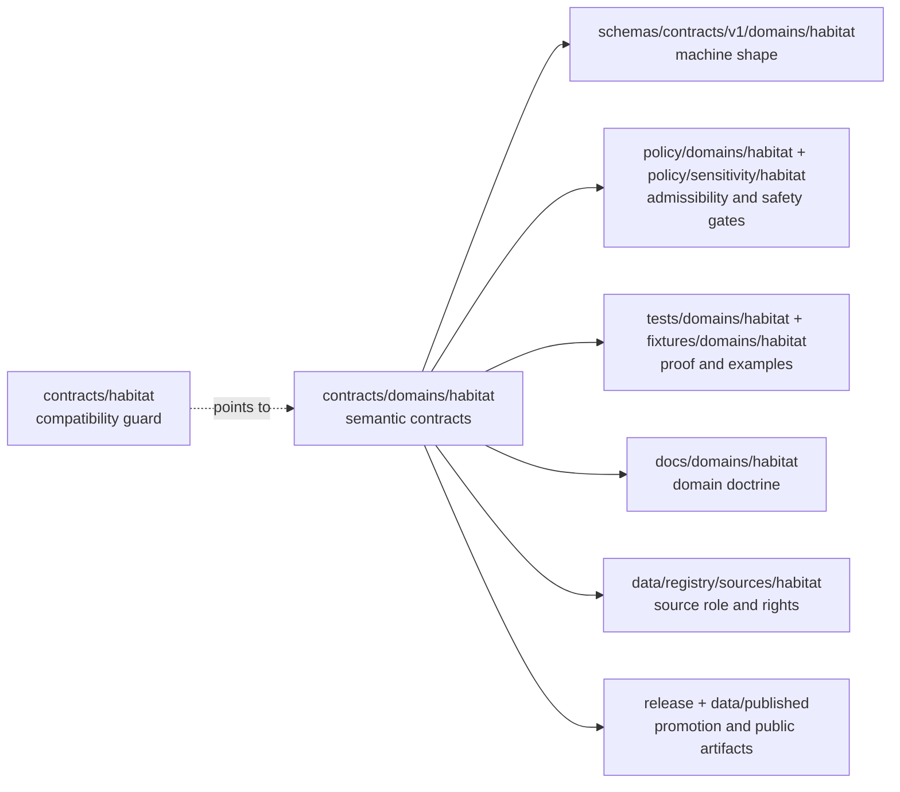

<!-- [KFM_META_BLOCK_V2]
doc_id: kfm://doc/contracts-habitat-compat-readme
title: contracts/habitat — Habitat Contract Compatibility README
type: readme
version: v0.1
status: draft
owners: OWNER_TBD — Habitat steward · Contract steward · Docs steward · Directory Rules reviewer
created: 2026-06-24
updated: 2026-06-24
policy_label: public; contracts; habitat; compatibility; no-parallel-authority
related:
  - ../README.md
  - ../domains/habitat/README.md
  - ../../docs/domains/habitat/README.md
  - ../../docs/domains/habitat/CONTRACTS.md
  - ../../docs/domains/habitat/CANONICAL_PATHS.md
  - ../../docs/domains/habitat/SENSITIVITY.md
  - ../../schemas/contracts/v1/domains/habitat/
  - ../../policy/domains/habitat/
  - ../../policy/sensitivity/habitat/
  - ../../tests/domains/habitat/
  - ../../fixtures/domains/habitat/
  - ../../data/registry/sources/habitat/
tags: [kfm, contracts, habitat, compatibility, semantic-contracts, land-cover, ecoregions, suitability, connectivity, restoration, no-parallel-authority]
notes:
  - "Compatibility pointer for the legacy/requested `contracts/habitat/` path."
  - "The canonical semantic contract lane is `contracts/domains/habitat/` unless an accepted ADR changes Directory Rules."
  - "Do not place schemas, policy, fixtures, data, release records, runtime code, source registries, public layers, API payloads, UI code, or AI output here."
  - "Previous file content was blank; rollback target is blob SHA `8b137891791fe96927ad78e64b0aad7bded08bdc`."
[/KFM_META_BLOCK_V2] -->

# contracts/habitat

> Compatibility guard for the legacy Habitat contract path; use [`contracts/domains/habitat/`](../domains/habitat/) for canonical Habitat semantic contracts.

  
  
  
  
  

**Status:** draft compatibility guard  
**Owners:** `OWNER_TBD` — Habitat steward · Contract steward · Docs steward · Directory Rules reviewer  
**Path:** `contracts/habitat/README.md`  
**Canonical semantic contract lane:** [`../domains/habitat/`](../domains/habitat/)  
**Truth posture:** CONFIRMED blank file replaced · CONFIRMED canonical Habitat domain contract lane exists · PROPOSED cleanup until maintainer review

## Quick jumps

[Scope](#scope) · [Repo fit](#repo-fit) · [Accepted inputs](#accepted-inputs) · [Exclusions](#exclusions) · [Compatibility flow](#compatibility-flow) · [Habitat trust rules](#habitat-trust-rules) · [Migration checklist](#migration-checklist) · [Rollback](#rollback)

---

## Scope

`contracts/habitat/` is **not** the canonical Habitat contract lane.

This README exists so a legacy, mistaken, or user-requested path does not silently become a second contract authority. New Habitat semantic contract work belongs in [`contracts/domains/habitat/`](../domains/habitat/), where contract files define object-family meaning while remaining separate from schemas, policy, fixtures, lifecycle data, source registries, release records, runtime code, map/API/UI code, and AI output.

> [!IMPORTANT]
> **Do not add Habitat object contracts here.** If a contract defines the meaning of habitat patches, land-cover observations, ecoregion context, suitability models, connectivity/corridor outputs, restoration opportunities, stewardship zones, model-run receipts, uncertainty surfaces, or another Habitat object family, place it under `contracts/domains/habitat/` unless an accepted ADR changes the Directory Rules pattern.

---

## Repo fit

Directory placement is part of KFM governance. This file is a pointer at a drift-prone path, not a new authority root.

| Responsibility | Canonical or expected path | This file's role |
|---|---|---|
| Root contract purpose | [`../README.md`](../README.md) | Inherits the contract/schemas/policy split. |
| Habitat semantic contracts | [`../domains/habitat/`](../domains/habitat/) | Points there; does not duplicate it. |
| Habitat domain doctrine | [`../../docs/domains/habitat/`](../../docs/domains/habitat/) | Linked domain context only. |
| Machine schemas | `../../schemas/contracts/v1/domains/habitat/` | Shape authority; not owned here. |
| Habitat policy | `../../policy/domains/habitat/` | Admissibility and release authority; not owned here. |
| Sensitivity policy | `../../policy/sensitivity/habitat/` | Public-safety tiering; not owned here. |
| Tests and fixtures | `../../tests/domains/habitat/`, `../../fixtures/domains/habitat/` | Proof and examples; not owned here. |
| Source registry | `../../data/registry/sources/habitat/` | Source identity, role, cadence, rights, and authority limits; not owned here. |
| Lifecycle data | `../../data/<phase>/habitat/` | RAW/WORK/QUARANTINE/PROCESSED/CATALOG/PUBLISHED records; not owned here. |
| Release and rollback | `../../release/candidates/habitat/`, `../../release/manifests/habitat/` | Promotion and rollback authority; not owned here. |

The clean split is:

- `contracts/` defines **semantic meaning**.
- `schemas/contracts/v1/` defines **machine-checkable shape**.
- `policy/` decides **allow / deny / restrict / abstain**.
- `tests/` and `fixtures/` prove the rules are enforceable.
- `data/` stores lifecycle records and emitted evidence-bearing artifacts.
- `release/` records promotion, manifests, correction, and rollback decisions.

---

## Accepted inputs

Only these belong under `contracts/habitat/` while this compatibility path exists:

| Accepted item | Purpose | Status |
|---|---|---|
| `README.md` | Compatibility guard and redirect to `contracts/domains/habitat/`. | Accepted |
| Short migration note | Temporary note explaining how any misplaced file was moved. | Allowed only during cleanup |
| Backlink audit note | Temporary note listing inbound references to this legacy path. | Allowed only during cleanup |

No other durable content should be added here.

---

## Exclusions

| Do not put this here | Correct home | Reason |
|---|---|---|
| Habitat object contract Markdown | `../domains/habitat/` | Avoids parallel semantic authority. |
| `.schema.json` files | `../../schemas/contracts/v1/domains/habitat/` | Schemas own machine shape. |
| Policy bundles | `../../policy/domains/habitat/`, `../../policy/sensitivity/habitat/` | Policy owns admissibility and release gates. |
| Source descriptors or source records | `../../data/registry/sources/habitat/` | Source identity, role, cadence, rights, and terms belong in the registry. |
| RAW / WORK / QUARANTINE / PROCESSED records | `../../data/<phase>/habitat/` | Lifecycle data is never contract meaning. |
| Published artifacts, tiles, or layer bundles | `../../data/published/`, `../../release/` | Publication is a governed state transition. |
| Tests, fixtures, or validators | `../../tests/domains/habitat/`, `../../fixtures/domains/habitat/`, `../../tools/validators/` | Proof and execution do not live in contracts. |
| API, map, UI, or AI code | `../../apps/`, `../../packages/`, `../../pipelines/` | Delivery and runtime surfaces are downstream carriers, not contract authority. |

> [!WARNING]
> A second Habitat contract lane at `contracts/habitat/` would make future review harder and could let stale semantic rules diverge from `contracts/domains/habitat/`. Treat new content here as drift unless it is only a pointer, migration note, or cleanup note.

---

## Compatibility flow

---

## Habitat trust rules

Habitat contract meaning is not publication permission.

A Habitat semantic contract may define object meaning, anti-collapse boundaries, and expected evidence posture. It does not by itself activate a source, validate a land-cover classification, publish a suitability model, certify a restoration opportunity, expose a public layer, or turn a modeled map surface into biological occurrence truth.

Minimum trust posture:

- Habitat may provide landscape context, but Fauna owns animal occurrence truth and Flora owns plant occurrence/specimen truth;
- modeled suitability, connectivity, restoration opportunity, and quality-score outputs must remain distinct from observed field evidence;
- public map/API/UI surfaces must consume released or review-authorized artifacts through governed interfaces;
- AI summaries must remain downstream of EvidenceBundle, PolicyDecision, review state, release state, citation validation, correction, and rollback support;
- unknown authority, rights, sensitivity, uncertainty, or release state must fail closed with `ABSTAIN`, `DENY`, or `ERROR` rather than a polished unsupported claim.

---

## Migration checklist

When a file is found under `contracts/habitat/`:

- [ ] Confirm whether it is only this compatibility README.
- [ ] If it is semantic Markdown, move it to `contracts/domains/habitat/` after checking for an existing canonical sibling.
- [ ] If it is JSON Schema, move it to `schemas/contracts/v1/domains/habitat/`.
- [ ] If it is policy, move it to `policy/domains/habitat/` or `policy/sensitivity/habitat/`.
- [ ] If it is a fixture or test, move it to the appropriate `fixtures/` or `tests/` lane.
- [ ] If it is source-registry content, move it to `data/registry/sources/habitat/`.
- [ ] If it is data, identify the lifecycle phase before moving it under `data/<phase>/habitat/`.
- [ ] If it is release-related, move it to `release/` or the appropriate published-artifact location.
- [ ] Record naming or placement drift rather than creating duplicate object identities.
- [ ] Preserve history with `git mv` where possible.
- [ ] Keep rollback notes for any moved file.

---

## Verification checklist

- [ ] `contracts/habitat/` contains no durable object contracts beyond this pointer README.
- [ ] `contracts/domains/habitat/README.md` remains the canonical Habitat contract-lane guide.
- [ ] No schema, policy, source registry, fixture, data artifact, release manifest, runtime code, API code, map UI code, or AI output is normalized here.
- [ ] Inbound links to `contracts/habitat/` are either corrected or intentionally routed through this compatibility guard.
- [ ] Habitat anti-collapse language remains evidence-subordinate and release-gated.
- [ ] Cleanup is reviewed by the Habitat steward, Contract steward, Docs steward, and Directory Rules reviewer.

---

## Rollback

Rollback is required if this compatibility guard is used to justify keeping new contract authority under `contracts/habitat/`, if it weakens the canonical `contracts/domains/habitat/` lane, or if it obscures where schemas, policy, evidence, source registries, fixtures, release records, runtime code, public artifacts, or maps belong.

Rollback target for this replacement: previous blank blob SHA `8b137891791fe96927ad78e64b0aad7bded08bdc`.

<a href="#top">Back to top</a>

