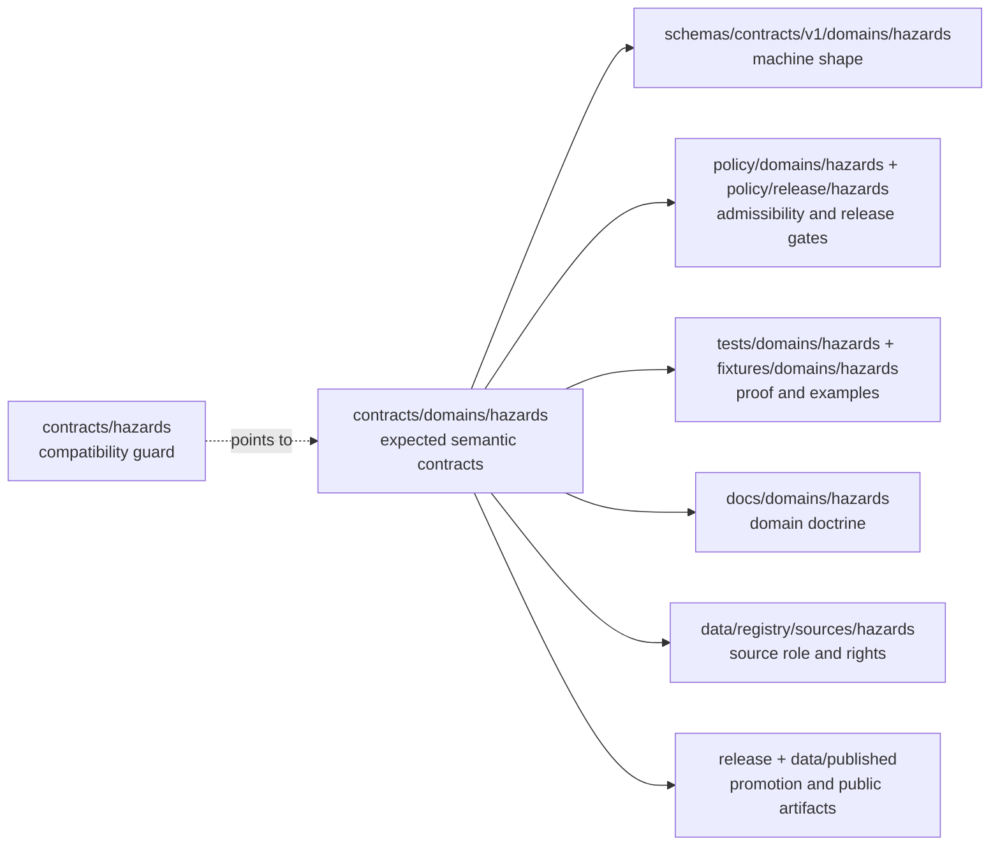

<!-- [KFM_META_BLOCK_V2]
doc_id: kfm://doc/contracts-hazards-compat-readme
title: contracts/hazards — Hazards Contract Compatibility README
type: readme
version: v0.1
status: draft
owners: OWNER_TBD — Hazards steward · Contract steward · Policy steward · Release steward · Docs steward · Directory Rules reviewer
created: 2026-06-24
updated: 2026-06-24
policy_label: public; contracts; hazards; compatibility; no-parallel-authority; not-for-life-safety
related:
  - ../README.md
  - ../domains/hazards/
  - ../../docs/domains/hazards/README.md
  - ../../docs/domains/hazards/API_CONTRACTS.md
  - ../../docs/domains/hazards/ARCHITECTURE.md
  - ../../docs/domains/hazards/DATA_LIFECYCLE.md
  - ../../docs/domains/hazards/SOURCES.md
  - ../../schemas/contracts/v1/domains/hazards/
  - ../../policy/domains/hazards/
  - ../../policy/release/hazards/
  - ../../policy/sensitivity/hazards/
  - ../../tests/domains/hazards/
  - ../../fixtures/domains/hazards/
  - ../../data/registry/sources/hazards/
tags: [kfm, contracts, hazards, compatibility, semantic-contracts, not-for-life-safety, source-role, freshness, risk-context, release-gated, no-parallel-authority]
notes:
  - "Compatibility pointer for the legacy/shorthand `contracts/hazards/` path."
  - "Directory Rules domain-segment form is `contracts/domains/hazards/`; the current requested path must not become a parallel authority."
  - "Hazards surfaces are planning/context surfaces only and must not act as life-safety alerting systems."
  - "Do not place schemas, policy, fixtures, data, release records, runtime code, source registries, alerts, API payloads, UI code, or AI output here."
  - "Previous file content was blank; rollback target is blob SHA `8b137891791fe96927ad78e64b0aad7bded08bdc`."
[/KFM_META_BLOCK_V2] -->

# contracts/hazards

> Compatibility guard for the legacy/shorthand Hazards contract path; use `contracts/domains/hazards/` for canonical Hazards semantic contracts once that lane is created or verified by repo evidence.

  
  
  
  
  
  

**Status:** draft compatibility guard  
**Owners:** `OWNER_TBD` — Hazards steward · Contract steward · Policy steward · Release steward · Docs steward · Directory Rules reviewer  
**Path:** `contracts/hazards/README.md`  
**Expected Directory Rules lane:** `contracts/domains/hazards/`  
**Truth posture:** CONFIRMED blank file replaced · CONFIRMED Hazards docs mark `contracts/hazards/` as shorthand drift · PROPOSED canonical contract-lane creation/verification

## Quick jumps

[Scope](#scope) · [Repo fit](#repo-fit) · [Accepted inputs](#accepted-inputs) · [Exclusions](#exclusions) · [Compatibility flow](#compatibility-flow) · [Hazards trust rules](#hazards-trust-rules) · [Migration checklist](#migration-checklist) · [Rollback](#rollback)

---

## Scope

`contracts/hazards/` is **not** the preferred Hazards domain contract lane.

This README exists so a legacy, shorthand, or user-requested path does not silently become a second contract authority. New Hazards semantic contract work should use the Directory Rules domain-segment form `contracts/domains/hazards/` once that lane exists or is verified. Until then, this file is only a compatibility guard and migration pointer.

> [!IMPORTANT]
> **Do not add Hazards object contracts here.** If a contract defines the meaning of `HazardEvent`, `HazardObservation`, `WarningContext`, `AdvisoryContext`, `DisasterDeclaration`, `FloodContext`, `WildfireDetection`, `SmokeContext`, `DroughtIndicator`, `EarthquakeEvent`, `HeatColdEvent`, `ExposureSummary`, `ResilienceSummary`, `HazardTimeline`, `ImpactArea`, or another Hazards object family, place it under `contracts/domains/hazards/` unless an accepted ADR changes the Directory Rules pattern.

---

## Repo fit

Directory placement is part of KFM governance. This file is a pointer at a drift-prone shorthand path, not a new authority root.

| Responsibility | Canonical or expected path | This file's role |
|---|---|---|
| Root contract purpose | [`../README.md`](../README.md) | Inherits the contract/schemas/policy split. |
| Hazards semantic contracts | `../domains/hazards/` | Expected Directory Rules lane; this file points there. |
| Hazards domain doctrine | [`../../docs/domains/hazards/`](../../docs/domains/hazards/) | Linked domain context only. |
| Machine schemas | `../../schemas/contracts/v1/domains/hazards/` | Shape authority; not owned here. |
| Hazards policy | `../../policy/domains/hazards/` | Admissibility and not-for-life-safety behavior; not owned here. |
| Release policy | `../../policy/release/hazards/` | Release-gate behavior; not owned here. |
| Sensitivity policy | `../../policy/sensitivity/hazards/` | Public-safety and exposure tiering; not owned here. |
| Tests and fixtures | `../../tests/domains/hazards/`, `../../fixtures/domains/hazards/` | Proof and examples; not owned here. |
| Source registry | `../../data/registry/sources/hazards/` | Source identity, role, cadence, rights, and authority limits; not owned here. |
| Lifecycle data | `../../data/<phase>/hazards/` | RAW/WORK/QUARANTINE/PROCESSED/CATALOG/PUBLISHED records; not owned here. |
| Release and rollback | `../../release/candidates/hazards/`, `../../release/manifests/hazards/` | Promotion and rollback authority; not owned here. |

The clean split is:

- `contracts/` defines **semantic meaning**.
- `schemas/contracts/v1/` defines **machine-checkable shape**.
- `policy/` decides **allow / deny / restrict / abstain**.
- `tests/` and `fixtures/` prove the rules are enforceable.
- `data/` stores lifecycle records and emitted evidence-bearing artifacts.
- `release/` records promotion, manifests, correction, and rollback decisions.

---

## Accepted inputs

Only these belong under `contracts/hazards/` while this compatibility path exists:

| Accepted item | Purpose | Status |
|---|---|---|
| `README.md` | Compatibility guard and redirect to the expected `contracts/domains/hazards/` lane. | Accepted |
| Short migration note | Temporary note explaining how any misplaced file was moved. | Allowed only during cleanup |
| Backlink audit note | Temporary note listing inbound references to this shorthand path. | Allowed only during cleanup |

No other durable content should be added here.

---

## Exclusions

| Do not put this here | Correct home | Reason |
|---|---|---|
| Hazards object contract Markdown | `../domains/hazards/` | Avoids parallel semantic authority. |
| `.schema.json` files | `../../schemas/contracts/v1/domains/hazards/` | Schemas own machine shape. |
| Policy bundles | `../../policy/domains/hazards/`, `../../policy/release/hazards/`, `../../policy/sensitivity/hazards/` | Policy owns admissibility, release gates, and safety boundaries. |
| Source descriptors or source records | `../../data/registry/sources/hazards/` | Source identity, role, cadence, rights, and terms belong in the registry. |
| RAW / WORK / QUARANTINE / PROCESSED records | `../../data/<phase>/hazards/` | Lifecycle data is never contract meaning. |
| Published artifacts, alerts, tiles, or layer bundles | `../../data/published/`, `../../release/` | Publication is a governed state transition; KFM is not an alert authority. |
| Tests, fixtures, or validators | `../../tests/domains/hazards/`, `../../fixtures/domains/hazards/`, `../../tools/validators/` | Proof and execution do not live in contracts. |
| API, map, UI, pipeline, or AI code | `../../apps/`, `../../packages/`, `../../pipelines/` | Delivery and runtime surfaces are downstream carriers, not contract authority. |

> [!WARNING]
> A second Hazards contract lane at `contracts/hazards/` would make future review harder and could let stale semantic rules diverge from the Directory Rules lane. Treat new content here as drift unless it is only a pointer, migration note, or cleanup note.

---

## Compatibility flow

---

## Hazards trust rules

Hazards contract meaning is not publication permission, emergency instruction, or alert authority.

A Hazards semantic contract may define object meaning, anti-collapse boundaries, source-role posture, freshness posture, and public-surface disclaimers. It does not by itself issue warnings, interpret current danger, replace official emergency sources, authorize life-safety action, publish a public layer, or promote an operational alert.

Minimum trust posture:

- KFM Hazards surfaces are for historical, regulatory, observational, modeled, planning, and resilience context only;
- operational warning, advisory, watch, and emergency products must be treated as official-source context, not KFM-authored instruction;
- official emergency, weather, disaster, fire, flood, earthquake, and local authority sources remain the action authority for life-safety decisions;
- freshness and time-kind posture must remain visible because stale hazard context can be harmful;
- public map/API/UI surfaces must consume released or review-authorized artifacts through governed interfaces;
- AI summaries must remain downstream of EvidenceBundle, PolicyDecision, review state, release state, citation validation, correction, and rollback support;
- unknown authority, rights, sensitivity, freshness, source role, or release state must fail closed with `ABSTAIN`, `DENY`, or `ERROR` rather than a polished unsupported claim.

---

## Migration checklist

When a file is found under `contracts/hazards/`:

- [ ] Confirm whether it is only this compatibility README.
- [ ] If it is semantic Markdown, move it to `contracts/domains/hazards/` after checking for an existing canonical sibling.
- [ ] If it is JSON Schema, move it to `schemas/contracts/v1/domains/hazards/`.
- [ ] If it is policy, move it to `policy/domains/hazards/`, `policy/release/hazards/`, or `policy/sensitivity/hazards/`.
- [ ] If it is a fixture or test, move it to the appropriate `fixtures/` or `tests/` lane.
- [ ] If it is source-registry content, move it to `data/registry/sources/hazards/`.
- [ ] If it is data, identify the lifecycle phase before moving it under `data/<phase>/hazards/`.
- [ ] If it is release-related, move it to `release/` or the appropriate published-artifact location.
- [ ] Record naming or placement drift rather than creating duplicate object identities.
- [ ] Preserve history with `git mv` where possible.
- [ ] Keep rollback notes for any moved file.

---

## Verification checklist

- [ ] `contracts/hazards/` contains no durable object contracts beyond this pointer README.
- [ ] `contracts/domains/hazards/README.md` exists or is created as the Hazards contract-lane guide before durable Hazards contracts are added.
- [ ] No schema, policy, source registry, fixture, data artifact, release manifest, runtime code, API code, map UI code, or AI output is normalized here.
- [ ] Inbound links to `contracts/hazards/` are either corrected or intentionally routed through this compatibility guard.
- [ ] The not-for-life-safety boundary remains visible and fail-closed.
- [ ] Cleanup is reviewed by the Hazards steward, Contract steward, Policy steward, Release steward, Docs steward, and Directory Rules reviewer.

---

## Rollback

Rollback is required if this compatibility guard is used to justify keeping new contract authority under `contracts/hazards/`, if it weakens the expected `contracts/domains/hazards/` lane, or if it obscures where schemas, policy, evidence, source registries, fixtures, release records, runtime code, public artifacts, or maps belong.

Rollback target for this replacement: previous blank blob SHA `8b137891791fe96927ad78e64b0aad7bded08bdc`.

<a href="#top">Back to top</a>

