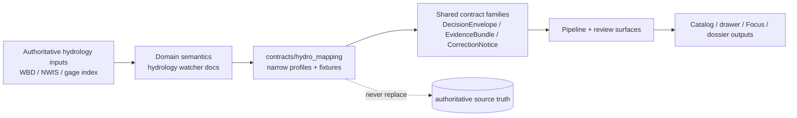

<!-- [KFM_META_BLOCK_V2]
doc_id: kfm://doc/TODO-NEEDS-VERIFICATION
title: hydro_mapping
type: standard
version: v1
status: draft
owners: @bartytime4life
created: TODO-NEEDS-VERIFICATION
updated: TODO-NEEDS-VERIFICATION
policy_label: public
related: [../README.md, ../vocab/README.md, ../../README.md, ../../docs/domains/hydrology/wbd-huc12-watcher.md, ../../pipelines/wbd-huc12-watcher/README.md, ../../docs/operations/emit-only-watchers/REGISTRY.md, ../../docs/operations/emit-only-watchers/SCHEMA_STUBS.md, ../../data/README.md, ../../policy/README.md, ../../tests/README.md]
tags: [kfm, contracts, hydrology, mapping]
notes: [target lane is not surfaced on current public main and must be verified on the working branch, owners and document-record dates need narrower branch-local confirmation, this README treats hydro_mapping as a narrow hydrology specialization rather than a new sovereign contract family]
[/KFM_META_BLOCK_V2] -->

# hydro_mapping

Hydrology-mapping contract staging lane for map-facing hydrology payloads, evidence linkage, and thin-slice compatibility rules.

> [!IMPORTANT]
> **Status:** experimental  
> **Owners:** `@bartytime4life` *(current public-repo fallback; narrower lane ownership NEEDS VERIFICATION)*  
> **Path:** `contracts/hydro_mapping/README.md`  
> **Repo fit:** child of [`../README.md`](../README.md) · hydrology authority [`../../docs/domains/hydrology/wbd-huc12-watcher.md`](../../docs/domains/hydrology/wbd-huc12-watcher.md) · execution neighbor [`../../pipelines/wbd-huc12-watcher/README.md`](../../pipelines/wbd-huc12-watcher/README.md) · watcher registries [`../../docs/operations/emit-only-watchers/REGISTRY.md`](../../docs/operations/emit-only-watchers/REGISTRY.md) and [`../../docs/operations/emit-only-watchers/SCHEMA_STUBS.md`](../../docs/operations/emit-only-watchers/SCHEMA_STUBS.md) · shared data lane [`../../data/README.md`](../../data/README.md) · policy lane [`../../policy/README.md`](../../policy/README.md) · proof lane [`../../tests/README.md`](../../tests/README.md)  
> **Evidence posture:** doctrine-grounded · current-public-`main` repo-grounded for adjacent surfaces · this target lane itself remains branch-local or NEEDS VERIFICATION until surfaced on the exact branch under review  
> **Current public snapshot:** `contracts/hydro_mapping/` is not surfaced on current public `main`; this file therefore treats the path as a user-targeted or branch-local lane and keeps subtree claims conservative  
> **Role:** narrow home for hydrology-mapping contract notes, profiles, fixtures, and compatibility guidance that specialize shared KFM proof objects for map-facing hydrology work  
> **Not this lane:** generic contract sovereignty, watcher runtime code, live emitted artifacts, policy bundles, or broad hydrology essays
>
> 
> 
> 
> 
> 
> 
>
> **Quick jumps:** [Scope](#scope) · [Repo fit](#repo-fit) · [Inputs](#accepted-inputs) · [Exclusions](#exclusions) · [Directory tree](#directory-tree) · [Quickstart](#quickstart) · [Usage](#usage) · [Diagram](#diagram) · [Reference tables](#reference-tables) · [Task list](#task-list) · [FAQ](#faq) · [Appendix](#appendix)

---

## Scope

This lane exists to make **hydrology mapping contracts** explicit enough to validate, diff, test, and review without silently inventing a new sovereign contract family.

In KFM terms, hydrology is the strongest first proof lane because it is comparatively public-safe while still exercising the hard parts: source admission, deterministic comparison, catalog closure, evidence drill-through, finite outcomes, correction lineage, and trust-visible map delivery. A `hydro_mapping` lane should therefore stay **narrow and contract-shaped**:

- map-facing hydrology payloads
- authoritative-versus-derived boundary rules
- valid/invalid fixtures for hydrology mapping objects
- profile notes that narrow shared contract families for hydrology use
- compatibility notes for hydrology watcher, dossier, Focus, and catalog-facing surfaces

It should **not** become a second hydrology domain guide, a watcher runtime home, or a substitute for shared contract authority.

> [!NOTE]
> Public `main` currently surfaces hydrology watcher docs and contract-adjacent watcher/schema guidance, but not this target lane. Treat this README as a conservative branch-ready draft until the checked-out branch confirms the subtree.

[Back to top](#hydro_mapping)

---

## Repo fit

### Path and relationship summary

| Surface | Relationship to this lane | Why it matters |
| --- | --- | --- |
| [`../README.md`](../README.md) | upstream contract authority | Keeps `hydro_mapping` subordinate to the shared `contracts/` lane instead of becoming a parallel governance center. |
| [`../vocab/README.md`](../vocab/README.md) | sibling vocabulary lane | Reuse shared code lists and contract vocabulary instead of hydrology-only renaming drift. |
| [`../../docs/domains/hydrology/wbd-huc12-watcher.md`](../../docs/domains/hydrology/wbd-huc12-watcher.md) | hydrology domain authority | Carries the clearest public hydrology watcher semantics, object shapes, trust rules, and correction posture. |
| [`../../pipelines/wbd-huc12-watcher/README.md`](../../pipelines/wbd-huc12-watcher/README.md) | execution-facing neighbor | Shows how hydrology watcher work is framed as a pipeline lane without overstating runtime implementation. |
| [`../../docs/operations/emit-only-watchers/REGISTRY.md`](../../docs/operations/emit-only-watchers/REGISTRY.md) | watcher registry surface | Supplies the proposed dataset/threshold/policy registry vocabulary that hydrology mapping payloads may need to reference. |
| [`../../docs/operations/emit-only-watchers/SCHEMA_STUBS.md`](../../docs/operations/emit-only-watchers/SCHEMA_STUBS.md) | schema-boundary helper | Defines the current public bridge language for `EvidenceRef`, `EvidenceBundle`, `DecisionEnvelope`, `CorrectionNotice`, and related watcher objects. |
| [`../../data/README.md`](../../data/README.md) | downstream data and catalog lane | Hydrology mapping contracts eventually close outward through governed data/catalog surfaces rather than staying in prose. |
| [`../../policy/README.md`](../../policy/README.md) | policy authority | Decision rules belong in policy surfaces, not hidden inside this lane. |
| [`../../tests/README.md`](../../tests/README.md) | proof surface | Valid/invalid fixtures and contract-facing checks should stay joinable to the repo-facing governed verification lane. |

### Placement rule

If the checked-out branch already contains a stronger shared home such as `contracts/profiles/` or a canonical hydrology-specific contract subtree, prefer that repo-native structure over this draft path.

> [!WARNING]
> Do not use this README to “prove” that `contracts/hydro_mapping/` already exists. The current public baseline does not surface it.

[Back to top](#hydro_mapping)

---

## Accepted inputs

This lane should accept only material that clarifies **hydrology mapping contract boundaries**.

| Good fit | Why it belongs here | Typical posture |
| --- | --- | --- |
| Hydrology mapping profile notes | Narrow shared contract families for hydrology-specific map payloads. | `CONFIRMED` or `PROPOSED` |
| Valid/invalid fixture pairs | Prove what a hydrology mapping object may and may not contain. | `PROPOSED` until surfaced |
| Example envelopes for review | Help reviewers inspect hydrology mapping object shape without implying live emission. | `ILLUSTRATIVE EXAMPLE` |
| Compatibility notes between domain doc and contract surface | Prevent terminology drift between hydrology domain docs, watcher docs, and machine-facing contracts. | `INFERRED` / `PROPOSED` |
| Crosswalk notes for authoritative vs derived hydrology layers | Keep WBD geometry, gage context, and derived classifications distinct. | `CONFIRMED` doctrine, `PROPOSED` packaging |
| Catalog-closure hints for hydrology map layers | Explain how hydrology mapping outputs should link outward to evidence-bearing catalog surfaces. | `PROPOSED` |

### Typical object slices this lane may specialize

| Shared family | Hydrology-mapping specialization |
| --- | --- |
| `SourceDescriptor` | Admitted hydrology source contract for WBD, NWIS, gage index, or closely related mapping inputs. |
| `DatasetVersion` | Candidate or promoted hydrology mapping layer/version. |
| `CatalogClosure` | STAC/DCAT/PROV outward linkage for a hydrology mapping release. |
| `EvidenceBundle` | Support package for a hydrology claim, overlay, dossier panel, or Focus view. |
| `DecisionEnvelope` | Finite outcome for a hydrology mapping review, watcher event, or release decision. |
| `CorrectionNotice` | Visible lineage when a hydrology mapping output is replaced, narrowed, or withdrawn. |
| `ProjectionBuildReceipt` | Derived-layer trace when a mapping surface is built from a known released hydrology scope. |

> [!TIP]
> Reuse shared family names first. Narrow them here only when hydrology adds a real burden such as authoritative-versus-derived separation, geometry fingerprinting, gage join semantics, or correction visibility.

[Back to top](#hydro_mapping)

---

## Exclusions

This lane does **not** own the whole hydrology stack.

| Excluded content | Why it does not belong here | Put it here instead |
| --- | --- | --- |
| Generic shared contract law | Shared families should not fork quietly by domain. | [`../README.md`](../README.md) and shared contract homes |
| Policy bundles or decision logic | Policy must remain explicit and independently reviewable. | [`../../policy/README.md`](../../policy/README.md) |
| Runtime watcher code | Execution belongs in pipeline/runtime lanes. | [`../../pipelines/wbd-huc12-watcher/README.md`](../../pipelines/wbd-huc12-watcher/README.md) |
| Domain essays or source surveys | This lane is contract-facing, not a narrative domain manual. | [`../../docs/domains/hydrology/wbd-huc12-watcher.md`](../../docs/domains/hydrology/wbd-huc12-watcher.md) |
| Live emitted receipts, manifests, or bundles | Emitted artifacts are outputs, not governing contract definitions. | governed data/proof lanes |
| Silent geometry rewrites | Derived classifications must not overwrite authoritative boundary truth. | correction- or review-bearing flows |
| Broad catalog operations | This lane may describe closure requirements, not own the catalog platform. | `data/` / catalog surfaces |

[Back to top](#hydro_mapping)

---

## Directory tree

### Current public-main snapshot

```text
contracts/
├── README.md
├── adaptive_change/
├── vocab/
└── promotion_review_handoff.md
```

`contracts/hydro_mapping/` is **not** surfaced on current public `main`.

### Target-lane starter shape (**PROPOSED**)

```text
contracts/hydro_mapping/
├── README.md
├── profiles/                 # narrow hydrology-mapping profile notes
├── fixtures/
│   ├── valid/                # positive contract examples
│   └── invalid/              # fail-loud counterexamples
├── examples/                 # reviewer-facing illustrative payloads
└── notes/                    # compatibility or migration notes
```

> [!NOTE]
> Exact subtree names beyond this README still NEED VERIFICATION against the checked-out branch. If a stronger repo-native layout already exists, update this section to match the branch instead of forcing the branch to mimic this draft.

[Back to top](#hydro_mapping)

---

## Quickstart

Inspection first. Do not invent a runner or a validator path that the checked-out branch does not actually expose.

```bash
# confirm the target subtree really exists on the working branch
find contracts/hydro_mapping -maxdepth 3 -type f 2>/dev/null | sort

# inspect current shared contract doctrine
sed -n '1,260p' contracts/README.md 2>/dev/null || true
sed -n '1,260p' contracts/vocab/README.md 2>/dev/null || true

# inspect hydrology-specific neighboring docs
sed -n '1,260p' docs/domains/hydrology/wbd-huc12-watcher.md 2>/dev/null || true
sed -n '1,260p' pipelines/wbd-huc12-watcher/README.md 2>/dev/null || true

# inspect watcher registry and schema-boundary helpers
sed -n '1,260p' docs/operations/emit-only-watchers/REGISTRY.md 2>/dev/null || true
sed -n '1,260p' docs/operations/emit-only-watchers/SCHEMA_STUBS.md 2>/dev/null || true

# inspect adjacent proof and policy surfaces before naming fixtures
find tests -maxdepth 3 -type f 2>/dev/null | sort | sed -n '1,240p'
find policy -maxdepth 3 -type f 2>/dev/null | sort | sed -n '1,240p'
```

### First local review pass

1. Verify whether `contracts/hydro_mapping/` already exists on the checked-out branch.
2. Verify whether the branch uses this lane as a real subtree or whether hydrology mapping belongs under a broader shared contract family.
3. Verify whether any hydrology mapping fixtures already exist under `contracts/`, `schemas/`, or `tests/`.
4. Verify which object names are already canonical on the branch.
5. Verify whether hydrology mapping decisions are represented with finite outcomes rather than free-form status prose.
6. Verify whether authoritative WBD geometry and derived classification outputs remain visibly separate.

[Back to top](#hydro_mapping)

---

## Usage

### Working rule

Use this lane to make **hydrology mapping boundaries explicit**, not to absorb every hydrology concern into `contracts/`.

A good `hydro_mapping` addition should answer one of these questions:

- What exact shape should a map-facing hydrology object have?
- Which fields are mandatory for authoritative-versus-derived separation?
- How does a hydrology mapping candidate link to evidence and catalog closure?
- What makes a hydrology mapping object invalid, stale, or correction-bearing?
- Which finite outcome should a reviewer or pipeline emit when evidence is incomplete or contradictory?

### Domain-carried payloads this lane may formalize

The public hydrology watcher docs already carry a useful shape vocabulary. If this lane is created, it should formalize that vocabulary carefully rather than rename it.

| Payload slice | What it does | Current posture here |
| --- | --- | --- |
| `HUCBaselineRecord`-style object | Holds the authoritative comparison baseline for one HUC snapshot, including stable IDs and hashes. | `INFERRED` from current domain docs |
| `ChangeEvent` / `DecisionEnvelope`-aligned object | Carries meaningful hydrology change, thresholds, evidence refs, affected gages, and finite outcome. | `INFERRED` / `PROPOSED` |
| `ClassificationArtifact`-style derived object | Preserves derived Kansas-specific classifications without claiming to replace authoritative boundary truth. | `PROPOSED` |
| `EvidenceBundle` | Supports map card, dossier, Focus, or review claims with traceable evidence. | `CONFIRMED` family, lane-local profile still `PROPOSED` |
| `CorrectionNotice` | Keeps supersession and public correction visible when mapping outputs change. | `CONFIRMED` family, lane-local profile still `PROPOSED` |

### Boundary discipline for hydrology mapping

| Concern | Required posture |
| --- | --- |
| Authoritative boundary truth | WBD geometry remains authoritative unless a governed correction path says otherwise. |
| Derived classification | Kansas-specific classifications may enrich interpretation, but they must not silently overwrite source truth. |
| Evidence linkage | Hydrology mapping outputs should remain joinable to `EvidenceRef` / `EvidenceBundle` style support. |
| Finite outcomes | Use finite result grammar; do not hide hydrology mapping decisions in vague prose. |
| Correction visibility | Replacement, withdrawal, or narrowing should remain inspectable. |
| Catalog closure | Mapping outputs should point outward cleanly rather than forcing readers to reverse-engineer release scope. |

> [!IMPORTANT]
> The hydrology domain docs already draw a hard line between **authoritative WBD geometry** and **derived classification updates**. This README preserves that rule on purpose.

[Back to top](#hydro_mapping)

---

## Diagram



[Back to top](#hydro_mapping)

---

## Reference tables

### Upstream/downstream responsibility matrix

| Surface | Primary responsibility | `hydro_mapping` responsibility |
| --- | --- | --- |
| `contracts/` | shared machine-facing contract law | stay subordinate |
| hydrology domain docs | semantic and source-role clarity | translate only the contract-bearing parts |
| watcher registry docs | dataset and threshold registry language | reference, not replace |
| schema stubs docs | common watcher object vocabulary | narrow for hydrology only when needed |
| pipelines | execution, orchestration, emitted behavior | align payload expectations |
| tests | proof of local and end-to-end behavior | contribute fixtures and validator expectations |
| policy | allow/deny/abstain logic | consume policy outcomes, do not hide them |

### What “done” should mean here

| Definition of done signal | Why it matters |
| --- | --- |
| Target subtree verified on the branch | Avoids documenting a ghost lane. |
| At least one valid and one invalid fixture checked in | Turns prose into machine-checkable intent. |
| Shared family names reused instead of renamed | Prevents terminology drift. |
| Authoritative vs derived boundary made explicit | Keeps hydrology trust posture intact. |
| Reviewers can tell where emitted runtime objects live | Prevents contract files from pretending to be outputs. |
| At least one contract-facing check or TODO path is named honestly | Keeps the README useful even before the lane is fully populated. |

[Back to top](#hydro_mapping)

---

## Task list

- [ ] Verify whether `contracts/hydro_mapping/` exists on the checked-out branch.
- [ ] Reconcile this lane with the current shared `contracts/` family structure before adding child files.
- [ ] Add one valid and one invalid hydrology mapping fixture before calling the lane “active”.
- [ ] Keep authoritative WBD truth and derived Kansas classifications visibly separate.
- [ ] Reuse existing shared object families before introducing lane-local names.
- [ ] Add branch-accurate quickstart commands once actual validators or generators are surfaced.
- [ ] Wire fixture or schema checks into a repo-facing proof surface instead of leaving them implied.
- [ ] Update this README whenever adjacent hydrology watcher docs or contract families change materially.

[Back to top](#hydro_mapping)

---

## FAQ

### Why create a hydrology-specific contract lane at all?

Because hydrology is the cleanest first proof lane in KFM, and map-facing hydrology work often adds boundary-sensitive requirements that deserve explicit fixtures and profiles. This lane is justified only if it narrows shared contract law without duplicating it.

### Why not put everything under a generic shared contract family?

You probably should unless the checked-out branch or review stream needs a real hydrology-facing specialization. This README keeps that tension visible on purpose.

### Does this README prove that live schemas or validators already exist here?

No. It explicitly does not. The current public baseline does not surface this target lane.

### Why is WBD geometry treated differently from derived classification?

Because authoritative source truth and interpretive/derived overlays are not interchangeable. The public hydrology domain docs already require that distinction.

### Why keep finite outcomes here?

Because hydrology mapping review should still end in an inspectable result, not a soft narrative impression.

[Back to top](#hydro_mapping)

---

## Appendix

<details>
<summary><strong>Appendix A — Evidence basis used for this README</strong></summary>

This draft is grounded in:

1. The current public root and lane docs that define KFM’s repo identity, truth path, and contract-lane role.
2. Current public hydrology watcher docs that explain how hydrology change, evidence, and finite outcomes are modeled.
3. Current public watcher-registry and schema-stub docs that define the object families this lane should reuse instead of renaming.
4. Current public `contracts/` tree state, which does **not** surface `contracts/hydro_mapping/`.

</details>

<details>
<summary><strong>Appendix B — Branch verification checklist</strong></summary>

Before merge, verify at minimum:

- whether this path exists on the active branch
- whether the branch uses `contracts/profiles/` or another stronger shared home instead
- whether narrower ownership than repo-wide `/tools/` or `/contracts/` fallback exists
- whether fixtures already live under `contracts/`, `schemas/`, `tests/`, or another lane
- whether any branch-local validators should replace the inspection-first quickstart
- whether the current branch already names stronger sibling files that should be linked here

</details>

<details>
<summary><strong>Appendix C — Naming guidance</strong></summary>

Prefer these patterns:

- keep shared family names stable
- use hydrology-specific prefixes only when disambiguation is genuinely needed
- mark branch-local examples as illustrative until fixtures are checked in
- avoid turning watcher runtime nouns into contract-family nouns unless the branch already does so

</details>