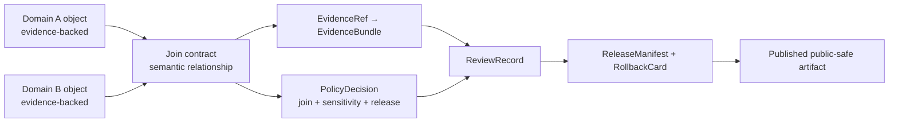

<!-- [KFM_META_BLOCK_V2]
doc_id: kfm://doc/contracts-joins-readme
title: contracts/joins — Cross-Domain Join Semantic Contract README
type: readme
version: v0.1
status: draft
owners: OWNER_TBD — Contract steward · Domain stewards · Policy steward · Schema steward · Evidence steward · Sensitivity reviewer · Release steward · Docs steward · Directory Rules reviewer
created: 2026-06-24
updated: 2026-06-24
policy_label: public-with-gates; contracts; joins; semantic-contracts; cross-domain; evidence-bound; release-gated; no-parallel-authority
related:
  - ../README.md
  - ./people-settlements/README.md
  - ./people-settlements/cemetery/README.md
  - ../../docs/architecture/contract-schema-policy-split.md
  - ../../docs/governance/SEPARATION_OF_DUTIES.md
  - ../../schemas/contracts/v1/joins/
  - ../../policy/joins/
  - ../../policy/sensitivity/
  - ../../policy/consent/
  - ../../tests/joins/
  - ../../fixtures/joins/
  - ../../data/registry/sources/
  - ../../release/
tags: [kfm, contracts, joins, semantic-contracts, cross-domain, evidence-bundle, policy-decision, review-record, release-manifest, rollback-card, sensitivity, consent, no-parallel-authority]
notes:
  - "Root README for `contracts/joins/`, the semantic contract lane for cross-domain join object meanings."
  - "Join contracts explain relationship meaning; they do not own source-domain truth, schemas, policy, data, release state, public layers, runtime code, or AI output."
  - "The currently verified child lane is `people-settlements/`, with `people-settlements/cemetery/` as a restricted cemetery/burial-context sublane."
  - "Previous file content was blank; rollback target is blob SHA `8b137891791fe96927ad78e64b0aad7bded08bdc`."
[/KFM_META_BLOCK_V2] -->

# contracts/joins

> Root semantic-contract lane for KFM cross-domain joins: bounded relationship meanings between independently governed domain objects, never a shortcut around evidence, source role, policy, review, release, correction, or rollback.

  
  
  
  
  

**Status:** draft root join-lane README  
**Owners:** `OWNER_TBD` — Contract steward · Domain stewards · Policy steward · Schema steward · Evidence steward · Sensitivity reviewer · Release steward · Docs steward · Directory Rules reviewer  
**Path:** `contracts/joins/README.md`  
**Verified child lane:** [`people-settlements/`](./people-settlements/)  
**Truth posture:** CONFIRMED blank file replaced · CONFIRMED `people-settlements/` child README exists · PROPOSED wider joins roster, schemas, policies, fixtures, tests, and release behavior until verified

## Quick jumps

[Scope](#scope) · [Repo fit](#repo-fit) · [Join-lane map](#join-lane-map) · [Anti-collapse rules](#anti-collapse-rules) · [Accepted inputs](#accepted-inputs) · [Exclusions](#exclusions) · [Sensitivity and publication](#sensitivity-and-publication) · [Trust flow](#trust-flow) · [Validation](#validation) · [Rollback](#rollback)

---

## Scope

`contracts/joins/` owns **semantic Markdown contracts** for cross-domain join meanings.

A join contract defines what it means to relate evidence-bearing objects from two or more independently governed lanes. It does not merge those lanes, promote their data, or make one domain the authority for another.

A join contract may define:

- the relationship meaning between two domain object families;
- the source-role boundaries on each side of the relationship;
- what evidence must resolve before the join can be asserted;
- how uncertainty, confidence, time, sensitivity, rights, consent, review, and release state affect use;
- what public-safe transforms are possible;
- which anti-collapse rules prevent a join from becoming unsupported truth.

> [!IMPORTANT]
> A join is not root truth. It is a governed relationship carrier that depends on independently supported domain evidence, policy, review, and release state.

---

## Repo fit

`contracts/joins/` is part of the `contracts/` responsibility root. It defines semantic meaning only.

| Responsibility | Expected or related path | Relationship to this README |
|---|---|---|
| Contracts root | [`../README.md`](../README.md) | Defines contracts as object meaning and excludes schema, policy, validation, and source data. |
| Join semantic contracts | `contracts/joins/` | This lane; Markdown meaning for cross-domain joins. |
| Verified child join | [`./people-settlements/`](./people-settlements/) | People/Genealogy/DNA/Land ↔ Settlements/Infrastructure join family. |
| Restricted child join | [`./people-settlements/cemetery/`](./people-settlements/cemetery/) | Cemetery, burial, memorial, and graveyard context join. |
| Machine schemas | `schemas/contracts/v1/joins/` | Shape authority; not owned here. |
| Join policy | `policy/joins/` | Admissibility, restriction, denial, abstain, and public-safe transform rules. |
| Sensitivity and consent policy | `policy/sensitivity/`, `policy/consent/` | Cross-cutting sensitive-lane gates. |
| Tests and fixtures | `tests/joins/`, `fixtures/joins/` | Proof and examples; not contract authority. |
| Source registry | `data/registry/sources/` | Source identity, role, rights, cadence, and authority limits. |
| Lifecycle data | `data/<phase>/...` | RAW/WORK/QUARANTINE/PROCESSED/CATALOG/PUBLISHED records; never stored here. |
| Release and rollback | `release/` | Promotion, manifest, correction, withdrawal, and rollback authority. |
| Runtime delivery | `apps/`, `packages/`, `pipelines/`, `data/published/` | Downstream delivery and execution; not semantic authority. |

---

## Join-lane map

| Join lane | Meaning | Status posture |
|---|---|---|
| [`people-settlements/`](./people-settlements/) | Person, genealogy, DNA, land, and settlement/place relationship semantics. | CONFIRMED child README exists; schemas/policy/tests PROPOSED. |
| [`people-settlements/cemetery/`](./people-settlements/cemetery/) | Cemetery, burial, memorial, and graveyard relationship semantics. | CONFIRMED child README exists; restricted by default. |
| `flora-habitat/` | Plant/ecological context relationships. | PROPOSED; do not create without checking canonical domain lanes. |
| `fauna-habitat/` | Animal occurrence/context relationships. | PROPOSED; sensitive species location gates likely apply. |
| `hydrology-hazards/` | Flood, drought, water, and hazard-context joins. | PROPOSED; not-for-life-safety gates likely apply. |
| `roads-settlements/` | Route, access, trade, settlement, and infrastructure joins. | PROPOSED. |
| `soils-geology/` | Substrate, material, geomorphology, and soil/geology joins. | PROPOSED. |
| `land-agriculture/` | Parcel, land use, crop, and agriculture-context joins. | PROPOSED; land/title anti-collapse required. |

The proposed list is an orientation aid, not proof of existing files.

---

## Anti-collapse rules

| Do not collapse joins into | Why |
|---|---|
| Source-domain truth | Each participating domain keeps its own semantic authority. |
| EvidenceBundle | Joins reference evidence; they do not become the evidence bundle. |
| SourceDescriptor | Joins depend on source roles; they do not define source identity, rights, cadence, or authority. |
| PolicyDecision | Join meaning does not decide allow/deny/restrict/abstain. |
| ReviewRecord | A reviewed join is not itself the review. |
| ReleaseManifest | A join is not a publication decision. |
| Public map/API/UI payload | Delivery surfaces are downstream carriers and may be generalized, withheld, delayed, or denied. |
| AI answer | Generated language can explain released joins but cannot create, approve, or repair them. |
| Canonical graph/vector store | Graph projections and indexes are downstream projections, not sovereign truth. |

---

## Accepted inputs

Accepted durable content under `contracts/joins/`:

| Accepted item | Purpose | Required posture |
|---|---|---|
| Root README | `README.md` | Defines join contract-lane boundaries. |
| Child join READMEs | `people-settlements/README.md`, future child lane READMEs | Required before object-level join contracts. |
| Join object semantic contracts | e.g. `people-settlements/cemetery/cemetery_person_join.md` if added later | PROPOSED until schema-linked and reviewed. |
| Source-role crosswalk notes | Explain how participating source roles can support the join. | Must not replace source registry. |
| Sensitivity/publication notes | Explain public-safe transform expectations. | Must not replace policy. |
| Migration notes | Temporary notes for moving misplaced join contracts. | Must preserve rollback. |

---

## Exclusions

| Do not put this here | Correct home | Reason |
|---|---|---|
| Domain object contracts | `contracts/domains/<domain>/` or accepted domain contract lane | Joins relate objects; domains own object meaning. |
| JSON Schema | `schemas/contracts/v1/joins/` | Schemas own machine shape. |
| Policy rules | `policy/joins/`, `policy/sensitivity/`, `policy/consent/` | Policy decides admissibility and exposure. |
| Fixtures and tests | `fixtures/joins/`, `tests/joins/` | Proof and examples belong outside contracts. |
| Source descriptors or source registry records | `data/registry/sources/` | Source identity and rights are not join meaning. |
| RAW / WORK / QUARANTINE / PROCESSED / CATALOG / PUBLISHED data | `data/<phase>/...` | Lifecycle data is never contract meaning. |
| Release manifests, rollback cards, correction notices | `release/` | Publication is a governed state transition. |
| Public map tiles, APIs, UI components, AI answers | `data/published/`, `apps/`, `packages/` | Delivery surfaces are downstream carriers. |

---

## Sensitivity and publication

Cross-domain joins can create risks that neither source object exposed alone. A benign public place plus a restricted person record, species record, infrastructure record, archaeology record, or land/title record can become sensitive when joined.

Default posture:

- join outputs are restricted until evidence, source role, policy, sensitivity, review, release, correction, and rollback support are present;
- precise location, living-person, DNA-derived, private land/title, rare species, archaeology, infrastructure, burial, cultural, and rights-sensitive joins fail closed unless policy allows a public-safe transform;
- public output should prefer generalized, aggregated, delayed, contextual, or source-citation-only forms when precision is unnecessary;
- unknown rights, consent, source role, sensitivity, review state, release state, or rollback support yields `ABSTAIN`, `DENY`, or `ERROR`.

---

## Trust flow

---

## Validation

Before a join lane can be relied on beyond draft status, verify or create:

- matching join schemas under `schemas/contracts/v1/joins/`;
- join policy under `policy/joins/` or accepted policy home;
- sensitivity and consent policy coverage for applicable cross-domain risks;
- valid, invalid, denied, abstained, generalized, delayed, aggregated, stale, conflicted, and rollback fixtures;
- tests that block public release without EvidenceBundle, PolicyDecision, ReviewRecord, ReleaseManifest, correction path, and rollback target;
- source-role rules for every participating source family;
- public-safe display rules for precision, confidence, uncertainty, source attribution, and disclaimers.

---

## Rollback

Rollback is required if this README is used to justify publishing joined claims without independently supported domain evidence, policy decisions, review records, release manifests, correction paths, and rollback targets.

Rollback target for this replacement: previous blank blob SHA `8b137891791fe96927ad78e64b0aad7bded08bdc`.

<a href="#top">Back to top</a>

