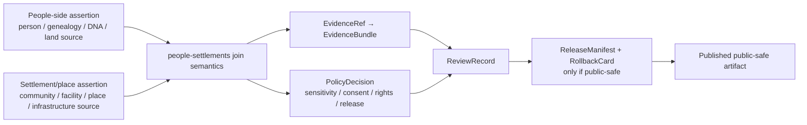

<!-- [KFM_META_BLOCK_V2]
doc_id: kfm://doc/contracts-joins-people-settlements-readme
title: contracts/joins/people-settlements — People ↔ Settlements Join Contract README
type: readme
version: v0.1
status: draft
owners: OWNER_TBD — People/DNA/Land steward · Settlements/Infrastructure steward · Contract steward · Sensitivity reviewer · Rights-holder representative · Docs steward · Directory Rules reviewer
created: 2026-06-24
updated: 2026-06-24
policy_label: restricted-by-default; contracts; joins; people-settlements; semantic-contracts; privacy; place; no-parallel-authority
related:
  - ../../README.md
  - ./cemetery/README.md
  - ../../../docs/domains/people-dna-land/README.md
  - ../../../docs/domains/people-dna-land/SENSITIVITY_PROFILE.md
  - ../../../docs/domains/people-dna-land/IDENTITY_MODEL.md
  - ../../../contracts/domains/settlements-infrastructure/README.md
  - ../../../docs/domains/settlements-infrastructure/README.md
  - ../../../docs/domains/settlements-infrastructure/CANONICAL_PATHS.md
  - ../../../schemas/contracts/v1/joins/people-settlements/
  - ../../../policy/joins/people-settlements/
  - ../../../policy/sensitivity/
  - ../../../policy/consent/
  - ../../../tests/joins/people-settlements/
  - ../../../fixtures/joins/people-settlements/
  - ../../../data/registry/sources/
  - ../../../release/
tags: [kfm, contracts, joins, people-dna-land, settlements-infrastructure, person-place, genealogy, settlement, privacy, consent, sensitivity, evidence-bundle, policy-decision, review-record, release-gated]
notes:
  - "Parent semantic contract README for People ↔ Settlements join lanes."
  - "This lane governs join meaning only; it does not own person identity, DNA, genealogy, land/title, settlement identity, place authority, policy decisions, release state, or public map publication."
  - "Living-person, DNA-derived, private family, person-place, burial, and private land/title joins are restricted or denied by default unless policy, evidence, review, consent where required, and release allow a public-safe transform."
  - "Previous file content was blank; rollback target is blob SHA `8b137891791fe96927ad78e64b0aad7bded08bdc`."
[/KFM_META_BLOCK_V2] -->

# contracts/joins/people-settlements

> Parent semantic contract lane for governed joins between People/Genealogy/DNA/Land evidence and Settlements/Infrastructure place evidence — evidence-bound, privacy-aware, sensitivity-reviewed, and release-gated.

  
  
  
  
  

**Status:** draft join-lane README  
**Owners:** `OWNER_TBD` — People/DNA/Land steward · Settlements/Infrastructure steward · Contract steward · Sensitivity reviewer · Rights-holder representative · Docs steward · Directory Rules reviewer  
**Path:** `contracts/joins/people-settlements/README.md`  
**Current child lane:** [`cemetery/`](./cemetery/)  
**Truth posture:** CONFIRMED blank file replaced · CONFIRMED cemetery child join exists · CONFIRMED People/DNA/Land strict sensitivity posture · CONFIRMED Settlements/Infrastructure semantic contract lane · PROPOSED parent join schemas, policies, fixtures, tests, and release behavior until verified

## Quick jumps

[Scope](#scope) · [Repo fit](#repo-fit) · [Join families](#join-families) · [Anti-collapse rules](#anti-collapse-rules) · [Accepted inputs](#accepted-inputs) · [Exclusions](#exclusions) · [Sensitivity and publication](#sensitivity-and-publication) · [Trust flow](#trust-flow) · [Validation](#validation) · [Rollback](#rollback)

---

## Scope

This directory defines parent semantic contract guidance for **People ↔ Settlements** joins.

The join lane exists for carefully bounded relationships between person-side evidence and place-side evidence, including:

- person assertions linked to settlements, communities, civic jurisdictions, institutions, facilities, cemetery places, historical localities, or infrastructure context;
- genealogy or family assertions that reference a place, residence, burial, migration, school, church, military post, reservation community, townsite, or other settlement/infrastructure feature;
- public-safe aggregate or contextual views that connect people-related evidence to place-related evidence without exposing restricted person, family, DNA, title, or precise-location details;
- source conflicts where people-side records and place-side records disagree.

This lane does **not** own person identity, DNA evidence, genealogy truth, land/title truth, settlement identity, infrastructure truth, policy decisions, release state, or public display permission.

> [!IMPORTANT]
> People ↔ Settlements joins are sensitive by default. Missing source role, evidence closure, policy decision, consent where required, review state, release state, correction path, or rollback target must produce `ABSTAIN`, `DENY`, or `ERROR`, not a polished join claim.

---

## Repo fit

This path is a cross-domain join under `contracts/joins/`. It is not a replacement for either source domain.

| Responsibility | Expected or related path | Relationship to this README |
|---|---|---|
| Parent join semantic contract lane | `contracts/joins/people-settlements/` | This directory; join meaning only. |
| Cemetery child join | [`./cemetery/`](./cemetery/) | Restricted child lane for cemetery, burial, memorial, and graveyard context. |
| People/Genealogy/DNA/Land doctrine | `docs/domains/people-dna-land/` | Person, genealogy, DNA, land, consent, and privacy posture. |
| Settlements/Infrastructure contracts | `contracts/domains/settlements-infrastructure/` | Place/community/infrastructure semantic contracts. |
| Settlements/Infrastructure doctrine | `docs/domains/settlements-infrastructure/` | Settlement/place identity and infrastructure context. |
| Machine schemas | `schemas/contracts/v1/joins/people-settlements/` | PROPOSED shape authority; not owned here. |
| Join policy | `policy/joins/people-settlements/` | PROPOSED admissibility and public-safe transform rules; not owned here. |
| Sensitivity and consent policy | `policy/sensitivity/`, `policy/consent/` | Living-person, DNA, person-place, family, burial, and title gates; not owned here. |
| Tests and fixtures | `tests/joins/people-settlements/`, `fixtures/joins/people-settlements/` | Proof and examples; not contract authority. |
| Source registry | `data/registry/sources/` | Source identity, rights, cadence, and authority limits. |
| Lifecycle data | `data/<phase>/...` | RAW/WORK/QUARANTINE/PROCESSED/CATALOG/PUBLISHED records; never stored here. |
| Release and rollback | `release/` | Promotion, manifest, correction, withdrawal, and rollback authority. |

---

## Join families

The parent lane may host child join folders or object contracts such as:

| Join family | Meaning | Status posture |
|---|---|---|
| [`cemetery/`](./cemetery/) | Person, memorial, burial, and cemetery/place relationships. | CONFIRMED child README exists; schemas/policy/tests PROPOSED. |
| `residence/` | Person or household assertions linked to settlement/place context. | PROPOSED. |
| `institution/` | Person assertions linked to schools, churches, posts, hospitals, civic facilities, or institutions. | PROPOSED. |
| `migration/` | Movement, route, origin/destination, and settlement-stage assertions. | PROPOSED. |
| `land-record-place/` | Person-land-record assertions joined to place/settlement context. | PROPOSED and highly sensitive. |
| `community-membership/` | Person assertions linked to community, civic, reservation, or organizational place context. | PROPOSED and review-sensitive. |

New join folders must include their own README before adding object-level contracts.

---

## Anti-collapse rules

| Do not collapse this join into | Why |
|---|---|
| Person identity truth | People-side records are assertions and must remain evidence-bounded. |
| DNA or kinship proof | Place joins cannot prove biological relationship or DNA-derived inference. |
| Settlement/place truth | People-side records may reference places, but Settlements/Infrastructure owns place identity semantics. |
| Land/title truth | Person-place joins are not title proof or boundary proof. |
| Public map permission | A valid internal join may still be denied, generalized, aggregated, delayed, or withheld publicly. |
| EvidenceBundle | Joins reference evidence; they are not the evidence bundle itself. |
| PolicyDecision | Join meaning does not decide allow/deny/restrict/abstain. |
| ReleaseManifest | A reviewed join is not a release decision. |
| AI answer | Generated text may explain released evidence but cannot create join truth. |

---

## Accepted inputs

Accepted durable content under this directory:

| Accepted item | Purpose | Required posture |
|---|---|---|
| Parent README | `README.md` | Join-lane boundary and authoring guide. |
| Child join READMEs | `cemetery/README.md`, future child lane README files | Required before object contracts. |
| Join object semantic contracts | e.g. `residence/person_place_join.md` if added later | PROPOSED until schema-linked and reviewed. |
| Source-role crosswalk notes | Explains how people-side and place-side sources support joins. | Must not replace SourceDescriptor. |
| Sensitivity/publication notes | Defines public-safe transform expectations. | Must not replace policy. |
| Migration notes | Temporary notes for moving misplaced join contracts. | Must preserve rollback. |

---

## Exclusions

| Do not put this here | Correct home | Reason |
|---|---|---|
| RAW people, DNA, genealogy, land, settlement, cemetery, or infrastructure data | `data/raw/...` or source-specific intake roots | Raw source data is not contract meaning. |
| Person identity, DNA, genealogy, consent, or land-title contracts | People/DNA/Land contract lane after segment decision | This lane references those objects; it does not own them. |
| Settlement/place/infrastructure contracts | `contracts/domains/settlements-infrastructure/` | This lane references place identity; it does not own the settlement domain. |
| JSON Schema | `schemas/contracts/v1/joins/people-settlements/` | Schemas own machine shape. |
| Policy rules | `policy/joins/people-settlements/`, `policy/sensitivity/`, `policy/consent/` | Policy decides admissibility and exposure. |
| Fixtures and tests | `fixtures/joins/people-settlements/`, `tests/joins/people-settlements/` | Proof and examples belong outside contracts. |
| Release manifests, rollback cards, correction notices | `release/` | Publication is a governed state transition. |
| Public map tiles, APIs, UI components, AI answers | `data/published/`, `apps/`, `packages/` | Delivery surfaces are downstream carriers. |

---

## Sensitivity and publication

People ↔ Settlements joins can expose living-person location history, family privacy, DNA-derived inference, land-title context, burial context, cultural sensitivity, protected sites, or source-restricted material.

Default posture:

- living-person links, DNA-derived hypotheses, private family assertions, and private person-land joins are denied or restricted by default;
- exact person-place joins and precise sensitive-location joins fail closed unless policy and review explicitly allow a public-safe transform;
- public output should prefer generalized, aggregated, delayed, contextual, or source-citation-only forms when precision is not necessary;
- source role, confidence, uncertainty, temporal scope, and review state must remain visible;
- unknown rights, consent, source role, sensitivity, review state, or release state yields `ABSTAIN`, `DENY`, or `ERROR`.

A join can be internally valid and still be unreleasable.

---

## Trust flow

---

## Validation

Before this parent join lane can be relied on beyond draft status, verify or create:

- matching join schemas in `schemas/contracts/v1/joins/people-settlements/`;
- join policy in `policy/joins/people-settlements/` or accepted policy home;
- sensitivity and consent policy coverage for living-person, DNA-derived, family, person-place, burial, land-title, exact-location, and cultural/religious/tribal review cases;
- valid, invalid, denied, abstained, generalized, delayed, aggregated, and rollback fixtures;
- tests that block public release without EvidenceBundle, PolicyDecision, ReviewRecord, ReleaseManifest, correction path, and rollback target;
- source-role rules for family trees, vital records, obituaries, census-like sources, land records, cemetery records, maps, settlement records, and infrastructure/place records;
- public-safe display rules for precision, confidence, uncertainty, source attribution, and disclaimers.

---

## Rollback

Rollback is required if this README is used to justify publishing exact person-place links, living-person claims, DNA-derived claims, private family assertions, private land/title joins, sensitive burial context, source-restricted content, or public join layers without evidence, policy, review, release, correction, and rollback support.

Rollback target for this replacement: previous blank blob SHA `8b137891791fe96927ad78e64b0aad7bded08bdc`.

<a href="#top">Back to top</a>

