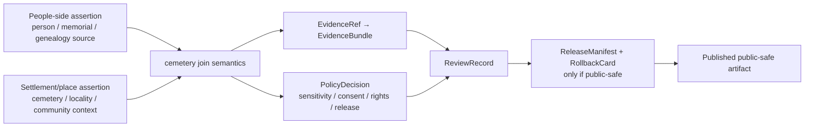

<!-- [KFM_META_BLOCK_V2]
doc_id: kfm://doc/contracts-joins-people-settlements-cemetery-readme
title: contracts/joins/people-settlements/cemetery — Cemetery Join Contract README
type: readme
version: v0.1
status: draft
owners: OWNER_TBD — People/DNA/Land steward · Settlements/Infrastructure steward · Contract steward · Sensitivity reviewer · Rights-holder representative · Docs steward · Directory Rules reviewer
created: 2026-06-24
updated: 2026-06-24
policy_label: restricted-by-default; contracts; joins; people-settlements; cemetery; burial-context; sensitive-location; no-parallel-authority
related:
  - ../../../README.md
  - ../../../../docs/domains/people-dna-land/README.md
  - ../../../../docs/domains/people-dna-land/SENSITIVITY_PROFILE.md
  - ../../../../docs/domains/people-dna-land/IDENTITY_MODEL.md
  - ../../../../contracts/domains/settlements-infrastructure/README.md
  - ../../../../docs/domains/settlements-infrastructure/README.md
  - ../../../../docs/domains/settlements-infrastructure/CANONICAL_PATHS.md
  - ../../../../schemas/contracts/v1/joins/people-settlements/cemetery/
  - ../../../../policy/joins/people-settlements/cemetery/
  - ../../../../policy/sensitivity/
  - ../../../../tests/joins/people-settlements/cemetery/
  - ../../../../fixtures/joins/people-settlements/cemetery/
  - ../../../../data/registry/sources/
  - ../../../../release/
tags: [kfm, contracts, joins, people-dna-land, settlements-infrastructure, cemetery, burial, memorial, identity, place, sensitivity, rights, review, release-gated, evidence-bundle]
notes:
  - "Directory README for the People ↔ Settlements cemetery join semantic contract lane."
  - "This is a join contract, not the sovereign source for person identity, genealogy, DNA, settlement identity, land/title, burial-site authority, or public map publication."
  - "Cemetery and burial-context joins are sensitive by default; exact coordinates, private family data, living-person links, culturally sensitive sites, and uncertain graves must fail closed unless policy and review allow a public-safe transform."
  - "Previous file content was blank; rollback target is blob SHA `8b137891791fe96927ad78e64b0aad7bded08bdc`."
[/KFM_META_BLOCK_V2] -->

# contracts/joins/people-settlements/cemetery

> Semantic contract lane for joining People/Genealogy/DNA/Land evidence to Settlements/Infrastructure place evidence around cemetery, burial, memorial, and graveyard context — evidence-bound, sensitivity-aware, and release-gated.

  
  
  
  
  
  

**Status:** draft join-lane README  
**Owners:** `OWNER_TBD` — People/DNA/Land steward · Settlements/Infrastructure steward · Contract steward · Sensitivity reviewer · Rights-holder representative · Docs steward · Directory Rules reviewer  
**Path:** `contracts/joins/people-settlements/cemetery/README.md`  
**Join lane:** `people-settlements/cemetery`  
**Truth posture:** CONFIRMED blank file replaced · CONFIRMED People/DNA/Land is strict deny-by-default for sensitive person/DNA/private joins · CONFIRMED Settlements/Infrastructure has a semantic contract lane · PROPOSED cemetery join schemas, policies, fixtures, tests, and release behavior until verified

## Quick jumps

[Scope](#scope) · [Repo fit](#repo-fit) · [Join semantics](#join-semantics) · [Anti-collapse rules](#anti-collapse-rules) · [Accepted inputs](#accepted-inputs) · [Exclusions](#exclusions) · [Sensitivity and publication](#sensitivity-and-publication) · [Trust flow](#trust-flow) · [Validation](#validation) · [Rollback](#rollback)

---

## Scope

This directory defines semantic contract guidance for the **People ↔ Settlements cemetery join**.

The join exists for carefully bounded questions such as:

- how a cemetery, burial ground, graveyard, memorial site, or cemetery district is represented as a place feature;
- how a person, family, memorial, inscription, burial assertion, or genealogical source may reference that place;
- how source roles, evidence quality, sensitivity, rights, cultural context, and public-safety limits affect what can be joined and displayed;
- how to prevent a public map point, family-tree assertion, cemetery index, memorial transcription, or generated summary from becoming unsupported truth.

This lane does **not** own person identity, DNA evidence, genealogical truth, land/title truth, settlement identity, sacred/burial-site authority, official cemetery records, or public release.

> [!IMPORTANT]
> Cemetery joins are sensitive by default. A public-safe output requires source role, evidence closure, rights and sensitivity review, policy decision, release state, correction path, and rollback target. Missing support should produce `ABSTAIN`, `DENY`, or `ERROR`, not a polished claim.

---

## Repo fit

This path is a cross-domain join under `contracts/joins/`, not a replacement for either source domain.

| Responsibility | Expected or related path | Relationship to this README |
|---|---|---|
| Join semantic contract lane | `contracts/joins/people-settlements/cemetery/` | This directory; join meaning only. |
| People/Genealogy/DNA/Land doctrine | `docs/domains/people-dna-land/` | Person, genealogy, DNA, land, consent, and privacy posture. |
| Settlements/Infrastructure contracts | `contracts/domains/settlements-infrastructure/` | Place/community/infrastructure semantic contracts. |
| Settlements/Infrastructure doctrine | `docs/domains/settlements-infrastructure/` | Settlement/place identity and infrastructure context. |
| Machine schemas | `schemas/contracts/v1/joins/people-settlements/cemetery/` | PROPOSED shape authority; not owned here. |
| Join policy | `policy/joins/people-settlements/cemetery/` | PROPOSED admissibility and public-safe transform rules; not owned here. |
| Sensitivity policy | `policy/sensitivity/` | Exact-location, living-person, family, cultural, and burial-context gates; not owned here. |
| Tests and fixtures | `tests/joins/people-settlements/cemetery/`, `fixtures/joins/people-settlements/cemetery/` | Proof and examples; not contract authority. |
| Source registry | `data/registry/sources/` | Source identity, rights, cadence, and authority limits. |
| Lifecycle data | `data/<phase>/...` | RAW/WORK/QUARANTINE/PROCESSED/CATALOG/PUBLISHED records; never stored here. |
| Release and rollback | `release/` | Promotion, manifest, correction, withdrawal, and rollback authority. |

---

## Join semantics

A cemetery join is a governed relationship between at least two evidence-bearing objects:

1. a **people-side reference**: person assertion, burial assertion, memorial assertion, genealogical source, inscription, obituary, family record, cemetery index entry, or other person-linked source; and
2. a **settlements-side reference**: cemetery/place feature, settlement context, locality, parcel-like context, civic jurisdiction, historical community, road/access context, or maintained place identity.

The join may support a bounded claim such as:

- a person assertion is linked to a cemetery record;
- a memorial inscription references a named cemetery;
- a cemetery place feature is associated with a settlement or historical community;
- a public-safe aggregate describes cemetery context without exposing restricted details;
- a source conflict exists between person-side and place-side records.

The join must preserve uncertainty. It should carry source role, confidence, temporal context, public precision, and review state rather than flattening multiple assertions into one fact.

---

## Anti-collapse rules

| Do not collapse this join into | Why |
|---|---|
| Person identity truth | A cemetery index, grave marker, obituary, or family tree is an assertion source, not sovereign identity. |
| DNA or kinship proof | Cemetery context cannot prove biological relationship or DNA-derived inference. |
| Settlement/place truth | A family record may name a cemetery or locality, but Settlements/Infrastructure owns place identity semantics. |
| Land/title truth | Cemetery location, parcel adjacency, ownership, or maintenance context is not chain-of-title proof. |
| Official burial authority | KFM join records do not replace cemetery office, tribal, religious, municipal, county, state, or family authority. |
| Public map permission | A join can be valid internally while still denied, generalized, aggregated, or withheld publicly. |
| EvidenceBundle | The join references evidence; it is not the evidence bundle itself. |
| ReleaseManifest | A reviewed join is not a release decision. |
| AI answer | Generated text may explain released evidence but cannot create or repair the join. |

---

## Accepted inputs

Accepted durable content under this directory:

| Accepted item | Purpose | Required posture |
|---|---|---|
| `README.md` | Join-lane boundary and authoring guide. | Accepted. |
| Join object semantic contracts | `cemetery_person_join.md`, `burial_assertion_join.md`, `memorial_place_join.md` if added later. | PROPOSED until schema-linked and reviewed. |
| Source-role crosswalk notes | Explains how cemetery indexes, inscriptions, obituaries, maps, and local records may support joins. | Must not replace SourceDescriptor. |
| Sensitivity/publication notes | Defines public-safe transform expectations. | Must not replace policy. |
| Migration notes | Temporary notes for moving misplaced join contracts. | Must preserve rollback. |

---

## Exclusions

| Do not put this here | Correct home | Reason |
|---|---|---|
| RAW cemetery records, photographs, inscriptions, obituaries, family trees, or index exports | `data/raw/...` or source-specific intake roots | Raw source data is not contract meaning. |
| Person identity, DNA, genealogy, consent, or land-title contracts | People/DNA/Land contract lane after segment decision | The join references those objects; it does not own them. |
| Settlement/place identity contracts | `contracts/domains/settlements-infrastructure/` | The join references place identity; it does not own the settlement domain. |
| JSON Schema | `schemas/contracts/v1/joins/people-settlements/cemetery/` | Schemas own machine shape. |
| Policy rules | `policy/joins/people-settlements/cemetery/`, `policy/sensitivity/`, `policy/consent/` | Policy decides admissibility and exposure. |
| Fixtures and tests | `fixtures/joins/people-settlements/cemetery/`, `tests/joins/people-settlements/cemetery/` | Proof and examples belong outside contracts. |
| Release manifests, rollback cards, correction notices | `release/` | Publication is a governed state transition. |
| Public map tiles, APIs, UI components, AI answers | `data/published/`, `apps/`, `packages/` | Delivery surfaces are downstream carriers. |

---

## Sensitivity and publication

Cemetery joins can implicate living relatives, family privacy, cultural sensitivity, burial-site protection, land access, religious or tribal care obligations, uncertain grave locations, and memorial-source terms.

Default posture:

- exact coordinates and grave-level joins fail closed unless a public-safe policy explicitly allows them;
- living-person links, DNA-derived hypotheses, private family assertions, and private person-land joins are denied or restricted by default;
- culturally sensitive, sacred, tribal, religious, protected, or uncertain burial contexts require steward review before any public surface;
- public output should prefer generalized, aggregated, contextual, or source-citation-only forms when precise exposure is not necessary;
- unknown rights, source role, consent, review state, or release state yields `ABSTAIN`, `DENY`, or `ERROR`.

A cemetery join can be internally useful and still be unreleasable.

---

## Trust flow

---

## Validation

Before this join can be relied on beyond draft status, verify or create:

- matching join schema in `schemas/contracts/v1/joins/people-settlements/cemetery/`;
- join policy in `policy/joins/people-settlements/cemetery/` or accepted policy home;
- sensitivity and consent policy coverage for exact-location, burial-context, living-person, family, and cultural/religious/tribal review cases;
- valid, invalid, denied, abstained, generalized, and rollback fixtures;
- tests that block public release without EvidenceBundle, PolicyDecision, ReviewRecord, ReleaseManifest, correction path, and rollback target;
- source-role rules for cemetery indexes, inscriptions, memorial pages, obituaries, maps, family records, local records, and official cemetery records;
- public-safe display rules for precision, confidence, uncertainty, source attribution, and disclaimers.

---

## Migration checklist

When a file is found under this join lane:

- [ ] Confirm it is semantic contract guidance rather than data, schema, policy, fixture, test, API, UI, or release artifact.
- [ ] If it defines person, DNA, genealogy, consent, or land-title meaning, move it to the People/DNA/Land contract lane after segment decision.
- [ ] If it defines settlement or place identity meaning, move it to `contracts/domains/settlements-infrastructure/`.
- [ ] If it defines a join object, keep it here only after schema/policy homes are identified.
- [ ] If it contains sensitive source data, move it to the correct lifecycle root or quarantine.
- [ ] Preserve rollback and record drift if the placement conflict repeats.

---

## Rollback

Rollback is required if this README is used to justify publishing exact burial locations, private person/family links, living-person claims, DNA-derived claims, culturally sensitive sites, uncertain graves, source-restricted content, or public cemetery map layers without evidence, policy, review, release, correction, and rollback support.

Rollback target for this replacement: previous blank blob SHA `8b137891791fe96927ad78e64b0aad7bded08bdc`.

<a href="#top">Back to top</a>

