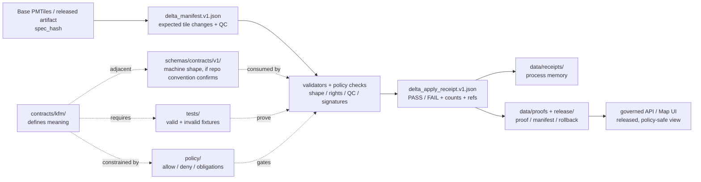

<!-- [KFM_META_BLOCK_V2]
doc_id: kfm://doc/TODO-NEEDS-UUID
title: contracts/kfm
type: standard
version: v1
status: draft
owners: @bartytime4life
created: NEEDS-VERIFICATION
updated: 2026-05-01
policy_label: NEEDS-VERIFICATION
related: [../README.md, ../api/, ../objects/, ../runtime/, ../source/, ../ui/, ../v1/, ../vocab/, ../../schemas/contracts/v1/README.md, ../../policy/README.md, ../../tests/README.md, ../../tools/validators/README.md, ../../data/receipts/README.md, ../../data/proofs/README.md, ../../release/]
tags: [kfm, contracts, delta, pmtiles, manifests, receipts, governance]
notes: [doc_id and created date need repository metadata confirmation; owner is inherited from the public contracts root and should be checked against active CODEOWNERS; policy_label needs confirmation; this README replaces an empty public-main README observed for contracts/kfm.]
[/KFM_META_BLOCK_V2] -->

<a id="top"></a>

# `contracts/kfm/`

KFM-scoped contract lane for PMTiles delta manifests, delta-apply receipts, and future cross-cutting KFM contract artifacts that must remain governed, testable, and rollback-aware.


> [!IMPORTANT]
> **Status:** experimental  
> **Owners:** `@bartytime4life` *(inherited from the public `contracts/` root; active checkout and CODEOWNERS parity still need verification)*  
> **Path:** `contracts/kfm/README.md`  
> **Truth posture:** **CONFIRMED** public-main file presence · **PROPOSED** lane operating guidance · **NEEDS VERIFICATION** active checkout, CI, schema-home authority, fixtures, validators, and policy enforcement  
> **Quick jumps:** [Scope](#scope) · [Repo fit](#repo-fit) · [Inputs](#inputs) · [Exclusions](#exclusions) · [Current snapshot](#current-snapshot) · [Directory tree](#directory-tree) · [Quickstart](#quickstart) · [Usage](#usage) · [Diagram](#diagram) · [Tables](#tables) · [Task list](#task-list) · [FAQ](#faq) · [Appendix](#appendix)

> [!WARNING]
> `contracts/kfm/` contains machine-shaped JSON contract artifacts today. That does **not** by itself settle KFM’s broader `contracts/` vs. `schemas/contracts/v1/` authority question. Any change here that affects validation, policy, release, runtime, or UI behavior must update the adjacent schema, fixture, validator, and policy surfaces together.

---

## Scope

`contracts/kfm/` is the KFM-specific contract lane for shared delta/change artifacts that do not fit cleanly under a domain lane, source descriptor lane, runtime envelope lane, UI payload lane, or vocabulary lane.

Today, this lane is centered on two related contract artifacts:

| Artifact | Current role | Truth label |
|---|---|---:|
| `delta_manifest.v1.json` | Declares the expected shape of a KFM PMTiles delta manifest, including base artifact identity, time window, tile changes, QC thresholds, and optional signatures. | **CONFIRMED public-main presence** |
| `delta_apply_receipt.v1.json` | Declares the expected shape of a delta-apply receipt, including result, manifest/base hashes, counts, input/output refs, checks, rejected checks, and tool metadata. | **CONFIRMED public-main presence** |

This README gives maintainers a readable boundary around those artifacts so they do not become isolated JSON files with unclear trust consequences.

### This lane should make it easy to answer

- What KFM-specific delta contract files exist here?
- Which adjacent surfaces must change when a delta contract changes?
- What belongs in `contracts/kfm/` instead of `contracts/api/`, `contracts/runtime/`, `contracts/source/`, `contracts/ui/`, `contracts/objects/`, or `schemas/contracts/v1/`?
- Which claims remain **NEEDS VERIFICATION** before this lane can be treated as enforcement-grade?

<p align="right"><a href="#top">Back to top ↑</a></p>

---

## Repo fit

| Relationship | Path | Role |
|---|---|---|
| Current path | `contracts/kfm/README.md` | Landing page and boundary contract for KFM-scoped delta/change contract artifacts. |
| Upstream contract root | [`../README.md`](../README.md) | Defines the broader `contracts/` role: object meaning, field intent, lifecycle semantics, compatibility expectations. |
| API contracts | [`../api/`](../api/) | API-facing contract surface; do not place route contracts here unless they are KFM delta-specific. |
| Object-family contracts | [`../objects/`](../objects/) | Better home for shared proof-object semantics that are not KFM delta/change artifacts. |
| Runtime contracts | [`../runtime/`](../runtime/) | Better home for runtime envelopes and governed response semantics. |
| Source contracts | [`../source/`](../source/) | Better home for source admission, source role, and source descriptor contracts. |
| UI contracts | [`../ui/`](../ui/) | Better home for Evidence Drawer, layer payload, and UI trust payload contracts. |
| Versioned contract lane | [`../v1/`](../v1/) | Versioned contract grouping when repo convention requires it. |
| Vocabulary contracts | [`../vocab/`](../vocab/) | Better home for controlled terms, enums, and shared vocabulary explanations. |
| Machine-schema adjacency | [`../../schemas/contracts/v1/README.md`](../../schemas/contracts/v1/README.md) | Companion schema home or schema-home comparison point; authority still needs active-checkout verification. |
| Policy adjacency | [`../../policy/README.md`](../../policy/README.md) | Rights, sensitivity, publication, signature, and allow/deny/abstain logic. |
| Test and fixture adjacency | [`../../tests/README.md`](../../tests/README.md) | Valid and invalid examples, regression coverage, and fail-closed proof. |
| Validator adjacency | [`../../tools/validators/README.md`](../../tools/validators/README.md) | Executable checks that should validate these contracts without redefining their meaning. |
| Process-memory adjacency | [`../../data/receipts/README.md`](../../data/receipts/README.md) | Home for emitted receipt instances when repo convention confirms it. |
| Proof/release adjacency | [`../../data/proofs/README.md`](../../data/proofs/README.md), [`../../release/`](../../release/) | Home for release-grade proofs, manifests, correction, rollback, and publication evidence when repo convention confirms it. |

> [!NOTE]
> Link targets above are repo-relative from `contracts/kfm/`. Recheck them against the active checkout before upgrading this README from `draft` to `review` or `published`.

<p align="right"><a href="#top">Back to top ↑</a></p>

---

## Inputs

Accepted inputs for `contracts/kfm/` are narrow by design.

### What belongs here

- KFM-scoped delta manifests and delta/change contract artifacts.
- KFM-scoped apply receipts that record how a delta was evaluated or applied.
- Contract-level compatibility notes for `spec_hash`, `manifest_hash`, `base_spec_hash`, `run_receipt_url`, `input_refs`, `output_refs`, checks, QC thresholds, signatures, and tool metadata.
- Human-readable explanations of KFM delta/change contract semantics.
- Versioned contract artifacts when they are KFM-specific and do not belong in a narrower contract lane.
- Cross-links to fixtures, validators, policy gates, release manifests, receipts, proofs, and rollback records.

### Good fit test

A file is a strong fit for this directory when the sentence is true:

> “This contract explains a KFM-specific delta/change object that must be validated, receipt-bearing, release-adjacent, and rollback-aware before it affects published map artifacts.”

<p align="right"><a href="#top">Back to top ↑</a></p>

---

## Exclusions

| Do not put here | Use instead | Why |
|---|---|---|
| Actual PMTiles files, tile stores, deltas, generated output stores, or public artifacts | `../../data/`, `../../release/`, or repo-confirmed artifact storage | This lane defines contract meaning; it does not store lifecycle artifacts. |
| RAW, WORK, QUARANTINE, or PROCESSED source data | Repo-confirmed data lifecycle directories | Keeps the KFM truth path intact. |
| Runtime API routes or service code | `../../apps/`, `../../packages/`, or repo-native runtime homes | Code consumes contracts; it does not live in the contract lane. |
| Policy rules, rights logic, publication allow/deny logic, or signature obligations | `../../policy/` | Policy remains decision-sovereign. |
| Generic runtime envelopes | `../runtime/` | Runtime behavior should not be hidden inside KFM delta contracts. |
| Source descriptors or source-admission drafts | `../source/` | Source authority is a separate contract surface. |
| Evidence Drawer, layer UI, or Focus Mode payloads | `../ui/` or repo-confirmed UI contract home | UI trust payloads need their own boundary. |
| General proof-object semantics such as `EvidenceBundle`, `DecisionEnvelope`, `ReleaseManifest`, or `CorrectionNotice` | `../objects/`, `../runtime/`, `../v1/`, or repo-confirmed contract home | Prevents this small KFM delta lane from swallowing shared object authority. |
| Valid/invalid fixtures | `../../tests/` or repo-confirmed fixture home | Fixtures prove behavior; they are not contract definitions. |
| Validators or helper scripts | `../../tools/validators/` | Validators enforce; contracts explain. |
| Secrets, signing keys, access tokens, private URLs, or deployment credentials | Restricted secret/deployment handling | Contract files must stay public-safe. |

> [!CAUTION]
> A delta manifest or apply receipt that can affect published layers must not be treated as “done” just because its JSON parses. It needs companion fixtures, validators, policy checks, release linkage, and rollback posture.

<p align="right"><a href="#top">Back to top ↑</a></p>

---

## Current snapshot

| Item | Snapshot | Label |
|---|---|---:|
| Public-main directory | `contracts/kfm/` exists. | **CONFIRMED public-main** |
| Current README | `contracts/kfm/README.md` exists but was observed as empty before this revision. | **CONFIRMED public-main / REVISED HERE** |
| Sibling contract files | `delta_manifest.v1.json`, `delta_apply_receipt.v1.json`. | **CONFIRMED public-main** |
| Mounted active checkout | Not available during this draft pass. | **NEEDS VERIFICATION** |
| CI/test enforcement | Not proven by this README. | **UNKNOWN** |
| Schema-home authority | `contracts/kfm/*.json` are present, but broader `contracts/` vs. `schemas/contracts/v1/` authority still needs explicit review. | **CONFLICTED / NEEDS VERIFICATION** |

<p align="right"><a href="#top">Back to top ↑</a></p>

---

## Directory tree

```text
contracts/kfm/
├── README.md                    # this file; boundary, navigation, and review contract
├── delta_apply_receipt.v1.json  # CONFIRMED public-main; delta application receipt contract
└── delta_manifest.v1.json       # CONFIRMED public-main; PMTiles delta manifest contract
```

Possible future additions should be added only after confirming the active checkout and adjacent homes:

| Candidate | Status | When it is justified |
|---|---:|---|
| `DELTA_MANIFEST.md` | **PROPOSED** | When `delta_manifest.v1.json` needs a longer human-readable field guide. |
| `DELTA_APPLY_RECEIPT.md` | **PROPOSED** | When `delta_apply_receipt.v1.json` needs a longer receipt lifecycle guide. |
| `fixtures/` under this directory | **NOT RECOMMENDED by default** | Use repo-confirmed `tests/` fixture homes unless the contract root has a documented exception. |
| More `*.json` contracts | **NEEDS REVIEW** | Add only with schema-home, fixture, validator, and policy adjacency reviewed together. |

<p align="right"><a href="#top">Back to top ↑</a></p>

---

## Quickstart

Use these checks from the repository root after mounting an active checkout.

```bash
# Confirm you are in a real checkout.
git status --short
git branch --show-current

# Inspect this lane.
find contracts/kfm -maxdepth 2 -type f | sort

# Confirm the current JSON contract files are parseable.
python - <<'PY'
import json
from pathlib import Path

for path in sorted(Path("contracts/kfm").glob("*.json")):
    with path.open("r", encoding="utf-8") as handle:
        json.load(handle)
    print(f"json-ok {path}")
PY

# Search for downstream references before changing contract fields.
git grep -nE 'delta_manifest|delta_apply_receipt|base_spec_hash|manifest_hash|run_receipt_url|changed_tile_count|masked_pct|coverage_pct' -- \
  contracts schemas tests policy tools apps packages docs data release 2>/dev/null || true
```

> [!TIP]
> Keep quick checks read-only until the active checkout, test runner, validator entrypoints, and schema-home policy are confirmed.

<p align="right"><a href="#top">Back to top ↑</a></p>

---

## Usage

### Editing an existing contract

1. Identify the field or semantic change.
2. Decide whether the change is additive, breaking, or documentation-only.
3. Check consumers with `git grep`.
4. Update the contract file.
5. Update this README if the boundary, field summary, or definition of done changes.
6. Add or update valid and invalid fixtures in the repo-confirmed fixture home.
7. Update validators and policy gates if the change affects admissibility.
8. Record rollback impact if published artifacts can depend on the contract.
9. Keep the contract, schema, fixture, validator, policy, receipt, proof, and release surfaces synchronized.

### Adding a new KFM-specific contract

A new contract belongs here only when it passes all gates below.

| Gate | Required answer |
|---|---|
| KFM-specific? | The object is KFM-scoped and not a general API, runtime, source, UI, vocabulary, or object-family contract. |
| Delta/change-related? | The object supports delta/change/rebuild/apply behavior or an adjacent KFM artifact lifecycle. |
| Evidence-bearing? | The object can link to source artifacts, receipts, proofs, release manifests, or rollback records. |
| Public-safe? | It carries no secret, private URL, token, sensitive exact geometry, or raw unpublished artifact. |
| Validatable? | A validator and valid/invalid fixtures can prove the expected shape and negative paths. |
| Policy-aware? | Rights, sensitivity, publication, signature, and QC obligations are routed to `policy/`. |
| Rollback-aware? | If publication can depend on it, the rollback target and correction path are visible. |

<p align="right"><a href="#top">Back to top ↑</a></p>

---

## Diagram



<p align="right"><a href="#top">Back to top ↑</a></p>

---

## Tables

### Contract family map

| File | Object family | Minimum semantics this README expects | Adjacent proof burden |
|---|---|---|---|
| `delta_manifest.v1.json` | PMTiles delta manifest | Version, delta identity, base artifact reference, time window, expected/produced tile counts, changed tile list, per-tile digest lineage, QC thresholds, optional signatures. | Valid/invalid fixtures, digest validation, QC threshold validation, signature verification notes, release linkage. |
| `delta_apply_receipt.v1.json` | Delta apply receipt | Receipt version, PASS/FAIL result, delta identity, manifest/base hashes, time window, apply time, tile change counts, input/output references, checks, rejected checks, tool identity. | Valid/invalid fixtures, referential checks, count consistency, rejected-check behavior, rollback path. |

### Boundary matrix

| Surface | Owns | Must not silently own |
|---|---|---|
| `contracts/kfm/` | KFM delta/change contract meaning and compatibility expectations. | Policy decisions, emitted receipts, runtime code, source truth, or publication approval. |
| `schemas/contracts/v1/` | Machine-checkable shape when repo convention confirms schema-home authority. | Human semantic authority by itself. |
| `policy/` | Allow/deny/abstain/obligation logic for rights, sensitivity, QC, signatures, publication, and release. | Contract field meaning or receipt storage. |
| `tests/` | Valid/invalid fixtures and regression pressure. | Contract authority or policy authority. |
| `tools/validators/` | Executable checks and reviewable reports. | Canonical object meaning or promotion approval. |
| `data/receipts/` | Process-memory instances such as apply receipts when emitted. | Release-grade proof or contract definitions. |
| `data/proofs/` and `release/` | Release-grade proof, manifests, rollback, correction, and publication evidence. | Raw source storage or schema authority. |
| Governed API / UI | Consumes released, policy-safe artifacts and trust payloads. | Canonical truth, policy, or direct raw/model access. |

### Change risk matrix

| Change | Risk | Required review |
|---|---:|---|
| Add optional field with no runtime consequence | Low | Contract reviewer + fixture update. |
| Add required field | Medium | Contract/schema reviewer + validators + invalid fixture. |
| Change hash format, required ref, count semantics, or QC threshold interpretation | High | Contract/schema reviewer + policy reviewer + release/rollback review. |
| Change `result`, `change_type`, signature, or PASS/FAIL semantics | High | Contract/schema reviewer + policy reviewer + runtime/release proof. |
| Move these files to `schemas/contracts/v1/` or duplicate them there | High | ADR, migration note, compatibility map, and cross-links from both homes. |

<p align="right"><a href="#top">Back to top ↑</a></p>

---

## Task list

### Definition of done for this README

- [ ] KFM Meta Block V2 fields resolved or intentionally retained with notes.
- [ ] Active checkout confirms `contracts/kfm/` inventory.
- [ ] Relative links checked from `contracts/kfm/README.md`.
- [ ] Owner checked against active `CODEOWNERS`.
- [ ] Policy label confirmed.
- [ ] Any schema-home decision or ambiguity cross-linked to an ADR or parent README note.
- [ ] Valid and invalid fixture homes identified for both JSON contract files.
- [ ] Validator entrypoints identified or proposed with exact status labels.
- [ ] Policy adjacency confirmed for signatures, QC, publication, and rollback behavior.
- [ ] Release/proof/receipt storage homes confirmed.
- [ ] No runtime, policy, source, proof, secret, or data-storage responsibility is pulled into this lane.

### Definition of done for a contract change

- [ ] The changed field has a documented meaning.
- [ ] The change is classified as additive, breaking, or docs-only.
- [ ] Companion fixtures exist for valid and invalid examples.
- [ ] Validator behavior is updated and negative paths fail closed.
- [ ] Policy implications are reviewed.
- [ ] Any release, proof, receipt, runtime, UI, or rollback consumer is identified.
- [ ] `spec_hash`, `manifest_hash`, or `base_spec_hash` consequences are documented where applicable.
- [ ] Rollback or correction path is documented when published artifacts can depend on the contract.

<p align="right"><a href="#top">Back to top ↑</a></p>

---

## FAQ

### Are these JSON files schemas or contracts?

They are machine-shaped JSON contract artifacts under `contracts/kfm/`. That makes them operationally important, but it does not settle the broader schema-home authority question. Treat them as current contract files and keep `schemas/contracts/v1/`, fixtures, validators, and policy linked until an ADR or parent README resolves authority.

### Can this directory store generated delta receipts?

No. This directory defines contract meaning. Emitted receipt instances belong in the repo-confirmed receipt/process-memory lane, usually under `data/receipts/` or the release artifact system when active conventions confirm it.

### Can a delta manifest publish map changes by itself?

No. A manifest can describe expected changes. KFM publication still requires validation, policy checks, proof/release linkage, review where needed, and rollback posture.

### Why mention PMTiles in a contract README?

The current confirmed delta manifest is PMTiles-specific. The README keeps that specificity visible while still enforcing the broader KFM rule: rendered or delivered map artifacts are downstream of evidence, policy, release state, and correction lineage.

<p align="right"><a href="#top">Back to top ↑</a></p>

---

## Appendix

<details>
<summary>Truth label legend</summary>

| Label | Meaning in this README |
|---|---|
| **CONFIRMED** | Directly supported by current public-main inspection, active checkout evidence, or KFM corpus doctrine. |
| **INFERRED** | Conservative interpretation of visible structure or repeated doctrine, not implementation proof. |
| **PROPOSED** | Recommended behavior, file, link, or process not verified as landed and enforced. |
| **UNKNOWN** | Not verified strongly enough to state. |
| **NEEDS VERIFICATION** | Checkable item that must be inspected before stronger claims are made. |
| **CONFLICTED** | Evidence or placement signals point in more than one direction and need an ADR or explicit parent-lane rule. |

</details>

<details>
<summary>Review checklist for future maintainers</summary>

- [ ] Does this change keep `contracts/kfm/` focused on KFM-specific delta/change contracts?
- [ ] Does it avoid swallowing API, runtime, source, UI, vocabulary, schema, policy, data, proof, or release responsibilities?
- [ ] Are fixtures and validators updated together?
- [ ] Are hash, digest, signature, and count semantics stable?
- [ ] Does any public artifact depend on this change?
- [ ] Is rollback possible and documented?
- [ ] Are all uncertainty labels still truthful?

</details>

<p align="right"><a href="#top">Back to top ↑</a></p>
