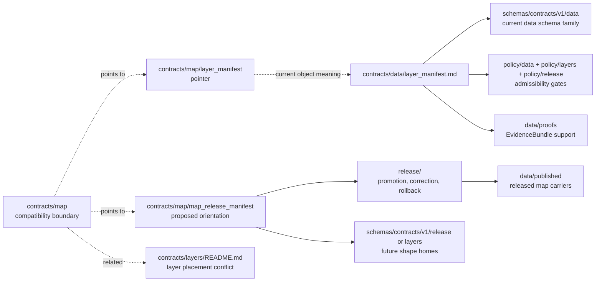

<!-- [KFM_META_BLOCK_V2]
doc_id: kfm://doc/contracts-map-readme
title: contracts/map — Map Contract Compatibility README
type: readme
version: v0.1
status: draft; compatibility; PROPOSED until ADR/schema/release wiring
owners: OWNER_TBD — Map steward · Layer steward · Release steward · Contract steward · UI steward · Evidence steward · Policy steward · Validation steward · Docs steward · Directory Rules reviewer
created: 2026-06-24
updated: 2026-06-24
policy_label: public-with-gates; contracts; map; compatibility; map-first; semantic-orientation; no-parallel-authority; release-gated
related:
  - ../README.md
  - ../layers/README.md
  - ../data/layer_manifest.md
  - ../data/layer_descriptor.md
  - ../data/layer_catalog_item.md
  - ./layer_manifest/README.md
  - ./map_release_manifest/README.md
  - ../../docs/architecture/ui/LAYERING.md
  - ../../docs/architecture/ui/MAP_RUNTIME_BOUNDARY.md
  - ../../docs/architecture/map-master/README.md
  - ../../docs/architecture/map-master/LAYER_LIFECYCLE.md
  - ../../docs/standards/MAP_TRUST_STATES.md
  - ../../docs/standards/RELEASE_MANIFEST.md
  - ../../schemas/contracts/v1/layers/
  - ../../schemas/contracts/v1/release/
  - ../../schemas/contracts/v1/data/
  - ../../policy/layers/
  - ../../policy/release/
  - ../../policy/data/
  - ../../data/registry/layers/
  - ../../data/published/layers/
  - ../../data/proofs/
  - ../../release/
tags: [kfm, contracts, map, compatibility, map-first, layers, layer-manifest, map-release-manifest, maplibre, evidence-bundle, policy-decision, release-manifest, rollback, no-parallel-authority]
notes:
  - "Compatibility/orientation README for the requested `contracts/map/` path."
  - "This path is not yet verified as a canonical map-contract home; use it to route maintainers to inspected layer, data, and release contract surfaces."
  - "Current inspected layer contracts live under `contracts/data/`; `contracts/layers/README.md` preserves the layer/data placement conflict."
  - "The subpaths `contracts/map/layer_manifest/` and `contracts/map/map_release_manifest/` are compatibility/orientation guards, not release or schema authority."
  - "Do not place schemas, policy, fixtures, lifecycle data, source registries, release records, runtime code, map tiles, style JSON, API payloads, UI code, or AI output here."
  - "Previous file content was a placeholder; rollback target is blob SHA `e25f1814e51579d5f55c0f1fe0135ddb28a47f4a`."
[/KFM_META_BLOCK_V2] -->

# contracts/map

> Compatibility and orientation README for map-related semantic contract paths. This folder may point to map-facing contract concepts, but it must not become a parallel authority for layer contracts, release manifests, schemas, policy, map runtime code, published tiles, API payloads, UI components, or AI output.

  
  
  
  
  
  

**Status:** draft compatibility/orientation README  
**Owners:** `OWNER_TBD` — Map steward · Layer steward · Release steward · Contract steward · UI steward · Evidence steward · Policy steward · Validation steward · Docs steward · Directory Rules reviewer  
**Path:** `contracts/map/README.md`  
**Current inspected layer contract surface:** [`../data/layer_manifest.md`](../data/layer_manifest.md), [`../data/layer_descriptor.md`](../data/layer_descriptor.md), [`../data/layer_catalog_item.md`](../data/layer_catalog_item.md)  
**Layer orientation sibling:** [`../layers/README.md`](../layers/README.md)  
**Map compatibility subpaths:** [`./layer_manifest/README.md`](./layer_manifest/README.md), [`./map_release_manifest/README.md`](./map_release_manifest/README.md)  
**Truth posture:** CONFIRMED placeholder replaced · CONFIRMED existing map subpath README guards exist · CONFIRMED inspected layer contracts live outside this folder · PROPOSED map-contract home until ADR/schema/policy/release/test evidence resolves placement

## Quick jumps

[Scope](#scope) · [Repo fit](#repo-fit) · [Current map-facing paths](#current-map-facing-paths) · [Accepted inputs](#accepted-inputs) · [Exclusions](#exclusions) · [Compatibility flow](#compatibility-flow) · [Trust rules](#trust-rules) · [Migration checklist](#migration-checklist) · [Validation checklist](#validation-checklist) · [Rollback](#rollback)

---

## Scope

`contracts/map/` is **not yet verified as a canonical map-contract home**.

This README exists to keep map-facing semantic work from drifting into a convenience folder. Map concepts matter across KFM, but the map surface is downstream of evidence, contracts, schemas, policy, release state, layer registries, public artifacts, and governed APIs.

This folder may contain compatibility/orientation files for map-facing object concepts while placement is unresolved. It must not silently absorb layer contracts, release manifests, style assets, tile payloads, runtime map code, UI components, API routes, or model output.

> [!IMPORTANT]
> A map path is not publication permission. Public map display remains downstream of EvidenceBundle support, PolicyDecision, review state, release state, correction lineage, rollback support, and governed API or released-artifact boundaries.

---

## Repo fit

| Responsibility | Current or expected path | Relationship to this README |
|---|---|---|
| Contracts root rule | [`../README.md`](../README.md) | Contracts define semantic meaning; schemas, policy, tests, and data remain separate. |
| Current layer manifest contract | [`../data/layer_manifest.md`](../data/layer_manifest.md) | Current inspected object-level contract for layer-version manifests. |
| Current layer descriptor contract | [`../data/layer_descriptor.md`](../data/layer_descriptor.md) | Renderer-boundary layer descriptor companion. |
| Current layer catalog item contract | [`../data/layer_catalog_item.md`](../data/layer_catalog_item.md) | Catalog/discovery layer companion. |
| Layer orientation path | [`../layers/README.md`](../layers/README.md) | Existing layer compatibility/orientation README; preserves layer/data placement conflict. |
| Map LayerManifest pointer | [`./layer_manifest/README.md`](./layer_manifest/README.md) | Compatibility guard for a map-oriented `LayerManifest` path. |
| MapReleaseManifest pointer | [`./map_release_manifest/README.md`](./map_release_manifest/README.md) | Compatibility/orientation guard for proposed map-publication envelope concept. |
| Map/layer schemas | `../../schemas/contracts/v1/layers/`, `../../schemas/contracts/v1/data/`, `../../schemas/contracts/v1/release/` | Machine-shape homes; not this folder. |
| Map/layer/release policy | `../../policy/layers/`, `../../policy/data/`, `../../policy/release/`, `../../policy/sensitivity/` | Admissibility and exposure gates; not this folder. |
| Layer registry | `../../data/registry/layers/` | Operational layer registry; not semantic prose. |
| Published map artifacts | `../../data/published/layers/` and accepted published asset roots | Released carriers; not contract authority. |
| Evidence/proofs | `../../data/proofs/` | EvidenceBundle and proof closure; not stored here. |
| Release and rollback | `../../release/` | Promotion, manifests, correction, withdrawal, rollback authority. |
| Runtime map/UI/API code | `../../apps/`, `../../packages/`, `../../pipelines/` | Downstream execution and delivery; not contract authority. |

---

## Current map-facing paths

| Path | Role | Canonical posture |
|---|---|---|
| `contracts/map/README.md` | Parent compatibility/orientation boundary. | This file; not canonical object authority. |
| `contracts/map/layer_manifest/README.md` | Pointer for a map-oriented `LayerManifest` path. | Compatibility guard. |
| `contracts/map/map_release_manifest/README.md` | Orientation for proposed `MapReleaseManifest`. | Compatibility/proposed until ADR and wiring. |
| `contracts/layers/README.md` | Layer compatibility/orientation guide. | Existing inspected layer guide; placement conflict visible. |
| `contracts/data/layer_manifest.md` | Current inspected `LayerManifest` semantic contract. | Current object-level meaning path. |
| `contracts/data/layer_descriptor.md` | Current inspected renderer-boundary layer descriptor. | Current object-level meaning path. |
| `contracts/data/layer_catalog_item.md` | Current inspected/search-confirmed catalog/discovery companion. | Current object-level meaning path. |

---

## Accepted inputs

Only conservative content belongs under `contracts/map/` while this path remains compatibility/proposed:

| Accepted item | Purpose | Required posture |
|---|---|---|
| `README.md` | Parent boundary and orientation guide. | Accepted. |
| `layer_manifest/README.md` | Compatibility pointer for map-oriented `LayerManifest`. | Accepted as pointer only. |
| `map_release_manifest/README.md` | Compatibility/proposed orientation for `MapReleaseManifest`. | Accepted as pointer/orientation only. |
| Short migration notes | Explain movement between map, layer, data, release, and schema homes. | Temporary; must include rollback. |
| Backlink audit notes | Track inbound references to map contract paths during cleanup. | Temporary. |

Future object-level contracts under `contracts/map/` require an accepted ADR or migration note, paired schema home, policy linkage, fixtures, tests, and release/proof/rollback references.

---

## Exclusions

| Do not put this here | Correct home | Reason |
|---|---|---|
| Existing layer object contracts | `../data/` unless ADR moves them | Avoids parallel contract authority. |
| JSON Schema | `../../schemas/contracts/v1/...` | Schemas own machine-checkable shape. |
| Policy rules or decisions | `../../policy/...` | Policy owns allow/deny/restrict/abstain. |
| EvidenceBundle content | `../../data/proofs/` or accepted proof root | Evidence closure is separate. |
| Source descriptors or layer registry records | `../../data/registry/...` | Registry data is not contract prose. |
| RAW / WORK / QUARANTINE / PROCESSED data | `../../data/<phase>/...` | Lifecycle data is not contract meaning. |
| PMTiles, MVT, COG, GeoParquet, sprites, glyphs, style JSON, or tile archives | `../../data/published/` or accepted asset/runtime roots | Emitted carriers are not contracts. |
| Release manifests, rollback cards, correction notices | `../../release/` | Publication is a governed state transition. |
| MapLibre runtime code, adapters, routes, UI components, pipelines | `../../apps/`, `../../packages/`, `../../pipelines/` | Runtime delivery is downstream of contracts. |
| AI-generated summaries or direct model output | Governed AI envelopes and receipts | AI is interpretive and cannot create evidence, policy, or release state. |

> [!WARNING]
> Do not use `contracts/map/` as a bucket for anything that appears on a map. Map visibility is a downstream state, not an ownership rule.

---

## Compatibility flow

---

## Trust rules

Map-facing contracts must preserve these rules:

1. **Map is downstream.** A map view, style, tile, layer, popup, Evidence Drawer, export, or Focus Mode handoff is a carrier, not root truth.
2. **Contracts define meaning only.** They do not define schema shape, policy, release approval, runtime behavior, or public display permission.
3. **Evidence must resolve.** Map-visible claims and feature interactions must resolve to EvidenceBundle support when claims depend on evidence.
4. **Policy must gate exposure.** Rights, source terms, sensitivity, generalization, redaction, staged access, and denial must stay visible and enforceable.
5. **Release state must be explicit.** Candidate, released, stale, degraded, superseded, withdrawn, rollback-ready, and corrected states must not be hidden by the map UI.
6. **Layer and release identities stay distinct.** A `LayerManifest` describes a layer payload version; a proposed `MapReleaseManifest` binds map-release artifacts and release context.
7. **Public clients use governed surfaces.** They must not read RAW, WORK, QUARANTINE, unpublished candidates, canonical/internal stores, direct model output, private graph/vector stores, or credentials.
8. **Unknowns fail closed.** Missing evidence, policy, review, release, rights, or sensitivity state yields `ABSTAIN`, `DENY`, or `ERROR`, not a polished unsupported map claim.

---

## Migration checklist

Before making `contracts/map/` canonical for any object family:

- [ ] Confirm the object does not already have a canonical contract under `contracts/data/`, `contracts/layers/`, `contracts/domains/`, `contracts/release/`, or another accepted root.
- [ ] Add an ADR or migration note explaining why map ownership is correct.
- [ ] Identify the paired schema home and avoid parallel schema roots.
- [ ] Link policy homes for map, layer, release, sensitivity, rights, and audience controls.
- [ ] Link fixtures and tests for allowed, denied, restricted, stale, superseded, withdrawn, and rollback-ready cases.
- [ ] Link EvidenceBundle, receipt, signature, attestation, release, correction, and rollback requirements.
- [ ] Preserve history with `git mv` where moving existing files.
- [ ] Update inbound links and remove stale compatibility notes after migration.
- [ ] Keep public UI/API runtime code outside contracts.

---

## Validation checklist

- [ ] This folder remains compatibility/orientation unless an ADR accepts object authority here.
- [ ] The subpath READMEs do not claim release or schema authority.
- [ ] Existing layer contracts remain discoverable through their inspected homes.
- [ ] Schema, policy, fixtures, tests, validators, data, release records, map assets, runtime code, API payloads, and AI output are not placed here.
- [ ] Map-publication language remains evidence-backed, policy-aware, reviewable, release-gated, correctable, and rollback-ready.
- [ ] Public clients remain behind governed interfaces and released artifacts.

---

## Rollback

Rollback is required if this README is used to justify an unreviewed `contracts/map/` authority root, bypass release gates, collapse layer/release/evidence/policy object families, hide correction or rollback state, or normalize map runtime assets under contracts.

Rollback target for this replacement: previous placeholder blob SHA `e25f1814e51579d5f55c0f1fe0135ddb28a47f4a`.

<a href="#top">Back to top</a>

