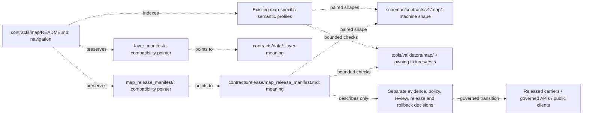

<!-- [KFM_META_BLOCK_V2]
doc_id: kfm://doc/contracts-map-readme
title: contracts/map — Map Semantic Contracts and Compatibility Boundary
type: readme
version: v0.2
status: draft; repository-grounded; mixed-maturity; non-publisher
owners: OWNER_TBD — Map steward · Layer steward · Release steward · Contract steward · UI steward · Evidence steward · Policy steward · Validation steward · Docs steward · Directory Rules reviewer
created: 2026-06-24
updated: 2026-09-07
owning_root: contracts/
responsibility: Index existing map-specific semantic profiles and route compatibility pointers without absorbing layer, release, schema, policy, evidence, registry, or runtime authority.
truth_posture: CONFIRMED pinned inventory and source inspection; draft/proposed child semantics; production enforcement and public readiness not established by this README.
evidence_snapshot: bartytime4life/Kansas-Frontier-Matrix@6087d07b49362540e437dc666d1cbaa6eb6b82c3
prior_blob: 4416722f89251682990db51522d9ce8ee00a4369
policy_label: repository-facing; public-safe-documentation; map-first; semantic-orientation; no-parallel-authority; release-gated
related:
  - ../README.md
  - ../layers/README.md
  - ./layer_manifest/README.md
  - ./map_release_manifest/README.md
  - ../release/map_release_manifest.md
  - ../../docs/doctrine/directory-rules.md
  - ../../docs/adr/ADR-0029-adopt-directory-governance-standard-v2.md
  - ../../schemas/contracts/v1/map/
  - ../../tools/validators/map/
  - ../../tests/map/
  - ../../tests/validators/map/
notes:
  - "Same-path README reconciliation. The parent is no longer accurately described as compatibility-only: twelve object-level contract documents coexist with two compatibility subdirectories."
  - "The LayerManifest pointer still routes to contracts/data/layer_manifest.md; MapReleaseManifest semantics remain under contracts/release/map_release_manifest.md."
  - "This revision changes no child contract, schema, policy, validator, fixture, workflow, registry, renderer, source, or release behavior and adopts no new authority."
  - "The authoring receipt records validation separately; source presence, executed checks, review, release, and public use remain independent claims."
[/KFM_META_BLOCK_V2] -->

<a id="top"></a>

# contracts/map

> Map-specific semantic contracts, bounded assessment profiles, and compatibility
> pointers. A map, tile, scene, style, popup, export, or AI answer is a downstream
> carrier of evidence, not an authority that creates truth or permits publication.

**Status:** repository-grounded draft; mixed-maturity contract family.
**Owning root:** `contracts/`. **Steward assignments:** `OWNER_TBD`.

## Quick jumps

[Scope](#scope) · [Repo fit](#repo-fit) · [Current map-facing paths](#current-map-facing-paths) · [Accepted inputs](#accepted-inputs) · [Exclusions](#exclusions) · [Compatibility flow](#compatibility-flow) · [Trust rules](#trust-rules) · [Migration checklist](#migration-checklist) · [Validation checklist](#validation-checklist) · [Rollback](#rollback)

---

## Scope

This directory contains map-specific **meaning**, including georeference,
representation-fitness, renderer-binding, plugin-assessment, manifest-integrity,
and 3D-carrier profiles. It also retains two compatibility subdirectories that
point to object meanings owned elsewhere.

At the pinned source-inspection checkpoint,
`main@6087d07b49362540e437dc666d1cbaa6eb6b82c3`, the directory has **15 direct
entries**: this README, **12 object-level Markdown contracts**, and **two
compatibility directories**. Recursively it contains 15 Markdown files and two
`.gitkeep` files. These are inventory counts, not coverage or readiness scores.

The previous parent README described the entire directory as compatibility-only
and omitted the twelve contract files. Current repository evidence contradicts
that blanket description. This revision corrects the inventory; it does **not**
ratify every child profile, assign stewards, migrate a contract, or make this
folder a universal home for anything displayed on a map.

> [!IMPORTANT]
> Keep the distinctions intact: the parent indexes map-specific profiles;
> `layer_manifest/` remains a compatibility pointer; `map_release_manifest/`
> remains a compatibility pointer. Draft or fixture-backed semantics do not
> establish live evidence resolution, policy enforcement, release, or public use.

## Repo fit

Placement follows the responsibility split in the adopted
[Directory Rules](../../docs/doctrine/directory-rules.md), accepted through
[ADR-0029](../../docs/adr/ADR-0029-adopt-directory-governance-standard-v2.md).
This is a same-path maintenance change inside `contracts/`, not a root or
object-family migration. The local boundary uses the compact family guidance
of Directory Rules §16 and inherits the [contracts root](../README.md).

| Responsibility | Existing surface | Boundary |
|---|---|---|
| Human-readable map-profile meaning | This directory's individual contracts | Each document retains its own draft/proposed scope; this README is an index, not a replacement definition. |
| Layer meaning | `contracts/data/layer_manifest.md`, `layer_descriptor.md`, `layer_catalog_item.md`, reached through the [LayerManifest pointer](./layer_manifest/README.md) | Do not copy these into a second map-owned contract. The [layer guide](../layers/README.md) retains wider placement questions. |
| Map-release meaning | [MapReleaseManifest contract](../release/map_release_manifest.md) | A release specialization under `contracts/release/`, not under the compatibility directory. |
| Map-facing machine shape | [Map schema family](../../schemas/contracts/v1/map/) | Contains schemas for bounded profiles and other map-facing objects; a schema-family name does not transfer semantic ownership. |
| Executable checks | [Map validators](../../tools/validators/map/), [map tests](../../tests/map/), [validator tests](../../tests/validators/map/) | Implement and exercise bounded rules; directory presence is not an executed pass. |
| Policy, rights, sensitivity, and access | Their governing policy and decision surfaces | Not decided by contract prose, client filtering, or an assessment's positive label. |
| Registry, lifecycle data, and proof | Their established `data/` families | Neither an operational registry nor an EvidenceBundle belongs in this folder. |
| Release, correction, withdrawal, and rollback records | Their governing release/data families | Semantic contracts describe records; they do not execute the transitions. |
| MapLibre, APIs, UI, and pipeline execution | Their owning implementation roots | No renderer, endpoint, browser asset, deployment, or live source is introduced here. |

## Current map-facing paths

### Object-level contracts in this directory

The following inventory is complete for direct-child contract Markdown at the
pinned checkpoint. The descriptions summarize the **declared bounded profiles**;
follow each contract and its implementation for exact fields and predicates.
They are not a claim that all validators were executed together or that every
profile is production-qualified.

| Contract | Bounded responsibility | Positive result must not imply |
|---|---|---|
| [GeoreferenceControlPointSet](./georeference_control_point_set.md) | Bind one synthetic ground-control-point set, its coordinate declarations, ordering, and deterministic identities. | `VALID` is not surveyed accuracy, CRS/datum acceptance, or admissibility. |
| [GeoreferenceControlPointEvidenceAssessment](./georeference_control_point_evidence_assessment.md) | Assess declared visibility, contrast, marker scale, survey-source, and image-matching evidence without dereferencing the point-set reference. | `PASS` does not inspect pixels, authenticate survey work, or establish real GCP quality. |
| [GeoreferenceSpatialDistributionAssessment](./georeference_spatial_distribution.md) | Assess synthetic resource-space GCP coverage, extrapolation, centroid offset, and quadrant distribution. | `READY` does not prove transform accuracy or historical alignment. |
| [GeoreferenceTransformQualityAssessment](./georeference_transform_quality.md) | Fit a synthetic planar affine transform and compare recomputed residuals with declared thresholds. | `READY` or low residual error does not establish geodetic or historical truth. |
| [IIIFHistoricOverlayReadinessAssessment](./iiif_historic_overlay_readiness.md) | Preflight captured-byte bindings and declared overlay, rights/CARE, plugin, evidence, and rollback metadata. | `READY` does not fetch an IIIF service, warp imagery, authenticate references, or activate a plugin. |
| [MapManifestIntegrityAssessment](./map_manifest_integrity_assessment.md) | Bind manifest/expected hashes, carried signature and evidence/proof verdicts, and selected-asset verification context. | `ANSWER` does not perform signing, authenticate a signer, resolve evidence, or authorize release. |
| [RendererBindingAssessmentCandidate](./renderer_binding_assessment.md) | Assess an inactive renderer-to-layer relationship while preserving descriptor, manifest, artifact, evidence, policy, and release references. | `REVIEW_REQUIRED` is not registration, renderer execution, or permission to call `addSource`/`addLayer`. |
| [RendererPluginAdmissionAssessment](./renderer_plugin_admission_assessment.md) | Assess synthetic version, digest, supply-chain, license, adapter, network, and removal/rollback declarations. | `PASS` is not package verification, plugin admission, installation, or import; review remains held. |
| [RepresentationFitnessAssessment](./representation_fitness_assessment.md) | Compare declared scale, time, source role, fidelity, and geometry with one intended use. | `FIT` is not evidence truth, actual measurement accuracy, policy approval, or public-use authorization. |
| [ThreeDAdmissionDecision](./three_d_admission_decision.md) | Assess explanatory burden, geometry labeling, 2D trust parity, sensitivity, reality-boundary, and plugin references. | `ALLOW_RENDER_CANDIDATE` does not boot a renderer or approve a public scene. |
| [Tiles3DTreeHashManifest](./tiles3d_tree_hash_manifest.md) | Describe a bounded deterministic inventory and exact-byte hashes for a local 3D Tiles directory. | Byte integrity is not full 3D Tiles conformance, factual accuracy, attestation, or release. |
| [Tiles3D STAC Item adapter](./tiles3d_stac_item_adapter.md) | Bind a tree-hash manifest, adapter request, and local asset bytes into an unreleased catalog candidate. | `PASS` is not catalog publication, evidence resolution, profile adoption, or public-scene authority. |

### Compatibility pointers and release specialization

| Path | Current role | Maintainer action |
|---|---|---|
| [layer_manifest/README.md](./layer_manifest/README.md) | Compatibility pointer to the layer contracts under `contracts/data/`. | Follow the pointer; do not create a second LayerManifest or silently settle the data/layers placement discussion. |
| [map_release_manifest/README.md](./map_release_manifest/README.md) | Compatibility pointer to [contracts/release/map_release_manifest.md](../release/map_release_manifest.md). | Preserve the redirect and the distinct general-release, map-release, layer, style, and artifact identities. |
| [MapReleaseManifest schema](../../schemas/contracts/v1/map/map_release_manifest.schema.json) | Existing machine shape for the release-owned semantic specialization. | Do not infer a missing schema or invent a second schema under a different root. |

`MapReleaseManifest` is no longer only a proposed filename: its semantic
contract, schema, [validator](../../tools/validators/map/validate_map_release_manifest.py),
and [focused test module](../../tests/map/test_map_release_manifest.py) exist.
Its documented profile nevertheless remains **fixture-first and
`PROPOSED_INACTIVE`**. A synthetic `PUBLISHED`, `STALE`, `SUPERSEDED`,
`WITHDRAWN`, or `ROLLED_BACK` declaration is not evidence that a real release,
cache invalidation, or rollback happened. Range/CORS declarations are not live
HTTP measurements; carried review or signature references are not authentication.

## Accepted inputs

This family may contain maintained semantic-contract Markdown, its navigation,
and narrowly scoped compatibility or migration notes. Existing object contracts
must retain their declared scope and point to their own machine shape,
implementation, fixtures, tests, and evidence limitations.

An ordinary same-path correction does not need to wait for production release
or universal profile adoption. New meaning must first be checked against
existing object ownership and overlap. An authority change, relocation,
compatibility retirement, or competing definition requires the applicable
accepted decision or governed migration, with consumer validation and rollback.

Use this README for discovery and local boundaries. Do not grow it into a second
schema, complete field dictionary, outcome registry, release checklist authority,
or implementation inventory for the entire Explorer.

## Exclusions

| Do not store or redefine here | Correct responsibility |
|---|---|
| JSON Schema or executable validation | `schemas/`, `tools/`, and `tests/` according to existing family placement. |
| Policy rules, live admission, or review approval | Governing policy and authorized decision/review processes. |
| Source descriptors, registry records, EvidenceBundles, proofs, or receipts | Their established data/accountability families; the authoring receipt is separate from this README. |
| RAW, WORK, QUARANTINE, PROCESSED, or released data payloads | Their correct lifecycle lanes, with governed promotion. |
| Tiles, PMTiles, rasters, GeoParquet, sprites, glyphs, styles, or scene assets | Their owning source, build, runtime, or released-carrier surfaces; never a contract convenience bucket. |
| Emitted release, correction, withdrawal, or rollback records | Their governing release/data families, not their semantic-documentation folder. |
| Renderer code, UI components, API routes, connectors, or pipeline implementations | Their owning implementation roots. |
| Layer or release contracts already owned elsewhere | Reference the existing contract instead of cloning it here. |
| Generated AI language presented as evidence or permission | Governed interpretation and accountability, subordinate to evidence and release checks. |

## Compatibility flow

This is a **responsibility and reference diagram**, not an execution graph or a
claim that the whole path is wired and deployed.


```mermaid
flowchart LR
  INDEX["contracts/map/README.md: navigation"] -. indexes .-> PROFILES["Existing map-specific semantic profiles"]
  INDEX -. preserves .-> LP["layer_manifest/: compatibility pointer"]
  INDEX -. preserves .-> RP["map_release_manifest/: compatibility pointer"]
  LP -. points to .-> LAYER["contracts/data/: layer meaning"]
  RP -. points to .-> RELEASE["contracts/release/map_release_manifest.md: meaning"]
  PROFILES -. paired shapes .-> SHAPE["schemas/contracts/v1/map/: machine shape"]
  RELEASE -. paired shape .-> SHAPE
  PROFILES -. bounded checks .-> CHECKS["tools/validators/map/ + owning fixtures/tests"]
  RELEASE -. bounded checks .-> CHECKS
  RELEASE -. describes only .-> GATE["Separate evidence, policy, review, release and rollback decisions"]
  GATE -. governed transition .-> PUBLIC["Released carriers / governed APIs / public clients"]
```

## Trust rules

1. **Map is downstream.** Maps, scenes, tiles, popups, Evidence Drawers, reports,
   and Focus Mode output are carriers. Visual success cannot establish truth.
2. **Keep meaning and authority separate.** Schema validity, local coherence,
   mathematical fit, byte integrity, plugin-assessment results, review, and
   release are different claims. No positive assessment result substitutes for
   the next gate.
3. **Resolve evidence, not just references.** Consequential claims require
   `EvidenceRef -> EvidenceBundle` support. An opaque reference or a carried
   `resolved`/`verified` declaration is not actual resolution or authentication.
4. **Keep place, time, and source role explicit.** Synthetic control coordinates
   are not surveyed locations; an affine fit is not historical certainty;
   generalized geometry is not exact geometry; a modeled surface is not an
   observation. Scale, time coverage, and intended use retain their own limits.
5. **Gate sensitive exposure.** Rights, source terms, sovereignty/CARE, privacy,
   rare species, archaeology, infrastructure, and private-land risks require
   their governing review and transforms. Hiding a feature in the browser is
   not redaction or authorization.
6. **Expose correction and release context.** Layer, artifact, map release,
   evidence, and review identities stay distinct. Stale, held, superseded,
   withdrawn, denied, and corrected conditions must not disappear behind a
   friendly map. Use each object's own status vocabulary rather than inventing
   a global map-status enum.
7. **Use governed public paths.** Public clients consume governed APIs or
   released public-safe artifacts, never RAW, WORK, QUARANTINE, unreleased
   candidates, internal registries/stores, direct model output, or credentials.
8. **Fail closed and remain reversible.** Missing or conflicting support must
   preserve the owning profile's hold, abstention, denial, or error. AI cannot
   fill evidence gaps, authorize release, or silently rewrite provenance.

The lifecycle remains:

```text
RAW -> WORK/QUARANTINE -> PROCESSED -> CATALOG/TRIPLET -> PUBLISHED
```

Promotion is a governed transition, not a file move, contract edit, successful
fixture run, map toggle, or pull-request merge. These are contract expectations;
this README does not certify their complete runtime enforcement.

## Migration checklist

Use this checklist only when changing placement or authority, not as an excuse
to defer a safe documentation correction.

- [ ] Identify the object owner and existing contracts before adding, moving,
      renaming, or copying a definition.
- [ ] Record the applicable Directory Rules decision and any required ADR,
      PathDecisionRecord, alias, or migration note.
- [ ] Preserve the two compatibility pointers until their consumers and the
      authority-changing transition have been explicitly reviewed.
- [ ] Reconcile schema, validator, fixture, test, policy, and release references
      without flattening their different responsibilities or result vocabularies.
- [ ] Audit inbound links, stable IDs, anchors, and downstream consumers; use a
      history-preserving move when a governed relocation is actually authorized.
- [ ] Preserve source integrity, sensitivity, evidence, review, correction, and
      rollback obligations; do not treat adoption as activation or publication.

No relocation, pointer retirement, schema-home decision, renderer selection,
source admission, release, or deployment is performed by this revision.

## Validation checklist

### Documentation maintenance

- [ ] Re-pin main, target bytes, governing documents, and overlapping work.
- [ ] Compare the directory inventory with every direct-child contract and both
      compatibility pointers; preserve identity and inbound anchors.
- [ ] Check relative links against the pinned tree, including the release-owned
      MapReleaseManifest and its existing map-family schema.
- [ ] Keep every implementation, test, policy, source, release, and public-use
      claim within its actual evidence boundary.
- [ ] Run focused Markdown/metadata, fence, whitespace, and navigation checks;
      record checks not run rather than treating them as passing.
- [ ] Emit and validate the generated-work receipt, keeping human review pending
      until an authorized reviewer acts.

### Bounded executable evidence

The [map schema directory](../../schemas/contracts/v1/map/) and
[validator directory](../../tools/validators/map/) contain companions for the
listed profiles. Test responsibility is split between [tests/map](../../tests/map/)
and [tests/validators/map](../../tests/validators/map/); neither directory alone
is a complete proof of this family.

For example, the existing RepresentationFitnessAssessment profile has a
[fixture corpus](../../fixtures/contracts/v1/map/representation_fitness_assessment/cases.json)
and [focused tests](../../tests/validators/map/test_representation_fitness_assessment.py).
From a repository checkout with its test environment prepared:

```bash
PYTHONDONTWRITEBYTECODE=1 KFM_NO_NETWORK=1 \
  python -m pytest tests/validators/map/test_representation_fitness_assessment.py -q
PYTHONDONTWRITEBYTECODE=1 KFM_NO_NETWORK=1 \
  python tools/validators/map/validate_representation_fitness_assessment.py --fixtures
```

These commands cover **one profile only**, not the complete map family, browser,
real geodata, public release, or policy. The environment variable is a declared
execution posture, not by itself proof of network isolation. The fixture runner's
`PASS` means its observed outcome matched the expected case, including expected
`HOLD`; it does not turn `HOLD` into `FIT` or public-use permission.

### Evidence and open verification

Repository evidence for this revision is the pinned tree, the twelve child
contracts, both pointer READMEs, the release specialization, and the inspected
schema/tool/test surfaces. The Drive *Directory Rules* document, Drive *Master
MapLibre Components-Functions-Features* v2.0 (2026-05-16), and Notion *KFM
Repository Workbench* were consulted as lineage and coordination, not adoption,
implementation, approval, or deployment evidence.

**Still open:** steward assignments; each profile's full consumer and policy
closure; any needed authority-changing migration; complete family-wide execution;
independent review; hosted exact-head checks; live artifact/header/signature and
evidence validation; browser/3D parity; release and rollback rehearsal. Child
metadata can retain older snapshots: re-read applicable current authority before
acting on a child document's historical status claim.

An authoring receipt reports this change and its actual checks. It is not a
proof object, independent review, or permission to cross a held transition.

## Rollback

The immediately preceding README is blob
`4416722f89251682990db51522d9ce8ee00a4369` at the pinned base. The older placeholder
is historical lineage, not the rollback target for this update.

Before integration, retain the branch as unintegrated work. After an authorized
integration, use a separately reviewed forward revert of the bounded commit;
retain its provenance in Git history. Reverting this README does not revert any
child contract, schema, validator, renderer, released artifact, cache, or source.
No live state is changed by this documentation revision.

Correct or withdraw this revision if it is used to claim blanket map authority,
plugin admission, evidence closure, review approval, or public readiness beyond
the inspected profiles. Keep the compatibility pointers and their targets
available throughout any separately governed migration.

<p align="right"><a href="#top">Back to top</a></p>
