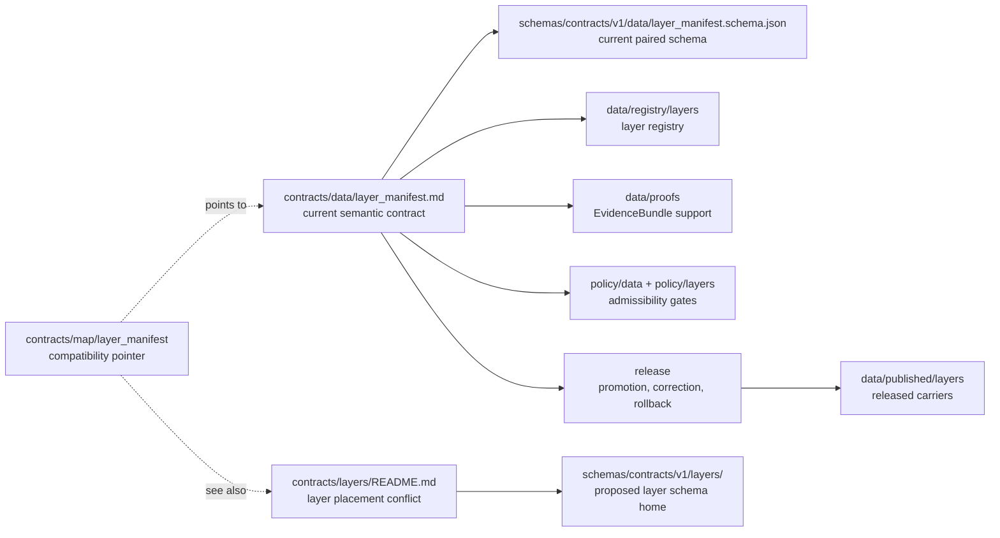

<!-- [KFM_META_BLOCK_V2]
doc_id: kfm://doc/contracts-map-layer-manifest-compat-readme
title: contracts/map/layer_manifest — LayerManifest Compatibility README
type: readme
version: v0.1
status: draft
owners: OWNER_TBD — Map steward · Layer steward · Contract steward · Data steward · UI steward · Evidence steward · Policy steward · Release steward · Docs steward · Directory Rules reviewer
created: 2026-06-24
updated: 2026-06-24
policy_label: public-with-gates; contracts; map; layer-manifest; compatibility; map-first; release-gated; no-parallel-authority
related:
  - ../../README.md
  - ../../data/layer_manifest.md
  - ../../data/layer_descriptor.md
  - ../../data/layer_catalog_item.md
  - ../../layers/README.md
  - ../../../docs/architecture/ui/LAYERING.md
  - ../../../docs/architecture/map-master/LAYER_LIFECYCLE.md
  - ../../../docs/architecture/ui/MAP_RUNTIME_BOUNDARY.md
  - ../../../docs/architecture/contract-schema-policy-split.md
  - ../../../schemas/contracts/v1/data/layer_manifest.schema.json
  - ../../../schemas/contracts/v1/layers/
  - ../../../policy/data/
  - ../../../policy/layers/
  - ../../../data/registry/layers/
  - ../../../data/published/layers/
  - ../../../data/proofs/
  - ../../../release/
tags: [kfm, contracts, map, layer-manifest, compatibility, semantic-contracts, map-first, layer, evidence-bundle, policy-decision, release-manifest, rollback, no-parallel-authority]
notes:
  - "Compatibility pointer for the requested `contracts/map/layer_manifest/` path."
  - "The inspected object-level LayerManifest semantic contract is `contracts/data/layer_manifest.md`."
  - "The inspected layer-lane orientation README is `contracts/layers/README.md`, which preserves the layer/data schema-home conflict rather than resolving it silently."
  - "Do not place schemas, policy, fixtures, lifecycle data, source registries, release records, runtime code, map tiles, style JSON, API payloads, UI code, or AI output here."
  - "Previous file content was a placeholder; rollback target is blob SHA `e25f1814e51579d5f55c0f1fe0135ddb28a47f4a`."
[/KFM_META_BLOCK_V2] -->

# contracts/map/layer_manifest

> Compatibility guard for a map-oriented `LayerManifest` path. The inspected semantic contract is [`contracts/data/layer_manifest.md`](../../data/layer_manifest.md); this README prevents the requested path from becoming a parallel authority.

  
  
  
  
  
  

**Status:** draft compatibility guard  
**Owners:** `OWNER_TBD` — Map steward · Layer steward · Contract steward · Data steward · UI steward · Evidence steward · Policy steward · Release steward · Docs steward · Directory Rules reviewer  
**Path:** `contracts/map/layer_manifest/README.md`  
**Current inspected LayerManifest contract:** [`../../data/layer_manifest.md`](../../data/layer_manifest.md)  
**Layer orientation sibling:** [`../../layers/README.md`](../../layers/README.md)  
**Truth posture:** CONFIRMED placeholder replaced · CONFIRMED inspected LayerManifest contract lives under `contracts/data/` · CONFIRMED layer-lane placement conflict is already surfaced under `contracts/layers/README.md` · PROPOSED cleanup until ADR or maintainer review resolves map/data/layer homes

## Quick jumps

[Scope](#scope) · [Repo fit](#repo-fit) · [Accepted inputs](#accepted-inputs) · [Exclusions](#exclusions) · [Compatibility flow](#compatibility-flow) · [LayerManifest trust rules](#layermanifest-trust-rules) · [Migration checklist](#migration-checklist) · [Validation checklist](#validation-checklist) · [Rollback](#rollback)

---

## Scope

`contracts/map/layer_manifest/` is **not** confirmed as the canonical `LayerManifest` contract home.

It exists as a compatibility pointer for a map-oriented requested path. A `LayerManifest` is map-relevant because it describes a governed layer payload version and its evidence, source-role, lifecycle, integrity, policy, review, release, freshness, sensitivity, correction, supersession, and rollback context. But map relevance does not make `contracts/map/` a contract authority root by itself.

Use this README to route maintainers to the inspected contract and to prevent accidental drift.

> [!IMPORTANT]
> **Do not add the object-level `LayerManifest` contract here unless an accepted ADR or migration explicitly moves it.** The current inspected semantic contract is `contracts/data/layer_manifest.md`. The current inspected layer-lane orientation path is `contracts/layers/README.md`.

---

## Repo fit

| Responsibility | Current or expected path | Relationship to this README |
|---|---|---|
| Contracts root rule | [`../../README.md`](../../README.md) | Contracts define semantic meaning; schemas, policy, tests, and data remain separate. |
| Current LayerManifest semantic contract | [`../../data/layer_manifest.md`](../../data/layer_manifest.md) | Current inspected object-level contract. |
| LayerDescriptor companion | [`../../data/layer_descriptor.md`](../../data/layer_descriptor.md) | Renderer-boundary companion contract. |
| LayerCatalogItem companion | [`../../data/layer_catalog_item.md`](../../data/layer_catalog_item.md) | Catalog/discovery companion contract. |
| Layer orientation path | [`../../layers/README.md`](../../layers/README.md) | Existing layer compatibility/orientation README; preserves placement conflict. |
| Map-oriented requested path | `contracts/map/layer_manifest/README.md` | This compatibility pointer only. |
| Current paired schema path | `../../../schemas/contracts/v1/data/layer_manifest.schema.json` | Current schema named by the inspected contract; placeholder status remains separate. |
| Proposed layer schema home | `../../../schemas/contracts/v1/layers/` | Proposed/related layer schema home; not resolved by this README. |
| Layer policy | `../../../policy/data/`, `../../../policy/layers/` | Policy decides admissibility; not contract prose. |
| Layer registry | `../../../data/registry/layers/` | Registry records layer identity and state; not this README. |
| Published layer artifacts | `../../../data/published/layers/` | Released payload carriers; not semantic authority. |
| Evidence/proofs | `../../../data/proofs/` | EvidenceBundle/proof closure; not stored here. |
| Release and rollback | `../../../release/` | Promotion, release manifests, correction, withdrawal, and rollback authority. |
| Runtime map/UI/API code | `../../../apps/`, `../../../packages/`, `../../../pipelines/` | Downstream execution and delivery; not contract authority. |

The safe interpretation is:

- `contracts/data/layer_manifest.md` currently defines `LayerManifest` meaning.
- `contracts/layers/README.md` documents the wider layer-contract placement conflict.
- `contracts/map/layer_manifest/README.md` points to those authorities and must not create a third lane.

---

## Accepted inputs

Only these belong here while this path remains compatibility-only:

| Accepted item | Purpose | Required posture |
|---|---|---|
| `README.md` | Pointer to the inspected `LayerManifest` contract and layer orientation README. | Accepted. |
| Migration note | Temporary note if an ADR moves `LayerManifest` into or out of this path. | Temporary; must include rollback. |
| Backlink audit note | Temporary note listing inbound references to this map-oriented path. | Temporary; should be removed after links are corrected. |

No durable object contracts, schemas, fixtures, policies, data artifacts, or runtime files should be added here without an accepted ADR/migration note.

---

## Exclusions

| Do not put this here | Correct home | Reason |
|---|---|---|
| Object-level `LayerManifest` semantic contract | `../../data/layer_manifest.md` unless ADR moves it | Avoids parallel contract authority. |
| Other layer object contracts | `../../data/` or future accepted `../../layers/` contract home | Placement is not resolved by this pointer. |
| JSON Schema | `../../../schemas/contracts/v1/data/` or resolved `../../../schemas/contracts/v1/layers/` | Schemas own machine shape. |
| Policy rules or policy decisions | `../../../policy/data/`, `../../../policy/layers/`, `../../../policy/sensitivity/` | Policy owns allow/deny/restrict/abstain. |
| Fixtures, tests, validators | `../../../fixtures/`, `../../../tests/`, `../../../tools/validators/` | Proof and execution live outside contracts. |
| Layer registry records | `../../../data/registry/layers/` | Registry is operational data, not semantic prose. |
| RAW / WORK / QUARANTINE / PROCESSED data | `../../../data/<phase>/...` | Lifecycle data is not contract meaning. |
| PMTiles, MVT, COG, GeoParquet, sprites, glyphs, style JSON, or map assets | `../../../data/published/` or accepted runtime/style roots | Emitted carriers are not contracts. |
| Release manifests, rollback cards, correction notices | `../../../release/` | Publication is a governed state transition. |
| Map UI, API routes, adapters, or pipelines | `../../../apps/`, `../../../packages/`, `../../../pipelines/` | Runtime surfaces are downstream of governance. |
| AI-generated summaries or answers | Governed AI envelopes and receipts | AI is interpretive, not root truth. |

> [!WARNING]
> A `contracts/map/` lane can easily collapse contract meaning, map runtime configuration, style artifacts, layer registry records, and public display behavior. Keep this path narrow until Directory Rules or an ADR says otherwise.

---

## Compatibility flow

---

## LayerManifest trust rules

A `LayerManifest` should remain a governed trust-spine carrier for a layer payload version.

Minimum rules:

- it identifies a layer version, not raw source truth;
- it may reference dataset versions, source descriptors, EvidenceBundles, artifact hashes, policy state, review state, release state, correction state, and rollback targets;
- it must not replace `EvidenceBundle`, `PolicyDecision`, `ReleaseManifest`, `SourceDescriptor`, tile artifacts, renderer configuration, or public UI/API behavior;
- it must preserve lifecycle separation: RAW, WORK, QUARANTINE, PROCESSED, CATALOG/TRIPLET, and PUBLISHED states must not be blurred;
- it must make stale, superseded, degraded, withdrawn, restricted, or unreleased layer state visible where relevant;
- public clients should consume only governed interfaces, released artifacts, layer registry records, catalog records, tile services, and policy-safe envelopes;
- missing evidence, missing policy, missing review, unresolved rights, or unresolved release state must fail closed rather than silently becoming a map layer.

---

## Migration checklist

When maintainers encounter files under `contracts/map/layer_manifest/`:

- [ ] Confirm whether the file is this compatibility README.
- [ ] If it defines object meaning, compare it to `contracts/data/layer_manifest.md` before moving or merging.
- [ ] If it is map/layer orientation prose, compare it to `contracts/layers/README.md` before merging.
- [ ] If it is JSON Schema, move it to the accepted `schemas/contracts/v1/...` home after schema-home conflict review.
- [ ] If it is policy, move it to the accepted `policy/...` home.
- [ ] If it is registry data, move it to `data/registry/layers/`.
- [ ] If it is lifecycle data or public artifacts, identify the lifecycle/release state before moving.
- [ ] If it is map runtime code, move it to the accepted app/package/pipeline root.
- [ ] Preserve history with `git mv` where practical.
- [ ] Record rollback targets for every moved or merged file.
- [ ] Resolve placement by ADR or migration note before declaring `contracts/map/layer_manifest/` canonical.

---

## Validation checklist

- [ ] This path remains a pointer unless an ADR accepts it as canonical.
- [ ] `contracts/data/layer_manifest.md` remains the inspected object-level contract until migration.
- [ ] `contracts/layers/README.md` remains the inspected layer-lane orientation path until migration.
- [ ] No schema, policy, data, release, fixture, test, validator, style, map runtime, API, UI, or AI output is normalized into this folder.
- [ ] The schema-home conflict between data/layer and layers/layer homes remains visible until resolved.
- [ ] Public map display remains downstream of evidence, policy, review, release, correction, and rollback.

---

## Rollback

Rollback is required if this README is used to justify a parallel `LayerManifest` authority, to bypass the inspected `contracts/data/layer_manifest.md` contract, to ignore the layer/data schema-home conflict, or to place runtime map assets and public display behavior under contracts.

Rollback target for this replacement: previous placeholder blob SHA `e25f1814e51579d5f55c0f1fe0135ddb28a47f4a`.

<a href="#top">Back to top</a>

