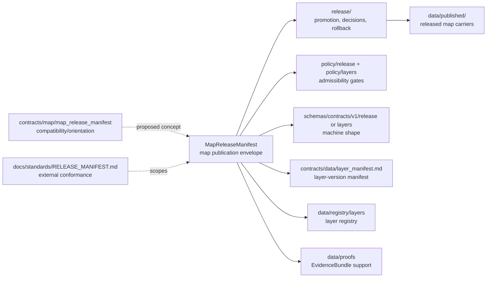

<!-- [KFM_META_BLOCK_V2]
doc_id: kfm://doc/contracts-map-map-release-manifest-readme
title: contracts/map/map_release_manifest — MapReleaseManifest Compatibility README
type: readme
version: v0.1
status: draft; compatibility; PROPOSED until ADR/schema/release wiring
owners: OWNER_TBD — Map steward · Release steward · Layer steward · Contract steward · Evidence steward · Policy steward · Validation steward · Docs steward · Directory Rules reviewer
created: 2026-06-24
updated: 2026-06-24
policy_label: public-with-gates; contracts; map; release; map-release-manifest; compatibility; release-gated; evidence-aware; no-parallel-authority
related:
  - ../../README.md
  - ../../data/layer_manifest.md
  - ../../data/layer_descriptor.md
  - ../../data/layer_catalog_item.md
  - ../../layers/README.md
  - ../layer_manifest/README.md
  - ../../../docs/standards/RELEASE_MANIFEST.md
  - ../../../docs/architecture/publication/RELEASE_GATES.md
  - ../../../docs/architecture/publication/ROLLBACK.md
  - ../../../docs/architecture/map-master/README.md
  - ../../../docs/architecture/map-master/LAYER_LIFECYCLE.md
  - ../../../docs/architecture/ui/LAYERING.md
  - ../../../docs/standards/MAP_TRUST_STATES.md
  - ../../../schemas/contracts/v1/release/
  - ../../../schemas/contracts/v1/layers/
  - ../../../policy/release/
  - ../../../policy/layers/
  - ../../../data/registry/layers/
  - ../../../data/published/layers/
  - ../../../data/proofs/
  - ../../../release/
tags: [kfm, contracts, map, release, map-release-manifest, release-manifest, layer-manifest, evidence-bundle, policy-decision, release-gated, rollback, correction-lineage, compatibility]
notes:
  - "Compatibility/orientation README for the requested `contracts/map/map_release_manifest/` path."
  - "`docs/standards/RELEASE_MANIFEST.md` confirms `MapReleaseManifest` as a MapLibre report/object-index anchor but also states that object meaning, machine shape, policy admissibility, release decisions, and map-asset families belong in their own homes."
  - "This README does not create release approval, policy approval, schema authority, runtime map behavior, or publication state."
  - "Previous file content was a placeholder; rollback target is blob SHA `e25f1814e51579d5f55c0f1fe0135ddb28a47f4a`."
[/KFM_META_BLOCK_V2] -->

# contracts/map/map_release_manifest

> Compatibility and orientation README for `MapReleaseManifest`, a proposed map-publication envelope that should bind released map artifacts to evidence, policy, rights, sensitivity, attestations, correction lineage, and rollback — without replacing the release system itself.

  
  
  
  
  
  

**Status:** draft compatibility/orientation README  
**Owners:** `OWNER_TBD` — Map steward · Release steward · Layer steward · Contract steward · Evidence steward · Policy steward · Validation steward · Docs steward · Directory Rules reviewer  
**Path:** `contracts/map/map_release_manifest/README.md`  
**Closest verified standards anchor:** [`../../../docs/standards/RELEASE_MANIFEST.md`](../../../docs/standards/RELEASE_MANIFEST.md)  
**Layer-manifest companion:** [`../layer_manifest/README.md`](../layer_manifest/README.md) and [`../../data/layer_manifest.md`](../../data/layer_manifest.md)  
**Truth posture:** CONFIRMED placeholder replaced · CONFIRMED `MapReleaseManifest` appears in the ReleaseManifest standards dossier as a MapLibre report/object-index anchor · PROPOSED object-home and schema-home until ADR, schema, policy, release, and tests are verified

## Quick jumps

[Scope](#scope) · [Repo fit](#repo-fit) · [Semantic meaning](#semantic-meaning) · [Accepted inputs](#accepted-inputs) · [Exclusions](#exclusions) · [Compatibility flow](#compatibility-flow) · [Trust rules](#trust-rules) · [Migration checklist](#migration-checklist) · [Validation checklist](#validation-checklist) · [Rollback](#rollback)

---

## Scope

`contracts/map/map_release_manifest/` is **not yet verified as a canonical contract home**.

This README exists because KFM has a map-specific release concept, `MapReleaseManifest`, but the inspected release standards dossier keeps object meaning, machine shape, policy admissibility, release decisions, rollback procedure, and map-asset families in separate homes.

Use this path as a compatibility/orientation surface until an accepted ADR or migration decides whether `MapReleaseManifest` belongs under a map contract lane, a release contract lane, a layer contract lane, or a versioned `contracts/v1/release/` family.

> [!IMPORTANT]
> A `MapReleaseManifest` may describe the publication envelope for a map release, but it does **not** publish anything by itself. Promotion, release approval, correction, withdrawal, and rollback remain governed release actions.

---

## Repo fit

| Responsibility | Current or expected path | Relationship to this README |
|---|---|---|
| Contracts root rule | [`../../README.md`](../../README.md) | Defines semantic contract purpose and separates schemas, policy, data, and validation. |
| Release standards dossier | [`../../../docs/standards/RELEASE_MANIFEST.md`](../../../docs/standards/RELEASE_MANIFEST.md) | External conformance and release-manifest standards posture; not object meaning. |
| Current layer manifest contract | [`../../data/layer_manifest.md`](../../data/layer_manifest.md) | Layer-version trust-spine companion; not map-release approval. |
| Layer orientation path | [`../../layers/README.md`](../../layers/README.md) | Existing layer compatibility/orientation README. |
| Map layer manifest pointer | [`../layer_manifest/README.md`](../layer_manifest/README.md) | Compatibility pointer for map-oriented `LayerManifest`. |
| Release decisions and artifacts | `../../../release/` | Promotion, release manifests, correction, withdrawal, rollback authority. |
| Release policy | `../../../policy/release/` | Allow/deny/restrict/abstain and gate policy; not owned here. |
| Layer policy | `../../../policy/layers/` | Map/layer display admissibility; not owned here. |
| Release schemas | `../../../schemas/contracts/v1/release/` | Expected/proposed machine-shape home for release objects. |
| Layer schemas | `../../../schemas/contracts/v1/layers/` | Expected/proposed shape home for layer/map assets where accepted. |
| Layer registry | `../../../data/registry/layers/` | Layer identity and registry state; not contract prose. |
| Published map artifacts | `../../../data/published/layers/` and accepted published asset roots | Released carriers; not semantic authority. |
| Evidence/proofs | `../../../data/proofs/` | EvidenceBundle and proof closure; not stored here. |
| Runtime map/UI/API code | `../../../apps/`, `../../../packages/`, `../../../pipelines/` | Downstream execution and delivery; not contract authority. |

---

## Semantic meaning

`MapReleaseManifest` is a **PROPOSED** map-publication envelope concept.

It should mean: a governed release-side manifest for a public or staged map package that binds map-visible artifacts and trust context together. It may reference:

- release identity and release state;
- included layer manifests, layer descriptors, style manifests, tile or asset manifests, and catalog entries;
- artifact digests, canonicalization metadata, signatures, attestations, and run receipts;
- EvidenceRefs / EvidenceBundle digests needed to support map claims and feature interactions;
- rights, source terms, source-role posture, and attribution requirements;
- sensitivity, redaction, generalization, withholding, or staged-access decisions;
- PolicyDecision, review state, steward approvals, and release gate outcomes;
- correction lineage, supersession, withdrawal, rollback target, and stale/degraded markers.

It must not mean:

- raw data;
- direct source truth;
- policy approval;
- release approval by itself;
- proof closure by itself;
- an EvidenceBundle;
- a renderer implementation;
- a tile archive;
- a MapLibre style file;
- an API response;
- an AI answer.

---

## Accepted inputs

Only these belong here while this path remains compatibility/proposed:

| Accepted item | Purpose | Required posture |
|---|---|---|
| `README.md` | Orientation and boundary guard for the requested `MapReleaseManifest` path. | Accepted. |
| Draft semantic contract | `map_release_manifest.md`, only if maintainers accept this path as the object-home. | PROPOSED until ADR/schema/policy/test-linked. |
| Migration note | Explains movement between map, release, layer, and data contract homes. | Temporary; must include rollback. |
| Backlink audit note | Lists inbound references to this path during cleanup. | Temporary. |

If an object-level `MapReleaseManifest` contract is added here, it must explicitly link the paired schema, policy, fixtures, tests, release workflow, proof/receipt requirements, and rollback behavior. Do not infer those from this README.

---

## Exclusions

| Do not put this here | Correct home | Reason |
|---|---|---|
| Release decisions, signed release manifests, rollback cards, correction notices | `../../../release/` | Publication is a governed state transition. |
| JSON Schema | `../../../schemas/contracts/v1/release/` or accepted schema home | Schemas own machine shape. |
| Policy rules or decisions | `../../../policy/release/`, `../../../policy/layers/`, `../../../policy/sensitivity/` | Policy owns admissibility and exposure. |
| Full EvidenceBundle content | `../../../data/proofs/` or accepted evidence/proof home | Evidence closure is separate. |
| RAW / WORK / QUARANTINE / PROCESSED data | `../../../data/<phase>/...` | Lifecycle data is not contract meaning. |
| PMTiles, MVT, COG, GeoParquet, sprites, glyphs, style JSON, or map assets | `../../../data/published/` or accepted asset/runtime roots | Emitted carriers are not semantic contracts. |
| Layer registry records | `../../../data/registry/layers/` | Registry is operational data, not semantic prose. |
| Validators, fixtures, tests | `../../../tools/validators/`, `../../../fixtures/`, `../../../tests/` | Proof and execution live outside contracts. |
| Map UI/API routes/adapters/pipelines | `../../../apps/`, `../../../packages/`, `../../../pipelines/` | Runtime delivery is downstream of governance. |
| AI-generated summaries or direct model output | Governed AI envelopes and receipt roots | AI is interpretive and cannot create release state. |

---

## Compatibility flow

---

## Trust rules

A `MapReleaseManifest` contract must preserve these invariants:

1. **Release is governed.** A manifest describes or binds a release; it does not replace review, policy, promotion, correction, withdrawal, or rollback.
2. **Map display is downstream.** Public map UI, tiles, layers, styles, and API responses are carriers, not root truth.
3. **Evidence remains resolvable.** Map-visible claims and feature interactions must resolve through EvidenceRefs / EvidenceBundles where claims depend on evidence.
4. **Policy remains visible.** Rights, source terms, sensitivity, generalization, redaction, staged access, and denial must be carried or resolvable at point of use.
5. **Layer and release identities stay distinct.** `LayerManifest` describes a layer payload version; `MapReleaseManifest` binds one or more map-release artifacts and release context.
6. **Correction and rollback are first-class.** Supersession, stale/degraded state, correction lineage, withdrawal, and rollback targets must not be hidden by a friendly map surface.
7. **AI is not release authority.** Generated explanations can summarize released evidence but cannot approve, promote, publish, or override policy.
8. **Unknowns fail closed.** Missing evidence, missing policy, missing review, unresolved rights, unresolved sensitivity, or unresolved release state yields `ABSTAIN`, `DENY`, or `ERROR` rather than a polished map claim.

---

## Migration checklist

Before making `contracts/map/map_release_manifest/` canonical:

- [ ] Decide whether `MapReleaseManifest` belongs under map, release, layer, or versioned release contracts.
- [ ] Add an ADR or migration note documenting the selected home and rollback plan.
- [ ] Pair the semantic contract with a schema under the accepted schema root.
- [ ] Link release policy, layer policy, sensitivity policy, and publication gates.
- [ ] Define required EvidenceRef / EvidenceBundle, receipt, signature, digest, and attestation references.
- [ ] Define correction, withdrawal, supersession, and rollback semantics.
- [ ] Provide fixtures for allowed, denied, withdrawn, superseded, stale, sensitive, and rollback-ready map releases.
- [ ] Add validation tests and CI checks before public clients rely on the object.
- [ ] Confirm public clients consume governed APIs/released artifacts only.
- [ ] Remove or update compatibility notes after migration is complete.

---

## Validation checklist

- [ ] This README does not claim canonical object authority without ADR/schema/policy/test evidence.
- [ ] Release approval remains under `release/` and policy gates.
- [ ] `LayerManifest` remains distinct from `MapReleaseManifest`.
- [ ] Published map artifacts remain in governed published/release roots.
- [ ] EvidenceBundle, PolicyDecision, ReleaseManifest, CorrectionNotice, and RollbackCard object families remain distinct.
- [ ] Runtime map code, API code, style files, and tile artifacts are not placed under contracts.
- [ ] Sensitive or rights-limited layers fail closed until allowed by policy and release state.

---

## Rollback

Rollback is required if this path is used to bypass release gates, create unreviewed publication authority, collapse layer/version/release object families, hide correction or rollback state, or place runtime map artifacts under contracts.

Rollback target for this replacement: previous placeholder blob SHA `e25f1814e51579d5f55c0f1fe0135ddb28a47f4a`.

<a href="#top">Back to top</a>

