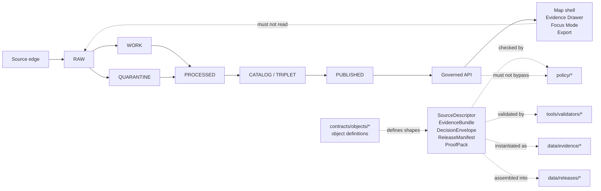

<!-- [KFM_META_BLOCK_V2]
doc_id: kfm://doc/TODO-verify-uuid
title: Contracts / Objects README
type: standard
version: v1
status: draft
owners: TODO: verify contracts/object-contract owners
created: 2026-04-22
updated: 2026-04-22
policy_label: TODO: verify policy label
related: ["NEEDS_VERIFICATION: ../README.md", "NEEDS_VERIFICATION: ../../schemas/README.md", "NEEDS_VERIFICATION: ../../docs/adr/ADR-0001-schema-home.md"]
tags: [kfm, contracts, objects, evidence, governance]
notes: [Mounted repo not visible during authoring; verify UUID, owners, policy label, schema-home ADR, and relative links before publication]
[/KFM_META_BLOCK_V2] -->

<a id="top"></a>

# Contracts / Objects

Shared object-contract surface for KFM proof-bearing, lifecycle, release, policy, and runtime envelopes.

| Field | Value |
|---|---|
| **Status** | `experimental` · directory README draft · implementation evidence `NEEDS VERIFICATION` |
| **Owners** | `TODO: verify contracts/object-contract owners` |
| **Badges** |     |
| **Quick jumps** | [Scope](#scope) · [Repo fit](#repo-fit) · [Inputs](#accepted-inputs) · [Exclusions](#exclusions) · [Tree](#directory-tree) · [Object families](#object-family-registry) · [Review gates](#review-gates) · [FAQ](#faq) |

> [!IMPORTANT]
> This directory defines **object contracts**. It does not store emitted evidence, release artifacts, raw source captures, policy bodies, or runtime outputs.

---

## Scope

`contracts/objects/` is the home for KFM object cards and object-level contract definitions: the small, inspectable nouns that make the truth path testable.

In this directory, an **object** is not a domain entity like a watershed, road, species, tract, person, or map feature. It is a governance, evidence, lifecycle, release, or runtime envelope such as:

- `SourceDescriptor`
- `EvidenceBundle`
- `DecisionEnvelope`
- `RuntimeResponseEnvelope`
- `ReleaseManifest`
- `ProofPack`
- `RunReceipt`
- `AIReceipt`
- `CorrectionNotice`

Each object card should explain what the object means, where it sits in the KFM lifecycle, which schema or schema pointer defines it, what valid and invalid examples prove, which policy or validator checks it, and which downstream surfaces are allowed to consume it.

**Truth posture:** the recurring object family is source-grounded doctrine. Current in-repo implementation, emitted examples, route binding, validator maturity, and CI enforcement remain `NEEDS VERIFICATION` until the mounted repository is inspected.

[(Back to top)](#top)

---

## Repo fit

| Direction | Path / surface | Relationship | Status |
|---|---|---|---|
| **This README** | `contracts/objects/README.md` | Directory orientation and object-contract rules. | `PROPOSED` until committed |
| **Parent contract index** | [`../README.md`](../README.md) | Should explain the repo-wide contract/schema/API split. | `NEEDS VERIFICATION` |
| **Schema-home ADR** | [`../../docs/adr/ADR-0001-schema-home.md`](../../docs/adr/ADR-0001-schema-home.md) | Should decide whether object schemas live here, under `schemas/`, or as generated mirrors. | `NEEDS VERIFICATION` |
| **Generated / mirror schema area** | [`../../schemas/README.md`](../../schemas/README.md) | Should declare canonical, generated mirror, compatibility alias, or legacy status. | `NEEDS VERIFICATION` |
| **Policy rules** | [`../../policy/`](../../policy/) | Consumes object fields for source-role, rights, sensitivity, publication, and no-bypass decisions. | `NEEDS VERIFICATION` |
| **Validators** | [`../../tools/validators/`](../../tools/validators/) | Runs schema, fixture, source-registry, no-public-path, and policy checks. | `NEEDS VERIFICATION` |
| **Fixtures** | [`../../tests/fixtures/`](../../tests/fixtures/) | Holds valid and invalid cases used by validators and CI. | `NEEDS VERIFICATION` |
| **Emitted evidence** | [`../../data/evidence/`](../../data/evidence/) | Stores receipts, bundles, proof packs, validation reports, and audit records after pipeline runs. | `NEEDS VERIFICATION` |
| **Release artifacts** | [`../../data/releases/`](../../data/releases/) | Stores release manifests, promotion records, correction notices, rollback references, and public release records. | `NEEDS VERIFICATION` |
| **Governed API** | [`../../apps/governed-api/`](../../apps/governed-api/) | Should emit envelopes derived from object contracts, never raw model output or raw stores. | `NEEDS VERIFICATION` |
| **Map-first UI** | [`../../apps/web/`](../../apps/web/) | Should render object-backed Evidence Drawer, Focus, layer, export, and review payloads. | `NEEDS VERIFICATION` |

> [!NOTE]
> Relative links above are intentionally reviewable. Keep them if the mounted repository matches this layout; update them through the schema-home ADR if the real tree differs.

[(Back to top)](#top)

---

## Accepted inputs

The following belongs in `contracts/objects/`:

| Input | Belongs here when… | Minimum expectation |
|---|---|---|
| **Object card README** | It defines one cross-lane KFM object family. | Role, lifecycle position, schema, examples, policy links, downstream consumers, open questions. |
| **Canonical schema or schema pointer** | The schema home ADR says this directory is canonical, or the card points to the canonical schema elsewhere. | No duplicate canonical definitions without a mirror/export rule. |
| **Minimal examples** | They clarify the object shape without pretending to be emitted runtime evidence. | Label as `example`, `fixture`, or `illustrative`. |
| **Fixture map** | It links object examples to validator or CI locations. | At least one valid and one invalid case for first-wave objects. |
| **Object relationship notes** | They show how objects connect across source intake, validation, promotion, release, correction, and UI. | Keep distinctions sharp: receipt ≠ proof ≠ catalog ≠ release. |
| **Version notes** | The object contract changes materially. | Add changelog or version marker before downstream consumers rely on it. |

---

## Exclusions

The following does **not** belong in `contracts/objects/`:

| Excluded material | Why not here | Put it here instead |
|---|---|---|
| Raw source captures | Contracts must not become data storage. | `data/raw/` after repo convention verification |
| Work or quarantine data | Public contract docs must not expose candidate or blocked material. | `data/work/` or `data/quarantine/` |
| Emitted receipts, bundles, proofs, reports, or manifests | Instances are outputs; this directory defines shapes. | `data/evidence/` or `data/releases/` |
| Policy rule bodies | Policy is executable governance, not a contract shape. | `policy/` |
| Validator implementation logic | Validators execute checks; cards document expected checks. | `tools/validators/` |
| UI components | UI renders object-backed payloads; it should not define truth objects. | `apps/web/` |
| API route handlers | APIs emit object-shaped responses but do not define object doctrine. | `apps/governed-api/` |
| Generated schema mirrors | Mirrors must not become silent canonical sources. | `schemas/` only after ADR classification |
| Secrets, credentials, access tokens, or private source material | Contract docs must be safe to review and publish. | Never commit; use approved secret-management path |

[(Back to top)](#top)

---

## Directory tree

`NEEDS VERIFICATION`: this tree is the proposed directory shape for object cards. Preserve existing repo conventions if the mounted repository already has a different canonical layout.

```text
contracts/objects/
├── README.md
├── OBJECT_MAP.md                         # PROPOSED: index of object families and status labels
├── source-descriptor/
│   ├── README.md
│   ├── schema.json                       # or schema pointer after ADR-0001
│   └── examples/
│       ├── minimal.valid.json
│       └── missing-id.invalid.json
├── evidence-bundle/
│   ├── README.md
│   ├── schema.json
│   └── examples/
├── decision-envelope/
│   ├── README.md
│   ├── schema.json
│   └── examples/
├── release-manifest/
│   ├── README.md
│   ├── schema.json
│   └── examples/
├── runtime-response-envelope/
│   ├── README.md
│   ├── schema.json
│   └── examples/
└── proof-pack/
    ├── README.md
    ├── schema.json
    └── examples/
```

> [!TIP]
> Keep object directories small. A contract card should make a reviewer faster, not bury them in generated output.

---

## Object card standard

Each object subdirectory SHOULD include a README with this reviewable shape:

| Section | Required content |
|---|---|
| **Semantic role** | What the object means in KFM and what it must never be confused with. |
| **Truth-path position** | Source intake, process memory, validation, evidence, proof, release, promotion, correction, runtime, or UI payload. |
| **Status label** | `CONFIRMED`, `INFERRED`, `PROPOSED`, `UNKNOWN`, or `NEEDS VERIFICATION`. |
| **Canonical shape** | Schema file, schema pointer, or ADR-bound placeholder. |
| **Examples and fixtures** | Valid and invalid cases, clearly separated from emitted instances. |
| **Policy linkage** | Source-role, rights, sensitivity, publication, correction, or no-bypass rules that inspect the object. |
| **Validator linkage** | Tool, command, or runbook that validates the object. |
| **Downstream consumers** | API, Evidence Drawer, Focus Mode, release process, catalog, graph, export, review, or domain lanes. |
| **Open verification** | Existing instances, CI enforcement, route binding, owners, and active schema home. |

Illustrative card skeleton:

```markdown
# SourceDescriptor

Declares source identity, authority role, acquisition context, rights posture, and refresh expectations.

| Field | Value |
|---|---|
| Status | CONFIRMED concept / implementation NEEDS VERIFICATION |
| Truth-path position | source intake and source registry |
| Schema | ./schema.json or ADR-bound schema pointer |
| Valid examples | ./examples/minimal.valid.json |
| Invalid examples | ./examples/missing-id.invalid.json |
| Policy links | source-role, rights, refresh, publication gates |
| Validator | ../../tools/validators/source-descriptor/README.md |
| Downstream | source registry, ingest receipts, validation reports, EvidenceBundle |
| Open questions | mounted repo path, existing emitted instances, owner |
```

[(Back to top)](#top)

---

## Lifecycle and responsibility map



The diagram’s central distinction is deliberate: **definitions live here; emitted objects live elsewhere**.

---

## Object family registry

### First-wave candidates

| Object family | Status | Truth-path position | Why it belongs in this directory |
|---|---:|---|---|
| `SourceDescriptor` | `CONFIRMED concept / NEEDS VERIFICATION implementation` | Source intake and catalog entry | Stabilizes source identity, authority role, rights, refresh, and registry linkage. |
| `EvidenceBundle` | `CONFIRMED term / NEEDS VERIFICATION shape` | Reviewable evidence support | Keeps claims reconstructable to evidence instead of fluent summaries. |
| `DecisionEnvelope` | `PROPOSED / INFERRED from promotion, policy, and review doctrine` | Policy or governance decision | Gives release, denial, abstention, and review actions finite reason-bearing form. |
| `ReleaseManifest` | `CONFIRMED concept / NEEDS VERIFICATION artifact` | Release assembly | Defines outward release sets, assets, digests, policy state, and correction links. |
| `ProofPack` | `CONFIRMED concept / NEEDS VERIFICATION artifact` | Release-ready proof assembly | Aggregates release proof without replacing source evidence or catalog records. |
| `RuntimeResponseEnvelope` | `PROPOSED` | Governed API / runtime response | Makes API and Focus outcomes inspectable with evidence refs, scope, and negative states. |
| `RunReceipt` | `CORPUS-CONFIRMED recurring family / NEEDS VERIFICATION implementation` | Process memory | Records governed runs without pretending to be release proof. |
| `AIReceipt` | `CORPUS-CONFIRMED recurring family / gated` | Model-mediated process memory | Records model participation while keeping AI subordinate to evidence and policy. |
| `ValidationReport` | `INFERRED` | Validation / gate output | Records pass/fail results that feed promotion decisions. |
| `CorrectionNotice` | `INFERRED` | Post-publication correction | Preserves correction lineage instead of silently replacing public truth. |

### Hold or lane-specific candidates

Use these only after policy, owner, and access controls are verified:

| Object family | Status | Gate before adoption |
|---|---:|---|
| `RedactionReceipt` | `PROPOSED` | Sensitivity policy and public-safe geometry rules confirmed. |
| `ReidentificationReceipt` | `PROPOSED / restricted` | Explicit secure path, access control, review, and audit controls. |
| `SourceRefreshRecord` | `INFERRED` | Actual source-refresh flows or watcher jobs inspected. |
| `ReviewRecord` | `INFERRED` | Review workflow, CODEOWNERS, or approval process inspected. |
| `AuditRecord` | `INFERRED` | Audit trail format and storage path verified. |
| `DatasetVersion` | `INFERRED` | Published dataset versioning and release-manifest relationship resolved. |

> [!WARNING]
> Do not promote a proposed object because it “sounds useful.” Promote it only when it has an object card, schema or schema pointer, examples, fixture plan, validator path, policy relationship, and an owner.

[(Back to top)](#top)

---

## Schema authority rule

Until the schema-home ADR is accepted, use this conservative rule:

1. `contracts/objects/<object>/README.md` is the human object card.
2. `contracts/objects/<object>/schema.json` MAY be canonical only if the repo ADR says object schemas live here.
3. If the canonical schema lives under `schemas/`, the object card MUST point to it and explain whether the local copy is absent, generated, mirrored, compatibility-only, or legacy.
4. No object family may have two silent canonical definitions.
5. Any mirror or generated export must identify its source-of-truth and generation path.
6. New object families require at least one valid example, one invalid example, and one validator or validator runbook before they are treated as usable across lanes.

---

## Quickstart

From the repository root:

```bash
# Confirm the target directory and current object cards.
find contracts/objects -maxdepth 2 -type f | sort
```

```bash
# NEEDS VERIFICATION:
# Run the repo-native contract validation command once the validator path exists.
python tools/validators/validate_contract_objects.py contracts/objects
```

```bash
# NEEDS VERIFICATION:
# Check for accidental emitted instances under contract definitions.
find contracts/objects -type f \
  \( -name "*.receipt.json" -o -name "*.manifest.json" -o -name "*.bundle.json" \) \
  -print
```

Expected result for the last command: no emitted runtime, evidence, or release instances under `contracts/objects/`.

---

## Review gates

Before a new object card or object schema is merged:

- [ ] Owner is assigned or explicitly marked `TODO: verify`.
- [ ] Status label is present and narrow enough.
- [ ] Schema home is consistent with the accepted ADR, or marked `NEEDS VERIFICATION`.
- [ ] Object card explains what the object is **not**.
- [ ] Valid example exists or is explicitly deferred with rationale.
- [ ] Invalid example exists or is explicitly deferred with rationale.
- [ ] Validator path or validator runbook is linked.
- [ ] Policy relationship is named.
- [ ] Emitted instance path is outside `contracts/objects/`.
- [ ] Public/raw/work/quarantine bypass is not introduced.
- [ ] EvidenceBundle, DecisionEnvelope, RuntimeResponseEnvelope, Evidence Drawer, or Focus payload links do not require hidden browser-side source joins.
- [ ] Rollback or supersession path is documented for material contract changes.

### Definition of done for this README

- [ ] UUID replaced with a real `kfm://doc/<uuid>`.
- [ ] Owners verified.
- [ ] Policy label verified.
- [ ] Related links checked in a mounted repository.
- [ ] Schema-home ADR linked or placeholder updated.
- [ ] Object family registry reconciled with existing repo files.
- [ ] At least the first-wave object directories have cards or tracked issues.
- [ ] Repo-native validation command added when available.

[(Back to top)](#top)

---

## FAQ

### Is `contracts/objects/` a schema registry?

Not necessarily. It is the object-contract documentation surface. It may also contain canonical schemas if the schema-home ADR says so. If canonical schemas live elsewhere, object cards should point to them without duplicating authority.

### Can examples here be used as test fixtures?

Yes, if they are clearly labeled and wired into the repo-native fixture path. Keep illustrative examples separate from emitted objects and production release evidence.

### Can the UI read from these files directly?

No. UI surfaces should consume governed API payloads, released artifacts, and prepared Evidence Drawer or Focus envelopes. This directory defines shapes and review rules; it is not a runtime truth store.

### Why are some objects marked `PROPOSED` even though the corpus mentions them often?

Repeated corpus convergence supports a contract backlog. It does not prove current implementation. Upgrade the label only with mounted repo evidence: schema files, object cards, fixtures, validators, emitted examples, workflows, or runtime traces.

---

## Appendix

<details>
<summary><strong>Suggested first object-card wave</strong></summary>

Recommended order:

1. `source-descriptor`
2. `evidence-bundle`
3. `decision-envelope`
4. `release-manifest`
5. `runtime-response-envelope`
6. `run-receipt`
7. `proof-pack`
8. `correction-notice`

This order keeps source identity, evidence support, finite decisions, release assembly, runtime response, process memory, proof aggregation, and correction lineage visible before domain lanes widen.

</details>

<details>
<summary><strong>Terminology guardrails</strong></summary>

| Term | Keep distinct from |
|---|---|
| Receipt | Proof pack, release manifest, catalog record, source truth |
| EvidenceBundle | Source authority, fluent answer, UI drawer, proof pack |
| ReleaseManifest | Proof pack, catalog matrix, raw artifact directory |
| DecisionEnvelope | Runtime response, human narrative, policy source code |
| RuntimeResponseEnvelope | Raw model output, direct public claim, release manifest |
| CorrectionNotice | Silent overwrite, rollback-only operation, changelog entry |
| SourceDescriptor | Source data, source registry instance, source truth itself |

</details>

<details>
<summary><strong>Open verification backlog</strong></summary>

| Question | Why it matters |
|---|---|
| Does the real repo already contain `contracts/objects/`? | Prevents overwriting or duplicating existing object cards. |
| Is `contracts/` or `schemas/` canonical for machine-readable schemas? | Prevents dual authority. |
| What validator runner does the repo use? | Keeps examples executable and CI-native. |
| Where do emitted receipts and release objects live? | Keeps definitions separate from instances. |
| Which owners approve object-contract changes? | Enables review discipline and CODEOWNERS alignment. |
| Which objects already have fixtures or emitted examples? | Supports truthful status upgrades. |
| Which API/UI payloads already consume these objects? | Prevents invented route or DTO claims. |

</details>

[(Back to top)](#top)
