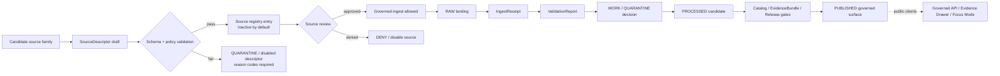

<!-- [KFM_META_BLOCK_V2]
doc_id: kfm://doc/NEEDS_VERIFICATION__contracts_objects_source_descriptor_readme
title: SourceDescriptor Contract Object
type: standard
version: v1
status: draft
owners: NEEDS_VERIFICATION
created: NEEDS_VERIFICATION__YYYY-MM-DD
updated: 2026-04-22
policy_label: NEEDS_VERIFICATION__public_or_internal
related: [NEEDS_VERIFICATION__schema_home, NEEDS_VERIFICATION__source_registry, NEEDS_VERIFICATION__policy_home, NEEDS_VERIFICATION__validator_home]
tags: [kfm, contracts, objects, source-descriptor, source-registry, governance]
notes: [README-like contract-object landing page for contracts/objects/source-descriptor/README.md. Schema-home authority, owners, related links, policy label, and validator path remain NEEDS VERIFICATION until mounted repo inspection.]
[/KFM_META_BLOCK_V2] -->

# SourceDescriptor Contract Object

Defines the governed intake contract for a KFM source or endpoint before connector work, ingestion, validation, cataloging, UI display, or AI interpretation can treat that source as admissible.

> [!IMPORTANT]
> **Surface status:** `experimental`  
> **Owners:** `NEEDS_VERIFICATION`  
> **Path:** `contracts/objects/source-descriptor/README.md`  
> **Truth posture:** `CONFIRMED doctrine / PROPOSED implementation / UNKNOWN mounted repo state`  
> **Quick jumps:** [Scope](#scope) · [Repo fit](#repo-fit) · [Accepted inputs](#accepted-inputs) · [Exclusions](#exclusions) · [Directory tree](#directory-tree) · [Contract boundary](#contract-boundary) · [Validation gates](#validation-gates) · [Examples](#examples) · [Definition of done](#definition-of-done) · [Open verification](#open-verification)


---

## Scope

`SourceDescriptor` is the **source-admission object** for KFM.

It answers a narrow but trust-critical question:

> Can this source family, endpoint, feed, archive, dataset, service, or provider be admitted into a governed KFM pipeline, and under what limits?

A descriptor does **not** prove that ingestion happened. It does **not** publish a dataset. It does **not** make a source authoritative for every claim. It declares the source identity, source role, access posture, rights posture, sensitivity burden, cadence, support, validation plan, and publication intent that every downstream object must respect.

KFM uses this object to keep the system from moving faster than its evidence, rights, policy, and review state.

[Back to top](#sourcedescriptor-contract-object)

---

## Repo fit

| Relationship | Repo surface | Status | Notes |
|---|---|---:|---|
| This README | `contracts/objects/source-descriptor/README.md` | CONFIRMED target path | Target path was supplied for this task. Existing in-repo contents remain `UNKNOWN` until the repo is mounted. |
| Candidate schema home | `contracts/objects/source-descriptor/schema.json` or `schemas/contracts/v1/source_descriptor.schema.json` | NEEDS VERIFICATION | Current KFM materials preserve both object-local and shared-schema-home patterns. Do not duplicate canonical schema definitions. Resolve by ADR before merge. |
| Source registry | `data/registry/**/sources/*.yaml` or repo-standard equivalent | PROPOSED / NEEDS VERIFICATION | Descriptors should feed source registries, not live only as prose. |
| Policy home | `policy/**` or repo-standard equivalent | PROPOSED / NEEDS VERIFICATION | Rights, source-role, sensitivity, publication, and no-bypass checks belong in policy as well as docs. |
| Validator home | `tools/validators/**` or repo-standard equivalent | PROPOSED / NEEDS VERIFICATION | Descriptor completeness should be testable without network access. |
| Downstream consumers | `IngestReceipt`, `ValidationReport`, `DatasetVersion`, `CatalogMatrix`, `EvidenceBundle`, `DecisionEnvelope`, `LayerManifest`, `RuntimeResponseEnvelope` | PROPOSED object lattice | Downstream consumers must preserve the descriptor’s source-role and rights/sensitivity constraints. |

> [!WARNING]
> **Schema-home ambiguity is unresolved.**  
> This README can safely define the object role and review expectations, but machine schema authority must be decided before introducing duplicate `SourceDescriptor` schemas in multiple folders.

[Back to top](#sourcedescriptor-contract-object)

---

## Accepted inputs

This folder may contain or describe:

- the shared `SourceDescriptor` object purpose and invariants
- minimum required descriptor concerns
- schema-home notes and ADR links
- valid and invalid fixture expectations
- validator expectations and reason-code guidance
- source-role, rights, sensitivity, cadence, and freshness requirements
- examples that are explicitly marked **illustrative** or **fixture-only**
- links to source registry, policy, and downstream proof-object surfaces

A descriptor may describe source families such as public APIs, static downloads, archival collections, remote-sensing products, sensor networks, agency map services, community-science records, historical documents, or steward-controlled restricted datasets.

## Exclusions

Do **not** put the following in this object folder:

| Excluded item | Why it does not belong here | Expected home |
|---|---|---|
| API keys, tokens, secrets, cookies, credentials | Source admission must not expose operational secrets. | Secret manager / deployment config; never committed. |
| RAW, WORK, or QUARANTINE source data | This folder is a contract surface, not lifecycle storage. | `data/raw/**`, `data/work/**`, `data/quarantine/**`, or repo-standard governed lifecycle path. |
| Live source fetch scripts | Connector behavior belongs behind explicit pipeline and validator controls. | `pipelines/**`, `tools/**`, or repo-standard source adapter path. |
| Publication approval | A descriptor is not a release decision. | `DecisionEnvelope`, `PromotionDecision`, `ReleaseManifest`, review record, and proof pack surfaces. |
| Catalog closure | A descriptor can feed catalog closure, but it is not catalog closure. | STAC/DCAT/PROV profile files, `CatalogMatrix`, release metadata. |
| Source-specific policy exceptions hidden in examples | Policy must be inspectable and testable. | `policy/**` with fixtures/tests. |
| Derived summaries, map tiles, vector tiles, PMTiles, COGs, scenes, or AI answers | These are downstream artifacts or interpretations. | Released delivery artifacts, governed API, Evidence Drawer payloads, Focus Mode envelopes. |

[Back to top](#sourcedescriptor-contract-object)

---

## Directory tree

Current mounted repo inventory is `UNKNOWN`. The tree below is a **PROPOSED companion shape**, not a claim that all files currently exist.

```text
contracts/objects/source-descriptor/
├── README.md                         # this file
├── schema.json                       # NEEDS VERIFICATION: object-local schema home
├── examples/
│   ├── minimal.valid.json            # descriptor with minimum required concerns
│   ├── expanded.valid.json           # descriptor with richer source/support metadata
│   ├── missing-rights.invalid.json   # must fail: rights posture absent
│   ├── missing-role.invalid.json     # must fail: source role absent
│   └── active-live-fetch.invalid.json # must fail if activation bypasses review
└── CHANGELOG.md                      # optional; use repo-standard change log if present

tests/fixtures/contracts/source-descriptor/
├── minimal.valid.json
├── expanded.valid.json
├── missing-id.invalid.json
├── missing-owner.invalid.json
├── missing-rights.invalid.json
├── missing-sensitivity.invalid.json
└── modeled-as-observed.invalid.json

tools/validators/source-descriptor/
└── README.md                         # invocation notes until validator implementation is verified
```

> [!NOTE]
> If the mounted repo already uses a shared schema path such as `schemas/contracts/v1/source_descriptor.schema.json`, keep this folder as the object landing page and link to the canonical schema rather than maintaining a divergent copy.

[Back to top](#sourcedescriptor-contract-object)

---

## Contract boundary

### Minimum purpose

`SourceDescriptor` declares the intake contract for a source or endpoint.

At minimum, it must capture:

| Concern | Why KFM needs it | Examples of values or checks |
|---|---|---|
| Source identity | Prevents unlabeled or duplicate source admission. | `source_id`, provider name, endpoint/dataset family, native identifiers. |
| Owner / steward | Makes responsibility reviewable. | agency owner, project steward, data steward, rights reviewer. |
| Official status | Prevents community, derived, modeled, and official sources from collapsing into one authority class. | official, authoritative-for-role, corroborative, community, modeled, derived, archival. |
| Access mode | Defines how the source may be reached without hiding acquisition behavior. | API, static file, map service, archive, manual upload, restricted steward transfer. |
| Rights posture | Blocks accidental redistribution or derivative publication. | license, terms URL, attribution, redistribution allowed, unknown rights, restricted reuse. |
| Sensitivity posture | Prevents unsafe public exposure. | public, restricted, culturally sensitive, exact-location sensitive, living-person sensitive, critical infrastructure. |
| Spatial support | Keeps geometry, CRS, precision, and scale meaningful. | CRS, spatial grain, coordinate precision, geometry type, support unit, positional uncertainty. |
| Temporal support | Keeps observation time, valid time, release time, and refresh time separate. | observed_at, valid_from/valid_to, issued_at, retrieved_at, stale_after. |
| Cadence / update signal | Makes staleness visible. | static, annual, monthly, near-real-time, event-based, manually refreshed. |
| Source role | Lets validators and UI distinguish evidence character. | observation, regulatory context, model field, remote-sensing detection, archive record, narrative context. |
| Validation plan | Makes admission testable. | schema checks, checksum, CRS check, null handling, duplicate handling, freshness gate, rights gate. |
| Publication intent | Prevents intake from implying publication. | none, internal-only, candidate, public-summary-only, public-exact, steward-review-required. |

### Adjacent object boundaries

| Object | What it proves or declares | How it relates to `SourceDescriptor` |
|---|---|---|
| `SourceDescriptor` | Declares source admission constraints before use. | Root object for source identity, role, rights, sensitivity, cadence, support, and validation expectations. |
| `SourceIntakeRecord` | Records source intake review or activation decision. | May reference a descriptor and document review state. |
| `IngestReceipt` | Proves a fetch, upload, landing, or acquisition event occurred. | Must reference the admitted descriptor or descriptor version. |
| `ValidationReport` | Records checks that passed, failed, warned, or quarantined. | Must evaluate records against descriptor obligations. |
| `DatasetVersion` | Carries a candidate or promoted subject set. | Must preserve source references and support semantics derived from descriptors. |
| `CatalogMatrix` | Crosswalks catalog/provenance identifiers and closure. | May include descriptor refs but cannot replace descriptor rights or source-role policy. |
| `DecisionEnvelope` | Records machine-readable policy result. | Must respect descriptor rights, sensitivity, and publication intent. |
| `EvidenceBundle` | Packages support for a claim, story, export, or answer. | Must expose source basis and limitations traceable to descriptors. |
| `ReleaseManifest` | Assembles public-safe release scope and proof links. | Must not release artifacts whose descriptor blocks or limits publication. |
| `RuntimeResponseEnvelope` | Makes runtime answer outcome accountable. | Must cite admissible evidence, not raw descriptors alone. |

[Back to top](#sourcedescriptor-contract-object)

---

## Source lifecycle placement

`SourceDescriptor` belongs near the front of the governed source path. It should exist **before** live connectors, scheduled refreshes, or publication-facing layers.



> [!IMPORTANT]
> Descriptor approval is not publication approval.  
> A source may be valid for internal analysis, review, or corroboration while still being blocked from public release.

[Back to top](#sourcedescriptor-contract-object)

---

## Validation gates

The first useful validator is small and fail-closed. It should run without network access and verify descriptor structure, required concerns, and policy-relevant completeness.

| Gate | Required behavior | Failure outcome |
|---|---|---|
| Identity gate | Descriptor has stable `source_id`, source name, family, and native/source URL or access reference where permitted. | `ERROR` for malformed object; `ABSTAIN` or `QUARANTINE` for incomplete source identity. |
| Steward gate | Owner/steward and review owner are explicit or deliberately marked `NEEDS_VERIFICATION`. | `QUARANTINE` until owner is resolved. |
| Rights gate | License, terms, attribution, and redistribution posture are explicit. | `DENY` public release; `QUARANTINE` source activation if unknown. |
| Sensitivity gate | Sensitivity class and public-geometry limits are explicit. | `DENY` exact public output when sensitivity is unresolved. |
| Source-role gate | Source role cannot be omitted or silently promoted to higher authority. | `QUARANTINE`; modeled/derived sources cannot satisfy observation-only claims. |
| Support gate | Spatial and temporal support are documented at the appropriate grain. | `ABSTAIN` for claims requiring unsupported precision. |
| Freshness gate | Cadence, update signal, `retrieved_at`, or stale-after posture is declared. | `ABSTAIN` or stale-state UI marker. |
| Validation-plan gate | Required checks are named before connector activation. | `QUARANTINE`; no live fetch scheduling. |
| Publication-intent gate | Descriptor states whether and how source outputs may reach public surfaces. | `DENY` public promotion when absent or restricted. |
| No-bypass gate | Descriptor cannot authorize direct public RAW/WORK/QUARANTINE access. | `DENY`; fail CI if a public path is introduced. |

### Expected no-network checks

```bash
# NEEDS VERIFICATION: adapt to the repo-native validator path.
# These commands are examples of the intended checks, not confirmed runnable commands.

python tools/validators/source-descriptor/validate.py \
  contracts/objects/source-descriptor/examples/minimal.valid.json

python tools/validators/source-descriptor/validate.py \
  tests/fixtures/contracts/source-descriptor/missing-rights.invalid.json \
  --expect-fail
```

[Back to top](#sourcedescriptor-contract-object)

---

## Examples

The following example is **illustrative**. It is intentionally compact and does not claim the final JSON Schema shape.

```yaml
# Illustrative only — validate against the repo-approved SourceDescriptor schema.
source_id: usgs_water_data
title: USGS Water Data
status: proposed
source_family: hydrology
official_status: official_for_observed_water_data
source_role:
  primary: direct_observation
  limitations:
    - provisional_values_may_change
access:
  mode: api
  endpoint_ref: NEEDS_VERIFICATION__official_endpoint
  auth_required: false
rights:
  rights_status: NEEDS_VERIFICATION
  redistribution_allowed: NEEDS_VERIFICATION
  attribution_required: true
sensitivity:
  default_class: public
  exact_location_public_allowed: true
support:
  spatial:
    crs: EPSG:4326
    grain: monitoring_site
    positional_uncertainty: source_native
  temporal:
    observed_time: source_native
    retrieved_time_required: true
cadence:
  refresh_class: source_native
  stale_after: NEEDS_VERIFICATION
validation_plan:
  required_checks:
    - schema
    - source_native_identifier
    - timestamp_parse
    - unit_normalization
    - freshness
    - rights
publication_intent:
  default: candidate_only
  public_release_allowed: false
  promotion_requires:
    - validation_report
    - rights_review
    - catalog_closure
    - evidence_bundle_resolution
```

> [!TIP]
> A source-specific descriptor should stay boring and explicit. The useful part is not prose polish; it is the ability for validators, reviewers, catalog builders, UI trust badges, and Focus Mode to rely on the same declared constraints.

[Back to top](#sourcedescriptor-contract-object)

---

## Operating tables

### Working status vocabulary

| Status | Meaning | Public consequence |
|---|---|---|
| `draft` | Descriptor is being written. | No source activation. |
| `proposed` | Descriptor has enough shape for review and fixtures. | No public release by default. |
| `approved` | Descriptor passed review and may be used under stated limits. | Still requires downstream validation, policy, catalog, and promotion. |
| `quarantined` | Descriptor or source posture is incomplete, conflicted, or unsafe. | Block activation and public use. |
| `disabled` | Source is intentionally inactive. | No ingest scheduling. Existing lineage remains. |
| `superseded` | A newer descriptor/version replaces this one. | Preserve lineage; downstream artifacts must point to the active descriptor or explicit historical version. |

### Review roles to verify

| Role | Responsibility | Status |
|---|---|---:|
| Source steward | Confirms source identity, source role, cadence, and operational meaning. | NEEDS VERIFICATION |
| Rights reviewer | Confirms license, terms, redistribution, attribution, and derivative limits. | NEEDS VERIFICATION |
| Sensitivity reviewer | Confirms location, cultural, privacy, infrastructure, biodiversity, or living-person sensitivity. | NEEDS VERIFICATION |
| Schema steward | Confirms canonical schema home and versioning rules. | NEEDS VERIFICATION |
| Policy steward | Confirms fail-closed policy behavior and reason/obligation code alignment. | NEEDS VERIFICATION |
| Domain steward | Confirms lane-specific semantics and downstream use limits. | NEEDS VERIFICATION |

[Back to top](#sourcedescriptor-contract-object)

---

## Definition of done

A `SourceDescriptor` change is ready for review when:

- [ ] The descriptor’s canonical schema home is verified or the open ADR explicitly scopes the ambiguity.
- [ ] The descriptor has a stable `source_id` and source-family identity.
- [ ] Owner/steward, rights posture, sensitivity posture, source role, cadence, support, validation plan, and publication intent are present.
- [ ] At least one valid fixture and one invalid fixture exist for the changed shape.
- [ ] Invalid fixtures include missing rights and missing source role.
- [ ] Validation can run without live network access.
- [ ] Policy checks fail closed for unknown rights, unresolved sensitivity, and source-role mismatch.
- [ ] The descriptor is inactive by default unless review explicitly approves activation.
- [ ] No public client, UI component, or model runtime reads RAW, WORK, QUARANTINE, or unpublished candidate data because of this descriptor.
- [ ] Downstream references preserve descriptor version or digest where the repo standard requires it.
- [ ] Rollback is possible by disabling the descriptor or restoring the prior descriptor version without deleting lineage.
- [ ] Open verification items are recorded in the repo-standard backlog or source registry.

[Back to top](#sourcedescriptor-contract-object)

---

## FAQ

<details>
<summary><strong>Is a SourceDescriptor the same thing as a source registry entry?</strong></summary>

No. A `SourceDescriptor` defines the source-admission contract. A source registry entry may index descriptors, point to active versions, group them by lane, or expose source discovery metadata. The registry should not hide descriptor obligations.
</details>

<details>
<summary><strong>Can a descriptor make a source authoritative?</strong></summary>

Only for the role it explicitly declares and only after review. For example, a regulatory source may be authoritative for a regulatory boundary but not for observed real-time conditions. A community-science source may provide occurrence evidence but not legal status.
</details>

<details>
<summary><strong>Can public UI use descriptor fields directly?</strong></summary>

The UI may display prepared, reviewed descriptor-derived trust information, such as source role, rights, freshness, sensitivity, and limitations. The browser should not resolve source authority, perform source-role merging, or compute policy significance at runtime.
</details>

<details>
<summary><strong>What should happen when rights are unknown?</strong></summary>

Fail closed. Unknown rights should block public release and either quarantine activation or restrict the descriptor to internal review until the rights posture is resolved.
</details>

<details>
<summary><strong>What should happen when a descriptor changes?</strong></summary>

Do not mutate history invisibly. Preserve the old descriptor version or digest, record the change in the registry/changelog, rerun affected validators, and identify downstream artifacts that need rebuild, correction, rollback, or supersession.
</details>

[Back to top](#sourcedescriptor-contract-object)

---

## Open verification

These items must be resolved before maintainers can treat this README as more than a governed draft:

| Item | Why it matters | Current label |
|---|---|---:|
| Existing target file | The real repo may already contain this README or adjacent docs that should be preserved. | UNKNOWN |
| Canonical schema home | KFM materials preserve both `contracts/objects/...` and `schemas/contracts/v1/...` patterns. | NEEDS VERIFICATION |
| Owner / CODEOWNERS | Ownership cannot be inferred safely from PDFs alone. | NEEDS VERIFICATION |
| Policy label | Public/internal/restricted status should match repo policy taxonomy. | NEEDS VERIFICATION |
| Validator path | Example commands must be replaced with actual repo-native commands. | NEEDS VERIFICATION |
| Source registry path | Registry file/folder convention must be inspected before linking. | NEEDS VERIFICATION |
| Reason-code registry | It is unclear whether source-descriptor validators should use local or shared reason codes. | NEEDS VERIFICATION |
| Fixture naming | Repo may prefer `valid/invalid`, `.valid.json`, or another fixture convention. | NEEDS VERIFICATION |
| Schema dialect | JSON Schema draft/version or alternate schema tooling must be confirmed. | NEEDS VERIFICATION |
| Merge-blocking CI | No workflow maturity is claimed by this README. | UNKNOWN |

[Back to top](#sourcedescriptor-contract-object)

---

## Appendix

<details>
<summary><strong>Maintainer review checklist</strong></summary>

Use this checklist when adding or revising source-specific descriptors:

- [ ] Does the source have a named steward?
- [ ] Is official/corroborative/community/modeled/derived status explicit?
- [ ] Are rights and redistribution constraints explicit?
- [ ] Are source-native caveats preserved?
- [ ] Is source role narrow enough to prevent authority inflation?
- [ ] Is spatial support clear enough for the claims this source may support?
- [ ] Is temporal support clear enough for freshness and validity claims?
- [ ] Are sensitive geometry and privacy risks addressed?
- [ ] Are validation checks named before live ingestion?
- [ ] Does the descriptor default to inactive until review?
- [ ] Are downstream public surfaces blocked until EvidenceBundle, policy, catalog, and release gates are satisfied?
</details>

<details>
<summary><strong>Common anti-patterns</strong></summary>

Avoid these patterns:

- treating a connector as approved because it can fetch data
- flattening official, community, modeled, remote-sensing, regulatory, and archival sources into one `source` label
- publishing from a descriptor without `ValidationReport`, `EvidenceBundle`, policy decision, and release state
- using source terms or endpoint behavior without recording retrieval date, terms posture, and verification status
- hiding rights or sensitivity assumptions in code comments
- letting a browser, model runtime, or map popup infer source authority dynamically
- deleting old descriptor lineage when a source changes
</details>

<details>
<summary><strong>Glossary</strong></summary>

| Term | Working meaning |
|---|---|
| Source role | The evidentiary job a source is allowed to play, such as observation, regulatory context, modeled field, derived layer, narrative context, or archive record. |
| Support | The spatial, temporal, semantic, and measurement grain at which a source can responsibly support claims. |
| Publication intent | The descriptor’s declared default path for public, restricted, internal, or no-public-release use. |
| Descriptor-first onboarding | KFM pattern that requires source context, rights, sensitivity, cadence, and validation expectations before connector activation. |
| Fail closed | Default to quarantine, deny, abstain, or error rather than publishing or answering when required trust information is missing. |
</details>

[Back to top](#sourcedescriptor-contract-object)
