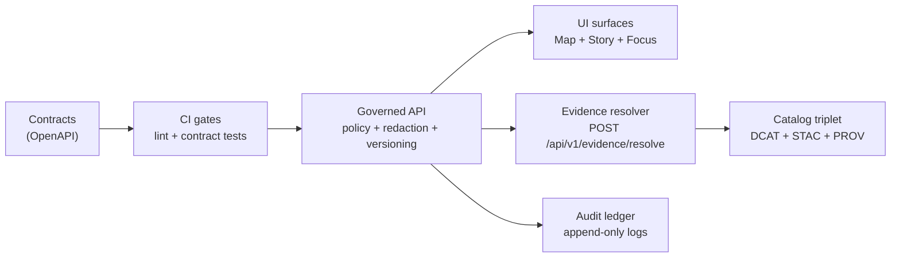

<!-- [KFM_META_BLOCK_V2]
doc_id: kfm://doc/cdb14052-c433-4d8c-9979-5d74d982d6b0
title: OpenAPI Contracts
type: standard
version: v1
status: draft
owners: API team
created: 2026-02-22
updated: 2026-02-22
policy_label: public
related:
  - docs/MASTER_GUIDE_v13.md
  - docs/templates/TEMPLATE__API_CONTRACT_EXTENSION.md
  - policy/
  - contracts/schemas/
tags: [kfm, contracts, openapi, api, governance]
notes:
  - Canonical home for KFM OpenAPI contract artifacts.
  - Contract-first + evidence-first: specs define the enforcement boundary for API surfaces.
[/KFM_META_BLOCK_V2] -->

# OpenAPI Contracts
Canonical **OpenAPI contract artifacts** for KFM’s **governed API boundary** (policy + redaction + evidence resolution + audit).  
**Status:** draft • **Owners:** API team • **Last updated:** 2026-02-22


---

## Navigate
- [What lives here](#what-lives-here)
- [How contracts fit the trust membrane](#how-contracts-fit-the-trust-membrane)
- [Non-negotiables](#non-negotiables)
- [Minimal v1 endpoint set](#minimal-v1-endpoint-set)
- [Shared DTO baseline](#shared-dto-baseline)
- [Versioning policy](#versioning-policy)
- [Validation and CI gates](#validation-and-ci-gates)
- [Change workflow](#change-workflow)
- [Governance and sensitivity](#governance-and-sensitivity)
- [Appendix: controlled vocabularies](#appendix-controlled-vocabularies)

---

## What lives here

This folder is the **canonical** home for REST API specs used by the governed API boundary.

> [!IMPORTANT]
> `contracts/` are **production artifacts**. They are validated in CI and implementations must honor them.

### Expected layout

```text
contracts/
├─ openapi/
│  ├─ README.md
│  ├─ kfm-api-v1.yaml              # Governed API contract (v1 surface)
│  └─ (future) kfm-api-v2.yaml     # Only for breaking changes
├─ schemas/                        # JSON Schemas shared across subsystems
└─ graphql/                         # Optional (if GraphQL is used)
```

### What “contract-first” means (operationally)
- You start with the **spec** (OpenAPI), not the implementation.
- Any change to OpenAPI is treated as a **contract change** and is expected to trigger compatibility checks + contract tests in CI.
- Implementations are **required** to match the spec; the spec is not “documentation”.

---

## How contracts fit the trust membrane



**Rule of thumb:** clients (UI, external tools) never bypass this boundary; everything user-facing must be reachable through governed endpoints.

---

## Non-negotiables

These are “do not break” expectations for any OpenAPI contract in KFM.

### 1) Governed API is the enforcement boundary
The API layer must apply **policy decisions, redactions, versioning, and evidence resolution consistently**.

### 2) Policy-safe responses and errors
- Responses must avoid leaking sensitive existence via differences in error behavior.
- Align `403` vs `404` behavior with policy to prevent “ghost metadata” leakage.
- Errors must use a stable error model and include an `audit_ref` for debugging and steward review.

### 3) Evidence resolution is central
- Evidence refs (e.g., `dcat://...`, `stac://...`, `prov://...`, `doc://...`) must resolve through the evidence resolver.
- Story publishing gates and Focus Mode citations depend on evidence resolution.

### 4) Audit is required for governed operations
Every governed operation must emit an audit record containing: who, what, when, why, inputs/outputs by digest, and the policy decision + obligations.

---

## Minimal v1 endpoint set

This is the **buildable v1 surface** KFM targets for the governed API. Treat it as the baseline contract surface for `kfm-api-v1.yaml`.

| Endpoint | Method(s) | Purpose | Notes |
|---|---:|---|---|
| `/api/v1/datasets` | GET | Dataset discovery (DCAT-backed) | Filters/facets/search; policy filter server-side |
| `/api/v1/stac/collections` | GET | STAC collections | Policy filter applied before returning assets |
| `/api/v1/stac/items` | GET | STAC items | STAC query by bbox/time/collection |
| `/api/v1/evidence/resolve` | POST | Resolve EvidenceRefs → EvidenceBundles | Returns bundle digest + policy decision; fail closed |
| `/api/v1/story` | GET/POST | Story nodes with versioning | Publishing requires citations + review state |
| `/api/v1/story/{id}` | GET/PUT | Read/update story node | Versioning + governance required |
| `/api/v1/focus/ask` | POST | Focus Mode evidence-led Q&A | Returns citations or abstain + `audit_ref` |
| `/api/v1/lineage/status` | GET | Pipeline health/freshness | Feeds UI badges |
| `/api/v1/lineage/stream` | GET | Lineage/health stream | Feeds UI badges |

Tiles (choose one posture):
- **Dynamic tiles:** `GET /api/v1/tiles/{layer}/{z}/{x}/{y}.pbf`
- **PMTiles bundles:** `GET /assets/pmtiles/{dataset_version_id}/{layer}.pmtiles` (only policy-safe bundles; may require policy gating)

---

## Shared DTO baseline

The OpenAPI contract should define (at minimum) shared schemas for:
- `ErrorResponse`
- `EvidenceResolveRequest`
- `EvidenceBundle`

Example (illustrative fragment for `kfm-api-v1.yaml`):

```yaml
components:
  schemas:
    ErrorResponse:
      type: object
      required: [error_code, message, audit_ref]
      properties:
        error_code: { type: string }
        message: { type: string }   # must be policy-safe
        audit_ref: { type: string }

    EvidenceResolveRequest:
      type: object
      required: [refs]
      properties:
        refs:
          type: array
          items: { type: string }   # EvidenceRef scheme://...

    EvidenceBundle:
      type: object
      required: [bundle_id, digest, policy, cards]
      properties:
        bundle_id: { type: string }
        digest: { type: string }
        policy:
          type: object
          required: [decision, policy_label, obligations]
          properties:
            decision: { type: string, enum: [allow, deny] }
            policy_label: { type: string }
            obligations:
              type: array
              items: { type: object }
        cards:
          type: array
          items:
            type: object
            properties:
              title: { type: string }
              description: { type: string }
              dataset_version_id: { type: string }
              license: { type: string }
              artifacts:
                type: array
                items:
                  type: object
                  properties:
                    href: { type: string }
                    digest: { type: string }
```

---

## Versioning policy

### API versioning
- Treat `/api/v1` semantics as **frozen** (only backwards-compatible additions).
- Introduce `/api/v2` only for **breaking changes**.
- The OpenAPI definition is the contract: **breaking the contract requires a version increment**.

### What counts as “breaking”
Common examples:
- removing fields, endpoints, or enum values
- changing field types / formats
- changing required vs optional
- changing auth requirements in a way that breaks clients
- changing error behavior that clients depend on

---

## Validation and CI gates

### Confirmed gates (must exist in CI)
- **API contract tests** run in CI; any unexpected contract regression blocks merge.
- OpenAPI (and GraphQL, if present) should be linted for completeness.
- Repo-level security/governance scans should catch secrets, PII/sensitive content, and classification inconsistencies.

### Proposed local checks (run before opening a PR)
Pick one tooling path (repo should standardize later):

**Option A: Redocly CLI**
```bash
npx @redocly/cli lint contracts/openapi/kfm-api-v1.yaml
```

**Option B: Swagger CLI**
```bash
npx swagger-cli validate contracts/openapi/kfm-api-v1.yaml
```

**Option C: Spectral**
```bash
npx @stoplight/spectral lint contracts/openapi/kfm-api-v1.yaml
```

> [!NOTE]
> If your repo already provides canonical validators (e.g., `tools/validators/openapi_*`), use those instead of ad-hoc tooling.

---

## Change workflow

> [!IMPORTANT]
> Do not change OpenAPI “just to match the code.” The code must match the contract.

### When adding or changing endpoints
1) **Write the intent** using the API Contract Extension template (expected at):
   - `docs/templates/TEMPLATE__API_CONTRACT_EXTENSION.md`
2) Update the relevant OpenAPI spec:
   - Usually `contracts/openapi/kfm-api-v1.yaml`
3) Update or add **contract tests**.
4) Validate locally (see [Validation and CI gates](#validation-and-ci-gates)).
5) If breaking:
   - create `v2` endpoints at a new path (`/api/v2/...`)
   - keep `v1` stable until sunset is explicitly governed
   - document deprecation/sunset plan in the contract extension doc
6) If the change touches sensitive domains (see below), trigger governance review.

---

## Governance and sensitivity

### Policy labels are not optional
Policy labels apply to datasets, artifacts, stories, and responses. They drive both:
- **what data is returned**, and
- **what is withheld**, including how abstention is explained.

### Avoid sensitive existence leakage
- Error responses must be policy-safe (e.g., no “dataset exists but you can’t see it” unless policy allows).
- Align `403/404` behavior with policy.
- Do not return “ghost metadata” that reveals restricted existence.

### Audit logs are sensitive
Audit logs contain rich context. Apply redaction + retention policy and treat audit output as governed.

---

## Appendix: controlled vocabularies

These starter vocabularies should be treated as versioned and maintained.

<details>
<summary><strong>policy_label (starter)</strong></summary>

- `public`
- `public_generalized`
- `restricted`
- `restricted_sensitive_location`
- `internal`
- `embargoed`
- `quarantine`

</details>

<details>
<summary><strong>artifact.zone</strong></summary>

- `raw`
- `work`
- `processed`
- `catalog`
- `published`

</details>

<details>
<summary><strong>citation.kind</strong></summary>

- `dcat`
- `stac`
- `prov`
- `doc`
- `graph`
- `url` (discouraged)

</details>

---

## Appendix: truth status for this README

- **Confirmed (from KFM guides):**
  - `contracts/` contains production contract artifacts validated in CI.
  - Governed API minimal endpoint set + contract requirements (policy-safe errors, audit, versioning posture).
  - OpenAPI fragment DTO shapes for evidence resolution and stable errors.
  - Controlled vocabulary starter lists (policy_label, artifact.zone, citation.kind).
- **Unknown (needs repo verification):**
  - Exact file names present today (e.g., whether `kfm-api-v1.yaml` exists already).
  - Exact local validator commands / Make targets / CI job names.
- **Proposed (safe defaults until repo confirms):**
  - Local lint tool choice (Redocly vs Swagger vs Spectral).
  - Any generated/bundled copies of OpenAPI specs under server code should be derived from `contracts/openapi/`, never hand-edited.

---

<a id="back-to-top"></a>
**Back to top:** [OpenAPI Contracts](#openapi-contracts)
