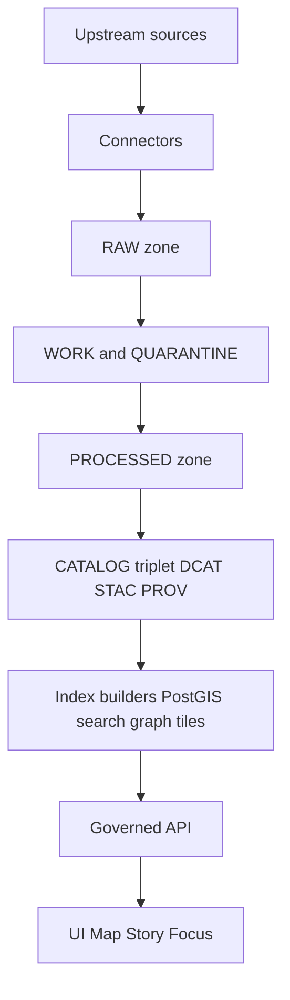

# OpenAPI contracts
Contract-first REST boundary for KFM’s governed API surfaces (Map • Story • Focus).

**Status:** draft • **Owners:** API team • **Policy:** public • **Spec:** OpenAPI 3.x

- [What lives here](#what-lives-here)
- [How contracts fit the trust membrane](#how-contracts-fit-the-trust-membrane)
- [Spec layout and naming](#spec-layout-and-naming)
- [KFM v1 endpoint set](#kfm-v1-endpoint-set)
- [KFM contract requirements](#kfm-contract-requirements)
- [Evidence resolver and DTO baselines](#evidence-resolver-and-dto-baselines)
- [CI gates and contract tests](#ci-gates-and-contract-tests)
- [Change workflow](#change-workflow)
- [Definition of done](#definition-of-done)

---

## What lives here

This directory contains OpenAPI specs that define KFM’s **governed API** surface. These specs are *first-class repo artifacts* and are expected to be:

- **Reviewed** like production code
- **Validated** in CI (schema + diff + contract tests)
- **Aligned** to governance invariants (policy, evidence, audit, redaction)

> NOTE  
> The refined KFM blueprint includes a recommended repository layout, but the exact repo structure must be verified against the current repository before treating the tree below as canonical. [oai_citation:1‡KFM_Source_Snapshots_Bundle_from_vNext1_tables_fixed.pdf](sediment://file_00000000510071fda62c8325d7097fa2)

### Recommended structure (verify against repo)

```text
repo/
  contracts/
    openapi/
      README.md
      # <one or more OpenAPI specs live here>
      # kfm-api-v1.yaml
      # kfm-internal-v1.yaml
    schemas/
      # JSON Schemas used by datasets/catalogs (DCAT/STAC/PROV profiles, etc.)
  policy/
    # OPA/Rego policies + fixtures + tests
```

Key rule from the blueprint: **contracts are treated as production artifacts and validated in CI**. [oai_citation:2‡KFM_Source_Snapshots_Bundle_from_vNext1_tables_fixed.pdf](sediment://file_00000000510071fda62c8325d7097fa2)

---

## How contracts fit the trust membrane

In KFM’s architecture, OpenAPI is the **runtime trust boundary**: clients interact with KFM through governed endpoints where policy, evidence resolution, and versioning are applied consistently. [oai_citation:3‡KFM_Source_Snapshots_Bundle_from_vNext1_tables_fixed.pdf](sediment://file_00000000510071fda62c8325d7097fa2)



The governed API is explicitly described as enforcing **policy decisions, redactions, versioning, and evidence resolution** in one place. [oai_citation:4‡KFM_Source_Snapshots_Bundle_from_vNext1_tables_fixed.pdf](sediment://file_00000000510071fda62c8325d7097fa2)

---

## Spec layout and naming

**This README does not assume specific filenames.** Pick a naming convention and apply it consistently.

Recommended (typical) patterns:
- `kfm-api-v1.yaml` — external/public governed API (stable surface)
- `kfm-internal-v1.yaml` — internal-only endpoints (if needed; still governed)
- `components/` — shared schemas (if your tooling supports bundling)

Versioning policy (from blueprint):
- Freeze `/api/v1` semantics; **only add backwards-compatible fields**.
- Introduce `/api/v2` only for **breaking changes**. [oai_citation:5‡KFM_Source_Snapshots_Bundle_from_vNext1_tables_fixed.pdf](sediment://file_00000000510071fda62c8325d7097fa2)

---

## KFM v1 endpoint set

The blueprint proposes a buildable v1 endpoint set (keep your OpenAPI spec aligned to what you actually implement). [oai_citation:6‡KFM_Source_Snapshots_Bundle_from_vNext1_tables_fixed.pdf](sediment://file_00000000510071fda62c8325d7097fa2)

### Core governed endpoints (illustrative)

- `GET /api/v1/datasets`
  - List datasets + versions (DCAT-backed); supports search/facets; policy filter server-side. [oai_citation:7‡KFM_Source_Snapshots_Bundle_from_vNext1_tables_fixed.pdf](sediment://file_00000000510071fda62c8325d7097fa2)

- `GET /api/v1/stac/collections`
- `GET /api/v1/stac/items`
  - STAC query by bbox/time/collection; policy filter applied before returning assets. [oai_citation:8‡KFM_Source_Snapshots_Bundle_from_vNext1_tables_fixed.pdf](sediment://file_00000000510071fda62c8325d7097fa2)

- `POST /api/v1/evidence/resolve`
  - Resolve EvidenceRefs to EvidenceBundles; returns bundle digest + policy decision results. [oai_citation:9‡KFM_Source_Snapshots_Bundle_from_vNext1_tables_fixed.pdf](sediment://file_00000000510071fda62c8325d7097fa2)

- Story:
  - `GET/POST /api/v1/story`
  - `GET/PUT /api/v1/story/{id}`
  - Publishing requires citations + review state. [oai_citation:10‡KFM_Source_Snapshots_Bundle_from_vNext1_tables_fixed.pdf](sediment://file_00000000510071fda62c8325d7097fa2)

- Focus Mode:
  - `POST /api/v1/focus/ask`
  - Returns citations or abstain + audit_ref. [oai_citation:11‡KFM_Source_Snapshots_Bundle_from_vNext1_tables_fixed.pdf](sediment://file_00000000510071fda62c8325d7097fa2)

- Lineage:
  - `GET /api/v1/lineage/status`
  - `GET /api/v1/lineage/stream`
  - Freshness/health feeds UI badges. [oai_citation:12‡KFM_Source_Snapshots_Bundle_from_vNext1_tables_fixed.pdf](sediment://file_00000000510071fda62c8325d7097fa2)

- Tiles (if served dynamically):
  - `GET /api/v1/tiles/{layer}/{z}/{x}/{y}.pbf` [oai_citation:13‡KFM_Source_Snapshots_Bundle_from_vNext1_tables_fixed.pdf](sediment://file_00000000510071fda62c8325d7097fa2)

- PMTiles (if served as bundles):
  - `GET /assets/pmtiles/{dataset_version_id}/{layer}.pmtiles`
  - Must be policy-gated or limited to public layers. [oai_citation:14‡KFM_Source_Snapshots_Bundle_from_vNext1_tables_fixed.pdf](sediment://file_00000000510071fda62c8325d7097fa2)

> NOTE  
> Another blueprint snapshot shows a variant that uses `GET /api/v1/catalog/datasets` and `GET /api/v1/datasets/{dataset_version_id}/query` (bbox/time/filter queries). If you adopt that variant, encode it explicitly in OpenAPI and do not drift between conventions. [oai_citation:15‡KFM_Source_Snapshots_Bundle_from_vNext1_tables_fixed.pdf](sediment://file_00000000510071fda62c8325d7097fa2)

---

## KFM contract requirements

These are non-negotiable requirements for “governed” endpoints.

### Required response fields (when applicable)

Blueprint requirement:
- Every response returns:
  - `dataset_version_id` (when applicable)
  - artifact digests (when applicable)
  - a public-safe `policy` label
  - `audit_ref` for governed operations (focus, story publish) [oai_citation:16‡KFM_Source_Snapshots_Bundle_from_vNext1_tables_fixed.pdf](sediment://file_00000000510071fda62c8325d7097fa2)

### Stable error model and no-leak posture

Errors must use a stable model:
- `error_code`
- `message` (policy-safe)
- `audit_ref` (for debugging)
- optional remediation hints [oai_citation:17‡KFM_Source_Snapshots_Bundle_from_vNext1_tables_fixed.pdf](sediment://file_00000000510071fda62c8325d7097fa2)

Security posture:
- Avoid leaking restricted existence via error differences.
- Align 403/404 behavior with policy. [oai_citation:18‡KFM_Source_Snapshots_Bundle_from_vNext1_tables_fixed.pdf](sediment://file_00000000510071fda62c8325d7097fa2)

### Abstention is a feature

Abstention must be understandable without leaking restricted info:
- show “why” in policy-safe terms
- suggest safe alternatives
- provide `audit_ref` so stewards can review
- never show “ghost metadata” that reveals restricted existence unless policy allows [oai_citation:19‡KFM_Source_Snapshots_Bundle_from_vNext1_tables_fixed.pdf](sediment://file_00000000510071fda62c8325d7097fa2)

### Audit and observability

Every governed operation must emit an audit record including:
- who, what, when, why
- inputs/outputs by digest
- policy decisions (allow/deny, obligations, reason codes) [oai_citation:20‡KFM_Source_Snapshots_Bundle_from_vNext1_tables_fixed.pdf](sediment://file_00000000510071fda62c8325d7097fa2)

---

## Evidence resolver and DTO baselines

Evidence resolution is central:
- Evidence resolver accepts an EvidenceRef (scheme style) or structured reference
- applies policy
- returns an EvidenceBundle (human card + machine metadata + digests + audit refs)
- UI should be able to use it in **≤ 2 calls** [oai_citation:21‡KFM_Source_Snapshots_Bundle_from_vNext1_tables_fixed.pdf](sediment://file_00000000510071fda62c8325d7097fa2)

Publishing gate (important):
- Story citations must resolve through `POST /api/v1/evidence/resolve`. [oai_citation:22‡KFM_Source_Snapshots_Bundle_from_vNext1_tables_fixed.pdf](sediment://file_00000000510071fda62c8325d7097fa2)

### Minimal schema fragments (from blueprint appendix)

These fragments are included here as a baseline; your OpenAPI spec should define equivalent schemas and reuse them across endpoints. [oai_citation:23‡KFM_Source_Snapshots_Bundle_from_vNext1_tables_fixed.pdf](sediment://file_00000000510071fda62c8325d7097fa2)

```yaml
components:
  schemas:
    ErrorResponse:
      type: object
      required: [error_code, message, audit_ref]
      properties:
        error_code: { type: string }
        message: { type: string }
        audit_ref: { type: string }

    EvidenceResolveRequest:
      type: object
      required: [refs]
      properties:
        refs:
          type: array
          items: { type: string }

    EvidenceBundle:
      type: object
      required: [bundle_id, digest, policy, cards]
      properties:
        bundle_id: { type: string }
        digest: { type: string }
        policy:
          type: object
          required: [decision, policy_label, obligations]
          properties:
            decision: { type: string, enum: [allow, deny] }
            policy_label: { type: string }
            obligations:
              type: array
              items: { type: object }
        cards:
          type: array
          items:
            type: object
            properties:
              title: { type: string }
              description: { type: string }
              dataset_version_id: { type: string }
              license: { type: string }
              artifacts:
                type: array
                items:
                  type: object
                  properties:
                    href: { type: string }
                    digest: { type: string }
```

---

## CI gates and contract tests

KFM succeeds only if governance invariants are encoded as tests that **fail closed**.

Minimum checks called out in the blueprint include:
- JSON schema validation for KFM DCAT/STAC/PROV profiles
- link checking (cross-links exist and resolve)
- evidence resolver contract tests:
  - public evidence resolves to a bundle with allowed artifacts
  - restricted evidence returns 403 with **no sensitive metadata leakage**
- spec_hash stability tests
- golden tests for canonicalization and deterministic outputs [oai_citation:24‡KFM_Source_Snapshots_Bundle_from_vNext1_tables_fixed.pdf](sediment://file_00000000510071fda62c8325d7097fa2)

Policy tests must run in CI and block merges (default deny posture). [oai_citation:25‡KFM_Source_Snapshots_Bundle_from_vNext1_tables_fixed.pdf](sediment://file_00000000510071fda62c8325d7097fa2) [oai_citation:26‡KFM_Source_Snapshots_Bundle_from_vNext1_tables_fixed.pdf](sediment://file_00000000510071fda62c8325d7097fa2)

---

## Change workflow

This folder is contract-first. Any change to an endpoint or schema should be treated as a governed change.

1. **Start with the contract change**
   - Update OpenAPI spec(s) first.
2. **Use the API contract change template (if present)**
   - The v13 Markdown guide points to `docs/templates/TEMPLATE__API_CONTRACT_EXTENSION.md` as the standard template for adding/changing endpoints (verify in this repo). [oai_citation:27‡MARKDOWN_GUIDE_v13.md.gdoc](file-service://file-UYVruFXfueR8veHMUKeugU)
3. **Compatibility**
   - For `/api/v1`, only backwards-compatible changes.
   - Breaking changes require `/api/v2` (and migration plan). [oai_citation:28‡KFM_Source_Snapshots_Bundle_from_vNext1_tables_fixed.pdf](sediment://file_00000000510071fda62c8325d7097fa2)
4. **Update tests**
   - Contract tests + evidence resolver tests + policy fixtures.
5. **Update consumers**
   - UI Map/Story/Focus must remain evidence-first (evidence drawer contract stays stable).
6. **Review + merge**
   - Enforce CODEOWNERS and required review on contracts and policy code (recommended by blueprint). [oai_citation:29‡KFM_Source_Snapshots_Bundle_from_vNext1_tables_fixed.pdf](sediment://file_00000000510071fda62c8325d7097fa2)

---

## Definition of done

For a PR that changes OpenAPI contracts:

- [ ] OpenAPI validates (schema + references)
- [ ] Contract diff check passes (no accidental breaking changes to `/api/v1`)
- [ ] `ErrorResponse` model remains stable (or version bump justified)
- [ ] Evidence resolver contract tests pass (public resolves; restricted 403 without leakage)
- [ ] Policy tests pass (default deny; fixtures cover allow/deny/obligations)
- [ ] Audit logging fields documented for any governed operation
- [ ] Story citations still resolve through `/api/v1/evidence/resolve`
- [ ] Docs updated (this README + API change template doc, if used)

---

<details>
<summary>Appendix: rationale (why contracts are governed artifacts)</summary>

KFM treats OpenAPI as part of its enforcement boundary. That boundary ensures:
- policy is applied consistently
- evidence is resolvable
- sensitive existence is not leaked by error semantics
- users can access provenance in a minimal number of steps

If you loosen the contract discipline, policy drift and provenance gaps follow.

</details>

---

_Back to top_: [OpenAPI contracts](#openapi-contracts)
