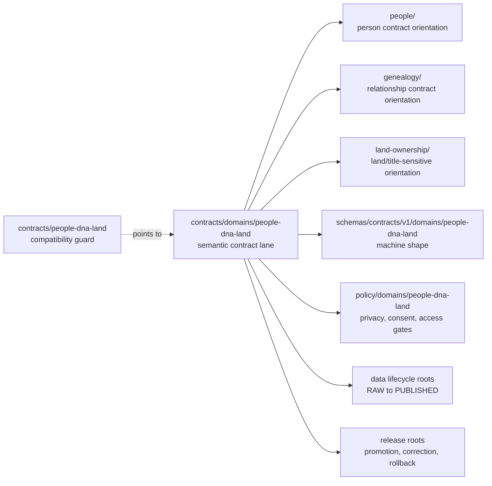

<!-- [KFM_META_BLOCK_V2]
doc_id: kfm://doc/contracts-people-dna-land-compat-readme
title: contracts/people-dna-land — People / DNA / Land Contract Compatibility README
type: readme
version: v0.1
status: draft; compatibility; restricted-review; no-parallel-authority
owners: OWNER_TBD — People/DNA/Land steward · Contracts steward · Living-person privacy steward · DNA/privacy steward · Land/title assertion steward · Consent steward · Evidence steward · Policy steward · Release steward · Docs steward · Directory Rules reviewer
created: 2026-06-24
updated: 2026-06-24
policy_label: restricted-review; contracts; people-dna-land; compatibility; living-person-aware; DNA-aware; title-sensitive; consent-aware; evidence-bound; source-role-aware; release-gated; rollback-aware; no-parallel-authority
related:
  - ../README.md
  - ../people/README.md
  - ../domains/people-dna-land/README.md
  - ../domains/people-dna-land/people/README.md
  - ../domains/people-dna-land/genealogy/README.md
  - ../domains/people-dna-land/land-ownership/README.md
  - ../domains/people-dna-land/LandInstrument.md
  - ../../docs/domains/people-dna-land/README.md
  - ../../docs/domains/people-dna-land/CANONICAL_PATHS.md
  - ../../docs/domains/people-dna-land/SCOPE_AND_BOUNDARY.md
  - ../../docs/domains/people-dna-land/IDENTITY_MODEL.md
  - ../../docs/domains/people-dna-land/SENSITIVITY_PROFILE.md
  - ../../docs/domains/people-dna-land/CONSENT_MODEL.md
  - ../../docs/domains/people-dna-land/LAND_OWNERSHIP.md
  - ../../schemas/contracts/v1/domains/people-dna-land/
  - ../../policy/domains/people-dna-land/
  - ../../fixtures/domains/people-dna-land/
  - ../../tests/domains/people-dna-land/
  - ../../release/candidates/people-dna-land/
tags: [kfm, contracts, people-dna-land, compatibility, semantic-contracts, living-person, DNA, privacy, consent, genealogy, land-ownership, evidence-bundle, policy-decision, release-gated, rollback, no-parallel-authority]
notes:
  - "Compatibility pointer for the requested `contracts/people-dna-land/` path."
  - "The inspected canonical People / DNA / Land semantic contract lane is `contracts/domains/people-dna-land/`."
  - "This README does not create schema, policy, source registry, lifecycle-data, consent, proof, receipt, release, canonical-person, DNA, title, public API, map, or AI authority."
  - "Previous file content was a placeholder; rollback target is blob SHA `e25f1814e51579d5f55c0f1fe0135ddb28a47f4a`."
[/KFM_META_BLOCK_V2] -->

# contracts/people-dna-land

> Compatibility guard for the requested `contracts/people-dna-land/` path. Use [`contracts/domains/people-dna-land/`](../domains/people-dna-land/) for the inspected People / DNA / Land semantic contract lane.

  
  
  
  
  
  

**Status:** draft compatibility guard  
**Owners:** `OWNER_TBD` — People/DNA/Land steward · Contracts steward · Living-person privacy steward · DNA/privacy steward · Land/title assertion steward · Consent steward · Evidence steward · Policy steward · Release steward · Docs steward · Directory Rules reviewer  
**Path:** `contracts/people-dna-land/README.md`  
**Canonical inspected contract lane:** [`../domains/people-dna-land/`](../domains/people-dna-land/)  
**Related short-path guard:** [`../people/README.md`](../people/README.md)  
**Truth posture:** CONFIRMED placeholder replaced · CONFIRMED inspected People / DNA / Land contract lane exists · PROPOSED cleanup until steward/ADR review resolves whether this short path should remain

## Quick jumps

[Scope](#scope) · [Repo fit](#repo-fit) · [Accepted inputs](#accepted-inputs) · [Exclusions](#exclusions) · [Compatibility flow](#compatibility-flow) · [Trust rules](#trust-rules) · [Migration checklist](#migration-checklist) · [Validation checklist](#validation-checklist) · [Rollback](#rollback)

---

## Scope

`contracts/people-dna-land/` is **not** the inspected canonical People / DNA / Land contract lane.

This README exists to prevent a near-miss path from becoming a duplicate semantic-contract authority. In the inspected repo evidence, the domain segment lives under `contracts/domains/people-dna-land/`, where human-readable semantic contracts define object and edge meaning while remaining separate from schemas, policy, source registries, lifecycle data, consent records, proof/receipt objects, release records, public APIs, maps, and AI output.

> [!IMPORTANT]
> **Do not add People / DNA / Land object contracts here unless an accepted ADR or migration explicitly moves them.** The inspected lane is `contracts/domains/people-dna-land/`, with child folders for `people/`, `genealogy/`, and `land-ownership/` where applicable.

---

## Repo fit

| Responsibility | Current or expected path | Relationship to this README |
|---|---|---|
| Contracts root rule | [`../README.md`](../README.md) | Contracts define semantic meaning; schemas, policy, tests, and data remain separate. |
| Canonical inspected domain contract lane | [`../domains/people-dna-land/`](../domains/people-dna-land/) | Parent lane for People / DNA / Land object and edge meaning. |
| People subfolder | [`../domains/people-dna-land/people/`](../domains/people-dna-land/people/) | Person assertion and identity-contract orientation. |
| Genealogy subfolder | [`../domains/people-dna-land/genealogy/`](../domains/people-dna-land/genealogy/) | Relationship and family-context contract orientation. |
| Land-ownership subfolder | [`../domains/people-dna-land/land-ownership/`](../domains/people-dna-land/land-ownership/) | Land/title-sensitive contract orientation. |
| Short-path people guard | [`../people/README.md`](../people/README.md) | Adjacent compatibility pointer; not canonical authority. |
| Domain docs | `../../docs/domains/people-dna-land/` | Domain doctrine, boundary, identity, sensitivity, consent, and land posture. |
| Machine schemas | `../../schemas/contracts/v1/domains/people-dna-land/` | Shape authority; not this folder. |
| Policy and consent gates | `../../policy/domains/people-dna-land/` and accepted sensitivity/consent policy roots | Allow/deny/restrict/abstain authority; not this folder. |
| Fixtures and tests | `../../fixtures/domains/people-dna-land/`, `../../tests/domains/people-dna-land/` | Proof and examples; not semantic authority. |
| Source registry | `../../data/registry/sources/people-dna-land/` or accepted source-registry home | Source role, cadence, rights, caveats, activation state. |
| Lifecycle data | `../../data/raw/`, `../../data/work/`, `../../data/quarantine/`, `../../data/processed/`, `../../data/catalog/`, `../../data/published/` | Evidence-bearing artifacts by lifecycle phase; not contracts. |
| Release and rollback | `../../release/candidates/people-dna-land/` and release roots | Promotion, release, correction, withdrawal, rollback authority. |

---

## Accepted inputs

Only conservative content belongs here while `contracts/people-dna-land/` remains a compatibility path:

| Accepted item | Purpose | Required posture |
|---|---|---|
| `README.md` | Compatibility pointer to the inspected `contracts/domains/people-dna-land/` lane. | Accepted. |
| Migration note | Temporary note if maintainers move contracts into or out of this path. | Temporary; must include rollback. |
| Backlink audit note | Temporary note listing inbound references to `contracts/people-dna-land/`. | Temporary. |

No durable object contracts, schemas, fixtures, policies, source records, lifecycle data, consent records, proof/receipt records, release records, runtime files, public payloads, maps, or AI outputs should be added here without accepted governance.

---

## Exclusions

| Do not put this here | Correct home | Reason |
|---|---|---|
| People / DNA / Land object or edge contracts | `../domains/people-dna-land/` unless ADR moves them | Avoids parallel semantic authority. |
| People/person contracts | `../domains/people-dna-land/people/` or accepted home | Person identity claims are high-risk and need the inspected lane. |
| Genealogy contracts | `../domains/people-dna-land/genealogy/` or accepted home | Relationship and family context require separate sensitivity handling. |
| Land/title/person-party contracts | `../domains/people-dna-land/land-ownership/` or accepted home | Land evidence and title-sensitive semantics are distinct. |
| JSON Schema | `../../schemas/contracts/v1/domains/people-dna-land/` | Schemas own machine-checkable shape. |
| Policy, consent, redaction, rights, or access rules | `../../policy/...` accepted homes | Policy owns finite allow/deny/restrict/abstain behavior. |
| Source descriptors and rights registries | `../../data/registry/sources/people-dna-land/` or accepted registry home | Source authority and rights posture must remain auditable. |
| Raw family-tree exports, source files, scans, OCR, deeds, parcel downloads, vital/census/court/probate files, or DNA material | `../../data/<phase>/people-dna-land/` or accepted restricted lifecycle homes | Lifecycle, rights, and sensitivity controls do not live in contracts. |
| Person records, identity records, consent records, proof/receipt records | Governed lifecycle, consent, proof, receipt, or release roots | Contracts describe meaning; they do not store people, DNA, land title, or consent state. |
| Public API routes, UI components, Focus Mode answers, map layers | `../../apps/`, `../../packages/`, governed API/release roots | Public clients use governed interfaces and released artifacts. |
| AI-generated identity, biography, lineage, residence, DNA, or land narratives as truth | Governed AI envelopes with citations and receipts | Generated language is interpretive and evidence-subordinate. |

---

## Compatibility flow

---

## Trust rules

People / DNA / Land is a restricted-review, fail-closed domain lane.

Minimum posture:

- contracts describe semantic meaning and review expectations; they do not store people, DNA, land records, consent records, or release artifacts;
- living-person, residence, identity-link, DNA-derived, private person-to-place, and private person-to-parcel details fail closed unless evidence, rights, consent where required, policy, review, release, correction, and rollback gates all pass;
- land/title evidence is not a legal title opinion, survey determination, or ownership adjudication;
- source-role boundaries must remain visible for observed, administrative, candidate, modeled, user-supplied, tree-imported, and derived assertions;
- public clients must consume governed APIs and released artifacts, not RAW, WORK, QUARANTINE, canonical/internal stores, private joins, or direct model output;
- generated language may summarize evidence only when citations and policy allow it, and must abstain or deny when support is missing.

---

## Migration checklist

Before making `contracts/people-dna-land/` canonical:

- [ ] Confirm why `contracts/domains/people-dna-land/` is insufficient.
- [ ] Add an ADR or migration note explaining the ownership change.
- [ ] Preserve child-lane boundaries for people, genealogy, DNA, consent, and land/title assertions.
- [ ] Pair moved object contracts with the accepted schema home.
- [ ] Link policy, sensitivity, consent, fixtures, tests, source registry, release, correction, and rollback requirements.
- [ ] Preserve history with `git mv` where moving existing files.
- [ ] Update inbound links and remove stale compatibility notes after migration.
- [ ] Re-review living-person, DNA/privacy, title-sensitive, and private-join exposure defaults before any public release.

---

## Validation checklist

- [ ] `contracts/people-dna-land/` contains no durable object contracts beyond this compatibility README unless an ADR accepts the path.
- [ ] The inspected `contracts/domains/people-dna-land/` lane remains discoverable.
- [ ] Child people, genealogy, and land-ownership contract folders remain discoverable under the inspected lane.
- [ ] No schema, policy, source registry, data, consent, proof, receipt, release, runtime code, UI, API, map, or AI output is normalized here.
- [ ] Living-person, DNA-derived, title-sensitive, residence, identity, and private-join material remains fail-closed.

---

## Rollback

Rollback is required if this README is used to justify a parallel People / DNA / Land authority, bypass the inspected domain lane, publish living-person or DNA-derived material, store people/DNA/land data under contracts, or treat generated identity, lineage, residence, DNA, or land narratives as evidence.

Rollback target for this replacement: previous placeholder blob SHA `e25f1814e51579d5f55c0f1fe0135ddb28a47f4a`.

<a href="#top">Back to top</a>

