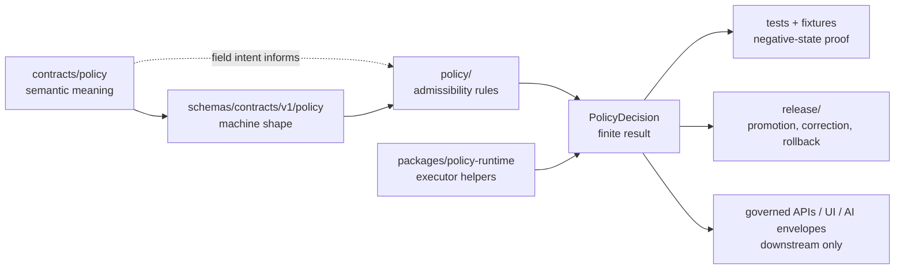

<!-- [KFM_META_BLOCK_V2]
doc_id: kfm://doc/contracts-policy-readme
title: contracts/policy — Policy Contract Semantics README
type: readme
version: v0.2
status: draft; semantic-contract-lane; policy-admissibility-aware; not-policy-runtime
owners: OWNER_TBD — Policy steward · Contracts steward · Schema steward · Policy-runtime steward · Evidence steward · Release steward · Docs steward · Directory Rules reviewer
created: NEEDS VERIFICATION — file existed before v0.2 expansion
updated: 2026-06-24
policy_label: public; contracts; policy; semantic-contracts; policy-decision; admissibility; finite-outcomes; fail-closed; no-executable-policy
related:
  - ../README.md
  - ../../policy/README.md
  - ../../packages/policy-runtime/README.md
  - ../../schemas/contracts/v1/policy/
  - ../../docs/architecture/contract-schema-policy-split.md
  - ../../docs/architecture/governed-ai/FOCUS_FLOW.md
  - ../../docs/standards/MAP_TRUST_STATES.md
  - ../../docs/architecture/publication/RELEASE_GATES.md
  - ../../fixtures/contracts/v1/policy/
  - ../../tests/contracts/policy/
tags: [kfm, contracts, policy, policy-decision, policy-input-bundle, semantic-contracts, admissibility, allow, deny, restrict, hold, abstain, error, fail-closed, evidence-bundle, release-gated, no-runtime-authority]
notes:
  - "Expanded from a short stub at `contracts/policy/README.md`."
  - "This README is for human-readable semantic policy object contracts only."
  - "Executable policy rules belong under `policy/`; runtime helpers belong under `packages/policy-runtime/`; machine shape belongs under `schemas/contracts/v1/policy/` or the accepted schema home."
  - "This README does not create policy-rule authority, schema authority, runtime behavior, receipts, proofs, release decisions, public API behavior, UI behavior, or AI truth claims."
[/KFM_META_BLOCK_V2] -->

# contracts/policy

> Semantic-contract lane for policy object meanings such as `PolicyInputBundle`, `PolicyDecision`, reason codes, obligations, redaction/generalization instructions, and finite gate outcomes. This folder explains what policy objects mean; it does not execute policy, author policy rules, publish artifacts, or replace release gates.

  
  
  
  
  
  

**Status:** draft semantic-contract lane  
**Owners:** `OWNER_TBD` — Policy steward · Contracts steward · Schema steward · Policy-runtime steward · Evidence steward · Release steward · Docs steward · Directory Rules reviewer  
**Path:** `contracts/policy/README.md`  
**Owning root:** `contracts/` — human-readable semantic meaning for policy object families  
**Policy rule authority:** `policy/`, not this folder  
**Runtime helper authority:** `packages/policy-runtime/`, not this folder  
**Truth posture:** CONFIRMED stub replaced · CONFIRMED contracts root is semantic meaning only · CONFIRMED architecture split separates meaning, shape, admissibility, and proof · PROPOSED object inventory until concrete contract/schema/test files are verified

## Quick jumps

[Scope](#scope) · [Repo fit](#repo-fit) · [Expected contract families](#expected-contract-families) · [Accepted inputs](#accepted-inputs) · [Exclusions](#exclusions) · [Finite outcomes](#finite-outcomes) · [Compatibility flow](#compatibility-flow) · [Trust rules](#trust-rules) · [Migration checklist](#migration-checklist) · [Validation checklist](#validation-checklist) · [Rollback](#rollback)

---

## Scope

`contracts/policy/` is the semantic-contract lane for **policy object meaning**, not executable policy behavior.

This folder may define what a `PolicyInputBundle`, `PolicyDecision`, policy reason code, obligation, hold flag, redaction/generalization instruction, or policy-evaluation receipt reference means. It must not contain the rules that decide allow/deny behavior, the schema that validates objects, the runtime package that invokes a policy engine, or the fixtures/tests that prove behavior.

> [!IMPORTANT]
> The core split is: `contracts/` explains **meaning**, `schemas/` defines **shape**, `policy/` owns **admissibility**, and `tests/` + `fixtures/` prove **enforceability**. This folder only owns the first layer for policy object families.

---

## Repo fit

| Responsibility | Current or expected path | Relationship to this README |
|---|---|---|
| Semantic policy contracts | `contracts/policy/` | This folder. Defines policy object meaning and obligations in Markdown. |
| Contracts root rule | [`../README.md`](../README.md) | Contracts define object meaning and pair with schemas. |
| Executable policy rules and bundles | `../../policy/` | Owns Rego/OPA/equivalent rule source, bundle promotion, review, and admissibility. |
| Policy runtime helpers | [`../../packages/policy-runtime/`](../../packages/policy-runtime/) | Executes approved policy bundles against explicit inputs; does not own policy authority. |
| Machine schemas | `../../schemas/contracts/v1/policy/` | Shape authority for policy objects. |
| Fixtures | `../../fixtures/contracts/v1/policy/` and policy-specific fixture roots | Positive and negative examples. |
| Tests | `../../tests/contracts/policy/` and policy test roots | Proof that shape, meaning, and policy behavior remain enforceable. |
| Evidence/proofs | `../../data/proofs/` and accepted evidence roots | Evidence closure and proof artifacts; policy may reference status, not own truth. |
| Receipts | `../../data/receipts/` or accepted receipt roots | Stores receipt artifacts; contracts may require references only. |
| Release | `../../release/` | Promotion, publication, correction, withdrawal, and rollback authority. |
| Public API/UI | `../../apps/`, `../../ui/`, `../../web/`, or repo-confirmed public roots | Downstream consumers of governed decisions, not contract authority. |

---

## Expected contract families

These are **PROPOSED** policy contract families until concrete contract files, schemas, fixtures, and tests are verified:

| Candidate contract | Meaning this lane should define | Boundary |
|---|---|---|
| `PolicyInputBundle` | The explicit, inspectable input set a policy gate evaluates. | Does not fetch missing facts or source data. |
| `PolicyDecision` | The finite decision record returned by a policy gate. | Does not itself publish or release artifacts. |
| `PolicyReasonCode` | Stable reason-code vocabulary for allow/deny/restrict/hold/abstain/error decisions. | Does not replace narrative reviewer notes or evidence citations. |
| `PolicyObligation` | Required downstream action such as redact, generalize, cite, review, delay, withhold, or rollback-check. | Obligations must be enforceable by runtime/release gates. |
| `SensitivityDecision` | Sensitivity-specific posture for exact location, living-person, DNA/genomic, archaeology, rare species, infrastructure, cultural/tribal, and rights-limited contexts. | Does not store sensitive data. |
| `RightsDecision` | Rights/license/terms posture for use, display, export, redistribution, or denial. | Does not replace source registry authority. |
| `ReleaseGateDecision` | Policy result attached to promotion or publication gate. | Release authority remains under `release/`. |
| `PolicyEvaluationReceiptRef` | Reference to receipt-ready metadata or receipt artifacts. | Receipts live in receipt/proof roots, not contracts. |

---

## Accepted inputs

Policy contracts may describe how the following inputs are represented semantically:

| Input family | Accepted semantic treatment | Required guardrail |
|---|---|---|
| Evidence state | EvidenceRef, EvidenceBundle status, citation validation, resolver result. | Policy may consume evidence status; it must not fabricate evidence. |
| Source state | SourceDescriptor ref, source role, rights posture, cadence, caveats, authority limits. | Source registry remains the source-authority home. |
| Lifecycle state | RAW, WORK, QUARANTINE, PROCESSED, CATALOG, TRIPLET, PUBLISHED, release/candidate state. | Public exposure of invalid phases must fail closed. |
| Sensitivity state | Location precision, living-person, DNA/genomic, archaeology, rare species, infrastructure, cultural/tribal, private-join flags. | Sensitive exact values must not be placed in contracts. |
| Rights state | license, terms, embargo, redistribution, attribution, provenance, restriction flags. | Unknown or unclear rights deny, restrict, hold, or abstain. |
| Audience/operation | public, steward, restricted-review, export, map render, API response, Focus Mode answer, release promotion. | Decision must be operation-specific. |
| Release context | release candidate, review state, PolicyDecision, rollback target, correction lineage. | Policy decision cannot replace release approval. |

---

## Exclusions

| Do not put this here | Correct home | Reason |
|---|---|---|
| Rego/OPA/equivalent policy rules or bundles | `../../policy/` | Policy rule authority belongs to policy roots. |
| Policy runtime adapters, engine wrappers, CLI code, package code | `../../packages/policy-runtime/` or accepted package/tool roots | Runtime execution is implementation, not contract meaning. |
| JSON Schema | `../../schemas/contracts/v1/policy/` | Schemas own machine-checkable shape. |
| Fixtures and tests | `../../fixtures/`, `../../tests/`, `../../policy/fixtures/`, `../../policy/tests/` | Enforceability must remain independently testable. |
| RAW, WORK, QUARANTINE, PROCESSED, CATALOG, TRIPLET, or PUBLISHED data | `../../data/<phase>/` | Lifecycle state is not contract prose. |
| Source descriptors and source registries | `../../data/registry/` or accepted registry homes | Source authority, rights, cadence, and caveats are registry state. |
| EvidenceBundle storage, proof packs, or receipt artifacts | `../../data/proofs/`, `../../data/receipts/` | Trust artifacts must remain separately auditable. |
| Release manifests, rollback cards, correction notices, promotion records | `../../release/` | Publication is a governed state transition. |
| Public API serializers/routes or UI components | `../../apps/`, `../../ui/`, `../../web/`, or repo-confirmed homes | Public clients use governed interfaces. |
| AI-generated policy claims or legal/privacy advice | Governed AI runtime with evidence and policy citations | Generated language is interpretive and cannot create policy authority. |

---

## Finite outcomes

Policy object contracts must preserve finite outcomes and avoid vague approval language.

| Outcome | Semantic meaning | Required posture |
|---|---|---|
| `ALLOW` | Policy gate allows the specific operation for the specific input and audience. | Must name evidence, rights, source role, sensitivity, and release context where relevant. |
| `DENY` | Policy gate refuses the operation because a rule blocks it. | Must carry reason codes and safe explanation. |
| `RESTRICT` | Operation may continue only with constraints such as redaction, generalization, staged access, or delay. | Must carry enforceable obligations. |
| `HOLD` | Requires steward/reviewer action before continuing. | Must identify review reason and missing authority. |
| `ABSTAIN` | Insufficient admissible evidence or unresolved support; system refuses to manufacture a claim. | Must not be converted into denial or answer without review. |
| `ERROR` | Shape, integrity, evaluator, process, or missing-context failure. | Distinct from policy denial and evidence shortage. |

---

## Compatibility flow

---

## Trust rules

1. **Semantic only.** This folder explains policy object meaning; it does not execute policy or decide gates.
2. **No hidden fetches.** Policy inputs must be explicit and inspectable; contracts must not imply that policy can retrieve missing facts from memory, UI state, source systems, or generated text.
3. **Fail closed.** Missing evidence, rights, sensitivity, review, release, source authority, bundle version, or evaluator integrity produces `DENY`, `RESTRICT`, `HOLD`, `ABSTAIN`, or `ERROR`, not silent approval.
4. **Separate deny from abstain.** Policy refusal, evidence shortage, and process failure are different outcomes and must remain distinguishable.
5. **Sensitive fixtures stay synthetic.** Contracts may require sensitive-lane denial tests, but must not include real exact sensitive values.
6. **Release remains governed.** A `PolicyDecision` can gate promotion; it cannot publish artifacts by itself.
7. **AI is downstream.** AI may explain a policy result with citations, but cannot create policy authority, evidence, consent, rights, review, release, or rollback state.

---

## Migration checklist

Before adding object-level policy contracts here:

- [ ] Confirm the object family does not already have a contract in another lane.
- [ ] Pair the contract with a single accepted schema home under `schemas/contracts/v1/policy/` or an ADR-approved path.
- [ ] Link the executable rule home under `policy/` without duplicating rule logic in prose.
- [ ] Add fixtures for allowed, denied, restricted, held, abstained, invalid, stale, and evaluator-error cases.
- [ ] Add tests that exercise negative states and fail-closed behavior.
- [ ] Link evidence, source, rights, sensitivity, release, correction, and rollback dependencies.
- [ ] Keep receipts and proof artifacts in their owning roots.
- [ ] Update docs if the object affects public API, UI, map, AI, or release behavior.

---

## Validation checklist

- [ ] No executable policy code is placed under `contracts/policy/`.
- [ ] No JSON Schema is placed under `contracts/policy/`.
- [ ] Contract text does not duplicate policy rule logic that should live under `policy/`.
- [ ] Finite outcomes remain explicit and distinct.
- [ ] Sensitive-lane examples are synthetic/redacted/generalized.
- [ ] Release approval remains under release gates.
- [ ] Public clients remain downstream of governed APIs and released artifacts.

---

## Rollback

Rollback is required if this folder is used to host executable policy rules, define schemas, store receipts/proofs, publish artifacts, bypass release gates, collapse `DENY` and `ABSTAIN`, or treat generated language as policy authority.

Rollback target for this expansion: previous blob SHA `26742b9b87bfa267206c642e5a0fbfb31b24cebd`.

<a href="#top">Back to top</a>

