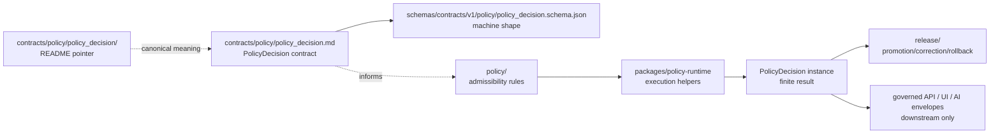

<!-- [KFM_META_BLOCK_V2]
doc_id: kfm://doc/contracts-policy-policy-decision-readme
title: contracts/policy/policy_decision — PolicyDecision Object Folder README
type: readme
version: v0.1
status: draft; compatibility; object-folder-pointer; no-parallel-authority
owners: OWNER_TBD — Policy steward · Contracts steward · Schema steward · Policy-runtime steward · Release steward · Docs steward · Directory Rules reviewer
created: 2026-06-24
updated: 2026-06-24
policy_label: public; contracts; policy; policy-decision; compatibility; object-folder; semantic-pointer; no-parallel-authority; release-gated
tags: [kfm, contracts, policy, policy-decision, README, compatibility, pointer, finite-outcomes, schema-paired, fail-closed, no-parallel-authority]
related:
  - ../README.md
  - ../policy_decision.md
  - ../policy_input_bundle.md
  - ../sensitivity_label.md
  - ../../runtime/decision_envelope.md
  - ../../../schemas/contracts/v1/policy/policy_decision.schema.json
  - ../../../policy/
  - ../../../packages/policy-runtime/README.md
  - ../../../docs/architecture/contract-schema-policy-split.md
  - ../../../fixtures/contracts/v1/policy/policy_decision/
  - ../../../tests/contracts/policy/
notes:
  - "Compatibility/object-folder README for the requested `contracts/policy/policy_decision/` path."
  - "The object-level semantic contract is `contracts/policy/policy_decision.md`; this README must not duplicate or supersede it."
  - "Use this folder only for object-specific notes, fixture indexes, migration notes, or backlink audits if maintainers accept the folder convention."
  - "This README does not create schema authority, executable policy authority, runtime behavior, release approval, receipt/proof authority, public API behavior, UI behavior, or AI truth claims."
  - "Previous file content was a placeholder; rollback target is blob SHA `e25f1814e51579d5f55c0f1fe0135ddb28a47f4a`."
[/KFM_META_BLOCK_V2] -->

<a id="top"></a>

# contracts/policy/policy_decision

> Object-folder pointer for `PolicyDecision`. The canonical semantic contract is [`../policy_decision.md`](../policy_decision.md). This folder README exists to prevent the folder path from becoming a duplicate contract authority.

<p>
  
  
  
  
  
  
</p>

**Status:** draft compatibility / object-folder pointer  
**Path:** `contracts/policy/policy_decision/README.md`  
**Canonical object contract:** [`../policy_decision.md`](../policy_decision.md)  
**Paired schema:** `schemas/contracts/v1/policy/policy_decision.schema.json`  
**Policy rule authority:** `policy/`, not this folder  
**Runtime helper authority:** `packages/policy-runtime/`, not this folder  
**Truth posture:** CONFIRMED placeholder replaced · CONFIRMED canonical object contract exists · CONFIRMED paired schema path is named by the object contract · PROPOSED folder convention until ADR/steward review accepts object folders under `contracts/policy/`

## Quick jumps

[Scope](#scope) · [Repo fit](#repo-fit) · [Accepted contents](#accepted-contents) · [Exclusions](#exclusions) · [Object summary](#object-summary) · [Compatibility flow](#compatibility-flow) · [Validation checklist](#validation-checklist) · [Rollback](#rollback)

---

## Scope

`contracts/policy/policy_decision/` is an object-folder compatibility path.

The canonical semantic contract remains:

```text
contracts/policy/policy_decision.md
```

This README may help maintainers navigate object-specific material, but it must not become a second definition of `PolicyDecision`. Any changes to object meaning belong in [`../policy_decision.md`](../policy_decision.md), with corresponding schema, fixture, policy, validator, and test updates where needed.

> [!IMPORTANT]
> Do not copy the full `PolicyDecision` contract into this folder. Duplicating meaning creates drift between sibling Markdown authorities.

---

## Repo fit

| Responsibility | Correct path | Relationship to this README |
|---|---|---|
| Policy object semantic meaning | [`../policy_decision.md`](../policy_decision.md) | Canonical object contract. |
| Policy contract family README | [`../README.md`](../README.md) | Defines the policy contract lane. |
| Policy input companion | [`../policy_input_bundle.md`](../policy_input_bundle.md) | Input to policy evaluation. |
| Sensitivity companion | [`../sensitivity_label.md`](../sensitivity_label.md) | Sensitivity context for policy evaluation. |
| Runtime decision transport | [`../../runtime/decision_envelope.md`](../../runtime/decision_envelope.md) | Runtime envelope, not canonical decision content. |
| Machine schema | `../../../schemas/contracts/v1/policy/policy_decision.schema.json` | Shape authority. |
| Executable rules | `../../../policy/` | Policy/admissibility authority. |
| Runtime helpers | `../../../packages/policy-runtime/` | Execution/adapters only. |
| Fixtures | `../../../fixtures/contracts/v1/policy/policy_decision/` | Proposed/expected fixture home. |
| Tests | `../../../tests/contracts/policy/` | Enforceability. |
| Release/correction/rollback | `../../../release/` | Publication and rollback authority. |

---

## Accepted contents

Only conservative object-adjacent material belongs here while this folder convention remains PROPOSED:

| Accepted item | Purpose | Required posture |
|---|---|---|
| `README.md` | Pointer to the canonical object contract. | Accepted. |
| `MIGRATION.md` | Temporary notes if maintainers move from flat object contracts to object folders. | Temporary; must include rollback. |
| `BACKLINKS.md` | Temporary backlink audit for links pointing to folder vs flat file. | Temporary. |
| `FIXTURE_INDEX.md` | Optional index pointing to fixture roots without storing fixtures here. | Pointer only. |
| `VALIDATION_NOTES.md` | Optional validator/test wiring notes. | Must not define schema or policy. |

Future object-folder content requires steward/ADR acceptance if it changes the flat-file contract convention.

---

## Exclusions

| Do not put this here | Correct home | Reason |
|---|---|---|
| A second `PolicyDecision` semantic contract | `../policy_decision.md` | Avoids duplicate authority. |
| JSON Schema | `../../../schemas/contracts/v1/policy/policy_decision.schema.json` | Schemas own machine shape. |
| Rego/OPA/equivalent rules | `../../../policy/` | Policy owns admissibility. |
| Runtime engine code or adapters | `../../../packages/policy-runtime/` or accepted package roots | Runtime execution is implementation, not contract meaning. |
| Fixtures | `../../../fixtures/contracts/v1/policy/policy_decision/` or accepted fixture root | Fixtures should not be hidden under contract docs. |
| Tests | `../../../tests/contracts/policy/` or policy test roots | Enforceability lives in tests. |
| Receipts/proofs | `../../../data/receipts/`, `../../../data/proofs/` or accepted roots | Trust artifacts must remain separately auditable. |
| Release manifests, rollback cards, correction notices | `../../../release/` | Publication is a governed state transition. |
| Public API, UI, map, or AI output | `../../../apps/`, `../../../ui/`, `../../../web/`, governed runtime roots | Downstream consumers only. |

---

## Object summary

`PolicyDecision` records the finite, auditable outcome of one policy evaluation event. It includes a decision identifier, finite outcome, policy family, reasons, obligations, and evaluation timestamp.

The current object contract states that `PolicyDecision`:

- is schema-paired;
- remains semantic meaning only;
- does not execute policy;
- does not publish artifacts;
- does not replace release approval;
- does not serve as a runtime transport envelope;
- remains distinct from `PolicyInputBundle`, `DecisionEnvelope`, `ReleaseManifest`, `ReviewRecord`, `EvidenceBundle`, and receipt/proof artifacts.

---

## Compatibility flow



---

## Validation checklist

- [ ] Links to the canonical object contract resolve.
- [ ] No duplicate object contract is introduced under this folder.
- [ ] Schema updates remain under `schemas/contracts/v1/policy/`.
- [ ] Policy rule updates remain under `policy/`.
- [ ] Runtime helper updates remain under `packages/policy-runtime/` or accepted package/tool roots.
- [ ] Fixtures and tests remain under accepted fixture/test homes.
- [ ] `ANSWER`, `ABSTAIN`, `DENY`, and `ERROR` remain finite and distinct.
- [ ] `ANSWER` is never treated as release approval by this folder.

---

## Rollback

Rollback is required if this folder is used to create a duplicate `PolicyDecision` contract, bypass schema/policy/test/release homes, treat `ANSWER` as publication approval, or host runtime/API/UI/AI behavior.

Rollback target for this replacement: previous placeholder blob SHA `e25f1814e51579d5f55c0f1fe0135ddb28a47f4a`.

<p align="right"><a href="#top">Back to top</a></p>
