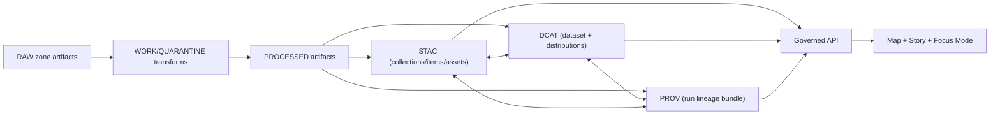

# Contract Profiles
Machine-validatable profiles for KFM contract surfaces (catalog triplet + governed runtime artifacts).

**Status:** Draft  
**Owners:** Standards + Governance (TBD)  
**Badges:** contract-first • evidence-first • fail-closed • map-first • time-aware

## Quick nav
- [Purpose](#purpose)
- [What “profiles” are in KFM](#what-profiles-are-in-kfm)
- [Directory layout](#directory-layout)
- [Profile registry](#profile-registry)
- [EvidenceRef schemes](#evidenceref-schemes)
- [Cross-linking rules](#cross-linking-rules)
- [Validation gates](#validation-gates)
- [Change process](#change-process)
- [Glossary](#glossary)

---

## Purpose
This folder defines **KFM Profiles**: strict, testable, machine-checkable constraints applied to:
- **Catalog + provenance artifacts** (DCAT, STAC, PROV)
- **Governed runtime artifacts** (policy decisions, evidence bundles, etc.)

Profiles exist to make validation **strict and predictable**, prevent “schema drift,” and ensure that **EvidenceRef** resolution can happen without guessing.

---

## What “profiles” are in KFM
A **profile** is a contract overlay on an external standard (or an internal KFM object) that:
- Declares **minimum required fields**
- Declares allowed **extension points**
- Declares **cross-link requirements** between artifacts
- Is **validated in CI** and **enforced at runtime** where relevant

Profiles are not “documentation suggestions.” They are **contract surfaces**.

### How profiles fit the end-to-end system



---

## Directory layout
This directory is expected to contain (or evolve toward) a structure like:

```text
contracts/profiles/
├── README.md
├── dcat/          # DCAT profile constraints + examples
├── stac/          # STAC profile constraints + examples
├── prov/          # PROV profile constraints + examples
├── policy/        # policy label taxonomy + policy decision contract
└── evidence/      # EvidenceRef schemes + evidence bundle contract
```

**Rule of thumb**
- Put **machine-checkable** constraints here (JSON Schema, JSON-LD context constraints, contract tests, fixtures).
- Put **human narrative standards** elsewhere (e.g., documentation standards), but keep them consistent with these contracts.

---

## Profile registry
The table below lists the minimum profile surfaces KFM depends on. If you add a new governed artifact type, add it here and create a profile for it.

> **Naming convention (recommended):** `KFM_<SURFACE>_<OBJECT>_PROFILE`  
> **Versioning (required):** profiles must declare a version (semantic or monotonic) and be stable under hashing.

| Profile | Applies to | Minimum required fields / rules |
|---|---|---|
| **KFM DCAT Dataset Profile** | `dcat:Dataset` record (JSON-LD) | `dct:title`, `dct:description`, `dct:publisher`, `dct:license` (or `dct:rights`), `dcat:theme`, `dct:spatial`, `dct:temporal`, `dcat:distribution`, `prov:wasGeneratedBy`, `kfm:policy_label`, `kfm:dataset_id`, `kfm:dataset_version_id` |
| **KFM STAC Collection Profile** | STAC Collection JSON | `id`, `title`, `description`, `extent` (bbox + temporal), `license`, link to DCAT record, `kfm:dataset_version_id`, `kfm:policy_label` |
| **KFM STAC Item Profile** | STAC Item JSON | `id`, `geometry` or `bbox` (policy-consistent), `datetime` or start/end, assets with `href` + `checksum` + `media_type`, links to PROV/run receipt + DCAT distribution |
| **KFM PROV Bundle Profile** | PROV-O bundle (JSON-LD or RDF) | `prov:Activity` per run, `prov:Entity` per artifact, `prov:Agent` for pipeline and approvals, `prov:used` + `prov:wasGeneratedBy` edges, `kfm:policy_decision` references, environment capture (container digest, git commit, parameters) |

### Additional governed profiles (recommended)
These objects are “contract surfaces” because they drive policy, UX trust surfaces, or promotion workflows. Add them as needed:

- **Policy Decision** (allow/deny + obligations)
- **EvidenceBundle** (human renderable view + machine metadata + allowed links)
- **Run Receipt** (audit ledger entry per pipeline run)
- **Map State** (saved views and Story Node map state)
- **DatasetVersion Diff Report** (what changed + QA deltas + artifact digests)

---

## EvidenceRef schemes
Evidence references must be resolvable via deterministic schemes.

Minimum expected schemes:
- `dcat://...` → dataset/distribution metadata
- `stac://...` → collection/item/asset metadata
- `prov://...` → run lineage (activities/entities/agents)
- `doc://...` → governed docs and story citations
- `graph://...` → entity relations (if enabled)

> If you introduce a new scheme, you must define:
> 1) canonical string format  
> 2) resolver behavior  
> 3) policy enforcement behavior  
> 4) contract tests

---

## Cross-linking rules
Cross-links are not optional—navigation and trust depend on them.

Minimum rules:
- DCAT dataset → distributions → **artifact digests**
- DCAT dataset → `prov:wasGeneratedBy` → PROV bundle / run activity
- STAC collection → `rel="describedby"` → DCAT dataset
- STAC item → link to PROV activity and/or run receipt
- EvidenceRef schemes must resolve into these objects **without guessing**

---

## Validation gates
Profiles must be enforced through **fail-closed** validation gates.

### Required checks (CI + local)
- [ ] Schema validation for DCAT/STAC/PROV against the KFM profiles
- [ ] Link-check validation for required cross-links
- [ ] Evidence resolver contract tests:
  - [ ] “public” evidence resolves to a bundle with allowed artifacts
  - [ ] “restricted” evidence denies access and does not leak sensitive metadata
- [ ] Policy tests for obligations (generalization/redaction)
- [ ] Spec hash drift checks (profile changes are explicit and reviewable)
- [ ] Golden tests for canonicalization and deterministic outputs

### Minimal local workflow (example)
```bash
# Example commands (adapt to repo tooling)
npm test
npm run lint

# Validate catalogs/provenance against profiles
npm run validate:dcat
npm run validate:stac
npm run validate:prov

# Validate cross-links
npm run linkcheck:catalogs

# Run contract tests for policy + evidence resolver
npm run test:policy
npm run test:integration:evidence
```

---

## Change process
Changes to profiles are **governance changes** (they affect what can be promoted/published and how evidence is trusted).

### PR checklist
- [ ] Profile change request includes rationale + risk assessment
- [ ] Backward-compatibility analysis (breaking/non-breaking)
- [ ] Updated schema(s) + updated examples/fixtures
- [ ] Updated validators/contract tests (new tests added for new rules)
- [ ] Spec hash updated (or new profile version introduced)
- [ ] Promotion gates still pass

### Versioning rule (required)
- **Breaking changes** must bump the profile version and support a transition plan.
- **Non-breaking additions** must still be validated and tested.

---

## Glossary
**Profile**  
A contract overlay on a standard or internal KFM object that makes validation strict and predictable.

**Catalog triplet**  
The linked set of DCAT (dataset metadata), STAC (asset metadata), and PROV (lineage) used as the canonical interface between pipelines and runtime.

**EvidenceRef**  
A stable reference (scheme-based or structured) that resolves into a governed EvidenceBundle.

**EvidenceBundle**  
The resolved evidence package returned by the evidence resolver: human view + machine metadata + allowed artifact links + audit references.

---

<a id="top"></a>
Back to top: [Contract Profiles](#contract-profiles)
