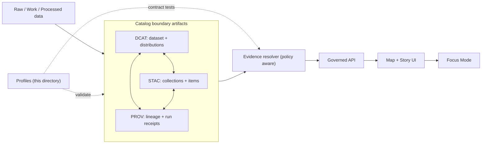

<!-- [KFM_META_BLOCK_V2]
doc_id: kfm://doc/b23925b0-68a0-4b31-97a5-2434d4f34417
title: Contracts — Profiles
type: standard
version: v1
status: draft
owners: KFM Maintainers (Engineering + Governance)
created: 2026-02-22
updated: 2026-02-22
policy_label: public
related: []
tags: [kfm, contracts, profiles, metadata, validation, governance]
notes:
  - This README is a contract-facing overview for profile artifacts and how they enforce fail-closed promotion.
  - Paths shown under “Suggested layout” are examples; confirm actual repo locations before wiring CI.
[/KFM_META_BLOCK_V2] -->

# Contracts: Profiles
One-line purpose: **Define and enforce KFM’s machine-validated “profile” constraints for governed artifacts (catalogs, provenance, narratives).**  
Status: **draft** · Owners: **KFM Maintainers (Engineering + Governance)**


---

## Quick navigation
- [What a “profile” is in KFM](#what-a-profile-is-in-kfm)
- [What lives in this directory](#what-lives-in-this-directory)
- [Profile baselines](#profile-baselines)
- [Cross-linking rules](#cross-linking-rules)
- [EvidenceRef schemes](#evidenceref-schemes)
- [Controlled vocabularies](#controlled-vocabularies)
- [CI & promotion gates](#ci--promotion-gates)
- [Versioning rules](#versioning-rules)
- [How to add or change a profile](#how-to-add-or-change-a-profile)
- [Governance review triggers](#governance-review-triggers)

---

## What a profile is in KFM

In KFM, a **profile** is a *KFM-specific constraint layer* applied to a base specification (e.g., DCAT / STAC / PROV) that makes:
- validation **strict and predictable**,
- cross-references **deterministic**,
- promotion and publishing **fail-closed**.

A profile is not just documentation. It is a **machine-validated contract artifact** that must be testable and versioned.

### Why profiles exist
Without profiles, upstream standards allow many “legal but ambiguous” shapes. KFM needs stricter rules so:
- the UI can resolve citations reliably,
- Focus Mode can enforce **cite-or-abstain**,
- governance can enforce **FAIR + CARE** and sovereignty guardrails (policy labels, redaction obligations, rights/consent).

Profiles also make the pipeline *evidence-first*: **catalog/provenance boundary artifacts must exist (and validate) before anything is considered publishable.**

---

## What lives in this directory

This directory is intended to be the **home for profile artifacts** (and/or the index pointing at profile artifacts) used by:
- catalog validators (DCAT/STAC),
- provenance validators (PROV / run receipts),
- story/narrative validators (Story Node sidecars),
- evidence resolver contract tests.

> NOTE  
> If your repo uses a different canonical location for JSON Schemas (e.g., a top-level `schemas/` folder), keep **one source of truth** and have this directory reference it (do not duplicate schemas in multiple places).

### Suggested layout
*(Create folders/files as needed — examples only.)*

```text
contracts/
└─ profiles/
   ├─ README.md                         # you are here
   ├─ profiles.registry.yaml             # (optional) profile index + version pins
   ├─ dcat/
   │  └─ kfm.dcat.dataset.profile.v1.json
   ├─ stac/
   │  ├─ kfm.stac.collection.profile.v1.json
   │  └─ kfm.stac.item.profile.v1.json
   ├─ prov/
   │  └─ kfm.prov.bundle.profile.v1.json
   ├─ storynodes/
   │  └─ kfm.storynode.sidecar.profile.v3.json
   └─ evidence/
      └─ kfm.evidence.bundle.profile.v1.json
```

---

## Profile baselines

These baselines express the **minimum required fields** and **must-have semantics** to keep the system governed.

> IMPORTANT  
> “Minimum required” does **not** mean “minimum effort.”  
> If data can’t meet the profile, the correct move is usually: **fix the pipeline**, **add missing provenance**, or **publish a new dataset version** — not weakening the profile.

### DCAT baseline (dataset + distributions)
A KFM DCAT dataset record MUST include, at minimum:
- title + description
- publisher
- license/rights
- theme
- spatial and temporal coverage
- distributions (and distribution → artifact digests)
- provenance link(s) (e.g., `prov:wasGeneratedBy`)
- **KFM identity fields** (dataset_id, dataset_version_id)
- **policy_label** (classification)

### STAC baseline (collection + items)
A KFM STAC **Collection** MUST include, at minimum:
- id/title/description
- extent: bbox + temporal interval
- license
- link to the DCAT dataset (e.g., `rel="describedby"`)
- dataset_version_id
- policy_label

A KFM STAC **Item** MUST include, at minimum:
- id
- geometry or bbox consistent with policy label (generalized if needed)
- datetime (or start/end)
- assets with `href + checksum + media_type`
- links to PROV activity/run receipt
- links to DCAT distribution(s)

### PROV baseline (lineage bundle / run receipts)
A KFM PROV bundle MUST include, at minimum:
- `prov:Activity` per pipeline run
- `prov:Entity` per artifact (raw/work/processed)
- `prov:Agent` for pipeline + steward approval events
- `prov:used` + `prov:wasGeneratedBy` edges
- policy decision references (decision_id + obligations)
- environment capture (container digest, git commit, parameters)

---

## Cross-linking rules

Cross-links MUST be explicit so navigation and evidence resolution are deterministic:

- **DCAT dataset → distributions → artifact digests**
- **DCAT dataset → provenance** (e.g., `prov:wasGeneratedBy`) → PROV bundle
- **STAC collection → describedby → DCAT dataset**
- **STAC item → link to PROV activity and/or run receipt**
- EvidenceRef schemes must resolve into these objects **without guessing**

A link-checker MUST be part of CI to verify required cross-links for every promoted dataset version.

---

## EvidenceRef schemes

KFM uses **scheme-based references** to make citations compact and resolvable by an evidence resolver.

Publishing rule:
- Story Node citations (and UI “feature → evidence” actions) MUST be able to resolve via the evidence resolver contract (e.g., `/api/v1/evidence/resolve`).

At minimum, the resolver should accept these schemes:
- `dcat://…`
- `stac://…`
- `prov://…`
- `doc://…`
- `graph://…`
- (`url://…` is discouraged except as a last resort)

### Recommended shape
Keep EvidenceRef syntax boring and machine-friendly:

```text
<scheme>://<canonical_id>[@<version_or_time>][#<selector>]
```

Examples (illustrative):
- `dcat://kfm.dataset.noaa_storm_events@2026-02.abcd1234`
- `stac://items/noaa_storm_events/1953-06-09T00:00:00Z@2026-02.abcd1234`
- `prov://run/2026-02-20T12:34Z.pipeline.noaa_storm_events`
- `doc://kfm://doc/<uuid>#L120-L150`
- `graph://node/<neo4j_id>`

---

## Controlled vocabularies

Profiles should reference controlled vocabularies (and validators MUST enforce them). At minimum:

### `policy_label` (starter set)
- public
- public_generalized
- restricted
- restricted_sensitive_location
- internal
- embargoed
- quarantine

> Safety note (sensitive locations)
> - Datasets classified as `restricted_sensitive_location` typically require a **dual-output** strategy: a restricted precise dataset version and (only if allowed) a `public_generalized` version with tested non-leakage.

### `artifact.zone`
- raw
- work
- processed
- catalog
- published

### `citation.kind`
- dcat
- stac
- prov
- doc
- graph
- url (discouraged)

> WARNING  
> Controlled vocabulary drift is “silent schema breakage.” Any change here needs a version bump + migration plan.

---

## CI & promotion gates

Profiles are only real if they are enforced by CI and release promotion gates.

Minimum checks (baseline):
- schema validation for DCAT/STAC/PROV profiles
- link-check cross-links (DCAT↔STAC↔PROV)
- evidence resolver contract tests (public allows artifacts; restricted denies without leaking sensitive metadata)
- spec_hash stability tests (contracts must not drift silently)
- golden tests for canonicalization and deterministic outputs

### Relationship to the trust membrane
Profiles support the trust membrane by ensuring:
- UI and narratives can only reference **resolvable evidence**,
- policy classification is present everywhere it needs to be,
- promotion can be blocked *before* governed runtime surfaces can serve broken or unsafe artifacts.

---

## Versioning rules

Profiles are contract artifacts. Apply strict versioning:

- **Backwards-compatible additions** (e.g., optional fields) → bump **minor**
- **Breaking changes** (e.g., new required field, renamed field, changed semantics) → bump **major**
- Deprecations must keep old versions readable for a defined window (or until all promoted dataset versions are migrated).

> Tip  
> When in doubt, treat it as breaking. Downstream UI and evidence resolution depend on stable shapes.

---

## How to add or change a profile

1. **Decide scope**  
   Which boundary artifact is affected? (DCAT / STAC / PROV / Story Nodes / Evidence Bundle)

2. **Edit the profile artifact**  
   - Add/adjust required fields
   - Pin or reference controlled vocab values
   - Keep `additionalProperties: false` where feasible (prevents silent drift)

3. **Add fixtures**
   - at least one *valid* example
   - at least one *invalid* example that proves the rule is enforced

4. **Update validators**
   - schema validation step
   - link-check step (if cross-links changed)

5. **Add/Update contract tests**
   - evidence resolver contract tests if evidence shape or schemes changed

6. **Document the change**
   - include a migration note (what breaks, how to migrate, how to verify)

---

## Governance review triggers

Changes in this directory require governance review when they:
- relax or remove a safety-relevant constraint (default-deny posture, redaction obligations, sensitivity labeling)
- introduce or change `policy_label` semantics or vocab values
- add new EvidenceRef schemes or change existing reference grammar
- affect how Story Nodes / Focus Mode validate citations
- change required fields that affect rights, attribution, or consent/authority-to-control signals

---

## Appendix: mental model



---

[Back to top](#contracts-profiles)
