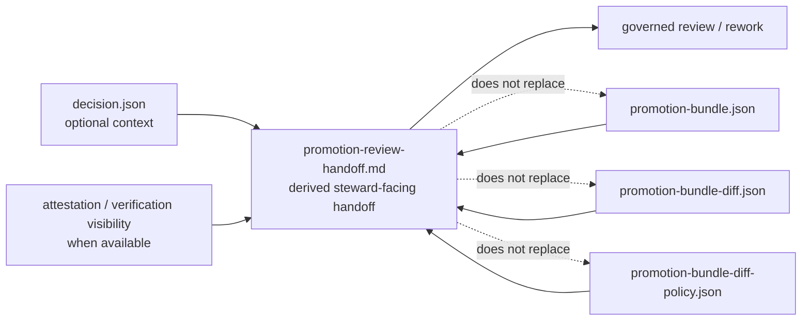

<!-- [KFM_META_BLOCK_V2]
doc_id: kfm://doc/TODO-NEEDS-UUID
title: Promotion Review Handoff
type: standard
version: v1
status: draft
owners: TODO-NEEDS-VERIFICATION
created: YYYY-MM-DD
updated: 2026-04-14
policy_label: TODO-NEEDS-VERIFICATION
related: [contracts/README.md, tools/validators/promotion_gate/README.md, tools/ci/README.md, .github/workflows/README.md, policy/README.md, schemas/README.md]
tags: [kfm, contracts, promotion, review, handoff]
notes: [Public main currently exposes this file path as an empty placeholder; this document defines the contract boundary for the derived steward-facing handoff surface rather than claiming mounted helper completeness. Exact owners, policy label, and live caller inventory still need branch-level verification.]
[/KFM_META_BLOCK_V2] -->

# Promotion Review Handoff

Contract note for the derived steward-facing review handoff surface used in governed promotion review.

> [!IMPORTANT]
> This file defines the **boundary and expectations** for a promotion review handoff. It does **not** turn the handoff into a new source of authority.
>
> In KFM terms, the handoff is a **derived reviewer convenience surface**. The underlying machine-significant objects still carry promotion truth.

---

## At a glance

| Question | Answer |
| --- | --- |
| What is it? | A composed Markdown handoff for steward/reviewer use during promotion review. |
| What does it summarize? | Promotion bundle state, prior/current drift, checked-in drift-policy interpretation, and trust visibility. |
| What is it **not**? | Not the release decision, not the bundle itself, not the diff engine, not policy authority. |
| Where should authority remain? | In the underlying trust objects and their governing policy / contract surfaces. |
| Why is it in `contracts/`? | To define the handoff’s **role, limits, required contents, and non-goals** without burying those rules inside renderer code or workflow YAML. |

---

## Scope

`contracts/promotion_review_handoff.md` defines the contract boundary for the **promotion review handoff** as a review artifact.

Use this contract when the job is to ensure that a reviewer-facing handoff document:

- is clearly subordinate to governed machine artifacts
- presents promotion review context in a stable, legible order
- preserves KFM’s **receipts vs proofs** doctrine
- keeps diff computation, policy evaluation, attestation verification, and release authority in their proper upstream lanes
- stays deterministic enough to be regenerated from the same declared inputs

Do **not** use this contract to:

- redefine promotion law
- create a new decision grammar
- replace `promotion-bundle.json`, `promotion-bundle-diff.json`, or `promotion-bundle-diff-policy.json`
- hide review-significant meaning inside workflow-only prose
- turn a convenience summary into sovereign truth

---

## Repo fit

| Direction | Surface | Why it matters |
| --- | --- | --- |
| Parent lane | [`README.md`](README.md) | `contracts/` is the lane for machine-facing boundaries, semantics, and compatibility rules. |
| Closest operational consumer | [`../tools/validators/promotion_gate/README.md`](../tools/validators/promotion_gate/README.md) | Documents the current promotion thin slice, trust chain, bundle drift, and reviewer-facing handoff role. |
| Closest renderer lane | [`../tools/ci/README.md`](../tools/ci/README.md) | Keeps CI rendering helpers separate from policy law and release authority. |
| Workflow boundary | [`../.github/workflows/README.md`](../.github/workflows/README.md) | Orchestration belongs in workflow YAML, not in this contract. |
| Policy boundary | [`../policy/README.md`](../policy/README.md) | Blocking classification and governance remain policy-owned. |
| Schema boundary | [`../schemas/README.md`](../schemas/README.md) | Canonical machine-checkable shapes should remain schema-led where applicable. |

---

## Naming split

One source of confusion in promotion review is the difference between the **contract note** and the **rendered artifact**.

| Surface | Meaning |
| --- | --- |
| `contracts/promotion_review_handoff.md` | This document. Defines the handoff’s role, limits, required contents, and review posture. |
| `promotion-review-handoff.md` | A derived rendered artifact produced during promotion review from already-governed machine outputs. |

> [!NOTE]
> Keep this distinction visible in code review, docs, and workflow output. The contract note defines the lane. The rendered handoff is one instance of that lane’s output.

---

## Authority boundary

The handoff exists to improve review ergonomics without collapsing trust surfaces.

### Trust-object split

| Surface | Role | Authority class |
| --- | --- | --- |
| `decision.json` | finite machine-readable promotion decision | governing machine object |
| `decision-sign-result.json` | signing outcome memory | receipt-like support object |
| `decision-verify-result.json` | verification outcome memory | receipt-like support object |
| `promotion-record.json` | compact governed ledger entry | release-significant machine object |
| `promotion-prov.json` | promotion provenance activity | release-significant machine object |
| `promotion-bundle.json` | manifest of the governed promotion artifact set | governing machine object |
| `promotion-bundle-diff.json` | deterministic prior/current comparison report | governing machine object |
| `promotion-bundle-diff-policy.json` | checked-in interpretation of changed keys | governing machine object |
| `promotion-review-handoff.md` | composed reviewer-facing handoff | derived convenience surface |

### Contract law

The review handoff:

1. **may summarize**
   - bundle identity
   - trust visibility
   - artifact inventory
   - prior/current diff summary
   - drift-policy status and key assessments
   - one concise reviewer conclusion block

2. **must not replace**
   - the bundle
   - the diff report
   - the diff-policy report
   - attestation verification records
   - promotion decision authority

3. **must not silently decide**
   - policy outcome
   - catalog closure
   - signature truth
   - promotion eligibility

---

## Required inputs

The handoff contract assumes **declared** upstream artifacts.

### Minimum direct inputs

| Input | Role | Required |
| --- | --- | --- |
| `promotion-bundle.json` | governed bundle identity and artifact inventory | yes |
| `promotion-bundle-diff.json` | prior/current drift surface | yes |
| `promotion-bundle-diff-policy.json` | checked-in interpretation of changed keys | yes |

### Conditional support inputs

| Input | Role | Required when |
| --- | --- | --- |
| attestation / verification visibility | trust visibility in the reviewer handoff | available and review-relevant |
| `decision.json` | finite promotion result | available and useful for reviewer context |
| `promotion-record.json` / `promotion-prov.json` | deeper audit or provenance links | needed by local workflow or audit surface |

### Input rules

1. Inputs should be **declared files**, not scraped logs.
2. The handoff should consume **already-produced** machine artifacts.
3. Missing required inputs should be treated as a **helper/input-contract problem**, not quietly flattened into success.
4. The renderer may compact or restate upstream status, but it must not invent absent upstream facts.
5. If attestation visibility is shown, it should be rendered as already-produced state rather than re-verified in the handoff step.

---

## Required handoff contents

A compliant promotion review handoff should contain these sections in substance, even if local wording evolves.

| Section | What it should show | Why it matters |
| --- | --- | --- |
| Candidate / bundle identity | promoted subject, bundle identity, key refs | keeps the review anchored to one governed subject |
| Trust visibility | attestation or verification visibility where available | makes trust state visible at the point of review |
| Artifact inventory | concise list or summary of bundle contents | prevents “review in the abstract” |
| Prior / current drift | compact summary of what changed | lets stewards see change scope without opening raw diff first |
| Drift-policy interpretation | blocking / review-required / assessed key classes | preserves policy interpretation as a separate visible layer |
| Reviewer conclusion block | one concise steward-facing synthesis | helps review without pretending to replace machine truth |

### Conclusion block rule

The conclusion block should be:

- short
- legible
- obviously derived
- consistent with upstream machine artifacts

It should **not** introduce new gate outcomes or hidden exceptions.

---

## Stable review sequence

When all current thin-slice promotion review artifacts are published together, keep this order stable:

1. `promotion-bundle-summary.md`
2. `promotion-bundle-diff-summary.md`
3. `promotion-bundle-diff-policy-summary.md`
4. `promotion-review-handoff.md`

### Why this order is preferred

- first the reviewer sees the governed bundle
- then the prior/current drift surface
- then the policy interpretation of that drift
- then the composed steward-facing handoff

This keeps the final handoff from being mistaken for the primary machine source.

---

## Determinism and failure semantics

### Determinism expectations

A compliant handoff renderer should:

- be read-only by default
- render from declared inputs
- preserve stable section order
- avoid embedding hidden environment-dependent meaning
- produce the same reviewer-facing structure from the same input set

### Failure semantics

| Condition | Expected behavior |
| --- | --- |
| missing required input | explicit error or clear failed render state |
| malformed upstream artifact | explicit error |
| upstream diff indicates blocking change | render the blocking state clearly; do not mask it |
| upstream policy requires review | render that review requirement clearly |
| helper/render bug | fail as a helper failure, not as a silent policy reinterpretation |

> [!WARNING]
> A renderer crash is not the same thing as a promotion denial. Keep helper failure semantics separate from gate or policy meaning.

---

## Exclusions

The following do **not** belong in the handoff contract itself.

| Excluded concern | Belongs here instead | Why |
| --- | --- | --- |
| diff computation | `tools/diff/` | comparison law should stay upstream and machine-checkable |
| policy classification logic | `policy/` and its checked-in evaluators | governance must not be hidden in prose rendering |
| attestation signing / verification | `tools/attest/` | trust operations are distinct from reviewer presentation |
| promotion decision authority | promotion gate contracts / schemas / validators | the handoff is downstream of decision authority |
| workflow sequencing | `.github/workflows/` | orchestration belongs at the workflow boundary |
| runtime publish / mutate actions | release / runtime lanes | a reviewer handoff should remain read-only |

---

## Diagram



---

## Illustrative output shape

<details>
<summary>Illustrative only — example handoff shape</summary>

```md
# Promotion Review Handoff

## Candidate

- Subject: `overlay:floodplain-kansas`
- Bundle: `promotion-bundle.json`
- Decision: `DENY`

## Trust Visibility

- Attestation verified: `True`

## Artifact Inventory

- `promotion-record.json`
- `promotion-prov.json`
- `promotion-bundle.json`

## Prior / Current Drift

- Diff status: `changed`
- Changed keys: `4`

## Drift Policy

- Policy status: `block`
- Review required: `True`

## Reviewer Conclusion

Current drift is release-significant and presently blocking. Review the checked-in drift-policy report before any further promotion action.
```

The exact wording may vary. The role should not.
</details>

---

## Review checklist

Use this checklist when creating or revising any implementation that emits a promotion review handoff.

- [ ] The handoff is clearly described as a **derived** review surface.
- [ ] The underlying machine artifacts remain individually visible and reviewable.
- [ ] Required inputs are declared explicitly.
- [ ] The handoff does not compute diff or policy meaning itself.
- [ ] Trust visibility is rendered from upstream state, not re-invented locally.
- [ ] The stable publication order is preserved when all review artifacts are emitted together.
- [ ] The conclusion block is concise and subordinate to machine authority.
- [ ] Helper failures remain distinct from promotion denials.
- [ ] No part of the handoff silently becomes the only place where promotion truth exists.

---

## Open verification items

| Item | Status |
| --- | --- |
| exact owner value for this contract | NEEDS VERIFICATION |
| final `policy_label` for this contract | NEEDS VERIFICATION |
| mounted helper inventory on the active branch | NEEDS VERIFICATION |
| exact schema locations for handoff-adjacent machine objects | NEEDS VERIFICATION |
| live workflow caller paths beyond README-level evidence | NEEDS VERIFICATION |

---

## Compatibility note

This contract is intentionally safe under two conditions:

1. when the renderer thin slice is fully mounted and called by current workflows
2. when some public snapshots still show inventory-light or README-first lane shapes

That restraint is deliberate. The contract should remain truthful even when branch visibility is incomplete.
