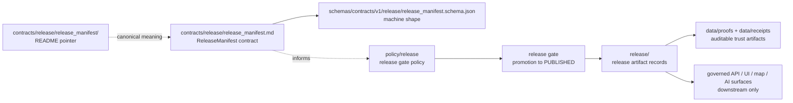

<!-- [KFM_META_BLOCK_V2]
doc_id: kfm://doc/contracts-release-release-manifest-readme
title: contracts/release/release_manifest — ReleaseManifest Object Folder README
type: readme
version: v0.1
status: draft; compatibility; object-folder-pointer; no-parallel-authority
owners: OWNER_TBD — Release steward · Contracts steward · Schema steward · Policy steward · Evidence steward · Rollback steward · Docs steward · Directory Rules reviewer
created: 2026-06-24
updated: 2026-06-24
policy_label: public; contracts; release; release-manifest; compatibility; object-folder; semantic-pointer; no-parallel-authority; release-gated; no-artifact-store
tags: [kfm, contracts, release, release-manifest, README, compatibility, pointer, schema-paired, release-gated, rollback-aware, no-parallel-authority]
related:
  - ../README.md
  - ../release_manifest.md
  - ../promotion_decision.md
  - ../rollback_card.md
  - ../withdrawal_notice.md
  - ../../correction/correction_notice.md
  - ../../../schemas/contracts/v1/release/release_manifest.schema.json
  - ../../../policy/release/
  - ../../../release/
  - ../../../docs/architecture/release-discipline.md
  - ../../../docs/standards/RELEASE_MANIFEST.md
  - ../../../fixtures/release/release_manifest/
  - ../../../tests/contracts/release/
notes:
  - "Compatibility/object-folder README for the requested `contracts/release/release_manifest/` path."
  - "The object-level semantic contract is `contracts/release/release_manifest.md`; this README must not duplicate or supersede it."
  - "The paired schema is currently a greenfield placeholder with only `id` required and `additionalProperties: true`."
  - "Use this folder only for object-specific notes, fixture indexes, migration notes, or backlink audits if maintainers accept the object-folder convention."
  - "This README does not create schema authority, release artifact authority, executable policy authority, runtime behavior, release approval, receipt/proof authority, public API behavior, UI behavior, or AI truth claims."
  - "Previous file content was a placeholder; rollback target is blob SHA `e25f1814e51579d5f55c0f1fe0135ddb28a47f4a`."
[/KFM_META_BLOCK_V2] -->

<a id="top"></a>

# contracts/release/release_manifest

> Object-folder pointer for `ReleaseManifest`. The canonical semantic contract is [`../release_manifest.md`](../release_manifest.md). This folder README exists to prevent the folder path from becoming a duplicate release-manifest authority or release artifact store.

<p>
  
  
  
  
  
  
</p>

**Status:** draft compatibility / object-folder pointer  
**Path:** `contracts/release/release_manifest/README.md`  
**Canonical object contract:** [`../release_manifest.md`](../release_manifest.md)  
**Paired schema:** `schemas/contracts/v1/release/release_manifest.schema.json`  
**Schema maturity:** PROPOSED / thin placeholder  
**Policy rule authority:** `policy/release/`, not this folder  
**Release artifact/process authority:** `release/`, not this folder  
**Truth posture:** CONFIRMED placeholder replaced · CONFIRMED canonical object contract exists · CONFIRMED paired schema exists and is permissive · PROPOSED folder convention until ADR/steward review accepts object folders under `contracts/release/`

## Quick jumps

[Scope](#scope) · [Repo fit](#repo-fit) · [Accepted contents](#accepted-contents) · [Exclusions](#exclusions) · [Object summary](#object-summary) · [Compatibility flow](#compatibility-flow) · [Validation checklist](#validation-checklist) · [Rollback](#rollback)

---

## Scope

`contracts/release/release_manifest/` is an object-folder compatibility path.

The canonical semantic contract remains:

```text
contracts/release/release_manifest.md
```

This README may help maintainers navigate object-specific material, but it must not become a second definition of `ReleaseManifest`. Any changes to object meaning belong in [`../release_manifest.md`](../release_manifest.md), with corresponding schema, fixture, policy, validator, release, and test updates where needed.

> [!IMPORTANT]
> Do not store release manifest instances, signed manifests, PMTiles/COG release artifacts, proof packs, receipts, or release outputs in this folder. Contracts explain meaning; release artifacts belong in governed release/proof/receipt homes.

---

## Repo fit

| Responsibility | Correct path | Relationship to this README |
|---|---|---|
| ReleaseManifest semantic meaning | [`../release_manifest.md`](../release_manifest.md) | Canonical object contract. |
| Release contract family README | [`../README.md`](../README.md) | Defines the release contract lane. |
| Promotion decision contract | [`../promotion_decision.md`](../promotion_decision.md) | Adjacent release-gate decision object. |
| Rollback card contract | [`../rollback_card.md`](../rollback_card.md) | Adjacent rollback object; currently scaffold-level. |
| Withdrawal notice contract | [`../withdrawal_notice.md`](../withdrawal_notice.md) | Adjacent withdrawal object; currently scaffold-level. |
| Correction notice contract | [`../../correction/correction_notice.md`](../../correction/correction_notice.md) | Adjacent correction family; placement seam remains NEEDS VERIFICATION. |
| Machine schema | `../../../schemas/contracts/v1/release/release_manifest.schema.json` | Shape authority. |
| Release policy | `../../../policy/release/` | Admissibility / gate authority. |
| Release artifacts/process | `../../../release/` | Publication process outputs and release records. |
| Fixtures | `../../../fixtures/release/release_manifest/` or accepted fixture home | Proposed/expected fixture home named by schema. |
| Tests | `../../../tests/contracts/release/` or release test roots | Enforceability. |
| Receipts/proofs | `../../../data/receipts/`, `../../../data/proofs/` or accepted roots | Auditable trust artifacts. |

---

## Accepted contents

Only conservative object-adjacent material belongs here while this folder convention remains PROPOSED:

| Accepted item | Purpose | Required posture |
|---|---|---|
| `README.md` | Pointer to the canonical object contract. | Accepted. |
| `MIGRATION.md` | Temporary notes if maintainers move from flat object contracts to object folders. | Temporary; must include rollback. |
| `BACKLINKS.md` | Temporary backlink audit for links pointing to folder vs flat file. | Temporary. |
| `FIXTURE_INDEX.md` | Optional index pointing to fixture roots without storing fixtures here. | Pointer only. |
| `VALIDATION_NOTES.md` | Optional validator/schema/test wiring notes. | Must not define schema or release policy. |

Future object-folder content requires steward/ADR acceptance if it changes the flat-file contract convention.

---

## Exclusions

| Do not put this here | Correct home | Reason |
|---|---|---|
| A second `ReleaseManifest` semantic contract | `../release_manifest.md` | Avoids duplicate authority. |
| JSON Schema | `../../../schemas/contracts/v1/release/release_manifest.schema.json` | Schemas own machine shape. |
| Release manifest JSON instances | `../../../release/` or accepted release artifact roots | Contracts do not store release records. |
| Signed manifests, PMTiles/COG artifacts, checksums, attestations | `../../../release/`, `../../../data/proofs/`, `../../../data/receipts/`, signing roots | Trust artifacts must remain separately auditable. |
| Rego/OPA/equivalent policy rules | `../../../policy/release/` | Policy owns admissibility. |
| Runtime release runners or CLIs | `../../../packages/`, `../../../tools/`, `../../../pipelines/` or accepted implementation roots | Execution is implementation, not contract meaning. |
| Fixtures | `../../../fixtures/release/release_manifest/` or accepted fixture root | Fixtures should not be hidden under contract docs. |
| Tests | `../../../tests/contracts/release/` or release test roots | Enforceability lives in tests. |
| Public API, UI, map, or AI output | `../../../apps/`, `../../../ui/`, `../../../web/`, governed runtime roots | Downstream consumers only. |

---

## Object summary

`ReleaseManifest` identifies a governed release artifact set at publication time and links it to a specific release identity, version, and spec lineage.

The current object contract states that `ReleaseManifest`:

- is PROPOSED;
- is schema-paired;
- currently has a thin/permissive schema;
- identifies a release id/version/spec hash claim;
- is expected at the release/publish handoff from CATALOG/TRIPLET into PUBLISHED;
- is not yet a full signed release attestation object under the current thin schema;
- needs follow-up hardening for signed manifests, layer manifests, rollback linkage, explicit fields, and stricter validation.

---

## Compatibility flow



---

## Validation checklist

- [ ] Links to the canonical object contract resolve.
- [ ] No duplicate object contract is introduced under this folder.
- [ ] Schema updates remain under `schemas/contracts/v1/release/`.
- [ ] Release policy updates remain under `policy/release/`.
- [ ] Release artifact records remain under `release/` or accepted release artifact homes.
- [ ] Fixtures and tests remain under accepted fixture/test homes.
- [ ] ReleaseManifest is not treated as proof closure by itself.
- [ ] ReleaseManifest is not treated as publication approval without policy, evidence, rights, review, correction, and rollback support.

---

## Rollback

Rollback is required if this folder is used to create a duplicate `ReleaseManifest` contract, store release artifacts, bypass schema/policy/test/release homes, treat a manifest as publication approval by itself, or host runtime/API/UI/AI behavior.

Rollback target for this replacement: previous placeholder blob SHA `e25f1814e51579d5f55c0f1fe0135ddb28a47f4a`.

<p align="right"><a href="#top">Back to top</a></p>
