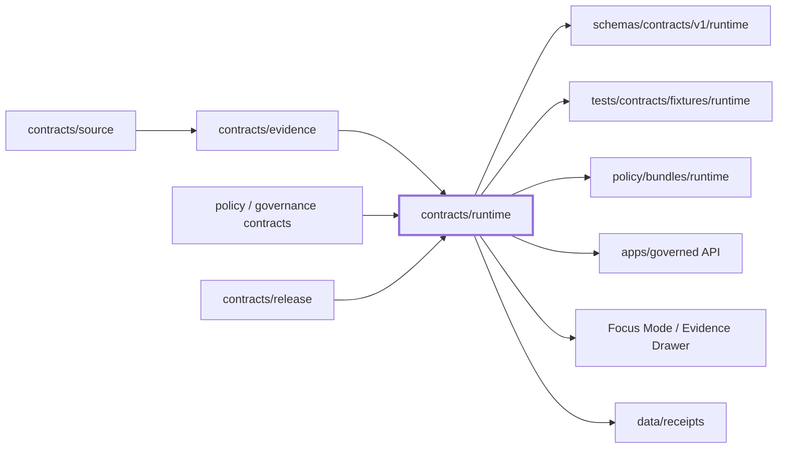
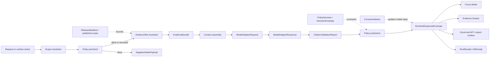

<!-- [KFM_META_BLOCK_V2]
doc_id: kfm://doc/TODO-VERIFY-UUID
title: Runtime Contracts
type: standard
version: v1
status: draft
owners: TODO(verify-owner)
created: TODO(verify-created-date)
updated: 2026-04-22
policy_label: TODO(verify-policy-label)
related: [../README.md, ../../README.md, ../../schemas/contracts/v1/runtime/README.md, ../../tests/contracts/fixtures/runtime/README.md, ../../policy/bundles/runtime/README.md, ../../data/receipts/README.md, ../../docs/architecture/governed-ai/README.md]
tags: [kfm, contracts, runtime, governed-ai, evidence, receipts]
notes: [doc_id owners created date and policy_label need repo confirmation, target repo was not mounted during authoring, neighboring links and schema-home authority need verification in the real checkout]
[/KFM_META_BLOCK_V2] -->

<a id="top"></a>

# Runtime Contracts

Runtime contract lane for KFM’s finite, evidence-bound outward responses, runtime receipts, and governed AI/API boundary obligations.


> [!IMPORTANT]
> **Status:** experimental  
> **Owners:** TODO(verify-owner)  
> **Path:** `contracts/runtime/README.md`  
> **Posture:** CONFIRMED doctrine / PROPOSED repo realization / UNKNOWN mounted implementation  
> **Quick jumps:** [Scope](#scope) · [Repo fit](#repo-fit) · [Inputs](#inputs) · [Exclusions](#exclusions) · [Directory tree](#directory-tree) · [Quickstart](#quickstart) · [Usage](#usage) · [Runtime flow](#runtime-flow) · [Contract inventory](#contract-inventory) · [Definition of done](#definition-of-done) · [FAQ](#faq)

---

## Scope

This directory is the human-readable contract home for runtime objects that sit at the KFM trust membrane.

Runtime contracts describe what may leave the governed API boundary after scope resolution, policy checks, EvidenceRef → EvidenceBundle resolution, citation validation, and audit linkage. They do **not** define canonical truth, source admission, release proof, or UI implementation by themselves.

| Area | Role in this lane | Truth label |
|---|---|---|
| Runtime response shape | Define the finite outward result envelope for API, Focus, export, and trust-visible surfaces. | CONFIRMED doctrine / PROPOSED file realization |
| Runtime receipts | Define contract expectations for `run_receipt` and `ai_receipt`; emitted records belong in receipt storage, not inside this README. | CONFIRMED doctrine / PROPOSED binding |
| Model-adapter boundary | Keep providers replaceable and subordinate to evidence, policy, and citation validation. | PROPOSED |
| Negative states | Make `ABSTAIN`, `DENY`, and `ERROR` first-class, reviewable outcomes rather than hidden failure paths. | CONFIRMED doctrine |
| Evidence and policy linkage | Require runtime outputs to carry evidence, decision, freshness, audit, and correction references where they affect meaning. | CONFIRMED doctrine / PROPOSED schema wave |

This lane exists because KFM’s public value is the inspectable claim, not a fluent answer, map tile, graph edge, or model response alone.

[Back to top](#top)

---

## Repo fit

> [!NOTE]
> Relative links below are written from `contracts/runtime/`. Because the real checkout was not mounted during this authoring pass, every neighbor target remains **NEEDS VERIFICATION** until checked in the repository.

| Relationship | Target | Why it matters | Verification status |
|---|---|---|---|
| Root orientation | [`../../README.md`](../../README.md) | Project-level purpose, status, and trust posture. | NEEDS VERIFICATION |
| Contracts index | [`../README.md`](../README.md) | Parent contract-family navigation. | NEEDS VERIFICATION |
| Runtime schemas | [`../../schemas/contracts/v1/runtime/README.md`](../../schemas/contracts/v1/runtime/README.md) | Machine-readable schema home for runtime objects if repo convention confirms this path. | NEEDS VERIFICATION |
| Runtime fixtures | [`../../tests/contracts/fixtures/runtime/README.md`](../../tests/contracts/fixtures/runtime/README.md) | Valid and invalid examples for schema and policy tests. | NEEDS VERIFICATION |
| Runtime policy bundle | [`../../policy/bundles/runtime/README.md`](../../policy/bundles/runtime/README.md) | Cite-or-abstain, no-direct-model-client, and fail-closed rules. | NEEDS VERIFICATION |
| Receipt storage | [`../../data/receipts/README.md`](../../data/receipts/README.md) | Emitted process memory for runtime and AI participation. | NEEDS VERIFICATION |
| Governed AI architecture | [`../../docs/architecture/governed-ai/README.md`](../../docs/architecture/governed-ai/README.md) | System-level explanation of model adapter, evidence resolver, citation validator, and Focus behavior. | NEEDS VERIFICATION |
| Governed API | `../../apps/governed-api/README.md` or `../../apps/governed_api/README.md` | Runtime contracts are consumed by API code, but app path spelling is unresolved. | NEEDS VERIFICATION |

### Upstream / downstream boundary



[Back to top](#top)

---

## Inputs

The following belong in or beside this lane when repo convention confirms the file homes.

| Accepted input | Belongs here when… | Example file |
|---|---|---|
| Narrative runtime contract pages | They define outward runtime object semantics for maintainers and reviewers. | `runtime_response_envelope.md` |
| Receipt contract pages | They define the shape and obligations for process-memory records. | `run_receipt.md`, `ai_receipt.md` |
| Adapter-boundary contract notes | They define provider-neutral request/response expectations without implementing a provider. | `model_adapter_request.md`, `model_adapter_response.md` |
| Citation validation report contract | It defines how citation checks are surfaced before runtime output is trusted. | `citation_validation_report.md` |
| Focus and negative-state payload contracts | They define how bounded synthesis and refusal states reach UI/API surfaces. | `focus_query_request.md`, `focus_query_response.md`, `negative_state_payload.md` |
| Cross-links to schemas and fixtures | They connect human docs to machine schemas and valid/invalid examples. | Links to `schemas/` and `tests/` |
| Runtime obligations | They document fields that affect meaning: evidence refs, policy decision, freshness, release scope, audit refs, correction lineage. | Contract tables in this lane |

[Back to top](#top)

---

## Exclusions

Runtime contracts are not a dumping ground for implementation, data, or release artifacts.

| Does not belong here | Goes instead | Reason |
|---|---|---|
| Raw source data, WORK files, quarantine objects, canonical stores | `data/raw/`, `data/work/`, `data/quarantine/`, `data/processed/` | Runtime outputs must not read or expose unpublished lifecycle states. |
| Emitted runtime receipts | `data/receipts/` | Receipts are process memory; this lane defines their contract shape. |
| Release proofs and signed bundles | `data/proofs/`, `release/`, `contracts/release/` | Proofs are release evidence, not runtime envelope docs. |
| Policy code | `policy/` | Runtime contract shape does not replace policy enforcement. |
| Model provider code | `packages/ai/adapters/` or repo-native equivalent | Providers must remain replaceable and behind the governed API. |
| Browser or UI components | `apps/web/` or repo-native equivalent | UI consumes runtime contracts but does not define them. |
| Credentials, model tokens, DB handles, local service endpoints | Secret manager / deployment config | Runtime docs must not expose operational secrets or internal handles. |
| Hidden chain-of-thought | Nowhere | KFM records audit and evidence, not private reasoning as a truth object. |

[Back to top](#top)

---

## Directory tree

PROPOSED starter shape. Verify against the real checkout before adding or moving files.

```text
contracts/runtime/
├── README.md
├── runtime_response_envelope.md
├── run_receipt.md
├── ai_receipt.md
├── model_adapter_request.md
├── model_adapter_response.md
├── citation_validation_report.md
├── focus_query_request.md
├── focus_query_response.md
└── negative_state_payload.md
```

Potential companion files that need an ADR before placement:

```text
contracts/runtime/
├── decision_envelope.md          # NEEDS VERIFICATION: may belong under contracts/governance/
├── policy_decision.md            # NEEDS VERIFICATION: may belong under contracts/governance/ or contracts/policy/
└── trust_state.md                # NEEDS VERIFICATION: may be shared by UI, policy, and runtime lanes
```

[Back to top](#top)

---

## Quickstart

These commands are **illustrative** until the repository’s actual package manager, validator entrypoints, and CI shape are verified.

```bash
# NEEDS VERIFICATION: adapt to repo-native validator entrypoints.
python tools/validators/validate_json_schema.py schemas/contracts/v1/runtime/*.schema.json

# NEEDS VERIFICATION: validate runtime examples.
python tools/validators/validate_runtime_envelope.py tests/contracts/fixtures/runtime/

# NEEDS VERIFICATION: policy tests should fail closed on unpublished evidence,
# unresolved citations, direct model calls, and missing policy decisions.
conftest test tests/policy/runtime/ --policy policy/bundles/runtime/
```

Minimum local review before opening a PR:

```bash
# Confirm the target file and neighboring docs exist.
find contracts/runtime -maxdepth 2 -type f | sort

# Confirm runtime contract objects are referenced by fixtures or tests.
find tests schemas policy -path '*runtime*' -type f | sort

# Search for accidental direct model-client or raw-path coupling.
grep -RInE '11434|/data/raw|/data/work|/data/quarantine|direct.*model|Ollama' apps packages tests policy contracts 2>/dev/null || true
```

[Back to top](#top)

---

## Usage

### Add or revise a runtime contract

1. Confirm the object belongs in `contracts/runtime/`.
2. Update the narrative contract page.
3. Update or add the machine schema under the confirmed schema home.
4. Add one valid fixture and at least one invalid fixture.
5. Add validator or policy test coverage.
6. Update this README and the parent contract index.
7. Record an ADR when file-home authority is ambiguous.
8. Keep runtime outputs bounded to published/released evidence and finite outcomes.

### Runtime result states

| Outcome | Meaning | Payload rule |
|---|---|---|
| `ANSWER` | Evidence, policy, citation, and scope checks passed. | Payload may appear with citations, audit ref, release/evidence refs, and freshness context. |
| `ABSTAIN` | The system should not answer because support, scope, freshness, or citation closure is insufficient. | No unsupported answer text; include reason codes and suggested safe narrowing when available. |
| `DENY` | Policy blocks the requested action or visibility. | Include policy decision reference, reason codes, and obligations that are safe to disclose. |
| `ERROR` | The runtime path could not complete safely. | Do not substitute a model answer; include safe error class and audit ref. |

> [!TIP]
> Negative states are not embarrassing edge cases. In KFM, a legible refusal is often the correct governed outcome.

[Back to top](#top)

---

## Runtime flow

PROPOSED runtime contract flow. This describes the intended boundary, not verified implementation.



Runtime contracts must preserve the following order of responsibility:

```text
scope → policy → evidence → context → adapter → citation validation → policy → envelope → receipts
```

Generated language is never the root truth source. EvidenceBundle and policy state outrank the runtime response.

[Back to top](#top)

---

## Contract inventory

| Contract object | Runtime role | Expected companion schema / fixture | Status |
|---|---|---|---|
| `RuntimeResponseEnvelope` | Finite outward API/UI answer shell. | `schemas/contracts/v1/runtime/runtime_response_envelope.schema.json`; answer/abstain/deny/error fixtures. | CONFIRMED doctrine / NEEDS VERIFICATION implementation |
| `RunReceipt` | Process-memory record for a runtime or pipeline execution. | `schemas/contracts/v1/runtime/run_receipt.schema.json`; valid/invalid receipt fixtures. | CONFIRMED doctrine / PROPOSED binding |
| `AIReceipt` | Reviewable trace that AI materially participated, without storing hidden chain-of-thought. | `schemas/contracts/v1/runtime/ai_receipt.schema.json`; model-assisted and abstain fixtures. | CONFIRMED doctrine / PROPOSED binding |
| `ModelAdapterRequest` | Provider-neutral request to a model adapter behind the governed API. | Request schema and no-direct-model-client tests. | PROPOSED |
| `ModelAdapterResponse` | Provider-neutral adapter response before citation validation and final policy postcheck. | Response schema and malformed-provider fixtures. | PROPOSED |
| `CitationValidationReport` | Machine-visible result of citation closure checks. | Valid/missing/dangling citation fixtures. | PROPOSED |
| `FocusQueryRequest` | Bounded synthesis request with explicit scope. | Focus request schema and policy-precheck fixtures. | PROPOSED |
| `FocusQueryResponse` | Focus-facing response that should normally wrap or reference `RuntimeResponseEnvelope`. | Focus response schema and finite-outcome fixtures. | PROPOSED |
| `NegativeStatePayload` | Reviewable refusal, denial, abstention, or safe error payload. | Negative-state schema and policy-deny/error fixtures. | PROPOSED |
| `DecisionEnvelope` / `PolicyDecision` | Decision result, reasons, obligations, and policy linkage. | Likely `contracts/governance/` or `contracts/policy/`; exact home requires ADR. | CONFIRMED doctrine / NEEDS VERIFICATION home |

[Back to top](#top)

---

## Boundary rules

| Runtime lane must do | Runtime lane must never do |
|---|---|
| Require finite outcomes: `ANSWER`, `ABSTAIN`, `DENY`, `ERROR`. | Emit vague success/failure strings as authoritative state. |
| Bind outward answers to evidence refs, release scope, citation checks, and audit refs. | Publish a fluent answer that cannot be reconstructed. |
| Treat model adapters as replaceable implementation detail. | Let clients call model runtimes directly. |
| Fail closed when policy, evidence, rights, sensitivity, or freshness is unresolved. | Smooth over missing support with generic language. |
| Link to receipts without making receipts the truth source. | Store emitted process memory inside contract docs. |
| Preserve correction and withdrawal visibility. | Silently disappear or overwrite corrected outputs. |
| Keep derived caches, tiles, vectors, summaries, and embeddings subordinate. | Treat rebuildable derivatives as sovereign truth. |

[Back to top](#top)

---

## Definition of done

A runtime contract change is not ready until these checks pass or are explicitly marked out of scope in the PR.

- [ ] Human contract page updated in `contracts/runtime/`.
- [ ] Machine schema updated under the verified schema home.
- [ ] At least one valid fixture and one invalid fixture added.
- [ ] Runtime validator or schema test covers the object.
- [ ] Policy test covers the unsafe case, not only the happy path.
- [ ] `ANSWER`, `ABSTAIN`, `DENY`, and `ERROR` remain finite and explicit.
- [ ] EvidenceRef → EvidenceBundle closure is required before consequential output.
- [ ] Citation validation failure cannot produce an `ANSWER`.
- [ ] Runtime output carries or links `audit_ref`, policy decision, freshness, and release/evidence refs where relevant.
- [ ] Direct browser/client model calls are denied or unreachable.
- [ ] RAW, WORK, QUARANTINE, and unpublished candidate paths are not runtime inputs.
- [ ] Receipts, proofs, catalogs, manifests, and correction notices remain separate object families.
- [ ] README links and parent indexes are updated.
- [ ] Rollback or deprecation path is recorded if schema shape changed.

[Back to top](#top)

---

## FAQ

### Is `RuntimeResponseEnvelope` the same as `EvidenceBundle`?

No. `EvidenceBundle` is the support package for inspecting a claim. `RuntimeResponseEnvelope` is the finite outward response shape that may reference evidence, policy, audit, freshness, and correction state.

### Can a model adapter return an `ANSWER` directly?

No. The adapter can return model output to the governed backend. The governed runtime still has to validate citations, apply policy postcheck, and emit the final envelope.

### Where do emitted `run_receipt` and `ai_receipt` records live?

The contract shape may be documented here, but emitted records should live in the repository’s receipt storage, expected to be `data/receipts/` unless repo convention proves otherwise.

### Should `DecisionEnvelope` live here?

NEEDS VERIFICATION. Earlier KFM materials place decision objects near runtime, governance, or policy depending on usage. Do not duplicate it. Confirm the canonical home through repo inspection or an ADR.

### What should happen if evidence is incomplete?

Return `ABSTAIN`, `DENY`, or `ERROR` as appropriate. Do not downgrade evidence failure into a plausible narrative answer.

[Back to top](#top)

---

## Appendix

<details>
<summary>Illustrative RuntimeResponseEnvelope sketch</summary>

This JSON is illustrative only. It is not a confirmed schema body.

```json
{
  "schema_version": "1.0.0",
  "request_id": "req_01H_RUNTIME_EXAMPLE",
  "outcome": "ABSTAIN",
  "surface": "focus",
  "scope": {
    "place_ref": "kfm://place/example",
    "time_basis": "as_of",
    "as_of": "2026-04-22"
  },
  "result": null,
  "reason_codes": [
    "EVIDENCE_BUNDLE_UNRESOLVED"
  ],
  "obligations": [
    "NARROW_SCOPE_OR_SELECT_RELEASED_EVIDENCE"
  ],
  "evidence_refs": [],
  "citations_check": {
    "status": "failed",
    "failure_count": 1
  },
  "policy": {
    "decision_ref": "kfm://decision/example",
    "disposition": "ABSTAIN"
  },
  "freshness": {
    "status": "unknown",
    "checked_at": "2026-04-22T00:00:00Z"
  },
  "audit_ref": "kfm://audit/example",
  "receipt_refs": [
    "kfm://receipt/run/example"
  ]
}
```

</details>

<details>
<summary>Review prompts for maintainers</summary>

- Does this contract make refusal and abstention inspectable?
- Can every `ANSWER` be reconstructed through EvidenceBundle, policy, and citation validation?
- Does the runtime lane avoid becoming a shadow policy engine?
- Are generated summaries visibly subordinate to evidence and release state?
- Are receipts process memory rather than proof or canonical truth?
- Would a public client be able to bypass the governed API by following this design?

</details>

[Back to top](#top)
