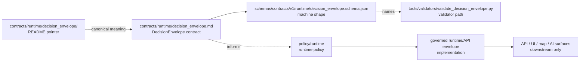

<!-- [KFM_META_BLOCK_V2]
doc_id: kfm://doc/contracts-runtime-decision-envelope-readme
title: contracts/runtime/decision_envelope — DecisionEnvelope Object Folder README
type: readme
version: v0.1
status: draft; compatibility; object-folder-pointer; no-parallel-authority
owners: OWNER_TBD — Runtime steward · Contracts steward · Schema steward · Policy steward · Evidence steward · API steward · Docs steward · Directory Rules reviewer
created: 2026-06-24
updated: 2026-06-24
policy_label: public; contracts; runtime; decision-envelope; compatibility; object-folder; semantic-pointer; no-parallel-authority; governed-runtime
tags: [kfm, contracts, runtime, decision-envelope, README, compatibility, pointer, schema-paired, policy-runtime, finite-outcomes, no-parallel-authority]
related:
  - ../README.md
  - ../decision_envelope.md
  - ../../policy/policy_decision.md
  - ../../../schemas/contracts/v1/runtime/decision_envelope.schema.json
  - ../../../policy/runtime/
  - ../../../fixtures/contracts/v1/runtime/decision_envelope/
  - ../../../tools/validators/validate_decision_envelope.py
  - ../../../docs/architecture/contract-schema-policy-split.md
notes:
  - "Compatibility/object-folder README for the requested `contracts/runtime/decision_envelope/` path."
  - "The object-level semantic contract is `contracts/runtime/decision_envelope.md`; this README must not duplicate or supersede it."
  - "The paired schema is verified at `schemas/contracts/v1/runtime/decision_envelope.schema.json`; schema status is PROPOSED."
  - "Use this folder only for object-specific notes, fixture indexes, migration notes, or backlink audits if maintainers accept the object-folder convention."
  - "This README does not create schema authority, executable runtime behavior, policy authority, API behavior, UI behavior, release approval, receipt/proof authority, or AI truth claims."
  - "Previous file was blank; rollback target is blob SHA `8b137891791fe96927ad78e64b0aad7bded08bdc`."
[/KFM_META_BLOCK_V2] -->

<a id="top"></a>

# contracts/runtime/decision_envelope

> Object-folder pointer for `DecisionEnvelope`. The canonical semantic contract is [`../decision_envelope.md`](../decision_envelope.md). This folder README exists to prevent the folder path from becoming a duplicate runtime-envelope contract, executable runtime surface, or API authority.

<p>
  
  
  
  
  
  
</p>

**Status:** draft compatibility / object-folder pointer  
**Path:** `contracts/runtime/decision_envelope/README.md`  
**Canonical object contract:** [`../decision_envelope.md`](../decision_envelope.md)  
**Paired schema:** `schemas/contracts/v1/runtime/decision_envelope.schema.json`  
**Schema status:** PROPOSED  
**Policy rule authority:** `policy/runtime/`, not this folder  
**Runtime/API authority:** implementation/API roots, not this folder  
**Truth posture:** CONFIRMED blank placeholder replaced · CONFIRMED canonical object contract exists · CONFIRMED paired schema exists with finite outcomes and closed additional properties · PROPOSED folder convention until ADR/steward review accepts object folders under `contracts/runtime/`

## Quick jumps

[Scope](#scope) · [Repo fit](#repo-fit) · [Accepted contents](#accepted-contents) · [Exclusions](#exclusions) · [Object summary](#object-summary) · [Schema-confirmed surface](#schema-confirmed-surface) · [Compatibility flow](#compatibility-flow) · [Validation checklist](#validation-checklist) · [Rollback](#rollback)

---

## Scope

`contracts/runtime/decision_envelope/` is an object-folder compatibility path.

The canonical semantic contract remains:

```text
contracts/runtime/decision_envelope.md
```

This README may help maintainers navigate object-specific material, but it must not become a second definition of `DecisionEnvelope`. Any changes to object meaning belong in [`../decision_envelope.md`](../decision_envelope.md), with corresponding schema, fixture, policy, validator, runtime, and test updates where needed.

> [!IMPORTANT]
> Do not store runtime payload instances, API response samples treated as truth, policy rules, code, logs, receipts, proofs, or AI outputs in this folder. Contracts explain meaning; runtime behavior and evidence-bearing artifacts belong in their governed homes.

---

## Repo fit

| Responsibility | Correct path | Relationship to this README |
|---|---|---|
| DecisionEnvelope semantic meaning | [`../decision_envelope.md`](../decision_envelope.md) | Canonical object contract. |
| Runtime contract family README | [`../README.md`](../README.md) | Defines the runtime contract lane. |
| PolicyDecision semantic contract | [`../../policy/policy_decision.md`](../../policy/policy_decision.md) | Adjacent policy outcome object; not the runtime envelope. |
| Machine schema | `../../../schemas/contracts/v1/runtime/decision_envelope.schema.json` | Shape authority. |
| Runtime policy | `../../../policy/runtime/` | Admissibility/rule authority. |
| Fixtures | `../../../fixtures/contracts/v1/runtime/decision_envelope/` | Schema/contract examples. |
| Validator | `../../../tools/validators/validate_decision_envelope.py` | Validation tool path named by schema; implementation/wiring NEEDS VERIFICATION. |
| Runtime/API behavior | accepted implementation/API roots | Execution/transport behavior; not this README. |
| Receipts/proofs/logs | accepted `data/receipts/`, `data/proofs/`, logs, or runtime artifact homes | Auditable evidence; not contract prose. |

---

## Accepted contents

Only conservative object-adjacent material belongs here while this folder convention remains PROPOSED:

| Accepted item | Purpose | Required posture |
|---|---|---|
| `README.md` | Pointer to the canonical object contract. | Accepted. |
| `MIGRATION.md` | Temporary notes if maintainers move from flat object contracts to object folders. | Temporary; must include rollback. |
| `BACKLINKS.md` | Temporary backlink audit for links pointing to folder vs flat file. | Pointer only. |
| `FIXTURE_INDEX.md` | Optional index pointing to fixture roots without storing fixtures here. | Pointer only. |
| `VALIDATION_NOTES.md` | Optional schema/validator/test wiring notes. | Must not define schema or runtime policy. |

Future object-folder content requires steward/ADR acceptance if it changes the flat-file contract convention.

---

## Exclusions

| Do not put this here | Correct home | Reason |
|---|---|---|
| A second `DecisionEnvelope` semantic contract | `../decision_envelope.md` | Avoids duplicate authority. |
| JSON Schema | `../../../schemas/contracts/v1/runtime/decision_envelope.schema.json` | Schemas own machine shape. |
| Runtime code or adapters | accepted runtime packages/apps/tools | Execution is implementation, not contract meaning. |
| Policy rules | `../../../policy/runtime/` | Policy owns admissibility. |
| Runtime payload instances | accepted runtime artifact/test fixture homes | Contracts do not store operational records. |
| Fixtures | `../../../fixtures/contracts/v1/runtime/decision_envelope/` | Fixtures should not be hidden under contract docs. |
| Tests | `../../../tests/` or accepted contract/runtime test roots | Enforceability lives in tests. |
| Receipts, proofs, logs | accepted receipt/proof/log homes | Audit artifacts remain separate. |
| Public API, UI, map, or AI behavior | governed runtime/API/UI roots | Downstream consumers only. |

---

## Object summary

`DecisionEnvelope` is a governed runtime envelope for finite runtime-facing outcomes. It carries a policy-evaluable decision payload with provenance-safe context, reasons, obligations, evidence refs, and evaluation timing.

It is distinct from:

- `PolicyDecision`, which records the policy-evaluation outcome object;
- `PromotionDecision`, which records release transition approval/denial/abstention;
- `ReleaseManifest`, which binds released artifact contents;
- public API/UI/AI responses, which are downstream render or transport surfaces.

---

## Schema-confirmed surface

The paired schema confirms:

| Field | Required | Schema-confirmed shape |
|---|---:|---|
| `decision_id` | yes | string matching `^[a-z][a-z0-9_:.-]*$` |
| `outcome` | yes | enum: `ANSWER`, `ABSTAIN`, `DENY`, `ERROR` |
| `policy_family` | yes | enum: `promotion`, `access`, `render`, `capability`, `consent`, `sensitivity` |
| `reasons` | yes | array of strings |
| `obligations` | yes | array of strings |
| `evaluated_at` | yes | date-time string |
| `id` | no | string |
| `decision` | no | enum: `ANSWER`, `ABSTAIN`, `DENY`, `ERROR` |
| `reason_code` | no | string |
| `evidence_refs` | no | array of strings |
| `spec_hash` | no | string |
| `version` | no | string |
| `issued_at` | no | date-time string |

The schema also confirms `additionalProperties: false`.

---

## Compatibility flow



---

## Validation checklist

- [ ] Links to the canonical object contract resolve.
- [ ] No duplicate `DecisionEnvelope` contract is introduced under this folder.
- [ ] Schema updates remain under `schemas/contracts/v1/runtime/`.
- [ ] Runtime policy updates remain under `policy/runtime/`.
- [ ] Runtime implementation and API behavior remain outside contract docs.
- [ ] Fixtures and tests remain under accepted fixture/test homes.
- [ ] `PolicyDecision` and `DecisionEnvelope` are kept distinct.
- [ ] Public surfaces cannot use this README as runtime permission or truth authority.

---

## Rollback

Rollback is required if this folder is used to create a duplicate `DecisionEnvelope` contract, store runtime instances, bypass schema/policy/test/runtime homes, claim executable behavior, or authorize public API/UI/map/AI exposure directly.

Rollback target for this replacement: previous blank blob SHA `8b137891791fe96927ad78e64b0aad7bded08bdc`.

<p align="right"><a href="#top">Back to top</a></p>
