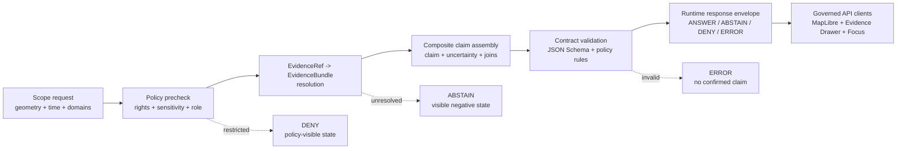

<!-- [KFM_META_BLOCK_V2]
doc_id: kfm://doc/<NEEDS_VERIFICATION_UUID>
title: Ecological Composite Claim Runtime Contract
type: standard
version: v1
status: draft
owners: @bartytime4life
created: <NEEDS_VERIFICATION_CREATED_DATE>
updated: 2026-04-24
policy_label: <NEEDS_VERIFICATION_POLICY_LABEL>
related: [
  contracts/runtime/ecological_composite_claim.md,
  schemas/contracts/v1/ecology/ecological_composite_claim.schema.json,
  schemas/contracts/v1/runtime/runtime_response_envelope.schema.json,
  schemas/contracts/v1/evidence/evidence_bundle.schema.json,
  data/registry/ecology/README.md,
  data/catalog/ecology/README.md,
  data/receipts/README.md,
  data/proofs/README.md,
  contracts/README.md,
  schemas/README.md
]
tags: [kfm, ecology, runtime, evidence, claims, schema, contract]
notes: [
  "PROPOSED runtime contract guide for ecological composite claims.",
  "Does not claim the schema file, validator, fixtures, API route, or CI gate exists yet.",
  "Designed to align with KFM cite-or-abstain, EvidenceBundle, Evidence Drawer, Focus Mode, runtime envelope, and renderer-boundary doctrine.",
  "doc_id, created date, policy label, exact schema path, and exact contract path require mounted-repo verification."
]
[/KFM_META_BLOCK_V2] -->

<a id="top"></a>

# Ecological Composite Claim Runtime Contract

A proposed runtime contract for evidence-resolved ecological claims that combine flora, fauna, habitat, soil, air, vegetation, land-cover, and hydrology evidence.

> [!NOTE]
> **Status:** `draft`  
> **Owners:** `@bartytime4life`  
> **Truth posture:** `PROPOSED` contract; `UNKNOWN` mounted implementation  
> **Suggested document path:** `contracts/runtime/ecological_composite_claim.md`  
> **Suggested schema path:** `schemas/contracts/v1/ecology/ecological_composite_claim.schema.json`  
> **Quick jumps:** [Purpose](#purpose) · [Repo fit](#repo-fit) · [Contract boundary](#contract-boundary) · [Runtime flow](#runtime-flow) · [Required behavior](#required-behavior) · [Contract shape](#contract-shape) · [Schema sketch](#schema-sketch) · [Examples](#examples) · [Validation rules](#validation-rules) · [Open verification](#open-verification)


---

## Purpose

Ecological composite claims are higher-risk than simple map layers because they synthesize multiple evidence families and can easily overstate what the evidence supports.

This contract defines the minimum runtime shape for bounded statements such as:

```text
Grassland degradation in watershed HUC12:<id> is associated with vegetation decline, soil moisture anomaly, and habitat fragmentation during <time_window>.
```

The contract exists so runtime consumers can inspect how a claim was allowed, withheld, denied, or routed to review. Its job is to preserve KFM’s evidence-first posture at the point where a user, API client, Evidence Drawer, Focus Mode response, export, or map popup might otherwise turn a derived layer into an unsupported assertion.

### Design goals

| Goal | Runtime consequence |
|---|---|
| Cite or abstain | Consequential claim text is shown only when evidence resolves. |
| Preserve negative outcomes | `no_change`, `insufficient_evidence`, `contradictory`, and policy-denied states remain visible. |
| Keep uncertainty visible | Analytical and modeled claims carry a declared uncertainty object. |
| Keep renderers subordinate | MapLibre and Cesium layer refs can help presentation, but cannot prove the claim. |
| Keep identity deterministic | Claims depending on transforms, queries, models, or layer specs carry a `spec_hash`. |
| Keep policy in the envelope | Sensitivity, rights, release, and review state travel with the claim response. |

[Back to top](#top)

---

## Repo fit

**PROPOSED target:** `contracts/runtime/ecological_composite_claim.md`

This is a **runtime response contract guide**, not a canonical storage schema and not an implementation claim.

| Neighboring surface | Expected relationship | Status |
|---|---|---|
| `schemas/contracts/v1/runtime/runtime_response_envelope.schema.json` | Parent envelope or sibling runtime contract for finite response outcomes. | NEEDS VERIFICATION |
| `schemas/contracts/v1/ecology/ecological_composite_claim.schema.json` | Machine-readable schema for this object, if the repo confirms this schema home. | PROPOSED |
| `schemas/contracts/v1/evidence/evidence_bundle.schema.json` | Evidence resolution object referenced by `evidence.items[].evidence_ref`. | NEEDS VERIFICATION |
| `data/registry/ecology/README.md` | Source-role and domain registry context for ecological inputs. | NEEDS VERIFICATION |
| `data/catalog/ecology/README.md` | Catalog closure context for DCAT, STAC, and PROV references. | NEEDS VERIFICATION |
| `data/receipts/` and `data/proofs/` | Receipts and proof objects referenced by ID, never embedded as raw process logs. | NEEDS VERIFICATION |

> [!IMPORTANT]
> The mounted repository was not available in this session. Paths above are deliberately marked `PROPOSED` or `NEEDS VERIFICATION` until direct repo evidence confirms directory conventions, schema authority, validators, fixtures, CI workflows, and API/UI homes.

[Back to top](#top)

---

## Contract boundary

This contract describes **runtime response content** for a bounded ecological claim. It does not define raw ingest, canonical storage, renderer implementation, or publication mechanics.

| Concern | Belongs here? | Notes |
|---|---:|---|
| Claim text | Yes | Runtime-facing, bounded statement or abstention message. |
| Evidence references | Yes | Must resolve to governed evidence before confirmed claim presentation. |
| Domain participation | Yes | Declares which evidence families were used. |
| Scope | Yes | Geometry and time window are required because ecological claims are spatial-temporal. |
| Uncertainty | Yes | Required for analytical, modeled, or association claims. |
| Policy/review state | Yes | Required so public and steward clients know whether the claim can be shown. |
| Map layer references | Yes | Presentation references only. They do not prove the claim. |
| Raw source payloads | No | Belong under the raw/work/quarantine lifecycle, not runtime responses. |
| Processed artifacts | No | Referenced by catalog/proof IDs; not embedded here. |
| Receipts | Reference only | Stored in `data/receipts/` or repo-confirmed equivalent. |
| Proofs | Reference only | Stored in `data/proofs/` or repo-confirmed equivalent. |
| DCAT/STAC/PROV records | Reference only | Stored in `data/catalog/` or repo-confirmed equivalent. |
| Renderer code | No | Belongs in app/UI/package surfaces. |

### Accepted inputs

This contract may reference released or reviewable evidence from ecology-adjacent domains:

- flora, fauna, and habitat observations or derived products;
- soil, hydrology, air, vegetation, and land-cover evidence;
- cataloged processed artifacts with provenance and quality metadata;
- proof and receipt references emitted by validators, promotion gates, or review workflows.

### Exclusions

This contract must not carry:

- raw records, unreviewed source payloads, or unpublished candidate observations;
- precise sensitive species locations unless policy and release state explicitly allow the public-safe representation;
- model output without evidence references, uncertainty, and policy state;
- UI-only layer IDs as substitutes for evidence.

[Back to top](#top)

---

## Runtime flow

The ecological composite claim sits after evidence resolution and policy checks. It is not the source of truth; it is the runtime-facing contract that lets clients display, abstain, deny, or route the claim to review.



[Back to top](#top)

---

## Required behavior

Runtime consumers must treat this object as an **evidence contract**, not as a free-form explanation.

| Rule | Requirement |
|---|---|
| Cite or abstain | If `evidence.status != "resolved"`, consequential `claim_text` must not be presented as confirmed. |
| Multi-domain burden | `composite_ecological_claim` requires at least two independent domains unless explicitly represented as `single_domain_ecological_claim`. |
| Uncertainty visible | `uncertainty` is required for all analytical, modeled, anomaly, trend, or association claims. |
| Negative outcomes visible | `finding = "no_change"`, `finding = "insufficient_evidence"`, and `finding = "contradictory"` are valid outputs, not failures to hide. |
| Renderer subordinate | `rendering.layer_refs` cannot substitute for `evidence.items[].evidence_ref`. |
| Deterministic identity | `join_keys.spec_hash` is required when the claim depends on a declared transform, query, model, or layer specification. |
| Policy state carried | Public, steward, and Focus clients must receive policy/review state rather than infer it from a map layer. |
| Focus bounded | Focus Mode may summarize or explain only the same evidence-bounded object; it must not expand scope silently. |
| Sensitive precision guarded | Exact or high-risk ecological locations require policy approval, public-safe transforms, or denial. |

[Back to top](#top)

---

## Contract shape

### Minimum required fields

| Field | Meaning | Notes |
|---|---|---|
| `claim_id` | Stable runtime claim identifier. | Deterministic where practical. |
| `claim_type` | Composite or single-domain ecological claim. | Controls validation burden. |
| `status` | Runtime claim state. | Includes abstained, denied, review, and deprecated states. |
| `finding` | Analytical outcome. | Negative and inconclusive outcomes are first-class. |
| `claim_text` | Bounded runtime text. | Must be abstention/denial text when evidence or policy blocks confirmation. |
| `scope` | Geometry and time window. | Required for all ecological claims. |
| `domains` | Evidence families used. | Composite claims require `minItems >= 2`. |
| `evidence` | Evidence resolution state and references. | Must point to governed evidence. |
| `uncertainty` | Declared uncertainty and limitations. | Required for analytical/model claims. |
| `policy` | Release, rights, sensitivity, and review state. | Required for public/steward safety. |
| `runtime_behavior` | Client handling decision. | Determines cite, abstain, deny, review, or error behavior. |

### Optional supporting fields

| Field | Use |
|---|---|
| `join_keys` | Deterministic joins across taxon, observation, geometry, time, watershed, station, layer, or transform specs. |
| `rendering` | MapLibre/Cesium presentation references and 3D justification. |
| `lineage` | Correction, supersession, rollback, or deprecation references. |

[Back to top](#top)

---

## Schema sketch

> [!CAUTION]
> This is a **schema sketch**, not a confirmed machine schema file. Convert it into the repo’s canonical schema home only after the schema-home authority is verified.

<details>
<summary>Draft JSON Schema sketch</summary>

```json
{
  "$schema": "https://json-schema.org/draft/2020-12/schema",
  "$id": "kfm://schema/contracts/v1/ecology/ecological_composite_claim.schema.json",
  "title": "KFM Ecological Composite Claim",
  "type": "object",
  "additionalProperties": false,
  "required": [
    "claim_id",
    "claim_type",
    "status",
    "finding",
    "claim_text",
    "scope",
    "domains",
    "evidence",
    "uncertainty",
    "policy",
    "runtime_behavior"
  ],
  "properties": {
    "claim_id": {
      "type": "string",
      "pattern": "^kfm\\.claim\\.ecology\\.[a-z0-9_.-]+$"
    },
    "claim_type": {
      "type": "string",
      "enum": [
        "composite_ecological_claim",
        "single_domain_ecological_claim"
      ]
    },
    "status": {
      "type": "string",
      "enum": [
        "resolved",
        "partial",
        "abstained",
        "denied",
        "review_required",
        "quarantined",
        "deprecated"
      ]
    },
    "finding": {
      "type": "string",
      "enum": [
        "increase",
        "decrease",
        "change_detected",
        "no_change",
        "association_detected",
        "no_association_detected",
        "contradictory",
        "insufficient_evidence",
        "policy_denied",
        "not_assessed"
      ]
    },
    "claim_text": {
      "type": "string",
      "minLength": 1
    },
    "scope": {
      "type": "object",
      "additionalProperties": false,
      "required": ["geometry_ref", "time_window"],
      "properties": {
        "geometry_ref": { "type": "string", "minLength": 1 },
        "geometry_type": {
          "type": "string",
          "enum": [
            "county",
            "grid",
            "hex",
            "huc12",
            "reach",
            "station_buffer",
            "custom"
          ]
        },
        "time_window": {
          "type": "object",
          "additionalProperties": false,
          "required": ["start", "end"],
          "properties": {
            "start": { "type": "string", "format": "date-time" },
            "end": { "type": "string", "format": "date-time" },
            "bucket": {
              "type": "string",
              "enum": ["daily", "monthly", "seasonal", "annual", "multi_year", "event"]
            }
          }
        }
      }
    },
    "domains": {
      "type": "array",
      "minItems": 1,
      "uniqueItems": true,
      "items": {
        "type": "string",
        "enum": [
          "flora",
          "fauna",
          "habitat",
          "soil",
          "air",
          "vegetation",
          "landcover",
          "hydrology"
        ]
      }
    },
    "join_keys": {
      "type": "object",
      "additionalProperties": false,
      "properties": {
        "taxon_id": { "type": "string" },
        "obs_id": { "type": "string" },
        "geom_id": { "type": "string" },
        "time_bucket": { "type": "string" },
        "soil_id": { "type": "string" },
        "landcover_class": { "type": "string" },
        "watershed_id": { "type": "string" },
        "reach_id": { "type": "string" },
        "station_id": { "type": "string" },
        "layer_id": { "type": "string" },
        "spec_hash": {
          "type": "string",
          "pattern": "^[a-f0-9]{64}$"
        }
      }
    },
    "evidence": {
      "type": "object",
      "additionalProperties": false,
      "required": ["status", "items"],
      "properties": {
        "status": {
          "type": "string",
          "enum": ["resolved", "partial", "missing", "conflicting"]
        },
        "items": {
          "type": "array",
          "minItems": 1,
          "items": {
            "type": "object",
            "additionalProperties": false,
            "required": ["domain", "evidence_ref", "catalog_refs"],
            "properties": {
              "domain": { "type": "string" },
              "evidence_ref": { "type": "string", "minLength": 1 },
              "catalog_refs": {
                "type": "object",
                "additionalProperties": false,
                "properties": {
                  "dcat": { "type": "string" },
                  "stac": { "type": "string" },
                  "prov": { "type": "string" }
                }
              },
              "receipt_refs": {
                "type": "array",
                "items": { "type": "string" }
              },
              "proof_refs": {
                "type": "array",
                "items": { "type": "string" }
              },
              "quality": {
                "type": "object",
                "additionalProperties": false,
                "properties": {
                  "spatial_precision": { "type": "string" },
                  "temporal_precision": { "type": "string" },
                  "confidence": { "type": "number", "minimum": 0, "maximum": 1 }
                }
              }
            }
          }
        }
      }
    },
    "uncertainty": {
      "type": "object",
      "additionalProperties": false,
      "required": ["status", "summary"],
      "properties": {
        "status": {
          "type": "string",
          "enum": ["declared", "not_applicable", "missing"]
        },
        "summary": { "type": "string", "minLength": 1 },
        "method": { "type": "string" },
        "confidence": { "type": "number", "minimum": 0, "maximum": 1 },
        "limitations": {
          "type": "array",
          "items": { "type": "string" }
        }
      }
    },
    "policy": {
      "type": "object",
      "additionalProperties": false,
      "required": ["release_state", "sensitivity", "rights", "review_state"],
      "properties": {
        "release_state": {
          "type": "string",
          "enum": ["public_allowed", "restricted", "withheld", "review_required", "unknown"]
        },
        "sensitivity": {
          "type": "string",
          "enum": ["public", "generalized", "restricted", "sensitive", "unknown"]
        },
        "rights": {
          "type": "string",
          "enum": ["cleared", "restricted", "unknown"]
        },
        "review_state": {
          "type": "string",
          "enum": ["not_required", "pending", "approved", "rejected", "unknown"]
        },
        "obligations": {
          "type": "array",
          "items": { "type": "string" }
        },
        "redaction_refs": {
          "type": "array",
          "items": { "type": "string" }
        }
      }
    },
    "rendering": {
      "type": "object",
      "additionalProperties": false,
      "properties": {
        "default_renderer": {
          "type": "string",
          "enum": ["maplibre", "cesium", "none"]
        },
        "layer_refs": {
          "type": "array",
          "items": { "type": "string" }
        },
        "cesium_justification": { "type": "string" }
      }
    },
    "lineage": {
      "type": "object",
      "additionalProperties": false,
      "properties": {
        "supersedes": { "type": "string" },
        "correction_ref": { "type": "string" },
        "rollback_ref": { "type": "string" }
      }
    },
    "runtime_behavior": {
      "type": "object",
      "additionalProperties": false,
      "required": ["decision", "runtime_outcome", "evidence_drawer_required"],
      "properties": {
        "decision": {
          "type": "string",
          "enum": ["cite", "abstain", "deny", "review_required", "error"]
        },
        "runtime_outcome": {
          "type": "string",
          "enum": ["ANSWER", "ABSTAIN", "DENY", "ERROR"]
        },
        "evidence_drawer_required": {
          "type": "boolean",
          "const": true
        },
        "focus_allowed": { "type": "boolean" },
        "public_message": { "type": "string" },
        "review_message": { "type": "string" }
      }
    }
  }
}
```

</details>

[Back to top](#top)

---

## Examples

> [!NOTE]
> Examples are illustrative. They demonstrate contract behavior and do not assert that the referenced HUC, layers, receipts, catalog records, or evidence objects exist in the repository.

### Resolved composite claim

```json
{
  "claim_id": "kfm.claim.ecology.grassland_degradation.huc12_102600080305.2024",
  "claim_type": "composite_ecological_claim",
  "status": "resolved",
  "finding": "association_detected",
  "claim_text": "Grassland vegetation decline in HUC12:102600080305 is associated with a soil moisture anomaly during the 2024 growing-season window.",
  "scope": {
    "geometry_ref": "HUC12:102600080305",
    "geometry_type": "huc12",
    "time_window": {
      "start": "2024-04-01T00:00:00Z",
      "end": "2024-10-31T23:59:59Z",
      "bucket": "seasonal"
    }
  },
  "domains": ["vegetation", "soil", "hydrology"],
  "join_keys": {
    "geom_id": "HUC12:102600080305",
    "time_bucket": "2024_growing_season",
    "watershed_id": "102600080305",
    "spec_hash": "aaaaaaaaaaaaaaaaaaaaaaaaaaaaaaaaaaaaaaaaaaaaaaaaaaaaaaaaaaaaaaaa"
  },
  "evidence": {
    "status": "resolved",
    "items": [
      {
        "domain": "vegetation",
        "evidence_ref": "kfm:evidence:vegetation:ndvi_change:2024",
        "catalog_refs": {
          "stac": "kfm:stac:item:vegetation:ndvi_change:2024",
          "prov": "kfm:prov:entity:processed:ndvi_change:2024"
        },
        "receipt_refs": ["kfm:receipt:vegetation:ndvi_change:validation:2024"],
        "proof_refs": ["kfm:proof:vegetation:ndvi_change:catalog_closure:2024"],
        "quality": {
          "spatial_precision": "raster_cell",
          "temporal_precision": "seasonal",
          "confidence": 0.78
        }
      },
      {
        "domain": "soil",
        "evidence_ref": "kfm:evidence:soil:moisture_anomaly:2024",
        "catalog_refs": {
          "dcat": "kfm:dcat:dataset:soil_moisture",
          "prov": "kfm:prov:entity:processed:soil_moisture:2024"
        },
        "receipt_refs": ["kfm:receipt:soil_moisture:validation:2024"],
        "quality": {
          "spatial_precision": "station_interpolated",
          "temporal_precision": "daily_to_seasonal",
          "confidence": 0.72
        }
      }
    ]
  },
  "uncertainty": {
    "status": "declared",
    "summary": "Association claim only; not a causal claim.",
    "method": "domain agreement and seasonal anomaly comparison",
    "confidence": 0.74,
    "limitations": [
      "Station density may vary by region.",
      "Vegetation signal may reflect land management as well as moisture stress."
    ]
  },
  "policy": {
    "release_state": "public_allowed",
    "sensitivity": "public",
    "rights": "cleared",
    "review_state": "approved",
    "obligations": ["Show uncertainty summary with public claim."]
  },
  "rendering": {
    "default_renderer": "maplibre",
    "layer_refs": [
      "kfm.ecology.vegetation.ndvi_change.v1",
      "kfm.ecology.soil.moisture_anomaly.v1"
    ]
  },
  "runtime_behavior": {
    "decision": "cite",
    "runtime_outcome": "ANSWER",
    "evidence_drawer_required": true,
    "focus_allowed": true,
    "public_message": "Evidence is available for inspection."
  }
}
```

### Abstained claim

```json
{
  "claim_id": "kfm.claim.ecology.habitat_decline.example",
  "claim_type": "composite_ecological_claim",
  "status": "abstained",
  "finding": "insufficient_evidence",
  "claim_text": "KFM abstained from presenting the habitat decline claim because the required evidence did not resolve.",
  "scope": {
    "geometry_ref": "HUC12:<id>",
    "geometry_type": "huc12",
    "time_window": {
      "start": "2024-01-01T00:00:00Z",
      "end": "2024-12-31T23:59:59Z",
      "bucket": "annual"
    }
  },
  "domains": ["habitat", "fauna"],
  "evidence": {
    "status": "missing",
    "items": [
      {
        "domain": "fauna",
        "evidence_ref": "kfm:evidence:missing",
        "catalog_refs": {}
      }
    ]
  },
  "uncertainty": {
    "status": "missing",
    "summary": "Required fauna observation evidence did not resolve."
  },
  "policy": {
    "release_state": "review_required",
    "sensitivity": "unknown",
    "rights": "unknown",
    "review_state": "pending"
  },
  "runtime_behavior": {
    "decision": "abstain",
    "runtime_outcome": "ABSTAIN",
    "evidence_drawer_required": true,
    "focus_allowed": false,
    "public_message": "KFM cannot support this ecological claim with the available evidence."
  }
}
```

### Policy-denied claim

```json
{
  "claim_id": "kfm.claim.ecology.sensitive_species_location.example",
  "claim_type": "single_domain_ecological_claim",
  "status": "denied",
  "finding": "policy_denied",
  "claim_text": "KFM denied public presentation of this ecological claim because the requested location precision is restricted.",
  "scope": {
    "geometry_ref": "kfm:geometry:redacted",
    "geometry_type": "custom",
    "time_window": {
      "start": "2024-05-01T00:00:00Z",
      "end": "2024-05-31T23:59:59Z",
      "bucket": "monthly"
    }
  },
  "domains": ["flora"],
  "evidence": {
    "status": "resolved",
    "items": [
      {
        "domain": "flora",
        "evidence_ref": "kfm:evidence:flora:restricted:example",
        "catalog_refs": {}
      }
    ]
  },
  "uncertainty": {
    "status": "not_applicable",
    "summary": "Claim presentation was denied by policy before analytical uncertainty was evaluated."
  },
  "policy": {
    "release_state": "withheld",
    "sensitivity": "sensitive",
    "rights": "restricted",
    "review_state": "pending",
    "obligations": ["Do not expose exact coordinates in public runtime responses."],
    "redaction_refs": ["kfm:receipt:redaction:flora:example"]
  },
  "runtime_behavior": {
    "decision": "deny",
    "runtime_outcome": "DENY",
    "evidence_drawer_required": true,
    "focus_allowed": false,
    "public_message": "This claim cannot be shown at the requested precision."
  }
}
```

[Back to top](#top)

---

## Validation rules

| Rule | Validation |
|---|---|
| Composite claims need multiple domains | `claim_type = "composite_ecological_claim"` requires `domains.length >= 2`. |
| Evidence must resolve to cite | `runtime_behavior.decision = "cite"` requires `evidence.status = "resolved"`. |
| Cite requires public-safe policy | `decision = "cite"` requires `policy.release_state = "public_allowed"` or a confirmed steward-only channel. |
| Abstention must be visible | `status = "abstained"` requires `finding = "insufficient_evidence"` or `finding = "contradictory"`. |
| Denial must be explicit | `status = "denied"` requires `finding = "policy_denied"` and `runtime_behavior.runtime_outcome = "DENY"`. |
| Evidence Drawer required | `evidence_drawer_required` must be `true`. |
| Renderer cannot prove claim | `rendering.layer_refs` cannot replace `evidence.items`. |
| Spec hash required for transforms | Analytical, modeled, joined, or layer-derived claims require `join_keys.spec_hash`. |
| Uncertainty required | `uncertainty.status` cannot be omitted. |
| Proof required for release-significant claims | Public release or steward-significant claims require at least one `proof_refs[]` or a documented exception. |
| Sensitive locations fail closed | `policy.sensitivity = "sensitive"` or `"unknown"` cannot produce public exact geometry. |
| Runtime outcomes finite | Client-facing result must resolve to `ANSWER`, `ABSTAIN`, `DENY`, or `ERROR`. |

### Validation gates to add when implementation exists

- [ ] Schema fixture: valid resolved composite claim passes.
- [ ] Schema fixture: single-domain claim with one domain passes only as `single_domain_ecological_claim`.
- [ ] Negative fixture: composite claim with one domain fails.
- [ ] Negative fixture: cite decision with missing evidence fails.
- [ ] Negative fixture: public exact sensitive location fails.
- [ ] Policy fixture: denied claim emits `DENY` and public-safe message.
- [ ] UI fixture: Evidence Drawer payload can render claim, evidence, policy, uncertainty, and negative state.
- [ ] Focus fixture: Focus response cannot expand beyond claim scope without a governed scope change.
- [ ] Catalog fixture: DCAT/STAC/PROV refs resolve or the claim abstains.
- [ ] CI fixture: schema, policy, and catalog closure failures block public release.

[Back to top](#top)

---

## Open verification

| Item | Status | Why it matters |
|---|---|---|
| Exact document path | NEEDS VERIFICATION | The uploaded draft suggests `contracts/runtime/ecological_composite_claim.md`, but no repo tree was mounted. |
| Exact schema path | NEEDS VERIFICATION | `schemas/contracts/v1/ecology/` is proposed, not confirmed. |
| Whether `contracts/`, `schemas/`, or both own machine schemas | NEEDS VERIFICATION | Avoids duplicate authority and drift. |
| Existing runtime envelope schema name and fields | NEEDS VERIFICATION | This contract should align with the actual runtime response envelope. |
| EvidenceBundle object name and schema | NEEDS VERIFICATION | `evidence_ref` should resolve to the repo-confirmed EvidenceBundle contract. |
| Policy object shape | NEEDS VERIFICATION | This draft adds policy state to avoid unsafe public output, but exact policy schema may already exist. |
| Validator implementation path | NEEDS VERIFICATION | Could live under `tools/validators/`, package tests, or another repo-native home. |
| Fixture naming convention | NEEDS VERIFICATION | Prevents orphaned examples and duplicate fixture naming. |
| CI enforcement | NEEDS VERIFICATION | This document proposes gates but does not claim enforcement. |
| Domain registry entries | NEEDS VERIFICATION | Flora/fauna/habitat/soil/air/vegetation/landcover/hydrology names should match canonical domain registry terms. |

[Back to top](#top)

---

## Reviewer checklist

Use this before turning the guide into a machine schema or implementation PR.

- [ ] Confirm canonical doc path and update the meta block.
- [ ] Replace placeholder `doc_id`, `created`, and `policy_label` with verified values.
- [ ] Confirm schema-home authority through existing repo conventions or an ADR.
- [ ] Align `policy`, `runtime_behavior`, and `evidence` fields with existing shared contracts.
- [ ] Add valid and invalid fixtures next to the repo’s schema test suite.
- [ ] Confirm that public clients consume only governed runtime responses.
- [ ] Confirm Evidence Drawer behavior for `ANSWER`, `ABSTAIN`, `DENY`, and `ERROR` states.
- [ ] Confirm Focus Mode cannot bypass evidence, policy, review, or release state.
- [ ] Confirm renderer layer refs are presentation-only.
- [ ] Confirm sensitive ecological location policy fails closed.

[Back to top](#top)
