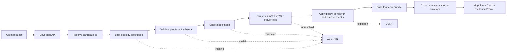

<!-- [KFM_META_BLOCK_V2]
doc_id: kfm://doc/<NEEDS_VERIFICATION_UUID>
title: Ecology EvidenceBundle Integration
type: standard
version: v1
status: draft
owners: @bartytime4life
created: <NEEDS_VERIFICATION_CREATED_DATE>
updated: 2026-04-24
policy_label: <NEEDS_VERIFICATION_POLICY_LABEL>
related: [
  "../../schemas/contracts/v1/runtime/runtime_response_envelope.schema.json",
  "../../schemas/ecology/ecology_proof_pack.schema.json",
  "../../data/proofs/ecology/README.md",
  "../../data/catalog/ecology/README.md",
  "../../tools/proofs/ecology_proof_pack_builder.py",
  "../../tools/validators/promotion_gate/ecology_manifest.py"
]
tags: [kfm, ecology, runtime, evidencebundle, proof-pack, api]
notes: [
  "Defines how ecology proof packs are exposed through runtime EvidenceBundle.",
  "Does not claim runtime implementation exists.",
  "Aligns with KFM cite-or-abstain doctrine.",
  "doc_id, created date, policy label, owner authority, and related path depth need repository verification."
]
[/KFM_META_BLOCK_V2] -->

<a id="top"></a>

# Ecology EvidenceBundle Integration

Defines the proposed runtime contract that turns completed ecology proof packs into resolvable, policy-aware `EvidenceBundle` objects for governed API, MapLibre, Focus Mode, and Evidence Drawer surfaces.

| Field | Value |
|---|---|
| Suggested path | `contracts/runtime/ecology_evidencebundle.md` |
| Status | `draft` |
| Truth posture | `PROPOSED` |
| Runtime implementation | `UNKNOWN` — this document does not assert that the resolver, schema, route, UI binding, or CI gate exists |
| Governing rule | No ecology claim is cited or rendered unless its proof pack resolves successfully |

**Quick jumps:** [Scope](#scope-and-repo-fit) · [Runtime invariant](#runtime-invariant) · [Flow](#resolution-flow) · [Contract](#runtime-contract) · [Failure rules](#fail-closed-rules) · [API/UI integration](#api-and-ui-integration) · [Validation](#validation-plan) · [Definition of done](#definition-of-done) · [Open verification](#open-verification)

> [!IMPORTANT]
> This is a **standard contract document**, not a README and not an implementation receipt. It defines the runtime-facing shape and behavior KFM should enforce once the ecology proof-pack resolver is implemented.

---

## Scope and repo fit

This document sits at the boundary between completed ecology proof work and public/runtime presentation.

```text
proof pack → runtime EvidenceBundle → governed API → client surface
```

| Boundary | Role |
|---|---|
| Upstream | Ecology proof-pack generation and validation. |
| This document | Runtime mapping from `data/proofs/ecology/<candidate_id>.proof_pack.json` to an `EvidenceBundle`. |
| Downstream | Runtime response envelopes, MapLibre layers, Evidence Drawer, Focus Mode, exports, and any claim-bearing API response. |

### Accepted inputs

Inputs belong here only when they are already proof-pack artifacts or references needed to resolve those artifacts.

- `data/proofs/ecology/<candidate_id>.proof_pack.json`
- proof-pack `status`, `spec_hash`, receipts, catalog refs, lineage refs, and uncertainty declarations
- catalog references that can resolve to DCAT, STAC, and PROV records
- policy and release-state metadata needed to decide whether the claim may be cited

### Exclusions

The resolver must not treat these as enough to render an ecology claim:

- raw observations, work files, quarantine files, or unpublished candidate data;
- map tiles, PMTiles, GeoJSON, rasters, or layer manifests by themselves;
- AI summaries, Focus Mode prose, or narrative copy without resolved evidence;
- unresolved `EvidenceRef` pointers;
- proof packs with unclear rights, sensitivity, release state, or catalog closure.

---

## Verification boundary

| Claim type | Posture in this document |
|---|---|
| KFM should use cite-or-abstain behavior for consequential claims | `PROPOSED`, aligned to corpus doctrine |
| Ecology proof packs should resolve to runtime `EvidenceBundle` objects | `PROPOSED` |
| `contracts/runtime/ecology_evidencebundle.md` exists in the real repository | `UNKNOWN` |
| `ecology_proof_pack.schema.json` exists and has the fields shown here | `UNKNOWN` |
| Runtime resolver, governed API route, MapLibre binding, and Evidence Drawer implementation exist | `UNKNOWN` |
| Relative links in the meta block are correct from the final mounted repo path | `NEEDS VERIFICATION` |

---

## Key terms

| Term | Meaning in this document |
|---|---|
| `candidate_id` | Stable ecology proof-pack candidate identifier. The exact ID format is `NEEDS VERIFICATION`. |
| `proof pack` | A machine-readable ecology proof artifact containing the evidence, receipts, catalog refs, lineage, and uncertainty needed to support a claim. |
| `EvidenceRef` | A pointer to evidence. A pointer is not enough for runtime citation. |
| `EvidenceBundle` | The resolved, reviewable, policy-aware runtime evidence object assembled from a proof pack. |
| `spec_hash` | Deterministic hash used to verify the proof pack or its governing spec. Canonicalization target is `NEEDS VERIFICATION`. |
| `decision` | Evidence resolution decision in this doc: `cite` or `abstain`. This does not replace any broader `DecisionEnvelope` outcome such as `ANSWER`, `ABSTAIN`, `DENY`, or `ERROR`. |

---

## Runtime invariant

> No ecological claim may be rendered, exported, summarized, or cited unless it resolves to a complete proof pack and then to a runtime `EvidenceBundle`.

If proof-pack resolution fails, the runtime evidence decision is:

```text
decision = abstain
```

If policy forbids release even though the proof pack is complete, the broader runtime outcome should be `DENY` or equivalent policy-blocked state rather than a cited answer.

---

## Resolution flow



---

## Runtime contract

### Input

```text
data/proofs/ecology/<candidate_id>.proof_pack.json
```

### Minimum runtime output

The runtime resolver should emit a compact `EvidenceBundle` object that is safe for governed API responses and UI trust surfaces.

```json
{
  "evidence_bundle_id": "kfm.evidence.ecology.<candidate_id>",
  "candidate_id": "<candidate_id>",
  "spec_hash": "sha256:<hash>",
  "status": "resolved",
  "decision": "cite",
  "proof_pack_ref": "data/proofs/ecology/<candidate_id>.proof_pack.json",
  "evidence": {
    "receipts": [],
    "catalog_refs": {
      "dcat": [],
      "stac": [],
      "prov": []
    }
  },
  "uncertainty": {
    "status": "declared",
    "summary": "<optional>",
    "confidence": "<optional>"
  }
}
```

### Recommended guard metadata

These fields are not asserted as existing schema fields yet, but they should be considered before implementation because they make failure and review states easier to audit.

| Field | Why it helps |
|---|---|
| `reason_codes[]` | Explains `abstain`, `deny`, or resolver failure without relying on prose. |
| `resolved_at` | Records runtime resolution time. |
| `resolver_version` | Makes resolver behavior auditable across releases. |
| `policy_label` | Carries the effective sensitivity/release label into the runtime surface. |
| `release_state` | Prevents unpublished or withdrawn proof packs from being cited. |
| `catalog_closure.closed` | Confirms DCAT/STAC/PROV closure before a claim is shown. |
| `review_state` | Keeps steward or reviewer state visible to UI and exports. |

---

## Decision mapping

This table preserves the draft `cite | abstain` evidence decision while making policy override behavior explicit.

| Proof-pack / policy state | EvidenceBundle decision | Runtime consequence |
|---|---:|---|
| `proof_complete`, schema valid, `spec_hash` valid, catalog refs resolved, policy allows release | `cite` | Claim may be returned with an `EvidenceBundle`. |
| missing proof pack | `abstain` | Do not render claim. Return a missing-evidence reason code. |
| invalid proof pack | `abstain` | Do not render claim. Resolver should expose schema failure reason safely. |
| schema failure | `abstain` | Do not render claim. Treat as validation failure, not weak citation. |
| `status != proof_complete` | `abstain` | Do not render claim. Candidate remains unfinished. |
| `spec_hash` mismatch | `abstain` | Do not render claim. Treat as integrity failure. |
| missing PROV refs | `abstain` | Do not render claim. Provenance is incomplete. |
| unresolved DCAT/STAC/PROV refs | `abstain` | Do not render claim. Catalog closure failed. |
| complete proof pack but release policy blocks public exposure | `abstain` or policy `DENY` | Do not expose the claim; use the policy outcome required by the runtime envelope. |

---

## Fail-closed rules

Runtime must fail closed when evidence, identity, provenance, policy, or catalog closure cannot be established.

| Failure | Required behavior | Suggested reason code |
|---|---|---|
| Proof-pack file is missing | `abstain` | `PROOF_PACK_MISSING` |
| Proof-pack JSON is malformed | `abstain` or runtime `ERROR` | `PROOF_PACK_PARSE_ERROR` |
| Proof-pack schema invalid | `abstain` | `PROOF_PACK_SCHEMA_INVALID` |
| `status != proof_complete` | `abstain` | `PROOF_PACK_INCOMPLETE` |
| `spec_hash` mismatch | `abstain` | `SPEC_HASH_MISMATCH` |
| Missing PROV refs | `abstain` | `PROV_REF_MISSING` |
| Unresolved catalog refs | `abstain` | `CATALOG_REF_UNRESOLVED` |
| Rights or sensitivity state unclear | `abstain` or policy `DENY` | `POLICY_RELEASE_BLOCKED` |
| Withdrawn or superseded proof pack | `abstain` | `PROOF_PACK_NOT_CURRENT` |

> [!CAUTION]
> A map layer or tile can visualize geography, but it cannot substitute for proof-pack resolution. The rendered layer is downstream of evidence, not evidence by itself.

---

## API and UI integration

### Governed API path

```text
client request
  → governed API
  → resolve candidate_id
  → load proof pack
  → validate schema and spec_hash
  → resolve DCAT / STAC / PROV refs
  → apply policy and sensitivity checks
  → build EvidenceBundle
  → return runtime response envelope
```

### Illustrative envelope example

This example is illustrative until the mounted repository confirms the exact `runtime_response_envelope.schema.json` shape.

```json
{
  "status": "ok",
  "data": {
    "claim": "<ecological claim text>",
    "evidence_bundle": {
      "evidence_bundle_id": "kfm.evidence.ecology.<candidate_id>",
      "decision": "cite",
      "proof_pack_ref": "data/proofs/ecology/<candidate_id>.proof_pack.json"
    }
  }
}
```

### Map integration

| Surface | Requirement |
|---|---|
| MapLibre | Default 2D renderer for ecology layers unless a real 3D burden is documented. |
| Cesium | Use only when 3D is required and evidence/policy behavior remains governed. |
| Layer display | Must reference `evidence_bundle_id` or another resolver-backed evidence handle. |
| Tooltip / popup | Must not make a consequential ecological claim without an Evidence Drawer link. |
| Evidence Drawer | Must resolve and display proof-pack evidence, not merely a citation string. |
| Focus Mode | Must consume governed API envelopes only; no direct proof-pack or raw store access. |

---

## Evidence Drawer minimum

The Evidence Drawer should show enough information for a maintainer, steward, or reviewer to inspect why the claim was allowed.

Minimum content:

- proof-pack summary;
- `candidate_id`, `proof_pack_ref`, and `spec_hash`;
- receipt list;
- PROV lineage;
- STAC assets;
- DCAT metadata;
- uncertainty declaration;
- policy label and release state;
- reviewer or steward state when available;
- correction, withdrawal, or rollback reference when applicable.

---

## Validation plan

| Check | Expected result |
|---|---|
| Valid proof pack with complete catalog refs | Resolver emits `decision: cite`. |
| Missing proof pack | Resolver emits `decision: abstain` with `PROOF_PACK_MISSING`. |
| Invalid schema fixture | Resolver emits `decision: abstain` with `PROOF_PACK_SCHEMA_INVALID`. |
| `spec_hash` mismatch fixture | Resolver emits `decision: abstain` with `SPEC_HASH_MISMATCH`. |
| Missing PROV ref fixture | Resolver emits `decision: abstain` with `PROV_REF_MISSING`. |
| Unresolved DCAT/STAC/PROV fixture | Resolver emits `decision: abstain` with `CATALOG_REF_UNRESOLVED`. |
| Policy-blocked public claim fixture | Runtime returns the policy-blocked outcome required by the envelope contract. |
| Map layer without resolver-backed evidence handle | UI does not render/cite the claim as authoritative. |
| Evidence Drawer missing proof-pack content | UI test fails or marks the claim non-citable. |

---

## Definition of done

- [ ] Proof-pack generation exists for the ecology candidate under review.
- [ ] `ecology_proof_pack.schema.json` is confirmed or created.
- [ ] `EvidenceBundle` contract is confirmed or created.
- [ ] Runtime resolver loads proof pack by `candidate_id`.
- [ ] Resolver validates schema, `status`, `spec_hash`, catalog refs, and PROV refs.
- [ ] Resolver fails closed with stable reason codes.
- [ ] Governed API returns a runtime response envelope containing the resolved `EvidenceBundle` or an abstain/deny/error outcome.
- [ ] Map layers reference resolver-backed evidence handles.
- [ ] Tooltips or popups link to the Evidence Drawer.
- [ ] Evidence Drawer displays proof-pack contents, catalog refs, provenance, receipts, uncertainty, and policy/release state.
- [ ] Focus Mode consumes governed API envelopes only.
- [ ] CI/runtime tests cover cite, abstain, policy-deny, and resolver-error paths.
- [ ] Documentation links from ecology proof-pack README and ecology catalog README are updated.

---

## Open verification

| Item | Status | Why it matters |
|---|---|---|
| Final `doc_id` UUID | `NEEDS VERIFICATION` | Prevents metadata collision. |
| Created date | `NEEDS VERIFICATION` | Required for stable document metadata. |
| Policy label | `NEEDS VERIFICATION` | Determines public/restricted treatment. |
| Owner authority for `@bartytime4life` | `NEEDS VERIFICATION` | User-supplied owner value has not been confirmed against repo ownership files. |
| Actual schema home | `NEEDS VERIFICATION` | Existing project materials show schema/contract-home ambiguity; avoid parallel contract definitions. |
| Exact `runtime_response_envelope.schema.json` fields | `UNKNOWN` | Envelope example is illustrative until schema is inspected. |
| `spec_hash` canonicalization target | `NEEDS VERIFICATION` | Resolver cannot safely verify integrity without a defined hash target. |
| Ecology proof-pack status enum | `NEEDS VERIFICATION` | This doc assumes `proof_complete` from the draft. |
| DCAT/STAC/PROV catalog closure rules | `NEEDS VERIFICATION` | Runtime citation depends on catalog refs resolving consistently. |
| Policy behavior for restricted ecology evidence | `NEEDS VERIFICATION` | Runtime must distinguish missing evidence from policy-denied evidence. |

[Back to top](#top)
