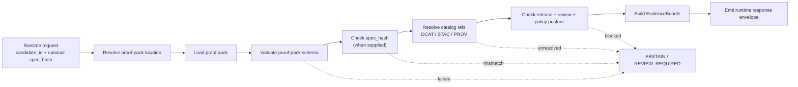

<!-- [KFM_META_BLOCK_V2]
doc_id: kfm://doc/<NEEDS_VERIFICATION_UUID>
title: Ecology EvidenceBundle Resolver API
type: standard
version: v1
status: draft
owners: @bartytime4life
created: <NEEDS_VERIFICATION_CREATED_DATE>
updated: 2026-04-24
policy_label: <NEEDS_VERIFICATION_POLICY_LABEL>
related: [
  ./ecology_evidencebundle.md,
  ../../schemas/contracts/v1/runtime/runtime_response_envelope.schema.json,
  ../../schemas/ecology/ecology_proof_pack.schema.json,
  ../../data/proofs/ecology/README.md,
  ../../tools/proofs/ecology_proof_pack_builder.py,
  ../../apps/governed_api/README.md
]
tags: [kfm, ecology, runtime, api, evidencebundle, proof-pack, cite-or-abstain]
notes: [
  "PROPOSED governed API resolver contract for ecology EvidenceBundles.",
  "Target path inferred from the source draft: contracts/runtime/ecology_evidencebundle_resolver.md.",
  "Does not claim apps/governed_api implementation, route wiring, schema presence, CI coverage, or runtime behavior has been verified.",
  "Preserves KFM trust membrane, EvidenceBundle-first resolution, and cite-or-abstain behavior."
]
[/KFM_META_BLOCK_V2] -->

<a id="top"></a>

# Ecology EvidenceBundle Resolver API

Governed API boundary for resolving ecology proof packs into runtime EvidenceBundles.

> [!NOTE]
> **Status:** draft  
> **Truth posture:** `PROPOSED` contract / `UNKNOWN` implementation  
> **Inferred target path:** `contracts/runtime/ecology_evidencebundle_resolver.md`  
> **Primary rule:** consequential ecology claims resolve to evidence or abstain.

---

## Quick navigation

- [Purpose](#purpose)
- [Repo fit](#repo-fit)
- [Resolver boundary](#resolver-boundary)
- [Endpoint shape](#endpoint-shape)
- [Request contract](#request-contract)
- [Decision model](#decision-model)
- [Response contract](#response-contract)
- [Error taxonomy](#error-taxonomy)
- [Resolver algorithm](#resolver-algorithm)
- [Trust membrane rules](#trust-membrane-rules)
- [Implementation hooks](#implementation-hooks)
- [Validation plan](#validation-plan)
- [Definition of done](#definition-of-done)
- [Open verification items](#open-verification-items)

---

## Purpose

This contract defines the runtime resolver that converts an ecology candidate into a governed evidence response:

```text
candidate_id
  → proof pack
  → EvidenceBundle
  → runtime response envelope
```

The resolver must never return a consequential ecological claim as supported unless a valid proof pack resolves to an EvidenceBundle and passes the required release, review, catalog, and policy checks.

`PROPOSED`: this document describes the intended contract and guardrails. It is not proof that the endpoint, schema files, resolver module, API route, Evidence Drawer wiring, or CI gates already exist.

---

## Repo fit

| Field | Value |
|---|---|
| Document role | Standard runtime contract |
| Inferred path | `contracts/runtime/ecology_evidencebundle_resolver.md` |
| Upstream evidence | Ecology proof packs, proof-pack schema, catalog refs, receipts, review state, release state |
| Downstream consumers | Governed API response envelope, Evidence Drawer, map layer evidence links, Focus Mode evidence pool |
| Public posture | Cite-or-abstain; no evidence invention |
| Implementation status | `UNKNOWN` until verified in the mounted repository |

### Accepted inputs

This resolver accepts only governed runtime inputs:

- `candidate_id` for an ecology candidate, claim, index, layer, or processed artifact.
- Optional `spec_hash` for deterministic identity checking.
- Optional include flags for receipts, catalog refs, and uncertainty.
- Release, review, and policy context supplied by the governed API layer.

### Exclusions

This resolver is not the place for:

- direct reads from `RAW`, `WORK`, `QUARANTINE`, or canonical/internal stores by public clients;
- free-form ecological narrative generation;
- proof-pack construction or source ingestion;
- map style or layer rendering logic;
- model-runtime prompts or unchecked AI output;
- public exposure of sensitive exact locations when policy or review state blocks release.

---

## Resolver boundary

The resolver is a narrow trust membrane component. It turns proof-bearing artifacts into a runtime evidence answer and turns missing or invalid proof into a governed non-answer.



> [!IMPORTANT]
> A map layer, tile, summary, or generated sentence cannot substitute for an EvidenceBundle. Runtime surfaces may display evidence state, but they must not become the evidence source.

---

## Endpoint shape

```text
GET /v1/ecology/evidence-bundles/{candidate_id}
```

> [!WARNING]
> Endpoint path is proposed. Do not document it as implemented until verified in `apps/governed_api` or the repository’s actual governed API app path.

### Transport convention

| Item | Posture |
|---|---|
| Method | `GET` |
| Path | `PROPOSED` |
| Response envelope | `runtime_response_envelope.schema.json` target is `NEEDS VERIFICATION` |
| Abstention behavior | A governed abstention is a valid response, not a transport failure |
| Internal failures | Should be distinguishable from evidence absence |

---

## Request contract

| Parameter | Required | Location | Description |
|---|---:|---|---|
| `candidate_id` | Yes | path | Ecology candidate, claim, index, layer, or processed-artifact identifier. |
| `spec_hash` | Recommended | query | Expected deterministic identity. Mismatch must not return `cite`. |
| `include_receipts` | Optional | query | Include validator, promotion, or build receipt summaries when available. |
| `include_catalog_refs` | Optional | query | Include DCAT/STAC/PROV references when available and resolved. |
| `include_uncertainty` | Optional | query | Include uncertainty declaration inherited from the proof pack. |

### Request examples

```http
GET /v1/ecology/evidence-bundles/eco_index.example
```

```http
GET /v1/ecology/evidence-bundles/eco_index.example?spec_hash=aaaaaaaaaaaaaaaaaaaaaaaaaaaaaaaaaaaaaaaaaaaaaaaaaaaaaaaaaaaaaaaa&include_receipts=true&include_catalog_refs=true
```

---

## Decision model

The resolver decision is about evidence support. It is related to, but not identical with, Focus Mode runtime outcomes such as `ANSWER`, `ABSTAIN`, `DENY`, and `ERROR`.

| Resolver condition | Resolver decision | Runtime consequence |
|---|---|---|
| Proof pack exists and validates | `cite` | EvidenceBundle may support a consequential claim. |
| Proof pack missing | `abstain` | Runtime must not infer support. |
| Proof pack invalid | `abstain` | Invalid proof remains review-visible but not public support. |
| `spec_hash` mismatch | `abstain` | Deterministic identity failed. |
| Catalog refs unresolved | `abstain` | Catalog/provenance closure failed. |
| Candidate under review | `review_required` | Public runtime claim is blocked pending review. |
| Release or policy context blocks public use | `review_required` or upstream `DENY` | Exact mapping `NEEDS VERIFICATION` against policy/runtime envelope contracts. |
| Internal resolver failure | transport or envelope error | Must not be represented as evidence absence unless diagnosed as such. |

> [!CAUTION]
> `cite` is not a permission to publish every field. Sensitive ecology data may still require redaction, generalization, staged access, or review-gated release.

---

## Response contract

### Minimum fields

| Field | Required when | Notes |
|---|---|---|
| `status` | Always | Envelope status, not evidence support by itself. |
| `data.candidate_id` | Always | Echoes the resolved candidate. |
| `data.evidence_bundle_id` | Always when determinable | Stable EvidenceBundle identifier. |
| `data.decision` | Always | One of `cite`, `abstain`, or `review_required` unless schema expands later. |
| `data.status` | Always | Resolver-local state such as `resolved` or `unresolved`. |
| `data.reason` | Negative decisions | Machine-readable reason. |
| `data.proof_pack_ref` | `cite` | Path or registry ref to the proof pack. |
| `data.spec_hash` | `cite`; recommended otherwise | Deterministic identity value from proof evidence. |
| `data.evidence.receipts` | When requested and available | Receipt summaries only; full receipt access may be role-gated. |
| `data.evidence.catalog_refs` | When requested and resolved | DCAT/STAC/PROV refs. |
| `data.uncertainty` | When requested and available | Declared uncertainty, not generated speculation. |
| `meta.resolver` | Always | Resolver name/version should be added when implementation exists. |
| `meta.evidence_drawer_required` | Always | `true` for consequential ecology support. |

<details>
<summary>Illustrative success response</summary>

```json
{
  "status": "ok",
  "data": {
    "evidence_bundle_id": "kfm.evidence.ecology.eco_index.example",
    "candidate_id": "eco_index.example",
    "spec_hash": "aaaaaaaaaaaaaaaaaaaaaaaaaaaaaaaaaaaaaaaaaaaaaaaaaaaaaaaaaaaaaaaa",
    "decision": "cite",
    "status": "resolved",
    "proof_pack_ref": "data/proofs/ecology/eco_index.example.proof_pack.json",
    "evidence": {
      "receipts": [
        {
          "receipt_ref": "data/receipts/ecology/index/example.validator_receipt.json",
          "decision": "pass"
        }
      ],
      "catalog_refs": {
        "dcat": ["kfm:dcat:dataset:ecology:example"],
        "stac": ["kfm:stac:item:ecology:example"],
        "prov": ["kfm:prov:entity:ecology:example"]
      }
    },
    "uncertainty": {
      "status": "declared",
      "summary": "Uncertainty inherited from proof-pack evidence where available."
    }
  },
  "meta": {
    "resolver": "ecology_evidencebundle",
    "evidence_drawer_required": true
  }
}
```

</details>

<details>
<summary>Illustrative abstain response</summary>

```json
{
  "status": "ok",
  "data": {
    "evidence_bundle_id": "kfm.evidence.ecology.eco_index.example",
    "candidate_id": "eco_index.example",
    "decision": "abstain",
    "status": "unresolved",
    "reason": "proof_pack_missing",
    "claim_text": "KFM abstained because the ecological proof pack could not be resolved."
  },
  "meta": {
    "resolver": "ecology_evidencebundle",
    "evidence_drawer_required": true
  }
}
```

</details>

<details>
<summary>Illustrative review-required response</summary>

```json
{
  "status": "ok",
  "data": {
    "evidence_bundle_id": "kfm.evidence.ecology.eco_index.example",
    "candidate_id": "eco_index.example",
    "decision": "review_required",
    "status": "blocked",
    "reason": "candidate_not_public_runtime_eligible",
    "claim_text": "KFM withheld support because the ecological candidate is not public-runtime eligible."
  },
  "meta": {
    "resolver": "ecology_evidencebundle",
    "evidence_drawer_required": true
  }
}
```

</details>

---

## Error taxonomy

| Code | Meaning | Default decision |
|---|---|---|
| `ECO_EB_PROOF_PACK_MISSING` | Proof pack could not be located. | `abstain` |
| `ECO_EB_PROOF_PACK_INVALID` | Proof pack failed schema or structural validation. | `abstain` |
| `ECO_EB_SPEC_HASH_MISMATCH` | Requested `spec_hash` does not match proof pack. | `abstain` |
| `ECO_EB_CATALOG_REFS_UNRESOLVED` | Required DCAT/STAC/PROV refs failed resolution. | `abstain` |
| `ECO_EB_REVIEW_REQUIRED` | Candidate is not public-runtime eligible. | `review_required` |
| `ECO_EB_RELEASE_SCOPE_BLOCKED` | Requested release scope is not eligible for this candidate. | `review_required` |
| `ECO_EB_INTERNAL_ERROR` | Resolver failed unexpectedly. | runtime error |

> [!NOTE]
> The taxonomy is `PROPOSED`. Align codes with the actual runtime envelope schema, policy decision schema, and API error conventions before implementation.

---

## Resolver algorithm

```text
1. Accept candidate_id and optional spec_hash.
2. Validate candidate_id shape against the ecology identifier rules.
3. Resolve proof-pack location through governed registry/configuration.
4. Load proof pack.
5. Validate proof pack schema.
6. Compare spec_hash when provided.
7. Verify required catalog refs are present and resolvable.
8. Verify review, release, and policy posture for the requested runtime surface.
9. Build EvidenceBundle.
10. Emit runtime response envelope with decision = cite.
11. On any required evidence failure, emit abstain with a reason.
12. On review or release blocking, emit review_required or the policy-defined negative outcome.
13. On internal resolver failure, emit a distinguishable runtime error.
```

### Pseudocode sketch

```text
function resolveEcologyEvidenceBundle(candidate_id, options):
    candidate = parse_candidate_id(candidate_id)
    if candidate.invalid:
        return error("ECO_EB_INTERNAL_ERROR", safe_message)

    proof_pack_ref = proof_pack_registry.lookup(candidate)
    if proof_pack_ref.missing:
        return abstain("ECO_EB_PROOF_PACK_MISSING")

    proof_pack = load(proof_pack_ref)
    if !validate_schema(proof_pack):
        return abstain("ECO_EB_PROOF_PACK_INVALID")

    if options.spec_hash && options.spec_hash != proof_pack.spec_hash:
        return abstain("ECO_EB_SPEC_HASH_MISMATCH")

    if !catalog_refs_resolve(proof_pack.catalog_refs):
        return abstain("ECO_EB_CATALOG_REFS_UNRESOLVED")

    if !is_public_runtime_eligible(proof_pack.review_state, proof_pack.release_scope):
        return review_required("ECO_EB_REVIEW_REQUIRED")

    evidence_bundle = build_evidence_bundle(proof_pack, options)
    return cite(evidence_bundle)
```

---

## Trust membrane rules

- Runtime clients do not access canonical stores directly.
- Proof packs are resolved by the governed API only.
- Map layers cannot substitute for EvidenceBundles.
- Missing evidence becomes abstention, not inference.
- Invalid proof packs remain visible to review surfaces, not public claim support.
- Sensitive ecology support must respect policy, release scope, redaction, and review state.
- Evidence Drawer payloads must carry enough support context for the user to inspect why a claim was cited, abstained, or withheld.
- Focus Mode may consume resolved EvidenceBundles, but it must not generate unsupported ecological support.

---

## Implementation hooks

| Surface | Proposed responsibility | Verification status |
|---|---|---|
| `contracts/runtime/ecology_evidencebundle.md` | Adjacent EvidenceBundle runtime contract. | `NEEDS VERIFICATION` |
| `schemas/contracts/v1/runtime/runtime_response_envelope.schema.json` | Envelope shape for runtime responses. | `NEEDS VERIFICATION` |
| `schemas/ecology/ecology_proof_pack.schema.json` | Proof-pack schema. | `NEEDS VERIFICATION` |
| `data/proofs/ecology/` | Proof-pack storage or fixture home. | `NEEDS VERIFICATION` |
| `data/receipts/ecology/` | Validator/build/promotion receipt home. | `NEEDS VERIFICATION` |
| `tools/proofs/ecology_proof_pack_builder.py` | Builder or fixture generator. | `NEEDS VERIFICATION` |
| `apps/governed_api/` | Governed API route/service implementation. | `NEEDS VERIFICATION` |
| Evidence Drawer | Runtime trust surface consuming resolver output. | `NEEDS VERIFICATION` |
| Focus Mode | Bounded synthesis consumer of resolved evidence. | `NEEDS VERIFICATION` |

---

## Validation plan

| Test or check | Required behavior |
|---|---|
| Valid proof pack | Returns `decision = cite`. |
| Missing proof pack | Returns `decision = abstain`, reason `proof_pack_missing`. |
| Invalid proof pack | Returns `decision = abstain`, reason `proof_pack_invalid`. |
| `spec_hash` mismatch | Returns `decision = abstain`, reason `spec_hash_mismatch`. |
| Unresolved catalog ref | Returns `decision = abstain`, reason `catalog_refs_unresolved`. |
| Candidate under review | Returns `decision = review_required`. |
| Sensitive exact-location candidate | Does not expose public exact support unless policy/review permits. |
| Evidence Drawer fixture | Can render support summary, source role, identity, scope, rights/sensitivity, freshness/review, transform/provenance, and audit linkage. |
| Runtime envelope schema | Resolver output validates against the runtime response envelope schema. |
| No direct canonical access | Public route cannot read `RAW`, `WORK`, `QUARANTINE`, or canonical/internal stores directly. |

---

## Definition of done

- [ ] Target path verified against the mounted repo.
- [ ] Endpoint path verified or corrected.
- [ ] Resolver module implemented behind the governed API boundary.
- [ ] Proof-pack schema validation wired.
- [ ] Runtime response envelope validation wired.
- [ ] Catalog ref resolution implemented or explicitly abstains.
- [ ] `spec_hash` check implemented.
- [ ] Review/release/policy eligibility check implemented.
- [ ] Abstain responses tested.
- [ ] Cite responses tested.
- [ ] Review-required responses tested.
- [ ] Sensitive ecology public-output behavior tested.
- [ ] Evidence Drawer consumes the response contract.
- [ ] Map layers link to EvidenceBundle resolution rather than replacing it.
- [ ] Focus Mode consumes only released, resolved evidence.
- [ ] CI or equivalent validation proof added.
- [ ] Documentation links updated from neighboring runtime/API docs.

---

## Open verification items

| Item | Status | Why it matters |
|---|---|---|
| Mounted repo availability | `UNKNOWN` | Required to verify file paths, route homes, schemas, tests, and CI. |
| Canonical schema home | `UNKNOWN` | Avoid duplicate authority between `contracts/` and `schemas/`. |
| `apps/governed_api` path | `NEEDS VERIFICATION` | Original draft uses this path, but implementation is not verified. |
| Runtime response envelope fields | `NEEDS VERIFICATION` | Response samples must align with actual schema. |
| Ecology proof-pack schema | `NEEDS VERIFICATION` | Resolver cannot validate proof without schema. |
| Policy and release-state mapping | `NEEDS VERIFICATION` | Determines whether blocked candidates emit `review_required`, `DENY`, or another negative state. |
| Evidence Drawer payload schema | `NEEDS VERIFICATION` | Drawer must render support without hidden truth paths. |
| Sensitive ecology redaction rules | `NEEDS VERIFICATION` | Prevents unsafe exact-location exposure. |

---

[Back to top](#top)
