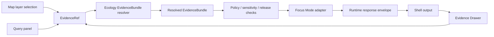

<!-- [KFM_META_BLOCK_V2]
doc_id: kfm://doc/<NEEDS_VERIFICATION_UUID>
title: Ecology Focus Mode Integration
type: standard
version: v1
status: draft
owners: @bartytime4life
created: <NEEDS_VERIFICATION_CREATED_DATE>
updated: 2026-04-24
policy_label: <NEEDS_VERIFICATION_POLICY_LABEL>
related: [
  ../../apps/governed_api/ecology/README.md,
  ./ecology_evidencebundle_resolver.md,
  ../../apps/ui/ecology/evidence_drawer_mapper.py,
  ../../schemas/contracts/v1/runtime/runtime_response_envelope.schema.json,
  ../../data/proofs/ecology/README.md
]
tags: [kfm, ecology, focus-mode, runtime, evidencebundle, cite-or-abstain]
notes: [
  "Proposed Focus Mode integration for ecology EvidenceBundles.",
  "Does not claim Focus Mode implementation exists.",
  "Ensures bounded synthesis remains subordinate to evidence.",
  "Relative links are normalized from the proposed path contracts/runtime/ecology_focus_mode.md and need repo verification."
]
[/KFM_META_BLOCK_V2] -->

<a id="top"></a>

# Ecology Focus Mode Integration

Defines how Focus Mode may consume ecology EvidenceBundles for bounded, citation-bearing synthesis without becoming a parallel truth source.

> [!NOTE]
> **Status:** `draft`  
> **Truth posture:** `PROPOSED`  
> **Proposed path:** `contracts/runtime/ecology_focus_mode.md`  
> **Implementation claim:** `UNKNOWN` until the target repo, schemas, tests, UI, and runtime evidence are inspected.

## Quick navigation

- [Purpose](#purpose)
- [Trust boundary](#trust-boundary)
- [Repo fit](#repo-fit)
- [Contract shape](#contract-shape)
- [Decision rules](#decision-rules)
- [Fail-closed behavior](#fail-closed-behavior)
- [Minimal implementation sketch](#minimal-implementation-sketch)
- [UI and map integration](#ui-and-map-integration)
- [Validation matrix](#validation-matrix)
- [Definition of done](#definition-of-done)
- [Open verification items](#open-verification-items)

---

## Purpose

Focus Mode allows bounded synthesis over ecology evidence that has already passed through the governed evidence path.

```text
EvidenceRef → EvidenceBundle → Focus Mode → runtime response envelope → UI surface
```

For ecology, Focus Mode may explain patterns such as vegetation condition, habitat context, observation support, or uncertainty **only when the EvidenceBundle supports those statements**.

It must not turn a model-generated explanation into ecological truth.

---

## Trust boundary

Focus Mode is a synthesis surface, not an evidence source.

| Boundary | Requirement |
|---|---|
| Root truth | EvidenceBundle and policy state outrank generated language. |
| Scope | The active geography, time window, release scope, and candidate identity must remain visible or recoverable. |
| Citations | Every consequential claim must resolve back to citation-bearing evidence. |
| Uncertainty | Analytical ecology claims must carry uncertainty, caveat, or abstain. |
| Negative states | `ABSTAIN`, `DENY`, and `ERROR` are valid outcomes, not UX failures. |

> [!IMPORTANT]
> A fluent ecology explanation is not sufficient support. Focus may rephrase, organize, and summarize admissible evidence; it may not invent evidence, hide uncertainty, or overrule policy.

---

## Repo fit

**PROPOSED target file:** `contracts/runtime/ecology_focus_mode.md`

This document is intended to sit beside runtime contract guidance, not inside the UI implementation. Its job is to define the contract pressure that ecology Focus Mode places on the governed API, EvidenceBundle resolver, Evidence Drawer mapper, and runtime response envelope.

| Neighbor | Expected relationship | Status |
|---|---|---|
| `../../apps/governed_api/ecology/README.md` | Describes ecology governed API surfaces that may call the Focus adapter. | `NEEDS VERIFICATION` |
| `./ecology_evidencebundle_resolver.md` | Defines how ecology EvidenceRefs resolve to EvidenceBundles before synthesis. | `NEEDS VERIFICATION` |
| `../../apps/ui/ecology/evidence_drawer_mapper.py` | Maps evidence and Focus output into drawer-visible trust cues. | `NEEDS VERIFICATION` |
| `../../schemas/contracts/v1/runtime/runtime_response_envelope.schema.json` | Provides the runtime response envelope shape that Focus output should conform to. | `NEEDS VERIFICATION` |
| `../../data/proofs/ecology/README.md` | Records proof-pack expectations for ecology fixtures and validation evidence. | `NEEDS VERIFICATION` |

No route name, DTO name, module path, test status, CI behavior, or runtime implementation is claimed by this document.

---

## Contract shape

### Input contract

Focus Mode receives an ecology candidate, a resolved EvidenceBundle, and the user’s bounded question.

```json
{
  "candidate_id": "eco_index.example",
  "question": "What is happening to vegetation here?",
  "scope": {
    "surface_class": "focus.ecology",
    "place_ref": "kfm:place:example",
    "time_window": {
      "start": "2026-04-01",
      "end": "2026-04-24"
    },
    "release_scope": ["kfm:release:ecology:example"]
  },
  "evidence_bundle": {
    "status": "ok",
    "data": {
      "decision": "cite",
      "evidence_bundle_id": "kfm.evidence.ecology.eco_index.example",
      "evidence": {
        "catalog_refs": {
          "prov": ["kfm:prov:entity:ecology:example"]
        }
      },
      "uncertainty": {
        "summary": "Association, not causation."
      }
    }
  }
}
```

### Output contract

Focus output should be shaped as, or wrapped into, the repo’s runtime response envelope. The exact schema home is `NEEDS VERIFICATION`; the fields below define the minimum ecology-specific obligations.

```json
{
  "schema_version": "1.0.0",
  "object_type": "runtime_response_envelope",
  "surface_class": "focus.ecology",
  "result": {
    "outcome": "ANSWER",
    "decision": "cite",
    "answer_text": "Vegetation shows a documented decline associated with soil moisture anomalies in the cited ecology evidence.",
    "evidence_bundle_id": "kfm.evidence.ecology.eco_index.example",
    "citations": [
      "kfm:prov:entity:ecology:example"
    ],
    "uncertainty": {
      "summary": "Association, not causation."
    }
  },
  "policy": {
    "reason_codes": ["published_scope", "citations_valid", "uncertainty_visible"],
    "obligations": []
  }
}
```

### Required response fields

| Field | Requirement |
|---|---|
| `object_type` | Must identify the response as a runtime envelope or repo-approved equivalent. |
| `surface_class` | Must identify this as an ecology Focus response. |
| `result.outcome` | Must be finite: `ANSWER`, `ABSTAIN`, `DENY`, or `ERROR`. |
| `result.decision` | Must preserve the EvidenceBundle-derived citation posture: usually `cite` or `abstain`. |
| `result.evidence_bundle_id` | Must identify the same bundle used by the map and Evidence Drawer. |
| `result.citations` | Required for `ANSWER`; omitted or empty only for negative outcomes with reason codes. |
| `result.uncertainty` | Required for analytical ecology claims; absence forces abstain unless the claim is purely descriptive. |
| `policy.reason_codes` | Must explain why the response answered, abstained, denied, or errored. |

---

## Allowed behavior

| Behavior | Allowed | Guardrail |
|---|---:|---|
| Summarize evidence | Yes | Stay inside cited bundle contents. |
| Combine multiple evidence fields | Yes | Preserve source roles, time scope, and uncertainty. |
| Rephrase claim text | Yes | Do not strengthen the claim. |
| Highlight uncertainty | Yes | Prefer explicit caveats over implied certainty. |
| Explain abstain/deny/error | Yes | Use reason codes and preserve user-facing clarity. |
| Suggest where to inspect support | Yes | Link back to Evidence Drawer or equivalent evidence payload. |

## Forbidden behavior

| Behavior | Result |
|---|---|
| Invent new evidence, sources, observations, trends, or metrics | `ABSTAIN` or `ERROR` |
| Infer causation from association without cited support | `ABSTAIN` |
| Ignore an EvidenceBundle `abstain` or `review_required` decision | `ABSTAIN` |
| Use model-only reasoning as evidence | `ABSTAIN` |
| Override policy, sensitivity, rights, freshness, or release state | `DENY` or `ABSTAIN` |
| Use a different EvidenceBundle than the map-selected object | `ERROR` |
| Hide citation, uncertainty, or review state in prose-only output | `ABSTAIN` |

---

## Decision rules

Focus decision-making is a governed projection of the EvidenceBundle decision plus policy checks.

| EvidenceBundle decision | Focus `result.outcome` | Focus `result.decision` | Required reason code |
|---|---|---|---|
| `cite` with resolved citations | `ANSWER` | `cite` | `citations_valid` |
| `cite` but missing uncertainty for analytical claim | `ABSTAIN` | `abstain` | `uncertainty_missing` |
| `cite` but conflicting signals not adjudicated by evidence | `ABSTAIN` | `abstain` | `conflicting_evidence` |
| `abstain` | `ABSTAIN` | `abstain` | `insufficient_evidence` |
| `review_required` | `ABSTAIN` | `abstain` | `review_required` |
| policy denies release or access | `DENY` | `abstain` | `policy_denied` |
| malformed bundle or resolver failure | `ERROR` | `abstain` | `bundle_invalid` or `resolver_error` |

---

## Fail-closed behavior

Focus must abstain, deny, or error when the evidence path is incomplete.

| Condition | Outcome | User-facing posture |
|---|---|---|
| EvidenceBundle decision is not `cite` | `ABSTAIN` | “KFM cannot support this ecological claim with available evidence.” |
| Citations cannot be resolved | `ABSTAIN` or `ERROR` | Explain citation-resolution failure without inventing support. |
| Analytical claim lacks uncertainty | `ABSTAIN` | Show that uncertainty is required before synthesis. |
| Evidence signals conflict without adjudication | `ABSTAIN` | Preserve conflict rather than smoothing it away. |
| Prompt requests unsupported expansion | `ABSTAIN` | Answer only the supported subset, or abstain entirely. |
| Policy, rights, sensitivity, or release scope blocks response | `DENY` | State that the request is not releasable under the current policy state. |
| Runtime fails after valid input | `ERROR` | Emit finite error state with audit/ref information where available. |

---

## Minimal implementation sketch

The sketch below is illustrative pseudocode. It does not claim that these functions or paths exist.

```python
from __future__ import annotations

from typing import Any


CITE = "cite"


def focus_ecology_answer(bundle: dict[str, Any], question: str) -> dict[str, Any]:
    """Build a bounded ecology Focus response from a resolved EvidenceBundle.

    PROPOSED behavior:
    - answer only when the bundle decision is cite;
    - require resolved provenance citations;
    - require uncertainty for analytical claims;
    - preserve negative outcomes as first-class runtime states.
    """
    data = bundle.get("data", {})
    evidence_bundle_id = data.get("evidence_bundle_id", "<UNKNOWN_EVIDENCE_BUNDLE_ID>")
    decision = data.get("decision")

    if decision != CITE:
        return _abstain(
            evidence_bundle_id=evidence_bundle_id,
            reason_code="insufficient_evidence" if decision == "abstain" else "review_required",
        )

    evidence = data.get("evidence", {})
    prov_refs = evidence.get("catalog_refs", {}).get("prov", [])
    uncertainty = data.get("uncertainty")

    if not prov_refs:
        return _abstain(evidence_bundle_id, "citations_missing")

    if _question_requires_analysis(question) and not uncertainty:
        return _abstain(evidence_bundle_id, "uncertainty_missing")

    if _has_unresolved_conflicts(data):
        return _abstain(evidence_bundle_id, "conflicting_evidence")

    return {
        "schema_version": "1.0.0",
        "object_type": "runtime_response_envelope",
        "surface_class": "focus.ecology",
        "result": {
            "outcome": "ANSWER",
            "decision": "cite",
            "answer_text": "Summarized ecology evidence based on the resolved EvidenceBundle.",
            "evidence_bundle_id": evidence_bundle_id,
            "citations": prov_refs,
            "uncertainty": uncertainty or {},
        },
        "policy": {
            "reason_codes": ["published_scope", "citations_valid"],
            "obligations": ["show_evidence_drawer_link"],
        },
    }


def _abstain(evidence_bundle_id: str, reason_code: str) -> dict[str, Any]:
    return {
        "schema_version": "1.0.0",
        "object_type": "runtime_response_envelope",
        "surface_class": "focus.ecology",
        "result": {
            "outcome": "ABSTAIN",
            "decision": "abstain",
            "answer_text": "KFM cannot support this ecological claim with available evidence.",
            "evidence_bundle_id": evidence_bundle_id,
        },
        "policy": {
            "reason_codes": [reason_code],
            "obligations": ["preserve_abstain_message"],
        },
    }


def _question_requires_analysis(question: str) -> bool:
    analytical_terms = ("why", "trend", "decline", "increase", "cause", "associated", "impact")
    return any(term in question.lower() for term in analytical_terms)


def _has_unresolved_conflicts(data: dict[str, Any]) -> bool:
    return bool(data.get("conflicts")) and not data.get("conflict_resolution")
```

---

## UI and map integration

Focus Mode output must remain visually tied to the same evidence object the user inspected on the map.



### UI requirements

| Surface | Requirement |
|---|---|
| Focus panel | Display answer or negative state, not raw model text. |
| Evidence Drawer | Link from Focus response to the exact EvidenceBundle and citations. |
| Map popup / selection state | Preserve the selected candidate and time scope used to resolve the bundle. |
| Query panel | Show when the requested claim is unsupported, out of scope, or policy-blocked. |
| Review surface | Treat `review_required` as abstain for public synthesis until review state changes. |

### Map requirements

Focus Mode may be triggered from:

- map layer selection;
- Evidence Drawer interaction;
- query panel prompt;
- saved view or dossier context.

Every trigger must resolve to the same EvidenceBundle identity before the Focus adapter is allowed to synthesize.

---

## Validation matrix

| Test | Expected result | Why it matters |
|---|---|---|
| `cite` bundle with citations and uncertainty | `ANSWER` with citations and uncertainty | Proves bounded positive path. |
| `cite` bundle without citations | `ABSTAIN` or `ERROR` | Prevents unsupported answers. |
| `cite` bundle without uncertainty for analytical question | `ABSTAIN` | Prevents false precision. |
| `abstain` bundle | `ABSTAIN` | Preserves cite-or-abstain. |
| `review_required` bundle | `ABSTAIN` | Prevents premature synthesis. |
| policy-denied bundle | `DENY` | Preserves policy boundary. |
| conflicting signals fixture | `ABSTAIN` | Prevents smoothing conflict into narrative. |
| prompt asks for causation without proof | `ABSTAIN` | Prevents unsupported causal claims. |
| map bundle differs from Focus bundle | `ERROR` | Prevents evidence bypass. |
| UI drawer link missing | test failure | Keeps Evidence Drawer as trust anchor. |

---

## Definition of done

- [ ] Focus adapter contract implemented or explicitly deferred.
- [ ] Runtime response envelope compatibility verified.
- [ ] Cite/`ANSWER` response tested with resolved citations.
- [ ] `ABSTAIN` response tested for insufficient evidence.
- [ ] `DENY` response tested for policy-blocked output.
- [ ] `ERROR` response tested for malformed or mismatched bundle input.
- [ ] Citation extraction tested.
- [ ] Uncertainty propagation tested.
- [ ] Conflicting evidence fixture tested.
- [ ] Unsupported causation prompt tested.
- [ ] UI link back to Evidence Drawer verified.
- [ ] Map selection, drawer, and query-panel triggers verified to use the same EvidenceBundle.
- [ ] No raw model output, direct canonical-store access, or evidence bypass path exists in the normal public path.

---

## Open verification items

| Item | Status | Why it remains open |
|---|---|---|
| Actual repo path for this file | `NEEDS VERIFICATION` | Suggested path is supplied, but no mounted repo was available. |
| KFM document UUID | `NEEDS VERIFICATION` | No document registry was inspectable. |
| Created date | `NEEDS VERIFICATION` | Supplied draft did not confirm it. |
| Policy label | `NEEDS VERIFICATION` | No policy registry or label taxonomy was inspectable. |
| Runtime envelope schema details | `NEEDS VERIFICATION` | Related schema path is proposed but not inspectable. |
| Exact Focus route/class/function names | `UNKNOWN` | No implementation tree was mounted. |
| Ecology EvidenceBundle resolver behavior | `UNKNOWN` | Related resolver doc/path was not inspectable. |
| UI mapper behavior | `UNKNOWN` | Related mapper path was not inspectable. |
| Tests and CI coverage | `UNKNOWN` | No tests or workflow files were inspectable. |

[Back to top](#top)
