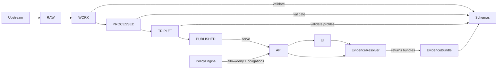

# contracts/schemas
Machine-readable schema contracts for KFM’s governed data → catalog → API → UI system.

**Status:** draft • **Owners:** TBD • **Applies to:** pipelines, catalog triplet (DCAT/STAC/PROV), governed API DTOs, UI sidecars • **Posture:** contract-first, fail-closed

**Badges:** `contract-first` `fail-closed` `time-aware` `map-first` `evidence-first` `cite-or-abstain`

**Quick navigation**
- [Purpose](#purpose)
- [How schemas enforce KFM invariants](#how-schemas-enforce-kfm-invariants)
- [Directory layout](#directory-layout)
- [Schema families](#schema-families)
- [Naming, identity, and versioning](#naming-identity-and-versioning)
- [Governance and promotion gates](#governance-and-promotion-gates)
- [Validation and CI gates](#validation-and-ci-gates)
- [Change workflow](#change-workflow)
- [Definition of Done](#definition-of-done)
- [References](#references)

---

## Purpose
This directory is the canonical home for **schema contracts** that define and constrain:
- **Pipeline outputs** in `WORK/QUARANTINE` and `PROCESSED` (validation + QA + candidate redactions).
- **Catalog triplet artifacts** (**DCAT + STAC + PROV**) that serve as KFM’s interoperability + evidence surface.
- **Governed API DTOs** (request/response shapes that must be policy-safe and evidence-resolvable).
- **UI sidecar payloads** (e.g., map state, Story Node v3 sidecars, Focus Mode response shapes).

> NOTE  
> Schemas are not “documentation.” In KFM they are *enforceable gates* that block promotion/publishing when invalid.

[Back to top](#contractsschemas)

---

## How schemas enforce KFM invariants
KFM’s system posture relies on several invariants that become enforceable via contracts:



### What “fail-closed” means here
- If **licensing is unclear**, assets stay in **QUARANTINE** and must not be promoted.
- If **sensitivity is unclear**, schema + policy labeling must block promotion until reviewed.
- If **citations cannot be verified** (resolved + allowed), Focus Mode must abstain or reduce scope.

[Back to top](#contractsschemas)

---

## Directory layout
This repository may evolve, but the **recommended layout** below is designed to keep schemas discoverable, versioned, and testable.

```text
contracts/
  schemas/
    README.md

    _registry/
      schemas.index.json              # (recommended) machine-readable registry of schema $id + versions
      compat.rules.md                 # (recommended) compatibility rules & examples

    core/
      dataset_v1.schema.json
      dataset_version_v1.schema.json
      artifact_v1.schema.json
      evidence_ref_v1.schema.json
      evidence_bundle_v1.schema.json
      policy_decision_v1.schema.json
      run_receipt_v1.schema.json
      story_node_sidecar_v3.schema.json
      focus_response_v1.schema.json

    profiles/
      dcat/
        kfm_dcat_profile_v1.schema.json
      stac/
        kfm_stac_profile_v1.schema.json
      prov/
        kfm_prov_profile_v1.schema.json

    datasets/
      <dataset_slug>/
        v1/
          <dataset_slug>_v1.schema.json
          examples/
            minimal.json
            typical.json
            edge_cases.json
```

> TIP  
> Keep **core** schemas small and reusable. Put dataset-specific fields in `datasets/<dataset_slug>/…`.

[Back to top](#contractsschemas)

---

## Schema families
| Family | What it covers | Typical consumer | Notes |
|---|---|---|---|
| `core/` | System-wide entities (Dataset, DatasetVersion, Artifact, EvidenceRef/Bundle, RunReceipt, PolicyDecision, Story Node sidecar, Focus response) | Pipelines, Evidence Resolver, API, UI | These define the “spine” of the platform. |
| `profiles/` | Validation profiles for DCAT/STAC/PROV artifacts | Catalog generator, CI | Ensures the catalog triplet is consistent and cross-linked. |
| `datasets/` | Dataset-specific record schemas | Ingest/normalize steps, QA checks | Referenced from dataset onboarding specs. |
| `_registry/` | Registry + compatibility rules | Tooling + CI | Prevents schema drift and undocumented breaking changes. |

### Minimum core entities (schema targets)
The KFM blueprint names a minimal set of domain entities; these should have schemas (or schema-equivalent contract definitions) before broad rollout:
- Dataset, DatasetVersion, Artifact
- EvidenceRef, EvidenceBundle
- PolicyDecision
- RunReceipt
- StoryNodeVersion/sidecar
- MapState
- Focus Mode response DTOs

[Back to top](#contractsschemas)

---

## Naming, identity, and versioning
### File naming
Use one of these patterns consistently (pick one repo-wide; don’t mix):
- `thing_v1.schema.json` (simple, explicit), or
- `thing.schema.v1.json` (less common), or
- `v1/thing.schema.json` (directory-versioned)

### `$id` and stable identity
Every schema MUST define a stable `$id` and MUST NOT change it on edits that are within the same major version.

Recommended internal ID shape (example):
- `kfm://schema/core/evidence_bundle@v1`

### Versioning rules (SemVer-style)
- **Major** (`v1 → v2`) = breaking change (required fields removed, type changes, meaning changes).
- **Minor** (`v1.1`) = additive, backwards compatible (new optional fields).
- **Patch** = editorial clarifications, metadata, comments; no behavior change.

> WARNING  
> Once a schema version is used to validate promoted artifacts, treat it as immutable. Create a new version instead of “fixing in place.”

### Deterministic DatasetVersion IDs and `spec_hash`
Where dataset version identity is derived from canonical inputs (e.g., a dataset onboarding spec), schema changes must respect deterministic hashing rules:
- If a field participates in the canonicalized input used for `spec_hash`, changing it changes the DatasetVersion identity.
- Prefer **explicit schema pointers** in onboarding specs so the validation contract is auditable.

[Back to top](#contractsschemas)

---

## Governance and promotion gates
Schemas participate directly in promotion gating (promotion must block unless required artifacts validate).

### How schemas map to promotion gates
| Gate | What the gate enforces | Schema role |
|---|---|---|
| A — Identity & versioning | Stable Dataset ID, immutable DatasetVersion derived from `spec_hash` | Validate dataset spec inputs and version metadata. |
| B — Licensing & rights | License is explicit; rights holder/attribution captured; fail-closed on unclear license | Schema requires license/rights metadata presence and shape. |
| C — Sensitivity & redaction | `policy_label` assigned; redaction/generalization plan recorded in lineage | Schema defines `policy_label` enum + redaction plan structure. |
| D — Catalog triplet validation | DCAT + STAC + PROV validate + cross-links resolvable | Profile schemas validate the triplet and cross-links. |
| E — Run receipt & checksums | `run_receipt` exists; inputs/outputs enumerated w/ checksums; environment recorded | RunReceipt schema validates run metadata + checksums list. |
| F — Policy + contract tests | OPA policy tests pass; evidence resolver can resolve; API contracts/schemas validate | API/DTO schemas must validate responses and evidence resolution outputs. |

> NOTE  
> Promotion is blocked unless *all* required artifacts exist and validate. This directory is one of the primary mechanisms that makes that enforceable.

[Back to top](#contractsschemas)

---

## Validation and CI gates
This repo should standardize on a single validator/toolchain (TBD), but the gate behavior should be consistent:

### Minimum CI checks (recommended)
- **Schema compile/lint:** every schema loads, resolves references, and is syntactically valid.
- **Example validation:** every `examples/*.json` validates against its schema.
- **Cross-schema reference check:** `$ref` targets exist and are version-pinned.
- **Breaking change detection:** any change to a released schema is flagged unless version bumped.
- **Catalog profile tests:** representative DCAT/STAC/PROV fixtures validate.
- **Evidence bundle fixture:** at least one EvidenceRef resolves to an EvidenceBundle (CI proof-of-life).

### Suggested local commands (illustrative)
(Choose your preferred tooling; these are patterns, not mandates.)

- Validate all schemas:
  - `npm run schemas:validate`
- Validate examples:
  - `npm run schemas:examples`
- Check for breaking changes:
  - `npm run schemas:compat`

[Back to top](#contractsschemas)

---

## Change workflow
When adding or modifying schemas:

1. **Decide scope**
   - Is this a **core** entity? Put it in `core/`.
   - Is it dataset-specific? Put it in `datasets/<dataset_slug>/vN/`.
   - Is it a DCAT/STAC/PROV profile? Put it in `profiles/`.

2. **Create a new version if needed**
   - Breaking change → new major.
   - Additive change → minor (or new file version if you only do majors).

3. **Add examples**
   - Minimum: `minimal.json`, `typical.json`, `edge_cases.json`.

4. **Update registry**
   - Add schema `$id`, file path, version, owner, status, and “used-by” notes.

5. **Add/adjust fixtures and tests**
   - If schema change impacts promotion gates, add fixtures that prove the gates still pass/fail correctly.

6. **Governance review**
   - If `policy_label` / sensitivity semantics change, route to steward review before merge.

[Back to top](#contractsschemas)

---

## Definition of Done
A schema PR is DONE when:

- [ ] Schema has stable `$id` and explicit versioning.
- [ ] Schema passes compile/lint validation.
- [ ] All examples validate.
- [ ] Any breaking change is version-bumped and documented.
- [ ] Registry entry added/updated.
- [ ] CI gates pass, including at least one evidence-resolve fixture if applicable.
- [ ] Governance notes included when sensitivity/policy semantics change.
- [ ] Links in this README remain valid (no repo drift).

[Back to top](#contractsschemas)

---

## References
- **KFM “truth path” lifecycle** and promotion gating posture (RAW → WORK/QUAR → PROCESSED → DCAT/STAC/PROV → PUBLISHED).
- **Cite-or-abstain Focus Mode** posture: every response cites resolvable evidence bundles or abstains.
- **KFM MetaBlock v2** guidance for structured metadata without YAML frontmatter.

If your repo has the KFM standards/docs directory, link to:
- `docs/standards/KFM_DCAT_PROFILE.md`
- `docs/standards/KFM_STAC_PROFILE.md`
- `docs/standards/KFM_PROV_PROFILE.md`

---

<details>
<summary><strong>KFM MetaBlock v2 (recommended for governed docs)</strong></summary>

> Copy/paste template (fill in values; keep `doc_id` stable):

```text
[KFM_META_BLOCK_V2]
doc_id: kfm://doc/<uuid>
title: contracts/schemas README
type: guide
version: v1
status: draft
owners: <team or names>
created: YYYY-MM-DD
updated: YYYY-MM-DD
policy_label: public
related:
  - kfm://doc/<guides-and-standards-doc-id>
tags:
  - kfm
  - contracts
  - schemas
notes:
  - Schema contracts are enforceable promotion gates.
[/KFM_META_BLOCK_V2]
```
</details>
