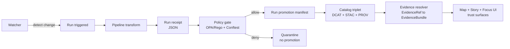

<!-- [KFM_META_BLOCK_V2]
doc_id: kfm://doc/2e5bb2f6-0401-4fcb-9f7c-3b4ad5663b4e
title: contracts/schemas — Contract Schemas Registry
type: standard
version: v1
status: draft
owners: TBD (KFM Platform + Governance)
created: 2026-02-22
updated: 2026-02-22
policy_label: public
related:
  - kfm://doc/contracts/policy   # policy pack (OPA/Rego) that enforces these schemas
  - kfm://doc/catalog/profiles   # DCAT/STAC/PROV profile docs (if present)
tags: [kfm, contracts, schemas, json-schema, governance, promotion-gates]
notes:
  - Canonical registry for governance-critical JSON Schemas.
  - Contract-first posture: changes require versioning + fixture tests + policy review.
[/KFM_META_BLOCK_V2] -->

# contracts/schemas — Contract Schemas Registry
Canonical JSON Schemas for **governance-critical contracts** (fail-closed).  
**Status:** draft • **Owners:** TBD • **Policy label:** public


---

## Navigation
- [What this directory is](#what-this-directory-is)
- [Contracts in scope](#contracts-in-scope)
- [Versioning and compatibility](#versioning-and-compatibility)
- [Validation and CI gates](#validation-and-ci-gates)
- [How these contracts are used](#how-these-contracts-are-used)
- [How to add or change a schema](#how-to-add-or-change-a-schema)
- [Directory layout](#directory-layout)
- [Appendix: design rules](#appendix-design-rules)

---

## What this directory is

This folder is the **canonical registry** of JSON Schemas that define the **interfaces we govern by construction**.

**Rule of thumb:** if an artifact influences **promotion**, **policy decisions**, **auditing**, **evidence resolution**, or **UI trust affordances**, it must be schema-validated here (or in a clearly-defined sibling contract registry).

### Why this matters
KFM’s pipeline/runtime loop is intentionally **fail-closed**:

- If a run receipt / manifest does **not** validate → it cannot be trusted, signed/attested, promoted, or displayed with “green” trust cues.
- Schema validation is necessary but not sufficient: **OPA/Rego policy** can add allow-listing, role checks, and sensitivity rules on top.

> ⚠️ These schemas are “contract surfaces” just like catalogs (DCAT/STAC/PROV) and governed API payloads.
> If you change a contract, you must treat it like an API change.

[Back to top](#navigation)

---

## Contracts in scope

The table below lists the **platform-level contracts** that are expected to remain stable across datasets/domains.

| Contract | Filename (example) | Produced by | Consumed by | “Primary gate” expectation |
|---|---|---|---|---|
| **Run Receipt (per run)** | `run_receipt.v1.schema.json` | pipeline runs, Focus Mode runs | CI policy gate, audit ledger, evidence resolver, UI receipt viewer | JSON Schema validate → Conftest/OPA rules |
| **Run / Promotion Manifest (per dataset release)** | `run_manifest.v1.schema.json` | promotion step / release lane | catalog linker, artifact publisher, rollback tooling | JSON Schema validate → promotion checklist |
| **Watchers Registry entry** | `watcher.v1.schema.json` | governance/ops (allow-list) | watcher workflows + signature verifier | JSON Schema validate → signature verify → allow-list checks |

> ✅ Dataset-specific schemas (e.g., GeoParquet row shape, CSV schemas, domain vocab) usually belong under that dataset’s lane (example: `data/<domain>/<dataset>/schemas/`), not here.

[Back to top](#navigation)

---

## Versioning and compatibility

### Naming convention
Use this file naming pattern:

- `<contract_name>.v<MAJOR>.schema.json`

Examples:
- `run_receipt.v1.schema.json`
- `run_manifest.v1.schema.json`
- `watcher.v1.schema.json`

### Immutability rule
Once a schema version is used for:
- a **published** dataset version, **or**
- a CI gate that blocks/permits promotion,

…treat it as **immutable**. Publish a new major version instead of editing in place.

### Breaking vs non-breaking
- **Breaking change** → bump MAJOR (new file).
  - removing/renaming fields
  - changing types
  - making optional fields required
  - tightening enums/patterns in a way that rejects previously-valid artifacts
- **Non-breaking change** → allowed in the same MAJOR only if it is truly backward compatible.
  - adding optional fields
  - adding optional enum values (only if old validators tolerate it)

> Recommendation: prefer **new major versions** for any change that affects downstream policy, hashing, or UI trust indicators—determinism beats convenience.

[Back to top](#navigation)

---

## Validation and CI gates

### Minimum expectations
At minimum, CI should:
- validate contract JSON objects against these JSON Schemas
- fail the build if validation fails
- run **policy tests** (default deny) for promotion-critical contracts
- treat “unknown contract versions” as **deny-by-default**

### Local validation examples (choose one toolchain)
> These are examples only; use the project’s chosen validation tool in CI.

**AJV (Node.js):**
```bash
npx ajv-cli validate \
  -s contracts/schemas/run_receipt.v1.schema.json \
  -d path/to/run_receipt.json
```

**Python jsonschema:**
```bash
python -m jsonschema \
  -i path/to/run_receipt.json \
  contracts/schemas/run_receipt.v1.schema.json
```

### Contract fixtures
Every schema MUST have fixtures:
- `fixtures/<contract>/<version>/valid/*.json`
- `fixtures/<contract>/<version>/invalid/*.json`

CI should validate:
- all `valid/` pass
- all `invalid/` fail

[Back to top](#navigation)

---

## How these contracts are used

These contracts support the core “governance-by-construction” loop (watch → run → receipts → policy gates → publish → UI evidence).



### EvidenceRef schemes (contracted expectation)
Evidence resolution should be deterministic and avoid guessing. Common schemes include:
- `dcat://...` dataset/distribution metadata
- `stac://...` collection/item/asset metadata
- `prov://...` lineage (activities/entities/agents)
- `doc://...` governed documents + story citations
- `graph://...` entity relations (if enabled)

> If you add a new EvidenceRef scheme, it should come with:
> 1) a schema for the reference format, and  
> 2) resolver tests (policy allow/deny + obligations).

[Back to top](#navigation)

---

## How to add or change a schema

### New contract checklist
- [ ] The contract is **platform-level** (belongs here) vs dataset-level (belongs in a dataset lane).
- [ ] A new schema file is added with a **new MAJOR version** if backward compatibility is uncertain.
- [ ] Schema includes:
  - [ ] `$id` (stable identifier)
  - [ ] clear `title` + `description`
  - [ ] `additionalProperties: false` where feasible (fail-closed posture)
  - [ ] `format` constraints for timestamps (`date-time`)
  - [ ] explicit enums for `policy_label`, `zone`, etc., when stable
- [ ] Fixtures added (valid + invalid).
- [ ] CI validation wired (schema + policy).
- [ ] Downstream producers/consumers updated (pipelines, UI components, policy rules).

### Change control
Changes to contracts are governance changes. Treat them like API changes:
- open a PR
- include fixtures
- include a short migration note (what breaks, what’s additive)
- ensure promotion is blocked until all required gates pass

[Back to top](#navigation)

---

## Directory layout

Recommended layout (this folder):
```text
contracts/
└─ schemas/
   ├─ README.md
   ├─ run_receipt.v1.schema.json
   ├─ run_manifest.v1.schema.json
   ├─ watcher.v1.schema.json
   └─ fixtures/
      ├─ run_receipt/v1/{valid,invalid}/
      ├─ run_manifest/v1/{valid,invalid}/
      └─ watcher/v1/{valid,invalid}/
```

If catalog profile schemas are stored here (optional), consider:
```text
contracts/schemas/catalogs/
  ├─ dcat.profile.v1.schema.json
  ├─ stac.collection.profile.v1.schema.json
  ├─ stac.item.profile.v1.schema.json
  └─ prov.bundle.profile.v1.schema.json
```

[Back to top](#navigation)

---

## Appendix: design rules

### Fail-closed defaults
- Prefer rejecting unknown fields (`additionalProperties: false`)
- Prefer explicit enums for sensitive posture inputs (policy labels, zones, run_type)
- Prefer stable identifiers + digests over implicit names

### Deterministic identity
If a contract includes `spec_hash`, digests, or canonical “identity,” ensure the producer:
- canonicalizes inputs before hashing
- stores the resulting hash in the contract object
- can re-compute the same hash in CI to detect drift

### Trust membrane reminders
Contracts should never encourage the UI to bypass governed APIs.
In particular:
- UI should not directly fetch from object storage/DBs
- restricted dataset existence should not leak via errors
- downloads/exports must be policy-checked

(These are enforced by policy and threat-model checks, but schema design should not work against them.)
