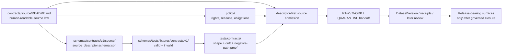

<!-- [KFM_META_BLOCK_V2]
doc_id: kfm://doc/NEEDS_VERIFICATION_UUID
title: source
type: standard
version: v1
status: draft
owners: NEEDS_VERIFICATION_OWNER
created: NEEDS_VERIFICATION_DATE
updated: NEEDS_VERIFICATION_DATE
policy_label: NEEDS_VERIFICATION_POLICY_LABEL
related: [../README.md, ../../README.md, ../../schemas/README.md, ../../schemas/contracts/README.md, ../../schemas/contracts/v1/README.md, ../../schemas/contracts/v1/source/source_descriptor.schema.json, ../../schemas/tests/README.md, ../../schemas/tests/fixtures/contracts/v1/README.md, ../../policy/README.md, ../../tests/README.md, ../../tests/contracts/README.md, ../../docs/standards/README.md, ../../.github/workflows/README.md, ../../.github/PULL_REQUEST_TEMPLATE.md, ../../.github/CODEOWNERS]
tags: [kfm, contracts, source, source-descriptor, governance]
notes: [Target path is user-specified; adjacent schema-side source family is evidenced by current corpus and public-main-facing draft material; owner, doc_id, created/updated dates, policy label, active-branch file inventory, and validator/workflow depth still need direct repo verification.]
[/KFM_META_BLOCK_V2] -->

<a id="top"></a>

# source

Human-readable contract lane for descriptor-first source admission and `SourceDescriptor` semantics in Kansas Frontier Matrix.

> [!IMPORTANT]
> **Status:** experimental  
> **Doc state:** draft  
> **Owners:** `NEEDS VERIFICATION`  
> **Path:** `contracts/source/README.md`  
> **Repo fit:** child contract lane under [`../README.md`](../README.md) · schema-side machine-file neighbor [`../../schemas/contracts/v1/source/source_descriptor.schema.json`](../../schemas/contracts/v1/source/source_descriptor.schema.json) · policy sibling [`../../policy/README.md`](../../policy/README.md) · contract-proof sibling [`../../tests/contracts/README.md`](../../tests/contracts/README.md) · schema-fixture sibling [`../../schemas/tests/README.md`](../../schemas/tests/README.md)  
> **Current visible signal:** the attached KFM corpus converges on `SourceDescriptor` as a first-wave contract family; adjacent public-main-facing draft material also points to a visible schema-side `source/` family under `schemas/contracts/v1/`. Exact active-branch contents for `contracts/source/`, source-specific fixtures, validators, and workflow enforcement remain **NEEDS VERIFICATION**.  
>        
> **Quick jumps:** [Scope](#scope) · [Repo fit](#repo-fit) · [Accepted inputs](#accepted-inputs) · [Exclusions](#exclusions) · [Current evidence snapshot](#current-evidence-snapshot) · [Directory tree](#directory-tree) · [Quickstart](#quickstart) · [Usage](#usage) · [Field families](#sourcedescriptor-minimum-field-families) · [Diagram](#diagram) · [Operating tables](#operating-tables) · [Task list](#task-list--definition-of-done) · [FAQ](#faq) · [Appendix](#appendix)

> [!NOTE]
> This README is strongest on **contract role**, **descriptor meaning**, and **repo-boundary placement**. It does **not** claim active-branch fixture density, validator inventory, merge-blocking workflow depth, or emitted source descriptors unless the checked-out branch proves them directly.

## Scope

`contracts/source/` is the human-readable contract lane for how KFM should describe a source **before** connector execution, scheduled refresh, publication, or runtime trust widens.

### Canonical one-line posture

A source contract should make a candidate source legible before fetch, scheduling, or publication pressure widens trust.

### What this lane is for

This lane should explain, in repo-facing language:

- what a `SourceDescriptor` is for
- which field families are load-bearing for source admission
- how source role, rights posture, cadence, and support affect later intake and release logic
- how this contract relates to schema, policy, tests, and downstream publication surfaces

### What this lane is not for

This lane should **not** become:

- the sole machine-readable schema home
- a policy engine
- a hidden connector runner
- a release approval surface
- a substitute for tests, fixtures, or validator output

[Back to top](#top)

## Repo fit

### Upstream authorities and adjacent surfaces

| Direction | Surface | Why it matters here | Current posture |
| --- | --- | --- | --- |
| Parent | [`../README.md`](../README.md) | Keeps this file inside the broader `contracts/` law surface | Adjacent authority surface |
| Repo root | [`../../README.md`](../../README.md) | Preserves root evidence-first posture and naming discipline | Upstream posture |
| Schema boundary | [`../../schemas/README.md`](../../schemas/README.md) | Prevents prose here from silently becoming schema-home authority | Authority-sensitive boundary |
| Contract schema index | [`../../schemas/contracts/README.md`](../../schemas/contracts/README.md) | Makes the schema-side contract subtree explicit | Adjacent machine-file lane |
| Versioned family split | [`../../schemas/contracts/v1/README.md`](../../schemas/contracts/v1/README.md) | Shows the visible first-wave machine-contract family split | Adjacent family map |
| Source schema path | [`../../schemas/contracts/v1/source/source_descriptor.schema.json`](../../schemas/contracts/v1/source/source_descriptor.schema.json) | Natural machine-readable counterpart to this README | Schema-side source family |
| Fixture scaffold | [`../../schemas/tests/README.md`](../../schemas/tests/README.md) | Keeps schema-side fixtures distinct from repo-wide verification | Non-canonical scaffold lane |
| Contract proof | [`../../tests/contracts/README.md`](../../tests/contracts/README.md) | Contract-facing proof burden should live there, not hide here | Verification sibling |
| Test index | [`../../tests/README.md`](../../tests/README.md) | Keeps contract checks inside governed verification, not generic QA | Downstream verification surface |
| Policy source | [`../../policy/README.md`](../../policy/README.md) | Rights, allow/deny outcomes, reasons, and obligations belong there | Downstream decision surface |
| Standards/rules | [`../../docs/standards/README.md`](../../docs/standards/README.md) | Standards should guide contract use without replacing it | Guidance surface |
| Workflow lane | [`../../.github/workflows/README.md`](../../.github/workflows/README.md) | Workflow visibility does not equal active gate proof | Orchestration boundary |
| Review handoff | [`../../.github/PULL_REQUEST_TEMPLATE.md`](../../.github/PULL_REQUEST_TEMPLATE.md) | Review should point to evidence and contract truth, not polished overclaiming | Review surface |

### Working interpretation

`contracts/source/` should feel like the **human-readable law surface** for source admission:

- `contracts/` explains what the source contract means
- `schemas/contracts/v1/source/` carries machine-readable shape
- `schemas/tests/` may host schema-side scaffolds
- `tests/contracts/` should pressure-test valid and invalid cases
- `policy/` should decide deny-by-default outcomes when source posture is incomplete or unsafe

[Back to top](#top)

## Accepted inputs

The following belong in or immediately around `contracts/source/`:

- narrative contract guidance for `SourceDescriptor`
- source-role distinctions that must remain explicit at admission time
- field-family explanations for identity, rights, cadence, support, and publication intent
- small human-readable review checklists that help maintainers inspect source descriptors
- references to adjacent schema, policy, and test surfaces
- public-safe illustrative examples that are clearly marked as non-canonical when appropriate

### Good questions for this lane

This README is a good fit when the main question sounds like one of these:

- “What must a source descriptor make explicit before intake?”
- “Which field families are non-negotiable for source admission?”
- “Where does source contract authority stop and schema or policy authority begin?”
- “What should reviewers verify before a new source family is treated as governed?”

## Exclusions

| Does **not** belong here | Put it instead | Why |
| --- | --- | --- |
| Canonical JSON Schema definition | [`../../schemas/contracts/v1/source/source_descriptor.schema.json`](../../schemas/contracts/v1/source/source_descriptor.schema.json) | Machine-readable shape should stay machine-readable |
| Schema-home arbitration by prose | [`../../schemas/README.md`](../../schemas/README.md) + repo governance decision | Parallel authority surfaces create drift |
| Reason/obligation registries or allow/deny law | [`../../policy/README.md`](../../policy/README.md) | Policy owns outcomes, reasons, and obligations |
| Valid/invalid executable cases | [`../../tests/contracts/README.md`](../../tests/contracts/README.md) | Contract proof belongs in the test family |
| Source polling, freshness probes, or availability checks | [`../../tools/probes/README.md`](../../tools/probes/README.md) | Probe logic observes; this file defines meaning |
| Deterministic comparison helpers | [`../../tools/diff/README.md`](../../tools/diff/README.md) | Comparison is adjacent support, not contract law |
| Release, attestation, or proof-pack logic | release/proof lanes and adjacent helper surfaces | Source admission is upstream of release trust |
| Runtime answer or drawer behavior | runtime / UI / e2e lanes | Public trust surfaces should consume contracts, not be defined here |

[Back to top](#top)

## Current evidence snapshot

| Evidence item | Status | How this README uses it |
| --- | --- | --- |
| `SourceDescriptor` is a named first-wave contract family in current KFM doctrine | **CONFIRMED** | Grounds the file’s core purpose |
| Minimum field families for `SourceDescriptor` are already described in the corpus | **CONFIRMED** | Drives the field-family matrix below |
| Descriptor-first onboarding is the preferred direction for new source families | **CONFIRMED** | Justifies the contract-first tone |
| A visible schema-side `source/` family exists under `schemas/contracts/v1/` in current public-main-facing draft material | **CONFIRMED via adjacent repo-facing documentation** | Supports explicit repo-fit links to schema-side machine files |
| A visible schema-side fixture scaffold exists under `schemas/tests/fixtures/contracts/v1/` in current public-main-facing draft material | **CONFIRMED via adjacent repo-facing documentation** | Supports fixture coordination language without claiming source-specific cases |
| Exact active-branch contents of `contracts/source/`, source-specific fixtures, validator commands, and merge-blocking workflow depth | **NEEDS VERIFICATION** | Keeps placeholders and bounded wording honest |

> [!TIP]
> This file should describe the **smallest real contract boundary** clearly, then hand off machine shape, fixtures, policy, and execution to their proper homes.

## Directory tree

### Current adjacent reality this file should stay aligned with

```text
contracts/
├── README.md
└── source/
    └── README.md                    # target path for this document (active-branch contents NEEDS VERIFICATION)

schemas/
├── README.md
├── contracts/
│   ├── README.md
│   └── v1/
│       ├── README.md
│       └── source/
│           └── source_descriptor.schema.json
└── tests/
    └── fixtures/
        └── contracts/
            └── v1/
                ├── README.md
                ├── invalid/
                └── valid/

tests/
├── README.md
└── contracts/
    └── README.md

policy/
└── README.md
```

### Coordination pattern to prefer

```text
contracts/source/README.md                           # human-readable source law
schemas/contracts/v1/source/source_descriptor.schema.json
schemas/tests/fixtures/contracts/v1/{valid,invalid}/
tests/contracts/**                                   # runners, golden cases, drift checks
policy/**                                            # rights / reasons / obligations / deny-by-default
```

That split keeps `contracts/source/` focused on **meaning and reviewability** while schema, fixtures, tests, and policy stay in their own lanes.

[Back to top](#top)

## Quickstart

### Safe inspection commands

```bash
# inspect adjacent contract and schema surfaces first
sed -n '1,220p' contracts/README.md
sed -n '1,220p' schemas/README.md
sed -n '1,260p' schemas/contracts/README.md
sed -n '1,220p' schemas/contracts/v1/README.md
sed -n '1,220p' schemas/contracts/v1/source/source_descriptor.schema.json

# inspect adjacent fixture and proof surfaces
sed -n '1,220p' schemas/tests/README.md
find schemas/tests/fixtures/contracts/v1 -maxdepth 3 -type f 2>/dev/null | sort
sed -n '1,220p' tests/README.md
sed -n '1,220p' tests/contracts/README.md
sed -n '1,220p' policy/README.md

# inspect current naming pressure
grep -RIn \
  -e 'SourceDescriptor' \
  -e 'source_descriptor' \
  -e 'publication intent' \
  -e 'rights posture' \
  contracts schemas policy tests docs .github 2>/dev/null || true
```

### Review-before-merge habit

Before widening this contract:

1. verify the active branch still exposes the adjacent schema and test paths named above
2. confirm the owner, policy label, and document-record dates
3. keep any new field-family language synchronized with schema, policy, and fixture surfaces
4. downgrade any claim that the branch cannot prove

[Back to top](#top)

## Usage

### How maintainers should use this file

Use this README as the **human-readable admission companion** for:

- orienting contributors to source contract meaning
- reviewing new source families before connector throughput pressure takes over
- keeping source-role, rights, cadence, and support semantics legible
- linking schema, policy, and test surfaces without flattening them into one authority

### How maintainers should not use this file

Do **not** use this README as:

- the only place where source truth lives
- proof that a connector is already implemented
- proof that a validator exists
- a shortcut around rights or sensitivity review
- a substitute for valid/invalid fixtures or machine-readable schemas

### Descriptor review questions

A reviewer should be able to answer these questions from the surrounding contract material without guessing:

1. **What exactly is this source or endpoint?**
2. **Who publishes or controls it?**
3. **What kind of source is it?**
4. **How often can it change, and what counts as freshness?**
5. **What spatial and temporal support does it actually carry?**
6. **What rights or policy posture apply?**
7. **What downstream handoff is intended if it is admitted?**

[Back to top](#top)

## `SourceDescriptor` minimum field families

| Field family | Why it matters | Minimum expectation |
| --- | --- | --- |
| Identity | Later receipts, versions, and review records need a stable subject | source id, dataset or endpoint identity, named source |
| Owner / steward / publisher | Rights, escalation, and review responsibility need a human-readable anchor | owner, steward, publisher, controller, or equivalent responsibility signal |
| Source role | Observation, regulation, mirror, model, and documentary sources should not collapse into one vague class | explicit role or source-class statement |
| Access mode | Intake and replay behavior depend on how a source is acquired | API, service query, bulk file, snapshot+diff, or equivalent |
| Cadence / freshness basis | “Current” claims and replay safety depend on explicit timing semantics | cadence, issue/update basis, freshness expectation |
| Spatial support | CRS, extent, precision, and representational support are part of meaning | CRS / support / extent / precision posture |
| Temporal support | Valid time, issue time, event time, and freshness are not interchangeable | temporal span, time basis, or valid-time description |
| Rights posture | Publication and redistribution cannot ride on implication | license, rights class, redistribution posture, policy label |
| Validation plan | Admission should not mean “we will check it later” | minimum checks or validation expectations |
| Publication intent | Not every admitted source has the same downstream role | candidate, restricted, steward-only, public-safe, or equivalent intent |
| Handoff targets | Admission should prepare the next lane instead of improvising it | RAW / WORK / QUARANTINE / receipts / later review targets |

> [!WARNING]
> These are **field families**, not a claim that the active-branch schema already exposes identical property names. Exact machine keys belong to the schema lane and still need direct branch verification.

## Diagram



The directional point is simple: **describe the source honestly first, then let schema, policy, tests, and later lanes enforce what that description means**.

[Back to top](#top)

## Operating tables

### Placement matrix

| If the work mainly defines… | Primary home | Why |
| --- | --- | --- |
| human-readable meaning of source admission | `contracts/source/README.md` | contract law should stay legible |
| machine-readable field shape | `schemas/contracts/v1/source/` | schemas should stay machine-readable |
| valid and invalid examples | `schemas/tests/` and `tests/contracts/` | fixtures and proof should not be hidden in prose |
| allow/deny behavior, reasons, and obligations | `policy/` | policy decides, contracts describe |
| freshness or availability observation | `tools/probes/` | probes inspect surfaces without owning policy |
| deterministic comparison of source snapshots | `tools/diff/` | diffing is adjacent support, not contract law |
| whole-path runtime or release proof | `tests/e2e/` | broader trust burden belongs there |

### Earliest useful source-family checks

| Check | Why it belongs early | Typical fail state |
| --- | --- | --- |
| source identity is explicit | later receipts and versions need a stable subject | deny / error |
| role is explicit | role collapse causes downstream semantic drift | deny |
| rights posture is explicit | public-safe release cannot guess license or reuse | deny / hold |
| cadence and freshness basis are visible | replay and time-safe claims depend on it | abstain / deny |
| spatial and temporal support are named | support mismatch is an interpretation bug, not housekeeping | deny / abstain |
| validation plan is present | unchecked onboarding becomes folklore | deny |
| publication intent is visible | not every admitted source is publishable the same way | abstain / deny |

[Back to top](#top)

## Task list / definition of done

### Definition of done for this README revision

- [ ] verify `doc_id`, owner, created date, updated date, and policy label against the active branch
- [ ] confirm the exact active-branch presence and role of `contracts/source/`
- [ ] reconcile this README with `../../schemas/contracts/v1/source/source_descriptor.schema.json`
- [ ] confirm whether `schemas/tests/fixtures/contracts/v1/` is mirror-only, illustrative-only, or runner-fed
- [ ] add at least one valid and one invalid source-descriptor case in the appropriate fixture/test home
- [ ] document one validator command path once it is directly surfaced
- [ ] keep source-role, rights, cadence, support, and publication-intent language synchronized across contracts, schemas, policy, and tests
- [ ] avoid claiming connector execution, workflow wiring, or release readiness until the branch proves them

## FAQ

### Is this the canonical schema?

No.

This file explains the contract boundary in human-readable form. Machine-readable schema authority belongs in the schema lane.

### Does a source contract prove a connector already exists?

No.

A good source contract makes a source **admissible for governed onboarding**. It does not prove polling, transforms, or publication are already implemented.

### Can a source be admitted without rights, cadence, or support clarity?

That is the unsafe path.

KFM doctrine repeatedly pushes toward descriptor-first onboarding precisely so those omissions fail early instead of leaking into later release or runtime claims.

### Where should valid and invalid examples live?

Prefer the explicit schema/test scaffold and contract-facing proof lanes rather than burying examples in this README.

### Should this file settle `contracts/` versus `schemas/` authority?

No.

Until the repo explicitly proves one singular machine-contract home, this file should keep the split legible instead of flattening it.

## Appendix

<details>
<summary><strong>Illustrative descriptor checklist</strong> (<code>PROPOSED</code>)</summary>

These fields are a review checklist, not a canonical schema.

| Illustrative field | Why reviewers should care |
| --- | --- |
| `source_id` / `dataset_id` | stable identity before fetch or scheduling |
| `source_role` | prevents observational, regulatory, mirrored, modeled, and documentary sources from collapsing together |
| `publisher` / `controller` | rights and escalation need named responsibility |
| `access_mode` / `acquisition_mode` | replay and intake method should be visible |
| `cadence` / `freshness_basis` | lag and staleness reasoning need explicit timing |
| `expected_formats` | normalization and validation scope should be visible |
| `spatial_support` | CRS, extent, and precision matter before interpretation |
| `temporal_support` | valid time and issue/update time must not be guessed |
| `rights_posture` / `policy_label` | publication should fail closed when these are missing |
| `validation_plan` | “we’ll check it later” is not a safe onboarding default |
| `publication_intent` | public-safe, steward, and candidate roles should not blur |
| `handoff_targets` | work, quarantine, receipts, and later review targets should be named |

</details>

<details>
<summary><strong>Illustrative starter sketch</strong> (<code>pseudocode</code>)</summary>

```yaml
# illustrative only — not a canonical schema
source_id: source.example
dataset_id: dataset.example
source_role: observational
publisher: Example Agency
controller: Example Agency
access_mode: api
cadence: P1D
freshness_basis: issue_time
spatial_support:
  crs: EPSG:4326
  extent: NEEDS_VERIFICATION
temporal_support:
  basis: valid_time
rights_posture: NEEDS_VERIFICATION
policy_label: NEEDS_VERIFICATION
validation_plan:
  - schema
  - rights
  - support
publication_intent: candidate_for_governed_intake
handoff_targets:
  - raw
  - work
  - receipts
```

</details>

<details>
<summary><strong>Shortest honest summary</strong></summary>

`contracts/source/README.md` should explain what a source must make explicit before KFM treats it as a governed intake candidate, while leaving schema, policy, fixtures, and execution to their proper lanes.

</details>

[Back to top](#top)
