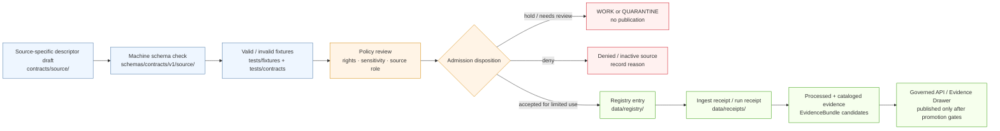

<!-- [KFM_META_BLOCK_V2]
doc_id: kfm://doc/NEEDS_VERIFICATION__contracts_source_readme
title: contracts/source
type: standard
version: v1
status: draft
owners: NEEDS_VERIFICATION__contract_source_steward
created: NEEDS_VERIFICATION__YYYY-MM-DD
updated: 2026-04-25
policy_label: NEEDS_VERIFICATION__public_or_restricted
related: [../README.md, ../../schemas/README.md, ../../schemas/contracts/v1/source/source_descriptor.schema.json, ../../data/registry/README.md, ../../policy/README.md, ../../tests/contracts/README.md, ../../tools/validators/README.md]
tags: [kfm, contracts, source, source-descriptor, source-admission, evidence-first, fail-closed]
notes: [Prepared as a repo-ready directory README for contracts/source/ from attached KFM doctrine and surfaced repo-facing documentation patterns. Current mounted repository was not available in this session; leaf inventory, owner, policy label, and active schema path remain NEEDS VERIFICATION.]
[/KFM_META_BLOCK_V2] -->

<a id="top"></a>

# `contracts/source/`

Human-readable source-admission contract lane for KFM `SourceDescriptor` meaning, source-role discipline, and fail-closed onboarding rules.

> [!IMPORTANT]
> **Status:** `experimental`  
> **Document status:** `draft`  
> **Owners:** `NEEDS VERIFICATION — contract/source steward`  
> **Path:** `contracts/source/README.md`  
> **Repo fit:** child lane under [`../README.md`](../README.md); adjacent to machine schemas in [`../../schemas/README.md`](../../schemas/README.md), source registry instances in [`../../data/registry/README.md`](../../data/registry/README.md), policy gates in [`../../policy/README.md`](../../policy/README.md), contract tests in [`../../tests/contracts/README.md`](../../tests/contracts/README.md), and validators in [`../../tools/validators/README.md`](../../tools/validators/README.md)  
> **Quick jumps:** [Scope](#scope) · [Repo fit](#repo-fit) · [Accepted inputs](#accepted-inputs) · [Exclusions](#exclusions) · [Directory tree](#directory-tree) · [Quickstart](#quickstart) · [Usage](#usage) · [Diagram](#diagram) · [Operating tables](#operating-tables) · [Task list](#task-list--definition-of-done) · [FAQ](#faq) · [Appendix](#appendix)


> [!NOTE]
> This README documents **meaning and placement**. It does not prove that validators, schemas, workflow gates, source registry entries, or source-specific descriptors already exist on the active branch. Upgrade any `NEEDS VERIFICATION` item only after inspecting the mounted repo, linked schema, fixtures, validator output, and review state.

---

## Scope

`contracts/source/` is the human-readable contract lane for source identity and admission.

It answers questions like:

- What does a source claim to be?
- What source role may it play?
- What evidence, rights, sensitivity, cadence, and attribution obligations travel with it?
- What must be checked before a source can move from **source edge** into the KFM lifecycle?
- What must never be inferred from the source merely because it is available?

This lane sits at the front of KFM’s truth path:

```text
SOURCE EDGE → RAW / WORK / QUARANTINE → PROCESSED → CATALOG / TRIPLET → PUBLISHED
```

`contracts/source/` does **not** store raw data, run connectors, make policy decisions by itself, or authorize publication. It gives maintainers the source-contract language that downstream schemas, registries, validators, policies, receipts, and release artifacts must consume.

[Back to top](#top)

---

## Repo fit

`contracts/source/` is intentionally narrow. It keeps source-admission meaning legible without turning prose into a second schema registry or a hidden ingestion system.

| Direction | Surface | Relationship |
|---|---|---|
| Parent | [`../README.md`](../README.md) | Defines the broader `contracts/` boundary: human-readable normative meaning, compatibility, and usage rules. |
| Machine shape | [`../../schemas/README.md`](../../schemas/README.md) | Machine validation belongs in schemas, not in this README. |
| Source schema target | [`../../schemas/contracts/v1/source/source_descriptor.schema.json`](../../schemas/contracts/v1/source/source_descriptor.schema.json) | Expected schema companion for `SourceDescriptor`; exact path still needs active-branch verification. |
| Source registry | [`../../data/registry/README.md`](../../data/registry/README.md) | Source descriptor instances and activation records belong in the registry, not here. |
| Policy | [`../../policy/README.md`](../../policy/README.md) | Rights, sensitivity, source-role admissibility, and publication obligations are decided there. |
| Contract tests | [`../../tests/contracts/README.md`](../../tests/contracts/README.md) | Proves schemas and contract assumptions are exercised. |
| Validators | [`../../tools/validators/README.md`](../../tools/validators/README.md) | Operationalizes checks without redefining contract meaning. |

### Placement rule

Use this directory for **source-admission contract law**. Put executable shape, emitted evidence, raw data, runtime behavior, and public release state elsewhere.

[Back to top](#top)

---

## Accepted inputs

Material belongs in `contracts/source/` when it describes the meaning, review burden, and admissible use of a source or source-admission object.

| Accepted input | Example | Why it belongs here |
|---|---|---|
| Shared source contract doc | `source_descriptor.md` | Defines the human-readable meaning of `SourceDescriptor`. |
| Source-specific descriptor doc | `kansas_mesonet_source_descriptor.md` | Records source role, cadence, rights posture, attribution, and use limits for one source. |
| Source intake contract note | `source_intake_record.md` | Describes what an intake reviewer must know before activation. |
| Source-edge receipt semantics | `ingest_receipt.md` | Explains the meaning of source fetch / upload memory when the object is contract-level. |
| Source-role vocabulary note | `source_roles.md` | Defines source-role terms without granting publication rights. |
| Compatibility or supersession note | `source_descriptor_migration.md` | Records how descriptor versions move without silently changing meaning. |

### Minimum content for a source-specific descriptor

Each source-specific descriptor should include:

- source identity and stable source key
- source role and forbidden role upgrades
- accepted evidence type
- acquisition or access method
- refresh cadence or staleness rule
- rights, license, terms, attribution, and redistribution posture
- sensitivity and public-release constraints
- spatial and temporal scope
- raw/work/quarantine handling expectations
- registry, schema, validator, policy, and fixture links
- activation state and rollback/deactivation notes

[Back to top](#top)

---

## Exclusions

Do **not** put these here.

| Excluded material | Goes instead | Reason |
|---|---|---|
| JSON Schema bodies | `../../schemas/contracts/v1/source/` | Machine shape must stay versioned and executable. |
| Valid / invalid fixtures | `../../tests/fixtures/` or schema-side fixture lane | Fixtures prove edge cases; they are not normative prose. |
| Source registry instances | `../../data/registry/` | Registry entries are source-state records, not contract definitions. |
| Raw source payloads | `../../data/raw/` or quarantine/work paths | Raw data must not sit in contract docs. |
| Connector scripts or watchers | `../../pipelines/`, `../../tools/`, or app-specific paths | Execution belongs outside contract prose. |
| Policy rules | `../../policy/` | Allow, deny, restrict, and review obligations must be centralized. |
| Runtime envelopes | `../runtime/` or schema/runtime paths | Runtime payloads consume source contracts; they do not redefine them. |
| Release manifests or proof packs | `../../data/proofs/`, `../../data/catalog/`, or `../release/` | Publication evidence is downstream of source admission. |
| Secrets, tokens, keys, credentials | Nowhere in repo docs | Source access secrets must never be documented here. |

> [!WARNING]
> A source being listed in `contracts/source/` does **not** mean it is active, trusted, current, legally reusable, public-safe, or publication-ready.

[Back to top](#top)

---

## Directory tree

Current mounted leaf inventory is **NEEDS VERIFICATION**. The target shape below is the intended directory role, not proof that every file exists.

```text
contracts/source/
├── README.md
├── source_descriptor.md                 # PROPOSED shared source-admission contract
├── source_intake_record.md              # PROPOSED intake-review contract
├── ingest_receipt.md                    # PROPOSED source-edge receipt semantics
├── source_roles.md                      # PROPOSED controlled vocabulary / review note
├── kansas_mesonet_source_descriptor.md  # NEEDS VERIFICATION example source descriptor
└── <source>_source_descriptor.md        # Pattern for source-specific descriptors
```

### Naming convention

Use lowercase, underscore-separated names for source-specific descriptors:

```text
<source_key>_source_descriptor.md
```

Examples:

```text
kansas_mesonet_source_descriptor.md
usgs_wbd_source_descriptor.md
smap_source_descriptor.md
ebird_source_descriptor.md
```

Keep the source key stable once downstream registry entries, fixtures, receipts, or evidence references point at it.

[Back to top](#top)

---

## Quickstart

Use this sequence after mounting the actual KFM repository.

```bash
# 1. Confirm the checkout and branch state.
git status --short
git branch --show-current

# 2. Inspect this lane and nearby contract/schema boundaries.
find contracts/source -maxdepth 1 -type f | sort
sed -n '1,140p' contracts/source/README.md
sed -n '1,140p' contracts/README.md

# 3. Verify expected companion surfaces without assuming they exist.
test -f schemas/contracts/v1/source/source_descriptor.schema.json \
  && echo "CONFIRMED schema companion" \
  || echo "NEEDS VERIFICATION: schema companion path not found"

test -d data/registry \
  && echo "CONFIRMED source registry surface" \
  || echo "NEEDS VERIFICATION: data/registry surface not found"

test -d tests/contracts \
  && echo "CONFIRMED contract test surface" \
  || echo "NEEDS VERIFICATION: tests/contracts surface not found"
```

> [!TIP]
> Start with read-only inspection. Do not activate live source fetches, publish source-derived artifacts, or upgrade descriptor status during a README-only change.

[Back to top](#top)

---

## Usage

### 1. Author a source-specific descriptor

Create a source descriptor only when the source’s role and burden are clear enough to review.

```markdown
# <Source Name> Source Descriptor

One-line purpose describing what evidence this source may contribute.

## Status

| Field | Value |
|---|---|
| Contract status | PROPOSED |
| Source activation | inactive |
| Public release allowed | NEEDS VERIFICATION |
| Source role | NEEDS VERIFICATION |
| Steward / owner | NEEDS VERIFICATION |

## Source identity

- `source_id`: `kfm://source/<source-key>`
- `source_key`: `<source-key>`
- `source_name`: `<human-readable-name>`
- `source_home`: `<official or internal reference — do not paste secrets>`

## Accepted use

Describe the narrow source role.

## Forbidden use

Describe what this source must not be used to prove.

## Rights and sensitivity

Record rights, attribution, redistribution, location sensitivity, living-person sensitivity, cultural sensitivity, or other limits.

## Companion surfaces

- Schema: `../../schemas/contracts/v1/source/source_descriptor.schema.json`
- Registry: `../../data/registry/`
- Policy: `../../policy/`
- Fixtures: `../../tests/fixtures/`
- Validator: `../../tools/validators/`
```

### 2. Keep source role visible

Do not let a source-specific descriptor become a generic trust label.

| Source class | Safe wording | Unsafe wording |
|---|---|---|
| Direct observation | “May support observed measurement claims within stated scope.” | “Authoritative truth.” |
| Aggregator | “May provide aggregation context subject to source and license constraints.” | “Primary source.” |
| Model / derived product | “May provide modeled context with uncertainty and versioning.” | “Observed condition.” |
| Regulatory / administrative source | “May support regulatory or administrative status claims.” | “Physical event evidence.” |
| Stewarded or sensitive source | “Requires review, redaction, or access control before public use.” | “Public layer.” |

### 3. Treat unknown rights as blocking

Unknown source rights are not a documentation inconvenience. They are a release blocker.

```text
rights_status = UNKNOWN
public_release_allowed = false
required_action = NEEDS_VERIFICATION
```

[Back to top](#top)

---

## Diagram



[Back to top](#top)

---

## Operating tables

### Contract / schema / registry split

| Surface | Owns | Does not own |
|---|---|---|
| `contracts/source/` | Human-readable meaning, source role, lifecycle expectations, compatibility notes | Machine validation, source activation, raw payloads, policy decisions |
| `schemas/contracts/v1/source/` | JSON Schema or equivalent machine shape | Narrative source burden or legal interpretation |
| `data/registry/` | Concrete source records and activation state | Contract semantics or schema definitions |
| `policy/` | Allow / deny / restrict / review obligations | Source description prose |
| `tests/` | Fixture-backed proof of allowed and disallowed cases | New source meanings |
| `tools/validators/` | Executable checks and reports | Canonical contract law |
| `data/receipts/` | Process memory from intake, fetch, validation, or run steps | Source definitions |
| `data/proofs/` / `data/catalog/` | Release-grade proof and catalog closure | Source onboarding law |

### Source descriptor review burden

| Review question | Required posture |
|---|---|
| Is the source identity stable? | Do not proceed without a stable source key or explicit temporary status. |
| Is `source_role` explicit? | Required. No generic “trusted source” wording. |
| Are rights and attribution known? | Unknown rights block public release. |
| Is sensitivity known? | Unknown sensitivity defaults to hold or restricted handling. |
| Is spatial precision safe? | Public exact geometry requires explicit review. |
| Is temporal scope known? | Stale or undated sources must not support current-state claims. |
| Is acquisition method bounded? | Live fetch, manual upload, archive import, and API access must be distinct. |
| Are schema, fixtures, validator, and policy linked? | Required before activation; placeholders allowed only while draft. |
| Is rollback/deactivation documented? | Required before a source becomes active. |

### Truth labels for this lane

| Label | Use in `contracts/source/` |
|---|---|
| `CONFIRMED` | Verified from mounted repo files, reviewed source terms, emitted artifacts, or accepted policy decisions. |
| `INFERRED` | Reasonable from adjacent repo evidence but not directly proven in this lane. |
| `PROPOSED` | Draft source descriptor, contract, field, or rule not yet accepted. |
| `UNKNOWN` | Not verified strongly enough to use as fact. |
| `NEEDS VERIFICATION` | Concrete review item required before activation or release. |
| `DENY` | Source use or publication is blocked by policy, rights, sensitivity, or evidence failure. |

[Back to top](#top)

---

## Task list — definition of done

A `contracts/source/` change is ready for review when:

- [ ] KFM Meta Block v2 is present and synchronized with the visible title.
- [ ] Status is not upgraded beyond evidence.
- [ ] Owner is confirmed or left as an explicit placeholder.
- [ ] Source role is explicit and narrow.
- [ ] Forbidden uses are listed.
- [ ] Rights, attribution, sensitivity, and public-release posture are stated.
- [ ] Linked schema path is present or marked `NEEDS VERIFICATION`.
- [ ] Valid and invalid fixture expectations are linked or requested.
- [ ] Policy obligations are linked or requested.
- [ ] Validator expectations are linked or requested.
- [ ] Registry placement is clear.
- [ ] No raw data, secrets, API keys, tokens, or unreviewed source payloads are included.
- [ ] Descriptor status and source activation state are separate.
- [ ] Unknown rights or sensitivity fail closed.
- [ ] Rollback, retirement, or deactivation notes are included.
- [ ] Adjacent docs that should link here are identified for follow-up.

[Back to top](#top)

---

## FAQ

### Does a descriptor in this directory make a source active?

No. A descriptor describes source meaning and burden. Activation requires registry state, schema validation, policy review, fixture coverage, and any required steward approval.

### Can this directory contain source data examples?

Only tiny illustrative snippets may appear when they clarify field meaning and do not carry rights, privacy, sensitivity, or raw-payload risk. Prefer fixtures in the test or schema fixture lane.

### Why not put the schema directly beside the prose?

KFM separates human-readable meaning from machine validation. `contracts/` explains what the object means; `schemas/` defines how an object must validate; `policy/` decides whether it is allowed; `tests/` and `tools/validators/` prove the enforcement path.

### What happens when source rights are unclear?

Keep the descriptor draft or inactive. Mark public release as blocked or `NEEDS VERIFICATION`. Do not rely on a source with unknown rights for public or semi-public publication.

### Can a model output become a source descriptor?

No. Model outputs may be evidence-adjacent or interpretive artifacts only when governed by their own runtime, receipt, policy, and evidence rules. A source descriptor should identify source systems, datasets, archives, APIs, institutions, or stewarded source families—not generated language as root truth.

### What should reviewers look for first?

Look for source-role drift. Most failures begin when an observation, model, aggregator, regulatory layer, or cultural/stewarded record is silently promoted into a broader authority class than it can support.

[Back to top](#top)

---

## Appendix

<details>
<summary><strong>Appendix A — Source descriptor card template</strong></summary>

```markdown
# <Source Name> Source Descriptor

One-line purpose.

## Status

| Field | Value |
|---|---|
| Contract status | PROPOSED |
| Source activation | inactive |
| Source role | NEEDS VERIFICATION |
| Rights status | NEEDS VERIFICATION |
| Public release allowed | false |
| Steward / owner | NEEDS VERIFICATION |

## Source identity

| Field | Value |
|---|---|
| `source_id` | `kfm://source/<source-key>` |
| `source_key` | `<source-key>` |
| `source_name` | `<display name>` |
| `source_family` | `<agency/archive/api/model/aggregator/stewarded/etc>` |

## Accepted use

- `<narrow claim class this source may support>`

## Forbidden use

- `<claim class this source must not support>`

## Rights, attribution, and sensitivity

- Rights:
- Attribution:
- Redistribution:
- Sensitivity:
- Public precision:
- Review required:

## Lifecycle expectations

- Source edge:
- RAW landing:
- WORK / QUARANTINE:
- PROCESSED:
- CATALOG / PUBLISHED:

## Companion surfaces

- Schema:
- Registry:
- Fixtures:
- Validator:
- Policy:
- Receipts:
- EvidenceBundle links:

## Rollback / deactivation

Describe when to deactivate, quarantine, supersede, or withdraw source-derived outputs.
```

</details>

<details>
<summary><strong>Appendix B — Review anti-patterns</strong></summary>

| Anti-pattern | Why it is unsafe | Correct posture |
|---|---|---|
| “This API exists, so KFM can publish it.” | Availability does not prove rights, sensitivity, role, or review state. | Verify rights, source role, cadence, policy, and release gates. |
| “The source is official, so all claims are authoritative.” | Official sources may only be official for a narrow claim class. | Name the exact authority scope. |
| “Descriptor active means public-safe.” | Activation and public release are different states. | Keep `source_activation` and `public_release_allowed` separate. |
| “Runtime can reinterpret source role.” | Runtime consumes contracts; it does not redefine source law. | Update the source contract and schema/policy companions. |
| “Unknown license is acceptable for testing.” | Tests can leak future assumptions into release paths. | Use synthetic fixtures or hold as `NEEDS VERIFICATION`. |

</details>

<details>
<summary><strong>Appendix C — Pre-publish checklist</strong></summary>

| Check | Status |
|---|---|
| Badges present | yes |
| Owners present | placeholder, needs verification |
| Status present | yes |
| Quick jumps present | yes |
| Required README minimums included | yes |
| Directory tree included | yes |
| Quickstart included | yes |
| Mermaid diagram included | yes |
| Tables used for placement and review burden | yes |
| Task list includes definition of done | yes |
| Code fences language-tagged | yes |
| Long appendix wrapped in details | yes |
| Relative links used | yes |
| Sensitive or uncertain claims labeled | yes |

</details>

[Back to top](#top)
