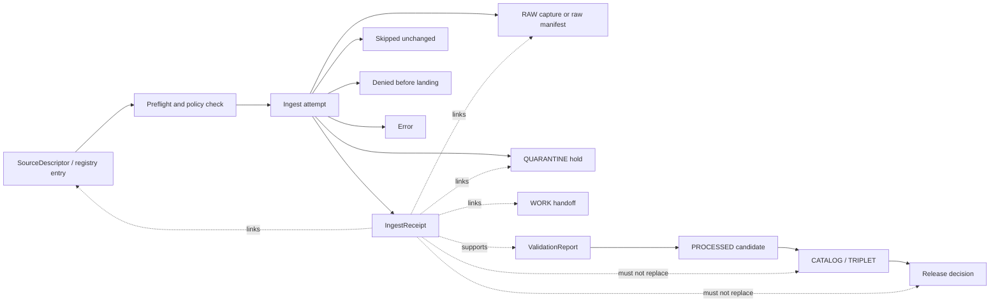

<!-- [KFM_META_BLOCK_V2] doc_id: kfm://doc/TODO title: Ingest Receipt Contract type: standard version: v1 status: draft owners: TODO created: TODO updated: TODO policy_label: public related: [contracts/README.md, contracts/source/source_descriptor.md, schemas/contracts/v1/source/ingest_receipt.schema.json, data/receipts/README.md, data/receipts/ingest/README.md, policy/README.md, tools/validators/README.md] tags: [kfm, contracts, source, ingest, receipts] notes: [draft contract; companion schema, fixtures, validator, and policy checks still required] [/KFM_META_BLOCK_V2] -->

# Ingest Receipt Contract

One-line purpose: define the human-readable contract for KFM source-ingest receipts so every source-edge landing, skip, denial, quarantine, or error can be reconstructed without turning the receipt into source truth, release proof, or policy authority.


> [!IMPORTANT]
> An `IngestReceipt` is process memory for a specific source-edge ingest event.
> It records what was attempted, what was observed, what landed or did not land, what policy-sensitive posture was known, and what handoff happened next.
>
> It is not a `SourceDescriptor`, not a raw archive, not an `EvidenceBundle`, not a `ValidationReport`, not a `ReleaseManifest`, and not publication proof.

---

## Quick jumps

- [Authority statement](#authority-statement)
- [Repo fit](#repo-fit)
- [Lifecycle position](#lifecycle-position)
- [Accepted inputs](#accepted-inputs)
- [Exclusions](#exclusions)
- [Receipt outcomes](#receipt-outcomes)
- [Required field groups](#required-field-groups)
- [Identity and hashing](#identity-and-hashing)
- [Sensitivity and redaction rules](#sensitivity-and-redaction-rules)
- [Minimal example](#minimal-example)
- [Validation expectations](#validation-expectations)
- [Compatibility and versioning](#compatibility-and-versioning)
- [Task list and definition of done](#task-list-and-definition-of-done)

---

## Authority statement

`contracts/source/ingest_receipt.md` is authoritative for the meaning, lifecycle role, required linkages, compatibility expectations, and review obligations of the `IngestReceipt` object family.

It does **not** own machine shape, emitted receipt storage, policy decisions, connector implementation, workflow orchestration, or release approval.

| Surface | Owns | Must not silently own |
|---|---|---|
| `contracts/source/ingest_receipt.md` | object meaning, field intent, lifecycle role, compatibility posture | JSON Schema enforcement, emitted receipt instances, policy decisions |
| `schemas/contracts/v1/source/ingest_receipt.schema.json` | machine-checkable shape | source authority, source rights, publication approval |
| `data/receipts/ingest/` | emitted ingest receipt instances, if this storage path is accepted | contract meaning, raw data, release proof |
| `data/raw/` | immutable source-native captures or capture manifests | contract definitions or policy decisions |
| `data/quarantine/` | held source material or candidate artifacts blocked by rights, sensitivity, validation, or uncertainty | public release or proof of truth |
| `policy/` | allow, deny, restrict, abstain, obligation, and publication-admissibility logic | schema definitions or emitted data storage |
| `tools/validators/` and `tests/` | executable checks and fixtures | semantic authority or release approval |

> [!WARNING]
> If an ingest receipt begins to act like a release proof, raw archive, source descriptor, policy decision, or EvidenceBundle, the boundary has slipped.

---

## Repo fit

| Field | Value |
|---|---|
| Path | `contracts/source/ingest_receipt.md` |
| Object family | `IngestReceipt` |
| Authority class | human-readable contract |
| Storage target for emitted instances | `data/receipts/ingest/` or repo-accepted equivalent |
| Machine schema companion | `schemas/contracts/v1/source/ingest_receipt.schema.json` |
| Fixture companion | `schemas/tests/fixtures/source/ingest_receipt/` or repo-accepted equivalent |
| Validator companion | `tools/validators/` or repo-accepted equivalent |
| Policy adjacency | source-intake, rights, sensitivity, network, quarantine, and publication gates |
| Current maturity | draft contract; implementation and enforcement require verification |

---

## Lifecycle position

An ingest receipt belongs at the seam between source admission and lifecycle landing.



The receipt records the ingest event and its immediate consequences. Later stages must still produce their own validation reports, dataset versions, catalog records, proof packs, release manifests, review records, and correction notices where applicable.

---

## Accepted inputs

Use this contract for the smallest reviewable source-edge process-memory artifact needed to reconstruct an ingest event.

| Input class | Examples | Why it belongs in an ingest receipt |
|---|---|---|
| Source admission reference | `source_descriptor_ref`, registry entry ref, source family, source role | Ties the event to the source authority and rights context that governed it |
| Ingest attempt metadata | emitter, run id, attempt id, started/finished timestamps | Makes the event auditable and reproducible |
| Request summary | endpoint reference, method, query hash, conditional-fetch hints | Explains what was attempted without leaking secrets or brittle private URLs |
| Transport memory | status code, selected response headers, ETag/Last-Modified hash or redacted value | Explains skip, retry, landing, or quarantine decisions |
| Content identity | byte count, media type, raw digest, canonical digest where applicable | Lets reviewers tie process memory to the landed artifact |
| Landing linkage | raw object manifest ref, raw capture digest, quarantine ref, work handoff ref | Connects the receipt to lifecycle surfaces without storing data here |
| Rights and sensitivity snapshot | inherited source rights posture, sensitivity posture, obligations, uncertainty flags | Ensures unclear rights or sensitivity cannot disappear during ingest |
| Decision outcome | landed, skipped unchanged, quarantined, denied, or error | Keeps finite ingest outcomes reviewable |
| Audit linkage | run receipt ref, validation precheck ref, issue/PR ref, reviewer note ref | Allows later replay, correction, and release review |

---

## Exclusions

Do **not** put these in an ingest receipt.

| Excluded item | Use instead | Reason |
|---|---|---|
| Source-native bytes, copied datasets, archives, imagery, PDFs, shapefiles, CSVs, or tiles | `data/raw/` or controlled object storage reference | Receipt storage must stay small, diff-friendly, and reviewable |
| Secrets, tokens, credentials, session cookies, private endpoints, signed URLs, or private service URLs | secret manager, environment configuration, or redacted external reference | Auditability is not permission to leak operational secrets |
| Full request or response bodies | raw capture, raw manifest, or redacted fixture | Receipts summarize; they do not store source data |
| Policy source code or allow/deny logic | `policy/` | Policy remains independently reviewable and executable |
| Release proof, signatures, attestations, or proof packs | proof / release lanes | Receipts are process memory, not release proof |
| EvidenceBundle payloads | `contracts/evidence/` and evidence storage lanes | EvidenceBundle resolves evidence; an ingest receipt only records source-edge process memory |
| Public map layer definitions | layer registry / delivery contracts | Ingest memory is upstream of public rendering |
| Model output or AI summaries | governed AI runtime envelope and `ai_receipt` | AI is interpretive and downstream of evidence and policy |

---

## Receipt outcomes

Every `IngestReceipt` must use a finite outcome.

| Outcome | Meaning | Required linkage |
|---|---|---|
| `LANDED_RAW` | Source material landed in RAW or a raw object manifest was created | `raw_object_ref` or `raw_manifest_ref` |
| `SKIPPED_UNCHANGED` | Conditional fetch or content comparison found no material change | prior receipt ref and comparison basis |
| `QUARANTINED` | Material was captured or observed but blocked by rights, sensitivity, validation, confidence, or source-role uncertainty | `quarantine_ref` and deny/hold reasons |
| `DENIED_PRE_INGEST` | Policy, access, source status, rights, sensitivity, credentials, or endpoint posture blocked the fetch before landing | policy decision ref or denial reason |
| `ERROR` | System, transport, parser, storage, or validation failure prevented a trustworthy ingest result | error class and retry posture |
| `MANUAL_REVIEW_REQUIRED` | The event cannot safely continue without steward review | review ref or review queue ref |

`LANDED_RAW` does not mean published, validated, authoritative, or safe for public use. It only means a source-edge landing event occurred.

---

## Required field groups

The machine schema companion should enforce these field groups. This Markdown file defines meaning; the JSON Schema defines shape.

### 1. Object identity

| Field | Requirement | Meaning |
|---|---:|---|
| `receipt_id` | required | Stable identifier for this ingest event receipt |
| `object_family` | required | Must be `IngestReceipt` |
| `schema_ref` | required | Machine schema used to validate this receipt |
| `schema_version` | required | Version of the machine schema |
| `spec_hash` | required | Stable hash for the contract/schema bundle used by the emitting tool |
| `created_at` | required | UTC timestamp when the receipt object was emitted |

### 2. Event timing and emitter

| Field | Requirement | Meaning |
|---|---:|---|
| `ingest_started_at` | required | UTC timestamp when the attempt began |
| `ingest_finished_at` | required unless `ERROR` prevents completion | UTC timestamp when the attempt ended |
| `emitter.tool_name` | required | Tool, watcher, connector, or manual process that emitted the receipt |
| `emitter.tool_version` | required when known | Version or build reference for the emitting tool |
| `emitter.run_ref` | required when available | Link to a `run_receipt`, workflow run, or local dry-run receipt |
| `emitter.mode` | required | `no_network_fixture`, `live_fetch`, `manual_drop`, `cache_replay`, or `batch_import` |

### 3. Source linkage

| Field | Requirement | Meaning |
|---|---:|---|
| `source_descriptor_ref` | required | Stable ref to the governing `SourceDescriptor` |
| `source_descriptor_hash` | required when descriptor is available | Digest of the descriptor used during this event |
| `source_family` | required | Source family or lane, such as `hydrology`, `flora`, `transport`, or `source_fixture` |
| `source_id` | required | Stable source identifier from the registry |
| `source_role` | required | Role asserted by the source descriptor, such as authoritative, contextual, observational, model-derived, regulatory, or unknown |
| `source_rights_posture` | required | Rights posture inherited or resolved at ingest time |
| `source_sensitivity_posture` | required | Sensitivity posture inherited or resolved at ingest time |

If the source descriptor is missing, stale, unresolved, or not admitted, the receipt outcome must not be `LANDED_RAW` unless a documented steward exception is attached.

### 4. Request summary

| Field | Requirement | Meaning |
|---|---:|---|
| `request.method` | required for network fetch | HTTP method or equivalent source-access action |
| `request.endpoint_ref` | required for network fetch | Redacted endpoint reference, not a secret URL |
| `request.query_hash` | required when query params affect content | Hash of canonicalized query parameters |
| `request.auth_mode` | required | `none`, `public_token_redacted`, `credentialed_redacted`, `manual`, or `unknown` |
| `request.conditional_fetch` | optional | ETag, Last-Modified, cache key, or prior digest strategy, redacted or hashed |
| `request.network_allowed` | required | Whether this attempt used network access under current policy |

### 5. Response and observation summary

| Field | Requirement | Meaning |
|---|---:|---|
| `response.status_code` | required for network fetch | HTTP status code or source-system equivalent |
| `response.media_type` | required when content was observed | Reported or inferred media type |
| `response.content_length` | required when known | Byte count reported by source or observed by capture |
| `response.etag_hash` | optional | Hash of ETag if retained; avoid raw values where unsafe |
| `response.last_modified` | optional | Source-reported modification time when safe and meaningful |
| `response.observed_at` | required | UTC timestamp when the source response or manual input was observed |
| `response.freshness_status` | required | `fresh`, `stale`, `unknown`, `not_applicable`, or `needs_verification` |

### 6. Content identity and landing

| Field | Requirement | Meaning |
|---|---:|---|
| `content.raw_sha256` | required when bytes landed | Digest of source-native captured bytes |
| `content.canonical_sha256` | required when canonicalization occurred | Digest after canonicalization or normalization |
| `content.byte_count` | required when bytes landed | Observed byte count |
| `content.capture_format` | required when bytes landed | Source-native capture format |
| `landing.lifecycle_zone` | required | `RAW`, `QUARANTINE`, `NONE`, or repo-accepted equivalent |
| `landing.raw_object_ref` | required for `LANDED_RAW` when direct object exists | Stable ref to raw capture |
| `landing.raw_manifest_ref` | required when manifest captures multiple files/assets | Stable ref to raw object manifest |
| `landing.quarantine_ref` | required for `QUARANTINED` | Stable ref to quarantine hold |
| `landing.work_handoff_ref` | optional | Ref to downstream work item, parser run, or validation queue |

### 7. Decision, obligations, and reasons

| Field | Requirement | Meaning |
|---|---:|---|
| `outcome` | required | One finite receipt outcome |
| `decision_reasons` | required | Short reason codes explaining the outcome |
| `policy_decision_ref` | required for deny, quarantine, or review outcomes when policy exists | Link to policy decision or gate output |
| `obligations` | required, may be empty | Attribution, redaction, review, retention, freshness, or no-publication obligations |
| `retry_posture` | required | `retry_allowed`, `manual_review_first`, `do_not_retry`, or `not_applicable` |

### 8. Audit and correction linkage

| Field | Requirement | Meaning |
|---|---:|---|
| `audit.actor_ref` | required for manual events | Human, bot, or service actor reference |
| `audit.pr_ref` | optional | Pull request or change reference |
| `audit.issue_ref` | optional | Issue, incident, or verification backlog reference |
| `audit.previous_receipt_ref` | required for skip/change comparison when available | Previous receipt used for comparison |
| `audit.correction_ref` | optional | Correction notice or supersession reference |
| `audit.notes` | optional | Short non-sensitive reviewer/operator note |

---

## Identity and hashing

`receipt_id` should be deterministic where practical, but it must not require storing unsafe values.

Recommended pattern:

```text
kfm://receipt/ingest/<source_family>/<source_id>/<yyyy-mm-dd>/<short-hash>
```

The `<short-hash>` should be derived from a canonical JSON serialization of safe identity fields, such as:

```text
source_descriptor_ref
source_descriptor_hash
ingest_started_at
request.method
request.endpoint_ref
request.query_hash
response.status_code
content.raw_sha256
outcome
```

Hashing requirements:

1. Hash source-native bytes with SHA-256 when bytes land.
2. Hash canonicalized parameters instead of storing sensitive query strings.
3. Hash or redact headers that can identify credentials, sessions, private endpoints, or sensitive access patterns.
4. Keep `spec_hash` separate from content hashes.
5. Do not treat a matching content hash as proof of public release eligibility.

---

## Sensitivity and redaction rules

Ingest receipts are reviewable process memory, not a license to reveal operational or sensitive details.

Fail closed when any of these are unclear:

- source rights
- source role
- endpoint terms
- credentials or token handling
- exact sensitive geometry
- rare species locations
- archaeological or culturally sensitive locations
- critical infrastructure exposure
- living-person, DNA, genealogy, or private landowner exposure
- private service URLs or home-network endpoints
- steward review requirements

Minimum redaction posture:

| Risk | Required receipt behavior |
|---|---|
| Secret or credential present | Do not store; record `auth_mode` as redacted |
| Private endpoint or signed URL | Store `endpoint_ref`, not the URL |
| Exact sensitive geometry | Store redacted/generalized ref or quarantine ref only |
| Unknown rights | Outcome must be `QUARANTINED`, `DENIED_PRE_INGEST`, or `MANUAL_REVIEW_REQUIRED` |
| Unknown source role | Do not use the receipt to support authoritative claims |
| Cultural/steward review required | Attach review obligation and block public path |

---

## Minimal example

This example is illustrative. It is not a substitute for the companion JSON Schema and should not be treated as an emitted receipt.

```json
{
  "receipt_id": "kfm://receipt/ingest/source_fixture/demo_source/2026-04-25/0f4c2a19b7e1",
  "object_family": "IngestReceipt",
  "schema_ref": "schemas/contracts/v1/source/ingest_receipt.schema.json",
  "schema_version": "v1",
  "spec_hash": "sha256:TODO",
  "created_at": "2026-04-25T00:00:00Z",
  "ingest_started_at": "2026-04-25T00:00:00Z",
  "ingest_finished_at": "2026-04-25T00:00:03Z",
  "emitter": {
    "tool_name": "kfm-source-fixture-loader",
    "tool_version": "TODO",
    "run_ref": "kfm://receipt/run/TODO",
    "mode": "no_network_fixture"
  },
  "source_descriptor_ref": "kfm://source/source_fixture/demo_source",
  "source_descriptor_hash": "sha256:TODO",
  "source_family": "source_fixture",
  "source_id": "demo_source",
  "source_role": "contextual",
  "source_rights_posture": "verified_for_fixture",
  "source_sensitivity_posture": "public_safe_fixture",
  "request": {
    "method": "fixture_read",
    "endpoint_ref": "fixture://source_fixture/demo_source",
    "query_hash": "sha256:not_applicable",
    "auth_mode": "none",
    "conditional_fetch": {
      "strategy": "prior_digest_compare",
      "prior_receipt_ref": null
    },
    "network_allowed": false
  },
  "response": {
    "status_code": 200,
    "media_type": "application/json",
    "content_length": 128,
    "etag_hash": null,
    "last_modified": null,
    "observed_at": "2026-04-25T00:00:02Z",
    "freshness_status": "not_applicable"
  },
  "content": {
    "raw_sha256": "sha256:TODO",
    "canonical_sha256": "sha256:TODO",
    "byte_count": 128,
    "capture_format": "json"
  },
  "landing": {
    "lifecycle_zone": "RAW",
    "raw_object_ref": "kfm://raw/source_fixture/demo_source/TODO",
    "raw_manifest_ref": "kfm://raw-manifest/source_fixture/demo_source/TODO",
    "quarantine_ref": null,
    "work_handoff_ref": "kfm://work/source_fixture/demo_source/TODO"
  },
  "outcome": "LANDED_RAW",
  "decision_reasons": [
    "fixture_source_admitted",
    "rights_verified_for_fixture",
    "no_sensitive_geometry"
  ],
  "policy_decision_ref": "kfm://policy-decision/source-intake/TODO",
  "obligations": [
    {
      "type": "attribution",
      "value": "Fixture source for contract validation only"
    }
  ],
  "retry_posture": "not_applicable",
  "audit": {
    "actor_ref": "kfm://actor/TODO",
    "pr_ref": null,
    "issue_ref": null,
    "previous_receipt_ref": null,
    "correction_ref": null,
    "notes": "Illustrative no-network fixture receipt."
  }
}
```

---

## Validation expectations

A contract-ready implementation should add or verify all of the following.

| Check | Expected behavior |
|---|---|
| Schema validation | Valid receipts pass; missing required field groups fail |
| Outcome linkage | `LANDED_RAW` requires raw object or manifest ref |
| Quarantine linkage | `QUARANTINED` requires quarantine ref and reason |
| Deny linkage | `DENIED_PRE_INGEST` requires denial reason and policy ref when policy exists |
| Secret scan | Tokens, signed URLs, private endpoints, and credential-like values are rejected or redacted |
| Source descriptor resolution | `source_descriptor_ref` resolves to an admitted descriptor or receipt fails/holds |
| Rights posture | unknown rights cannot produce public-safe handoff |
| Sensitivity posture | exact sensitive geometry cannot be stored or promoted through receipt content |
| Digest check | landed raw digest matches raw manifest digest |
| Prior receipt comparison | skipped unchanged receipts name comparison basis |
| Lifecycle boundary | receipt does not contain raw payload bytes or release proof payloads |

Proposed local checks after the companion schema and fixtures exist:

```bash
# Inspect contract and schema surfaces together.
sed -n '1,260p' contracts/source/ingest_receipt.md
sed -n '1,260p' schemas/contracts/v1/source/ingest_receipt.schema.json

# Validate valid and invalid fixtures with the repo-accepted schema validator.
find schemas/tests/fixtures/source/ingest_receipt -type f | sort

# Search for accidental leakage in receipt fixtures.
grep -RInE 'token=|Authorization|Bearer |password|secret|signedUrl|X-Api-Key|private endpoint' \
  schemas/tests/fixtures/source/ingest_receipt data/receipts/ingest 2>/dev/null || true

# Confirm contract/schema/policy/test adjacency.
git grep -nE 'IngestReceipt|ingest_receipt|source_descriptor_ref|raw_manifest_ref|quarantine_ref|spec_hash' -- \
  contracts schemas policy tests tools data docs .github
```

---

## Compatibility and versioning

The first accepted version should be `v1`.

Additive changes are allowed when they do not weaken required linkage, policy posture, redaction behavior, or lifecycle separation.

Breaking changes require:

1. updated contract version;
2. updated JSON Schema;
3. valid and invalid fixtures;
4. validator update;
5. migration note;
6. compatibility statement for existing emitted receipts;
7. rollback path;
8. maintainer review.

A receipt emitted under an older schema may remain useful as lineage, but it must not be silently upgraded to release support without validation under the current promotion rules.

---

## Anti-patterns

Reject or quarantine changes that do any of the following:

- store source-native payloads inside the receipt;
- expose credentials, private endpoints, signed URLs, or token-bearing headers;
- treat a receipt as proof of public release;
- treat a receipt as an EvidenceBundle;
- allow unknown rights to proceed as public-safe;
- allow unknown source role to support authoritative claims;
- publish exact sensitive geometry through receipt content;
- skip SourceDescriptor linkage;
- skip raw digest or manifest linkage for landed content;
- let workflow YAML define receipt semantics;
- let connector code define a new receipt shape without updating this contract and the schema companion.

---

## Task list and definition of done

For this contract page:

- [ ] Confirm active checkout branch and dirty state before editing.
- [ ] Verify whether `contracts/source/ingest_receipt.md` is already populated on the target branch.
- [ ] Verify `contracts/source/README.md` and adjacent source contract conventions.
- [ ] Add or update `schemas/contracts/v1/source/ingest_receipt.schema.json`.
- [ ] Add valid fixture: minimal `LANDED_RAW`.
- [ ] Add valid fixture: `SKIPPED_UNCHANGED`.
- [ ] Add valid fixture: `QUARANTINED` with rights or sensitivity hold.
- [ ] Add invalid fixture: missing `source_descriptor_ref`.
- [ ] Add invalid fixture: `LANDED_RAW` without raw object or raw manifest ref.
- [ ] Add invalid fixture: credential or signed URL leakage.
- [ ] Add validator or test coverage for finite outcomes and lifecycle linkage.
- [ ] Add policy test for unknown rights and unknown sensitivity fail-closed behavior.
- [ ] Cross-link source descriptor, receipts, raw, quarantine, validation, catalog, proof, and release docs.
- [ ] Record unresolved schema-home or fixture-home ambiguity in an ADR or verification backlog item.
- [ ] Document rollback: revert this contract, companion schema, fixtures, validators, and policy tests together.

Done means the contract, schema, fixtures, validator behavior, policy checks, and adjacent README links agree on what an `IngestReceipt` is and what it is not.
