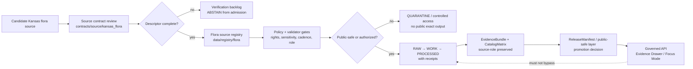

<!-- [KFM_META_BLOCK_V2]
doc_id: kfm://doc/NEEDS-VERIFICATION__contracts_source_kansas_flora_readme
title: Kansas Flora Source Contracts
type: standard
version: v1
status: draft
owners: NEEDS-VERIFICATION__flora-steward
created: NEEDS-VERIFICATION__YYYY-MM-DD
updated: 2026-04-25
policy_label: NEEDS-VERIFICATION__public-doc--restricted-source-details
related: [../../README.md, ../../../docs/domains/flora/SOURCE_REGISTRY.md, ../../../docs/adr/ADR-flora-source-roles.md, ../../../docs/adr/ADR-flora-sensitive-location-policy.md, ../../../data/registry/flora/sources.yaml, ../../../schemas/contracts/v1/flora/README.md, ../../../policy/flora/README.md, ../../../tests/fixtures/flora/README.md]
tags: [kfm, contracts, source, flora, biodiversity, source-descriptor]
notes: [Repo tree and CODEOWNERS were not mounted during authoring; sibling inventory needs verification., Related paths reflect proposed KFM Flora blueprint homes and must be reconciled before merge., This README governs source admission contracts and must not contain source data, secrets, or exact sensitive locations.]
[/KFM_META_BLOCK_V2] -->

<a id="top"></a>

# Kansas Flora Source Contracts

Source-admission contracts for Kansas flora evidence, rights, sensitivity, cadence, authority boundary, and public-safe publication posture.

> [!IMPORTANT]
> **Status:** `experimental`  
> **Owners:** `NEEDS VERIFICATION — flora/source-contract steward`  
> **Path:** `contracts/source/kansas_flora/README.md`  
> **Policy posture:** fail closed when source role, rights, sensitivity, cadence, or publication intent is unknown.  
>
> 
> 
> 
> 
>
> **Quick jumps:** [Scope](#scope) · [Repo fit](#repo-fit) · [Accepted inputs](#accepted-inputs) · [Exclusions](#exclusions) · [Directory tree](#directory-tree) · [Source roles](#source-roles) · [Admission gates](#admission-gates) · [Descriptor example](#descriptor-example) · [Validation](#validation) · [Open verification](#open-verification)

---

## Scope

`contracts/source/kansas_flora/` is the **source-contract leaf** for Kansas flora source admission.

It answers one narrow question:

> Can a candidate flora source enter the KFM governed lifecycle, and under what authority, rights, sensitivity, precision, cadence, and review constraints?

It does **not** decide that a plant occurrence is true, publishable, current, or visible at exact precision. Those decisions require downstream validation, policy, EvidenceBundle resolution, catalog/proof closure, review state, and release state.

| Claim | Status | Meaning here |
|---|---:|---|
| KFM doctrine is evidence-first, map-first, time-aware, governed, auditable, and reversible. | CONFIRMED | This README preserves that doctrine for flora source admission. |
| Current sibling files in this exact directory are known. | UNKNOWN | The repository tree was not mounted during authoring. |
| This directory should carry source-admission documentation and examples. | PROPOSED | Use this README as the local contract orientation until repo evidence confirms or revises placement. |
| Exact sensitive flora coordinates may appear here. | DENY | This README and its examples must remain public-safe. |

[Back to top](#top)

---

## Repo fit

This README is a README-like directory landing file. Its job is orientation, boundary setting, and review guidance for the source-contract leaf.

| Surface | Expected path from this README | Role | Status |
|---|---|---|---|
| Local leaf | `./README.md` | Human orientation for Kansas flora source contracts. | PROPOSED |
| Parent contracts guide | [`../../README.md`](../../README.md) | Repo-wide contract/schema/policy/fixture split. | NEEDS VERIFICATION |
| Flora domain guide | [`../../../docs/domains/flora/SOURCE_REGISTRY.md`](../../../docs/domains/flora/SOURCE_REGISTRY.md) | Human source registry and source-family notes. | PROPOSED |
| Source-role ADR | [`../../../docs/adr/ADR-flora-source-roles.md`](../../../docs/adr/ADR-flora-source-roles.md) | Records flora source-role vocabulary and authority boundaries. | PROPOSED |
| Sensitive-location ADR | [`../../../docs/adr/ADR-flora-sensitive-location-policy.md`](../../../docs/adr/ADR-flora-sensitive-location-policy.md) | Records exact-location withholding and public/steward split. | PROPOSED |
| Registry records | [`../../../data/registry/flora/sources.yaml`](../../../data/registry/flora/sources.yaml) | Machine-readable source descriptors after admission. | PROPOSED |
| Flora schema home | [`../../../schemas/contracts/v1/flora/README.md`](../../../schemas/contracts/v1/flora/README.md) or [`../../flora/`](../../flora/) | Machine-readable flora schemas after schema-home ADR. | CONFLICTED / NEEDS VERIFICATION |
| Policy gates | [`../../../policy/flora/README.md`](../../../policy/flora/README.md) | Rights, sensitivity, publication, and precision policy. | PROPOSED |
| Fixtures | [`../../../tests/fixtures/flora/README.md`](../../../tests/fixtures/flora/README.md) | Valid/invalid source descriptor and policy examples. | PROPOSED |

> [!NOTE]
> If the real repository already uses different homes for source descriptors, schemas, policy, or fixtures, do **not** create parallel authority. Update or add the relevant ADR, then adapt this README to the repo-native structure.

[Back to top](#top)

---

## Accepted inputs

This directory may contain source-contract materials that help reviewers decide whether a flora source can be admitted safely.

| Input type | Accepted here? | Requirements |
|---|---:|---|
| Source descriptor profile notes | Yes | Must define required descriptor fields, source-role constraints, and fail-closed defaults. |
| Source-role matrices | Yes | Must distinguish official, institutional, steward-reviewed, corroborative, community, controlled-access, derived-model, and generalized-public roles. |
| Rights and sensitivity admission checklists | Yes | Must require explicit rights/license terms, redistribution posture, sensitivity class, and precision handling. |
| Public-safe descriptor examples | Yes | Must be synthetic or clearly public-safe; no credentials, exact sensitive coordinates, or restricted records. |
| Review checklists | Yes | Must route unresolved rights, source role, cadence, or sensitivity to review/quarantine rather than publication. |
| Pointers to machine-readable schemas | Yes | Must link to canonical schema home once verified; do not duplicate schema authority here. |
| Candidate source-family notes | Yes, with limits | Must be labeled `NEEDS VERIFICATION` until endpoint, rights, cadence, and steward rules are verified. |

[Back to top](#top)

---

## Exclusions

The source-contract leaf must stay narrow. Use the right downstream surface instead of turning this directory into a catch-all.

| Do not put this here | Use instead | Reason |
|---|---|---|
| Raw specimen, occurrence, plot, or vegetation records | `data/raw/flora/`, `data/work/flora/`, or `data/quarantine/flora/` | Source contracts are not data storage. |
| Exact sensitive plant locations | Controlled-access storage and redaction/generalization workflows | Public or semi-public docs must not leak sensitive locations. |
| API keys, tokens, cookies, credentials, or private access terms | Secret manager / deployment configuration | Contracts may name access requirements, not secrets. |
| Fetcher code or watcher scripts | `pipelines/flora/`, `packages/flora/`, or `tools/` | Source contracts govern ingestion; they do not perform it. |
| Machine-readable flora schemas unless this is the repo’s schema home | `schemas/contracts/v1/flora/` or `contracts/flora/` after ADR | Avoid contracts-versus-schemas drift. |
| Policy-as-code | `policy/flora/` | Policy belongs in the policy surface with tests. |
| EvidenceBundle, ReleaseManifest, CatalogMatrix, or proof objects | Catalog/proof/release homes | Source descriptors are upstream of proof and release. |
| MapLibre style JSON or UI components | UI/layer descriptor homes | Renderer/style configuration is downstream of admitted source metadata. |
| AI prompts or model output | Governed AI / Focus Mode contract surfaces | AI remains interpretive and evidence-subordinate. |

[Back to top](#top)

---

## Directory tree

Current sibling inventory is **UNKNOWN** until the real repository is mounted. The tree below is a proposed local shape for this leaf only.

```text
contracts/source/kansas_flora/
├── README.md                              # this file
├── source_descriptor_profile.md           # PROPOSED: field rules for flora source descriptors
├── source_roles.md                        # PROPOSED: source-role vocabulary and authority boundaries
├── publication_eligibility.md             # PROPOSED: public_ok / generalized / controlled / deny rules
├── examples/
│   ├── source_descriptor.public-safe.example.yaml
│   └── source_descriptor.controlled-access.example.yaml
└── review/
    └── steward_review_checklist.md
```

> [!WARNING]
> Proposed sibling files should not be added until schema home, source-role ownership, policy engine, and fixture homes are verified.

[Back to top](#top)

---

## Source-admission flow

This directory sits upstream of data intake. A source that fails contract review should not quietly drift into `RAW`, `WORK`, public layers, Focus Mode, or the Evidence Drawer.



[Back to top](#top)

---

## Source roles

Source role is a required source descriptor field. It must travel into processed records, EvidenceBundles, API envelopes, Evidence Drawer payloads, and layer descriptors.

Source role does **not** make a source automatically true. It defines authority boundary, review burden, citation wording, and publication eligibility.

| Source role | What it can support | Must not be used for | Default publication posture |
|---|---|---|---|
| `official` | Legal, regulatory, or government-status claims within declared authority. | Claims outside the agency/source authority boundary. | Publish only after rights, sensitivity, and review pass. |
| `institutional` | Collection, herbarium, museum, university, or research facts. | Legal status unless the institution is also the legal authority. | Public-safe metadata; geometry depends on rights and sensitivity. |
| `steward_reviewed` | Curated flora knowledge approved by a responsible steward or qualified reviewer. | Automatic public exact-location release. | Public only with explicit release decision. |
| `corroborative` | Supporting context, cross-checks, or non-controlling evidence. | Overriding official or steward-reviewed evidence. | Generalize and cite limitations. |
| `community_observation` | Observation support with quality, reviewer, and license labels. | False precision or protected-species publication by convenience. | Publish only if license and sensitivity allow. |
| `controlled_access` | Internal review or restricted steward workflows. | Public exact publication without authorization. | Deny public exact output unless explicitly authorized. |
| `derived_model` | Habitat suitability, vegetation index, interpolation, range, or generalized model context. | Observation truth or occurrence confirmation. | Publish with model card, uncertainty, and evidence lineage. |
| `generalized_public_surface` | Public-safe display layer derived from protected or higher-precision records. | Reconstructing protected exact records. | Publishable when transform lineage and review pass. |

[Back to top](#top)

---

## Required descriptor fields

Every admitted flora source descriptor should expose these fields or an equivalent repo-standard schema mapping.

| Field | Why it matters | Fail-closed behavior |
|---|---|---|
| `source_id` | Stable joins, provenance, receipts, EvidenceBundle references, and catalog closure. | Reject duplicate, missing, or unstable IDs. |
| `title` / `provider` | Human review and authority boundary. | Mark `NEEDS VERIFICATION` if unclear. |
| `url_or_access_path` | Fetch/probe target or controlled-access reference. | Do not fetch if access method is unknown or restricted. |
| `source_role` | Defines authority boundary and review burden. | Reject unknown role unless ADR allows extension. |
| `authority_boundary` | States what the source may and may not support. | ABSTAIN from claims outside the boundary. |
| `rights_license_terms` | Required before publication or redistribution. | `unknown` blocks public release. |
| `sensitivity_posture` | Drives redaction, generalization, controlled access, and review. | Exact public output denied when unresolved. |
| `cadence_update_behavior` | Watcher scheduling, freshness cues, and stale-state handling. | Treat freshness as unknown; do not imply currentness. |
| `stable_identifiers` | Native IDs such as taxon IDs, occurrence IDs, accession IDs, collection codes, or layer IDs. | Reject records that cannot be traced. |
| `spatial_resolution` / `temporal_resolution` | Prevents false precision in maps, claims, and summaries. | Generalize or ABSTAIN when support is weaker than requested precision. |
| `format_protocol` | Defines ingestion, validation, and replay expectations. | Do not build connector assumptions into prose. |
| `checksum_etag_last_modified` | Supports change detection and reproducibility. | Mark watcher readiness incomplete. |
| `verification_status` | Tracks `unverified`, `probed`, `fixture_validated`, `steward_reviewed`, or `release_approved`. | Do not promote before required status. |
| `public_publication_eligibility` | Records `public_ok`, `public_generalized_only`, `controlled_only`, `deny`, or `unknown`. | `unknown` and `deny` block publication. |

[Back to top](#top)

---

## Admission gates

A source may move from candidate to admitted only when the review burden is explicit.

- [ ] Schema home is resolved or the source descriptor is mapped to the repo-standard shared `SourceDescriptor`.
- [ ] `source_role` is assigned and justified.
- [ ] `authority_boundary` names what the source can support and what it cannot support.
- [ ] Rights/license terms and redistribution posture are recorded.
- [ ] Sensitivity posture and public precision class are recorded.
- [ ] Cadence, freshness, and stale behavior are recorded.
- [ ] Native stable identifiers and update/checksum signals are recorded where available.
- [ ] Public examples are synthetic or clearly public-safe.
- [ ] No credentials, tokens, exact sensitive coordinates, or restricted source terms are committed.
- [ ] Valid and invalid fixtures exist or are explicitly queued.
- [ ] Policy denies or abstains on missing rights, missing sensitivity posture, missing source role, or unsafe exact-location exposure.
- [ ] Downstream Evidence Drawer and Focus payloads receive resolved, public-safe evidence references only.

[Back to top](#top)

---

## Descriptor example

The example below is illustrative. It is not a live source descriptor and must not be treated as an admitted source.

```yaml
# ILLUSTRATIVE ONLY — not a live source descriptor.
source_id: kfm.source.flora.NEEDS_VERIFICATION
title: "NEEDS VERIFICATION — candidate Kansas flora source"
provider: "NEEDS VERIFICATION"
url_or_access_path:
  kind: "NEEDS_VERIFICATION"
  value: null

source_role: steward_reviewed
authority_boundary:
  may_support:
    - "flora review context within the provider's declared authority"
  cannot_support:
    - "public exact-location publication by itself"
    - "legal status outside declared authority"
    - "occurrence truth without record-level evidence"

rights_license_terms:
  status: unknown
  public_release_allowed: false
  redistribution_allowed: false
  notes: "NEEDS VERIFICATION before connector activation or publication."

sensitivity_posture:
  default_class: review_required
  exact_coordinates_public: false
  public_precision: public_generalized_only
  required_redactions:
    - exact_geometry
    - restricted_record_attributes

cadence_update_behavior:
  cadence: unknown
  freshness_signal: unknown
  stale_behavior: abstain_until_verified

stable_identifiers:
  native_id_fields: []
  notes: "Add native taxon, occurrence, accession, collection, or layer IDs after verification."

spatial_resolution:
  declared_support: unknown
  publication_floor: generalized_public_safe

temporal_resolution:
  valid_time_support: unknown
  as_of_required: true

format_protocol:
  kind: unknown
  expected_media_type: null

checksum_etag_last_modified:
  checksum: null
  etag: null
  last_modified: null

verification_status: unverified
public_publication_eligibility: unknown
review:
  required: true
  owner: NEEDS_VERIFICATION__flora-steward
```

[Back to top](#top)

---

## Validation

Validation commands are **PROPOSED** because the package manager, validator language, policy engine, and CI shape were not verified in the mounted repository.

```bash
# PROPOSED — adapt to repo-native tooling after inspection.
# Do not run live source fetches from this leaf.

python -m tools.validators.flora.source_descriptors \
  contracts/source/kansas_flora \
  data/registry/flora

python -m jsonschema \
  schemas/contracts/v1/flora/flora_source_descriptor.schema.json \
  --instance data/registry/flora/sources.yaml

conftest test data/registry/flora \
  --policy policy/flora

pytest tests/fixtures/flora tests/flora
```

Expected validation behavior:

| Condition | Expected result |
|---|---|
| Missing source role | fail / deny admission |
| Missing rights terms | fail public release |
| Unknown sensitivity posture | fail public exact publication |
| Controlled-access source with public exact geometry | deny |
| Derived model presented as occurrence truth | fail / require correction |
| Public-safe generalized layer with transform receipt | eligible for downstream review |
| Descriptor valid but source not release-approved | admitted for controlled processing only |

[Back to top](#top)

---

## Anti-fragmentation rules

Use shared KFM governance objects when they exist. Do not fork a flora-specific version unless the shared object cannot express the required flora constraints.

| Shared object | Local rule |
|---|---|
| `SourceDescriptor` | Prefer shared schema plus flora profile constraints. |
| `EvidenceRef` / `EvidenceBundle` | Flora evidence must resolve through shared evidence semantics where available. |
| `DecisionEnvelope` | Preserve finite outcomes and negative-state grammar. |
| `RunReceipt` / `AIReceipt` | Keep process memory separate from proof bundles and release manifests. |
| `ReleaseManifest` / `CatalogMatrix` | Do not create parallel release law for flora. |
| `EvidenceDrawerPayload` | Show source role, sensitivity, review, freshness, and correction state. |
| `FocusQueryResponse` | Focus may summarize released evidence only; source contracts are upstream context, not model context by themselves. |
| `MapLibre layer descriptor` | Layer metadata carries trust semantics; style JSON is not the source of truth. |

[Back to top](#top)

---

## Review checklist

Before adding or changing any file in this leaf:

- [ ] The change is about source admission, not data storage, UI rendering, model prompting, or final publication.
- [ ] The source role remains explicit and stable.
- [ ] Rights, sensitivity, cadence, freshness, and public precision are visible.
- [ ] Unknown or unresolved source facts are labeled `NEEDS VERIFICATION`.
- [ ] Public-safe examples do not expose sensitive locations or controlled-access details.
- [ ] Schema-home ambiguity is not worsened.
- [ ] Downstream references are updated or marked as proposed.
- [ ] Rollback can be done by reverting the PR or deprecating the descriptor version without deleting history.

[Back to top](#top)

---

## FAQ

### Can a valid source descriptor publish a source?

No. A valid descriptor can admit or constrain a source. Publication requires downstream validation, policy, EvidenceBundle resolution, catalog/proof closure, review, and release.

### Can a community observation source be used?

Yes, but only with source role, license, quality/reviewer state, sensitivity posture, and public precision constraints. It must not be allowed to imply false precision or override official/steward-reviewed evidence.

### Can exact rare-plant coordinates appear in examples?

No. Examples in this directory must be synthetic or public-safe.

### What happens when source rights are unknown?

The descriptor may be captured as a candidate, but public release is blocked. Downstream behavior should ABSTAIN or DENY rather than inventing permission.

### What if `contracts/` and `schemas/contracts/v1/` both appear to own schemas?

Stop and resolve through the schema-home ADR before adding or duplicating machine-readable schemas.

[Back to top](#top)

---

## Open verification

These items must be verified against the real repository before merge or promotion:

- [ ] Confirm this target path exists or should be created: `contracts/source/kansas_flora/README.md`.
- [ ] Confirm CODEOWNERS or steward ownership for `contracts/source/kansas_flora/`.
- [ ] Confirm whether source descriptors live under `contracts/source/`, `data/registry/`, `schemas/contracts/v1/source/`, or another repo-native home.
- [ ] Resolve flora schema home: `contracts/flora/` versus `schemas/contracts/v1/flora/`.
- [ ] Confirm validator runner, policy engine, and CI workflow conventions.
- [ ] Verify exact source endpoints, licenses, terms, update cadence, and steward review expectations before activation.
- [ ] Confirm public/steward precision classes and sensitive-location policy.
- [ ] Confirm whether shared `SourceDescriptor`, `EvidenceBundle`, `DecisionEnvelope`, `ReleaseManifest`, `CatalogMatrix`, `EvidenceDrawerPayload`, and `FocusQueryResponse` already exist.
- [ ] Update links in this README after neighboring files are created or verified.

[Back to top](#top)

---

## Pre-publish checklist

- [x] Title and one-line purpose included.
- [x] KFM Meta Block v2 included with reviewable placeholders.
- [x] Status, owners, badges, and quick jumps included.
- [x] Repo fit, accepted inputs, and exclusions included.
- [x] Directory tree included and labeled as proposed.
- [x] Mermaid diagram included and grounded in KFM lifecycle doctrine.
- [x] Source-role matrix and required descriptor fields included.
- [x] Validation commands are language-tagged and labeled as proposed.
- [x] Public-safety and sensitive-location constraints are explicit.
- [x] Unknowns and verification items are visible.
- [x] No raw flora data, credentials, exact sensitive coordinates, or live source claims are included.
