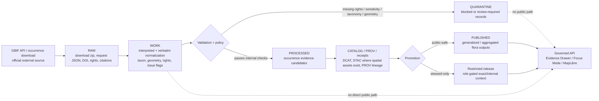

<!-- [KFM_META_BLOCK_V2]
doc_id: kfm://doc/TODO-uuid-gbif-source-contract
title: GBIF Source Contract — Kansas Flora
type: standard
version: v1
status: draft
owners: TODO-data-steward-owner
created: 2026-04-25
updated: 2026-04-25
policy_label: TODO-policy-label
related: [contracts/source/kansas_flora/README.md, schemas/contracts/v1/kansas_flora/occurrence_evidence.schema.json, data/registry/kansas_flora/sources.yaml, docs/domains/kansas_flora/README.md]
tags: [kfm, kansas-flora, gbif, biodiversity, occurrence, source-contract, geoprivacy]
notes: [doc_id owners policy_label and related paths need repo verification; target path was provided by request; live connector remains disabled until activation gates pass]
[/KFM_META_BLOCK_V2] -->

# GBIF Source Contract — Kansas Flora

Defines how GBIF-mediated occurrence data may support Kansas Flora evidence without becoming authoritative status, steward-reviewed precision, or public exact-location truth.

<a id="top"></a>

| Contract field | Value |
|---|---|
| Target path | `contracts/source/kansas_flora/gbif.md` |
| Source key | `gbif` |
| Domain lane | `kansas_flora` |
| Source family | Biodiversity occurrence aggregator |
| Default source role | `corroborative_occurrence_signal` |
| Activation state | `fixture_only` until source, rights, sensitivity, cadence, and steward gates are reviewed |
| Public release default | Generalized / aggregated only; exact points are denied unless explicitly authorized |
| Runtime posture | Cite-or-abstain; finite outcomes only: `ANSWER`, `ABSTAIN`, `DENY`, `ERROR` |

> [!IMPORTANT]
> **Truth posture:** This document is a source contract and activation checklist. It does **not** prove that a GBIF connector, schema, registry entry, workflow, API route, MapLibre layer, or promotion gate currently exists in the repository. Live access remains **NEEDS VERIFICATION** until the real repo and runtime are inspected.

## Quick navigation

- [Scope](#scope)
- [Repo fit](#repo-fit)
- [Accepted inputs](#accepted-inputs)
- [Exclusions](#exclusions)
- [Source role and authority boundary](#source-role-and-authority-boundary)
- [Lifecycle contract](#lifecycle-contract)
- [Normalization contract](#normalization-contract)
- [Rights, sensitivity, and public release](#rights-sensitivity-and-public-release)
- [Validation gates](#validation-gates)
- [Source descriptor skeleton](#source-descriptor-skeleton)
- [Illustrative download predicate](#illustrative-download-predicate)
- [Runtime and UI contract](#runtime-and-ui-contract)
- [Definition of done](#definition-of-done)
- [Open verification backlog](#open-verification-backlog)

---

## Scope

This contract governs **GBIF-mediated occurrence records** used as evidence candidates for Kansas Flora.

It is intended to support:

- plant occurrence evidence candidates;
- specimen and observation signals with source attribution;
- taxon, time, location, uncertainty, rights, and dataset identity preservation;
- public-safe generalized flora outputs;
- steward/reviewer workflows for sensitive or restricted records;
- EvidenceBundle-backed API, Evidence Drawer, Focus Mode, and MapLibre outputs.

GBIF is useful in this lane because it aggregates biodiversity records from many publishers and datasets. In KFM, that breadth is valuable only when **dataset identity, licensing, occurrence uncertainty, source role, and sensitivity posture stay visible**.

---

## Repo fit

```text
contracts/source/kansas_flora/gbif.md
```

| Direction | Surface | Role |
|---|---|---|
| Upstream | GBIF API, GBIF occurrence downloads, GBIF dataset metadata, GBIF citation/download DOI records | External source access and provenance |
| Same-lane companion | `contracts/source/kansas_flora/README.md` | Source-contract index and local conventions — **NEEDS VERIFICATION** |
| Same-lane companion | `data/registry/kansas_flora/sources.yaml` | Machine-readable source registry — **PROPOSED** |
| Same-lane companion | `schemas/contracts/v1/kansas_flora/occurrence_evidence.schema.json` | Occurrence evidence object schema — **PROPOSED** |
| Downstream | `data/work/kansas_flora/gbif/` | Normalized work-stage records and validation reports — **PROPOSED** |
| Downstream | `data/quarantine/kansas_flora/gbif/` | Records blocked by rights, sensitivity, unresolved taxonomy, invalid geometry, or missing provenance — **PROPOSED** |
| Downstream | `data/processed/kansas_flora/occurrences/` | Processed occurrence evidence candidates — **PROPOSED** |
| Downstream | `data/catalog/{stac,dcat,prov}/kansas_flora/` | Catalog and provenance closure — **PROPOSED** |
| Downstream | Governed API / Evidence Drawer / Focus Mode | Released evidence interpretation only; no raw GBIF shortcut |

> [!NOTE]
> The user-provided target path is treated as the requested file home. All adjacent paths are contractually useful but remain **PROPOSED** until the mounted repository confirms its directory conventions.

[Back to top](#top)

---

## Accepted inputs

| Input | Accepted when | Required preservation |
|---|---|---|
| GBIF fixture records | Always allowed for no-network tests and contract validation | Fixture source, expected outcome, sample license state, geometry precision class |
| GBIF occurrence download request JSON | Allowed as a reviewed request artifact before live execution | Predicate, creator, notification target, requested format, intended release scope |
| Completed GBIF occurrence download ZIP | Allowed after activation; initially test-only | Download key, DOI where available, request JSON, retrieval timestamp, checksum |
| Darwin Core Archive download | Allowed when `occurrence.txt`, `verbatim.txt`, `rights.txt`, `citations.txt`, and `metadata.xml` are retained | Interpreted and verbatim separation, rights, citations, dataset metadata |
| Simple CSV download | Allowed for small, fixture, or explicitly scoped extracts | Header, query, download metadata, checksum, DOI or derived-dataset citation plan |
| Dataset metadata | Required for each contributing dataset | `datasetKey`, publisher, license, citation, rights holder, version/date if available |
| Occurrence identity fields | Required when present | `gbifID`, `occurrenceID`, `catalogNumber`, `institutionCode`, `collectionCode`, `datasetKey` |
| Flora taxon scope | Required before broad harvesting | Approved taxon keys or curated taxon list; do not use an unbounded all-life query |
| Coordinate and uncertainty fields | Required for spatial claims | Latitude/longitude, uncertainty, precision bucket, georeference quality, GBIF issue flags |
| Rights and attribution fields | Required for any outward use | License URI, rights holder, publisher, DOI/download citation, citation obligations |

---

## Exclusions

| Excluded item | Why excluded | Destination |
|---|---|---|
| Scraped GBIF website pages | GBIF API/documented downloads are the supported machine path; website scraping is not a KFM source contract pattern | Deny; replace with official API/download |
| Non-plant taxa | This contract is scoped to Kansas Flora | Route to fauna, habitat, invasive species, pollinator, or biodiversity-wide source contract |
| GBIF records used as protected-status authority | GBIF occurrence data is not Kansas legal or steward authority | KDWP, USFWS ECOS, NatureServe, or steward-reviewed status contract |
| Public exact sensitive occurrence coordinates | KFM geoprivacy defaults deny exact sensitive point exposure | Generalized public derivative, steward-only view, or quarantine |
| Records with missing or incompatible rights for outward publication | KFM must not publish data whose reuse posture is unknown or incompatible | Quarantine or restricted internal reference |
| Occurrences with unresolved taxonomy where accepted identity is required | Taxon ambiguity must stay visible | Work review or quarantine |
| Modeled distribution or habitat inference | GBIF occurrence records are occurrence signals, not models | Flora habitat, range, or model contract |
| AI-generated flora claims without EvidenceBundle resolution | AI is interpretive only and cannot substitute for evidence | Runtime `DENY` or `ABSTAIN` |

[Back to top](#top)

---

## Source role and authority boundary

GBIF records may support claims of the form:

> “A GBIF-mediated record reports a plant occurrence signal for a taxon at a place and time, subject to dataset provenance, coordinate uncertainty, taxonomic interpretation, rights, GBIF processing flags, and KFM sensitivity review.”

GBIF records must **not** be used alone to claim:

- a species is legally protected in Kansas;
- a sensitive species location is safe for public exact display;
- an observation has been steward-reviewed by Kansas authorities;
- a modeled habitat/range boundary is authoritative;
- absence of records means absence of the taxon;
- occurrence geometry is survey-grade or boundary-grade evidence;
- GBIF interpretation has resolved every taxonomic or geospatial uncertainty.

| Claim type | GBIF role | Required companion evidence |
|---|---|---|
| Public generalized occurrence summary | Supporting evidence candidate | Rights review, sensitivity review, generalization receipt, EvidenceBundle |
| Exact steward-only occurrence review | Candidate signal | Role-gated access, steward review, exact-location policy |
| Legal status / listed species | Not authoritative | KDWP / USFWS / NatureServe or steward source |
| Habitat association | Input signal only | Habitat/covariate source, derivation receipt, uncertainty method |
| Species range | Corroborative only | Range map, modeled habitat, or official range/status source |
| Taxon identity | Informative, not final when contested | KFM taxon authority or accepted reconciliation policy |

[Back to top](#top)

---

## Lifecycle contract



### Lifecycle rules

1. **RAW is immutable.** Preserve the download package, request JSON, metadata, rights, citations, and checksums.
2. **WORK is inspectable.** Normalize GBIF interpreted and verbatim records without losing source-native terms.
3. **QUARANTINE is normal.** Rights ambiguity, sensitive precision, unresolved taxonomy, or missing provenance should block release without stigma.
4. **PROCESSED is evidence-bearing.** A processed GBIF record is an occurrence evidence candidate, not a public claim by itself.
5. **CATALOG/TRIPLET is closure.** Catalog records, provenance, receipts, and optional graph/triplet projection must close over the same promoted subject.
6. **PUBLISHED is governed.** Publication requires policy, review, rights, sensitivity, validation, catalog closure, and rollback path.
7. **Public clients never read RAW, WORK, or QUARANTINE.**

[Back to top](#top)

---

## Normalization contract

| GBIF / Darwin Core concept | KFM field | Required handling |
|---|---|---|
| `gbifID` | `source_record_id` | Preserve as GBIF record key; do not assume permanent uniqueness across all future reindexing |
| `datasetKey` | `source_dataset_id` | Required for provenance, citation, license grouping, and derived dataset reporting |
| `occurrenceID` | `source_native_identifiers.occurrence_id` | Preserve when present; use with dataset identity for alias and stability checks |
| `catalogNumber` | `source_native_identifiers.catalog_number` | Preserve for specimen records |
| `institutionCode` | `source_native_identifiers.institution_code` | Preserve for specimen/source context |
| `collectionCode` | `source_native_identifiers.collection_code` | Preserve for specimen/source context |
| `basisOfRecord` | `basis_of_record` | Required; do not mix specimen, human observation, machine observation, and material sample semantics invisibly |
| `scientificName` | `taxon.raw_scientific_name` | Preserve raw name exactly |
| `acceptedScientificName` / GBIF interpretation | `taxon.accepted_scientific_name` | Preserve interpreted accepted name when provided; unresolved names remain visible |
| `taxonKey` / `acceptedTaxonKey` | `taxon.source_taxon_key` / `taxon.accepted_taxon_key` | Preserve for repeatable taxon filters and reconciliation |
| `kingdom`, `phylum`, `class`, `order`, `family`, `genus`, `species` | `taxon.classification` | Preserve hierarchy as source interpretation |
| `eventDate` / `year` | `observation.event_time` | Preserve date precision and uncertainty; undated records cannot support time-specific claims |
| `decimalLatitude`, `decimalLongitude` | `geometry.internal_point` | Internal only until sensitivity and public geometry policy pass |
| `coordinateUncertaintyInMeters` | `geometry.coordinate_uncertainty_m` | Required for precision claims; absent uncertainty blocks exact public use |
| `countryCode`, `stateProvince`, `county`, `locality` | `place.source_place_terms` | Preserve source geography; normalize only with visible method |
| `license` | `rights.license_uri` | Required for outward use; missing/unknown rights blocks public promotion |
| `rightsHolder`, `publisher` | `rights.rights_holder`, `provenance.publisher` | Required for attribution and review |
| `references` | `provenance.source_record_url` | Preserve for evidence drawer and record trace |
| `issue` / GBIF processing flags | `validation.gbif_issues` | Preserve and classify; some issues route to quarantine |
| `lastInterpreted`, `modified` | `provenance.gbif_last_interpreted`, `provenance.publisher_modified` | Use for freshness and reprocessing awareness; do not confuse GBIF re-interpretation with publisher modification |
| Download DOI / key | `provenance.gbif_download` | Required for citable snapshots where downloads are used |

### Deterministic identity

KFM identity should be deterministic but source-aware.

```text
kfm_occurrence_evidence_id =
  sha256:jcs({
    "source_family": "gbif",
    "datasetKey": "<datasetKey>",
    "gbifID": "<gbifID>",
    "occurrenceID": "<occurrenceID-or-null>",
    "basisOfRecord": "<basisOfRecord-or-null>",
    "eventDate": "<eventDate-or-null>",
    "sourceGeometryDigest": "<digest-of-source-coordinate-fields>"
  })
```

Identity rules:

- use `datasetKey` plus record identity fields, not `gbifID` alone;
- record aliases when GBIF or publisher identifiers change;
- preserve old published IDs through supersession records;
- never silently overwrite a published occurrence evidence object;
- treat duplicate candidates as review items until a validator resolves or quarantines them.

[Back to top](#top)

---

## Rights, sensitivity, and public release

### License posture

| License / rights state | Default KFM action |
|---|---|
| `CC0` | Eligible for public use if attribution/citation, sensitivity, and validation pass |
| `CC BY` | Eligible for public use if attribution/citation, sensitivity, and validation pass |
| `CC BY-NC` | Restricted by default for outward release until KFM policy confirms the specific use is non-commercial and attribution obligations are satisfied |
| Missing license | `QUARANTINE` for publication; `ABSTAIN` for public runtime claims |
| Conflicting dataset/record license | `QUARANTINE` pending rights review |
| Media license present separately | Do not reuse media unless media license is separately evaluated |

### Sensitivity posture

| Case | Required behavior |
|---|---|
| Rare/protected/culturally sensitive flora | Deny exact public geometry unless explicit review authorizes release |
| Coordinates with missing uncertainty | No exact public geometry; route to generalized output or quarantine |
| Sensitive species with precise coordinates | Public `DENY`; steward-only review if allowed |
| Public generalized output | Record method, precision bucket, grid/region, input digest, output digest, and reason code |
| Withheld/obscured coordinates | Preserve the fact of withholding and the reason code; do not infer exact geometry |
| Unknown sensitivity status | Fail closed until KDWP/USFWS/NatureServe/steward context is checked |
| Public MapLibre layer | Generalized/aggregated only; no exact points, restricted IDs, or internal references |

Recommended reason codes:

```text
unknown_rights
restricted_license
missing_coordinate_uncertainty
geoprivacy_required
precise_sensitive_location_denied
review_required
steward_review_missing
public_geometry_not_generalized
ambiguous_taxon_identity
gbif_issue_requires_review
catalog_matrix_not_closed
```

[Back to top](#top)

---

## Validation gates

| Gate | Name | Pass condition | Fail behavior |
|---|---|---|---|
| G0 | Source descriptor closure | Descriptor includes role, access, rights, cadence, scope, sensitivity, and activation state | Block activation |
| G1 | Fixture-first proof | Valid and invalid no-network fixtures pass before live network access | Block live connector |
| G2 | Download provenance | Request JSON, download key, DOI or derived-dataset citation plan, retrieved time, checksums, rights, and citations captured | Quarantine batch |
| G3 | Schema validation | Required occurrence evidence fields validate | Quarantine record |
| G4 | Dataset identity | `datasetKey`, publisher, dataset citation, and license retained | Quarantine record |
| G5 | Record identity | `gbifID` and available native identifiers retained | Quarantine or mark alias-review |
| G6 | Flora scope | Record is within approved flora taxon scope | Route out-of-scope or quarantine |
| G7 | Taxon normalization | Raw name preserved; accepted-name reconciliation attempted; unresolved state visible | Quarantine when accepted identity is required |
| G8 | Geometry validity | Coordinates parse; expected Kansas scope checked; uncertainty captured; GBIF issues classified | Quarantine or downgrade to non-spatial support |
| G9 | Rights closure | License and attribution obligations known; redistribution posture computed | Deny promotion on unknown/prohibited rights |
| G10 | Sensitivity closure | Sensitive species/location policy evaluated; public geometry class computed | Deny exact public release |
| G11 | Catalog closure | DCAT, PROV, and spatial catalog records close over the same promoted subject | Deny promotion |
| G12 | EvidenceBundle closure | Evidence refs resolve to source records, provenance, rights, review, and release state | Runtime `ABSTAIN` or `ERROR` |
| G13 | Rollback target | Supersession and rollback path exists before publication | Deny promotion |

[Back to top](#top)

---

## Source descriptor skeleton

> [!NOTE]
> This YAML is illustrative. Use the repo’s canonical source descriptor schema after `contracts/` versus `schemas/` authority is verified.

```yaml
source_key: gbif
title: GBIF occurrence data for Kansas Flora
domain: kansas_flora
source_family: biodiversity_occurrence_aggregator
source_role: corroborative_occurrence_signal
activation_state: fixture_only

authority_boundary:
  may_support:
    - occurrence evidence candidate
    - specimen or observation signal
    - generalized or aggregated public flora summaries
  must_not_support_alone:
    - Kansas legal protected status
    - steward-reviewed exact occurrence
    - public exact sensitive location
    - modeled habitat or range truth
    - absence claim

access:
  official_docs:
    - https://techdocs.gbif.org/en/openapi/
    - https://techdocs.gbif.org/en/data-use/api-downloads
    - https://techdocs.gbif.org/en/data-use/download-formats
    - https://www.gbif.org/citation-guidelines
  base_url: https://api.gbif.org/
  preferred_mode: occurrence_download
  probe_mode: occurrence_search
  auth_required_for_download_request: true
  credential_ref: TODO-vault-secret-gbif-download-user
  user_agent: TODO-kfm-contact-url-or-email
  scraping_allowed: false
  rate_limit_policy: respect_provider_limits_with_backoff

scope:
  country: US
  state_province: Kansas
  taxon_scope: TODO-approved-kansas-flora-taxon-scope
  require_coordinates_for_spatial_claims: true
  occurrence_status: PRESENT
  accepted_basis_of_record:
    - PRESERVED_SPECIMEN
    - HUMAN_OBSERVATION
    - MACHINE_OBSERVATION
    - MATERIAL_SAMPLE

rights:
  accepted_public_licenses:
    - CC0
    - CC_BY
  restricted_by_default:
    - CC_BY_NC
    - missing_license
    - conflicting_license
  require_download_doi_or_derived_dataset_doi: true
  require_dataset_key: true
  require_citations_file: true
  require_rights_file: true

sensitivity:
  exact_public_geometry_default: deny
  public_geometry_default: generalized_or_aggregated
  sensitive_species_sources_to_check:
    - KDWP
    - USFWS_ECOS
    - NatureServe
    - steward_review
  redaction_receipt_required: true

validation:
  no_network_fixtures_required: true
  preserve_verbatim_records: true
  preserve_gbif_issue_flags: true
  require_coordinate_uncertainty_for_exact_internal_review: false
  require_coordinate_uncertainty_for_public_precision_claim: true
  quarantine_on_unknown_rights: true
  quarantine_on_sensitive_exact_public_geometry: true

outputs:
  raw:
    - data/raw/kansas_flora/gbif/
  work:
    - data/work/kansas_flora/gbif/
  quarantine:
    - data/quarantine/kansas_flora/gbif/
  processed:
    - data/processed/kansas_flora/occurrences/
  catalog:
    - data/catalog/dcat/kansas_flora/
    - data/catalog/prov/kansas_flora/
    - data/catalog/stac/kansas_flora/
  receipts:
    - data/receipts/kansas_flora/gbif/
  proofs:
    - data/proofs/kansas_flora/
```

[Back to top](#top)

---

## Illustrative download predicate

> [!WARNING]
> This is an **illustrative** GBIF occurrence download predicate. Validate every key, value, and taxon filter against the current GBIF API reference and KFM fixtures before live execution.

```json
{
  "creator": "TODO-gbif-username",
  "notificationAddresses": [
    "TODO-data-steward@example.org"
  ],
  "sendNotification": true,
  "format": "DWCA",
  "predicate": {
    "type": "and",
    "predicates": [
      {
        "type": "equals",
        "key": "COUNTRY",
        "value": "US"
      },
      {
        "type": "equals",
        "key": "STATE_PROVINCE",
        "value": "Kansas"
      },
      {
        "type": "equals",
        "key": "HAS_COORDINATE",
        "value": "true"
      },
      {
        "type": "equals",
        "key": "OCCURRENCE_STATUS",
        "value": "PRESENT"
      },
      {
        "type": "in",
        "key": "TAXON_KEY",
        "values": [
          "TODO-approved-flora-taxon-key"
        ]
      },
      {
        "type": "in",
        "key": "BASIS_OF_RECORD",
        "values": [
          "PRESERVED_SPECIMEN",
          "HUMAN_OBSERVATION",
          "MACHINE_OBSERVATION",
          "MATERIAL_SAMPLE"
        ]
      }
    ]
  }
}
```

### Request discipline

- Use documented GBIF API/download services, not website scraping.
- Use authenticated download requests for citable bulk downloads.
- Store request JSON and response metadata.
- Preserve download DOI and download key.
- Preserve `rights.txt`, `citations.txt`, `metadata.xml`, and dataset-level metadata.
- Prefer download snapshots for citable occurrence sets; search API probes are not release artifacts by themselves.
- Record rate-limit behavior and retries in the run receipt.
- Do not commit GBIF credentials or user passwords.

[Back to top](#top)

---

## Runtime and UI contract

### Evidence Drawer

A GBIF-backed Evidence Drawer card must show:

| Drawer field | Required content |
|---|---|
| Claim support type | `corroborative_occurrence_signal` |
| Source | GBIF |
| Dataset | `datasetKey`, publisher, dataset citation |
| Record | `gbifID`, source-native identifiers where available |
| Taxon | raw name, accepted name, taxon key, reconciliation state |
| Time | event date and precision |
| Geometry | public geometry class, uncertainty, generalization method, withheld/obscured reason |
| Rights | license, rights holder, attribution, citation/DOI |
| Quality | GBIF issue flags, validator results, review state |
| Provenance | download key/DOI, request digest, run receipt, transform/redaction receipt |
| Release state | published/restricted/quarantined/superseded |
| Correction lineage | prior release and supersession target when applicable |

### Focus Mode

| Outcome | GBIF-backed behavior |
|---|---|
| `ANSWER` | Only for released, public-safe, EvidenceBundle-backed generalized or aggregated claims |
| `ABSTAIN` | Insufficient provenance, unresolved taxonomy, missing rights, missing citation, or no matching released evidence |
| `DENY` | Sensitive exact location request, prohibited license, unauthorized steward-only record, raw/work/quarantine request |
| `ERROR` | Malformed fixture, malformed GBIF download metadata, schema failure in runtime envelope, broken evidence resolution |

### MapLibre / public map layers

Allowed public map outputs:

- county-level occurrence summaries;
- coarse grid summaries;
- public-safe generalized point layers where policy allows;
- taxon richness or trend summaries with source limitations visible;
- Evidence Drawer links for every consequential popup claim.

Denied public map outputs:

- exact sensitive flora occurrence points;
- raw GBIF coordinates for protected or review-required taxa;
- restricted source IDs or internal record references;
- layers without rights, citation, and redaction receipts;
- layers that imply absence from lack of GBIF records.

[Back to top](#top)

---

## Definition of done

A GBIF source-contract PR is not done until:

- [ ] `contracts/source/kansas_flora/gbif.md` is reviewed by data, policy, and flora/domain stewards.
- [ ] Metadata block placeholders are resolved or explicitly accepted as TODOs.
- [ ] The canonical source registry home is verified.
- [ ] The GBIF source descriptor validates against the repo’s source descriptor schema.
- [ ] No-live-network GBIF fixtures exist for valid, missing-license, sensitive-precise, unresolved-taxonomy, and malformed-record cases.
- [ ] Rights policy distinguishes `CC0`, `CC BY`, `CC BY-NC`, missing, and conflicting license states.
- [ ] Geoprivacy policy denies exact public sensitive locations.
- [ ] Occurrence evidence schema preserves source-native identity, taxon, geometry, uncertainty, rights, GBIF issues, and provenance fields.
- [ ] Validation reports emit deterministic digests.
- [ ] Catalog closure is tested for DCAT and PROV; STAC is emitted when spatial assets are published.
- [ ] EvidenceBundle closure is tested for at least one public-safe occurrence summary.
- [ ] Runtime finite outcomes are tested: `ANSWER`, `ABSTAIN`, `DENY`, `ERROR`.
- [ ] Rollback/supersession path exists before any publication.
- [ ] No credentials, precise restricted coordinates, or raw GBIF payloads are exposed in public outputs.

[Back to top](#top)

---

## Open verification backlog

| Item | Status | Needed evidence |
|---|---|---|
| Actual repo schema home | UNKNOWN | Mounted repo inspection and schema-home ADR |
| Contract owner | UNKNOWN | CODEOWNERS or steward assignment |
| KFM source descriptor schema | UNKNOWN | Checked-in schema or accepted proposal |
| GBIF credential storage name | UNKNOWN | Secrets/vault convention |
| Approved Kansas Flora taxon scope | NEEDS VERIFICATION | Curated KFM flora taxon registry or steward-approved GBIF taxon keys |
| Sensitive flora policy source hierarchy | NEEDS VERIFICATION | KDWP/USFWS/NatureServe/steward review policy |
| Public generalization thresholds | NEEDS VERIFICATION | Geoprivacy policy and steward review |
| Treatment of `CC BY-NC` for public outputs | NEEDS VERIFICATION | KFM rights policy and use-case classification |
| GBIF download format preference | NEEDS VERIFICATION | Repo-supported parser and catalog/provenance requirements |
| GBIF issue flag severity matrix | PROPOSED | Validator mapping from GBIF issue flags to pass/quarantine/deny |
| Evidence Drawer implementation | UNKNOWN | UI contract or component evidence |
| Focus Mode implementation | UNKNOWN | Runtime envelope and evidence-resolution tests |
| Live connector activation | BLOCKED | Passing source descriptor, fixtures, policy, rights, sensitivity, and reviewer gates |

---

## Maintainer notes

- Treat GBIF as **broad occurrence evidence**, not as a steward authority.
- Preserve interpreted and verbatim source values.
- Keep dataset identity and citation obligations visible.
- Do not widen public access to precise locations just because GBIF has coordinates.
- Do not let a map popup become the first place a claim is qualified.
- Prefer one small fixture-backed release proof over broad live harvesting.

---

## External references

- [GBIF API reference][gbif-api-reference]
- [GBIF API downloads][gbif-api-downloads]
- [GBIF occurrence download formats][gbif-download-formats]
- [GBIF citation guidelines][gbif-citation-guidelines]
- [GBIF terms of use][gbif-terms]
- [GBIF license guidance][gbif-license-guidance]
- [GBIF data processing][gbif-data-processing]

[gbif-api-reference]: https://techdocs.gbif.org/en/openapi/
[gbif-api-downloads]: https://techdocs.gbif.org/en/data-use/api-downloads
[gbif-download-formats]: https://techdocs.gbif.org/en/data-use/download-formats
[gbif-citation-guidelines]: https://www.gbif.org/citation-guidelines
[gbif-terms]: https://www.gbif.org/terms
[gbif-license-guidance]: https://www.gbif.org/publishing-data
[gbif-data-processing]: https://techdocs.gbif.org/en/data-processing/
