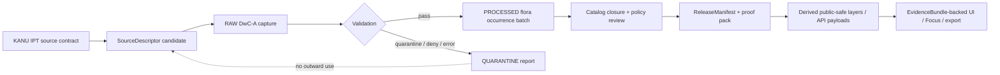

<!-- [KFM_META_BLOCK_V2]
doc_id: kfm://doc/NEEDS-UUID-kanu-ipt-source-contract
title: KANU IPT Source Contract
type: standard
version: v1
status: draft
owners: NEEDS-VERIFICATION
created: 2026-04-25
updated: 2026-04-25
policy_label: NEEDS-VERIFICATION
related: [TODO: verify contracts/source/kansas_flora index, TODO: verify source descriptor schema home, TODO: verify flora source registry]
tags: [kfm, source-contract, kansas-flora, kanu, ipt, darwin-core, herbarium, occurrence]
notes: [New standard source-admission draft for contracts/source/kansas_flora/kanu_ipt.md. Owner, policy label, doc UUID, adjacent repo paths, schema home, automation approval, and exact source cadence remain NEEDS VERIFICATION.]
[/KFM_META_BLOCK_V2] -->

# KANU IPT Source Contract

Governed source-admission draft for the **R. L. McGregor Herbarium / KANU IPT** as preserved-specimen occurrence evidence for the KFM Kansas flora lane.

> [!IMPORTANT]
> **This file is a source contract, not a connector, release artifact, catalog record, or public layer.**  
> It defines what KFM must verify before using KANU IPT data and what the source is allowed to mean once admitted.

**Quick jumps:** [Contract posture](#contract-posture) · [Repo fit](#repo-fit) · [Source identity](#source-identity) · [Accepted inputs](#accepted-inputs) · [Exclusions](#exclusions) · [Lifecycle](#lifecycle) · [Validation gates](#validation-gates) · [Descriptor draft](#illustrative-sourcedescriptor-draft) · [Open verification](#open-verification-items)

---

## Contract posture

| Field | Decision | Truth label |
|---|---:|---|
| Target path | `contracts/source/kansas_flora/kanu_ipt.md` | CONFIRMED from task |
| Document role | Source-admission contract for KANU IPT | PROPOSED |
| Source family key | `kanu_ipt` | PROPOSED |
| Primary source role | `preserved_specimen_occurrence_evidence` | INFERRED |
| First-wave resource | `kubi_vascularplants` | PROPOSED |
| Adjacent candidate resource | `kubi_lichens` | PROPOSED / NEEDS VERIFICATION |
| Automation status | Not approved by this file | CONFIRMED |
| Publication status | No public release authorized by this file | CONFIRMED |
| Repo implementation depth | Current mounted implementation not verified | UNKNOWN |

KANU specimen records can support claims that a preserved specimen record exists for a taxon, place, date, collector, catalog reference, and determination context. They do **not** by themselves establish current population presence, protected status, habitat suitability, regulatory authority, or safe public coordinate release.

[Back to top](#kanu-ipt-source-contract)

---

## Repo fit

This source contract belongs at the **source edge** of the Kansas flora lane.

| Surface | Relationship | Handling |
|---|---|---|
| `contracts/source/kansas_flora/` | Source-specific contract home requested for this file | CONFIRMED target family; actual local conventions NEEDS VERIFICATION |
| Source registry | Should hold the machine-readable `SourceDescriptor` companion | PROPOSED |
| Flora occurrence schemas | Should validate normalized occurrence batches derived from DwC-A | PROPOSED |
| Flora sensitivity policy | Must decide exact-coordinate, rare-taxon, and public generalization behavior | PROPOSED |
| EvidenceBundle | Must be resolved before any consequential KANU-backed claim appears in UI, Focus Mode, export, story, or API | PROPOSED |
| ReleaseManifest / proof pack | Required before outward publication | PROPOSED |

> [!NOTE]
> If the mounted repo already uses a different source-contract or schema-home convention, preserve this contract’s semantics and adapt the path through an ADR rather than creating a parallel authority.

---

## Source identity

| Item | Draft value | Review note |
|---|---|---|
| Publisher / institution | University of Kansas Biodiversity Institute and Natural History Museum | External source check required during activation |
| Collection | R. L. McGregor Herbarium Vascular Plants Collection | Primary first-wave resource |
| Standard acronym | `KANU` | Use in citations when citing R. L. McGregor Herbarium collections |
| IPT resource key | `kubi_vascularplants` | Candidate IPT resource key |
| Dataset DOI | `10.15468/htptzr` | Verify in GBIF/IPT metadata at fetch time |
| Collection code | `KANU` | Preserve case-normalized source value and source verbatim where available |
| Institution code | `KU` | Preserve source value and source verbatim where available |
| Basis of record | commonly `PreservedSpecimen` | Validate record-level value; do not assume all rows share one value |
| Source format | Darwin Core Archive (`DwC-A`) via IPT | Verify `meta.xml`, EML, core table, and extensions before ingestion |
| Rights posture | CC BY 4.0 indicated by KU norms / records | Must validate dataset-level and record-level license before release |

### Source-role meaning

KANU IPT is admitted as **collection-backed occurrence evidence**.

It can support:

- specimen-backed occurrence claims;
- taxon determination and catalog context;
- collector, collection date, locality, and georeference context where present;
- historical and regional flora evidence;
- cross-checking against GBIF and iDigBio interpretations.

It must not be silently upgraded into:

- a Kansas protected-status authority;
- a current population or abundance survey;
- a complete Kansas flora checklist;
- a habitat model;
- a public exact-coordinate layer;
- a source of policy permission for sensitive taxa.

---

## Accepted inputs

Accepted inputs are source-edge materials that can enter KFM only through governed intake.

| Input | Use | Required handling |
|---|---|---|
| IPT resource metadata page | Human-readable source context and version discovery | Capture access timestamp and cited URL |
| IPT Darwin Core Archive | Preferred machine source for raw capture when reachable and approved | Hash archive; preserve full raw artifact; validate `meta.xml` and EML |
| IPT EML metadata | Dataset description, contacts, citation, rights, coverage | Preserve as source metadata; do not rewrite silently |
| KU Botany collections page | Collection scope, citation acronym, access and collection context | Use as source-context evidence, not as machine occurrence data |
| KU Data Publication & Use Norms | Citation, responsibility, and license posture | Preserve citation obligations and as-is / bias caveats |
| GBIF dataset page / DOI | Registry mirror, citation check, occurrence-download cross-check | Use for corroboration and citation; do not treat as source-original if IPT archive is available |
| iDigBio record / recordset view | Aggregator cross-check and interpreted-record comparison | Treat flags and added taxonomy as aggregator interpretation |
| Manual steward notes | Review context, source-owner clarifications, use permission | Store as review evidence, not as unreviewed source truth |

> [!TIP]
> Prefer **publisher IPT archive → KFM raw capture → validator report** over harvesting normalized aggregator pages. Aggregators are useful cross-checks, but KFM should not confuse their interpretation pipeline with the publisher’s source artifact.

---

## Exclusions

The following do **not** belong in this source contract or should not be admitted through this contract alone.

| Excluded material | Why | Redirect |
|---|---|---|
| Ad hoc browser scraping of collection search result pages | Brittle, hard to reproduce, and unnecessary when DwC-A is available | Use IPT archive or approved API/source descriptor |
| GBIF/iDigBio interpreted fields as canonical KANU source truth | Aggregators normalize, add flags, and may add taxonomy or metadata | Use as QA comparison with transform receipts |
| Conservation status, threatened/endangered status, or critical habitat claims | KANU is not the regulatory authority for those claims | KDWP, USFWS ECOS, NatureServe/heritage workflows, or approved status sources |
| Exact public point publication for rare or sensitive taxa | Flora lanes carry geoprivacy and steward-review burdens | Flora sensitivity policy and redaction receipts |
| Synthetic exact coordinates from locality-only records | False precision breaks KFM representation discipline | Preserve source support; generalize or abstain |
| Loan, destructive sampling, or physical collection handling workflows | Operational collection policies, not KFM occurrence ingestion | Human steward documentation / collection policy reference |
| Large unattended source mirroring | Rights, provider burden, and cadence are not approved here | Source activation review and automation policy |

---

## Lifecycle

KANU IPT follows the KFM governed lifecycle. This file covers **source admission** only; it does not authorize later stages.



### Stage obligations

| Stage | Required evidence | Fail-closed condition |
|---|---|---|
| Source admission | SourceDescriptor, rights note, source-role assignment, accepted-input list | Missing owner, rights, source role, or publication intent |
| RAW | Immutable DwC-A artifact, headers where available, archive hash, access timestamp | Archive cannot be fetched, identified, hashed, or tied to source metadata |
| WORK / QUARANTINE | DwC-A validator output, field mapping report, license check, sensitivity precheck | Missing `meta.xml`, malformed rows, unknown rights, unsafe exact locations |
| PROCESSED | Normalized flora occurrence batch with source references and support semantics | Synthetic precision, lost catalog identity, or unexplained taxon rewriting |
| CATALOG / REVIEW | DecisionEnvelope, review record where sensitivity or rights require it | No EvidenceBundle path or unresolved sensitive taxa |
| PUBLISHED | ReleaseManifest, proof pack, redaction/generalization receipts | Public output exposes raw/work/quarantine records or exact restricted geometry |
| RUNTIME | EvidenceDrawerPayload / RuntimeResponseEnvelope | Consequential claim cannot resolve EvidenceBundle |

[Back to top](#kanu-ipt-source-contract)

---

## Validation gates

### Gate A — descriptor completeness

| Check | Expected result |
|---|---|
| `source_family_key` exists | `kanu_ipt` or repo-approved equivalent |
| Publisher and collection are named | University of Kansas Biodiversity Institute / R. L. McGregor Herbarium |
| Source role is explicit | `preserved_specimen_occurrence_evidence` |
| Resource key is explicit | `kubi_vascularplants` for first wave |
| Rights posture is explicit | CC BY 4.0 candidate; record-level verification required |
| Sensitivity default is explicit | `review_before_public_exact_geometry` |
| Citation requirement is explicit | KANU acronym and dataset citation preserved |
| Automation intent is explicit | `inactive_until_reviewed` |

### Gate B — DwC-A integrity

| Check | Expected result |
|---|---|
| Archive fetch | Bounded, reviewed, and receipt-backed |
| Hashing | Archive hash and content/spec hash recorded |
| `meta.xml` | Present and validates against Darwin Core Archive expectations |
| Metadata | EML or equivalent resource metadata present |
| Core type | Occurrence core expected for vascular plants |
| Stable record key | Prefer `dwc:occurrenceID`; fall back only by documented rule |
| Extensions | Preserved or explicitly excluded with reason |
| Drift | Version/hash change produces diff report before processing |

### Gate C — occurrence semantics

| Source field family | KFM expectation |
|---|---|
| `dwc:occurrenceID` | Primary source occurrence identity when present |
| `dwc:catalogNumber` | Catalog reference; must not be dropped |
| `dwc:institutionCode` / `dwc:collectionCode` | Preserve verbatim and normalized values |
| `dwc:basisOfRecord` | Must remain visible; usually `PreservedSpecimen` for this source family |
| `dwc:scientificName` and taxon fields | Preserve source determination; downstream taxon normalization needs transform receipt |
| `dwc:eventDate` | Collection/observation event date; do not collapse with fetch or release time |
| `dwc:locality`, county, state, country | Preserve source support; do not invent precision |
| Coordinates and uncertainty | Use only with uncertainty, georeference metadata, and sensitivity policy |
| `dcterms:license` / access rights | Required before public use |
| `dcterms:modified` | Source-side record freshness signal where present |

### Gate D — rights, sensitivity, and publication

| Decision point | Default |
|---|---|
| Missing license | `ABSTAIN` for outward claim; quarantine record for rights review |
| Restricted redistribution | `DENY` outward use for requested path |
| Sensitive taxon with exact coordinates | `DENY` exact public geometry; require generalization or withholding |
| Locality-only record | No exact point; support remains locality/county/textual |
| Aggregator-added taxonomy | QA signal only unless transform receipt records acceptance |
| Public map layer | Only after release proof, EvidenceBundle, and public-safe geometry class |

> [!WARNING]
> **Open occurrence data is not the same as public-safe occurrence data.**  
> KFM must make generalization, withholding, and review states visible rather than letting exact coordinates leak through derived tiles, exports, popups, or model answers.

---

## Evidence and runtime behavior

A KANU-backed claim is outward-safe only when the runtime can resolve:

1. source descriptor;
2. raw capture receipt;
3. validation report;
4. normalized occurrence object;
5. rights / sensitivity decision;
6. EvidenceBundle;
7. release or review state;
8. public geometry precision served.

### Runtime outcomes

| Outcome | KANU example |
|---|---|
| `ANSWER` | A public-safe, released claim can cite a KANU specimen record at approved precision. |
| `ABSTAIN` | The record exists, but source license, coordinate uncertainty, taxon interpretation, or evidence resolution is incomplete. |
| `DENY` | The requested answer would reveal restricted exact location or violate rights/sensitivity policy. |
| `ERROR` | The request, fixture, archive, or normalized object is malformed. |

---

## Illustrative SourceDescriptor draft

This is an illustrative draft only. It is **not** a canonical schema instance until the repo’s schema home and field names are verified.

```json
{
  "object_type": "SourceDescriptor",
  "schema_version": "v1",
  "source_family_key": "kanu_ipt",
  "source_title": "R. L. McGregor Herbarium Vascular Plants Collection",
  "publisher": "University of Kansas Biodiversity Institute",
  "institution_code": "KU",
  "collection_code": "KANU",
  "resource_key": "kubi_vascularplants",
  "source_role": "preserved_specimen_occurrence_evidence",
  "knowledge_character": "collection_specimen_occurrence",
  "primary_access_method": "gbif_ipt_darwin_core_archive",
  "candidate_access_surfaces": [
    {
      "kind": "ipt_resource",
      "url": "https://ipt.nhm.ku.edu/resource?r=kubi_vascularplants",
      "status": "NEEDS_VERIFICATION_BEFORE_AUTOMATION"
    },
    {
      "kind": "ipt_archive",
      "url": "https://ipt.nhm.ku.edu/archive.do?r=kubi_vascularplants",
      "status": "NEEDS_VERIFICATION_BEFORE_AUTOMATION"
    },
    {
      "kind": "ipt_eml",
      "url": "https://ipt.nhm.ku.edu/eml.do?r=kubi_vascularplants",
      "status": "NEEDS_VERIFICATION_BEFORE_AUTOMATION"
    },
    {
      "kind": "gbif_dataset",
      "url": "https://www.gbif.org/dataset/95c938a8-f762-11e1-a439-00145eb45e9a",
      "status": "CORROBORATIVE_REGISTRY_MIRROR"
    }
  ],
  "rights": {
    "candidate_license": "CC-BY-4.0",
    "record_level_license_required": true,
    "citation_required": true,
    "status": "NEEDS_RECORD_LEVEL_VALIDATION"
  },
  "sensitivity": {
    "default_public_exact_geometry": "DENY_UNTIL_POLICY_REVIEW",
    "requires_sensitive_taxon_crosswalk": true,
    "public_safe_precision_default": "county_or_coarser_when_required"
  },
  "freshness": {
    "cadence": "UNKNOWN",
    "watcher_allowed": false,
    "required_checks": [
      "archive_hash",
      "metadata_modified",
      "resource_version",
      "schema_diff"
    ]
  },
  "publication": {
    "public_release_allowed": false,
    "requires": [
      "ValidationReport",
      "RightsDecision",
      "SensitivityDecision",
      "EvidenceBundle",
      "ReleaseManifest"
    ]
  }
}
```

---

## Access stance

Use this source in the narrowest practical order.

1. Verify collection and dataset metadata.
2. Verify source rights and citation requirements.
3. Fetch a bounded DwC-A artifact only after source activation review.
4. Store the immutable raw archive and hash.
5. Validate shape, rights, support, and sensitivity.
6. Normalize into flora occurrence objects without losing source fields.
7. Compare selected output against GBIF/iDigBio interpreted views for QA.
8. Promote only through catalog, review, and release gates.
9. Serve only public-safe derived outputs.

> [!NOTE]
> Fetch time, collection event time, source metadata modified time, normalization time, review time, and release time are different KFM facts. Do not collapse them into one timestamp.

---

## Open verification items

| Item | Status | Owner |
|---|---:|---|
| Confirm this file is new vs revision of an existing repo file | NEEDS VERIFICATION | Repo steward |
| Confirm source-contract index / README conventions | NEEDS VERIFICATION | Documentation steward |
| Confirm machine schema home for `SourceDescriptor` | NEEDS VERIFICATION | Contract/schema steward |
| Confirm canonical `source_family_key` naming | NEEDS VERIFICATION | Flora lane steward |
| Confirm KANU IPT resource reachability, versioning, headers, and archive checksum | NEEDS VERIFICATION | Source steward |
| Confirm whether first wave includes vascular plants only or lichens too | NEEDS VERIFICATION | Flora + biodiversity steward |
| Confirm record-level license and access-rights behavior | NEEDS VERIFICATION | Policy steward |
| Confirm rare/sensitive plant crosswalk and public precision rules | NEEDS VERIFICATION | Policy + steward review |
| Confirm whether GBIF/iDigBio mirrors are allowed as QA-only comparison surfaces | NEEDS VERIFICATION | Data architecture steward |
| Confirm citation wording for KANU-backed public outputs | NEEDS VERIFICATION | Source steward |
| Confirm validator paths and fixture naming | NEEDS VERIFICATION | Test steward |
| Confirm no raw/work/quarantine path is exposed to public clients | NEEDS VERIFICATION | API/security steward |

---

## Definition of done

This contract is ready for source activation only when:

- [ ] SourceDescriptor validates against the repo-approved schema.
- [ ] One valid and one invalid KANU descriptor fixture exist.
- [ ] IPT archive fetch is bounded, receipt-backed, and hash-recorded.
- [ ] DwC-A validation passes for `meta.xml`, EML, and occurrence core.
- [ ] Required Darwin Core fields are mapped or explicitly marked absent.
- [ ] Rights and citation requirements are verified at dataset and record level.
- [ ] Sensitive taxa policy denies exact public geometry by default.
- [ ] Aggregator interpretation fields are handled as QA signals, not source truth.
- [ ] Public-safe output fixture resolves an EvidenceBundle.
- [ ] Negative fixtures cover `ABSTAIN`, `DENY`, and `ERROR`.
- [ ] No public client reads RAW, WORK, QUARANTINE, or unpublished normalized objects.
- [ ] Rollback / disable-source path is documented.

---

## Rollback and correction

Before publication, rollback is simple: revert this source contract or mark the companion SourceDescriptor inactive.

After publication, rollback must not mutate old published artifacts. It must:

1. disable new source-derived releases;
2. emit a correction or rollback note;
3. preserve prior release hashes;
4. rebuild affected derived layers and search projections;
5. keep EvidenceBundle resolution truthful for historical releases;
6. make public correction state visible where prior KANU-backed claims were exposed.

---

## References

- [KANU vascular IPT resource][kanu-ipt-vascular]
- [KANU vascular IPT archive][kanu-ipt-archive]
- [KANU vascular IPT EML][kanu-ipt-eml]
- [KANU lichen IPT resource][kanu-ipt-lichens]
- [KU Botany collections][ku-botany-collections]
- [KU data publication and use norms][ku-data-norms]
- [GBIF dataset: R. L. McGregor Herbarium Vascular Plants Collection][gbif-kanu-vascular]
- [GBIF Darwin Core Archive guide][gbif-dwca-guide]
- [GBIF Darwin Core overview][gbif-dwc-overview]
- [GBIF data processing][gbif-data-processing]

[kanu-ipt-vascular]: https://ipt.nhm.ku.edu/resource?r=kubi_vascularplants
[kanu-ipt-archive]: https://ipt.nhm.ku.edu/archive.do?r=kubi_vascularplants
[kanu-ipt-eml]: https://ipt.nhm.ku.edu/eml.do?r=kubi_vascularplants
[kanu-ipt-lichens]: https://ipt.nhm.ku.edu/resource?r=kubi_lichens
[ku-botany-collections]: https://biodiversity.ku.edu/botany/collections
[ku-data-norms]: https://biodiversity.ku.edu/data-publication-use
[gbif-kanu-vascular]: https://www.gbif.org/dataset/95c938a8-f762-11e1-a439-00145eb45e9a
[gbif-dwca-guide]: https://ipt.gbif.org/manual/en/ipt/latest/dwca-guide
[gbif-dwc-overview]: https://www.gbif.org/darwin-core
[gbif-data-processing]: https://www.gbif.org/data-processing
