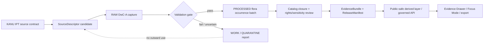

<!-- [KFM_META_BLOCK_V2]
doc_id: kfm://doc/NEEDS-UUID-kanu-ipt-source-contract
title: KANU IPT Source Contract
type: standard
version: v1
status: draft
owners: NEEDS-VERIFICATION
created: 2026-04-25
updated: 2026-04-25
policy_label: NEEDS-VERIFICATION
related: [TODO: verify contracts/source/kansas_flora index, TODO: verify SourceDescriptor schema home, TODO: verify Kansas flora source registry, TODO: verify flora sensitivity policy]
tags: [kfm, source-contract, kansas-flora, kanu, ipt, darwin-core, herbarium, occurrence, specimen]
notes: [Owner, policy label, doc UUID, adjacent repo paths, schema home, source activation state, source cadence, and exact public-release policy remain NEEDS VERIFICATION.]
[/KFM_META_BLOCK_V2] -->

# KANU IPT Source Contract

Governed source-admission contract for the **R. L. McGregor Herbarium / KANU IPT** as specimen-backed Kansas flora occurrence evidence.

## Impact block


| Field | Value |
|---|---|
| Status | **experimental** / draft source contract |
| Owners | `NEEDS-VERIFICATION` |
| Target path | `contracts/source/kansas_flora/kanu_ipt.md` |
| Contract role | Source-admission contract; not a connector or publication manifest |
| Public release | **Not authorized by this file** |
| Quick jumps | [Repo fit](#repo-fit) · [Accepted inputs](#accepted-inputs) · [Exclusions](#exclusions) · [Lifecycle](#lifecycle) · [Validation gates](#validation-gates) · [Descriptor draft](#illustrative-sourcedescriptor-draft) · [Definition of done](#definition-of-done) |

> [!IMPORTANT]
> This contract does **not** approve live harvesting, public map publication, exact-coordinate exposure, AI use, or downstream release. It defines the evidence, rights, sensitivity, and validation burden KFM must satisfy before KANU IPT-derived records can support outward flora claims.

---

## Contract posture

| Question | Decision | Truth label |
|---|---|---:|
| What source is being admitted? | R. L. McGregor Herbarium vascular-plant IPT / KANU occurrence resource | CONFIRMED externally; exact repo admission still NEEDS VERIFICATION |
| What is this source allowed to mean? | Preserved-specimen occurrence evidence | INFERRED |
| Is this a canonical flora checklist? | No | CONFIRMED |
| Is this a regulatory protected-status authority? | No | CONFIRMED |
| May public clients read RAW / WORK / QUARANTINE objects? | No | CONFIRMED doctrine |
| Does this file authorize automation? | No | CONFIRMED |
| Does this file authorize public exact geometry? | No | CONFIRMED |
| What remains unknown? | Repo conventions, schema home, owner, policy label, source cadence, validator paths, activation state | UNKNOWN / NEEDS VERIFICATION |

KANU specimen records can support bounded claims that a preserved specimen record exists for a taxon, place, date, collector, catalog reference, and determination context. They do **not** by themselves establish current population presence, abundance, legal status, habitat suitability, or safe public coordinate release.

[Back to top](#kanu-ipt-source-contract)

---

## Repo fit

This file sits at the **source edge** of the Kansas flora lane.

| Surface | Fit | Upstream / downstream |
|---|---|---|
| This file | Human-readable source contract for KANU IPT | Path requested: `contracts/source/kansas_flora/kanu_ipt.md` |
| Upstream source | Publisher IPT, GBIF dataset mirror, KU collection and data-use pages | [KANU IPT resource][kanu-ipt-vascular] · [GBIF dataset][gbif-kanu-vascular] · [KU Botany collections][ku-botany-collections] · [KU data norms][ku-data-norms] |
| Source descriptor | Machine-readable source activation object | `SourceDescriptor` schema home is `NEEDS-VERIFICATION` |
| Flora occurrence normalization | Downstream processed occurrence objects | Exact schema names and paths are `NEEDS-VERIFICATION` |
| Policy and sensitivity | Rights, rare taxa, exact-coordinate handling | Flora sensitivity policy path is `NEEDS-VERIFICATION` |
| Evidence resolution | EvidenceRef → EvidenceBundle closure | Resolver/API implementation is `UNKNOWN` |
| Publication | ReleaseManifest / proof pack / public-safe derived layers | No publication authorized here |

> [!NOTE]
> If the mounted repository already uses a different source-contract or schema-home convention, preserve this file’s semantics and adapt the path through an ADR instead of creating a parallel authority.

### Candidate sibling placement

Directory tree omitted — this is **not** a directory README, and the surrounding repository tree is **NEEDS VERIFICATION**. The following placement is only a review hint:

```text
contracts/
└── source/
    └── kansas_flora/
        └── kanu_ipt.md  # this file
```

---

## Source identity

| Item | Draft value | Review note |
|---|---|---|
| Institution / publisher context | University of Kansas Biodiversity Institute / KU Biodiversity Institute and Natural History Museum | Confirm exact citation string at source-activation time |
| Collection | R. L. McGregor Herbarium Vascular Plants Collection | First-wave candidate |
| Standard citation acronym | `KANU` | Preserve in KFM citations |
| Dataset DOI | `10.15468/htptzr` | Confirmed through GBIF dataset page |
| GBIF dataset UUID | `95c938a8-f762-11e1-a439-00145eb45e9a` | Registry mirror / citation cross-check |
| Candidate IPT resource key | `kubi_vascularplants` | Source page exists in search; direct fetch must be rechecked |
| Candidate source format | Darwin Core Archive (`DwC-A`) via IPT | Validate archive, `meta.xml`, and `eml.xml` before ingestion |
| `collectionCode` | `KANU` | Preserve record-level source value |
| `institutionCode` | `NEEDS RECORD-LEVEL VERIFICATION` | Do not hard-code before archive sample validation |
| Expected `basisOfRecord` | commonly `PreservedSpecimen` | Validate per record; do not assume uniformity |
| Candidate license posture | CC BY 4.0 | Verify dataset metadata and record-level rights fields |
| Sibling lichen resource | `kubi_lichens` candidate only | Separate contract or explicit combined-scope decision required |

### Source-role meaning

KANU IPT is admitted as **collection-backed occurrence evidence**.

It can support:

- specimen-backed occurrence claims;
- catalog and collection references;
- source taxon determination context;
- collector, collection date, locality, county, and georeference context where present;
- historical and regional flora evidence;
- QA comparison against GBIF or iDigBio interpreted views.

It must not be silently upgraded into:

- a current population survey;
- a Kansas protected-status authority;
- a complete Kansas flora checklist;
- a habitat suitability model;
- a public exact-coordinate layer;
- a source of permission to expose sensitive taxa;
- an AI-answer source without EvidenceBundle resolution.

---

## Accepted inputs

Only source-edge materials that can pass governed intake belong here.

| Input | Use | Required handling |
|---|---|---|
| IPT resource metadata page | Human-readable source context and version discovery | Capture access timestamp; record fetch status |
| IPT Darwin Core Archive | Preferred machine source when source activation is approved | Hash archive; preserve full RAW artifact; validate `meta.xml` and `eml.xml` |
| IPT EML metadata | Dataset description, contacts, citation, rights, coverage | Preserve as source metadata; do not rewrite silently |
| KU Botany collection page | Collection scope and KANU citation guidance | Use as source-context evidence |
| KU data publication and use norms | Citation, responsibility, license, and as-is caveats | Preserve citation obligations and license checks |
| GBIF dataset page / DOI | Registry mirror, citation check, DOI confirmation | Use for corroboration; do not replace publisher artifact when IPT archive is available |
| Aggregator interpreted views | QA comparison only | Treat flags and added interpretations as downstream aggregator interpretation |
| Manual steward notes | Review context, clarifications, source-owner guidance | Store as review evidence, not as unreviewed source truth |

> [!TIP]
> Prefer **publisher IPT archive → immutable RAW capture → validation report → normalized flora occurrence batch** over scraping human-facing collection search pages or treating aggregator-normalized records as canonical KANU truth.

---

## Exclusions

| Excluded material | Why it is excluded | Redirect |
|---|---|---|
| Ad hoc scraping of collection search result pages | Brittle, hard to reproduce, and unnecessary when DwC-A is available | SourceDescriptor-approved IPT archive |
| GBIF or iDigBio interpreted fields as canonical KANU source truth | Aggregators normalize and may add flags, taxonomy, and interpretations | QA comparison with transform receipt |
| Conservation status or threatened/endangered claims | KANU is not the regulatory authority for status claims | Approved protected-status source contract |
| Exact public point publication for rare or sensitive taxa | Flora lanes carry geoprivacy and steward-review burden | Flora sensitivity policy and redaction/generalization receipts |
| Synthetic exact coordinates from locality-only records | False precision corrupts map and claim meaning | Preserve locality support; generalize or abstain |
| Loan, destructive sampling, or physical collection handling workflows | Operational herbarium policy, not KFM occurrence ingestion | Human steward / collection policy documentation |
| Large unattended mirroring | Rights, provider burden, cadence, and public-release posture are unapproved | Source activation review |

---

## Lifecycle

KANU IPT follows the KFM governed lifecycle. This contract covers **source admission** only.



| Stage | Required evidence | Fail-closed condition |
|---|---|---|
| Source admission | SourceDescriptor, rights note, source role, accepted-input list | Missing owner, rights posture, source role, or activation decision |
| RAW | Immutable archive, archive hash, fetch receipt, access timestamp | Archive cannot be fetched, identified, hashed, or tied to metadata |
| WORK / QUARANTINE | DwC-A validator output, mapping report, rights check, sensitivity precheck | Malformed archive, unknown rights, missing core identifiers, unsafe geometry |
| PROCESSED | Normalized flora occurrence batch with source references | Synthetic precision, lost catalog identity, unexplained taxon rewriting |
| CATALOG / REVIEW | Catalog record, EvidenceBundle path, policy/review decision | Unresolved EvidenceRef, unresolved sensitive taxa, missing release posture |
| PUBLISHED | ReleaseManifest, proof pack, public-safe geometry, correction path | Public output exposes raw/work/quarantine or exact restricted geometry |
| RUNTIME | EvidenceDrawerPayload / RuntimeResponseEnvelope | Consequential claim cannot resolve EvidenceBundle |

[Back to top](#kanu-ipt-source-contract)

---

## Validation gates

### Gate A — descriptor completeness

| Check | Expected result |
|---|---|
| `source_family_key` exists | `kanu_ipt` or repo-approved equivalent |
| Publisher / collection named | University of Kansas Biodiversity Institute and R. L. McGregor Herbarium |
| Source role explicit | `preserved_specimen_occurrence_evidence` |
| Resource key explicit | `kubi_vascularplants` for first-wave candidate |
| Rights posture explicit | CC BY 4.0 candidate; record-level verification required |
| Sensitivity default explicit | `review_before_public_exact_geometry` |
| Citation obligation explicit | KANU acronym and dataset DOI/citation preserved |
| Automation state explicit | `inactive_until_reviewed` |
| Public release state explicit | `public_release_allowed: false` until proof pack |

### Gate B — DwC-A integrity

| Check | Expected result |
|---|---|
| Archive fetch | Bounded, reviewed, and receipt-backed |
| Archive hashing | Archive hash and content/spec hash recorded |
| `meta.xml` | Present and validates against Darwin Core Archive expectations |
| `eml.xml` / metadata | Present or explicitly documented as absent/problematic |
| Core type | Occurrence core expected for vascular plants |
| Stable record key | Prefer `dwc:occurrenceID`; fallback only by documented rule |
| Extensions | Preserved or explicitly excluded with reason |
| Version drift | Hash/version change produces diff report before processing |

### Gate C — occurrence semantics

| Source field family | KFM expectation |
|---|---|
| `dwc:occurrenceID` | Primary source occurrence identity when present |
| `dwc:catalogNumber` | Catalog reference; must not be dropped |
| `dwc:institutionCode` / `dwc:collectionCode` | Preserve source value and normalized value |
| `dwc:basisOfRecord` | Must remain visible; do not collapse with observation sources |
| `dwc:scientificName` and taxon fields | Preserve source determination; downstream normalization needs transform receipt |
| `dwc:eventDate` | Collection/event date; do not collapse with fetch or release time |
| `dwc:locality`, county, state, country | Preserve source support; do not invent precision |
| Coordinates and uncertainty | Use only with uncertainty, georeference metadata, and sensitivity policy |
| `dcterms:license` / rights fields | Required before public use |
| `dcterms:modified` | Source-side freshness signal where present |

### Gate D — rights, sensitivity, and publication

| Decision point | Default |
|---|---|
| Missing license | `ABSTAIN` outward claim; quarantine for rights review |
| Restricted redistribution | `DENY` outward use for requested path |
| Sensitive taxon with exact coordinates | `DENY` exact public geometry; require generalization or withholding |
| Locality-only record | No exact point; preserve locality/county/text support |
| Aggregator-added taxonomy | QA signal only unless transform receipt records acceptance |
| Public map layer | Only after release proof, EvidenceBundle, and public-safe geometry class |

> [!WARNING]
> Open occurrence data is not the same as public-safe occurrence data. KFM must make generalization, withholding, and review states visible rather than letting exact coordinates leak through tiles, exports, popups, or model answers.

---

## Runtime and claim behavior

A KANU-backed claim is outward-safe only when the runtime can resolve:

1. source descriptor;
2. raw capture receipt;
3. validation report;
4. normalized occurrence object;
5. rights decision;
6. sensitivity decision;
7. EvidenceBundle;
8. release or review state;
9. public geometry precision served.

| Runtime outcome | KANU example |
|---|---|
| `ANSWER` | A released, public-safe claim cites a KANU specimen at approved precision. |
| `ABSTAIN` | The record exists, but license, coordinate uncertainty, source role, taxon interpretation, or EvidenceBundle closure is incomplete. |
| `DENY` | The requested response would reveal restricted exact location or violate rights/sensitivity policy. |
| `ERROR` | The request, fixture, archive, or normalized object is malformed. |

---

## Illustrative SourceDescriptor draft

> [!IMPORTANT]
> This JSON is illustrative. It is **not** canonical until the repo’s schema home, field names, enum values, and source registry conventions are verified.

<details>
<summary>Open illustrative descriptor</summary>

```json
{
  "object_type": "SourceDescriptor",
  "schema_version": "v1",
  "source_family_key": "kanu_ipt",
  "source_title": "R. L. McGregor Herbarium Vascular Plants Collection",
  "publisher": "University of Kansas Biodiversity Institute",
  "collection_name": "R. L. McGregor Herbarium",
  "collection_code": "KANU",
  "resource_key": "kubi_vascularplants",
  "dataset_doi": "10.15468/htptzr",
  "source_role": "preserved_specimen_occurrence_evidence",
  "knowledge_character": "collection_specimen_occurrence",
  "primary_access_method": "gbif_ipt_darwin_core_archive",
  "candidate_access_surfaces": [
    {
      "kind": "ipt_resource",
      "url": "https://ipt.nhm.ku.edu/resource?r=kubi_vascularplants",
      "status": "NEEDS_VERIFICATION_BEFORE_AUTOMATION"
    },
    {
      "kind": "ipt_archive",
      "url": "https://ipt.nhm.ku.edu/archive.do?r=kubi_vascularplants",
      "status": "NEEDS_VERIFICATION_BEFORE_AUTOMATION"
    },
    {
      "kind": "ipt_eml",
      "url": "https://ipt.nhm.ku.edu/eml.do?r=kubi_vascularplants",
      "status": "NEEDS_VERIFICATION_BEFORE_AUTOMATION"
    },
    {
      "kind": "gbif_dataset",
      "url": "https://www.gbif.org/dataset/95c938a8-f762-11e1-a439-00145eb45e9a",
      "status": "CORROBORATIVE_REGISTRY_MIRROR"
    }
  ],
  "rights": {
    "candidate_license": "CC-BY-4.0",
    "record_level_license_required": true,
    "citation_required": true,
    "status": "NEEDS_RECORD_LEVEL_VALIDATION"
  },
  "sensitivity": {
    "default_public_exact_geometry": "DENY_UNTIL_POLICY_REVIEW",
    "requires_sensitive_taxon_crosswalk": true,
    "public_safe_precision_default": "county_or_coarser_when_required"
  },
  "freshness": {
    "cadence": "UNKNOWN",
    "watcher_allowed": false,
    "required_checks": [
      "archive_hash",
      "metadata_modified",
      "resource_version",
      "schema_diff"
    ]
  },
  "publication": {
    "public_release_allowed": false,
    "requires": [
      "ValidationReport",
      "RightsDecision",
      "SensitivityDecision",
      "EvidenceBundle",
      "ReleaseManifest"
    ]
  }
}
```

</details>

---

## Activation workflow

Activation must stay narrow and reversible.

```yaml
activation_order:
  - verify_repo_conventions
  - confirm_source_owner
  - create_or_update_SourceDescriptor
  - add_valid_and_invalid_descriptor_fixtures
  - fetch_bounded_archive_once
  - hash_raw_archive
  - validate_dwca_meta_and_eml
  - map_required_darwin_core_fields
  - run_rights_and_sensitivity_policy
  - normalize_fixture_batch
  - build_EvidenceBundle_fixture
  - run_denial_and_abstention_tests
  - keep_public_release_disabled
```

> [!CAUTION]
> Do not add a watcher, cron job, public layer, Focus Mode route, or export path until descriptor fixtures, rights checks, sensitivity checks, and EvidenceBundle closure pass.

---

## Open verification items

| Item | Status | Review owner |
|---|---:|---|
| Confirm this file is new versus revision of an existing repo file | NEEDS VERIFICATION | Repo steward |
| Confirm source-contract index / README conventions | NEEDS VERIFICATION | Documentation steward |
| Confirm schema home for `SourceDescriptor` | NEEDS VERIFICATION | Contract/schema steward |
| Confirm canonical source key naming | NEEDS VERIFICATION | Flora lane steward |
| Confirm KANU IPT resource reachability, archive URL, headers, versioning, and checksum | NEEDS VERIFICATION | Source steward |
| Confirm whether first wave is vascular plants only or includes lichens | NEEDS VERIFICATION | Flora + biodiversity steward |
| Confirm record-level license and access-rights behavior | NEEDS VERIFICATION | Policy steward |
| Confirm rare/sensitive plant crosswalk and public precision rules | NEEDS VERIFICATION | Policy + steward review |
| Confirm whether GBIF/iDigBio mirrors are allowed as QA-only comparison surfaces | NEEDS VERIFICATION | Data architecture steward |
| Confirm citation wording for KANU-backed public outputs | NEEDS VERIFICATION | Source steward |
| Confirm validator paths and fixture naming | NEEDS VERIFICATION | Test steward |
| Confirm no raw/work/quarantine path is exposed to public clients | NEEDS VERIFICATION | API/security steward |

---

## Definition of done

This contract is ready for source activation only when:

- [ ] SourceDescriptor validates against the repo-approved schema.
- [ ] One valid and one invalid KANU descriptor fixture exist.
- [ ] IPT archive fetch is bounded, receipt-backed, and hash-recorded.
- [ ] DwC-A validation passes for `meta.xml`, EML, core IDs, and occurrence core.
- [ ] Required Darwin Core fields are mapped or explicitly marked absent.
- [ ] Dataset-level and record-level rights are verified.
- [ ] KANU citation requirements are preserved.
- [ ] Sensitive taxa policy denies exact public geometry by default.
- [ ] Aggregator interpretation fields are treated as QA signals, not source truth.
- [ ] Public-safe output fixture resolves an EvidenceBundle.
- [ ] Negative fixtures cover `ABSTAIN`, `DENY`, and `ERROR`.
- [ ] No public client can read RAW, WORK, QUARANTINE, or unpublished normalized objects.
- [ ] Rollback / disable-source path is documented.

---

## Rollback and correction

Before publication, rollback is simple: revert this contract change or mark the companion SourceDescriptor inactive.

After publication, rollback must not mutate old published artifacts. It must:

1. disable new source-derived releases;
2. emit a correction or rollback note;
3. preserve prior release hashes;
4. rebuild affected derived layers and search projections;
5. keep EvidenceBundle resolution truthful for historical releases;
6. make public correction state visible where prior KANU-backed claims were exposed.

---

## Pre-publish review checklist

- [ ] KFM Meta Block v2 present and synchronized with H1.
- [ ] Impact block includes status, owners, compact badges, and quick jumps.
- [ ] Repo fit includes path plus upstream/downstream relationships.
- [ ] Accepted inputs and exclusions are explicit.
- [ ] Mermaid diagram is meaningful and evidence-grounded.
- [ ] Code fences are language-tagged.
- [ ] Public-release denial is clear.
- [ ] Unsupported repo claims are labeled `UNKNOWN` or `NEEDS VERIFICATION`.
- [ ] Source facts are backed by official source references.
- [ ] No exact-coordinate public release is implied.
- [ ] Long reference material is collapsed or compact.
- [ ] Relative repo links are not fabricated.

---

## References

- [KANU IPT resource][kanu-ipt-vascular]
- [KANU IPT archive candidate][kanu-ipt-archive]
- [KANU IPT EML candidate][kanu-ipt-eml]
- [GBIF dataset: R. L. McGregor Herbarium Vascular Plants Collection][gbif-kanu-vascular]
- [KU Botany collections][ku-botany-collections]
- [KU Botany overview][ku-botany-about]
- [KU data publication and use norms][ku-data-norms]
- [GBIF Darwin Core Archive guide][gbif-dwca-guide]
- [GBIF Darwin Core overview][gbif-dwc-overview]
- [GBIF IPT Darwin Core documentation][gbif-ipt-dwc]

[kanu-ipt-vascular]: https://ipt.nhm.ku.edu/resource?r=kubi_vascularplants
[kanu-ipt-archive]: https://ipt.nhm.ku.edu/archive.do?r=kubi_vascularplants
[kanu-ipt-eml]: https://ipt.nhm.ku.edu/eml.do?r=kubi_vascularplants
[gbif-kanu-vascular]: https://www.gbif.org/dataset/95c938a8-f762-11e1-a439-00145eb45e9a
[ku-botany-collections]: https://biodiversity.ku.edu/botany/collections
[ku-botany-about]: https://biodiversity.ku.edu/botany/about
[ku-data-norms]: https://biodiversity.ku.edu/data-publication-use
[gbif-dwca-guide]: https://ipt.gbif.org/manual/en/ipt/2.5/dwca-guide
[gbif-dwc-overview]: https://www.gbif.org/darwin-core
[gbif-ipt-dwc]: https://ipt.gbif.org/manual/en/ipt/latest/darwin-core
