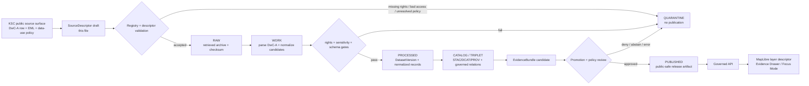

<!-- [KFM_META_BLOCK_V2]
doc_id: kfm://doc/NEEDS-VERIFICATION
title: KSC IPT / DwC-A Source Descriptor
type: standard
version: v1
status: draft
owners: NEEDS-VERIFICATION
created: 2026-04-25
updated: 2026-04-25
policy_label: NEEDS-VERIFICATION
related: ["NEEDS-VERIFICATION:schemas/contracts/v1/source/source_descriptor.schema.json", "NEEDS-VERIFICATION:docs/domains/flora/SOURCE_REGISTRY.md", "NEEDS-VERIFICATION:data/registry/flora/sources.yaml", "NEEDS-VERIFICATION:policy/flora/"]
tags: [kfm, source-descriptor, flora, kansas-flora, ksc, herbarium, dwc-a, ipt-needs-verification]
notes: [Standard source-contract doc, not a README-like directory doc. Badges included by explicit request. Current-session repo evidence was unavailable; source_id, owners, policy label, schema home, and exact IPT backing require verification.]
[/KFM_META_BLOCK_V2] -->

# KSC IPT / DwC-A Source Descriptor

Governed source-admission draft for **Kansas State University Vascular Plants (KSC)** as KFM flora specimen-occurrence evidence.

[](#status-and-review)
[](#document-classification)
[](#open-verification-items)
[](#source-role-interpretation)
[](#evidence-boundary)
[](#validation-expectations)

**Quick jumps:** [Status](#status-and-review) · [Repo fit](#repo-fit) · [Source identity](#source-identity-and-authority) · [Access surfaces](#access-surfaces) · [Inputs](#accepted-inputs) · [Exclusions](#exclusions) · [Normalization](#normalization-rules) · [Validation](#validation-expectations) · [Descriptor draft](#illustrative-descriptor-draft) · [Review gates](#review-gates-before-merge)

---

## Status and review

| Field | Value |
|---|---|
| Target path | `contracts/source/kansas_flora/ksc_ipt.md` |
| Document status | `draft` |
| Document role | Human-readable source descriptor / admission contract |
| README-like? | No. This is a standard source-contract doc; README directory-tree and quickstart requirements do not apply unless the real repo classifies this path differently. |
| Badges | Included because badges were explicitly requested and improve review visibility. |
| Current source verification date | 2026-04-25 |
| Repo implementation status | UNKNOWN. No mounted KFM repository, schema registry, source registry, CI, tests, workflows, or target file history were visible during drafting. |
| Default operational posture | Fail closed until source registry, rights, sensitivity, schema, and validator checks pass. |

> [!IMPORTANT]
> This descriptor does **not** activate a connector, schedule an ingest, approve publication, or authorize exact-coordinate public release. It only defines how KSC records should be admitted, constrained, validated, and handed off when the real repo conventions are verified.

[Back to top](#ksc-ipt--dwc-a-source-descriptor)

---

## Document classification

| Rule | Decision |
|---|---|
| KFM Meta Block v2 | Applied at top of file with reviewable placeholders. |
| Standard doc | Yes. The file describes a source contract, governance boundary, and validation expectations. |
| README-like doc | No, unless a future repo inspection shows `contracts/source/**` files are treated as landing pages. |
| Badges | Included by request; badge values mirror the truth posture rather than implying implementation maturity. |
| Mermaid diagram | Included because a source-admission flow is meaningful and grounded in KFM doctrine. |
| Related paths | Listed as `NEEDS-VERIFICATION` placeholders only. They are not asserted as existing repo files. |

---

## Evidence boundary

### CONFIRMED

- The requested target file path is `contracts/source/kansas_flora/ksc_ipt.md`.
- Public K-State and herbarium-portal pages identify the source family, KSC collection identity, rights posture, citation expectations, and DwC-A publishing surface.
- KFM doctrine requires source descriptors to preserve rights, sensitivity, source role, validation, lifecycle state, EvidenceBundle handoff, and publication gates.

### PROPOSED

- `ksc_ipt` as the final KFM `source_id`.
- `institutional` as the source role.
- The exact repo homes for schema, policy, validator, registry, fixtures, receipts, proofs, and catalog closure.
- The field names in the illustrative YAML descriptor.

### UNKNOWN / NEEDS VERIFICATION

- Whether this file already exists in the real repository.
- Whether `contracts/` or `schemas/contracts/v1/` is the canonical machine-contract home.
- Whether KSC is served by a true GBIF IPT instance, a Symbiota DwC-A publisher, or an IPT-like repo convention.
- Whether automated scheduled retrieval is allowed under all current source terms.
- Whether the exact DwC-A and EML URLs should be fetched directly, mirrored through a controlled source registry, or handled manually.
- CODEOWNERS / steward ownership.
- Policy label for this document and for downstream records.
- Record-level license variance, redaction fields, and sensitive-locality flags in the live archive.

[Back to top](#ksc-ipt--dwc-a-source-descriptor)

---

## Purpose

This file turns **Kansas State University Vascular Plants (KSC)** from an external flora data source into a **reviewable KFM source-admission contract**.

It makes these decisions inspectable before any ingestion, normalization, publication, map rendering, Focus Mode response, or Evidence Drawer use:

- what KSC records can support;
- what they cannot support by themselves;
- how rights, citation, redaction, sensitivity, and freshness must be carried forward;
- which record shapes are admissible;
- which failures quarantine data;
- what downstream objects need source identity, source role, rights, review, and release state.

This descriptor is intentionally narrower than a flora architecture plan. It governs one source candidate.

---

## Repo fit

| Surface | Relationship | Status |
|---|---|---|
| `contracts/source/kansas_flora/ksc_ipt.md` | Requested Markdown file; human-readable source descriptor. | CONFIRMED target from request |
| `NEEDS-VERIFICATION:schemas/contracts/v1/source/source_descriptor.schema.json` | Possible shared machine schema for source descriptors. | NEEDS VERIFICATION |
| `NEEDS-VERIFICATION:data/registry/flora/sources.yaml` | Possible source registry activation record. | NEEDS VERIFICATION |
| `NEEDS-VERIFICATION:docs/domains/flora/SOURCE_REGISTRY.md` | Possible human-facing flora source registry companion. | NEEDS VERIFICATION |
| `NEEDS-VERIFICATION:tools/validators/flora/` | Possible validator home for descriptor, archive, rights, and sensitivity checks. | NEEDS VERIFICATION |
| `NEEDS-VERIFICATION:policy/flora/` | Possible publication/redaction policy home. | NEEDS VERIFICATION |
| `NEEDS-VERIFICATION:data/receipts/flora/` | Possible ingest, validation, probe, and source-refresh receipt home. | NEEDS VERIFICATION |
| `NEEDS-VERIFICATION:data/proofs/flora/` | Possible release proof, catalog closure, and EvidenceBundle-related proof home. | NEEDS VERIFICATION |

> [!NOTE]
> If the mounted repo later proves different conventions, keep this file as the source-contract narrative and adapt the machine/schema homes through an ADR. Do not duplicate authority across `contracts/` and `schemas/`.

---

## Descriptor summary

| Field family | Descriptor decision | Truth posture |
|---|---|---|
| Source title | Kansas State University Vascular Plants (KSC) | CONFIRMED from external source pages |
| Institution / provider | Kansas State University Herbarium | CONFIRMED from external source pages |
| Collection code | `KSC` | CONFIRMED from external source pages |
| Proposed KFM source ID | `ksc_ipt` | PROPOSED from requested path; NEEDS VERIFICATION |
| Source family | Herbarium specimen occurrence data | INFERRED from source identity and DwC-A publisher |
| Source role | `institutional` | PROPOSED; confirm in KFM source-role registry |
| Machine package style | Darwin Core Archive (`DwC-A`) with EML metadata listed by the portal | CONFIRMED as listed; direct fetch NEEDS VERIFICATION |
| IPT status | Filename says `ipt`; public source evidence confirms a DwC-A publisher but not a dedicated KSC IPT instance | NEEDS VERIFICATION |
| Rights posture | KSC data/images are made available under CC BY 4.0, with responsible-use and citation/acknowledgement expectations | CONFIRMED from KSC data-use PDF |
| Sensitive locality posture | Portal states rare, threatened, or sensitive locality details are redacted from public data files | CONFIRMED from public publisher page |
| Public-release authority | No. This descriptor is not a ReleaseManifest or policy approval. | CONFIRMED KFM posture |
| Runtime authority | No. Runtime claims must resolve through released EvidenceBundles. | CONFIRMED KFM posture |

[Back to top](#ksc-ipt--dwc-a-source-descriptor)

---

## Source identity and authority

KSC is a strong candidate for KFM flora because it is an institutional herbarium source with Kansas and Great Plains specimen coverage. KFM should preserve that identity instead of flattening KSC records into generic plant points.

| Field | Value |
|---|---|
| Institution | Kansas State University Herbarium |
| Collection | Kansas State University Vascular Plants |
| Collection code | `KSC` |
| Provider / likely rights holder | Kansas State University Herbarium, unless a record states otherwise |
| Collection type | Preserved vascular plant specimens |
| Geographic emphasis | Kansas and Great Plains vascular plants, with some worldwide specimens |
| Temporal emphasis | Historical-to-current specimen evidence; public profile describes collections from the 1870s to the present |
| Primary KFM use | Specimen-backed occurrence and historical floristic support |
| Secondary KFM use | Taxon support, collection history, county/time occurrence context, and provenance for flora claims |
| Not allowed by itself | Legal plant status, current abundance, exact sensitive public locality, modeled range truth, or final taxonomic authority |

### Source-role interpretation

`institutional` is the proposed role because KSC is a named herbarium collection with curated specimen records.

KSC records can support:

- preserved specimen existence;
- source-native occurrence metadata;
- catalog identity;
- place/time collection support, when record quality permits;
- historical floristic context;
- source citation and dataset provenance.

KSC records do **not** automatically support:

- final accepted nomenclature;
- current population presence;
- current abundance;
- official protected-status determinations;
- public exact-location release;
- unrestricted media reuse;
- sensitive-locality access.

[Back to top](#ksc-ipt--dwc-a-source-descriptor)

---

## Access surfaces

| Surface | Use | Truth posture |
|---|---|---|
| [Kansas State University Herbarium][k-state-herbarium] | Institution identity, mission, contact context, collection scale. | CONFIRMED external source |
| [K-State Herbarium databases page][ksc-databases] | Database landing page and data-use policy link. | CONFIRMED external source |
| [KSC data licensing, publication, and uses][ksc-data-licensing] | Rights, CC BY 4.0, responsible use, citation expectations, citation-field mapping. | CONFIRMED external source |
| [Great Plains Herbaria DwC-A publisher][gph-dwca-publisher] | Public DwC-A/EML listing and sensitive-locality redaction statement. | CONFIRMED external source |
| [KSC DwC-A archive][gph-ksc-dwca] | Candidate machine archive URL listed by the publisher. | NEEDS VERIFICATION before automation |
| [KSC EML metadata][gph-ksc-eml] | Candidate metadata URL listed by the publisher. | NEEDS VERIFICATION before automation |
| [KSC collection profile][midwest-ksc-profile] | Collection description, contacts, and address. | CONFIRMED external source; collection statistics need reconciliation |
| [GBIF Darwin Core overview][gbif-dwc] | Standards context for Darwin Core and DwC-A. | REFERENCE |
| [GBIF IPT DwC-A guide][gbif-ipt-dwca] | Standards context for IPT and DwC-A publishing. | REFERENCE |
| [GBIF IPT occurrence-data guide][gbif-occurrence-data] | Standards context for occurrence records using DwC term names. | REFERENCE |

### Access tension to resolve

The Great Plains Herbaria publisher currently lists `KSC — Kansas State University Vascular Plants` with a DwC-A and EML row. A separate collection profile page surfaced collection-statistic values that should not be treated as reliable count evidence until the archive, EML, and source profile are probed together.

KFM should therefore store **source-package metadata from the actual retrieved archive and EML**, not profile-page counts, as the basis for DatasetVersion identity.

[Back to top](#ksc-ipt--dwc-a-source-descriptor)

---

## Accepted inputs

KFM may admit KSC records only when the intake artifact can preserve source-native identity, rights, citation, sensitivity posture, and retrieval provenance.

### Package-level inputs

| Input | Required? | Notes |
|---|---:|---|
| Source page reference | yes | Use controlled source registry reference after registry exists. |
| Archive URL or approved local fixture path | yes | Direct live URL is not enough; capture retrieval timestamp and checksum. |
| EML metadata URL or approved local fixture path | yes | Required for dataset-level metadata, citation, and provenance. |
| Retrieval timestamp | yes | Distinguish retrieval time from specimen event time and source publication date. |
| Archive checksum | yes | Required for deterministic DatasetVersion and replay. |
| Archive byte size | yes | Useful for drift detection and source-package receipts. |
| Publisher row date / source publication date | preferred | Preserve if available; do not infer from retrieval time. |
| Descriptor version | yes | Include this descriptor version in ingest receipts. |
| Rights and citation text | yes | Missing rights or citation text must block public promotion. |
| Sensitivity / redaction statement | yes | Public exact locality remains denied unless policy later approves. |

### Record-level fields or equivalents

| Field | Required | Use |
|---|---:|---|
| `institutionCode` | yes | Expected to identify Kansas State University Herbarium context. |
| `collectionCode` | yes | Expected value is `KSC`; unexpected values quarantine unless explicitly crosswalked. |
| `occurrenceID` | preferred | Primary source-native occurrence identity where present. |
| `catalogNumber` | preferred | Specimen citation support and fallback identity component. |
| `basisOfRecord` | yes | Expected specimen-like basis; unsupported values quarantine. |
| `scientificName` | yes | Preserve verbatim; do not treat as final accepted name without authority join. |
| `eventDate` | preferred | Collection/event time when parseable. |
| `verbatimEventDate` | preferred | Preserve when date parsing is incomplete or ambiguous. |
| `country` / `stateProvince` / `county` | preferred | Supports Kansas-first filtering and generalized public claims. |
| `locality` | conditional | Internal preservation depends on rights and sensitivity; public use is gated. |
| `decimalLatitude` / `decimalLongitude` | conditional | Never invent if absent, generalized, or redacted. |
| `coordinateUncertaintyInMeters` | conditional | Required before exact-point analytic use. |
| `geodeticDatum` | conditional | Required when coordinates are used analytically. |
| `recordedBy` | optional | Preserve if permitted and useful for provenance. |
| `identifiedBy` / `dateIdentified` | optional | Useful for determination lineage. |
| `datasetID` / `datasetName` | yes | Required for dataset citation and EvidenceBundle traceability. |
| `rightsHolder` / `license` | yes | Missing or conflicting values fail closed for publication. |
| `modified` | preferred | Supports source-diff behavior; not occurrence time. |

[Back to top](#ksc-ipt--dwc-a-source-descriptor)

---

## Exclusions

Do **not** use this descriptor to admit, infer, or publish:

- scraped records from a JavaScript search interface without a separate automation approval;
- exact locations for rare, threatened, sensitive, controlled, redacted, or steward-restricted records;
- inferred coordinates derived from locality text without a georeferencing receipt;
- media or images whose license and attribution cannot be preserved;
- KSC names as final accepted taxonomy without a separate taxon authority join;
- current abundance or absence claims from specimen records alone;
- legal/regulatory plant status;
- public MapLibre layers generated directly from RAW, WORK, or QUARANTINE records;
- Focus Mode or AI summaries that bypass EvidenceBundle resolution;
- any public artifact with missing citation, unresolved rights, unresolved sensitivity, or failed validation.

[Back to top](#ksc-ipt--dwc-a-source-descriptor)

---

## Source-admission flow



> [!TIP]
> Keep the split visible: **SourceDescriptor ≠ IngestReceipt ≠ DatasetVersion ≠ EvidenceBundle ≠ ReleaseManifest ≠ public layer**.

[Back to top](#ksc-ipt--dwc-a-source-descriptor)

---

## Normalization rules

### Identity

| Rule | Required behavior |
|---|---|
| Source ID | Use `ksc_ipt` only after registry approval. Until then, treat it as a proposed ID derived from the requested file name. |
| Record ID | Prefer `occurrenceID`; otherwise construct deterministic identity from `source_id`, `collectionCode`, `catalogNumber`, and DatasetVersion. |
| Catalog ID | Preserve `catalogNumber` separately from normalized occurrence identity. |
| Dataset ID | Preserve `datasetID`, `datasetName`, archive URL, EML URL, source publication date, retrieval timestamp, and checksum. |
| Hashing | Compute one digest for the retrieved package and a separate digest for normalized rows. |

### Taxonomy

- Preserve source-provided `scientificName`, authorship, taxon rank, and verbatim taxonomic fields.
- Join to KFM-approved taxon authority in a separate, reviewable step.
- Treat source taxon labels as **evidence support**, not final nomenclatural truth.
- ABSTAIN on species-level public claims when taxon resolution is ambiguous.

### Time

- Distinguish collection/event time, identification time, source modification time, retrieval time, and release time.
- Parse `eventDate` only when unambiguous.
- Preserve `verbatimEventDate`.
- Do not use `modified` as occurrence time.

### Geometry and sensitivity

- Treat coordinates as source-provided support, not automatic public points.
- Require datum and coordinate uncertainty before exact-point analytic use.
- Preserve redaction/generalization indicators when present.
- Deny public exact geometry for rare, threatened, sensitive, controlled, redacted, or uncertainty-lacking records unless a later policy-approved transform explicitly allows it.
- Do not reverse-engineer sensitive locality from text, images, collector notes, or related records.

### Rights and citation

- Preserve dataset-level and record-level rights fields.
- Carry attribution into EvidenceBundles, layer descriptors, public exports, and Focus Mode responses.
- Missing license, missing citation basis, conflicting rights, or altered copyright/license text must block public promotion.
- CC BY 4.0 compatibility is not the same as public exact-coordinate approval.

[Back to top](#ksc-ipt--dwc-a-source-descriptor)

---

## Validation expectations

| Gate | Pass condition | Fail-safe outcome |
|---|---|---|
| Descriptor completeness | Provider, source role, access surface, rights, sensitivity, cadence/update signal, and validation checks are present. | `ERROR` for descriptor build; do not fetch. |
| Access verification | Archive and EML surfaces are reachable in the approved automation mode. | `ABSTAIN` for activation. |
| Archive integrity | Checksum, byte size, retrieval timestamp, and source URL are recorded. | `QUARANTINE` package. |
| DwC-A structure | `meta.xml`, EML metadata, occurrence core, and declared extensions parse successfully. | `QUARANTINE` package. |
| Required fields | Minimum source, occurrence, taxon, basis, dataset, license, and citation fields exist or are explicitly mapped. | `QUARANTINE` affected records. |
| Rights check | Dataset and record rights are preserved and compatible with intended use. | `DENY_PUBLICATION`. |
| Sensitivity check | Sensitive or redacted records cannot emit exact public geometry. | `DENY_PUBLIC_EXACT_LOCATION`. |
| CRS / uncertainty check | Datum and coordinate uncertainty exist where exact geometry is used analytically. | `ABSTAIN` for exact geometry; allow safe generalized support if policy permits. |
| Date parsing | Collection date is parsed or verbatim uncertainty is retained. | `QUARANTINE` if time is required for claim. |
| Duplicate identity | Duplicate occurrence/catalog identities are classified. | `QUARANTINE` duplicates until reconciled. |
| Evidence handoff | Promoted records have source, record, license, date, geometry, sensitivity, and transform lineage. | Block promotion. |

### Minimum finite outcomes

| Outcome | Meaning in this descriptor |
|---|---|
| `ANSWER` | Source record can support the scoped claim through released EvidenceBundle context. |
| `ABSTAIN` | Evidence may exist, but scope, freshness, taxon resolution, geometry, or policy is insufficient. |
| `DENY` | Rights, sensitivity, policy, or requested public exposure blocks release. |
| `ERROR` | Descriptor, package, schema, validator, or resolver failed. |

[Back to top](#ksc-ipt--dwc-a-source-descriptor)

---

## Publication and UI posture

KSC-derived artifacts may become public only when all required gates pass:

1. source and record rights are compatible with the intended release;
2. sensitive locality rules pass;
3. exact coordinates are suppressed, generalized, or explicitly approved by policy;
4. taxon resolution and collection identity are visible;
5. EvidenceBundle includes source role, citation, date basis, rights, sensitivity, and transform lineage;
6. layer descriptors identify the artifact as `institutional specimen occurrence evidence`;
7. Focus Mode and Evidence Drawer consume only released, public-safe artifacts through governed APIs.

| Claim style | Use? | Reason |
|---|---:|---|
| “KSC specimen records support this taxon having been collected in this county during the recorded period.” | yes | Evidence-bound and scope-aware. |
| “This species currently occurs here.” | no | Specimen evidence may be historical. |
| “This is the official legal status of the plant.” | no | KSC is not a regulatory status source. |
| “The exact point is safe to publish because the record has coordinates.” | no | Coordinates and publication safety are separate decisions. |
| “The specimen record supports a historical occurrence claim, subject to source rights and sensitivity policy.” | yes | Preserves evidence character and limitations. |

[Back to top](#ksc-ipt--dwc-a-source-descriptor)

---

## Downstream handoff objects

| Object | Source descriptor contribution |
|---|---|
| `SourceDescriptor` | Source identity, role, rights, sensitivity, access, cadence, and validation posture. |
| `IngestReceipt` | Archive URL, EML URL, retrieval time, checksum, byte size, descriptor version, validator version. |
| `DatasetVersion` | KSC archive version, normalized row count, source publication date, transform hash, source descriptor ref. |
| `EvidenceBundle` | Source role, record refs, citation, rights, date basis, geometry basis, sensitivity posture, correction lineage. |
| `DecisionEnvelope` | Admission, quarantine, deny-publication, abstain, or error reason codes. |
| `LayerManifest` | Public-safe geometry class, generalized/suppressed status, EvidenceBundle refs, attribution text. |
| `ReleaseManifest` | Approved artifacts, checksums, policy decisions, review state, rollback target. |
| `CorrectionNotice` | Supersession or withdrawal when source updates, rights change, redaction rules tighten, or evidence is corrected. |

---

## Illustrative descriptor draft

> [!NOTE]
> This YAML is **illustrative only**. It names intended behavior and minimum field families without claiming the final schema already exists.

```yaml
version: v1
kind: SourceDescriptor

identity:
  proposed_source_id: ksc_ipt
  source_id_status: NEEDS_VERIFICATION
  title: Kansas State University Vascular Plants (KSC)
  provider: Kansas State University Herbarium
  collection_code: KSC
  source_family: herbarium_specimen_occurrence
  proposed_source_role: institutional
  source_role_status: PROPOSED

authority_boundary:
  can_support:
    - preserved_specimen_occurrence
    - historical_collection_context
    - source_native_collection_identity
    - county_or_generalized_flora_support_when_policy_safe
  cannot_support:
    - legal_regulatory_status
    - current_abundance
    - modeled_range_truth
    - automatic_public_exact_location
    - final_taxonomic_authority

access:
  documented_mode: dwca_download
  exact_ipt_status: NEEDS_VERIFICATION
  documented_surfaces:
    - k_state_herbarium_home
    - k_state_data_licensing_pdf
    - great_plains_herbaria_dwca_publisher
    - ksc_dwca_archive_candidate
    - ksc_eml_candidate
  automation_status: NEEDS_VERIFICATION
  cadence_update_behavior: publisher_row_date_or_rss_probe
  direct_fetch_allowed: NEEDS_VERIFICATION

rights_and_sensitivity:
  dataset_license_external_claim: CC-BY-4.0
  license_status: CONFIRMED_EXTERNAL_SOURCE
  rights_holder_default: Kansas State University Herbarium
  citation_required: true
  sensitive_locality_statement: public_dwca_redacts_rare_threatened_sensitive_records
  public_publication_eligibility: deny_exact_location_until_policy_review
  exact_location_publication: deny_unless_explicitly_safe

expected_record_shape:
  standard: Darwin Core Archive
  core: occurrence
  required_or_expected_terms:
    - institutionCode
    - collectionCode
    - occurrenceID
    - catalogNumber
    - basisOfRecord
    - scientificName
    - datasetID
    - datasetName
    - rightsHolder
    - license
  conditional_terms:
    - eventDate
    - verbatimEventDate
    - decimalLatitude
    - decimalLongitude
    - coordinateUncertaintyInMeters
    - geodeticDatum
    - locality
    - recordedBy
    - identifiedBy
    - modified

validation:
  required_checks:
    - descriptor_complete
    - access_surface_verified
    - archive_checksum_recorded
    - dwca_meta_parses
    - eml_parses
    - occurrence_core_present
    - source_role_institutional_or_registry_approved
    - rights_citation_preserved
    - sensitive_locality_redaction_respected
    - no_public_exact_geometry_without_policy_pass
    - evidence_ref_ready
```

[Back to top](#ksc-ipt--dwc-a-source-descriptor)

---

## Review gates before merge

- [ ] Confirm whether `ksc_ipt` is the accepted source ID.
- [ ] Confirm whether this file already exists in the real repository.
- [ ] Confirm actual schema home for `SourceDescriptor`.
- [ ] Confirm owner / CODEOWNERS responsibility.
- [ ] Confirm document `policy_label`.
- [ ] Verify whether KSC uses a true IPT instance or a Symbiota DwC-A publisher surface.
- [ ] Verify DwC-A and EML URLs in a no-publication probe.
- [ ] Record archive checksum, byte size, retrieval timestamp, and publisher row date in a fixture.
- [ ] Add one valid descriptor fixture and invalid fixtures for missing rights, missing citation, sensitive exact location, malformed archive, and unexpected collection code.
- [ ] Add policy tests for exact-location denial, missing license, missing citation, and unresolved source role.
- [ ] Confirm automated scheduled fetching is allowed.
- [ ] Confirm whether KSC belongs in the first active flora source wave or a later supporting-source wave.
- [ ] Add or update source registry documentation after repo path verification.
- [ ] Ensure public layers cannot read RAW, WORK, or QUARANTINE records.

---

## Open verification items

| Item | Why it matters | Status |
|---|---|---|
| Mounted repo and file history | Determines whether this is a new file or revision. | NEEDS VERIFICATION |
| Owner / steward | Required for review burden and source activation. | NEEDS VERIFICATION |
| Final `source_id` | Prevents breaking receipts, catalog refs, and EvidenceRefs. | NEEDS VERIFICATION |
| Exact IPT vs Symbiota/DwC-A surface | Filename says `ipt`; current public evidence confirms DwC-A publishing, not exact IPT hosting. | NEEDS VERIFICATION |
| Archive and EML retrieval | Direct fetch behavior was not validated as a KFM automation path. | NEEDS VERIFICATION |
| Record counts and profile stats | Public surfaces may differ; archive metadata should govern DatasetVersion facts. | NEEDS VERIFICATION |
| Automation permission / rate limits | Prevents unsafe scheduled harvesting. | NEEDS VERIFICATION |
| Record-level license variance | Dataset-level rights do not remove record-level checks. | NEEDS VERIFICATION |
| Sensitive locality mapping | Redaction state must carry into policy and UI. | NEEDS VERIFICATION |
| Taxonomic authority join | KSC names must not become final accepted taxonomy by default. | NEEDS VERIFICATION |
| Public layer strategy | Exact, generalized, county, or suppressed geometry depends on policy gates. | NEEDS VERIFICATION |

---

<details>
<summary>Reference links</summary>

- [Kansas State University Herbarium][k-state-herbarium]
- [K-State Herbarium databases][ksc-databases]
- [KSC data licensing, publication, and uses][ksc-data-licensing]
- [Great Plains Herbaria DwC-A publisher][gph-dwca-publisher]
- [KSC DwC-A archive candidate][gph-ksc-dwca]
- [KSC EML metadata candidate][gph-ksc-eml]
- [KSC collection profile][midwest-ksc-profile]
- [GBIF Darwin Core overview][gbif-dwc]
- [GBIF IPT DwC-A guide][gbif-ipt-dwca]
- [GBIF IPT occurrence-data guide][gbif-occurrence-data]

</details>

[k-state-herbarium]: https://www.k-state.edu/herbarium/
[ksc-databases]: https://www.k-state.edu/herbarium/databases/
[ksc-data-licensing]: https://www.k-state.edu/herbarium/databases/data-licensing.pdf
[gph-dwca-publisher]: https://ngpherbaria.org/portal/collections/datasets/datapublisher.php
[gph-ksc-dwca]: https://ngpherbaria.org/portal/content/dwca/KSC_DwC-A.zip
[gph-ksc-eml]: https://ngpherbaria.org/portal/collections/datasets/emlhandler.php?collid=614
[midwest-ksc-profile]: https://midwestherbaria.org/portal/collections/misc/collprofiles.php?collid=614
[gbif-dwc]: https://www.gbif.org/darwin-core
[gbif-ipt-dwca]: https://ipt.gbif.org/manual/en/ipt/latest/dwca-guide
[gbif-occurrence-data]: https://ipt.gbif.org/manual/en/ipt/latest/occurrence-data
