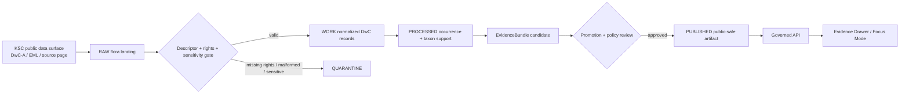

<!-- [KFM_META_BLOCK_V2]
doc_id: kfm://doc/NEEDS-VERIFICATION
title: KSC IPT / Great Plains Herbaria Source Descriptor
type: standard
version: v1
status: draft
owners: NEEDS-VERIFICATION
created: 2026-04-25
updated: 2026-04-25
policy_label: NEEDS-VERIFICATION
related: [../../../schemas/contracts/v1/source/source_descriptor.schema.json, ../../../docs/domains/flora/SOURCE_REGISTRY.md, ../../../data/registry/flora/sources.yaml]
tags: [kfm, source-descriptor, flora, kansas-flora, herbarium, ksc, darwin-core-archive, dwc-a, ipt]
notes: [Target path requested as contracts/source/kansas_flora/ksc_ipt.md. Mounted repo, owner, policy label, final source_id, schema-home authority, and whether KSC is served by a true IPT instance remain NEEDS VERIFICATION. Current documented access surface is the Consortium of Great Plains Herbaria Darwin Core Archive publisher.]
[/KFM_META_BLOCK_V2] -->

# KSC IPT / Great Plains Herbaria Source Descriptor

Governed source-admission draft for **Kansas State University Vascular Plants (KSC)** as a KFM flora `SourceDescriptor`.

> [!NOTE]
> **Document posture:** `draft`  
> **Target path:** `contracts/source/kansas_flora/ksc_ipt.md`  
> **Source role:** `institutional` specimen-occurrence evidence  
> **Truth posture:** external source identity and rights posture are partly confirmed; repo placement, source registry ID, automation approval, and exact KFM schema keys remain `NEEDS VERIFICATION`.

**Quick jumps:** [Purpose](#purpose) · [Repo fit](#repo-fit) · [Descriptor summary](#descriptor-summary) · [Source identity](#source-identity) · [Access surfaces](#access-surfaces) · [Accepted inputs](#accepted-inputs) · [Exclusions](#exclusions) · [Normalization rules](#normalization-rules) · [Validation expectations](#validation-expectations) · [Illustrative descriptor draft](#illustrative-descriptor-draft) · [Open verification items](#open-verification-items)

---

## Purpose

This file turns **KSC herbarium occurrence data** from “a useful flora source” into a **reviewable KFM admission contract**.

It keeps these decisions visible before ingestion, scheduling, normalization, publication, or UI use:

- what the source is allowed to support;
- what it is **not** allowed to prove;
- how rights, citation, sensitivity, redaction, and freshness must be carried forward;
- how Darwin Core Archive records should enter KFM’s governed lifecycle;
- which validation failures quarantine records before they become public-facing evidence.

This document is **not** a release artifact, **not** a proof bundle, **not** a catalog record, and **not** permission to publish exact coordinates.

[Back to top](#ksc-ipt--great-plains-herbaria-source-descriptor)

---

## Repo fit

| Surface | Relationship |
|---|---|
| `contracts/source/kansas_flora/ksc_ipt.md` | This human-readable source descriptor draft. |
| `../../../schemas/contracts/v1/source/source_descriptor.schema.json` | Proposed shared machine contract. Use repo-native schema home if different. |
| `../../../docs/domains/flora/SOURCE_REGISTRY.md` | Proposed human registry companion for flora source families. |
| `../../../data/registry/flora/sources.yaml` | Proposed machine registry entry for source activation state. |
| `../../../tools/validators/flora/` | Proposed validator home for descriptor, DwC-A, rights, sensitivity, and fixture checks. |
| `../../../policy/flora/` | Proposed policy-as-code home for publication eligibility, redaction, and controlled-access decisions. |
| `../../../data/receipts/flora/` | Downstream ingest/run receipt location, if repo convention supports it. |
| `../../../data/proofs/flora/` | Downstream proof objects, EvidenceBundles, or release proof packs, if repo convention supports it. |

> [!IMPORTANT]
> If the real repository proves that `contracts/` and `schemas/` have different canonical roles, adapt this file through the flora schema-home ADR instead of duplicating authority.

[Back to top](#ksc-ipt--great-plains-herbaria-source-descriptor)

---

## Descriptor summary

| Field family | Descriptor decision | Status |
|---|---|---|
| Source title | `Kansas State University Vascular Plants (KSC)` | CONFIRMED from public source pages |
| Institution / provider | `Kansas State University Herbarium` | CONFIRMED |
| Collection code | `KSC` | CONFIRMED |
| Proposed KFM source ID | `ksc_ipt` | PROPOSED / NEEDS VERIFICATION |
| Source family | Herbarium specimen occurrence data | CONFIRMED |
| KFM source role | `institutional` | PROPOSED, aligned to flora doctrine |
| First-wave lane fit | Kansas flora specimen evidence and historical occurrence context | PROPOSED |
| Access style | Darwin Core Archive / EML via Consortium of Great Plains Herbaria publisher | CONFIRMED as public source surface; exact fetch behavior NEEDS VERIFICATION |
| “IPT” status | File name retains `ipt`; exact IPT instance is not confirmed in this session | NEEDS VERIFICATION |
| Rights posture | KSC states data/images are freely available under CC BY 4.0 and require acknowledgement/citation | CONFIRMED |
| Sensitive locality posture | Great Plains Herbaria states rare/threatened/sensitive locality details are redacted from public data files | CONFIRMED |
| Publication authority | No. This descriptor only admits and constrains a source. | CONFIRMED KFM posture / PROPOSED source application |
| Runtime authority | No. Runtime claims must resolve through EvidenceBundle and release state. | CONFIRMED KFM posture |

---

## Why this source belongs in KFM flora work

KSC is a Kansas-first institutional herbarium source with strong fit for **preserved specimen occurrence evidence**, especially where KFM needs time-aware plant records, historical collection context, Kansas and Great Plains flora coverage, and collection-backed citations.

KFM should preserve KSC as an **institutional evidence source**, not flatten it into:

- regulatory flora status;
- current abundance;
- modeled range truth;
- sensitive-location permission;
- a taxonomic authority by itself;
- a public layer without release review.



> [!TIP]
> Keep the admission split visible: **source descriptor ≠ ingest receipt ≠ EvidenceBundle ≠ proof pack ≠ ReleaseManifest ≠ public map layer**.

[Back to top](#ksc-ipt--great-plains-herbaria-source-descriptor)

---

## Source identity

| Field | Value |
|---|---|
| Institution | Kansas State University Herbarium |
| Collection | Kansas State University Vascular Plants |
| Collection code | `KSC` |
| Provider / rights holder | Kansas State University Herbarium, unless a record states otherwise |
| Collection type | Preserved vascular plant specimens |
| Geographic emphasis | Kansas and the Great Plains, with some worldwide specimens |
| Temporal emphasis | Historical-to-current specimen evidence; public profile describes collections spanning from the 1870s to the present |
| Primary evidence use | Specimen-backed plant occurrence and historical floristic evidence |
| Secondary evidence use | Taxon support, collection history, county/time occurrence context, and provenance for flora claims |
| Not allowed to support by itself | Legal protected status, exact sensitive public coordinates, current abundance, habitat suitability, range models, or final taxonomic treatment |

### Source-role interpretation

KFM should classify this source as `institutional`.

That means it can provide strong evidence for:

- preserved specimen existence;
- collection code and catalog identity;
- source-native occurrence metadata;
- collection-backed place/time support;
- historical floristic change analysis, when uncertainty is retained.

It does **not** automatically provide:

- final accepted nomenclature;
- current population presence;
- public release permission for exact locality;
- unrestricted media reuse;
- legal/regulatory plant-status authority.

[Back to top](#ksc-ipt--great-plains-herbaria-source-descriptor)

---

## Access surfaces

| Surface | Use in this descriptor | Status |
|---|---|---|
| [Kansas State University Herbarium][ksc-home] | Institution identity, mission, staff/contact context | CONFIRMED |
| [K-State Herbarium databases page][ksc-databases] | Public database landing and data-use policy link | CONFIRMED |
| [KSC data licensing, publication, and use][ksc-licensing] | Rights, citation, CC BY 4.0, and use constraints | CONFIRMED |
| [Consortium of Great Plains Herbaria DwC-A publisher][gph-dwca-publisher] | Public Darwin Core Archive listing and KSC archive entry | CONFIRMED |
| [Kansas State University Vascular Plants profile][gph-ksc-profile] | Collection description and contacts | CONFIRMED |
| [KSC DwC-A archive][gph-ksc-dwca] | Candidate machine download surface | NEEDS VERIFICATION before automation |
| [KSC EML metadata][gph-ksc-eml] | Candidate metadata surface | NEEDS VERIFICATION before automation |
| [GBIF Darwin Core overview][gbif-dwc] | External standard context for DwC/DwC-A | REFERENCE |
| [GBIF IPT manual][gbif-ipt] | External standard context for IPT-style biodiversity publishing | REFERENCE |

### Known source tension

The public DwC-A publisher currently lists a KSC archive row, while the parsed KSC collection profile surfaced a conflicting or incomplete record-count display in this session. KFM must **not** rely on profile record counts until the archive, EML, and any collection profile metadata are probed and reconciled by a validator.

[Back to top](#ksc-ipt--great-plains-herbaria-source-descriptor)

---

## Accepted inputs

KFM may admit records from this source only when the intake artifact can preserve source-native identity, rights, and sensitivity posture.

### Required source-package inputs

- source page URL or controlled source reference;
- archive URL or local fixture path;
- EML metadata URL or local fixture path;
- retrieval timestamp;
- archive checksum;
- archive size;
- publication date or update date when available;
- source descriptor version;
- rights and citation text;
- sensitivity/redaction statement.

### Required record-level fields or equivalents

| Field | Required | Notes |
|---|---:|---|
| `institutionCode` | yes | Expected to identify KSC / Kansas State University Herbarium context. |
| `collectionCode` | yes | Expected collection code is `KSC`; quarantine unexpected values unless intentionally crosswalking. |
| `occurrenceID` | preferred | Primary source-native occurrence identity when present. |
| `catalogNumber` | preferred | Use as catalog identity and specimen citation support. |
| `basisOfRecord` | yes | Expected specimen-like value; reject or quarantine unsupported basis values. |
| `scientificName` | yes | Preserve verbatim; do not treat as final accepted name without taxon authority join. |
| `eventDate` | preferred | Preserve `verbatimEventDate` if parsing is incomplete. |
| `country` / `stateProvince` / `county` | preferred | Important for Kansas-first scope and public generalization. |
| `locality` | conditional | Preserve internally only when rights and sensitivity permit; public use is gated. |
| `decimalLatitude` / `decimalLongitude` | conditional | Never invent if absent or redacted. |
| `coordinateUncertaintyInMeters` | conditional | Required for exact-point public consideration. |
| `geodeticDatum` | conditional | Required when coordinates are used analytically. |
| `recordedBy` | optional | Preserve if permitted and useful for citation/provenance. |
| `identifiedBy` / `dateIdentified` | optional | Useful for determination lineage. |
| `datasetID` / `datasetName` | yes | Supports dataset citation and EvidenceBundle traceability. |
| `rightsHolder` / `license` | yes | Missing or conflicting values fail closed for publication. |
| `modified` | preferred | Supports freshness and diff behavior. |

[Back to top](#ksc-ipt--great-plains-herbaria-source-descriptor)

---

## Exclusions

Do **not** use this descriptor to admit or publish:

- scraped records from the JavaScript search interface unless a separate automation approval exists;
- exact locations for rare, threatened, sensitive, controlled, or redacted records;
- inferred coordinates derived from locality strings without a georeferencing receipt;
- media files whose license or attribution cannot be preserved;
- source records with missing rights posture as public-ready;
- KSC names as accepted taxonomy without a separate taxon authority join;
- county-level absence or abundance claims from specimen records alone;
- public MapLibre layers generated directly from RAW, WORK, or QUARANTINE records;
- AI summaries that cite this source without EvidenceBundle resolution.

[Back to top](#ksc-ipt--great-plains-herbaria-source-descriptor)

---

## Normalization rules

### Identity

| Rule | Required behavior |
|---|---|
| Source identity | Use `ksc_ipt` only after source registry approval; otherwise use a temporary `NEEDS_VERIFICATION__ksc_ipt` fixture ID. |
| Record identity | Prefer `occurrenceID`; otherwise construct deterministic ID from `source_id`, `collectionCode`, `catalogNumber`, and dataset version. |
| Catalog identity | Preserve `catalogNumber` separately from normalized occurrence ID. |
| Dataset identity | Preserve `datasetID`, `datasetName`, archive URL, EML URL, publication date, retrieval timestamp, and checksum. |
| Hashing | Compute a stable digest over the retrieved archive and a separate digest over normalized rows. |

### Taxonomy

- Preserve `scientificName`, authorship, taxon rank, and verbatim taxonomic fields where present.
- Join to a KFM-approved taxon authority only in a separate, reviewable normalization step.
- Record source taxon labels as **evidence support**, not final nomenclatural truth.
- ABSTAIN on species-level claims if taxon resolution is ambiguous.

### Time

- Parse `eventDate` into normalized valid-time fields only when unambiguous.
- Preserve `verbatimEventDate`.
- Distinguish collection date, identification date, source modification date, retrieval time, and release time.
- Do not use `modified` as occurrence time.

### Geometry and sensitivity

- Treat coordinates as source-provided support, not as automatic public points.
- Require CRS/datum and coordinate uncertainty before analytic use.
- Preserve explicit redaction/generalization indicators where available.
- If a record is redacted, rare, threatened, sensitive, controlled, or missing coordinate uncertainty, public outputs must be generalized, suppressed, or denied.
- Do not reverse-engineer sensitive locality details from text.

### Rights and citation

- Preserve dataset-level and record-level rights fields.
- Require attribution/citation in generated EvidenceBundles and public outputs.
- Missing license, conflicting rights, or absent citation text must block public promotion.
- A CC BY-compatible dataset posture is **not** equivalent to exact-coordinate publication approval.

[Back to top](#ksc-ipt--great-plains-herbaria-source-descriptor)

---

## Validation expectations

| Gate | Pass condition | Fail-safe outcome |
|---|---|---|
| Descriptor completeness | `source_id`, provider, role, rights posture, sensitivity posture, access path, cadence, and authority boundary are present. | `ERROR` for descriptor build; do not fetch. |
| Access verification | Archive and EML surfaces are reachable in the approved automation mode. | `ABSTAIN` for activation; no scheduled ingest. |
| Archive integrity | Archive checksum, byte size, retrieval timestamp, and source URL are recorded. | `QUARANTINE` package. |
| DwC-A structure | `meta.xml`, `eml.xml`, occurrence core, and declared extensions parse successfully. | `QUARANTINE` package. |
| Required fields | Minimum source, taxon, occurrence, basis, rights, and dataset fields exist or are mapped explicitly. | `QUARANTINE` affected records. |
| Rights check | Dataset and record licenses are preserved and publication-compatible. | `DENY_PUBLICATION` until resolved. |
| Sensitive locality check | Sensitive/redacted records are flagged and cannot emit exact public geometry. | `DENY_PUBLIC_EXACT_LOCATION`. |
| CRS / uncertainty check | Coordinate fields include datum and uncertainty where exact-point analysis is attempted. | `ABSTAIN` for exact geometry; allow generalized support if safe. |
| Date parsing | Collection date is parsed or verbatim date retained with uncertainty. | `QUARANTINE` if time is required for the claim. |
| Duplicate identity | Duplicate occurrence/catalog identities are detected and classified. | `QUARANTINE` duplicates until reconciled. |
| Evidence handoff | Every promoted record has EvidenceRef-ready source, record, license, date, and transform lineage. | Block promotion. |

> [!WARNING]
> A passing source descriptor only authorizes **controlled admission**. Public release still requires catalog closure, policy review, redaction/generalization receipts where needed, EvidenceBundle resolution, and a ReleaseManifest.

[Back to top](#ksc-ipt--great-plains-herbaria-source-descriptor)

---

## Publication and UI posture

KSC-derived KFM artifacts may become public only when these are true:

1. source and record rights are compatible with the intended release;
2. sensitive locality rules pass;
3. exact coordinates are not public unless explicitly safe;
4. taxon resolution and collection identity are visible;
5. EvidenceBundle includes source role, citation, date basis, rights, sensitivity posture, and transform lineage;
6. layer descriptors label the data as `institutional specimen occurrence evidence`;
7. Focus Mode and Evidence Drawer consume only released public-safe artifacts.

Public-facing KSC flora claims should use careful wording:

| Claim style | Preferred? | Reason |
|---|---:|---|
| “KSC specimen records support this taxon having been collected in this county during the recorded period.” | yes | Evidence-bound and scope-aware. |
| “This species currently occurs here.” | no | Specimen evidence alone may be historical. |
| “This is the official legal status of the plant.” | no | KSC is not a regulatory status source. |
| “The exact point is safe to publish because the record has coordinates.” | no | Coordinates and publication safety are separate decisions. |
| “The specimen record supports a historical occurrence claim, subject to source rights and sensitivity policy.” | yes | Preserves evidence character and limitations. |

[Back to top](#ksc-ipt--great-plains-herbaria-source-descriptor)

---

## Downstream handoff objects

| Object | Source descriptor contribution |
|---|---|
| `IngestReceipt` | Archive URL, retrieval time, checksum, EML URL, source descriptor version, validator version. |
| `DatasetVersion` | KSC archive version, normalized row count, source publication date, transform hash. |
| `EvidenceBundle` | Source role, record IDs, citation, rights, date basis, geometry basis, sensitivity posture. |
| `DecisionEnvelope` | Admission, quarantine, deny-publication, or abstain reason codes. |
| `LayerManifest` | Public-safe geometry class, generalized/suppressed status, EvidenceBundle refs. |
| `ReleaseManifest` | Approved artifacts, checksums, policy decisions, review state, rollback target. |
| `CorrectionNotice` | Supersession or withdrawal of records when source updates, rights change, or redaction rules tighten. |

---

## Illustrative descriptor draft

> [!NOTE]
> This YAML is **illustrative only**. It names the intended behavior and minimum fields without claiming the final schema shape already exists.

```yaml
version: v1
kind: SourceDescriptor

identity:
  source_id: ksc_ipt # PROPOSED; confirm in data/registry/flora/sources.yaml
  title: Kansas State University Vascular Plants (KSC)
  provider: Kansas State University Herbarium
  collection_code: KSC
  source_family: herbarium_specimen_occurrence
  source_role: institutional

authority_boundary:
  can_support:
    - preserved_specimen_occurrence
    - historical_collection_context
    - source_native_collection_identity
    - county_or_generalized_flora_support_when_safe
  cannot_support:
    - legal_regulatory_status
    - current_abundance
    - modelled_range_truth
    - automatic_public_exact_location
    - final_taxonomic_authority

access:
  mode: dwca_download
  documented_surfaces:
    - https://ngpherbaria.org/portal/collections/datasets/datapublisher.php
    - https://ngpherbaria.org/portal/collections/misc/collprofiles.php?collid=614
    - https://ngpherbaria.org/portal/content/dwca/KSC_DwC-A.zip
    - https://ngpherbaria.org/portal/collections/datasets/emlhandler.php?collid=614
  auth_model: none_documented_for_public_dwca
  automation_status: NEEDS_VERIFICATION
  cadence_update_behavior: source_published_date_or_rss_probe

rights_and_sensitivity:
  dataset_license: CC-BY-4.0
  rights_holder: Kansas State University Herbarium
  citation_required: true
  sensitive_locality_statement: public_dwca_redacts_rare_threatened_sensitive_records
  public_publication_eligibility: public_generalized_only_until_policy_review
  exact_location_publication: deny_unless_explicitly_safe

expected_record_shape:
  standard: Darwin Core Archive
  core: occurrence
  required_terms:
    - institutionCode
    - collectionCode
    - occurrenceID
    - catalogNumber
    - basisOfRecord
    - scientificName
    - datasetID
    - datasetName
    - rightsHolder
    - license
  conditional_terms:
    - eventDate
    - decimalLatitude
    - decimalLongitude
    - coordinateUncertaintyInMeters
    - geodeticDatum
    - locality
    - recordedBy
    - identifiedBy
    - modified

validation:
  required_checks:
    - descriptor_complete
    - access_surface_verified
    - archive_checksum_recorded
    - dwca_meta_parses
    - eml_parses
    - occurrence_core_present
    - source_role_institutional
    - rights_citation_preserved
    - sensitive_locality_redaction_respected
    - no_public_exact_geometry_without_policy_pass
    - evidence_ref_ready
```

[Back to top](#ksc-ipt--great-plains-herbaria-source-descriptor)

---

## Review gates before merge

- [ ] Confirm whether `ksc_ipt` is the accepted source ID or rename to the repo’s source-ID convention.
- [ ] Confirm actual schema home for `SourceDescriptor`.
- [ ] Confirm owner / CODEOWNERS responsibility.
- [ ] Verify DwC-A and EML URLs in a no-publication probe.
- [ ] Record archive checksum and source publication date in a fixture.
- [ ] Add one valid descriptor fixture and at least four invalid fixtures.
- [ ] Add policy tests for missing license, sensitive exact location, missing citation, and malformed archive.
- [ ] Confirm whether automated scheduled fetching is allowed under source terms and KFM policy.
- [ ] Confirm whether KFM treats KSC as first-wave flora source or later supporting source.
- [ ] Add or update `docs/domains/flora/SOURCE_REGISTRY.md` and `data/registry/flora/sources.yaml`.
- [ ] Ensure no public layer reads RAW, WORK, or QUARANTINE records.

---

## Open verification items

| Item | Why it matters | Status |
|---|---|---|
| Mounted repo existence and target file history | Determines whether this is a new file or revision. | NEEDS VERIFICATION |
| Owner / steward | Required for source activation and review burden. | NEEDS VERIFICATION |
| Final `source_id` | Avoids breaking receipts, catalog refs, and EvidenceRefs. | NEEDS VERIFICATION |
| Exact IPT vs Symbiota/DwC-A surface | The filename says `ipt`; public evidence in this session points to Great Plains Herbaria DwC-A publishing. | NEEDS VERIFICATION |
| Current archive row count and profile stats | Public pages surfaced inconsistent count signals. | NEEDS VERIFICATION |
| Automation permission and rate limits | Prevents policy-unsafe scheduled harvesting. | NEEDS VERIFICATION |
| Record-level license variance | Dataset-level rights do not remove record-level checks. | NEEDS VERIFICATION |
| Sensitive locality policy mapping | Redaction state must carry into KFM policy and UI. | NEEDS VERIFICATION |
| Taxonomic authority join | KSC names must not become final accepted taxonomy by default. | NEEDS VERIFICATION |
| Public layer strategy | Exact, generalized, county, or suppressed geometry depends on rights and sensitivity gates. | NEEDS VERIFICATION |

---

## Reference links

[ksc-home]: https://www.k-state.edu/herbarium/
[ksc-databases]: https://www.k-state.edu/herbarium/databases/
[ksc-licensing]: https://www.k-state.edu/herbarium/databases/data-licensing.pdf
[gph-dwca-publisher]: https://ngpherbaria.org/portal/collections/datasets/datapublisher.php
[gph-ksc-profile]: https://ngpherbaria.org/portal/collections/misc/collprofiles.php?collid=614
[gph-ksc-dwca]: https://ngpherbaria.org/portal/content/dwca/KSC_DwC-A.zip
[gph-ksc-eml]: https://ngpherbaria.org/portal/collections/datasets/emlhandler.php?collid=614
[gbif-dwc]: https://www.gbif.org/darwin-core
[gbif-ipt]: https://ipt.gbif.org/manual/
