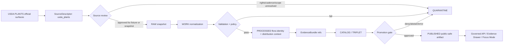

<!-- [KFM_META_BLOCK_V2]
doc_id: kfm://doc/NEEDS-VERIFICATION__contracts_source_kansas_flora_usda_plants_md
title: USDA PLANTS Source Contract
type: standard
version: v1
status: draft
owners: NEEDS-VERIFICATION__flora_steward
created: 2026-04-25
updated: 2026-04-25
policy_label: NEEDS-VERIFICATION
related: [NEEDS-VERIFICATION__source_descriptor_schema, NEEDS-VERIFICATION__flora_source_registry, NEEDS-VERIFICATION__flora_policy]
tags: [kfm, contracts, source-descriptor, kansas-flora, usda-plants, taxonomy, distribution, source-intake]
notes: [doc_id owner policy_label and companion schema paths require repo verification, created and updated reflect this generated draft, this is a human source contract not an executable schema, USDA PLANTS endpoint cadence checksum and source rows must be reverified before activation]
[/KFM_META_BLOCK_V2] -->

<a id="top"></a>

# USDA PLANTS Source Contract

Human source contract for admitting **USDA PLANTS** into the Kansas flora lane without turning a useful public plant database into unrestricted occurrence truth, legal-status truth, image-rights truth, or rare-species release authority.

> [!IMPORTANT]
> This document defines the **source-admission posture** for `usda_plants`. It does not prove that a live connector, registry entry, schema companion, validator, workflow, or published Kansas flora layer already exists in the repository.

## Quick navigation

[Contract posture](#contract-posture) · [Repo fit](#repo-fit) · [Source identity](#source-identity) · [Authority boundary](#authority-boundary) · [Accepted inputs](#accepted-inputs) · [Exclusions](#exclusions) · [Lifecycle](#lifecycle) · [Descriptor skeleton](#descriptor-skeleton) · [Validation gates](#validation-gates) · [Evidence Drawer obligations](#evidence-drawer-obligations) · [Review checklist](#review-checklist) · [References](#references)

---

## Contract posture

| Field | Value |
| --- | --- |
| Source profile | `usda_plants` |
| Target path | `contracts/source/kansas_flora/usda_plants.md` |
| KFM lane | Kansas flora |
| Source role | `official` for USDA/NRCS plant nomenclature, symbols, public checklist, and PLANTS distribution context within the source boundary |
| Runtime posture | cite-or-abstain; no source claim may bypass EvidenceBundle resolution |
| Publication posture | public-safe taxonomy and generalized distribution context only after rights, review, and source snapshot checks |
| Current implementation depth | **UNKNOWN** until the real repo, schemas, validators, registry, workflows, and emitted artifacts are inspected |
| Activation posture | **NEEDS VERIFICATION** for current download endpoint, cadence, checksum, state-list shape, and validator wiring |

**Canonical one-line posture:** USDA PLANTS is a public, official USDA/NRCS plant-information source that may support standardized plant identity and broad distribution context, but it must not be treated as exact occurrence evidence, rare-species release authorization, legal protected-status authority, image-rights clearance, or culturally sensitive knowledge clearance.

[Back to top](#top)

---

## Repo fit

This file is a **human contract** for a source family. It should sit upstream of machine-readable source descriptors, fixtures, validators, ingest receipts, EvidenceBundles, release manifests, and UI trust payloads.

| Direction | Surface | Status | Role |
| --- | --- | --- | --- |
| Parent contract area | `contracts/source/` | **NEEDS VERIFICATION** | Source-family human contracts and source-admission rules |
| Domain lane | `docs/domains/flora/` | **NEEDS VERIFICATION** | Flora lane architecture, source registry guide, public-safety policy |
| Source registry | `data/registry/flora/sources.yaml` or repo-equivalent | **PROPOSED** | Machine index of admitted flora sources |
| Schema companion | `schemas/contracts/v1/source/source_descriptor.schema.json` or repo-equivalent | **NEEDS VERIFICATION** | Executable SourceDescriptor shape |
| Policy companion | `policy/flora/` or repo-equivalent | **PROPOSED** | Rights, sensitivity, exact-location, image-use, and publication gates |
| Fixtures | `tests/fixtures/source/kansas_flora/usda_plants/` or repo-equivalent | **PROPOSED** | Valid/invalid examples for source admission |
| Downstream proof objects | `run_receipt`, `EvidenceBundle`, `ReleaseManifest`, `CatalogMatrix` | **PROPOSED / shared if present** | Audit and publication closure |

> [!TIP]
> Keep the boundary crisp: **this contract explains meaning and admissibility; schemas validate shape; policy decides release; receipts record runs; EvidenceBundles support claims; release manifests publish governed artifacts.**

[Back to top](#top)

---

## Source identity

| Field | Source-grounded value |
| --- | --- |
| Provider | U.S. Department of Agriculture, Natural Resources Conservation Service |
| Source family | Plant List of Accepted Nomenclature, Taxonomy, and Symbols database |
| KFM source ID | `usda_plants` |
| Primary public landing | [USDA PLANTS landing][usda-plants-home] |
| Download surface | [USDA PLANTS downloads][usda-plants-downloads] |
| Search surface | [USDA PLANTS state search][usda-plants-state-search] |
| Dataset catalog | [data.gov PLANTS dataset][datagov-plants] |
| Help / use documentation | [PLANTS Help document][usda-plants-help] |
| General USDA rights posture | [USDA policies and links][usda-policies] |
| Citation template | `USDA, NRCS. [YEAR]. The PLANTS Database (https://plants.usda.gov, accessed [DAY MONTH YEAR]). National Plant Data Team, Greensboro, NC USA.` |
| Authoring verification note | External source surfaces were checked during this draft; live activation still requires endpoint, checksum, row-shape, and cadence verification. |

### Data-use split

| Material | Default KFM handling |
| --- | --- |
| Plant information, distribution maps, lists, and text | Candidate public source material, subject to snapshot, citation, and source-role gates |
| Images | Excluded by default unless image-specific permission and attribution are verified |
| Plant profile pages | Candidate supporting evidence for species profile context |
| Culturally significant plant guides | Restricted/review-required by default because cultural context can require steward-aware treatment |
| Invasive/noxious or rarity data | Review-required; do not treat as current legal or protected-status authority without source-specific verification |

[Back to top](#top)

---

## Authority boundary

USDA PLANTS should travel through KFM as a **bounded source**, not as a universal flora authority.

### What this source may support

| Claim class | Default support level | Required caveat |
| --- | --- | --- |
| PLANTS symbol | **Strong within USDA PLANTS boundary** | Cite source snapshot and access date |
| Accepted / synonym scientific name fields | **Strong within USDA PLANTS boundary** | Taxonomy can drift; preserve as-of date and source row |
| Scientific name with authors | **Strong within USDA PLANTS boundary** | Do not silently reconcile against another taxonomy |
| Common name / national common name | **Useful but not sovereign** | Common names are not stable identity keys |
| Family | **Useful within source row** | Preserve source taxonomy version or snapshot hash |
| Kansas state or county distribution context | **Contextual distribution evidence** | Not an exact occurrence, abundance, or current-presence claim |
| Plant characteristics / abstracts | **Profile context** | Cite profile page or source row; do not convert to observed local condition |
| Public checklist membership | **Useful source fact** | Keep checklist scope and snapshot explicit |

### What this source must not support alone

| Claim class | Required KFM behavior |
| --- | --- |
| Exact plant occurrence | **ABSTAIN** unless a separate occurrence/specimen source supplies evidence |
| Rare-species exact location publication | **DENY or quarantine** unless steward-approved release and geoprivacy transform exist |
| Federal or state protected legal status | **ABSTAIN** unless USFWS, KDWP, NatureServe, or another appropriate authority is resolved |
| Habitat suitability | **ABSTAIN** unless a model/habitat source and model card are attached |
| Steward-reviewed botanical confirmation | **ABSTAIN** unless a steward review record is attached |
| Image reuse | **DENY by default** unless image-specific rights and attribution are verified |
| Cultural or tribal plant-use claims | **REVIEW REQUIRED**; do not publish without appropriate source and sensitivity review |
| Automated public layer publication | **DENY** until SourceDescriptor, rights posture, validation, EvidenceBundle, and release gates pass |

> [!WARNING]
> A Kansas distribution row is **not** a field observation. A plant profile is **not** a release decision. A USDA image is **not** automatically reusable. A source row is **not** a substitute for steward review.

[Back to top](#top)

---

## Accepted inputs

Content admitted under this contract should be small, citeable, source-bounded, and reproducible.

| Input class | Examples | Admission rule |
| --- | --- | --- |
| Source identity metadata | provider, catalog URL, landing page, contact, access date | Required before any ingest fixture |
| Checklist snapshots | Complete checklist, Kansas-filtered rows, state-list rows | Snapshot hash and retrieval receipt required |
| Taxon identity rows | symbol, synonym symbol, scientific name with authors, common name, family | Preserve native source identifiers; do not silently normalize away source fields |
| Distribution context | state/county distribution fields where available | Treat as broad distribution context, not occurrence geometry |
| Profile-page evidence refs | plant profile URL, sources page URL, profile metadata | Use as EvidenceRef; do not scrape beyond approved pattern |
| Rights and citation notes | PLANTS data-use note, USDA public-domain/CC0 references | Required for publication eligibility |
| Invalid fixtures | missing citation, missing access date, image row without rights, legal-status claim from PLANTS alone | Required to keep negative states first-class |

[Back to top](#top)

---

## Exclusions

The following do **not** belong in this source contract or its fixtures.

| Excluded material | Where it belongs instead |
| --- | --- |
| Exact occurrence points, herbarium specimen records, field survey points | Occurrence/specimen source contracts and flora occurrence schemas |
| Sensitive rare-plant coordinates | Restricted flora stewardship flow, redaction receipt, and geoprivacy policy |
| Legal protected species status | USFWS / KDWP / NatureServe or appropriate status-source contracts |
| Images without explicit image-level permission | Image/media rights workflow |
| Cultural plant-use assertions | Cultural-sensitivity/steward-reviewed source contract |
| Habitat models, suitability rasters, vegetation index outputs | Derived model / habitat surface contracts |
| UI styling, MapLibre paint/layout rules | Layer descriptor and UI contract surfaces |
| Live connector implementation details | Pipeline/runbook files after endpoint and cadence verification |
| Secrets, credentials, private steward notes | Never in public contract docs; use restricted configuration and review records |

[Back to top](#top)

---

## Lifecycle

USDA PLANTS material must enter KFM through the governed lifecycle. Public clients must consume only released artifacts and governed API responses.



### Lifecycle rules

1. **RAW** keeps the source snapshot intact enough to reconstruct the source row and access context.
2. **WORK** may normalize fields, but it must preserve original symbol, synonym symbol, scientific name, common name, family, distribution scope, access date, and snapshot hash.
3. **QUARANTINE** receives unresolved rights, missing citation, malformed row, unknown source shape, image-rights ambiguity, sensitive/cultural ambiguity, and unsupported status claims.
4. **PROCESSED** may expose normalized taxon identity and Kansas distribution context only with source role and as-of date.
5. **CATALOG / TRIPLET** may link taxa, source rows, EvidenceRefs, and derived relation edges, but derived edges must remain derived.
6. **PUBLISHED** requires release manifest, public-safety review, attribution, and rollback target.

[Back to top](#top)

---

## Descriptor skeleton

This skeleton is **illustrative**. It should become a fixture only after the companion schema home and active repo conventions are verified.

```yaml
version: v1
source_id: usda_plants
title: USDA PLANTS Database
provider:
  name: USDA Natural Resources Conservation Service
  team_or_contact: PLANTS Mailbox
  contact_email: plants-ftc@usda.gov
source_family: flora_taxonomy_distribution
source_role: official

access:
  landing_page: https://plants.sc.egov.usda.gov/home
  downloads_page: https://plants.sc.egov.usda.gov/downloads
  state_search_page: https://plants.sc.egov.usda.gov/state-search
  dataset_catalog_page: https://catalog.data.gov/dataset/plant-list-of-accepted-nomenclature-taxonomy-and-symbols-plants-database
  protocol: web_download_or_profile_page
  automation_posture: NEEDS_VERIFICATION
  cadence_update_behavior: NEEDS_VERIFICATION
  last_external_check: 2026-04-25

authority_boundary:
  supports:
    - plant_symbol
    - synonym_symbol
    - scientific_name_with_authors
    - national_common_name
    - family
    - broad_state_or_county_distribution_context
    - source_profile_context_when_directly_cited
  does_not_support:
    - exact_occurrence
    - steward_reviewed_presence
    - federal_or_state_legal_status
    - rare_species_publication_permission
    - image_reuse_permission
    - habitat_suitability
    - culturally_sensitive_use_claims_without_review

rights_and_sensitivity:
  plant_information_posture: public_domain_or_cc0_supported_by_source_docs
  image_posture: exclude_by_default_permission_varies
  cultural_knowledge_posture: review_required
  sensitive_location_posture: deny_exact_publication_without_steward_release
  public_publication_eligibility: public_generalized_or_taxonomic_context_only

expected_native_fields:
  - Symbol
  - Synonym Symbol
  - Scientific Name with Authors
  - National Common Name
  - Family
  - distribution_scope_or_state_list_fields_NEEDS_VERIFICATION

kfm_controls:
  lifecycle_entry: RAW_snapshot_after_source_review
  required_receipts:
    - run_receipt
    - validation_report
  required_release_objects:
    - EvidenceBundle
    - ReleaseManifest
    - CatalogMatrix
  quarantine_triggers:
    - missing_access_date
    - missing_source_snapshot_hash
    - unknown_rights_posture
    - image_without_image_rights
    - unsupported_legal_status_claim
    - exact_occurrence_claim_from_distribution_row
    - sensitive_or_cultural_context_without_review
```

[Back to top](#top)

---

## Validation gates

| Gate | Required check | Pass condition | Fail outcome |
| --- | --- | --- | --- |
| Source identity | `source_id`, provider, landing/access path present | Stable source identity exists | Quarantine |
| Rights posture | Data-use and image-use split visible | Plant info and image rights handled separately | Quarantine |
| Kansas scope | Kansas filter or geographic scope explicit | No unscoped national row is published as Kansas claim | ABSTAIN / quarantine |
| Snapshot integrity | checksum, `spec_hash`, or source snapshot hash present | Rebuildable source row context | Quarantine |
| Temporal basis | access date and as-of date present | Freshness is visible | ABSTAIN |
| Authority boundary | supported vs unsupported claim classes visible | Legal/status/exact occurrence not inferred | DENY / ABSTAIN |
| Source-role propagation | `source_role` travels into processed rows and EvidenceBundle | UI/API can show source role | Quarantine |
| Image exclusion | no image fields admitted without image-rights record | Image use is separately authorized | DENY |
| Cultural sensitivity | cultural/ethnobotanical fields blocked or reviewed | Steward review state present before publication | DENY / review |
| EvidenceBundle closure | every outward claim has EvidenceRef resolution | Claim can be inspected | ABSTAIN |
| Release closure | release manifest and rollback target exist | Published artifact is reversible | DENY promotion |
| Negative fixtures | invalid cases exist beside valid fixtures | Fail-closed behavior is testable | Block review |

[Back to top](#top)

---

## Evidence Drawer obligations

Any public or semi-public USDA PLANTS-derived claim must render trust cues beside the claim.

| Drawer field | Requirement |
| --- | --- |
| Source | `USDA PLANTS Database` |
| Source role badge | `official` with authority-boundary note |
| Claim type | taxonomy / symbol / checklist / distribution context / profile context |
| What this supports | Explicit supported claim class |
| What this does not support | Exact occurrence, legal protected status, image reuse, or rare-location release |
| Geography | State/county/general distribution context only unless separately evidenced |
| Time | accessed date, snapshot date, dataset modified date when available |
| Rights | plant-information posture and image exclusion note |
| Evidence | EvidenceBundle links to source row, profile page, or snapshot |
| Freshness | source cadence status or `NEEDS_VERIFICATION` |
| Review state | draft / reviewed / release approved |
| Correction lineage | supersession or correction notice if taxonomy/source row changes |
| Rollback | release manifest or prior descriptor reference |

[Back to top](#top)

---

## Publication rules

### Allowed after validation

- Public taxon identity summaries with source symbol, scientific name, common name, family, and access date.
- Kansas-filtered checklist context when source rows and filters are inspectable.
- Generalized state/county distribution context with clear non-occurrence caveat.
- Evidence Drawer payloads that state what USDA PLANTS can and cannot support.
- Source-attributed reference links to official PLANTS pages.

### Denied by default

- Exact plant occurrence maps from USDA PLANTS distribution context.
- Sensitive rare-plant precision.
- Legal protected-status statements from USDA PLANTS alone.
- Image reuse.
- Cultural plant-use claims.
- Unattributed copied text.
- Direct UI calls to source endpoints.
- Silent taxonomy overwrites without correction/supersession record.

[Back to top](#top)

---

## Citation and attribution

Use the PLANTS citation template in outward documentation, EvidenceBundles, and release notes when PLANTS-derived plant information is used:

```text
USDA, NRCS. [YEAR]. The PLANTS Database (https://plants.usda.gov, accessed [DAY MONTH YEAR]). National Plant Data Team, Greensboro, NC USA.
```

For KFM release artifacts, include:

| Artifact field | Required value |
| --- | --- |
| `source_id` | `usda_plants` |
| `publisher` | `USDA Natural Resources Conservation Service` |
| `accessed_at` | ISO date/time of source access |
| `snapshot_hash` | Deterministic hash of admitted source rows or file |
| `citation_text` | PLANTS citation template with year and access date |
| `rights_note` | Plant information and image-use split |
| `authority_boundary_note` | Exact-occurrence / legal-status caveats |
| `source_profile_url` | Official PLANTS profile or source page, when claim-specific |

[Back to top](#top)

---

## Review checklist

This document is ready to move from `draft` toward `review` when:

- [ ] Meta block `doc_id`, `owners`, `policy_label`, and `related` are replaced with repo-backed values.
- [ ] Active schema home is verified for `SourceDescriptor`.
- [ ] A valid `usda_plants` descriptor fixture exists.
- [ ] Invalid fixtures cover missing access date, missing rights posture, image-rights ambiguity, unsupported legal-status claim, and exact-occurrence misuse.
- [ ] Source registry entry exists or the registry home is documented as absent.
- [ ] Current USDA PLANTS download/profile access path is reverified.
- [ ] Snapshot hashing rule is defined.
- [ ] Policy gate denies image reuse unless image-specific rights are present.
- [ ] Policy gate denies exact public location from USDA PLANTS distribution context alone.
- [ ] Evidence Drawer fixture shows source role, rights, freshness, caveats, and EvidenceBundle refs.
- [ ] Release fixture proves rollback/supersession for a changed taxon row.
- [ ] No UI, API, connector, workflow, or publication claim is made without direct repo evidence.

[Back to top](#top)

---

## Open verification items

| Item | Status | Why it remains open |
| --- | --- | --- |
| Exact repo owner / CODEOWNERS path | **NEEDS VERIFICATION** | No mounted repo evidence in authoring session |
| Exact schema companion path | **NEEDS VERIFICATION** | `contracts/` vs `schemas/contracts/` authority must be repo-backed |
| Exact PLANTS download file names and row fields | **NEEDS VERIFICATION** | Download surface and row shape can change |
| Stable checksum / ETag / Last-Modified behavior | **NEEDS VERIFICATION** | Needed for watcher safety |
| Automation allowance | **NEEDS VERIFICATION** | Do not scrape or poll beyond documented/approved pattern |
| Rarity and invasive/noxious data posture | **NEEDS VERIFICATION** | Help documentation indicates staged availability; legal/status use needs separate review |
| Image reuse | **REVIEW REQUIRED** | Permission varies by image |
| Cultural plant guide treatment | **REVIEW REQUIRED** | Cultural information can require sensitivity/steward handling |
| Public release policy label | **NEEDS VERIFICATION** | Must match repo policy taxonomy |
| Downstream UI/API surfaces | **UNKNOWN** | No app shell or governed API implementation was inspected |

[Back to top](#top)

---

## References

- [USDA PLANTS landing][usda-plants-home]
- [USDA PLANTS downloads][usda-plants-downloads]
- [USDA PLANTS state search][usda-plants-state-search]
- [USDA PLANTS Help document][usda-plants-help]
- [data.gov PLANTS dataset][datagov-plants]
- [USDA policies and links][usda-policies]

[usda-plants-home]: https://plants.sc.egov.usda.gov/home
[usda-plants-downloads]: https://plants.sc.egov.usda.gov/downloads
[usda-plants-state-search]: https://plants.sc.egov.usda.gov/state-search
[usda-plants-help]: https://plants.sc.egov.usda.gov/DocumentLibrary/Pdf/PLANTS_Help_Document_2022.pdf
[datagov-plants]: https://catalog.data.gov/dataset/plant-list-of-accepted-nomenclature-taxonomy-and-symbols-plants-database
[usda-policies]: https://www.usda.gov/about-usda/policies-and-links

[Back to top](#top)
