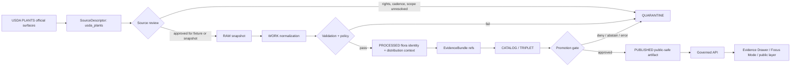

<!-- [KFM_META_BLOCK_V2]
doc_id: kfm://doc/NEEDS-VERIFICATION__contracts_source_kansas_flora_usda_plants_md
title: USDA PLANTS Source Contract
type: standard
version: v1
status: draft
owners: NEEDS-VERIFICATION__flora_steward
created: 2026-04-25
updated: 2026-04-25
policy_label: NEEDS-VERIFICATION
related: [NEEDS-VERIFICATION__schemas/contracts/v1/source/source_descriptor.schema.json, NEEDS-VERIFICATION__data/registry/flora/sources.yaml, NEEDS-VERIFICATION__docs/domains/flora/README.md, NEEDS-VERIFICATION__policy/flora/]
tags: [kfm, contracts, source-descriptor, kansas-flora, usda-plants, taxonomy, distribution, evidence-bundle, source-intake]
notes: [doc_id owner policy_label schema path registry path and policy path require mounted-repo verification, created and updated reflect this generated draft, this is a human source contract not an executable schema, USDA PLANTS endpoint cadence download shape checksum behavior and Kansas-filter fields must be reverified before activation]
[/KFM_META_BLOCK_V2] -->

<a id="top"></a>

# USDA PLANTS Source Contract

Human source contract for admitting **USDA PLANTS** into the Kansas flora lane without turning a useful public plant database into unrestricted occurrence truth, legal-status truth, image-rights truth, or rare-species release authority.


> [!IMPORTANT]
> This file defines the **source-admission posture** for `usda_plants`. It does **not** prove that a live connector, registry entry, schema companion, validator, workflow, published layer, or UI Evidence Drawer implementation already exists.

---

## Quick navigation

[Impact summary](#impact-summary) · [Scope](#scope) · [Repo fit](#repo-fit) · [Source identity](#source-identity) · [Authority boundary](#authority-boundary) · [Accepted inputs](#accepted-inputs) · [Exclusions](#exclusions) · [Rights and sensitivity](#rights-and-sensitivity) · [Lifecycle](#lifecycle) · [Descriptor skeleton](#descriptor-skeleton) · [Validation gates](#validation-gates) · [Evidence Drawer](#evidence-drawer-obligations) · [Fixtures](#fixtures-and-negative-tests) · [Publication](#publication-rules) · [Review checklist](#review-checklist) · [References](#references)

---

## Impact summary

| Field | Value |
| --- | --- |
| Target path | `contracts/source/kansas_flora/usda_plants.md` |
| Document kind | Human source contract |
| KFM lane | Kansas flora |
| Source ID | `usda_plants` |
| Source role | `official` **inside the USDA PLANTS authority boundary** |
| Runtime status | **UNKNOWN** — no implementation claim is made by this document |
| Activation status | **NEEDS VERIFICATION** — endpoint shape, cadence, checksum behavior, row fields, fixtures, and policy wiring are not confirmed here |
| Public posture | Public-safe taxonomy and generalized distribution context only after validation, rights checks, sensitivity checks, EvidenceBundle closure, and release approval |
| Non-negotiable posture | Cite-or-abstain; fail closed for unsupported legal, occurrence, image, cultural, and sensitive-location claims |

### Contract in one sentence

USDA PLANTS may support standardized plant identity, USDA PLANTS symbols, taxonomy fields, profile context, and broad distribution context, but it must **not** be treated as exact occurrence evidence, protected-status authority, image reuse clearance, cultural-knowledge clearance, or public rare-location release authority.

[Back to top](#top)

---

## Scope

This source contract governs how KFM should treat USDA PLANTS material when it enters the Kansas flora lane.

It is intentionally narrower than a connector spec and broader than a single fixture. It defines source meaning, allowed claim classes, prohibited claim classes, rights posture, sensitivity posture, validation burden, and the minimum evidence objects that must exist before publication.

### In scope

| Area | Contract posture |
| --- | --- |
| Taxon identity | Admit source-native PLANTS identity fields with snapshot and citation context |
| USDA PLANTS symbol | Treat as a strong source-native identifier, not as a universal canonical key |
| Scientific and common names | Preserve source names and source date; do not silently reconcile across taxonomies |
| Family / higher taxonomy | Admit as source-bounded taxonomy context |
| Kansas filtering | Allowed only when the source row, filter logic, and access context are inspectable |
| Broad state/county distribution | Admit as distribution context, not exact occurrence evidence |
| Profile-page context | Admit as cited context when the specific profile page or source row resolves |
| Rights and citation | Required before outward publication |
| Sensitive material | Fail closed when rare, cultural, exact-location, or image-rights ambiguity appears |

### Out of scope

| Area | Required handling |
| --- | --- |
| Live connector implementation | Separate pipeline or source adapter documentation after endpoint verification |
| Machine schema definition | Separate schema file or schema registry entry |
| Policy-as-code | Separate policy lane with deny-by-default tests |
| UI rendering | Separate layer descriptor / Evidence Drawer / Focus Mode contracts |
| Public release decision | Release manifest and promotion gate only |
| Legal protected-status authority | Separate legal/status source contract |
| Exact field occurrence | Separate occurrence/specimen source contract |
| Image/media reuse | Separate image/media rights workflow |

> [!NOTE]
> This file is a **meaning contract**. Machine validation, execution, catalog closure, and promotion must be implemented by companion schemas, fixtures, validators, policies, receipts, EvidenceBundles, and release manifests.

[Back to top](#top)

---

## Repo fit

**Path:** `contracts/source/kansas_flora/usda_plants.md`  
**Role:** source-admission contract for the USDA PLANTS source family in the Kansas flora lane.

Because the mounted repository was not available during this draft, companion paths below are deliberately truth-labeled.

| Direction | Surface | Status | Why it matters |
| --- | --- | --- | --- |
| Parent contract area | `contracts/source/` | **NEEDS VERIFICATION** | Human source contracts should live near source-admission doctrine |
| Flora lane docs | `docs/domains/flora/` | **NEEDS VERIFICATION** | Domain rules for flora source roles, rare-plant handling, and public-safe publication |
| Source registry | `data/registry/flora/sources.yaml` | **PROPOSED** | Machine-readable list of admitted flora sources, status, rights, role, cadence, and review state |
| Source schema | `schemas/contracts/v1/source/source_descriptor.schema.json` | **NEEDS VERIFICATION** | Expected executable schema home if the mounted repo confirms it |
| Policy lane | `policy/flora/` | **PROPOSED** | Deny/abstain/quarantine rules for sensitive flora claims |
| Fixtures | `tests/fixtures/source/kansas_flora/usda_plants/` | **PROPOSED** | Valid and invalid source descriptor examples |
| Receipts | `data/receipts/` or repo-equivalent | **NEEDS VERIFICATION** | Ingest, validation, review, and promotion memory |
| Proof objects | `data/proofs/` or repo-equivalent | **NEEDS VERIFICATION** | EvidenceBundle, ReleaseManifest, CatalogMatrix, and proof closure |
| Public surfaces | Governed API / Evidence Drawer / Focus Mode | **UNKNOWN** | Public clients must consume governed outputs, not raw source state |

<details>
<summary><strong>Proposed companion layout — not confirmed implementation</strong></summary>

```text
contracts/
└── source/
    └── kansas_flora/
        └── usda_plants.md

data/
└── registry/
    └── flora/
        └── sources.yaml                  # PROPOSED

schemas/
└── contracts/
    └── v1/
        └── source/
            └── source_descriptor.schema.json  # NEEDS VERIFICATION

tests/
└── fixtures/
    └── source/
        └── kansas_flora/
            └── usda_plants/
                ├── valid_source_descriptor.yaml        # PROPOSED
                ├── invalid_missing_access_date.yaml    # PROPOSED
                ├── invalid_image_rights_ambiguous.yaml # PROPOSED
                ├── invalid_legal_status_claim.yaml     # PROPOSED
                └── invalid_exact_occurrence_claim.yaml # PROPOSED
```

</details>

> [!TIP]
> Keep the split visible: **source meaning here, schema law in schemas, policy decision in policy, run memory in receipts, claim support in EvidenceBundles, and public eligibility in release manifests.**

[Back to top](#top)

---

## Source identity

| Field | Source-grounded value |
| --- | --- |
| KFM source ID | `usda_plants` |
| Provider | U.S. Department of Agriculture, Natural Resources Conservation Service |
| Public dataset name | Plant List of Accepted Nomenclature, Taxonomy, and Symbols Database |
| Common name | USDA PLANTS Database |
| Source family | Flora taxonomy and distribution context |
| Public landing page | [USDA PLANTS landing][usda-plants-home] |
| Download surface | [USDA PLANTS downloads][usda-plants-downloads] |
| Search surface | [USDA PLANTS state search][usda-plants-state-search] |
| Dataset catalog | [data.gov PLANTS dataset][datagov-plants] |
| Help / use documentation | [PLANTS Help document][usda-plants-help] |
| General USDA rights policy | [USDA policies and links][usda-policies] |
| Contact shown by data.gov | `plants-ftc@usda.gov` |
| External check date for this draft | `2026-04-25` |
| Source activation state | **NEEDS VERIFICATION** |

### Source facts to preserve

| Source fact | KFM consequence |
| --- | --- |
| PLANTS includes vascular plants, mosses, liverworts, hornworts, and lichens in the stated PLANTS scope | Do not narrow the source to vascular plants unless the fixture or row does so explicitly |
| Vascular plant distributions are mapped at state/province level and by U.S. county | Treat state/county distribution as broad distribution context, not exact occurrence |
| Non-vascular checklists have different distribution support | Do not apply vascular distribution assumptions to mosses, liverworts, hornworts, or lichens |
| Plant information, distribution maps, lists, and text are described as not copyrighted in PLANTS Help | Candidate for public use with citation, subject to KFM release gates |
| Image use varies and most images require permission | Exclude images by default unless image-specific rights are resolved |
| Culturally significant plant guides include indigenous knowledge and cultural-use context | Review required; do not publish culturally sensitive material as ordinary public flora content |

[Back to top](#top)

---

## Authority boundary

USDA PLANTS is a strong source inside its lane, but KFM must keep its authority boundary visible.

### Supported claim classes

| Claim class | Default support level | KFM caveat |
| --- | --- | --- |
| PLANTS symbol | **Strong inside USDA PLANTS boundary** | Preserve source snapshot and access date |
| Synonym symbol | **Strong inside USDA PLANTS boundary** | Do not treat synonym handling as global taxonomy reconciliation |
| Scientific name with authors | **Strong inside USDA PLANTS boundary** | Taxonomy can drift; keep as-of context |
| National common name | **Useful but not canonical** | Common names are not stable identity keys |
| Family / higher taxonomy | **Useful source row context** | Preserve source version or snapshot hash |
| State or county distribution context | **Contextual distribution evidence** | Not an occurrence, abundance, or current-presence guarantee |
| Plant profile text | **Source profile context** | Cite the profile or row; avoid unsupported local interpretation |
| Checklist membership | **Useful source fact** | Keep checklist scope and snapshot explicit |

### Unsupported claim classes

| Claim class | Required KFM behavior |
| --- | --- |
| Exact occurrence | **ABSTAIN** unless a separate occurrence/specimen source supplies evidence |
| Rare plant exact location | **DENY or quarantine** unless steward-approved release and geoprivacy transform exist |
| Federal or state protected legal status | **ABSTAIN** unless an appropriate status authority is resolved |
| Habitat suitability | **ABSTAIN** unless a habitat/model source and model card are attached |
| Steward-reviewed botanical confirmation | **ABSTAIN** unless a review record is attached |
| Image reuse | **DENY by default** unless image-specific rights and attribution are verified |
| Cultural or tribal plant-use claims | **REVIEW REQUIRED** and publish only under appropriate sensitivity rules |
| Automated publication | **DENY** until descriptor, rights, validation, EvidenceBundle, policy, and release gates pass |

> [!WARNING]
> A Kansas distribution row is **not** a field observation. A plant profile is **not** a release decision. A USDA image is **not** automatically reusable. A source row is **not** a substitute for steward review.

[Back to top](#top)

---

## Accepted inputs

Content admitted under this contract should be small, citeable, source-bounded, and reproducible.

| Input class | Examples | Admission rule |
| --- | --- | --- |
| Source identity metadata | provider, catalog URL, contact, landing page, access date | Required before any fixture or ingest run |
| Source access metadata | download URL, profile URL, state-search URL, retrieval time | Required for run receipts |
| Checklist snapshots | complete checklist, Kansas-filtered rows, state-filtered rows | Snapshot hash and retrieval receipt required |
| Taxon identity rows | symbol, synonym symbol, scientific name with authors, common name, family | Preserve source-native fields |
| Distribution context | state or county distribution fields where available | Admit only as broad distribution context |
| Profile evidence refs | plant profile URL, source page URL, row locator | Use as EvidenceRef; do not over-scrape |
| Rights and citation notes | data-use note, image-use split, citation text | Required before publication eligibility |
| Invalid examples | missing access date, image row without rights, legal-status claim from PLANTS alone | Required for fail-closed validation tests |

[Back to top](#top)

---

## Exclusions

The following do **not** belong in this source contract or its fixtures.

| Excluded material | Where it belongs instead |
| --- | --- |
| Exact occurrence points | Occurrence/specimen source contracts |
| Herbarium specimen records | Specimen source contracts and occurrence schemas |
| Field survey records | Steward-reviewed observation or survey lane |
| Rare-plant exact coordinates | Restricted stewardship flow and geoprivacy policy |
| Legal protected-species status | USFWS / KDWP / NatureServe or another appropriate legal/status source contract |
| Images without explicit rights | Image/media rights workflow |
| Cultural plant-use assertions | Cultural-sensitivity or steward-reviewed source contract |
| Habitat models or suitability rasters | Habitat/model source contracts |
| Vegetation index products | Earth-observation or derived model contracts |
| MapLibre style rules | Layer descriptor and UI contract surfaces |
| Live connector code | Pipeline/runbook after endpoint, cadence, and access verification |
| Secrets or private steward notes | Restricted config or review record, never public contract docs |

[Back to top](#top)

---

## Rights and sensitivity

### Default rights posture

| Material | Default KFM treatment |
| --- | --- |
| Plant information, distribution maps, lists, and text | Candidate public source material with required citation and release review |
| Images | **Excluded by default** because use conditions vary and permission may be required |
| Profile links | Linkable as source references, subject to claim-specific context |
| Culturally significant plant guides | Review-required; do not treat as ordinary public plant profile text |
| Endangered / threatened / rare fields | Review-required; do not treat as legal status authority without separate verification |
| Invasive / noxious fields | Review-required; do not treat as current legal status without appropriate authority |

### Sensitivity rule

KFM should treat USDA PLANTS as a public information source, but public source status does not remove KFM’s obligations around:

- rare plant location precision;
- cultural and tribal knowledge context;
- landowner or steward review;
- unsupported legal-status interpretation;
- image attribution and permission;
- correction and supersession when taxonomy changes.

[Back to top](#top)

---

## Lifecycle

USDA PLANTS material must enter KFM through the governed lifecycle. Public clients must consume only released artifacts and governed API responses.



### Lifecycle rules

| Stage | Rule |
| --- | --- |
| `RAW` | Preserve source snapshot context, retrieval timestamp, access path, and row identity |
| `WORK` | Normalize only with original fields retained |
| `QUARANTINE` | Receive unresolved rights, malformed rows, unknown source shape, sensitive/cultural ambiguity, and unsupported claim attempts |
| `PROCESSED` | Expose normalized identity and distribution context only with source role and as-of date |
| `CATALOG / TRIPLET` | Link taxa, source rows, EvidenceRefs, and relation edges without replacing source truth |
| `PUBLISHED` | Require release manifest, policy approval, attribution, rollback target, and public-safety review |

[Back to top](#top)

---

## Native field preservation

The exact active download row shape is **NEEDS VERIFICATION**. Until confirmed, these are expected source-native concepts that KFM should preserve when present.

| Field family | Preserve? | Notes |
| --- | --- | --- |
| `Symbol` | Yes | Strong source-native identity field |
| `Synonym Symbol` | Yes | Required for synonym resolution and correction lineage |
| `Scientific Name with Authors` | Yes | Do not silently strip author string |
| `National Common Name` | Yes | Useful display context, not canonical identity |
| `Family` | Yes | Preserve as source taxonomy context |
| State distribution fields | Yes | Treat as broad distribution context |
| County distribution fields | Yes, where available | Treat as broad distribution context; not an occurrence point |
| Profile URL / row locator | Yes | Needed for EvidenceRef closure |
| Image metadata | Quarantine by default | Only admit through image-rights workflow |
| Legal-status-like fields | Review required | Do not publish as legal authority from PLANTS alone |
| Cultural guide material | Review required | Steward and sensitivity review required |

### Identity rule

`usda_plants` identifiers should remain source-scoped.

```text
source_scoped_taxon_id = "usda_plants:" + source_symbol
```

Do not replace a broader KFM taxon identity with a USDA PLANTS symbol unless the taxon-resolution lane explicitly authorizes that mapping.

[Back to top](#top)

---

## Descriptor skeleton

This skeleton is **illustrative**. It should become a fixture only after the mounted repo confirms schema home, registry convention, and required field names.

```yaml
version: v1
source_id: usda_plants
title: USDA PLANTS Database
status: draft
source_family: flora_taxonomy_distribution
source_role: official

provider:
  name: USDA Natural Resources Conservation Service
  contact_name: PLANTS Mailbox
  contact_email: plants-ftc@usda.gov

access:
  landing_page: https://plants.sc.egov.usda.gov/home
  downloads_page: https://plants.sc.egov.usda.gov/downloads
  state_search_page: https://plants.sc.egov.usda.gov/state-search
  dataset_catalog_page: https://catalog.data.gov/dataset/plant-list-of-accepted-nomenclature-taxonomy-and-symbols-plants-database
  protocol: web_download_or_profile_page
  automation_posture: NEEDS_VERIFICATION
  cadence_update_behavior: NEEDS_VERIFICATION
  checksum_behavior: NEEDS_VERIFICATION
  last_external_check: 2026-04-25

authority_boundary:
  supports:
    - plant_symbol
    - synonym_symbol
    - scientific_name_with_authors
    - national_common_name
    - family
    - broad_state_or_county_distribution_context
    - source_profile_context_when_directly_cited
  does_not_support:
    - exact_occurrence
    - steward_reviewed_presence
    - federal_or_state_legal_status
    - rare_species_publication_permission
    - image_reuse_permission
    - habitat_suitability
    - culturally_sensitive_use_claims_without_review

rights_and_sensitivity:
  plant_information_posture: public_information_with_required_citation
  image_posture: exclude_by_default_permission_varies
  cultural_knowledge_posture: review_required
  sensitive_location_posture: deny_exact_publication_without_steward_release
  public_publication_eligibility: public_generalized_or_taxonomic_context_only

expected_native_fields:
  - Symbol
  - Synonym Symbol
  - Scientific Name with Authors
  - National Common Name
  - Family
  - distribution_scope_or_state_list_fields_NEEDS_VERIFICATION

kfm_controls:
  lifecycle_entry: RAW_snapshot_after_source_review
  required_receipts:
    - run_receipt
    - validation_report
  required_release_objects:
    - EvidenceBundle
    - ReleaseManifest
    - CatalogMatrix
  quarantine_triggers:
    - missing_access_date
    - missing_source_snapshot_hash
    - unknown_rights_posture
    - image_without_image_rights
    - unsupported_legal_status_claim
    - exact_occurrence_claim_from_distribution_row
    - sensitive_or_cultural_context_without_review
```

[Back to top](#top)

---

## Validation gates

| Gate | Required check | Pass condition | Fail outcome |
| --- | --- | --- | --- |
| Source identity | `source_id`, provider, landing/access path present | Stable source identity exists | `QUARANTINE` |
| Registry status | source appears in approved or draft registry state | Status is visible | `QUARANTINE` |
| Rights posture | plant data and image rights handled separately | No image rights are inferred | `DENY` image use |
| Kansas scope | Kansas filter or geography scope explicit | No unscoped national row is published as Kansas claim | `ABSTAIN` / `QUARANTINE` |
| Snapshot integrity | checksum, `spec_hash`, or source snapshot hash present | Source row context is rebuildable | `QUARANTINE` |
| Temporal basis | access date and as-of date present | Freshness is visible | `ABSTAIN` |
| Authority boundary | supported and unsupported claim classes visible | Legal/status/exact occurrence not inferred | `DENY` / `ABSTAIN` |
| Source-role propagation | `source_role` travels into processed rows and EvidenceBundle | UI/API can show source role | `QUARANTINE` |
| Image exclusion | no image fields admitted without image-rights record | Image use is separately authorized | `DENY` |
| Cultural sensitivity | cultural/ethnobotanical material blocked or reviewed | Steward review state exists before publication | `DENY` / review |
| EvidenceBundle closure | every outward claim has EvidenceRef resolution | Claim can be inspected | `ABSTAIN` |
| Release closure | release manifest and rollback target exist | Published artifact is reversible | `DENY` promotion |
| Negative fixtures | invalid cases exist beside valid fixtures | Fail-closed behavior is testable | Block review |

[Back to top](#top)

---

## Policy expectations

Policy should not rely on prose-only documentation. The policy lane should be able to deny, abstain, or quarantine common misuse patterns.

### Minimum policy decisions

| Policy question | Expected decision |
| --- | --- |
| Can PLANTS county distribution be rendered as an exact point? | `DENY` |
| Can a PLANTS profile support a legal protected-status statement? | `ABSTAIN` |
| Can a PLANTS image be reused without image-level rights? | `DENY` |
| Can culturally significant plant guide content be republished without review? | `DENY` / review |
| Can a Kansas taxon identity summary be shown with symbol, name, family, and citation after validation? | `ALLOW` |
| Can Focus Mode answer without resolving EvidenceBundle? | `ABSTAIN` |
| Can public clients query RAW / WORK / QUARANTINE source rows directly? | `DENY` |

### Finite outcomes

KFM-facing validation and policy surfaces should use finite outcomes.

```text
ALLOW
ABSTAIN
DENY
QUARANTINE
ERROR
```

[Back to top](#top)

---

## Evidence Drawer obligations

Any public or semi-public USDA PLANTS-derived claim must render trust cues beside the claim.

| Drawer field | Requirement |
| --- | --- |
| Source | `USDA PLANTS Database` |
| Source role badge | `official` with authority-boundary note |
| Claim type | taxonomy / symbol / checklist / distribution context / profile context |
| What this supports | Explicit supported claim class |
| What this does not support | Exact occurrence, legal protected status, image reuse, rare-location release |
| Geography | State/county/general distribution context unless separately evidenced |
| Time | access date, snapshot date, dataset modified date when available |
| Rights | plant-information posture and image exclusion note |
| Evidence | EvidenceBundle links to source row, profile page, or snapshot |
| Freshness | source cadence status or `NEEDS_VERIFICATION` |
| Review state | draft / reviewed / release approved |
| Correction lineage | supersession or correction notice if taxonomy/source row changes |
| Rollback | release manifest or prior descriptor reference |

### Illustrative drawer payload

```yaml
claim_id: kfm://claim/NEEDS-VERIFICATION
claim_type: flora_taxon_identity
claim_text: "This taxon appears in USDA PLANTS with the listed symbol and source name."
source:
  source_id: usda_plants
  title: USDA PLANTS Database
  source_role: official
  authority_boundary:
    supports:
      - plant_symbol
      - source_taxonomy_context
      - broad_distribution_context
    does_not_support:
      - exact_occurrence
      - legal_protected_status
      - image_reuse_permission
evidence:
  evidence_bundle_ref: kfm://evidence-bundle/NEEDS-VERIFICATION
  source_row_ref: kfm://source-row/NEEDS-VERIFICATION
  accessed_at: NEEDS_VERIFICATION
policy:
  visibility: public_candidate
  sensitivity: public_generalized
  image_use: excluded
  decision: NEEDS_VERIFICATION
freshness:
  source_snapshot_hash: NEEDS_VERIFICATION
  cadence: NEEDS_VERIFICATION
review:
  state: draft
  reviewer: NEEDS_VERIFICATION
```

[Back to top](#top)

---

## Fixtures and negative tests

A source contract is not ready for activation until positive and negative behavior can be tested.

| Fixture | Purpose | Expected result |
| --- | --- | --- |
| `valid_source_descriptor.yaml` | Minimal valid `usda_plants` descriptor | `ALLOW` for descriptor shape only |
| `valid_taxon_identity_row.yaml` | Symbol/name/family/profile URL with citation | `ALLOW` after EvidenceBundle closure |
| `valid_kansas_distribution_context.yaml` | Kansas-filtered distribution context with caveat | `ALLOW` as distribution context |
| `invalid_missing_access_date.yaml` | Omits access date | `QUARANTINE` |
| `invalid_missing_snapshot_hash.yaml` | Omits snapshot hash | `QUARANTINE` |
| `invalid_image_rights_ambiguous.yaml` | Attempts image use without permission | `DENY` |
| `invalid_legal_status_claim.yaml` | Claims legal protected status from PLANTS alone | `ABSTAIN` or `DENY` |
| `invalid_exact_occurrence_claim.yaml` | Converts distribution context to point occurrence | `DENY` |
| `invalid_cultural_guide_publication.yaml` | Publishes cultural guide material without review | `DENY` / review |
| `invalid_unscoped_national_to_kansas.yaml` | Publishes national row as Kansas claim without filter | `ABSTAIN` / `QUARANTINE` |

[Back to top](#top)

---

## Publication rules

### Allowed after validation

- Public taxon identity summaries with source symbol, scientific name, common name, family, and access date.
- Kansas-filtered checklist context when source rows and filters are inspectable.
- Generalized state/county distribution context with clear non-occurrence caveat.
- Evidence Drawer payloads that state what USDA PLANTS can and cannot support.
- Source-attributed reference links to official PLANTS pages.
- Correction and supersession notices when source taxonomy changes.

### Denied by default

- Exact plant occurrence maps from USDA PLANTS distribution context.
- Sensitive rare-plant precision.
- Legal protected-status statements from USDA PLANTS alone.
- Image reuse.
- Cultural plant-use claims without review.
- Unattributed copied text.
- Direct public UI calls to source endpoints.
- Silent taxonomy overwrites without correction/supersession records.

[Back to top](#top)

---

## Citation and attribution

Use the PLANTS citation template in outward documentation, EvidenceBundles, and release notes when PLANTS-derived plant information is used.

```text
USDA, NRCS. [YEAR]. The PLANTS Database (https://plants.usda.gov, accessed [DAY MONTH YEAR]). National Plant Data Team, Greensboro, NC USA.
```

For KFM release artifacts, include the following fields.

| Artifact field | Required value |
| --- | --- |
| `source_id` | `usda_plants` |
| `publisher` | `USDA Natural Resources Conservation Service` |
| `accessed_at` | ISO date/time of source access |
| `snapshot_hash` | Deterministic hash of admitted source rows or file |
| `citation_text` | PLANTS citation template with year and access date |
| `rights_note` | Plant information and image-use split |
| `authority_boundary_note` | Exact-occurrence / legal-status caveats |
| `source_profile_url` | Official PLANTS profile or source page, when claim-specific |
| `release_manifest_ref` | Required for public release |
| `rollback_ref` | Required for reversible release |

[Back to top](#top)

---

## Change and rollback discipline

USDA PLANTS taxonomy and distribution context can change. KFM should treat that as normal source evolution, not as a silent overwrite.

| Event | Required KFM response |
| --- | --- |
| Symbol changes | Record correction/supersession; keep old source row discoverable |
| Synonym handling changes | Preserve prior mapping and new mapping with dates |
| Distribution context changes | Emit changed-row receipt and re-evaluate published layer eligibility |
| Rights posture changes | Quarantine affected outputs until reviewed |
| Image rights clarified | Admit only through image/media workflow |
| Cultural sensitivity concern raised | Withdraw or restrict affected public outputs pending review |
| Source endpoint changes | Disable watcher; update descriptor only after validation |
| Hash mismatch | Stop promotion; emit validation failure receipt |
| Published error found | Publish correction notice and rollback or supersede release manifest |

[Back to top](#top)

---

## Review checklist

This document is ready to move from `draft` toward `review` when the following are complete.

- [ ] Meta block `doc_id`, `owners`, `policy_label`, and `related` are replaced with repo-backed values.
- [ ] Active schema home is verified for `SourceDescriptor`.
- [ ] Source registry location is verified or created through an ADR-backed decision.
- [ ] A valid `usda_plants` descriptor fixture exists.
- [ ] Invalid fixtures cover missing access date, missing snapshot hash, image-rights ambiguity, unsupported legal-status claim, exact-occurrence misuse, and cultural-guide misuse.
- [ ] Current USDA PLANTS download/profile access path is reverified.
- [ ] Snapshot hashing rule is defined.
- [ ] Policy gate denies image reuse unless image-specific rights are present.
- [ ] Policy gate denies exact public location from USDA PLANTS distribution context alone.
- [ ] Evidence Drawer fixture shows source role, rights, freshness, caveats, and EvidenceBundle refs.
- [ ] Release fixture proves rollback/supersession for a changed taxon row.
- [ ] No UI, API, connector, workflow, or publication claim is made without direct repo evidence.

[Back to top](#top)

---

## Open verification backlog

| Item | Status | Why it remains open |
| --- | --- | --- |
| Exact repo owner / CODEOWNERS path | **NEEDS VERIFICATION** | Mounted repo evidence was unavailable |
| Exact schema companion path | **NEEDS VERIFICATION** | `contracts/` vs `schemas/contracts/` authority must be repo-backed |
| Exact source registry path | **NEEDS VERIFICATION** | Proposed location must match repo convention |
| Exact PLANTS download file names | **NEEDS VERIFICATION** | Download surface can change |
| Active row fields | **NEEDS VERIFICATION** | Descriptor should not hard-code unverified field names |
| Stable checksum / ETag / Last-Modified behavior | **NEEDS VERIFICATION** | Needed for watcher safety |
| Automation allowance | **NEEDS VERIFICATION** | Do not scrape or poll beyond documented/approved access |
| Kansas state/county filter behavior | **NEEDS VERIFICATION** | Needed before Kansas-specific claims |
| Rarity and invasive/noxious posture | **NEEDS VERIFICATION** | Legal/status use needs separate authority review |
| Image reuse | **REVIEW REQUIRED** | Permission varies by image |
| Cultural plant guide treatment | **REVIEW REQUIRED** | Indigenous/cultural information can require steward-aware handling |
| Public release policy label | **NEEDS VERIFICATION** | Must match repo policy taxonomy |
| Downstream UI/API surfaces | **UNKNOWN** | No app shell or governed API implementation was inspected |

[Back to top](#top)

---

## Appendix: reviewer quick cards

<details>
<summary><strong>Truth labels used in this contract</strong></summary>

| Label | Meaning |
| --- | --- |
| **CONFIRMED** | Verified from current-session evidence or attached/source-grounded documentation |
| **INFERRED** | Reasonable from target path or doctrine, but not directly verified in implementation |
| **PROPOSED** | Recommended design or companion file not confirmed as present |
| **UNKNOWN** | Not verifiable without mounted repo, source registry, tests, workflows, or runtime evidence |
| **NEEDS VERIFICATION** | Concrete check required before activation, release, or implementation claim |
| **REVIEW REQUIRED** | Human or steward review required before public or semi-public release |

</details>

<details>
<summary><strong>Pre-merge reviewer questions</strong></summary>

1. Does this contract keep USDA PLANTS source authority bounded?
2. Does it block exact occurrence claims from distribution context?
3. Does it block legal protected-status claims from PLANTS alone?
4. Does it split plant-information rights from image rights?
5. Does it require cultural/steward review for culturally significant plant material?
6. Does it preserve source-native identifiers instead of silently normalizing them away?
7. Does it require EvidenceBundle closure before outward claims?
8. Does it avoid claiming a connector, workflow, source registry, or UI implementation exists?
9. Does it leave repo-path placeholders where repo evidence is missing?
10. Does it define negative fixtures strongly enough to test fail-closed behavior?

</details>

<details>
<summary><strong>Source-role shorthand</strong></summary>

| Source role | Meaning in this contract |
| --- | --- |
| `official` | Official source for source-native USDA PLANTS fields and context |
| `contextual` | Useful for context but not sufficient as proof of a stronger claim |
| `derived` | Output computed from source material; must not replace source truth |
| `reviewed` | Human/steward review applied; not automatically supplied by USDA PLANTS |
| `legal_authority` | Legal/status source role; **not granted to USDA PLANTS by this contract** |

</details>

[Back to top](#top)

---

## References

- [USDA PLANTS landing][usda-plants-home]
- [USDA PLANTS downloads][usda-plants-downloads]
- [USDA PLANTS state search][usda-plants-state-search]
- [USDA PLANTS Help document][usda-plants-help]
- [data.gov PLANTS dataset][datagov-plants]
- [USDA policies and links][usda-policies]

[usda-plants-home]: https://plants.sc.egov.usda.gov/home
[usda-plants-downloads]: https://plants.sc.egov.usda.gov/downloads
[usda-plants-state-search]: https://plants.sc.egov.usda.gov/state-search
[usda-plants-help]: https://plants.sc.egov.usda.gov/DocumentLibrary/Pdf/PLANTS_Help_Document_2022.pdf
[datagov-plants]: https://catalog.data.gov/dataset/plant-list-of-accepted-nomenclature-taxonomy-and-symbols-plants-database
[usda-policies]: https://www.usda.gov/about-usda/policies-and-links

[Back to top](#top)
