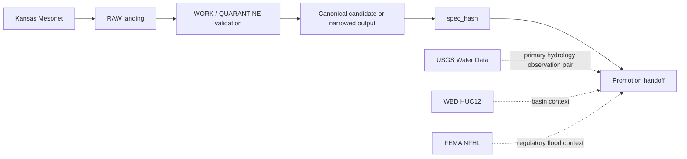

<!-- [KFM_META_BLOCK_V2]
doc_id: kfm://doc/NEEDS-VERIFICATION
title: Kansas Mesonet Source Descriptor
type: standard
version: v1
status: draft
owners: NEEDS-VERIFICATION
created: YYYY-MM-DD
updated: 2026-04-15
policy_label: NEEDS-VERIFICATION
related: [
  ../../schemas/contracts/v1/source/source_descriptor.schema.json,
  ../../README.md,
  ../../../pipelines/soil-moisture-watch/README.md,
  ../../../tools/validators/soil_moisture/README.md,
  ../../../tools/validators/promotion_gate/README.md,
  ../../../data/receipts/README.md,
  ../../../data/proofs/README.md,
  ../../../policy/README.md,
  ../../../schemas/README.md,
  ../../../tests/README.md
]
tags: [kfm, source-descriptor, mesonet, hydrology, soil-moisture, spec_hash, run_receipt]
notes: [
  Built from attached KFM doctrine plus the prior source-descriptor draft supplied in-session.
  This revision preserves the stronger existing admission posture, source-role clarity, and rights/automation caution while aligning the descriptor to the newer Mesonet-first soil-moisture watcher, validator, fixture, and promotion-gate docs.
  Exact mounted file history, owner assignment, schema-home authority, and approved automation pattern remain NEEDS VERIFICATION.
]
[/KFM_META_BLOCK_V2] -->

<a id="top"></a>

# Kansas Mesonet Source Descriptor

Governed source-admission draft for **Kansas Mesonet** as a KFM `SourceDescriptor`, with first-wave emphasis on soil-moisture, station-health, and hydrology-context use.

> [!NOTE]
> **Status:** `draft`  
> **Owners:** `NEEDS-VERIFICATION`  
> **Path:** `contracts/source/kansas_mesonet_source_descriptor.md` *(target path inferred from current contract work; exact mounted path remains NEEDS VERIFICATION)*  
>        
> **Quick jumps:** [Purpose](#purpose) · [Why this source matters](#why-this-source-belongs-in-first-wave-kfm-work) · [Descriptor summary](#descriptor-summary) · [Repo fit](#repo-fit) · [Access surfaces](#access-surfaces) · [Semantics and support](#semantics-and-support) · [Rights and automation constraints](#rights-and-automation-constraints) · [Validation expectations](#validation-expectations) · [Handoff expectations](#handoff-expectations) · [Illustrative descriptor draft](#illustrative-descriptor-draft) · [Open verification items](#open-verification-items)

> [!IMPORTANT]
> This document turns **Kansas Mesonet** from a named source into a **reviewable admission contract**. It is not a release artifact, not a proof bundle, and not a catalog entry.

> [!WARNING]
> **Kansas Mesonet is a viable public connector, not a free-for-all ingestion surface.**  
> In KFM terms, that means the source may be admitted only through explicit rights posture, validation, and publication intent—not through convenience.

---

## Purpose

This document keeps the following explicit **before fetch or scheduling**:

- what Kansas Mesonet is
- what role it plays in KFM
- how it may be accessed
- what support and time semantics it carries
- what rights and automation constraints apply
- what minimum validation and quarantine rules should fire
- what downstream handoff objects this source may feed

For the current first wave, this descriptor should make Mesonet usable as a **Kansas-first station and soil-moisture source** without letting it blur into generic “sensor data” or silently replace neighboring hydrology and regulatory surfaces.

[Back to top](#top)

---

## Why this source belongs in first-wave KFM work

KFM repeatedly treats **hydrology** as one of the strongest first proof lanes. Inside that lane, **Kansas Mesonet** is a good Kansas-first station-context source, especially for local environmental and soil-moisture context, but it must remain visibly distinct from **USGS Water Data**, **WBD HUC12**, and **FEMA NFHL** rather than being flattened into one generic “hydrology feed.”



### First-wave fit

Kansas Mesonet is strongest in first-wave KFM work when used for:

- station roster and station-health context
- soil-moisture context with explicit depths
- local freshness and liveness checks
- deterministic candidate batches that can be validated and tied to `run_receipt`
- Kansas-first environmental context alongside, not in place of, federal and regulatory surfaces

[Back to top](#top)

---

## Descriptor summary

| Field family | Descriptor decision | Status |
|---|---|---|
| Source title | `Kansas Mesonet` | CONFIRMED |
| Source family | Public station-observation source family with documented REST / CSV access surfaces | CONFIRMED |
| KFM source role | `direct observation / measurement` | CONFIRMED |
| First-wave lane fit | Complementary Kansas station and soil-moisture context in the hydrology proof slice | CONFIRMED |
| Exact machine `source_id` | Final identifier not surfaced in mounted schema usage | NEEDS VERIFICATION |
| Primary immediate use | Station context, soil-moisture context, station-health checks, and local environmental observation support | INFERRED |
| Publication intent | Support governed hydrology / soil-moisture context releases; do not let raw Mesonet visibility become publication by convenience | CONFIRMED / INFERRED |
| Auth model | No auth requirement was surfaced in the prior descriptor draft for the public documentation surfaces | CONFIRMED for surfaced pages |
| Conditional-fetch guarantees | No uniform `ETag` / `Last-Modified` behavior is asserted here | NEEDS VERIFICATION |
| Rights posture | Public use / download with citation, but explicit automation constraints remain active | CONFIRMED |
| Bulk or unattended ingest posture | Must remain policy-gated and consent-aware | CONFIRMED / INFERRED |
| Default validator implication | Missing source identity, missing time basis, or undocumented acquisition mode should fail closed | CONFIRMED / strongly implied |
| First-wave downstream seams | canonical candidate → `spec_hash` → validation → `run_receipt` → promotion handoff | CONFIRMED / INFERRED |

---

## Repo fit

This leaf is intended to sit beside the first-wave **`SourceDescriptor`** contract family rather than acting as a schema substitute.

| Surface | Relationship |
|---|---|
| `../../schemas/contracts/v1/source/source_descriptor.schema.json` | Intended schema companion for the contract family |
| `../../README.md` | Parent contract-space orientation, if mounted |
| `../../../pipelines/soil-moisture-watch/README.md` | Mesonet-first watcher lane that depends on explicit source identity |
| `../../../tools/validators/soil_moisture/README.md` | Validator lane assumes source-role clarity, `spec_hash`, and explicit source identity |
| `../../../tools/validators/promotion_gate/README.md` | Downstream promotion gate depends on deterministic identity and receipt-bearing handoff |
| `../../../data/receipts/README.md` | Downstream compact run/process memory |
| `../../../data/proofs/README.md` | Downstream release-grade proof objects |
| `../../../policy/README.md` | Fail-closed admission and promotion logic |
| `../../../schemas/README.md` | Canonical schema authority remains there, not here |
| `../../../tests/README.md` | Positive and negative descriptor / validation examples should land there |

> [!TIP]
> Keep the split visible: **descriptor admission here, receipt emission in lane execution, proof bundles downstream, catalog closure later**.

---

## Source classification

### KFM source role

Kansas Mesonet should be treated as a **direct observation / measurement** source.

That means KFM should preserve:

- declared support
- units
- observation timing
- interval / cadence
- station context
- calibration or methodological caveats where surfaced
- preliminary / QC-change posture

It should **not** be silently upgraded into:

- regulatory truth
- historical adjudication
- modeled output
- sovereign publication state

### Relationship to neighboring hydrology / context sources

| Source | Role in first-wave hydrology work | Keep visible |
|---|---|---|
| **USGS Water Data** | Primary watched hydrology observation family | Federal hydrology observation role |
| **Kansas Mesonet** | Complementary Kansas station and soil-moisture context | Kansas-first station / soil-moisture role |
| **WBD HUC12** | Hydrologic grouping and basin context | Boundary / grouping context, not observation |
| **FEMA NFHL** | Regulatory flood context | Regulatory status, not live inundation |

[Back to top](#top)

---

## Access surfaces

The current surfaced material supports treating the following as the safest **documented** entry points.

| Surface | Use | Status | Notes |
|---|---|---|---|
| `https://mesonet.k-state.edu/rest/` | Primary service documentation / entry surface | CONFIRMED | Treat as the starting point for documented access patterns |
| `.../rest/url-builder/` | Request construction helper | CONFIRMED | Useful for explicit parameterized CSV pulls |
| `.../rest/stationnames/` | Station roster and basic station metadata | CONFIRMED | Suitable for source-side roster context |
| `.../rest/stationactive/` | Station activity window / recency context | CONFIRMED | Useful for freshness checks and interval visibility |
| `.../rest/mostrecent` | Most recent ingested data by interval family | CONFIRMED | Useful for freshness and watcher health checks |
| Soil-moisture pages and downloadable tables | Domain-specific soil-moisture context | CONFIRMED | Keep domain semantics visible; do not scrape pages casually |

### Preferred access stance

1. Prefer **documented REST / CSV surfaces** over browser scraping.
2. Prefer **small, bounded, reviewable pulls** over silent provider mirroring.
3. Record **access date**, **request surface**, **request parameters**, and **returned interval basis**.
4. Treat higher-volume or unattended automation as a **policy question**, not merely an engineering convenience.

> [!CAUTION]
> Do **not** assume that public visibility of a service equals blanket approval for large-scale unattended ingest.

[Back to top](#top)

---

## Semantics and support

### Spatial support

Kansas Mesonet is a **station-point** observation family.

Its first-wave representation should therefore preserve:

- station identity
- station point context
- Kansas scope
- county or local station context where surfaced
- explicit distinction between point observation and any later gridded or interpolated derivative

### Temporal support

The surfaced service family supports interval-aware access patterns such as:

- `5min`
- `hour`
- `day`

For KFM purposes, keep these times distinct whenever they differ:

- **observation time**
- **fetch / access time**
- **normalization time**
- **promotion / release time**

Those are different trust questions and should not collapse into one timestamp.

### Soil-moisture semantics that should stay visible

For soil-moisture use, keep the following visible in any descriptor-linked lane:

| Semantic item | Treatment | Status |
|---|---|---|
| Standard depths | `5`, `10`, `20`, `50` cm | CONFIRMED |
| Volumetric water content (`VWC`) | Preserve as observation value; do not silently rename into a different quantity | CONFIRMED |
| `VWC` unit interpretation | Treat as `m3/m3` in normalized explanation surfaces | CONFIRMED |
| Percent saturation | Preserve as derived station-side signal, not interchangeable with VWC | CONFIRMED |
| Frozen-soil behavior | Do not treat missing / non-calculated frozen-soil values as zero | CONFIRMED |
| Long-window online availability | Do not assume unlimited historical web access from the public online surface | CONFIRMED |

### First-wave source surfaces and roles

| Surface | First-wave role | What it should not silently become |
|---|---|---|
| `stationnames` | roster and station identity | publication record |
| `stationactive` | freshness / activity context | replacement for historical series |
| `mostrecent` | liveness and last-seen support | substitute for ordered interval history |
| `stationdata` | primary observation pull for candidate batches | unconstrained bulk archive |
| soil-moisture docs / tables | semantic support and variable meaning | ad hoc scrape target |

> [!NOTE]
> A source can be **observed**, **published by its steward**, **fetched by KFM**, and **promoted by KFM** at different times. This descriptor should help keep those semantics legible.

[Back to top](#top)

---

## Rights and automation constraints

### Confirmed posture

Kansas Mesonet should be treated as:

- publicly usable **with citation**
- preliminary and subject to **quality-control change**
- a source with **explicit automation limits**

### Practical KFM consequence

KFM should preserve the following rules for this source family:

| Rule | Consequence |
|---|---|
| Public use requires citation | Any outward use should preserve citation-ready source identity and access date |
| Data are preliminary | Normalized outputs should not imply immutable finality |
| Automation is constrained | Unattended or scaled ingest should remain explicitly approved or policy-cleared |
| Source role stays explicit | Mesonet observations should not silently replace regulatory, archival, or modeled classes |
| Review remains available | If a planned use exceeds clearly documented public-safe behavior, route it through review |

### First-wave automation posture

For the current Mesonet-first soil-moisture slice, the safest posture is:

- documented REST / CSV access only
- tiny and reviewable request windows
- no silent page scraping
- no blanket assumption that repeated unattended polling is already approved
- explicit receipt-bearing trace of what was fetched and why

> [!WARNING]
> This descriptor should not authorize behavior that the source’s own usage policy constrains.  
> “Public” here means **admissible under declared conditions**, not “ignore the provider’s terms.”

[Back to top](#top)

---

## Validation expectations

The corpus supports **fail-closed** admission logic. For Kansas Mesonet, the first useful checks are the boring ones that prevent later trust drift.

### Minimum gate set

| Check family | What should pass | What should quarantine or fail |
|---|---|---|
| Identity | Source title, source role, reference surface, and policy posture are explicit | Missing source identity or missing rights posture |
| Access mode | Pulls use documented surfaces | Page scraping or undocumented collection pattern |
| Time basis | Interval and observed window are explicit | Ambiguous interval, unordered timestamps, or silent clock mixing |
| Station support | Station identifiers and roster logic are explicit | Unnamed or unresolvable station context |
| Unit / depth semantics | VWC / percent saturation and depth basis remain explicit | Missing units, missing depth basis, or mixed semantics |
| Deterministic identity | Canonical candidate can be tied to `spec_hash` | Missing or unexplained deterministic identity |
| Preliminary-data posture | Access / fetch time is recorded and QC mutability is preserved | Presentation that implies immutable final truth |
| Policy label | Candidate batch carries an explicit policy label | Missing or ambiguous policy label |
| Receipt discipline | `run_receipt` is emitted on allow and deny paths | Validation path with no machine-readable receipt |
| Handoff discipline | Promotion handoff object exists only after successful validation | Silent promotion after failed or incomplete checks |

### Recommended first quarantine triggers

- missing source identity
- missing rights or automation posture
- undocumented acquisition mode
- ambiguous time window
- missing interval basis
- missing units or soil-depth semantics where relevant
- malformed station roster mapping
- absent `run_receipt`
- promotion handoff attempted after validation failure

### Validator and fixture pressure this descriptor creates

Because this source is station-based and cadence-aware, downstream validators and fixtures should make these burdens explicit:

- source role remains Kansas Mesonet, not generic “station data”
- stale-state logic depends on declared cadence or expected interval
- depth identity remains explicit
- `spec_hash` and `schema_ver` are testable rather than implicit
- receipt-bearing seams stay visible in negative and positive paths

[Back to top](#top)

---

## Public-safe representation

This source is most useful in KFM when it stays **small, explicit, and qualified**.

### Public-safe first-wave use

Good first-wave uses include:

- station-context evidence inside hydrology work
- small, reviewable time-series slices
- soil-moisture context with explicit depths and units
- freshness / status context
- validator and fixture support where source role stays visible
- evidence-drawer support where receipt and source identity remain explicit

### Avoid first-wave flattening

Do **not** let Kansas Mesonet outputs:

- silently become regulatory truth
- silently replace **USGS Water Data**
- silently absorb **WBD HUC12** or **FEMA NFHL** roles
- hide preliminary / QC-change posture
- collapse **receipt**, **proof**, and **catalog** functions into one file
- imply live workflow or signing maturity the repo does not directly surface

---

## Handoff expectations

Kansas Mesonet admission should feed the governed KFM path in this order:

1. `SourceDescriptor`
2. source-specific fetch or watcher logic
3. canonical manifest or normalized candidate batch
4. `spec_hash`
5. fail-closed validation / policy decision
6. `run_receipt`
7. promotion-manifest or release-handoff object
8. downstream proof / signing / catalog closure

This source document therefore owns **admission clarity**, not final publication.

### Receipt / proof / catalog boundary

| Surface | What it is | What it is not |
|---|---|---|
| `run_receipt` | Compact machine-readable process memory | Not the release-grade proof bundle |
| Proof / attestation bundle | Verifiable release-significant trust object | Not the same as lane memory |
| Catalog object | Outward discoverability and linkage surface | Not the same as admission or validation state |

### First-wave downstream expectations

For the current soil-moisture slice, this source descriptor should make it possible for downstream lanes to answer, without guessing:

- what source produced the candidate
- what access surface was used
- what interval basis applied
- what depths and units are expected
- whether unattended automation requires special review
- what deterministic identity and receipt-bearing seams must remain present

[Back to top](#top)

---

## Illustrative descriptor draft

> [!NOTE]
> The shape below is **illustrative only**.  
> It is here to make the contract concrete without pretending that the final key names, enum values, or schema-home authority are already fully verified.

```yaml
identity:
  source_id: NEEDS-VERIFICATION
  title: Kansas Mesonet
  provider: Kansas Mesonet
  canonical_refs:
    - https://mesonet.k-state.edu/rest/
    - https://mesonet.k-state.edu/about/usage/

role_and_scope:
  source_role: direct_observation_measurement
  primary_lane: hydrology
  first_wave_focus:
    - soil_moisture
    - station_health
    - kansas_station_context
  publication_intent: station_context
  spatial_support: kansas_station_points
  temporal_support:
    documented_intervals: [5min, hour, day]

access:
  mode: public_http_csv
  auth_model: none_documented
  preferred_surfaces:
    - rest/url-builder/
    - rest/stationnames/
    - rest/stationactive/
    - rest/mostrecent
    - rest/stationdata/
  constraints:
    written_consent_required_for:
      - automated_page_scraping
      - scaled_unattended_ingest
  request_limits:
    station_observation_pull: 3000_records_per_request

semantics:
  observed_not_modeled: true
  preliminary_data: true
  soil_moisture:
    depths_cm: [5, 10, 20, 50]
    variables:
      - volumetric_water_content
      - percent_saturation
    vwc_unit: m3/m3
    frozen_soil_behavior: not_calculated

rights_and_sensitivity:
  public_use_with_citation: true
  redistribution_posture: NEEDS-VERIFICATION
  policy_label_default: NEEDS-VERIFICATION
  steward_review_required_for:
    - scaled_unattended_ingest
    - ambiguous_bulk_capture_patterns

validation:
  required_checks:
    - source_identity_present
    - documented_surface_only
    - interval_explicit
    - timestamp_ordered
    - units_and_depths_visible
    - deterministic_identity_present
    - policy_gate_for_automation
    - receipt_emitted
  quarantine_triggers:
    - missing_rights_posture
    - undocumented_acquisition_mode
    - missing_time_basis
    - malformed_station_context
    - source_policy_conflict

lineage_expectations:
  upstream_contract: SourceDescriptor
  downstream_handoff:
    - canonical_manifest
    - spec_hash
    - run_receipt
    - promotion_manifest
```

---

## Open verification items

The following must stay open until direct branch or runtime evidence is surfaced:

- exact machine `source_id`
- exact owner assignment for this file
- exact `policy_label`
- canonical schema-home authority between `contracts/` and `schemas/contracts/`
- exact checked-in path and authority status of the companion schema
- whether current branch already contains adjacent Mesonet fixtures, watcher helpers, or validator helpers
- exact approved automation pattern for scheduled Mesonet ingest
- whether conditional-fetch headers are reliable across the intended service surfaces
- exact downstream consumer of the first promotion handoff object
- exact workflow YAML, scheduler owner, proof-storage target, and signing path

---

## Definition of done for this leaf

This document is ready to move from `draft` toward `review` when all of the following are true:

- a repo-backed schema companion is directly surfaced
- one valid and one invalid descriptor fixture exist
- at least one positive and one negative Mesonet-linked `run_receipt` example exist
- policy handling for Mesonet automation constraints is explicit
- source-role clarity remains visible beside **USGS Water Data**, **WBD HUC12**, and **FEMA NFHL**
- placeholders in the meta block are replaced with repo-backed values
- this document no longer implies workflow, signing, or storage maturity that the branch does not prove

---

## Reference surfaces

- Schema companion: `../../schemas/contracts/v1/source/source_descriptor.schema.json`
- Official Mesonet service docs: `https://mesonet.k-state.edu/rest/`
- Official Mesonet usage policy: `https://mesonet.k-state.edu/about/usage/`
- Official Mesonet soil-moisture docs:  
  - `https://mesonet.k-state.edu/about/soilmoist/data/`  
  - `https://mesonet.k-state.edu/about/soilmoist/page/`

[Back to top](#top)
