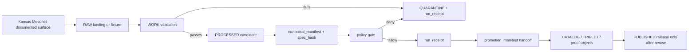

<!-- [KFM_META_BLOCK_V2]
doc_id: kfm://doc/NEEDS_VERIFICATION__kansas_mesonet_source_descriptor
title: Kansas Mesonet Source Descriptor
type: standard
version: v1
status: draft
owners: NEEDS_VERIFICATION
created: NEEDS_VERIFICATION__YYYY-MM-DD
updated: NEEDS_VERIFICATION__YYYY-MM-DD
policy_label: NEEDS_VERIFICATION
related: [../../schemas/contracts/v1/source/source_descriptor.schema.json]
tags: [kfm, source-descriptor, kansas-mesonet, hydrology, soil-moisture, station-observations]
notes: [Source onboarding draft only. Does not activate a live connector, scheduler, proof pack, workflow, or public release. Exact repo ownership, schema-home authority, policy label, and approved automation path remain NEEDS VERIFICATION.]
[/KFM_META_BLOCK_V2] -->

# Kansas Mesonet Source Descriptor

Governed source-admission draft for **Kansas Mesonet** as a KFM `SourceDescriptor`, with first-wave emphasis on hydrology, soil-moisture, and station-context use.

> [!NOTE]
> **Document posture:** `draft`  
> **Source role:** `direct_observation_measurement`  
> **First-wave fit:** hydrology proof lane, as a Kansas-first station-context source rather than a standalone publication surface  
> **Activation posture:** `not_activated` until rights, automation approval, schema authority, fixtures, validators, policy checks, and receipt/proof handoff are repo-verified

**Quick jumps:** [Purpose](#purpose) · [Descriptor summary](#descriptor-summary) · [Source role and boundaries](#source-role-and-boundaries) · [Access surfaces](#access-surfaces) · [Semantics and support](#semantics-and-support) · [Rights and automation constraints](#rights-and-automation-constraints) · [KFM lifecycle handoff](#kfm-lifecycle-handoff) · [Validation expectations](#validation-expectations) · [Illustrative descriptor draft](#illustrative-descriptor-draft) · [Open verification items](#open-verification-items)

---

## Purpose

This document turns **Kansas Mesonet** from a named public data source into a **reviewable source-admission contract**.

Its job is to keep the following explicit **before any fetch, scheduled ingest, test fixture, promotion handoff, or public-facing statement**:

- what Kansas Mesonet is
- what KFM source role it may play
- which documented access surfaces are allowed
- what support, units, intervals, and time semantics apply
- what citation, preliminary-data, and automation constraints apply
- what validation and quarantine rules should fire
- what downstream handoff objects this source may feed

This file is **not** a release artifact, **not** a proof bundle, **not** a catalog record, and **not** approval for live automation.

---

## Descriptor summary

| Field family | Descriptor decision | Status |
|---|---|---|
| Source title | `Kansas Mesonet` | CONFIRMED from official source pages |
| Provider / steward | `Kansas Mesonet / Kansas State University` | CONFIRMED from official source pages |
| Source family | Public station-observation source with documented REST/CSV surfaces | CONFIRMED from official REST documentation |
| Candidate machine ID | `kansas_mesonet` or `kfm://source/kansas-mesonet` | PROPOSED; exact repo convention NEEDS VERIFICATION |
| KFM source role | `direct_observation_measurement` | PROPOSED KFM classification |
| First-wave lane fit | Complementary Kansas station context inside hydrology / soil-moisture work | PROPOSED |
| Public publication posture | Downstream only through governed KFM release, catalog, proof, and policy gates | PROPOSED |
| Auth model for documented public pages | No credential requirement is asserted for public documentation pages | CONFIRMED for referenced public docs only |
| Automation posture | Automated page scraping or data ingest requires written consent before activation | CONFIRMED from usage policy; repo approval path NEEDS VERIFICATION |
| Rights posture | Public use/download with citation; preliminary and subject to change | CONFIRMED from usage policy |
| Redistribution posture | Citation-supported outward use is allowed by the usage page, but bulk or automated redistribution remains review-bound | NEEDS VERIFICATION for the intended KFM use |
| Sensitivity default | `public_observation_station_context`, with policy checks still required | PROPOSED |
| Conditional fetch signals | No uniform `ETag` / `Last-Modified` behavior is asserted | NEEDS VERIFICATION |
| Live connector status | `not_activated` | PROPOSED until repo evidence proves otherwise |

---

## Source role and boundaries

Kansas Mesonet should be treated as a **direct observation / measurement** source.

That means KFM should preserve:

- station identity and station support
- latitude / longitude station context where admitted
- observation timestamp and interval
- quantity kind
- units
- soil-depth basis where relevant
- preliminary / quality-control-change posture
- access time and citation metadata

It should **not** be silently upgraded into:

- regulatory truth
- flood-hazard truth
- title, property, or legal boundary truth
- historical adjudication
- model output
- generalized statewide surface truth
- sovereign publication state

### Relationship to neighboring hydrology/context sources

| Source | First-wave role | Keep visible |
|---|---|---|
| **USGS Water Data** | Primary federal hydrology observation family | Observation source, station/gage semantics, federal source role |
| **Kansas Mesonet** | Kansas-first station and soil-moisture context | Station network, soil-depth, weather/soil observation support |
| **WBD HUC12** | Hydrologic grouping / basin context | Boundary/grouping context, not an observation |
| **FEMA NFHL** | Regulatory flood hazard context | Regulatory status, not live inundation or local station measurement |

---

## Access surfaces

Only documented Kansas Mesonet surfaces should be eligible for source admission. Undocumented page scraping or inferred private endpoints should fail closed.

| Surface | KFM treatment | Notes |
|---|---|---|
| `/rest/` | Reference documentation | Explains available CSV-style REST services and links usage policy |
| `/rest/url-builder/` | Preferred human-safe request builder | Use to construct station observation requests before encoding fixture examples |
| `/rest/stationdata/` | Candidate CSV data surface | Requires station or network, interval, time range, and optional variable list |
| `/rest/stationnames/` | Station roster / station geometry context | Up-to-date CSV list of stations with station name, county, latitude, and longitude |
| `/rest/stationactive/` | Approximate active-period context | Includes station, interval seconds, first observation, and most recent observation |
| `/rest/mostrecent?int=<interval>` | Freshness / update signal candidate | Interval must be explicit: `day`, `hour`, or `5min` |
| `/about/usage/` | Rights and citation reference | Must be checked before public use and any automation |
| `/about/soilmoist/data/` | Soil-moisture method/support reference | Supports depth, sensor, and use caveats |
| `/about/soilmoist/page/` | Soil-moisture UI/download reference | Supports VWC, percent saturation, chart/download behavior, and CSV download posture |

### Station observation parameters

For station observations, candidate requests should keep the following explicit:

| Parameter | Required? | KFM expectation |
|---|---:|---|
| `stn` | Yes, unless `net` is used | Station name or comma-separated station names; `all` should require extra review before use |
| `net` | Alternative to `stn` | Network-wide requests increase burden and should be policy-gated |
| `int` | Yes | One of `day`, `hour`, or `5min` |
| `t_start` | Yes | `YYYYmmddHHMMSS`; must be converted to explicit KFM time basis |
| `t_end` | Yes | `YYYYmmddHHMMSS`; must be converted to explicit KFM time basis |
| `vars` | Optional | Prefer explicit variables for fixtures, but do not rely on column order |

> [!WARNING]
> The official REST documentation states that station-observation pulls are limited to 3000 records and that variables are not guaranteed to return in the same order from call to call. KFM validators should therefore check names, not column position, and should quarantine overbroad pull plans.

---

## Semantics and support

### Observation intervals

Documented station observation intervals are:

- `5min`
- `hour`
- `day`

KFM should store interval as a declared part of source support, not as a hidden property inferred from a URL.

### Soil-moisture support

Kansas Mesonet soil-moisture observations should be represented with visible depth and quantity semantics.

| Semantics | KFM handling |
|---|---|
| Standard depths | `5`, `10`, `20`, and `50` cm |
| Sensor method | Time-domain reflectometer / Campbell Scientific CS655, where needed for method context |
| Quantity kind | `VWC` and `percent_saturation` must not be mixed silently |
| VWC unit | Unitless and represented as `m3/m3` in KFM-normalized outputs |
| Percent saturation | Derived against historical station wettest/driest context; do not treat as the same quantity as VWC |
| Sensor location | Station soil sensors are described as standardized relative to station placement; retain method caveat when used |
| Local support caveat | Soil type, ground cover, depth, and local conditions can bias station representativeness |

### Preliminary and mutable data posture

Kansas Mesonet data are preliminary and subject to quality-control / assessment changes. KFM outputs should therefore avoid language such as “final,” “certified,” or “immutable” unless a later source-specific review proves that status for a specific product.

---

## Rights and automation constraints

### Confirmed operating posture

Kansas Mesonet should be treated as:

- public use/download with required citation
- preliminary and subject to quality-control change
- constrained for automation
- not approved for unattended or scaled ingest until written consent / steward approval is resolved

### KFM consequences

| Rule | Consequence |
|---|---|
| Public use requires citation | Any outward use should preserve source title, access date, webpage title, and URL |
| Data are preliminary | Evidence Drawer and release notes should retain QC-change caveat |
| Automated page scraping or data ingest without written consent is prohibited | Live source activation must be policy-gated and steward-reviewed |
| Station requests can become broad quickly | Use bounded fixtures first; network-wide or `all` station pulls require review |
| Source role stays explicit | Mesonet observations must not replace regulatory, federal hydrology, or modeled source roles |
| Review remains available | Ambiguous bulk capture, unclear redistribution, or new endpoint use routes to review/quarantine |

> [!CAUTION]
> “Public” here means **admissible under declared conditions**, not “free of provider constraints.” This descriptor must not authorize behavior that the source’s own usage policy constrains.

---

## KFM lifecycle handoff

Kansas Mesonet admission should follow the governed KFM lifecycle:



This descriptor may feed:

- source registry entry
- valid / invalid fixtures
- no-network source-admission tests
- policy tests for automation denial / review routing
- run receipts from bounded fixture dry-runs
- promotion handoff objects after validation

It should not itself become:

- a canonical observation store
- a public data product
- a proof pack
- a release manifest
- a workflow authorization

---

## Validation expectations

The first useful checks are intentionally boring. They prevent later trust drift.

| Check family | What should pass | What should quarantine or fail |
|---|---|---|
| Source identity | Title, provider, source role, and reference surfaces explicit | Missing title, provider, source role, or source ID |
| Access mode | Uses documented REST/CSV or source documentation surfaces | Page scraping, private endpoint, or undocumented collection mode |
| Rights posture | Citation and preliminary-data posture recorded | Missing rights, missing citation requirement, or missing preliminary caveat |
| Automation posture | Live automation marked not activated unless consent/review is present | Scheduled ingest implied without authorization path |
| Time basis | Interval and observed window explicit | Ambiguous interval, unordered timestamps, or hidden time-zone assumptions |
| Station support | Station names and roster logic explicit | Unnamed or unresolvable station context |
| Unit/depth semantics | VWC / percent saturation and depth basis visible where relevant | Missing units, missing depth, or mixed quantity kinds |
| Column handling | Columns resolved by name | Reliance on return order |
| Freshness | Access/fetch time and latest-source signal recorded when used | Stale or unrecorded freshness posture |
| Receipt discipline | `run_receipt` emitted on allow and deny paths | Validation path with no machine-readable receipt |
| Handoff discipline | Promotion handoff exists only after validation and policy pass | Silent promotion after failed or incomplete checks |

### Recommended first quarantine triggers

- missing source identity
- missing rights or automation posture
- undocumented acquisition mode
- ambiguous time window
- missing interval basis
- missing units or soil-depth semantics where relevant
- malformed station roster mapping
- use of `all` stations without explicit review burden
- reliance on CSV column order
- absent `run_receipt`
- promotion handoff attempted after validation failure

---

## Public-safe representation

This source is most useful in KFM when it stays **small, explicit, and qualified**.

Good first-wave uses include:

- bounded station-context evidence inside hydrology work
- small, reviewable time-series fixtures
- soil-moisture context with explicit depths and units
- freshness/status context
- Evidence Drawer support where source role stays visible

Avoid first-wave use that would:

- silently become regulatory truth
- silently replace USGS Water Data
- silently absorb WBD HUC12 or FEMA NFHL roles
- hide preliminary / QC-change posture
- collapse receipt, proof, and catalog functions into one file
- imply live workflow, signing, storage, or release maturity the repo does not prove

---

## Illustrative descriptor draft

This sketch is intentionally **illustrative**. Adapt field names to the checked-in `SourceDescriptor` schema after schema-home authority is verified.

```yaml
version: v1
kind: SourceDescriptor

identity:
  source_id: NEEDS_VERIFICATION__kansas_mesonet
  candidate_uri: kfm://source/kansas-mesonet
  title: Kansas Mesonet
  provider: Kansas Mesonet / Kansas State University
  official_status: official_provider_documentation_referenced

role_and_scope:
  source_role: direct_observation_measurement
  primary_lane: hydrology
  adjacent_lanes:
    - soil
    - agriculture
    - atmosphere_air
  publication_intent: station_context
  not_authoritative_for:
    - regulatory_flood_hazard
    - legal_boundary
    - live_emergency_guidance
    - modeled_surface_truth
    - final_quality_controlled_archive

access:
  mode: public_http_csv
  activation_status: not_activated
  auth_model: none_documented_for_public_reference_pages
  preferred_surfaces:
    - https://mesonet.k-state.edu/rest/
    - https://mesonet.k-state.edu/rest/url-builder/
    - https://mesonet.k-state.edu/rest/stationdata/
    - https://mesonet.k-state.edu/rest/stationnames/
    - https://mesonet.k-state.edu/rest/stationactive/
    - https://mesonet.k-state.edu/rest/mostrecent
  required_parameters:
    station_observations:
      - stn_or_net
      - int
      - t_start
      - t_end
  documented_intervals:
    - 5min
    - hour
    - day
  request_limits:
    station_observations_max_records_per_request: 3000
  column_handling:
    rely_on_column_order: false

rights_and_sensitivity:
  public_use_with_citation: true
  preliminary_data: true
  use_at_own_risk: true
  redistribution_posture: NEEDS_VERIFICATION_FOR_TARGET_KFM_USE
  policy_label_default: NEEDS_VERIFICATION
  automation_constraints:
    - written_consent_required_for_automated_page_scraping_or_data_ingesting
  steward_review_required_for:
    - live_connector_activation
    - scheduled_ingest
    - scaled_unattended_ingest
    - network_wide_or_all_station_pulls
    - ambiguous_bulk_capture_patterns

support:
  geometry:
    type: station_points
    station_roster_surface: https://mesonet.k-state.edu/rest/stationnames/
  temporal:
    observed_time_required: true
    interval_required: true
    access_time_required_for_public_claims: true
  soil_moisture:
    depths_cm:
      - 5
      - 10
      - 20
      - 50
    quantity_kinds:
      - VWC
      - percent_saturation
    normalized_unit_for_vwc: m3/m3
    method_context:
      sensor_family: TDR
      sensor_model: Campbell Scientific CS655

validation:
  required_checks:
    - source_identity_present
    - documented_surface_only
    - rights_posture_present
    - automation_posture_present
    - interval_explicit
    - observed_window_explicit
    - timestamp_ordered
    - station_context_resolvable
    - units_and_depths_visible_when_soil_moisture
    - no_column_order_dependency
    - policy_gate_for_automation
    - receipt_emitted
  quarantine_triggers:
    - missing_rights_posture
    - undocumented_acquisition_mode
    - missing_time_basis
    - malformed_station_context
    - mixed_quantity_kinds_without_qualifier
    - network_wide_pull_without_review
    - source_policy_conflict
    - promotion_handoff_without_validation_pass

lineage_expectations:
  upstream_contract: SourceDescriptor
  downstream_handoff:
    - canonical_manifest
    - spec_hash
    - run_receipt
    - promotion_manifest
  downstream_not_in_this_file:
    - EvidenceBundle
    - proof_pack
    - ReleaseManifest
    - CatalogMatrix
    - public_layer_manifest
```

---

## Open verification items

The following must stay open until direct branch, source-steward, or runtime evidence is surfaced:

- exact checked-in path for this file
- exact machine `source_id`
- exact owner assignment
- exact `policy_label`
- canonical schema-home authority between `contracts/` and `schemas/contracts/`
- checked-in path and version of the companion `SourceDescriptor` schema
- whether current branch already contains Mesonet fixtures or watcher helpers
- exact approved automation path for scheduled Mesonet ingest
- whether written consent is needed for the specific KFM activation plan and how it is recorded
- whether conditional-fetch headers are reliable across intended service surfaces
- exact fixture names for positive and negative source-admission tests
- exact downstream consumer of the first promotion handoff object
- exact workflow YAML, scheduler owner, proof-storage target, and signing path

---

## Definition of done for this leaf

This document is ready to move from `draft` toward `review` when all of the following are true:

- repo-backed schema companion is directly surfaced
- one valid and one invalid descriptor fixture exist
- at least one positive and one negative Mesonet-linked `run_receipt` example exist
- policy handling for Mesonet automation constraints is explicit
- source-role clarity remains visible beside USGS Water Data, WBD HUC12, and FEMA NFHL
- placeholders in the meta block are replaced with repo-backed values
- a steward/reviewer has resolved the intended KFM use against the Mesonet usage policy
- the document no longer implies workflow, signing, storage, release, or live-connector maturity that the branch does not prove

---

## Reference surfaces

- Schema companion: `../../schemas/contracts/v1/source/source_descriptor.schema.json`
- Official Mesonet REST documentation: <https://mesonet.k-state.edu/rest/>
- Official Mesonet usage policy: <https://mesonet.k-state.edu/about/usage/>
- Official Mesonet soil-moisture method/support documentation: <https://mesonet.k-state.edu/about/soilmoist/data/>
- Official Mesonet soil-moisture page/download documentation: <https://mesonet.k-state.edu/about/soilmoist/page/>
