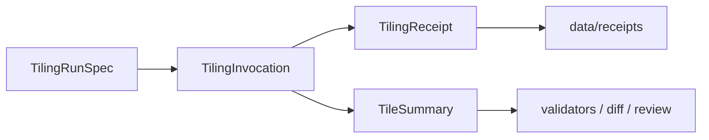
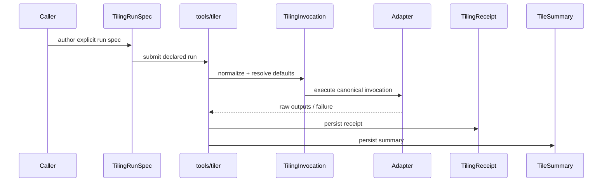

<!-- [KFM_META_BLOCK_V2]
doc_id: kfm://doc/contracts/tiler/readme
title: contracts/tiler
type: standard
version: v1
status: draft
owners: @bartytime4life
created: 2026-04-13
updated: 2026-04-13
policy_label: public
related: [
  ../README.md,
  ../../tools/tiler/README.md,
  ../../schemas/README.md,
  ../../policy/README.md,
  ../../data/receipts/README.md,
  ../../tools/validators/README.md,
  ../../tools/diff/README.md,
  ../../tests/README.md
]
tags: [kfm, contracts, tiler, 3d-tiles, terrain, imagery, receipts, deterministic]
notes: [
  Proposed sovereign contract home for tiling lane expectations.
  Public-main schema and executable inventory remain NEEDS VERIFICATION.
  This document defines contract boundaries and artifact vocabulary without asserting landed implementation.
]
[/KFM_META_BLOCK_V2] -->

# contracts/tiler

Authoritative contract surface for **deterministic tiling runs**, **tiling receipts**, **tile summaries**, and **adapter-facing invocation shape** in KFM.

> [!NOTE]
> **Status:** draft · **Authority posture:** contract home · **Owners:** `@bartytime4life`  
> 
> 
> 
> 

**Quick jumps:** [Purpose](#purpose) · [Repo fit](#repo-fit) · [Contract set](#contract-set) · [Core objects](#core-objects) · [Required fields](#required-fields-by-object) · [Lifecycle](#contract-lifecycle) · [Validation](#validation-expectations) · [Examples](#examples) · [Invariants](#contract-invariants) · [FAQ](#faq)

---

## Purpose

`contracts/tiler/` is the **sovereign machine-contract home** for KFM tiling behavior.

It defines the contract vocabulary that the tiling lane is expected to honor when converting governed source surfaces into streaming delivery artifacts such as terrain, imagery-linked surfaces, or 3D tilesets.

This directory exists so that:

- `tools/tiler/` does **not** become a parallel authority for contract meaning
- validators and diff helpers have a stable agreement surface
- receipts, run specs, and summaries remain machine-checkable
- tile production stays deterministic, reviewable, and provenance-aware

> [!IMPORTANT]
> The contract home defines **shape, semantics, and invariants**.  
> It does **not** imply that every contract has already landed as code or schema on public main.

---

## Repo fit

**Path:** `contracts/tiler/`

**Authoritative role**
- owns the machine-facing meaning of tiling objects
- defines the expected relationship among run specs, receipts, summaries, and adapter outputs
- anchors validator expectations for fail-closed checks

**Primary neighbors**
- [`../../tools/tiler/README.md`](../../tools/tiler/README.md) — tooling lane that implements or consumes these contracts
- [`../../schemas/README.md`](../../schemas/README.md) — schema-home boundary; concrete schemas should reconcile here
- [`../../data/receipts/README.md`](../../data/receipts/README.md) — process memory destination for tiling receipts
- [`../../tools/validators/README.md`](../../tools/validators/README.md) — validation surfaces for contract enforcement
- [`../../tools/diff/README.md`](../../tools/diff/README.md) — deterministic comparison over summary-bearing outputs
- [`../../policy/README.md`](../../policy/README.md) — deny-by-default policy logic; not owned here
- [`../../tests/README.md`](../../tests/README.md) — fixtures and assertions proving behavior

### Separation of authority

| Surface | Owns |
|---|---|
| `contracts/tiler/` | object meaning, required fields, invariants, lifecycle semantics |
| `schemas/` | concrete schema authority and serialization constraints |
| `tools/tiler/` | implementation helpers and adapter behavior |
| `tools/validators/` | fail-closed checks and reviewer-facing validation outputs |
| `data/receipts/` | persisted run memory |
| `policy/` | policy decisions and restrictions |

---

## Contract set

This contract family is centered on four primary objects.



### Contract objects

| Object | Role | Typical writer | Typical reader |
|---|---|---|---|
| `TilingRunSpec` | declared instruction set for a deterministic run | caller / workflow / operator | tools/tiler adapter |
| `TilingInvocation` | normalized execution-ready view of the run | tools/tiler | adapters / logs / receipts |
| `TilingReceipt` | process-memory record of what happened | tools/tiler | receipts lane / validators / audit |
| `TileSummary` | compact comparison and review artifact | tools/tiler | validators / diff / reviewers |

### Optional supporting objects

| Object | Role |
|---|---|
| `TileInventory` | per-tile listing, counts, byte sizes, optional path map |
| `GeometrySummary` | bounds, hierarchy, simplification, and LOD characteristics |
| `AdapterDescriptor` | adapter identity and declared capability surface |
| `FailureRecord` | normalized fail-closed error shape when no valid output is produced |

---

## Contract scope

### In scope

- deterministic run specification shape
- normalized adapter-facing invocation semantics
- receipt field expectations
- summary field expectations
- invariant grammar for successful / failed runs
- provenance and reference linkage expectations
- handoff semantics to validators and diff helpers

### Out of scope

- policy allow/deny logic
- source onboarding and registry identity policy
- release manifest or attestation authority
- viewer/runtime request contracts
- catalog object definitions outside the linkage expectations described here
- engine-specific CLI details except through adapter normalization rules

---

## Core objects

## `TilingRunSpec`

Declared input describing **what should be tiled** and **how the run should be shaped**.

### Intent

A `TilingRunSpec` must be:
- explicit
- diffable
- reviewable
- stable enough that identical specs over identical inputs can be compared meaningfully

### Minimum semantic content

- input identity
- input digest or immutable reference
- adapter selection
- output profile
- coordinate / spatial interpretation
- level-of-detail or equivalent shaping policy
- output target reference(s)
- receipt target reference(s)

---

## `TilingInvocation`

Normalized form derived from the `TilingRunSpec` just before adapter execution.

### Intent

`TilingInvocation` exists so that adapter implementations receive a **canonical shape**, even when caller-friendly specs vary in layout.

### Why it matters

Without a normalized invocation object:
- adapter behavior drifts
- equivalent configs become hard to compare
- receipts become noisy and inconsistent

### Typical characteristics

- resolved defaults
- canonical ordering of relevant fields
- explicit engine-facing parameters
- immutable record of adapter identity and normalized profile

---

## `TilingReceipt`

Machine-readable process memory describing **what actually happened** during a tiling run.

### Intent

A `TilingReceipt` is not a proof pack and not a release approval object. It is the durable run memory needed to support:

- replay
- correction
- audit
- validation
- downstream publication review

### Required semantic questions the receipt must answer

- What inputs were used?
- Which adapter and engine version were used?
- Which normalized spec governed the run?
- Did the run succeed, fail, or partially emit output?
- Where were outputs written?
- Which summaries and validation artifacts correspond to this run?

---

## `TileSummary`

Compact artifact for **review, comparison, and downstream validation**.

### Intent

The summary should surface just enough shape to answer:

- Did output materially change?
- Did bounds or hierarchy drift?
- Did tile count or size shift unexpectedly?
- Did simplification or LOD behavior change?
- Is this run comparable to the last run?

### Summary posture

A summary should be:
- deterministic
- compact
- diff-friendly
- derived from emitted outputs, not hand-written notes

---

## Required fields by object

> [!TIP]
> Field names below describe the expected **semantic contract**.  
> Exact serialization, enum casing, and schema placement remain **NEEDS VERIFICATION** until schema files land.

## `TilingRunSpec`

| Field | Requirement | Meaning |
|---|---|---|
| `kind` | required | object discriminator such as `tiling_run` |
| `version` | required | contract version |
| `input_ref` | required | governed path / URI / object ref to source material |
| `input_sha256` | required unless immutable object identity already guarantees content | immutable source digest |
| `spec_hash` | required | stable hash over governing spec content |
| `tiler_adapter` | required | selected adapter identity |
| `output_profile` | required | declared output shaping profile |
| `crs` | required | coordinate reference system or equivalent declared spatial frame |
| `output_ref` | required | intended output location or base prefix |
| `receipt_out` | required | target reference for receipt persistence |
| `summary_out` | required | target reference for summary persistence |

### Conditionally required fields

| Field | Required when | Meaning |
|---|---|---|
| `imagery_ref` | imagery participates in output | imagery source |
| `imagery_sha256` | imagery participates and digesting is available | imagery integrity reference |
| `lod_policy` | profile does not fully imply LOD behavior | hierarchy / error shaping policy |
| `resampling_policy` | raster or surface resampling is relevant | interpolation / resampling shape |
| `simplification_policy` | mesh reduction or geometry shaping is relevant | simplification constraints |
| `upstream_receipt_refs` | run is derived from staged upstream transforms | linkage to earlier process memory |

---

## `TilingInvocation`

| Field | Requirement | Meaning |
|---|---|---|
| `kind` | required | normalized invocation discriminator |
| `version` | required | invocation contract version |
| `run_spec_ref` | required | source run spec reference or embedding marker |
| `spec_hash` | required | governing spec hash |
| `tiler_adapter` | required | resolved adapter |
| `adapter_version` | required if known | adapter implementation version |
| `engine_name` | required if known | underlying tiling engine identity |
| `engine_version` | required if known | underlying engine version |
| `normalized_parameters` | required | canonical execution parameter object |
| `normalized_inputs` | required | canonical input object(s) |
| `planned_outputs` | required | normalized output targets |

---

## `TilingReceipt`

| Field | Requirement | Meaning |
|---|---|---|
| `kind` | required | receipt discriminator |
| `version` | required | receipt contract version |
| `status` | required | finite run outcome |
| `recorded_at` | required | timestamp for receipt recording |
| `input_ref` | required | source reference |
| `input_sha256` | required when available | source digest |
| `spec_hash` | required | governing spec hash |
| `tiler_adapter` | required | adapter used |
| `engine_name` | required if known | engine identity |
| `engine_version` | required if known | engine version |
| `output_ref` | required when output emitted | output base reference |
| `summary_ref` | required when summary emitted | summary reference |
| `invocation_ref` | recommended | normalized invocation reference |
| `upstream_receipt_refs` | recommended | lineage to upstream process memory |
| `notes` | optional | bounded reviewer-readable notes |

### Allowed status grammar

| Status | Meaning |
|---|---|
| `completed` | output emitted and receipt finalized |
| `failed` | no valid output accepted |
| `partial` | bounded partial output emitted but not equivalent to clean completion |
| `blocked` | preconditions failed before adapter execution |

> [!IMPORTANT]
> Status must remain **finite and explicit**.  
> Avoid vague states such as `maybe`, `warning`, or `mostly_done`.

---

## `TileSummary`

| Field | Requirement | Meaning |
|---|---|---|
| `kind` | required | summary discriminator |
| `version` | required | summary contract version |
| `spec_hash` | required | governing spec hash |
| `tiler_adapter` | required | adapter used |
| `output_profile` | required | shaping profile |
| `tile_count` | required | emitted tile count or equivalent hierarchy count |
| `total_bytes` | required | total payload size |
| `bounds` | required | spatial extent summary |
| `content_kinds` | required | terrain / imagery / mesh / mixed |
| `hierarchy_depth` | recommended | maximum depth or equivalent |
| `geometric_error_profile` | recommended when meaningful | error shaping summary |
| `crs` | required | declared spatial frame |
| `generated_at` | required | summary generation time |

### Optional comparison-friendly fields

- `root_bounding_volume`
- `leaf_tile_count`
- `max_tile_bytes`
- `min_tile_bytes`
- `mean_tile_bytes`
- `simplification_policy_fingerprint`
- `resampling_policy_fingerprint`
- `engine_version`
- `adapter_version`

---

## Failure object expectations

When a run fails closed, the system should still be able to emit a normalized failure shape.

### `FailureRecord` semantic fields

| Field | Requirement | Meaning |
|---|---|---|
| `kind` | required | failure discriminator |
| `version` | required | failure contract version |
| `status` | required | one of `failed` or `blocked` |
| `reason_code` | required | stable machine-readable failure reason |
| `message` | required | bounded human-readable explanation |
| `spec_hash` | recommended | governing spec hash |
| `input_ref` | recommended | affected input |
| `recorded_at` | required | timestamp |

### Failure posture

- fail closed
- do not silently publish partially valid output
- do not mask adapter crashes as success
- preserve enough context for replay and correction

---

## Contract lifecycle



### Lifecycle rules

1. a run starts from `TilingRunSpec`
2. tooling normalizes it into `TilingInvocation`
3. adapter execution occurs from the normalized form
4. the run produces either:
   - `TilingReceipt` + `TileSummary`, or
   - `FailureRecord` + failed / blocked receipt shape
5. downstream validators and diff helpers consume receipt and summary objects

---

## Validation expectations

These contracts are designed for **fail-closed validation**.

### Validators should be able to confirm

- required fields are present
- finite status grammar is respected
- digests and references have valid shape
- `spec_hash` remains consistent across related objects
- summary objects match receipt references
- forbidden ambiguity is absent
- output metadata is compatible with diff and review workflows

### Validators should not infer

- hidden defaults not present in normalized invocation
- policy outcomes from dataset content
- release approval from receipt completion
- provenance not explicitly linked

---

## Comparison expectations

`TileSummary` is the primary diff-facing object.

### Diff helpers should be able to compare

- `spec_hash`
- adapter / engine version changes
- bounds drift
- tile count drift
- byte-size drift
- depth / hierarchy drift
- simplification or resampling fingerprint changes

### Comparison semantics

Two runs may be classified as:

| Comparison class | Meaning |
|---|---|
| `equivalent` | materially same summary-bearing output |
| `data_changed` | upstream input change explains output drift |
| `config_changed` | spec or profile change explains drift |
| `engine_changed` | adapter / engine change likely explains drift |
| `unknown_drift` | difference detected without adequate explanation |

---

## Provenance and linkage rules

These contracts must support explicit linkage without collapsing all provenance into a single object.

### Required linkage posture

- run specs reference declared inputs
- receipts reference summaries
- receipts may reference upstream receipts
- downstream catalog objects may reference outputs and receipt identities
- release surfaces may reference receipts, but receipts are not themselves release proof objects

### Receipt vs proof

> [!IMPORTANT]
> `TilingReceipt` is **process memory**.  
> Attestations, release manifests, and proof packs remain separate trust objects.

---

## Adapter contract expectations

Adapters are allowed to vary in implementation, but not in contract meaning.

### Every adapter must preserve

- explicit input identity
- explicit `spec_hash`
- normalized parameter visibility
- stable finite status outcomes
- receipt emission behavior
- summary emission behavior when output exists

### Adapters must not

- invent hidden inputs
- suppress engine version when known
- write success receipts for failed runs
- bypass normalized invocation shape
- redefine contract meanings locally

---

## Examples

## Minimal conceptual `TilingRunSpec`

```yaml
kind: tiling_run
version: v1
input_ref: data/work/surfaces/kansas_dem_cog.tif
input_sha256: "<sha256>"
spec_hash: "<spec_hash>"
tiler_adapter: cesium-terrain-imagery
output_profile: terrain_3dtiles_1_1
crs: EPSG:4326
output_ref: data/published/tiles/kansas-dem/v1/
receipt_out: data/receipts/tiling/kansas-dem/2026-04-13/receipt.json
summary_out: data/receipts/tiling/kansas-dem/2026-04-13/summary.json
lod_policy:
  max_geometric_error: 64
  max_depth: 16
```

---

## Minimal conceptual `TilingReceipt`

```json
{
  "kind": "tiling_receipt",
  "version": "v1",
  "status": "completed",
  "recorded_at": "2026-04-13T00:00:00Z",
  "input_ref": "data/work/surfaces/kansas_dem_cog.tif",
  "input_sha256": "<sha256>",
  "spec_hash": "<spec_hash>",
  "tiler_adapter": "cesium-terrain-imagery",
  "engine_name": "cesium-terrain-and-imagery-tiler",
  "engine_version": "<version>",
  "output_ref": "data/published/tiles/kansas-dem/v1/",
  "summary_ref": "data/receipts/tiling/kansas-dem/2026-04-13/summary.json"
}
```

---

## Minimal conceptual `TileSummary`

```json
{
  "kind": "tile_summary",
  "version": "v1",
  "spec_hash": "<spec_hash>",
  "tiler_adapter": "cesium-terrain-imagery",
  "output_profile": "terrain_3dtiles_1_1",
  "tile_count": 8421,
  "total_bytes": 93842111,
  "bounds": {
    "west": -102.0517,
    "south": 36.9931,
    "east": -94.5884,
    "north": 40.0032
  },
  "content_kinds": ["terrain"],
  "hierarchy_depth": 16,
  "crs": "EPSG:4326",
  "generated_at": "2026-04-13T00:00:00Z"
}
```

---

## Contract invariants

1. **Declared-input invariant**  
   No contract-valid run may depend on undeclared source material.

2. **Spec-hash continuity invariant**  
   Related objects for the same run must agree on `spec_hash`.

3. **Finite-status invariant**  
   Receipts and failure records must use explicit finite outcomes.

4. **Receipt/proof separation invariant**  
   Tiling receipts are not release proofs.

5. **Deterministic-summary invariant**  
   Summaries must be reproducible from emitted outputs and normalized parameters.

6. **Adapter-neutral contract invariant**  
   Adapter choice may change implementation details, but not object meaning.

7. **Fail-closed invariant**  
   Invalid or ambiguous output must not be represented as clean completion.

---

## Open questions

> [!WARNING]
> The items below are intentionally marked rather than asserted.

- **NEEDS VERIFICATION:** exact file layout under `contracts/tiler/`
- **NEEDS VERIFICATION:** whether schemas will live under `schemas/tiler/` only, with this directory remaining pure Markdown + examples
- **PROPOSED:** enum vocabulary for `content_kinds`
- **PROPOSED:** normalized fingerprint fields for simplification and resampling policy
- **PROPOSED:** whether `TileInventory` should be first-class contract or optional support artifact
- **PROPOSED:** whether hydro-domain tiling profiles should extend this contract family or remain domain-local overlays

---

## FAQ

### Why split this from `tools/tiler/README.md`?

Because the tooling README should describe **lane behavior and repo fit**, while the contract home defines **machine meaning and invariants**. Keeping those separate prevents silent authority drift.

### Does this document assert that these schemas already exist?

No. This is a contract-definition document. Concrete schema files and implementations remain **NEEDS VERIFICATION** unless visible in-repo.

### Are tilesets themselves part of the contract home?

Only indirectly. This contract family governs the **KFM wrapping objects around tiling runs and outputs** rather than replacing the external tileset format specification.

### Can different engines satisfy the same contract?

Yes. That is one of the main reasons the contract exists.

### Does a completed receipt mean a release is approved?

No. Completion means the run finished and emitted reviewable artifacts. Release approval belongs elsewhere.

---

## Appendix A — suggested future files

> [!NOTE]
> These are **PROPOSED** contract files for later landing.

```text
contracts/tiler/
├── README.md
├── tiling_run_spec.md
├── tiling_receipt.md
├── tile_summary.md
├── failure_record.md
└── adapter_descriptor.md
```

---

## Appendix B — authoring checklist

- [ ] Contract scope is clearly separate from tooling and schemas
- [ ] Required fields are stated semantically, not guessed as implemented facts
- [ ] Receipts vs proofs separation is explicit
- [ ] Finite status grammar is explicit
- [ ] Validator and diff consumers are named
- [ ] Proposed / unknown items are clearly labeled
- [ ] Relative links point to authoritative neighboring lanes
- [ ] Examples remain conceptual and non-assertive
