<!-- [KFM_META_BLOCK_V2]
doc_id: kfm://doc/<TODO_VERIFY_contracts_ui_readme_uuid>
title: contracts/ui
type: standard
version: v1
status: draft
owners: <TODO_VERIFY_CONTRACTS_UI_OWNER>
created: <TODO_VERIFY_CREATED_DATE>
updated: 2026-04-25
policy_label: <TODO_VERIFY_POLICY_LABEL>
related: [contracts/README.md, schemas/README.md, schemas/contracts/v1/README.md, policy/README.md, tests/README.md, tests/contracts/README.md, docs/standards/KFM_MARKDOWN_WORK_PROTOCOL.md, kfm://source/kfm-maplibre-ui-architecture]
tags: [kfm, contracts, ui, evidence-drawer, focus-mode, maplibre, governed-shell]
notes: [Draft generated from attached KFM doctrine and current-session workspace inspection; target leaf ownership, doc_id, created date, policy label, exact branch inventory, and contract-file presence still need direct repo verification.]
[/KFM_META_BLOCK_V2] -->

<a id="top"></a>

# `contracts/ui/`

Human-readable UI contract lane for KFM shell payloads, Evidence Drawer behavior, Focus outcomes, layer metadata, and trust-visible state handoffs.

> [!NOTE]
> **Status:** `experimental`  
> **Owners:** `<TODO_VERIFY_CONTRACTS_UI_OWNER>`  
> **Path:** `contracts/ui/README.md`  
> **Repo fit:** child lane under [`../README.md`](../README.md), aligned with schema authority in [`../../schemas/README.md`](../../schemas/README.md), policy gates in [`../../policy/README.md`](../../policy/README.md), and verification pressure in [`../../tests/README.md`](../../tests/README.md).  
> **Quick jumps:** [Scope](#scope) · [Repo fit](#repo-fit) · [Accepted inputs](#accepted-inputs) · [Exclusions](#exclusions) · [Evidence boundary](#evidence-boundary) · [Directory tree](#directory-tree) · [Quickstart](#quickstart) · [Usage](#usage) · [Diagram](#diagram) · [Contract families](#contract-families) · [Rules](#rules) · [Task list](#task-list--definition-of-done) · [FAQ](#faq) · [Appendix](#appendix)
>
> 
> 
> 
> 
> 
> 

---

## Scope

`contracts/ui/` is the **human-readable contract surface** for UI-facing payloads and shell handoffs that must preserve KFM governance at the point of use.

It defines how the product shell should interpret already-governed outputs such as:

- shell state and deep-link hydration;
- Evidence Drawer payloads;
- Focus Mode request/response envelopes;
- layer metadata used by MapLibre-facing views;
- surface-state transitions across Explore, Dossier, Story, Focus, Compare, Export, and Review;
- trust cues such as freshness, sensitivity, review state, correction state, release state, and finite negative outcomes.

> [!IMPORTANT]
> This directory does **not** manufacture truth. It describes how UI surfaces consume governed payloads produced by released artifacts, governed APIs, schemas, policy decisions, and evidence resolution.

[Back to top](#top)

---

## Repo fit

This lane sits at the boundary between **machine contracts**, **governed runtime responses**, and **rendered user experience**.

| Neighbor | Relationship | Status |
| --- | --- | --- |
| [`../README.md`](../README.md) | Parent contract surface. Should explain the broader contract/schema/policy/fixture split. | **NEEDS VERIFICATION** for current branch details |
| [`../../schemas/README.md`](../../schemas/README.md) | Machine-readable schema authority. UI contract prose should not fork schema definitions. | **NEEDS VERIFICATION** for exact schema home |
| [`../../schemas/contracts/v1/README.md`](../../schemas/contracts/v1/README.md) | Expected home for reusable schema families such as runtime, evidence, release, policy, and layer manifests where repo convention confirms it. | **PROPOSED / NEEDS VERIFICATION** |
| [`../../policy/README.md`](../../policy/README.md) | Rights, sensitivity, release, refusal, and deny-by-default rules that UI payloads must preserve. | **NEEDS VERIFICATION** for exact gates |
| [`../../tests/README.md`](../../tests/README.md) | Verification boundary for contract examples, valid/invalid fixtures, shell outcome tests, and runtime-proof paths. | **NEEDS VERIFICATION** for executable coverage |
| [`../../tests/contracts/README.md`](../../tests/contracts/README.md) | Preferred verification lane for schema and contract drift once files exist. | **NEEDS VERIFICATION** |
| `apps/<shell-app>/` | Expected UI implementation consumer. Exact app path is **UNKNOWN** from current-session workspace evidence. | **UNKNOWN** |
| `apps/<governed-api>/` | Expected governed API producer. Exact route names and DTOs are **UNKNOWN** from current-session workspace evidence. | **UNKNOWN** |

### Upstream / downstream view

- **Upstream:** source descriptors, released artifacts, `EvidenceBundle`, `LayerManifest`, policy decisions, release manifests, correction notices, runtime envelopes.
- **Here:** UI-facing contract prose, field semantics, rendering obligations, trust cue behavior, handoff rules.
- **Downstream:** shell components, Evidence Drawer renderer, Focus renderer, map/layer panels, review handoff surfaces, export previews, tests.

[Back to top](#top)

---

## Accepted inputs

This directory should contain small, reviewable contract notes that clarify UI-facing meaning without becoming an app package or schema registry.

| Input class | Examples | Why it belongs here | Status |
| --- | --- | --- | --- |
| Shell-state contract notes | selected geography, active time scope, layer ids, mode, release context, policy context | Keeps deep links and shell hydration from drifting into ad hoc state | **PROPOSED** |
| Evidence Drawer payload notes | claim title, evidence state, source role, EvidenceBundle ref, rights, sensitivity, freshness, review, correction, audit ref | Makes the mandatory trust object renderable across lanes | **PROPOSED** |
| Focus Mode contract notes | scope echo, evidence pool, finite outcome, citations, audit ref, reason/obligation codes | Keeps bounded synthesis subordinate to evidence and policy | **PROPOSED** |
| Layer metadata contract notes | business meaning, knowledge character, time semantics, evidence route, export eligibility | Keeps MapLibre layer rendering separate from source authority | **PROPOSED** |
| Surface-state registry notes | Explore, Dossier, Story, Focus, Compare, Export, Review transitions | Keeps shell modes consistent and role-safe | **PROPOSED** |
| UI trust cue guidance | freshness, policy, review, correction, AI participation, negative-state copy | Keeps governance visible where claims are read | **PROPOSED** |
| Contract examples | compact illustrative payload snippets labeled as examples | Helps reviewers understand intent without creating machine authority | **PROPOSED** |

[Back to top](#top)

---

## Exclusions

The following do **not** belong in `contracts/ui/`.

| Do not place here | Send it instead to | Reason |
| --- | --- | --- |
| React/Vue/Svelte components, hooks, CSS, map adapters, UI state stores | `apps/<shell-app>/` or repo-native app package | This lane defines contracts, not implementation |
| Machine JSON Schemas | `../../schemas/contracts/v1/` or repo-confirmed schema home | Avoid split authority between prose and executable schema |
| Policy-as-code, Rego bundles, allow/deny rules | `../../policy/` | UI must render policy decisions, not invent them |
| Runtime route handlers or model adapters | `apps/<governed-api>/` or repo-native API package | Runtime and model boundaries belong behind governed APIs |
| Valid/invalid fixture suites and assertions | `../../tests/contracts/`, `../../tests/e2e/`, or repo-native tests | Test assets should live with verification surfaces |
| Source descriptors and source-rights records | `../source/`, `../../data/registry/`, or repo-confirmed source registry | UI contracts consume source-role outputs; they do not admit sources |
| RAW, WORK, QUARANTINE, canonical stores, unpublished candidate data | lifecycle data directories only | Public UI surfaces must never normalize direct access to non-public stores |
| Free-form prompt files | prompt directory only after repo convention and policy are verified | Focus is evidence-bounded runtime behavior, not browser prompt glue |
| MapLibre style JSON, sprites, glyphs, PMTiles protocol code | style/runtime registry or app delivery package | Renderer assets are runtime machinery, not UI contract law |

[Back to top](#top)

---

## Evidence boundary

| Claim | Truth label | Basis |
| --- | --- | --- |
| KFM UI doctrine treats the interface as part of the evidence chain and governed publication surface. | **CONFIRMED doctrine** | Attached KFM MapLibre UI architecture corpus |
| Evidence Drawer and Focus Mode must preserve evidence, policy, freshness, review, correction, and negative states. | **CONFIRMED doctrine** | Attached UI and components synthesis corpus |
| MapLibre is the disciplined 2D renderer inside a governed shell, not the owner of truth state. | **CONFIRMED doctrine / PROPOSED realization** | Attached UI architecture and pipeline manual |
| `contracts/ui/` should hold human-readable UI contract notes. | **PROPOSED** | Target path requested; exact branch inventory unavailable in current workspace |
| Exact contract filenames, app consumers, schema locations, validators, and CI commands are already present. | **UNKNOWN** | No mounted local repo tree was available in current-session workspace evidence |
| Leaf ownership and policy label for this README are verified. | **UNKNOWN / NEEDS VERIFICATION** | No branch-level `CODEOWNERS` or policy-label evidence was inspectable locally |

> [!CAUTION]
> This README intentionally avoids claiming that specific UI contract files already exist. Treat the directory tree below as a **starter map** until the real checkout is inspected.

[Back to top](#top)

---

## Directory tree

```text
contracts/ui/
├── README.md                                      # this directory contract guide
├── shell_state.contract.md                        # PROPOSED: shell state + deep-link semantics
├── evidence_drawer_payload.contract.md            # PROPOSED: Evidence Drawer payload semantics
├── focus_mode_envelope.contract.md                # PROPOSED: Focus request/response semantics
├── dossier_payload.contract.md                    # PROPOSED: dossier handoff semantics
├── layer_metadata.contract.md                     # PROPOSED: layer metadata + trust cue semantics
├── surface_state_registry.contract.md             # PROPOSED: allowed shell surfaces + transitions
├── export_trust_payload.contract.md               # PROPOSED: export-preview trust cue semantics
└── examples/                                      # PROPOSED: small illustrative examples only
    ├── evidence_drawer_payload.example.yaml
    ├── focus_mode_answer.example.yaml
    ├── focus_mode_abstain.example.yaml
    ├── focus_mode_deny.example.yaml
    └── focus_mode_error.example.yaml
```

> [!NOTE]
> If repo convention prefers schemas-first files under `schemas/contracts/v1/ui/`, keep this README as a human contract index and move executable shape authority to the schema home through an ADR or migration note.

[Back to top](#top)

---

## Quickstart

Use these as inspection steps after the real repository is mounted.

```bash
# From repo root: confirm the leaf exists and inspect proposed/actual contents.
find contracts/ui -maxdepth 2 -type f | sort
```

```bash
# Search for UI contract names across likely neighboring surfaces.
git grep -n \
  -e "EvidenceDrawer" \
  -e "Evidence Drawer" \
  -e "FocusMode" \
  -e "RuntimeResponseEnvelope" \
  -e "LayerManifest" \
  -- contracts schemas tests apps docs policy 2>/dev/null
```

```bash
# Verify the parent and adjacent README lattice.
for path in \
  contracts/README.md \
  schemas/README.md \
  schemas/contracts/v1/README.md \
  policy/README.md \
  tests/README.md \
  tests/contracts/README.md
do
  test -f "$path" && printf "OK  %s\n" "$path" || printf "TODO %s\n" "$path"
done
```

> [!WARNING]
> Do not add validator, pytest, pnpm, or workflow claims here until the actual package manager and CI conventions are verified.

[Back to top](#top)

---

## Usage

Use this directory when a UI-facing contract needs a stable review target before or alongside implementation.

1. Start with the governing surface: Evidence Drawer, Focus, shell state, layer metadata, export, or review handoff.
2. State the upstream object family the UI is allowed to consume.
3. State the trust cues the UI must preserve.
4. State what the UI must not infer.
5. Keep field names aligned with machine schemas where schemas already exist.
6. Add examples only when they are clearly marked as illustrative or fixture-linked.
7. Link tests only when they are present or explicitly marked **PROPOSED**.

### Contract note skeleton

```markdown
# <Contract Name>

One-line purpose.

## Status

- Status: PROPOSED | ACTIVE | NEEDS VERIFICATION
- Machine authority: No | Yes, see <schema path>
- Intended consumers: <shell app>, <governed API>, <tests>

## Scope

## Inputs

## Outputs

## Required trust cues

## Must never do

## Example payload

## Verification

## Open questions
```

[Back to top](#top)

---

## Diagram

```mermaid
flowchart LR
  subgraph Lifecycle["Governed lifecycle"]
    RAW["RAW / WORK / QUARANTINE"]
    PROCESSED["PROCESSED"]
    PUBLISHED["CATALOG / TRIPLET / PUBLISHED"]
  end

  subgraph API["Governed API boundary"]
    RESOLVE["EvidenceRef → EvidenceBundle"]
    POLICY["policy / sensitivity / release checks"]
    ENVELOPE["RuntimeResponseEnvelope"]
  end

  subgraph Contracts["contracts/ui"]
    SHELL["ShellState"]
    DRAWER["EvidenceDrawerPayload"]
    FOCUS["FocusModeEnvelope"]
    LAYER["LayerMetadata"]
    SURFACE["SurfaceStateRegistry"]
  end

  subgraph Shell["Map-first governed shell"]
    MAP["MapLibre renderer"]
    TRUST["trust chips + visible negative states"]
    USER["public / steward user"]
  end

  RAW -. "must not feed public UI directly" .-> Shell
  PROCESSED --> PUBLISHED
  PUBLISHED --> RESOLVE
  RESOLVE --> POLICY
  POLICY --> ENVELOPE
  ENVELOPE --> Contracts
  Contracts --> MAP
  Contracts --> TRUST
  MAP --> USER
  TRUST --> USER
```



The diagram shows the intended contract posture: the browser renders governed state, while evidence resolution, policy decisions, and release checks stay upstream of the UI.

[Back to top](#top)

---

## Contract families

| Family | Purpose | Minimum semantics | Related upstream objects | Status |
| --- | --- | --- | --- | --- |
| `ShellState` | Rehydrate a persistent map-first shell without losing place, time, layer, release, or policy context | selected geography, time window, active layers, mode, selected object, release context, role context | released layer registry, route state, policy context | **PROPOSED** |
| `EvidenceDrawerPayload` | Render support for consequential claims one hop from the map, dossier, story, Focus, export, or review surface | claim title, support summary, source role, knowledge character, EvidenceBundle ref, supported object id, release version, rights, sensitivity, freshness, review, correction, audit ref | `EvidenceBundle`, source descriptors, release manifest, correction notice, policy decision | **PROPOSED** |
| `FocusModeEnvelope` | Render bounded synthesis outcomes without turning Focus into a free-form chatbot | scope echo, evidence pool, finite outcome, structured synthesis, citations, reason/obligation code, audit ref | `RuntimeResponseEnvelope`, `EvidenceBundle`, policy precheck/postcheck | **PROPOSED** |
| `DossierPayload` | Keep dossier views grounded in the same map, time, evidence, and release context | object identity, claims, scope, evidence refs, review state, outward actions | claim envelope, evidence resolver, release state | **PROPOSED** |
| `LayerMetadata` | Tell the shell what a layer means without embedding business authority in MapLibre style JSON | layer id, source id, knowledge character, time semantics, evidence route, policy/review/freshness state, compare/export eligibility | `LayerManifest`, source registry, style registry | **PROPOSED** |
| `SurfaceStateRegistry` | Define allowed shell modes and transitions | Explore, Dossier, Story, Focus, Compare, Export, Review; role gates; inherited scope rules | shell routes, auth/role context, review queues | **PROPOSED** |
| `ExportTrustPayload` | Preserve trust cues in outward artifacts | release id, evidence refs, policy context, correction status, generalization/redaction notes, export scope | export manifest, release manifest, evidence bundle | **PROPOSED** |

[Back to top](#top)

---

## Rules

### UI contract law

| Rule | Requirement | Failure mode prevented |
| --- | --- | --- |
| Evidence is one hop away | Every consequential claim must expose a route to an Evidence Drawer or explicit unresolved state. | persuasive but unsupported UI |
| Renderer is not truth | MapLibre style/source/layer configuration cannot decide source authority, review state, sensitivity, or release state. | renderer-owned truth |
| Negative states are visible | `ABSTAIN`, `DENY`, `ERROR`, stale, redacted, superseded, and unresolved states must be visible. | smoothed-away governance failures |
| Time is coequal with place | UI payloads must carry or inherit an explicit time basis where meaning depends on time. | timeless map claims |
| Policy travels with precision | Generalization, redaction, withheld precision, rights posture, and sensitivity posture must appear at use time. | unsafe precision leakage |
| Focus stays bounded | Focus may synthesize only from resolved, policy-safe evidence and must emit finite outcomes. | sovereign chatbot behavior |
| Browser stays thin | The UI may render, filter, navigate, and highlight; it must not perform source-role merges, policy decisions, or evidence reconstruction. | hidden client-side trust logic |
| 3D is conditional | Any 3D story/view must preserve the same evidence, time, policy, correction, and rollback objects as the 2D shell. | spectacle-first drift |

### Illustrative payload sketch

This example is **not** a machine schema.

```yaml
# illustrative only — not machine authority
contract_family: EvidenceDrawerPayload
version: v1
outcome: ANSWER
identity:
  claim_id: kfm://claim/example
  evidence_bundle_ref: kfm://evidence/example-bundle
  supported_object_id: kfm://object/example
  release_ref: kfm://release/example
scope:
  place_ref: kfm://place/example
  time_basis: 2026-04-25
trust:
  evidence_state: direct
  source_role: authoritative_source
  knowledge_character: observed
  rights_class: public_safe
  sensitivity_posture: not_sensitive
  freshness_class: current
  review_state: reviewed
  correction_state: current
audit:
  receipt_ref: kfm://receipt/example
  trace_ref: kfm://audit/example
actions:
  open_evidence: true
  open_correction_route: true
  export_allowed: false
```

[Back to top](#top)

---

## Operating tables

### Contract versus schema versus fixture

| Surface | Owns | Must not own |
| --- | --- | --- |
| `contracts/ui/` | prose contract intent, field semantics, shell obligations, handoff rules, rendering obligations | executable schema authority, app implementation, policy decisions |
| `schemas/contracts/v1/` | machine-readable schemas, stable object shapes, validation targets | UI-specific prose that drifts from schema |
| `tests/contracts/` | valid/invalid examples, schema drift tests, contract behavior tests | production source data or runtime routes |
| `tests/e2e/runtime_proof/` | expected/actual outward runtime proof across finite outcomes | canonical data stores or source admission |
| `apps/<shell-app>/` | renderer implementation, components, adapters, state stores | evidence authority or policy sovereignty |
| `policy/` | allow/deny/abstain logic, sensitivity and release gates | visual-only trust badges without backend enforcement |

### Finite outcome rendering

| Outcome | UI obligation | Contract implication |
| --- | --- | --- |
| `ANSWER` | Show answer, citations/evidence routes, scope echo, trust chips, audit ref. | Payload must carry evidence refs and support state. |
| `ABSTAIN` | Explain missing/insufficient/conflicted evidence without inventing an answer. | Payload must carry reason code and unresolved evidence context where safe. |
| `DENY` | Show policy block safely; do not leak restricted details. | Payload must carry policy posture and safe reason/obligation code. |
| `ERROR` | Show system failure without recasting it as uncertainty in the source evidence. | Payload must distinguish system error from evidence insufficiency. |

[Back to top](#top)

---

## Task list / definition of done

A `contracts/ui/` change is not mature until it satisfies the checklist below.

- [ ] Meta block values are verified or deliberately marked with reviewable placeholders.
- [ ] The contract states whether it is **prose-only** or backed by a machine schema.
- [ ] Every field family maps to an upstream object or explicitly says **UNKNOWN**.
- [ ] It preserves `ANSWER | ABSTAIN | DENY | ERROR` where runtime outcomes appear.
- [ ] It does not give the browser authority to resolve evidence, decide policy, or read raw/canonical stores.
- [ ] Evidence Drawer obligations include evidence, source role, scope, rights/sensitivity, freshness, review, correction, and audit linkage.
- [ ] Focus obligations include scope echo, evidence pool, citations, finite outcome, and audit reference.
- [ ] Layer metadata obligations keep business meaning outside style expressions.
- [ ] Examples are labeled `illustrative` unless wired to tests.
- [ ] Related schema, policy, fixture, and app links are verified or marked **NEEDS VERIFICATION**.
- [ ] Rollback is simple: removing the contract note must not delete data, source records, proofs, or released artifacts.

[Back to top](#top)

---

## FAQ

### Is `contracts/ui/` the source of machine truth?

No. This directory should define **human-readable UI contract intent**. Machine authority belongs in repo-confirmed schema homes such as `schemas/contracts/v1/` when those files exist.

### Can this directory contain example payloads?

Yes, but examples must be compact, reviewable, and clearly labeled. Executable fixture packs belong in test directories.

### Can the Evidence Drawer fetch raw evidence directly?

No. The Evidence Drawer should consume governed, release-safe payloads and evidence references resolved through the governed API boundary.

### Can Focus Mode call a model directly from the browser?

No. Focus Mode must remain evidence-bounded and policy-checked behind governed runtime boundaries.

### Can MapLibre layer style expressions carry policy or review meaning?

No. Styles may render visual treatments. Business meaning, evidence route, policy state, freshness, review state, and time semantics belong in governed metadata contracts.

### Why keep UI contracts separate from UI code?

Because the UI is part of the trust model. Contract notes give maintainers a stable review target before component details, framework choices, or renderer mechanics obscure the evidence boundary.

[Back to top](#top)

---

## Appendix

<details>
<summary>Reviewer verification prompts</summary>

Use these prompts during PR review.

- Does this contract define a UI rendering obligation or accidentally define source/canonical truth?
- Does every consequential claim have an Evidence Drawer route or visible unresolved state?
- Does the contract preserve negative outcomes?
- Does the contract make time and scope visible?
- Does it preserve rights, sensitivity, review, correction, and freshness?
- Does it keep browser logic thin?
- Does it avoid direct model access?
- Does it avoid raw/work/quarantine/canonical store access?
- Does it link to schema, policy, test, and app consumers only where those paths are verified?
- Is rollback limited to docs/contracts, without touching data or release state?

</details>

<details>
<summary>Open verification backlog</summary>

| Item | Why it matters | Label |
| --- | --- | --- |
| Verify whether `contracts/ui/` already exists in the target checkout. | Determines whether this is a create or revise operation. | **NEEDS VERIFICATION** |
| Verify owner from `CODEOWNERS` or local team convention. | Required before replacing owner placeholder. | **NEEDS VERIFICATION** |
| Verify exact schema home for UI-facing machine contracts. | Prevents split authority between `contracts/` and `schemas/`. | **NEEDS VERIFICATION** |
| Verify shell app path. | Prevents broken downstream links and component-name invention. | **NEEDS VERIFICATION** |
| Verify governed API path and runtime envelope schema. | Prevents invented route/DTO claims. | **NEEDS VERIFICATION** |
| Verify tests that assert drawer/focus/layer contract behavior. | Needed before claiming executable enforcement. | **NEEDS VERIFICATION** |
| Verify whether UI examples should live here or under tests. | Prevents fixture drift. | **NEEDS VERIFICATION** |

</details>

[Back to top](#top)
