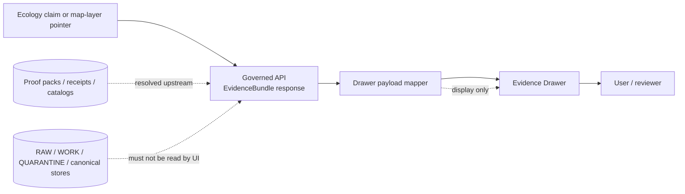

<!-- [KFM_META_BLOCK_V2]
doc_id: kfm://doc/<NEEDS_VERIFICATION_UUID>
title: Ecology Evidence Drawer Payload
type: standard
version: v1
status: draft
owners: @bartytime4life
created: <NEEDS_VERIFICATION_CREATED_DATE>
updated: 2026-04-24
policy_label: <NEEDS_VERIFICATION_POLICY_LABEL>
related: [
  ../../apps/governed_api/ecology/README.md,
  ../runtime/ecology_evidencebundle_resolver.md,
  ../../schemas/ecology/ecology_proof_pack.schema.json,
  ../../schemas/contracts/v1/runtime/runtime_response_envelope.schema.json,
  ../../data/proofs/ecology/README.md
]
tags: [kfm, ecology, evidence-drawer, ui, runtime, proof-pack, maplibre]
notes: [
  "Proposed UI payload contract for ecology Evidence Drawer rendering.",
  "Suggested path: contracts/ui/ecology_evidence_drawer_payload.md.",
  "Owner, doc_id, created date, policy label, and related paths need verification against the mounted repository.",
  "Does not claim Explorer UI integration, governed API route implementation, mapper implementation, or tests exist.",
  "Designed to consume governed API EvidenceBundle responses only."
]
[/KFM_META_BLOCK_V2] -->

<a id="top"></a>

# Ecology Evidence Drawer Payload

UI-facing payload contract for rendering ecology EvidenceBundles in the Evidence Drawer without turning the UI into a source of truth.

> [!NOTE]
> **Status:** `draft`  
> **Truth posture:** `PROPOSED` contract, `UNKNOWN` mounted implementation depth  
> **Suggested path:** `contracts/ui/ecology_evidence_drawer_payload.md`

## Quick links

- [Contract role](#contract-role)
- [Repo fit and boundaries](#repo-fit-and-boundaries)
- [Flow](#flow)
- [Payload contract](#payload-contract)
- [Cite mapping](#cite-mapping)
- [Abstain mapping](#abstain-mapping)
- [UI behavior matrix](#ui-behavior-matrix)
- [Map integration](#map-integration)
- [Fail-closed rules](#fail-closed-rules)
- [Verification checklist](#verification-checklist)

---

## Contract role

The Ecology Evidence Drawer is the user-facing inspection surface for ecological runtime claims. It gives users a controlled way to inspect the evidence, policy, review, and failure state behind a map layer, Focus result, dossier claim, or exported ecology statement.

It should display:

| What the drawer shows | Why it matters |
|---|---|
| Proof-pack identity | Lets reviewers trace the claim to a stable proof input. |
| Cite-or-abstain decision | Keeps citation and abstention visibly distinct. |
| Validation receipts | Shows whether validation evidence is available to display. |
| DCAT / STAC / PROV references | Links the claim to catalog, asset, and provenance surfaces when the governed API provides them. |
| Uncertainty | Prevents ecological summaries from appearing more certain than the support allows. |
| Failure reason | Explains abstention without converting it into a weak claim. |
| Map-layer linkage | Keeps layer interactions connected to evidence without treating renderer state as evidence. |

> [!IMPORTANT]
> The drawer consumes governed API responses. It must not read proof packs, receipts, catalogs, raw data, quarantine data, processed canonical stores, or internal graph/canonical stores directly.

---

## Repo fit and boundaries

| Area | Status | Expected role |
|---|---:|---|
| `contracts/ui/ecology_evidence_drawer_payload.md` | `PROPOSED` | This file; UI payload contract for ecology Evidence Drawer rendering. |
| `../runtime/ecology_evidencebundle_resolver.md` | `NEEDS VERIFICATION` | Upstream runtime contract expected to resolve `EvidenceRef` / `candidate_id` into an EvidenceBundle response. |
| `../../schemas/ecology/ecology_proof_pack.schema.json` | `NEEDS VERIFICATION` | Proof-pack schema expected to define proof-pack identity and validation inputs. |
| `../../schemas/contracts/v1/runtime/runtime_response_envelope.schema.json` | `NEEDS VERIFICATION` | Runtime envelope schema expected to constrain finite outcomes and response shape. |
| `../../apps/governed_api/ecology/README.md` | `NEEDS VERIFICATION` | Governed API surface expected to publish the ecology evidence-bundle endpoint. |
| `../../data/proofs/ecology/README.md` | `NEEDS VERIFICATION` | Proof-pack storage documentation; not read by the UI. |

### Accepted input

The drawer mapper accepts a governed API EvidenceBundle response for one ecological candidate claim.

```text
GET /v1/ecology/evidence-bundles/{candidate_id}
```

`PROPOSED`: The route above is carried forward from the supplied draft. Verify it against the mounted API route registry before treating it as implemented.

### Exclusions

This contract does **not** define:

- proof-pack internals;
- raw, work, quarantine, or processed data access;
- catalog generation;
- receipt generation;
- policy decisions;
- MapLibre styling rules;
- Focus Mode synthesis;
- public release approval.

Those systems may produce inputs or links for the drawer, but the drawer remains a display and navigation contract.

---

## Flow



The browser receives a governed response or prepared drawer payload. It does not reconstruct evidence, infer catalog closure, calculate policy significance, or resolve source-role conflicts.

---

## Payload contract

### Shared top-level shape

| Field | Type | Required | Notes |
|---|---:|---:|---|
| `drawer_id` | string | yes | Stable UI identifier for this drawer payload. |
| `candidate_id` | string | yes | Candidate claim ID from the EvidenceBundle response. |
| `decision` | string | yes | Expected values: `cite` or `abstain` for this contract. |
| `status` | string | yes | Expected values are resolver-defined; examples use `resolved` and `unresolved`. |
| `title` | string | yes | Human-readable drawer heading. |
| `summary` | string | yes | Short, non-authoritative summary of the evidence state. |
| `proof_pack` | object | when `decision = cite` | Includes proof-pack reference and `spec_hash` when supplied by API. |
| `failure` | object | when `decision = abstain` | Includes abstention reason and machine-readable error code when supplied by API. |
| `sections` | array | yes | Ordered display sections. |
| `actions` | object | yes | UI action availability flags. |

### Cite payload example

```json
{
  "drawer_id": "kfm.drawer.ecology.eco_index.example",
  "candidate_id": "eco_index.example",
  "decision": "cite",
  "status": "resolved",
  "title": "Ecology evidence",
  "summary": "Evidence resolved from ecology proof pack.",
  "proof_pack": {
    "ref": "data/proofs/ecology/eco_index.example.proof_pack.json",
    "spec_hash": "aaaaaaaaaaaaaaaaaaaaaaaaaaaaaaaaaaaaaaaaaaaaaaaaaaaaaaaaaaaaaaaa"
  },
  "sections": [
    {
      "section_id": "receipts",
      "title": "Validation receipts",
      "items": []
    },
    {
      "section_id": "catalog_refs",
      "title": "Catalog references",
      "items": []
    },
    {
      "section_id": "uncertainty",
      "title": "Uncertainty",
      "items": []
    }
  ],
  "actions": {
    "copy_citation": true,
    "open_catalog": true,
    "open_provenance": true
  }
}
```

`PROPOSED`: The example is a contract fixture, not proof that a corresponding API response, proof pack, or UI mapper exists.

---

## Cite mapping

When the resolver returns a citable EvidenceBundle, the drawer maps supported fields into display sections without changing their meaning.

| EvidenceBundle field | Drawer field | Display rule |
|---|---|---|
| `data.candidate_id` | `candidate_id` | Preserve exactly. |
| `data.decision` | `decision` | Preserve `cite`; do not infer stronger verification language. |
| `data.status` | `status` | Preserve resolver status. |
| `data.proof_pack_ref` | `proof_pack.ref` | Show as proof-pack reference when supplied. |
| `data.spec_hash` | `proof_pack.spec_hash` | Show as hash text; do not recompute in browser. |
| `data.evidence.receipts` | `sections.receipts.items` | Render receipt items or explicit hidden/empty state. |
| `data.evidence.catalog_refs` | `sections.catalog_refs.items` | Render catalog links only when supplied by API. |
| `data.uncertainty` | `sections.uncertainty.items` | Preserve uncertainty language and values. |

### Cite action gating

| Action | Enable when | Disable when |
|---|---|---|
| `copy_citation` | `decision = cite` and citation/proof metadata is present. | Decision is not `cite`, required citation metadata is absent, or API marks the evidence unavailable. |
| `open_catalog` | API supplies at least one catalog reference. | Catalog refs are omitted, hidden, unresolved, or policy-blocked. |
| `open_provenance` | API supplies provenance references. | Provenance refs are omitted, hidden, unresolved, or policy-blocked. |

---

## Abstain mapping

When the resolver abstains, the drawer still renders. The failure state is not a degraded claim; it is the claim outcome.

```json
{
  "drawer_id": "kfm.drawer.ecology.eco_index.missing",
  "candidate_id": "eco_index.missing",
  "decision": "abstain",
  "status": "unresolved",
  "title": "Ecology evidence unavailable",
  "summary": "KFM abstained because the ecological proof pack could not be resolved.",
  "failure": {
    "reason": "proof_pack_missing",
    "error_code": "ECO_EB_PROOF_PACK_MISSING"
  },
  "sections": [
    {
      "section_id": "failure",
      "title": "Why KFM abstained",
      "items": [
        {
          "label": "Reason",
          "value": "proof_pack_missing"
        }
      ]
    }
  ],
  "actions": {
    "copy_citation": false,
    "open_catalog": false,
    "open_provenance": false
  }
}
```

### Abstain display rules

| Failure condition | Drawer behavior |
|---|---|
| Proof pack missing | Render failure section and disable citation actions. |
| Proof pack validation failed | Render validation failure; do not show “verified.” |
| Catalog/provenance unavailable | Render unavailable state; do not synthesize links. |
| Policy blocks details | Render safe explanation if supplied; do not expose restricted details. |
| Unknown failure reason | Render `UNKNOWN` or API-provided fallback; do not guess. |

---

## UI behavior matrix

| Condition | UI behavior |
|---|---|
| `decision = cite` | Show proof-pack identity, receipts, catalog refs, provenance refs, and uncertainty when supplied by API. |
| `decision = abstain` | Show abstention reason and disable citation actions. |
| Receipts hidden by explicit API flag | Show `receipt details hidden by request`. |
| Catalog refs hidden by explicit API flag | Show `catalog references hidden by request`. |
| Receipts/catalog refs absent without explicit hidden flag | Show unavailable or unresolved state; do not call it hidden. |
| `evidence_drawer_required = true` | Drawer affordance must be visible wherever the claim appears. |
| Map layer present | Drawer remains reachable from layer tooltip, layer panel, or claim selection panel. |
| Focus Mode references the same claim | Focus uses drawer-safe evidence only and links back to the drawer payload. |

---

## Map integration

MapLibre layers carry pointers to governed evidence or drawer payloads. They do not carry proof-pack internals.

```json
{
  "layer_id": "kfm.ecology.vegetation.ndvi_change.v1",
  "evidence_bundle_id": "kfm.evidence.ecology.eco_index.example",
  "drawer_id": "kfm.drawer.ecology.eco_index.example"
}
```

Renderer state must not be treated as evidence. Styling, hover state, selected features, and viewport state may help users navigate, but they do not prove the ecological claim.

---

## Fail-closed rules

The UI must not:

- convert abstention into a soft claim;
- hide failure reason for consequential claims;
- show `verified` when proof-pack validation failed;
- use map styling as proof;
- make catalog/provenance links appear resolved when the API omitted them;
- bypass the governed API to fetch proof-pack internals;
- infer source role, policy posture, or release state in the browser;
- let Focus Mode restate drawer evidence as stronger than the EvidenceBundle supports.

---

## Verification checklist

Use this checklist before treating the contract as implemented.

### Mapper and fixtures

- [ ] Drawer payload mapper implemented from governed API EvidenceBundle response.
- [ ] Cite fixture maps `candidate_id`, `decision`, `status`, `proof_pack_ref`, `spec_hash`, receipts, catalog refs, and uncertainty.
- [ ] Abstain fixture renders failure reason and disables citation actions.
- [ ] Hidden receipts/catalog refs behavior requires an explicit API flag.
- [ ] Missing receipts/catalog refs without a hidden flag render unavailable or unresolved state.

### UI and MapLibre behavior

- [ ] Map layer opens drawer by `evidence_bundle_id` or `drawer_id`.
- [ ] Drawer remains reachable from layer tooltip or layer panel when `evidence_drawer_required = true`.
- [ ] UI never reads proof packs, receipts, raw data, catalog files, or canonical stores directly.
- [ ] Renderer state is never displayed as proof.
- [ ] Accessibility labels distinguish evidence, abstention, hidden details, and unavailable references.

### Focus and governed AI boundary

- [ ] Focus Mode consumes drawer-safe evidence only.
- [ ] Focus Mode links back to Evidence Drawer state for consequential ecology claims.
- [ ] Focus output does not upgrade `abstain` into an answer.

### Open verification items

| Item | Status | Review action |
|---|---:|---|
| `doc_id` | `NEEDS VERIFICATION` | Assign stable KFM document ID. |
| `created` date | `NEEDS VERIFICATION` | Fill from repo creation event or accepted PR date. |
| `policy_label` | `NEEDS VERIFICATION` | Confirm document visibility classification. |
| Related paths | `NEEDS VERIFICATION` | Validate relative links from the final file location. |
| API route | `NEEDS VERIFICATION` | Confirm route name, envelope shape, and resolver contract. |
| Drawer item schema | `UNKNOWN` | Reuse shared UI item contract if one exists; otherwise create one deliberately. |
| Test framework | `UNKNOWN` | Add tests in the repo-native test stack after inspection. |

[Back to top](#top)
