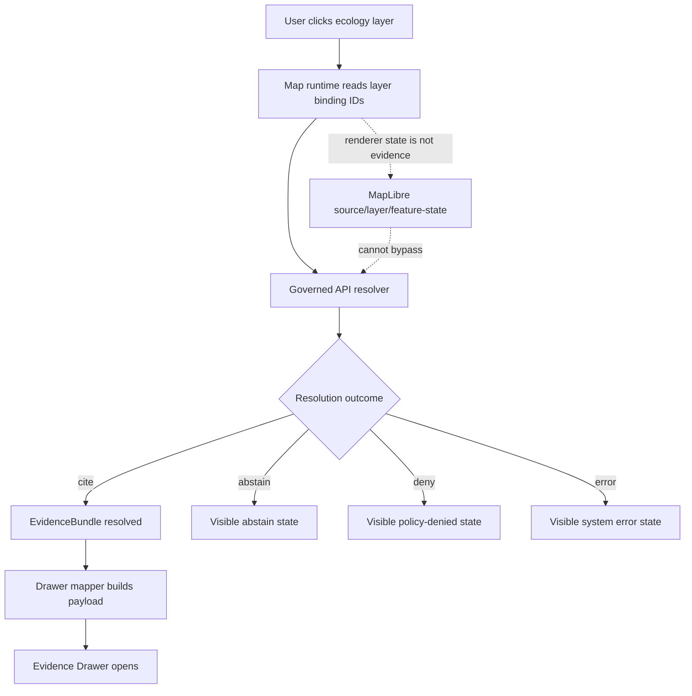

<!-- [KFM_META_BLOCK_V2]
doc_id: kfm://doc/<NEEDS_VERIFICATION_UUID>
title: Ecology MapLibre Layer Binding
type: standard
version: v1
status: draft
owners: @bartytime4life
created: <NEEDS_VERIFICATION_CREATED_DATE>
updated: 2026-04-24
policy_label: <NEEDS_VERIFICATION_POLICY_LABEL>
related: [
  ../../apps/governed_api/ecology/README.md,
  ../runtime/ecology_evidencebundle_resolver.md,
  ./ecology_evidence_drawer_payload.md,
  ../../apps/ui/ecology/evidence_drawer_mapper.py,
  ../../data/registry/ecology/README.md,
  ../../schemas/ecology/ecology_proof_pack.schema.json
]
tags: [kfm, ecology, maplibre, layer-registry, evidencebundle, evidence-drawer, runtime]
notes: [
  "Proposed MapLibre layer binding contract for ecology EvidenceBundles.",
  "Does not claim map implementation exists.",
  "Renderer state is explicitly not evidence authority.",
  "doc_id, created date, policy label, related paths, and implementation homes require repo verification."
]
[/KFM_META_BLOCK_V2] -->

<a id="top"></a>

# Ecology MapLibre Layer Binding

Defines how ecology MapLibre layers bind to governed EvidenceBundles without turning rendered pixels, layer visibility, or feature-state into evidence authority.

> [!NOTE]
> **Status:** draft  
> **Truth posture:** `PROPOSED` contract / `UNKNOWN` implementation  
> **Suggested path:** `contracts/ui/ecology_maplibre_layer_binding.md`  
> **Core rule:** every consequential ecology map interaction must resolve through the governed API before presenting support, limitations, or claims.

## Quick navigation

- [Purpose](#purpose)
- [Boundary summary](#boundary-summary)
- [Layer binding model](#layer-binding-model)
- [Runtime interaction flow](#runtime-interaction-flow)
- [Feature-state discipline](#feature-state-discipline)
- [Fail-closed rules](#fail-closed-rules)
- [Cesium boundary](#cesium-boundary)
- [Definition of done](#definition-of-done)
- [Verification backlog](#verification-backlog)

---

## Purpose

MapLibre may render ecological layers, but it must not become the source of truth.

A consequential ecology layer should preserve this chain:

```text
layer_id
  -> candidate_id
  -> EvidenceBundle
  -> Evidence Drawer
```

That chain makes the layer inspectable. It does **not** make the renderer authoritative. The renderer can carry IDs, request resolution, highlight geometry, and display trust-visible states. It cannot manufacture evidence, infer source authority from styling, or bypass policy and review state.

## Boundary summary

| Concern | Binding rule | Truth posture |
|---|---|---|
| Renderer | MapLibre renders released or otherwise UI-eligible sources and layers. | `PROPOSED` |
| Source of truth | EvidenceBundle and governed resolver responses outrank style JSON, feature properties, and pixels. | `PROPOSED` |
| Public claim display | Public or normal UI surfaces must use governed API resolution before showing consequential support. | `PROPOSED` |
| Abstain behavior | Missing, unresolved, stale, restricted, or conflicted evidence must surface as an explicit state. | `PROPOSED` |
| Implementation status | This document does not claim that a registry, mapper, resolver route, schema, or test already exists. | `UNKNOWN` |

### Consequential ecology layer

For this contract, a layer is **consequential** when a user could reasonably read it as supporting an ecological claim, decision, status, comparison, risk, condition, trend, suitability, occurrence, habitat, vegetation, water/ecology relation, or policy-sensitive location.

> [!IMPORTANT]
> If the layer can change what a user believes about ecology, source authority, or publication status, treat it as consequential.

Non-consequential layers may include purely decorative UI helpers or inert basemap context, but this exception should stay narrow. When classification is uncertain, use the consequential path.

[Back to top](#top)

---

## Layer binding model

### Minimum binding record

```json
{
  "layer_id": "kfm.ecology.vegetation.ndvi_change.v1",
  "candidate_id": "eco_index.example",
  "evidence_bundle_id": "kfm.evidence.ecology.eco_index.example",
  "drawer_id": "kfm.drawer.ecology.eco_index.example",
  "render_type": "raster",
  "time_enabled": true,
  "default_visibility": true,
  "source_ref": "maplibre://sources/ecology/ndvi_change",
  "style_layer_ref": "maplibre://layers/ecology/ndvi_change",
  "spec_hash": "aaaaaaaaaaaaaaaaaaaaaaaaaaaaaaaaaaaaaaaaaaaaaaaaaaaaaaaaaaaaaaaa",
  "status": "active"
}
```

### Field obligations

| Field | Required? | Meaning | Must not be used as |
|---|---:|---|---|
| `layer_id` | Yes | Stable UI/runtime layer identity. | Evidence authority. |
| `candidate_id` | Yes | Ecology candidate or interpreted object to resolve. | A proof of validity. |
| `evidence_bundle_id` | Yes for consequential layers | Resolver target or returned EvidenceBundle identity. | A browser-readable substitute for the bundle. |
| `drawer_id` | Yes for consequential layers | Evidence Drawer payload identity or route target. | A claim itself. |
| `render_type` | Yes | Rendering family such as `raster`, `vector`, `fill`, `line`, `symbol`, or `heatmap`. | Knowledge character. |
| `time_enabled` | Yes | Whether layer interaction participates in time context. | Proof that temporal evidence exists. |
| `default_visibility` | Yes | Initial UI visibility preference. | Publication or review state. |
| `source_ref` | Yes | MapLibre source reference. | Canonical data location. |
| `style_layer_ref` | Yes | MapLibre style-layer reference. | Business rule or evidence route. |
| `spec_hash` | Yes | Deterministic identity anchor for the binding/specification. | A signature or release proof by itself. |
| `status` | Yes | Binding lifecycle marker such as `draft`, `active`, `deprecated`, or `disabled`. | Promotion state unless explicitly mapped. |

### Recommended adjunct metadata

The minimum record above is intentionally small. A later schema may add fields such as `release_state`, `review_state`, `rights_class`, `sensitivity_posture`, `knowledge_character`, `valid_time`, `observed_time`, `freshness_class`, `generalization_transform_ref`, and `layer_manifest_ref`.

Those fields are **recommended** only when they are backed by verified contracts. Until then, they belong in a registry or governed API response, not in ad hoc browser assumptions.

[Back to top](#top)

---

## Runtime interaction flow



### Required runtime behavior

| Requirement | Rule |
|---|---|
| Evidence binding | Every consequential layer must include or resolve to `evidence_bundle_id`. |
| Drawer binding | Every consequential layer must include or resolve to `drawer_id`. |
| Deterministic identity | The layer binding must carry `spec_hash`. |
| Runtime resolution | The layer panel, popup, drawer trigger, or click handler must call the governed API before presenting support. |
| Renderer discipline | Rendered pixels, color ramps, layer visibility, and feature-state are not evidence. |
| Abstain visibility | Unresolved evidence must show an explicit abstain state, not a silent failure or empty drawer. |
| Policy visibility | Restricted or denied material must show a bounded policy state without leaking protected details. |
| Time discipline | Time-enabled layers must pass the active time context to the resolver rather than filtering claims only in the browser. |

### Outcome-to-UI mapping

| Resolver outcome | Drawer behavior | Map behavior | User-facing posture |
|---|---|---|---|
| `cite` | Open drawer with EvidenceBundle-backed support and limitations. | Highlight selected feature or layer region if safe. | Supported with traceable evidence. |
| `abstain` | Open or show drawer shell with reason and missing requirement. | Keep layer visible if appropriate, but mark claim unresolved. | Not enough evidence to support a claim. |
| `deny` | Show policy-denied state and permitted explanation only. | Avoid revealing restricted geometry or sensitive details. | Access or release not allowed. |
| `error` | Show operational error state with retry/support affordance. | Do not downgrade to unsupported claim. | System fault, not evidence failure. |

[Back to top](#top)

---

## Feature-state discipline

MapLibre `feature-state` may help highlight interactions, cache lightweight IDs, or reflect a resolver outcome. It must remain a UI state channel, not an evidence channel.

### Allowed feature-state example

```json
{
  "candidate_id": "eco_index.example",
  "evidence_bundle_id": "kfm.evidence.ecology.eco_index.example",
  "drawer_id": "kfm.drawer.ecology.eco_index.example",
  "decision": "cite"
}
```

### Feature-state limits

| Allowed | Not allowed |
|---|---|
| Carry stable IDs needed to request governed resolution. | Store full EvidenceBundles in browser feature-state. |
| Cache a resolved interaction outcome for display. | Treat cached outcome as durable release state. |
| Drive hover, selected, muted, stale, or abstain styling. | Infer support from paint expressions or color ramps. |
| Hold public-safe summary chips returned by the governed API. | Read proof packs, RAW, WORK, QUARANTINE, or canonical stores directly. |

[Back to top](#top)

---

## Registry and mapper expectations

This document expects, but does not confirm, adjacent contracts and implementation surfaces.

| Surface | Expected responsibility | Status |
|---|---|---|
| `../../data/registry/ecology/README.md` | Explains ecology source/layer registry policy and admission rules. | `NEEDS VERIFICATION` |
| `../runtime/ecology_evidencebundle_resolver.md` | Defines governed EvidenceBundle resolution behavior. | `NEEDS VERIFICATION` |
| `./ecology_evidence_drawer_payload.md` | Defines payload accepted by the Evidence Drawer. | `NEEDS VERIFICATION` |
| `../../apps/governed_api/ecology/README.md` | Documents API routes, outcomes, and failure states. | `NEEDS VERIFICATION` |
| `../../apps/ui/ecology/evidence_drawer_mapper.py` | Maps resolver output to drawer-safe UI payloads. | `NEEDS VERIFICATION` |
| `../../schemas/ecology/ecology_proof_pack.schema.json` | Describes proof-pack shape, if this path is the verified schema home. | `NEEDS VERIFICATION` |

> [!CAUTION]
> These paths are related references from the proposed target location. They should be verified against the mounted repository before commit.

[Back to top](#top)

---

## Fail-closed rules

The map UI must not:

- show a supported ecological claim without an EvidenceBundle;
- treat layer visibility as proof;
- infer evidence from color ramps, opacity, legends, or symbol size;
- hide `abstain`, `deny`, `restricted`, `stale`, `conflict`, or `error` states;
- fetch proof packs directly from the browser;
- read RAW, WORK, QUARANTINE, canonical stores, graph stores, model runtimes, or object storage directly;
- bypass the governed API for claim resolution;
- allow plugin, wrapper, or protocol-adapter behavior to define KFM doctrine;
- enable Cesium/3D escalation unless the layer registry justifies it.

[Back to top](#top)

---

## Cesium boundary

Cesium or another 3D surface may be used only when 3D carries explanatory burden and preserves the same evidence, release, drawer, and policy continuity.

| 3D use | Allowed? | Reason |
|---|---:|---|
| Terrain-driven watershed explanation | Yes | Terrain can carry real explanatory burden. |
| Flood depth or elevation context | Yes | 3D may clarify vertical relationships when evidence supports it. |
| Habitat structure where vertical context is evidence-backed | Conditional | Requires registry justification and drawer continuity. |
| Visual novelty only | No | Spectacle is not a KFM burden. |
| Proof substitute | No | 3D visualization cannot replace EvidenceBundle resolution. |
| Restricted-location reveal | No | 3D must not weaken sensitivity or geoprivacy controls. |

[Back to top](#top)

---

## Definition of done

A later implementation should satisfy these checks before this binding contract is treated as operational.

- [ ] Layer binding schema created or mapped to the verified schema home.
- [ ] Map layer registry references `candidate_id` for consequential ecology layers.
- [ ] Consequential layer bindings require `evidence_bundle_id`, `drawer_id`, and `spec_hash`.
- [ ] Map click resolves through the governed API before showing support claims.
- [ ] Evidence Drawer opens from layer interaction with EvidenceBundle-backed payload.
- [ ] `abstain`, `deny`, `restricted`, `stale`, `conflict`, and `error` states are visible and tested.
- [ ] No direct proof-pack reads occur in UI code.
- [ ] No browser code reads RAW, WORK, QUARANTINE, canonical stores, graph stores, vector indexes, model runtimes, or object storage directly.
- [ ] Cesium/3D usage requires registry justification and preserves drawer continuity.
- [ ] Tests cover at least: cite interaction, abstain interaction, missing `evidence_bundle_id`, policy-denied interaction, stale evidence, invalid payload, and renderer-only feature-state.

[Back to top](#top)

---

## Verification backlog

| Item | Why it matters | Status |
|---|---|---|
| Confirm `doc_id` UUID. | Required for stable document identity. | `NEEDS VERIFICATION` |
| Confirm `created` date. | Required for metadata integrity. | `NEEDS VERIFICATION` |
| Confirm `policy_label`. | Required before publication or semi-public use. | `NEEDS VERIFICATION` |
| Confirm target path. | Suggested path is `contracts/ui/ecology_maplibre_layer_binding.md`; repo convention may differ. | `NEEDS VERIFICATION` |
| Confirm related file paths. | Relative links are proposed from the suggested target path. | `NEEDS VERIFICATION` |
| Confirm schema home. | KFM materials repeatedly flag schema-home ambiguity. | `NEEDS VERIFICATION` |
| Confirm resolver route names and outcome enum. | This doc describes behavior, not verified API routes. | `NEEDS VERIFICATION` |
| Confirm `spec_hash` canonicalization rule. | Deterministic identity depends on a consistent hash recipe. | `NEEDS VERIFICATION` |
| Confirm MapLibre adapter/module boundary. | Needed to prevent UI components from making doctrine-bearing runtime assumptions. | `NEEDS VERIFICATION` |
| Add fixtures and tests. | Required to move from proposed contract to operational confidence. | `NEEDS VERIFICATION` |

[Back to top](#top)
