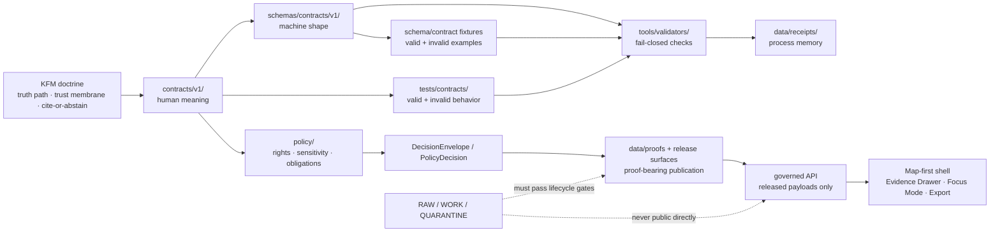

<!-- [KFM_META_BLOCK_V2]
doc_id: kfm://doc/NEEDS-VERIFICATION
title: Contracts v1
type: standard
version: v1
status: draft
owners: @bartytime4life
created: 2026-04-27
updated: 2026-04-27
policy_label: NEEDS-VERIFICATION
related: [../README.md, ../../README.md, ../../schemas/contracts/README.md, ../../schemas/contracts/v1/README.md, ../../policy/README.md, ../../tests/contracts/README.md, ../../tools/validators/README.md]
tags: [kfm, contracts, v1, trust-objects, governed-contracts]
notes: [Generated draft for target path; mounted checkout and document registry were not available; doc_id and policy_label need verification; keep synchronized with schema-side v1 lane.]
[/KFM_META_BLOCK_V2] -->

<a id="top"></a>

# Contracts v1

Versioned human-readable contract surface for KFM v1 trust-object meanings, compatibility rules, and evidence-to-release boundaries.

> [!IMPORTANT]
> **Status:** `experimental` · **Owners:** `@bartytime4life` · **Path:** `contracts/v1/README.md`  
> **Primary job:** define v1 semantic contract meaning before schemas, validators, policy, runtime envelopes, releases, or UI trust surfaces rely on it.  
> **Evidence posture:** doctrine-grounded; active-checkout inventory, CODEOWNERS, schema-home ADR, and merge-blocking enforcement remain **NEEDS VERIFICATION**.
>
> 
> 
> 
> 
> 
> 
> 
>
> **Quick jumps:** [Scope](#scope) · [Repo fit](#repo-fit) · [Inputs](#accepted-inputs) · [Exclusions](#exclusions) · [Directory tree](#directory-tree) · [Quickstart](#quickstart) · [Contract map](#contract-family-map) · [Diagram](#diagram) · [Review gates](#review-gates) · [FAQ](#faq) · [Appendix](#appendix)

---

## Scope

`contracts/v1/` is the **versioned human-readable contract lane** for KFM v1 trust objects.

It answers one narrow question:

> “What does this object mean in KFM, what must remain compatible, and what downstream trust surfaces may rely on before the object is used for claims, review, release, correction, or runtime response?”

This lane does **not** decide whether an object is publishable, safe, released, sensitive, authoritative, or executable. Those decisions belong to policy, validators, source review, catalog closure, receipts, proof packs, release manifests, and governed APIs.

### Current truth posture

| Claim | Label | Working reading |
|---|---:|---|
| KFM needs stable contract meanings for trust-bearing object families. | **CONFIRMED doctrine** | Use this lane to keep object semantics explicit and reviewable. |
| `contracts/` owns human-readable meaning and compatibility language. | **CONFIRMED doctrine / README intent** | `contracts/v1/` narrows that responsibility to v1 families. |
| `schemas/contracts/v1/` owns machine-checkable shape. | **CONFIRMED adjacent surface / NEEDS VERIFICATION for enforcement** | This README must point there without duplicating schema authority. |
| `contracts/v1/README.md` exists in the mounted active checkout. | **NEEDS VERIFICATION** | The target path is being authored here; merge with any existing file if one is found. |
| v1 contracts are enforcement-grade. | **UNKNOWN** | Do not claim enforcement until schemas, fixtures, validators, CI, and emitted examples are verified. |

[Back to top](#top)

---

## Repo fit

| Direction | Surface | Relationship |
|---|---|---|
| Parent contract lane | [`../README.md`](../README.md) | Defines the broader `contracts/` boundary: meaning, field intent, lifecycle expectations, and compatibility posture. |
| Repository root | [`../../README.md`](../../README.md) | Carries KFM identity, truth path, map/AI boundaries, and repo-wide evidence posture. |
| Schema-side v1 lane | [`../../schemas/contracts/v1/README.md`](../../schemas/contracts/v1/README.md) | Machine-readable v1 schema families; must not silently redefine meaning. |
| Schema-side parent | [`../../schemas/contracts/README.md`](../../schemas/contracts/README.md) | Explains schema-side contract boundary and schema-home uncertainty. |
| Policy lane | `../../policy/README.md` | Owns allow/deny/abstain/hold logic, rights, sensitivity, obligations, and publication controls. |
| Contract tests | `../../tests/contracts/README.md` | Proves valid/invalid examples, negative paths, compatibility, and drift behavior. |
| Validators | `../../tools/validators/README.md` | Executes deterministic checks and emits reviewable validation reports. |
| Process memory | `../../data/receipts/README.md` | Stores run, ingest, validation, AI, redaction, or projection receipt instances. |
| Release proof | `../../data/proofs/README.md` | Stores release-grade proof objects, not semantic contract definitions. |

### Division of labor

| Surface | Owns | Must not silently own |
|---|---|---|
| `contracts/v1/` | Human-readable v1 meaning, invariants, compatibility posture, field intent, lifecycle role. | JSON Schema bodies, policy logic, emitted receipts, release proof packs, runtime code. |
| `schemas/contracts/v1/` | Machine-checkable shape for v1 objects. | Semantic doctrine, source authority, policy approval, review sign-off. |
| `policy/` | Permission, denial, obligations, rights, sensitivity, and publication logic. | Generic object meaning or schema ownership. |
| `tests/contracts/` | Valid/invalid behavior, failure examples, drift checks. | Canonical contract meaning. |
| `tools/validators/` | Executable validation and reviewable reports. | Hidden policy or hidden publication authority. |
| `data/receipts/` | Process-memory instances. | Proof packs, contracts, or canonical truth. |
| `data/proofs/` | Release-significant proof and verification artifacts. | Source evidence, schemas, or runtime route behavior. |
| Governed API / UI | Released, policy-safe payload presentation. | Canonical evidence authority or contract meaning. |

> [!CAUTION]
> Do not resolve `contracts/` versus `schemas/contracts/` authority by duplication. Resolve the role split explicitly, then keep semantic docs, schemas, fixtures, validators, policy, and runtime proof synchronized.

[Back to top](#top)

---

## Accepted inputs

This lane accepts materials that define **v1 human contract meaning**.

| Accepted input | Examples | Required posture |
|---|---|---|
| Object-family meaning | `SourceDescriptor`, `EvidenceBundle`, `DecisionEnvelope`, `ReleaseManifest` | Must explain purpose, lifecycle position, and downstream consumers. |
| Field intent and linkage semantics | `evidence_refs`, `policy_decision_ref`, `release_ref`, `correction_ref` | Must state what the field means, not just that it exists. |
| Compatibility and versioning rules | additive fields, breaking enum changes, v2 successor notes | Must state migration and rollback expectations. |
| Contract cards | object status, upstream authority, storage home, schema home, fixture home | Must use truth labels where implementation is unverified. |
| Human-readable examples | illustrative object cards, review prompts, failure modes | Must not be mistaken for executable schema or fixture proof. |
| Cross-surface mapping | links to schema, policy, validator, fixture, receipt, proof, UI payload | Must preserve the division of labor. |
| ADR and migration notes | schema-home resolution, renamed fields, moved contract homes | Must not silently supersede released consumers. |

> [!TIP]
> A healthy v1 contract PR usually touches more than this README: it links or updates the relevant schema, fixtures, validator notes, policy adjacency, downstream consumer notes, and review checklist.

[Back to top](#top)

---

## Exclusions

| Does **not** belong here | Better home | Why |
|---|---|---|
| JSON Schema bodies or schema-only `$defs` | `../../schemas/contracts/v1/` | Machine shape belongs in the schema-side lane. |
| Policy bundles, Rego rules, deny logic, obligation law | `../../policy/` | Policy decides admissibility; contracts define meaning. |
| Valid/invalid fixture payloads | `../../tests/contracts/` or verified fixture home | Fixtures prove behavior and should not blur into semantic docs. |
| Run receipts, ingest receipts, validation receipts, AI receipts | `../../data/receipts/` | Receipts are process-memory instances, not contract definitions. |
| Release proof packs, signatures, attestations, public proof objects | `../../data/proofs/` or release/proof lanes | Proof objects are emitted evidence, not contract meaning. |
| Runtime API handlers, UI components, model adapters | `../../apps/`, `../../packages/`, or verified implementation lane | Code consumes contracts; it does not live here. |
| Raw source payloads, derived tiles, graph projections, search indexes | Governed `data/` lifecycle zones | Source and derivative artifacts are not contract authority. |
| Exploratory packet prose copied as canon | `../../docs/intake/`, lineage, or archive surface | Ideas must be promoted before becoming contract law. |
| Claims that v1 is fully enforced end to end | Nowhere until verified | Enforcement requires schema bodies, fixtures, validators, CI, policy, and emitted artifacts. |

[Back to top](#top)

---

## Directory tree

### Starter tree — proposed until active checkout confirms it

```text
contracts/v1/
├── README.md
├── source/                 # SourceDescriptor meaning
├── data/                   # DatasetVersion and data-state meanings
├── evidence/               # EvidenceRef / EvidenceBundle meanings
├── policy/                 # DecisionEnvelope / PolicyDecision meanings
├── release/                # ReleaseManifest and promotion-adjacent meanings
├── runtime/                # RuntimeResponseEnvelope and runtime outcome meanings
├── correction/             # CorrectionNotice and withdrawal/supersession meanings
├── receipts/               # RunReceipt / AIReceipt semantic contract notes
├── review/                 # ReviewRecord / steward sign-off semantics
└── vocab/                  # Human-readable vocabulary notes, if not owned elsewhere
```

> [!WARNING]
> The tree above is a **planning map**, not current implementation evidence. Before committing child folders, run the inspection commands below and reconcile with any existing `contracts/`, `schemas/contracts/`, `contracts/vocab/`, and schema-side vocab lanes.

### Adjacent machine-side shape

```text
schemas/contracts/v1/
├── README.md
├── common/
├── correction/
├── data/
├── evidence/
├── policy/
├── release/
├── runtime/
└── source/
```

[Back to top](#top)

---

## Quickstart

Run these commands from the repository root before adding, reviewing, or relying on a v1 contract.

### 1. Confirm the active tree

```bash
git status --short
git branch --show-current

find contracts -maxdepth 4 -type f | sort
find schemas/contracts -maxdepth 5 -type f 2>/dev/null | sort
```

### 2. Reopen the authority docs together

```bash
sed -n '1,260p' contracts/README.md
sed -n '1,260p' contracts/v1/README.md
sed -n '1,260p' schemas/README.md
sed -n '1,260p' schemas/contracts/README.md
sed -n '1,260p' schemas/contracts/v1/README.md
```

### 3. Search before inventing a new object family

```bash
git grep -nE \
  'SourceDescriptor|SourceIntakeRecord|DatasetVersion|EvidenceRef|EvidenceBundle|DecisionEnvelope|PolicyDecision|ReleaseManifest|RuntimeResponseEnvelope|CorrectionNotice|RunReceipt|run_receipt|AIReceipt|ai_receipt|ValidationReport|ReviewRecord|LayerManifest|EvidenceDrawerPayload|FocusModePayload' \
  -- contracts schemas policy tests tools docs data apps packages .github 2>/dev/null || true
```

### 4. Inspect verification neighbors

```bash
find policy tests tools/validators data/receipts data/proofs -maxdepth 4 -type f 2>/dev/null | sort
```

### 5. Parse schema-side JSON before claiming alignment

```bash
python - <<'PY'
import json
from pathlib import Path

root = Path("schemas/contracts/v1")
if not root.exists():
    print("NEEDS VERIFICATION: schemas/contracts/v1 not present in this checkout")
    raise SystemExit(0)

failures = []
for path in sorted(root.rglob("*.json")):
    try:
        json.loads(path.read_text(encoding="utf-8"))
    except Exception as exc:
        failures.append((str(path), str(exc)))

if failures:
    for path, error in failures:
        print(f"FAIL {path}: {error}")
    raise SystemExit(1)

print("OK: schemas/contracts/v1 JSON files parse")
PY
```

[Back to top](#top)

---

## Contract family map

### Core v1 trust-object families

| Family | Contract role | Truth-path position | Minimum companion burden |
|---|---|---|---|
| `SourceDescriptor` | Declares source identity, authority role, rights posture, cadence, support, citation guidance, and admission expectations. | Source edge / RAW admission | Source registry entry, valid/invalid descriptors, source-role policy, connector/admission validator. |
| `SourceIntakeRecord` | Records source-intake state without turning intake into publication approval. | Source edge / RAW / WORK | Intake fixture, review obligation note, quarantine behavior. |
| `DatasetVersion` | Names a versioned candidate, processed dataset, or release-candidate subject set. | PROCESSED / release candidate | Version fixture, lineage checks, catalog and release links. |
| `EvidenceRef` | Stable pointer to evidence support that can resolve into an `EvidenceBundle`. | CATALOG / TRIPLET / PUBLISHED | Resolver behavior, dangling-ref negative tests. |
| `EvidenceBundle` | Packages support for a claim, feature, story, export, UI drawer, or runtime answer. | CATALOG / PUBLISHED / shell trust | Citation-resolution tests, rights/sensitivity checks, correction-lineage checks. |
| `DecisionEnvelope` | Carries a finite policy, review, promotion, or gate decision with reasons and obligations. | Policy / review / promotion gate | Outcome fixtures, reason/obligation registry, policy test links. |
| `PolicyDecision` | Narrower policy-result object where the repo separates policy output from wider decision envelopes. | Policy boundary | Deny/hold/abstain negative tests and obligation links. |
| `ReleaseManifest` | States what was released, with assets, digests, evidence basis, review state, proof refs, rollback target, and correction posture. | Promotion / PUBLISHED | Proof-pack links, catalog closure, release fixture, rollback drill. |
| `RuntimeResponseEnvelope` | Accountable outward response wrapper for governed API, Focus Mode, Evidence Drawer, or export surfaces. | Governed API / UI trust surface | Golden examples for `ANSWER`, `ABSTAIN`, `DENY`, `ERROR`; citation validation. |
| `CorrectionNotice` | Preserves visible correction, supersession, withdrawal, replacement, stale-surface, or rollback lineage. | Post-publication correction | Correction fixture, stale-state drill, release/correction crosslinks. |

### Candidate v1 companions

| Family | Why it belongs near v1 contracts | Current posture |
|---|---|---|
| `RunReceipt` / `run_receipt` | Process-memory object needed for reproducible validation, transformation, promotion, and rollback traces. | **CONFIRMED concept / NEEDS VERIFICATION schema home** |
| `AIReceipt` / `ai_receipt` | Captures bounded model-runtime activity without storing chain-of-thought or making model output proof. | **CONFIRMED concept / NEEDS VERIFICATION schema home** |
| `ValidationReport` | Carries machine-readable validation results and failure modes. | **PROPOSED / NEEDS VERIFICATION** |
| `ReviewRecord` | Captures steward/reviewer decision state and separation-of-duty evidence. | **PROPOSED / NEEDS VERIFICATION** |
| `LayerManifest` | Connects map layer meaning, delivery artifact, style, provenance, sensitivity, and release state. | **PROPOSED / NEEDS VERIFICATION** |
| `EvidenceDrawerPayload` | Makes UI evidence support visible for consequential claims. | **PROPOSED / NEEDS VERIFICATION** |
| `FocusModePayload` | Keeps bounded synthesis downstream of evidence, policy, release, and citation validation. | **PROPOSED / NEEDS VERIFICATION** |

### Outcome grammar

| Surface | Candidate outcomes | Meaning |
|---|---|---|
| Runtime / public response | `ANSWER`, `ABSTAIN`, `DENY`, `ERROR` | What the user receives. |
| Promotion / review gate | `PASS`, `HOLD`, `DENY`, `ERROR` | What the gate decides. |
| Release-state event | `PROMOTED`, `BLOCKED`, `WITHDRAWN`, `SUPERSEDED`, `REVERTED` | What happened to a candidate or release. |

> [!IMPORTANT]
> Final enum homes and exact names must match repo vocabularies, schemas, policy tests, and validator fixtures before merge.

[Back to top](#top)

---

## Contract card pattern

Use object cards when a family becomes important enough to affect schemas, fixtures, validators, policy, runtime, release, correction, or UI behavior.

```markdown
## ObjectName

| Field | Value |
|---|---|
| Status | CONFIRMED concept / PROPOSED implementation / NEEDS VERIFICATION |
| Purpose | What this object means in KFM |
| Upstream authority | Doctrine, source registry, domain lane, ADR, or governing doc |
| Truth-path position | Source edge, RAW, WORK, QUARANTINE, PROCESSED, CATALOG, TRIPLET, PUBLISHED, governed API, or UI |
| Downstream consumers | Schemas, fixtures, validators, policy, runtime, UI, receipts, proofs |
| Storage home | Where emitted instances live, if any |
| Schema home | Chosen canonical schema path or NEEDS VERIFICATION |
| Fixture home | Valid/invalid fixture path or NEEDS VERIFICATION |
| Validator | Entrypoint or validator runbook |
| Policy adjacency | Allow/deny/obligation rules affected |
| Compatibility note | Breaking / additive / docs-only |
| Open questions | What must be verified before promotion |
```

[Back to top](#top)

---

## Diagram



Reading rule: `contracts/v1/` makes meaning inspectable. It does not bypass schemas, policy, validation, evidence resolution, review, promotion, correction, or release state.

[Back to top](#top)

---

## Review gates

A PR touching `contracts/v1/` should not merge until these checks are answered.

| Gate | Reviewer question | Pass condition |
|---|---|---|
| Authority | Is semantic meaning linked to the correct parent or ADR? | `contracts/` and schema-side docs are reconciled. |
| Schema home | Is the machine shape home verified or explicitly marked **NEEDS VERIFICATION**? | No silent duplicate definitions. |
| Object family | Does the change reuse a known KFM family where possible? | New families have a reason and compatibility note. |
| Fixtures | Are valid and invalid examples present or explicitly deferred? | Highest-risk negative path is covered or tracked. |
| Policy | Are rights, sensitivity, release, and runtime denial implications linked? | Policy adjacency is visible. |
| Validation | Is the validator command real, documented, and runnable in the target repo? | No invented CI or test enforcement. |
| Runtime | Are outward responses still behind governed APIs and finite envelopes? | No direct public raw/canonical/model path. |
| Release | Are receipts, proofs, manifests, and catalog records kept separate from definitions? | No emitted instance stored in the contract lane. |
| Rollback | Does a breaking change include migration, successor, or deprecation path? | No silent v1 mutation. |
| Documentation | Did related docs change when behavior changed? | README, schema map, fixtures, validators, and policy notes stay synchronized. |

### Definition of done

- [ ] The active checkout confirms this path or the PR creates it deliberately.
- [ ] The object meaning is stated in human-readable form.
- [ ] The machine schema path is linked or marked **NEEDS VERIFICATION**.
- [ ] At least one valid and one invalid fixture are linked or explicitly deferred.
- [ ] Validator or test entrypoint is linked or marked **NEEDS VERIFICATION**.
- [ ] Rights, sensitivity, policy, review, and release implications are visible where relevant.
- [ ] Runtime-facing objects use finite outcomes and cite evidence support.
- [ ] Release-facing objects include correction and rollback posture.
- [ ] No contract text claims enforcement that tests, workflows, or emitted artifacts do not prove.
- [ ] This README’s family map is updated when v1 families are added, renamed, or materially changed.

[Back to top](#top)

---

## Compatibility rules

| Change | Compatibility impact | Required response |
|---|---|---|
| Add optional descriptive field without changing meaning | Usually non-breaking | Update contract card, schema, and fixtures if surfaced. |
| Add required field | Breaking | ADR or migration note, invalid fixture, validator update, downstream consumer review. |
| Remove or rename a field | Breaking | Prefer v2 or deprecation window. |
| Change field meaning without changing field name | Breaking | Treat as semantic replacement. |
| Narrow enum or controlled vocabulary | Usually breaking | Coordinate with vocab, policy, fixtures, validators, and runtime consumers. |
| Widen enum or reason code set | Review-required | Confirm policy and UI negative-state handling. |
| Move canonical home | Breaking unless governed | ADR, aliases, migration notes, and rollback plan required. |
| Clarify prose only | Docs-only | Still verify no validator, policy, or fixture behavior changed. |

> [!CAUTION]
> If a change affects public trust cues, Evidence Drawer, Focus Mode, release/correction behavior, or publication posture, treat it as contract-impacting even when the schema file does not change.

[Back to top](#top)

---

## FAQ

### Is `contracts/v1/` the canonical v1 contract home?

**NEEDS VERIFICATION.** This README defines the intended human-readable v1 contract boundary for the target path. Final authority must be verified in the active checkout or settled by ADR.

### Can a schema replace this contract?

No. A schema can validate shape. It cannot explain source role, evidence burden, review obligations, rights, sensitivity, release posture, or correction lineage by itself.

### Can a runtime response cite a contract instead of evidence?

No. Runtime responses may validate against contracts and schemas, but consequential claims must resolve to admissible evidence through `EvidenceRef`, `EvidenceBundle`, or an equivalent governed evidence object.

### Should receipts live here?

No. This lane may describe what a receipt means. Actual receipt instances belong in a verified receipt storage lane such as `data/receipts/`.

### What should happen if the active repo already has a different v1 contract layout?

Preserve the verified layout, compare responsibilities, and merge this README as a patch. Do not force a duplicate `contracts/v1/` authority if a stronger local convention already exists.

[Back to top](#top)

---

## Open verification backlog

| Check | Status | Why it matters |
|---|---:|---|
| Mounted active checkout inventory | **NEEDS VERIFICATION** | Confirms whether this target path already exists and what anchors must be preserved. |
| Document registry `doc_id` | **NEEDS VERIFICATION** | Prevents fabricated KFM document identifiers. |
| Policy label | **NEEDS VERIFICATION** | Public repository visibility is not the same as an approved policy label. |
| CODEOWNERS coverage for `contracts/` and `schemas/` | **NEEDS VERIFICATION** | Confirms owner and review burden. |
| Schema-home ADR | **NEEDS VERIFICATION** | Prevents parallel truth surfaces. |
| Fixture home | **NEEDS VERIFICATION** | Determines where valid/invalid examples belong. |
| Validator command | **NEEDS VERIFICATION** | Distinguishes documentation intent from executable enforcement. |
| Workflow / branch enforcement | **UNKNOWN** | Workflow YAML and branch protection were not verified from a mounted checkout. |
| Emitted receipt/proof examples | **UNKNOWN** | Needed before claiming end-to-end operational maturity. |

[Back to top](#top)

---

## Appendix

<details>
<summary>Appendix A — Reviewer prompts</summary>

Use these prompts when reviewing `contracts/v1/` changes:

- Does the contract define meaning, or is it accidentally writing policy?
- Does the schema validate structure, or is it accidentally redefining doctrine?
- Are reason codes and obligation codes drawn from a controlled registry?
- Does every runtime or release object point back to evidence and policy state?
- Are rights, sensitivity, review state, and correction posture represented where needed?
- Is a placeholder schema being described as enforceable?
- Are valid and invalid fixtures realistic enough to catch the failure this contract is meant to prevent?
- Does the change preserve `RAW -> WORK / QUARANTINE -> PROCESSED -> CATALOG / TRIPLET -> PUBLISHED`?
- Would a normal public client still use governed APIs and released artifacts rather than canonical/internal stores?
- Does the change keep AI, MapLibre, tiles, search, summaries, graphs, and scenes downstream of evidence?

</details>

<details>
<summary>Appendix B — Contract family glossary</summary>

| Term | Working meaning |
|---|---|
| Semantic contract | Human-readable object meaning, lifecycle role, invariants, compatibility, and review guidance. |
| Machine contract | Schema or executable definition that validates object shape. |
| Fixture | Valid or invalid example used to prove contract behavior. |
| Receipt | Process-memory record of what ran, with what inputs, outputs, checks, and failures. |
| Proof | Release-significant evidence object, not merely an execution log. |
| EvidenceBundle | Governed support package connecting a claim, feature, story, export, or answer to evidence. |
| DecisionEnvelope | Structured decision result with outcome, reasons, obligations, and policy/review context. |
| RuntimeResponseEnvelope | Governed outward response shape for answer, abstain, deny, or error behavior. |
| ReleaseManifest | Object that states what was released, under what identity, evidence basis, and rollback/correction posture. |
| CorrectionNotice | Visible record of correction, supersession, withdrawal, replacement, or rollback lineage. |

</details>
